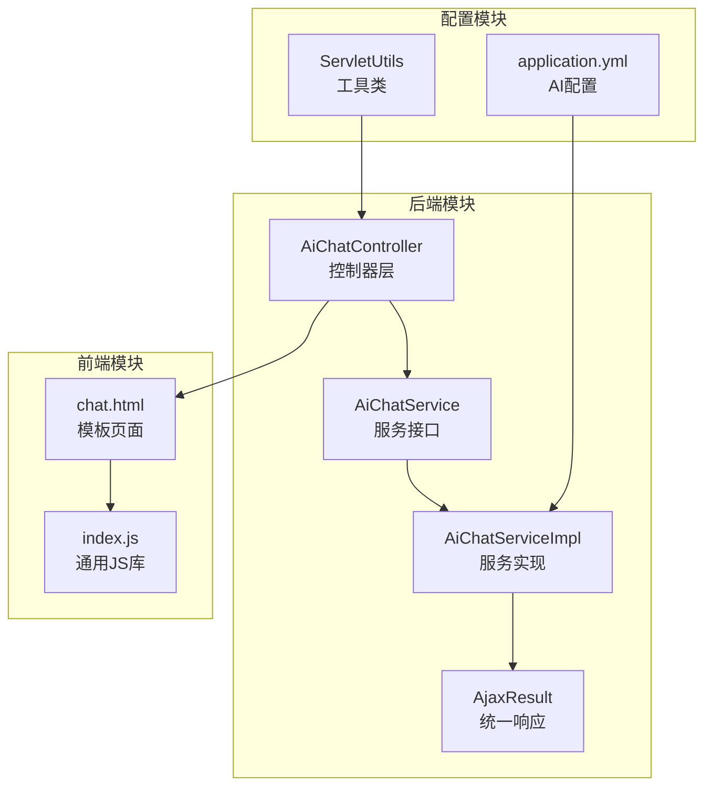
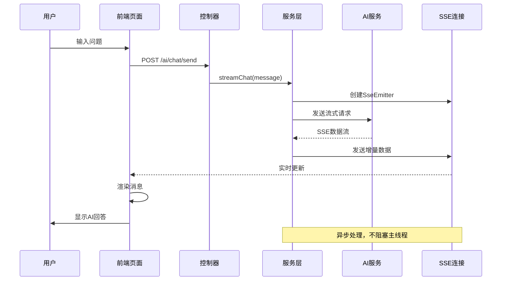
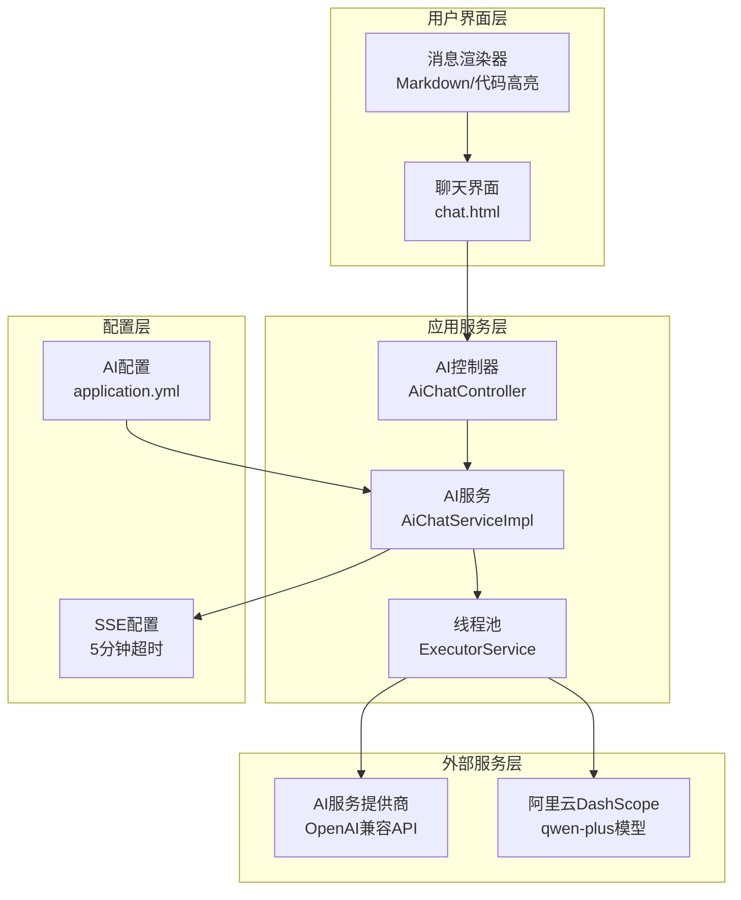
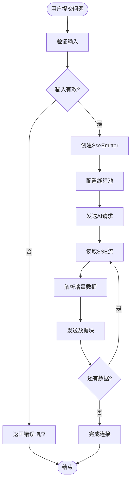
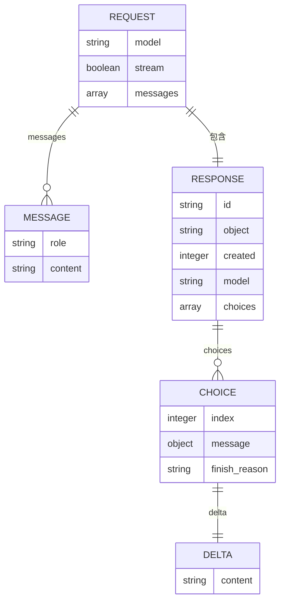
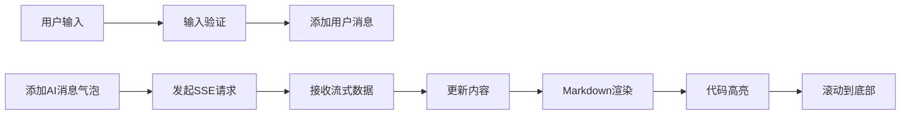
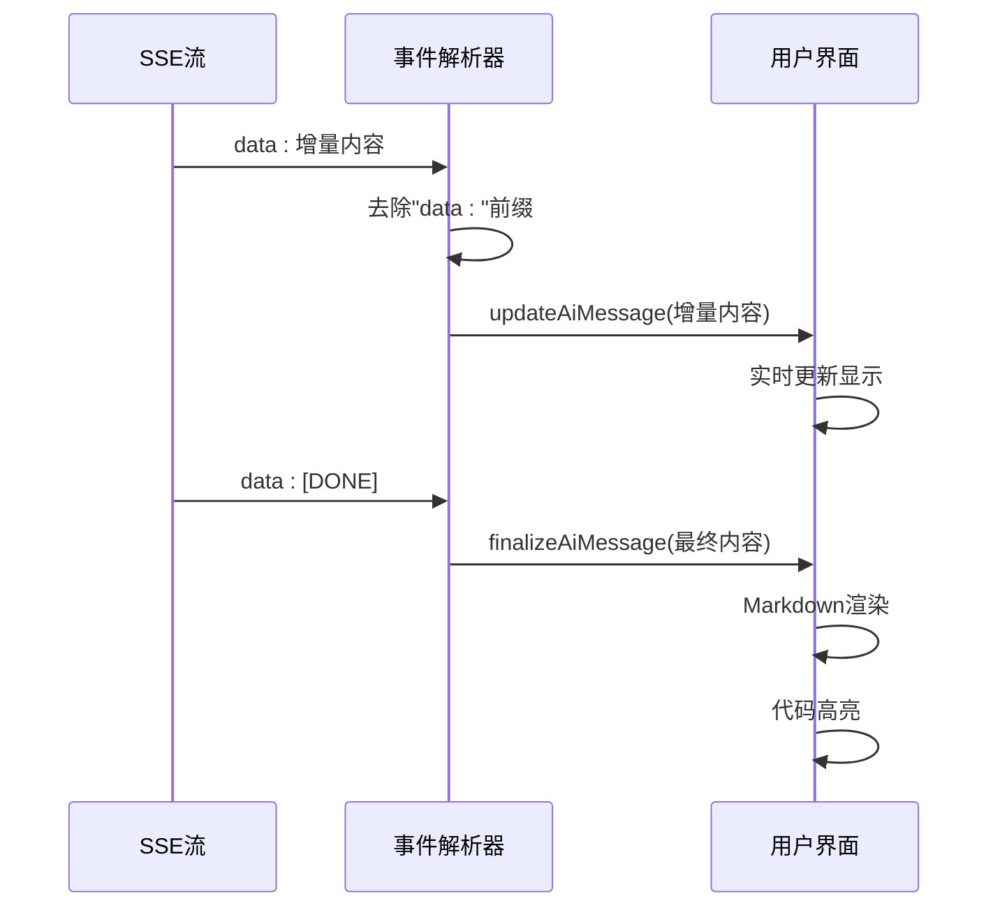
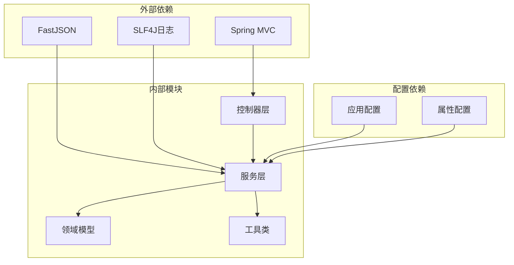
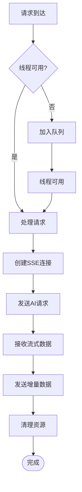

# AI智能问答模块

<cite>
**本文档引用的文件**
- [AiChatController.java](file://ruoyi-admin/src/main/java/com/ruoyi/ai/controller/AiChatController.java)
- [AiChatService.java](file://ruoyi-admin/src/main/java/com/ruoyi/ai/service/AiChatService.java)
- [AiChatServiceImpl.java](file://ruoyi-admin/src/main/java/com/ruoyi/ai/service/impl/AiChatServiceImpl.java)
- [chat.html](file://ruoyi-admin/src/main/resources/templates/ai/chat.html)
- [application.yml](file://ruoyi-admin/src/main/resources/application.yml)
- [AjaxResult.java](file://ruoyi-common/src/main/java/com/ruoyi/common/core/domain/AjaxResult.java)
- [ServletUtils.java](file://ruoyi-common/src/main/java/com/ruoyi/common/utils/ServletUtils.java)
- [CommonController.java](file://ruoyi-admin/src/main/java/com/ruoyi/web/controller/common/CommonController.java)
- [index.js](file://ruoyi-admin/src/main/resources/static/ruoyi/index.js)
</cite>

## 目录
1. [简介](#简介)
2. [项目结构](#项目结构)
3. [核心组件](#核心组件)
4. [架构概览](#架构概览)
5. [详细组件分析](#详细组件分析)
6. [依赖关系分析](#依赖关系分析)
7. [性能考虑](#性能考虑)
8. [故障排除指南](#故障排除指南)
9. [结论](#结论)

## 简介

AI智能问答模块是基于RuoYi框架开发的智能对话系统，采用Server-Sent Events (SSE) 技术实现实时流式响应。该模块集成了多种AI服务提供商，支持OpenAI兼容接口，包括但不限于GPT系列模型、DeepSeek、通义千问等。系统提供了完整的前后端交互流程，从用户输入到AI响应的实时展示，包括消息渲染、输入处理和用户体验优化。

## 项目结构

AI智能问答模块在RuoYi项目中的组织结构如下：

**图表来源**
- [AiChatController.java:1-63](file://ruoyi-admin/src/main/java/com/ruoyi/ai/controller/AiChatController.java#L1-L63)
- [AiChatServiceImpl.java:1-245](file://ruoyi-admin/src/main/java/com/ruoyi/ai/service/impl/AiChatServiceImpl.java#L1-L245)
- [chat.html:1-418](file://ruoyi-admin/src/main/resources/templates/ai/chat.html#L1-L418)

**章节来源**
- [AiChatController.java:1-63](file://ruoyi-admin/src/main/java/com/ruoyi/ai/controller/AiChatController.java#L1-L63)
- [AiChatServiceImpl.java:1-245](file://ruoyi-admin/src/main/java/com/ruoyi/ai/service/impl/AiChatServiceImpl.java#L1-L245)
- [chat.html:1-418](file://ruoyi-admin/src/main/resources/templates/ai/chat.html#L1-L418)

## 核心组件

### 控制器层

AI智能问答模块的控制器层主要负责HTTP请求处理和SSE连接管理：

- **AiChatController**: 主要控制器，处理AI问答相关的HTTP请求
- **权限控制**: 使用`@RequiresPermissions`注解确保只有授权用户可以访问
- **SSE支持**: 集成Spring MVC的SseEmitter实现流式响应

### 服务层

服务层提供AI问答的核心业务逻辑：

- **AiChatService**: 定义AI问答服务接口，包含同步和异步两种模式
- **AiChatServiceImpl**: 实现类，处理与AI服务提供商的通信
- **异步处理**: 使用线程池处理长时间运行的SSE连接

### 前端组件

前端模块提供完整的用户交互界面：

- **chat.html**: 主页面模板，包含聊天界面和样式
- **实时渲染**: 支持Markdown语法和代码高亮
- **用户体验**: 打字动画、自动滚动等功能

**章节来源**
- [AiChatController.java:17-63](file://ruoyi-admin/src/main/java/com/ruoyi/ai/controller/AiChatController.java#L17-L63)
- [AiChatService.java:7-30](file://ruoyi-admin/src/main/java/com/ruoyi/ai/service/AiChatService.java#L7-L30)
- [AiChatServiceImpl.java:33-245](file://ruoyi-admin/src/main/java/com/ruoyi/ai/service/impl/AiChatServiceImpl.java#L33-L245)

## 架构概览

AI智能问答模块采用分层架构设计，实现了清晰的关注点分离：

**图表来源**
- [AiChatController.java:41-61](file://ruoyi-admin/src/main/java/com/ruoyi/ai/controller/AiChatController.java#L41-L61)
- [AiChatServiceImpl.java:115-243](file://ruoyi-admin/src/main/java/com/ruoyi/ai/service/impl/AiChatServiceImpl.java#L115-L243)

### 系统架构图

**图表来源**
- [chat.html:180-418](file://ruoyi-admin/src/main/resources/templates/ai/chat.html#L180-L418)
- [AiChatServiceImpl.java:43-58](file://ruoyi-admin/src/main/java/com/ruoyi/ai/service/impl/AiChatServiceImpl.java#L43-L58)
- [application.yml:141-149](file://ruoyi-admin/src/main/resources/application.yml#L141-L149)

## 详细组件分析

### SSE连接管理

SSE（Server-Sent Events）是AI智能问答模块的核心通信机制，实现了服务器向客户端的实时数据推送。

#### 连接建立流程

**图表来源**
- [AiChatServiceImpl.java:115-243](file://ruoyi-admin/src/main/java/com/ruoyi/ai/service/impl/AiChatServiceImpl.java#L115-L243)

#### SSE配置参数

| 参数 | 默认值 | 描述 |
|------|--------|------|
| 超时时间 | 5分钟 | SSE连接超时时间 |
| 连接超时 | 30秒 | HTTP连接超时 |
| 读取超时 | 5分钟 | HTTP读取超时 |
| 线程池类型 | 缓存线程池 | 动态调整线程数量 |

**章节来源**
- [AiChatServiceImpl.java:43-47](file://ruoyi-admin/src/main/java/com/ruoyi/ai/service/impl/AiChatServiceImpl.java#L43-L47)
- [AiChatServiceImpl.java:132-134](file://ruoyi-admin/src/main/java/com/ruoyi/ai/service/impl/AiChatServiceImpl.java#L132-L134)

### AI对话服务集成

AI服务集成采用统一接口设计，支持多种AI服务提供商：

#### 支持的服务提供商

| 服务提供商 | 基础URL示例 | 模型名称 | 配置键 |
|------------|-------------|----------|--------|
| OpenAI | https://api.openai.com | gpt-3.5-turbo | openai |
| 阿里云DashScope | https://dashscope.aliyuncs.com | qwen-plus | dashscope |
| DeepSeek | https://api.deepseek.com | deepseek-chat | deepseek |
| 通义千问 | https://dashscope.aliyuncs.com | qwen-plus | tongyi |

#### 请求协议规范

**图表来源**
- [AiChatServiceImpl.java:76-84](file://ruoyi-admin/src/main/java/com/ruoyi/ai/service/impl/AiChatServiceImpl.java#L76-L84)
- [AiChatServiceImpl.java:137-146](file://ruoyi-admin/src/main/java/com/ruoyi/ai/service/impl/AiChatServiceImpl.java#L137-L146)

**章节来源**
- [AiChatServiceImpl.java:60-113](file://ruoyi-admin/src/main/java/com/ruoyi/ai/service/impl/AiChatServiceImpl.java#L60-L113)
- [AiChatServiceImpl.java:159-209](file://ruoyi-admin/src/main/java/com/ruoyi/ai/service/impl/AiChatServiceImpl.java#L159-L209)

### 聊天界面前端实现

前端聊天界面采用现代化的设计，提供了丰富的用户体验：

#### 消息渲染机制

**图表来源**
- [chat.html:194-295](file://ruoyi-admin/src/main/resources/templates/ai/chat.html#L194-L295)

#### 样式设计特点

| 组件 | 设计特性 | 实现方式 |
|------|----------|----------|
| 用户消息 | 绿色主题，右对齐 | user类，绿色背景 |
| AI消息 | 白色主题，左对齐 | ai类，阴影效果 |
| 代码块 | 等宽字体，高亮显示 | pre/code标签 |
| 打字指示器 | 动画效果，三点跳动 | CSS动画 |

**章节来源**
- [chat.html:6-137](file://ruoyi-admin/src/main/resources/templates/ai/chat.html#L6-L137)
- [chat.html:297-378](file://ruoyi-admin/src/main/resources/templates/ai/chat.html#L297-L378)

### 消息传递协议

系统采用标准化的消息传递协议，确保前后端数据交换的一致性：

#### SSE事件类型

| 事件名称 | 数据格式 | 用途 |
|----------|----------|------|
| message | 字符串 | AI回复的增量内容 |
| error | 字符串 | 错误信息 |
| [DONE] | 特殊标记 | 流式传输结束 |

#### 前端事件处理

**图表来源**
- [chat.html:254-276](file://ruoyi-admin/src/main/resources/templates/ai/chat.html#L254-L276)

**章节来源**
- [chat.html:220-295](file://ruoyi-admin/src/main/resources/templates/ai/chat.html#L220-L295)

## 依赖关系分析

AI智能问答模块的依赖关系体现了清晰的分层架构：

**图表来源**
- [AiChatController.java:12](file://ruoyi-admin/src/main/java/com/ruoyi/ai/controller/AiChatController.java#L12)
- [AiChatServiceImpl.java:27-31](file://ruoyi-admin/src/main/java/com/ruoyi/ai/service/impl/AiChatServiceImpl.java#L27-L31)

### 核心依赖关系

| 依赖类型 | 依赖组件 | 作用 |
|----------|----------|------|
| 框架依赖 | Spring MVC | Web框架支持 |
| JSON处理 | FastJSON | 数据序列化 |
| 日志系统 | SLF4J | 日志记录 |
| HTTP客户端 | RestTemplate | HTTP请求 |
| SSE支持 | SseEmitter | 实时通信 |

**章节来源**
- [AiChatServiceImpl.java:18-25](file://ruoyi-admin/src/main/java/com/ruoyi/ai/service/impl/AiChatServiceImpl.java#L18-L25)
- [AjaxResult.java:1-228](file://ruoyi-common/src/main/java/com/ruoyi/common/core/domain/AjaxResult.java#L1-L228)

## 性能考虑

AI智能问答模块在设计时充分考虑了性能优化：

### 并发处理优化

- **线程池管理**: 使用缓存线程池动态调整并发数量
- **连接复用**: HTTP连接超时配置优化网络性能
- **内存管理**: 及时释放SSE连接和缓冲区资源

### 响应时间优化

- **异步处理**: SSE连接在独立线程中处理
- **增量渲染**: 实时更新UI，避免完整重绘
- **流式传输**: 减少等待时间，提升用户体验

### 资源管理策略

**图表来源**
- [AiChatServiceImpl.java:120-123](file://ruoyi-admin/src/main/java/com/ruoyi/ai/service/impl/AiChatServiceImpl.java#L120-L123)

**章节来源**
- [AiChatServiceImpl.java:46-47](file://ruoyi-admin/src/main/java/com/ruoyi/ai/service/impl/AiChatServiceImpl.java#L46-L47)
- [AiChatServiceImpl.java:132-134](file://ruoyi-admin/src/main/java/com/ruoyi/ai/service/impl/AiChatServiceImpl.java#L132-L134)

## 故障排除指南

### 常见问题及解决方案

#### SSE连接问题

| 问题症状 | 可能原因 | 解决方案 |
|----------|----------|----------|
| 连接立即断开 | API Key配置错误 | 检查application.yml配置 |
| 无响应数据 | 网络连接问题 | 检查防火墙和代理设置 |
| 超时错误 | 服务器响应慢 | 调整超时参数配置 |
| 数据乱码 | 编码格式不匹配 | 确认UTF-8编码设置 |

#### 前端显示问题

| 问题症状 | 可能原因 | 解决方案 |
|----------|----------|----------|
| 消息不显示 | JavaScript错误 | 检查浏览器控制台 |
| Markdown不渲染 | marked库加载失败 | 确认CDN连接正常 |
| 代码高亮失效 | highlight库问题 | 检查CSS样式加载 |
| 打字动画不工作 | CSS动画冲突 | 检查样式优先级 |

**章节来源**
- [AiChatServiceImpl.java:212-224](file://ruoyi-admin/src/main/java/com/ruoyi/ai/service/impl/AiChatServiceImpl.java#L212-L224)
- [chat.html:279-294](file://ruoyi-admin/src/main/resources/templates/ai/chat.html#L279-L294)

### 调试技巧

1. **后端调试**: 查看SSE连接日志和AI服务响应
2. **前端调试**: 使用浏览器开发者工具监控网络请求
3. **配置验证**: 确认AI服务配置参数正确
4. **权限检查**: 验证用户权限和访问控制

## 结论

AI智能问答模块是一个功能完整、架构清晰的智能对话系统。通过采用SSE技术实现流式响应，结合现代化的前端设计，为用户提供了流畅的AI交互体验。

### 主要优势

- **实时性**: SSE技术确保AI回答的实时显示
- **可扩展性**: 支持多种AI服务提供商，易于扩展
- **用户体验**: 完善的前端交互和视觉效果
- **性能优化**: 异步处理和资源管理策略

### 技术特色

- **统一接口**: 标准化的AI服务接口设计
- **错误处理**: 完善的异常捕获和错误提示机制
- **配置灵活**: 支持多环境配置和动态参数调整
- **安全考虑**: 权限控制和输入验证机制

该模块为后续的功能扩展和性能优化奠定了良好的基础，可以根据具体需求进行进一步的定制和增强。