# AI智能问答模块

<cite>
**本文档引用的文件**
- [AiChatController.java](file://ruoyi-admin/src/main/java/com/ruoyi/ai/controller/AiChatController.java)
- [AiChatService.java](file://ruoyi-admin/src/main/java/com/ruoyi/ai/service/AiChatService.java)
- [AiChatServiceImpl.java](file://ruoyi-admin/src/main/java/com/ruoyi/ai/service/impl/AiChatServiceImpl.java)
- [AiConversation.java](file://ruoyi-admin/src/main/java/com/ruoyi/ai/domain/AiConversation.java)
- [AiMessage.java](file://ruoyi-admin/src/main/java/com/ruoyi/ai/domain/AiMessage.java)
- [IAiConversationService.java](file://ruoyi-admin/src/main/java/com/ruoyi/ai/service/IAiConversationService.java)
- [IAiMessageService.java](file://ruoyi-admin/src/main/java/com/ruoyi/ai/service/IAiMessageService.java)
- [AiConversationServiceImpl.java](file://ruoyi-admin/src/main/java/com/ruoyi/ai/service/impl/AiConversationServiceImpl.java)
- [AiMessageServiceImpl.java](file://ruoyi-admin/src/main/java/com/ruoyi/ai/service/impl/AiMessageServiceImpl.java)
- [AiConversationMapper.xml](file://ruoyi-admin/src/main/resources/mapper/ai/AiConversationMapper.xml)
- [AiMessageMapper.xml](file://ruoyi-admin/src/main/resources/mapper/ai/AiMessageMapper.xml)
- [chat.html](file://ruoyi-admin/src/main/resources/templates/ai/chat.html)
- [application.yml](file://ruoyi-admin/src/main/resources/application.yml)
- [AjaxResult.java](file://ruoyi-common/src/main/java/com/ruoyi/common/core/domain/AjaxResult.java)
- [ServletUtils.java](file://ruoyi-common/src/main/java/com/ruoyi/common/utils/ServletUtils.java)
- [CommonController.java](file://ruoyi-admin/src/main/java/com/ruoyi/web/controller/common/CommonController.java)
- [index.js](file://ruoyi-admin/src/main/resources/static/ruoyi/index.js)
- [ai_conversation.sql](file://sql/ai_conversation.sql)
</cite>

## 更新摘要
**变更内容**
- 新增完整的对话历史管理系统
- 添加消息持久化功能
- 实现用户交互的完整生命周期管理
- 增强SSE连接管理和流式响应处理
- 完善前端聊天界面的交互功能

## 目录
1. [简介](#简介)
2. [项目结构](#项目结构)
3. [核心组件](#核心组件)
4. [架构概览](#架构概览)
5. [详细组件分析](#详细组件分析)
6. [对话历史管理](#对话历史管理)
7. [消息持久化机制](#消息持久化机制)
8. [用户交互功能](#用户交互功能)
9. [依赖关系分析](#依赖关系分析)
10. [性能考虑](#性能考虑)
11. [故障排除指南](#故障排除指南)
12. [结论](#结论)

## 简介

AI智能问答模块是基于RuoYi框架开发的完整智能对话系统，采用Server-Sent Events (SSE) 技术实现实时流式响应。该模块集成了多种AI服务提供商，支持OpenAI兼容接口，包括但不限于GPT系列模型、DeepSeek、通义千问等。系统提供了完整的前后端交互流程，从用户输入到AI响应的实时展示，包括消息渲染、输入处理和用户体验优化。

**更新** 本次更新实现了完整的AI聊天模块，包括对话历史管理、消息持久化、用户交互等功能，为用户提供了一个完整的智能问答解决方案。

## 项目结构

AI智能问答模块在RuoYi项目中的组织结构如下：

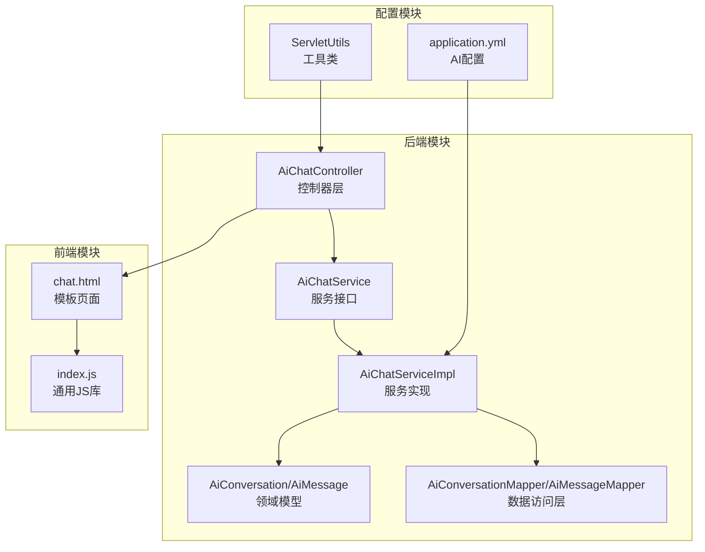

**图表来源**
- [AiChatController.java:1-118](file://ruoyi-admin/src/main/java/com/ruoyi/ai/controller/AiChatController.java#L1-L118)
- [AiChatServiceImpl.java:1-332](file://ruoyi-admin/src/main/java/com/ruoyi/ai/service/impl/AiChatServiceImpl.java#L1-L332)
- [chat.html:1-659](file://ruoyi-admin/src/main/resources/templates/ai/chat.html#L1-L659)

**章节来源**
- [AiChatController.java:1-118](file://ruoyi-admin/src/main/java/com/ruoyi/ai/controller/AiChatController.java#L1-L118)
- [AiChatServiceImpl.java:1-332](file://ruoyi-admin/src/main/java/com/ruoyi/ai/service/impl/AiChatServiceImpl.java#L1-L332)
- [chat.html:1-659](file://ruoyi-admin/src/main/resources/templates/ai/chat.html#L1-L659)

## 核心组件

### 控制器层

AI智能问答模块的控制器层主要负责HTTP请求处理和SSE连接管理：

- **AiChatController**: 主要控制器，处理AI问答相关的HTTP请求，包括对话列表查询、消息历史获取、对话删除等操作
- **权限控制**: 使用`@RequiresPermissions`注解确保只有授权用户可以访问
- **SSE支持**: 集成Spring MVC的SseEmitter实现流式响应
- **RESTful API**: 提供完整的RESTful接口，支持对话管理、消息查询等功能

### 服务层

服务层提供AI问答的核心业务逻辑：

- **AiChatService**: 定义AI问答服务接口，包含同步和异步两种模式
- **AiChatServiceImpl**: 实现类，处理与AI服务提供商的通信，管理对话创建和消息持久化
- **IAiConversationService**: 对话服务接口，管理对话的CRUD操作
- **IAiMessageService**: 消息服务接口，管理消息的CRUD操作
- **异步处理**: 使用线程池处理长时间运行的SSE连接

### 前端组件

前端模块提供完整的用户交互界面：

- **chat.html**: 主页面模板，包含聊天界面、对话列表和样式
- **实时渲染**: 支持Markdown语法和代码高亮
- **用户体验**: 打字动画、自动滚动、对话切换等功能
- **交互功能**: 新增对话、删除对话、消息历史加载等

**章节来源**
- [AiChatController.java:27-118](file://ruoyi-admin/src/main/java/com/ruoyi/ai/controller/AiChatController.java#L27-L118)
- [AiChatService.java:7-31](file://ruoyi-admin/src/main/java/com/ruoyi/ai/service/AiChatService.java#L7-L31)
- [AiChatServiceImpl.java:40-332](file://ruoyi-admin/src/main/java/com/ruoyi/ai/service/impl/AiChatServiceImpl.java#L40-L332)

## 架构概览

AI智能问答模块采用分层架构设计，实现了清晰的关注点分离：

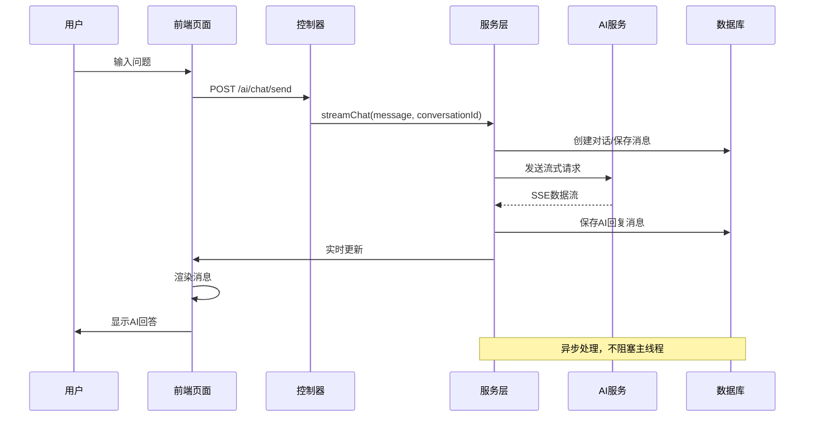

**图表来源**
- [AiChatController.java:54-78](file://ruoyi-admin/src/main/java/com/ruoyi/ai/controller/AiChatController.java#L54-L78)
- [AiChatServiceImpl.java:128-330](file://ruoyi-admin/src/main/java/com/ruoyi/ai/service/impl/AiChatServiceImpl.java#L128-L330)

### 系统架构图

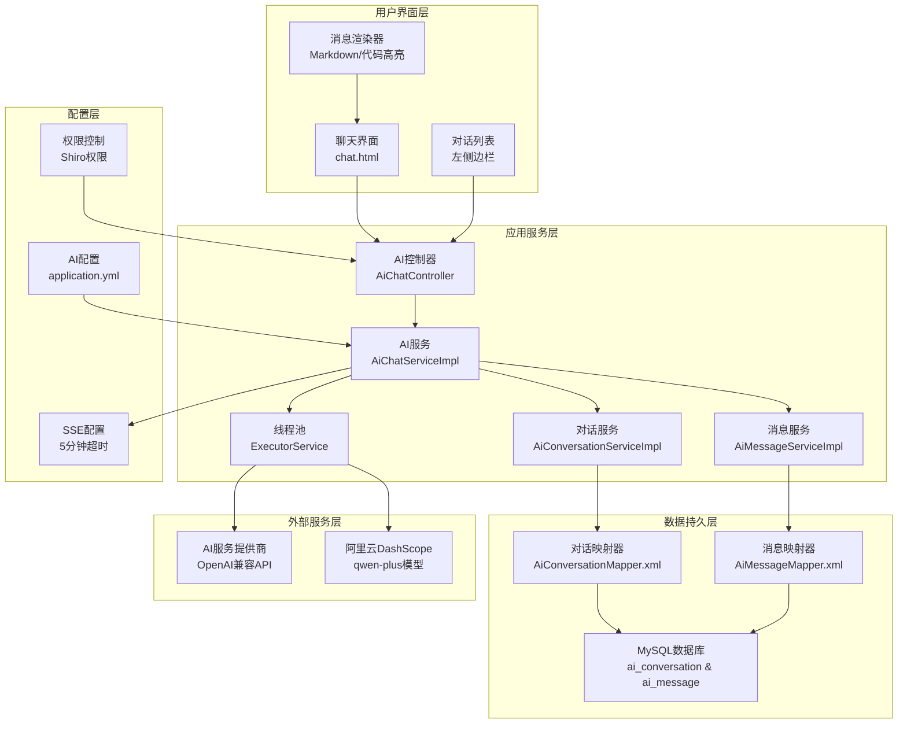

**图表来源**
- [chat.html:235-264](file://ruoyi-admin/src/main/resources/templates/ai/chat.html#L235-L264)
- [AiChatServiceImpl.java:65-69](file://ruoyi-admin/src/main/java/com/ruoyi/ai/service/impl/AiChatServiceImpl.java#L65-L69)
- [application.yml:141-149](file://ruoyi-admin/src/main/resources/application.yml#L141-L149)

## 详细组件分析

### SSE连接管理

SSE（Server-Sent Events）是AI智能问答模块的核心通信机制，实现了服务器向客户端的实时数据推送。

#### 连接建立流程

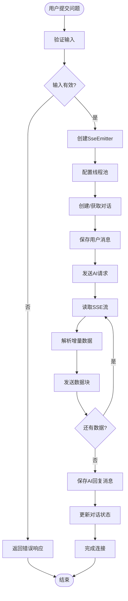

**图表来源**
- [AiChatServiceImpl.java:128-330](file://ruoyi-admin/src/main/java/com/ruoyi/ai/service/impl/AiChatServiceImpl.java#L128-L330)

#### SSE配置参数

| 参数 | 默认值 | 描述 |
|------|--------|------|
| 超时时间 | 5分钟 | SSE连接超时时间 |
| 连接超时 | 30秒 | HTTP连接超时 |
| 读取超时 | 5分钟 | HTTP读取超时 |
| 线程池类型 | 缓存线程池 | 动态调整线程数量 |

**章节来源**
- [AiChatServiceImpl.java:50-54](file://ruoyi-admin/src/main/java/com/ruoyi/ai/service/impl/AiChatServiceImpl.java#L50-L54)
- [AiChatServiceImpl.java:184-198](file://ruoyi-admin/src/main/java/com/ruoyi/ai/service/impl/AiChatServiceImpl.java#L184-L198)

### AI对话服务集成

AI服务集成采用统一接口设计，支持多种AI服务提供商：

#### 支持的服务提供商

| 服务提供商 | 基础URL示例 | 模型名称 | 配置键 |
|------------|-------------|----------|--------|
| OpenAI | https://api.openai.com | gpt-3.5-turbo | openai |
| 阿里云DashScope | https://dashscope.aliyuncs.com | qwen-plus | dashscope |
| DeepSeek | https://api.deepseek.com | deepseek-chat | deepseek |
| 通义千问 | https://dashscope.aliyuncs.com | qwen-plus | tongyi |

#### 请求协议规范

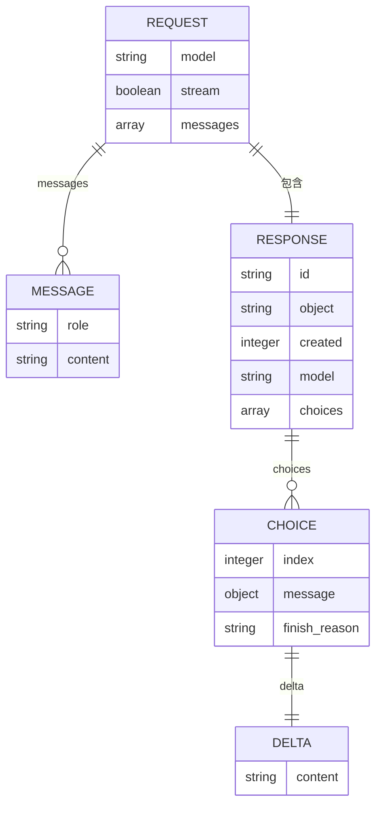

**图表来源**
- [AiChatServiceImpl.java:76-84](file://ruoyi-admin/src/main/java/com/ruoyi/ai/service/impl/AiChatServiceImpl.java#L76-L84)
- [AiChatServiceImpl.java:200-210](file://ruoyi-admin/src/main/java/com/ruoyi/ai/service/impl/AiChatServiceImpl.java#L200-L210)

**章节来源**
- [AiChatServiceImpl.java:56-63](file://ruoyi-admin/src/main/java/com/ruoyi/ai/service/impl/AiChatServiceImpl.java#L56-L63)
- [AiChatServiceImpl.java:189-236](file://ruoyi-admin/src/main/java/com/ruoyi/ai/service/impl/AiChatServiceImpl.java#L189-L236)

### 聊天界面前端实现

前端聊天界面采用现代化的设计，提供了丰富的用户体验：

#### 消息渲染机制

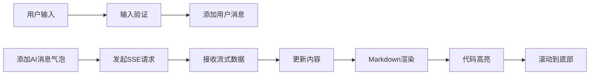

**图表来源**
- [chat.html:433-549](file://ruoyi-admin/src/main/resources/templates/ai/chat.html#L433-L549)

#### 样式设计特点

| 组件 | 设计特性 | 实现方式 |
|------|----------|----------|
| 用户消息 | 绿色主题，右对齐 | user类，绿色背景 |
| AI消息 | 白色主题，左对齐 | ai类，阴影效果 |
| 代码块 | 等宽字体，高亮显示 | pre/code标签 |
| 打字指示器 | 动画效果，三点跳动 | CSS动画 |

**章节来源**
- [chat.html:6-219](file://ruoyi-admin/src/main/resources/templates/ai/chat.html#L6-L219)
- [chat.html:586-629](file://ruoyi-admin/src/main/resources/templates/ai/chat.html#L586-L629)

### 消息传递协议

系统采用标准化的消息传递协议，确保前后端数据交换的一致性：

#### SSE事件类型

| 事件名称 | 数据格式 | 用途 |
|----------|----------|------|
| message | 字符串 | AI回复的增量内容 |
| error | 字符串 | 错误信息 |
| conversation | 数字字符串 | 新建对话的ID |
| [DONE] | 特殊标记 | 流式传输结束 |

#### 前端事件处理

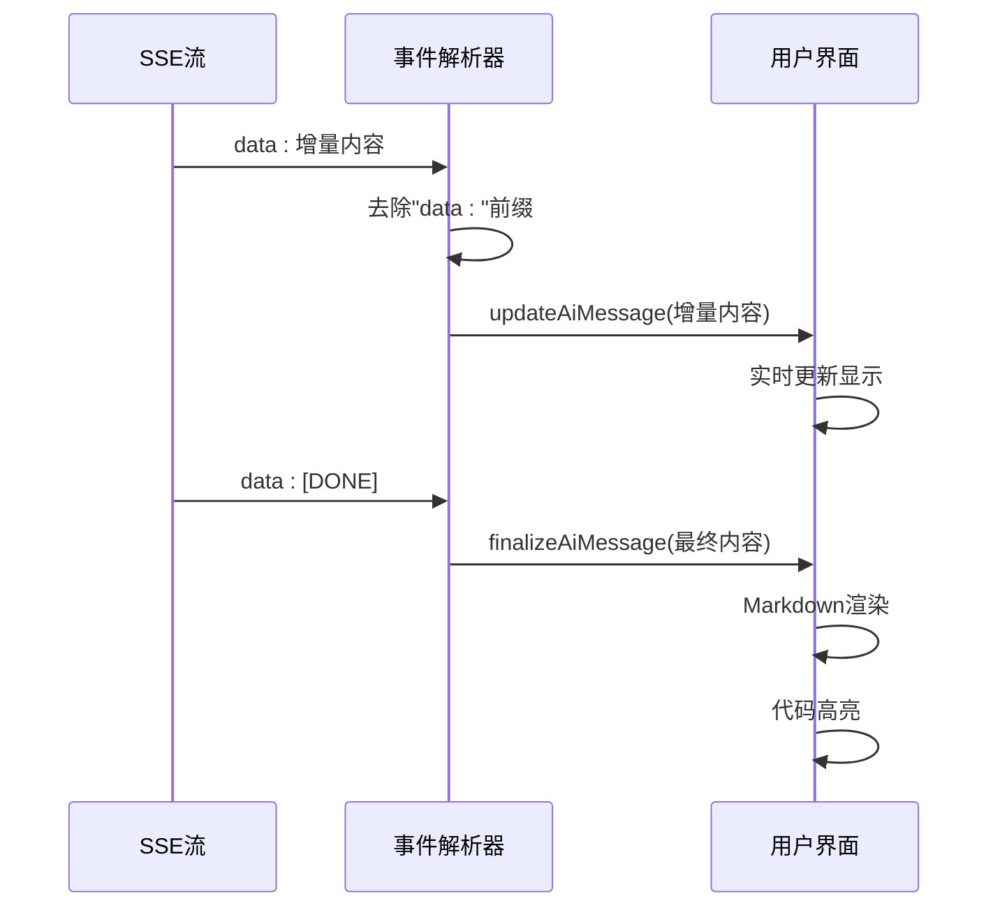

**图表来源**
- [chat.html:512-541](file://ruoyi-admin/src/main/resources/templates/ai/chat.html#L512-L541)

**章节来源**
- [chat.html:497-541](file://ruoyi-admin/src/main/resources/templates/ai/chat.html#L497-L541)

## 对话历史管理

AI智能问答模块实现了完整的对话历史管理系统，支持用户对对话的创建、查询、切换和删除操作。

### 对话管理功能

#### 对话列表查询

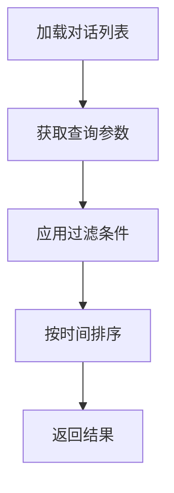

**图表来源**
- [AiChatController.java:80-93](file://ruoyi-admin/src/main/java/com/ruoyi/ai/controller/AiChatController.java#L80-L93)

#### 对话切换机制

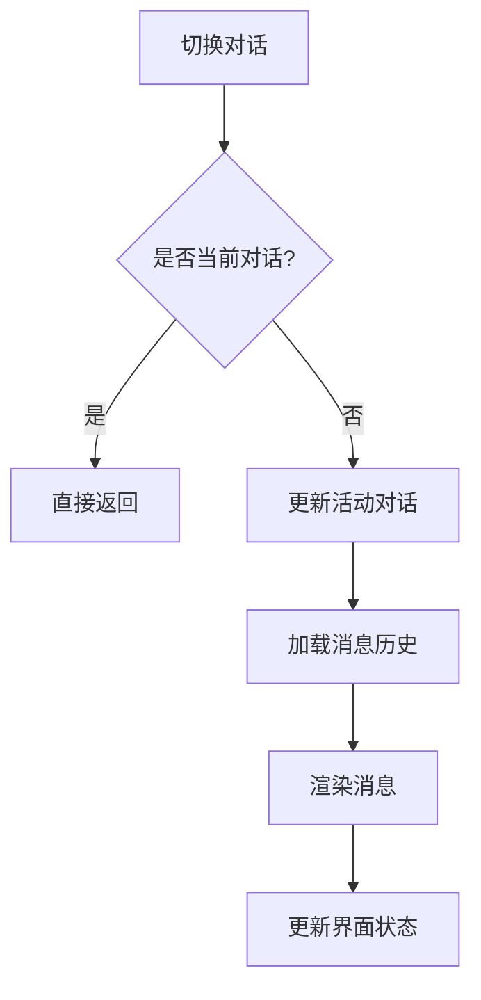

**图表来源**
- [chat.html:354-371](file://ruoyi-admin/src/main/resources/templates/ai/chat.html#L354-L371)

#### 对话删除功能

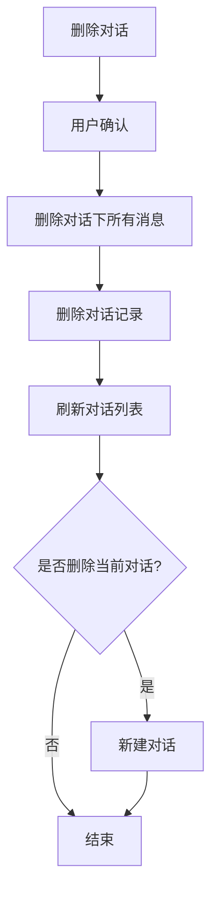

**图表来源**
- [AiChatController.java:107-116](file://ruoyi-admin/src/main/java/com/ruoyi/ai/controller/AiChatController.java#L107-L116)
- [chat.html:405-431](file://ruoyi-admin/src/main/resources/templates/ai/chat.html#L405-L431)

**章节来源**
- [AiChatController.java:80-116](file://ruoyi-admin/src/main/java/com/ruoyi/ai/controller/AiChatController.java#L80-L116)
- [chat.html:289-431](file://ruoyi-admin/src/main/resources/templates/ai/chat.html#L289-L431)

## 消息持久化机制

AI智能问答模块实现了完整的消息持久化机制，确保用户对话数据的安全存储和高效检索。

### 数据模型设计

#### 对话表结构

| 字段名 | 类型 | 约束 | 描述 |
|--------|------|------|------|
| conversation_id | bigint | PK, AUTO_INCREMENT | 对话ID |
| title | varchar(200) | DEFAULT '' | 对话标题 |
| user_id | bigint | NOT NULL | 用户ID |
| model | varchar(100) | DEFAULT '' | 使用的模型 |
| message_count | int | DEFAULT 0 | 消息数量 |
| status | char(1) | DEFAULT '0' | 对话状态（0进行中 1已结束） |
| del_flag | char(1) | DEFAULT '0' | 删除标志（0存在 2删除） |
| create_by | varchar(64) | DEFAULT '' | 创建者 |
| create_time | datetime | | 创建时间 |
| update_by | varchar(64) | DEFAULT '' | 更新者 |
| update_time | datetime | | 更新时间 |
| remark | varchar(500) | NULL | 备注 |

#### 消息表结构

| 字段名 | 类型 | 约束 | 描述 |
|--------|------|------|------|
| message_id | bigint | PK, AUTO_INCREMENT | 消息ID |
| conversation_id | bigint | NOT NULL | 对话ID |
| role | varchar(20) | NOT NULL | 角色（user用户 assistant助手） |
| content | text | | 消息内容 |
| tokens | int | DEFAULT 0 | token消耗量 |
| create_by | varchar(64) | DEFAULT '' | 创建者 |
| create_time | datetime | | 创建时间 |

### 持久化流程

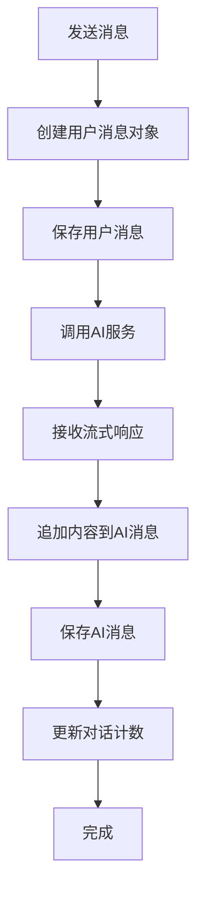

**图表来源**
- [AiChatServiceImpl.java:167-182](file://ruoyi-admin/src/main/java/com/ruoyi/ai/service/impl/AiChatServiceImpl.java#L167-L182)
- [AiChatServiceImpl.java:277-295](file://ruoyi-admin/src/main/java/com/ruoyi/ai/service/impl/AiChatServiceImpl.java#L277-L295)

### 数据访问层

#### 对话数据访问

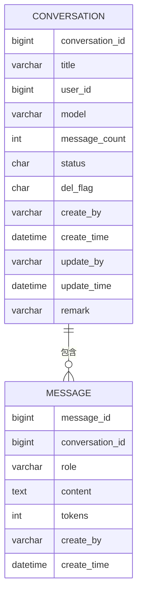

**图表来源**
- [AiConversationMapper.xml:7-20](file://ruoyi-admin/src/main/resources/mapper/ai/AiConversationMapper.xml#L7-L20)
- [AiMessageMapper.xml:7-15](file://ruoyi-admin/src/main/resources/mapper/ai/AiMessageMapper.xml#L7-L15)

**章节来源**
- [AiConversation.java:16-105](file://ruoyi-admin/src/main/java/com/ruoyi/ai/domain/AiConversation.java#L16-L105)
- [AiMessage.java:17-107](file://ruoyi-admin/src/main/java/com/ruoyi/ai/domain/AiMessage.java#L17-L107)
- [AiConversationMapper.xml:22-50](file://ruoyi-admin/src/main/resources/mapper/ai/AiConversationMapper.xml#L22-L50)
- [AiMessageMapper.xml:17-31](file://ruoyi-admin/src/main/resources/mapper/ai/AiMessageMapper.xml#L17-L31)

## 用户交互功能

AI智能问答模块提供了丰富的用户交互功能，包括对话管理、消息操作、界面响应等。

### 交互流程设计

#### 完整对话流程

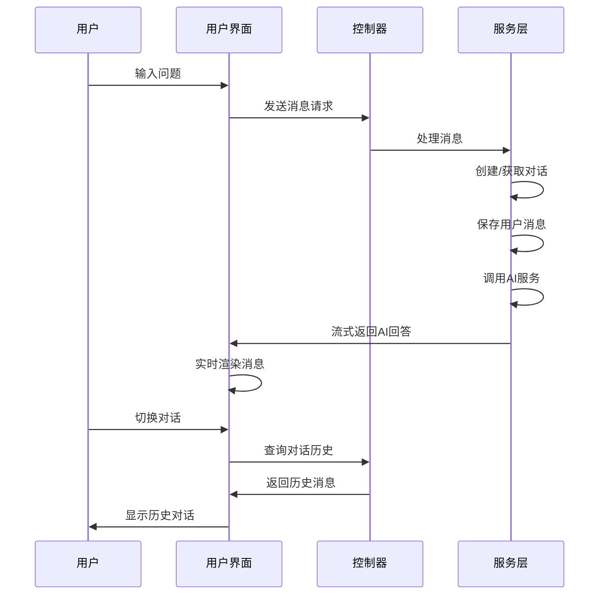

**图表来源**
- [chat.html:433-549](file://ruoyi-admin/src/main/resources/templates/ai/chat.html#L433-L549)
- [AiChatController.java:95-105](file://ruoyi-admin/src/main/java/com/ruoyi/ai/controller/AiChatController.java#L95-L105)

#### 界面交互组件

| 组件 | 功能 | 实现方式 |
|------|------|----------|
| 对话列表 | 展示历史对话 | 左侧边栏，支持点击切换 |
| 新增对话 | 创建新对话 | 按钮触发，清空聊天区域 |
| 删除对话 | 彻底删除对话 | 点击删除图标，确认对话 |
| 消息输入 | 用户输入问题 | 文本域，支持快捷键 |
| 发送按钮 | 发送消息 | 按钮触发，禁用状态管理 |
| 消息渲染 | 显示AI回答 | Markdown渲染，代码高亮 |

**章节来源**
- [chat.html:235-431](file://ruoyi-admin/src/main/resources/templates/ai/chat.html#L235-L431)
- [chat.html:551-629](file://ruoyi-admin/src/main/resources/templates/ai/chat.html#L551-L629)

### 错误处理机制

#### 前端错误处理

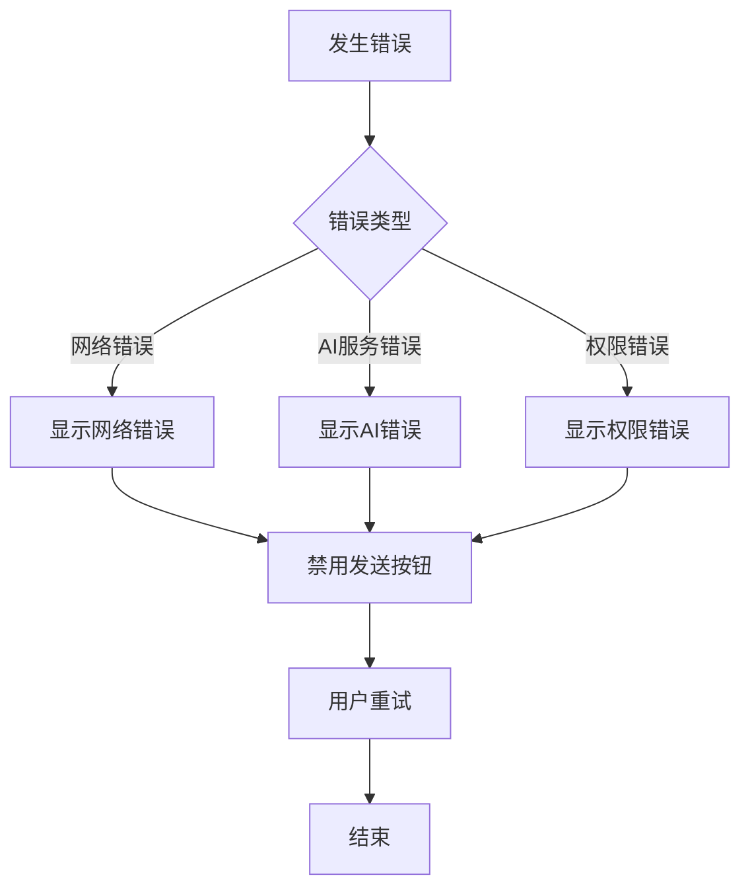

**图表来源**
- [chat.html:533-548](file://ruoyi-admin/src/main/resources/templates/ai/chat.html#L533-L548)

#### 后端错误处理

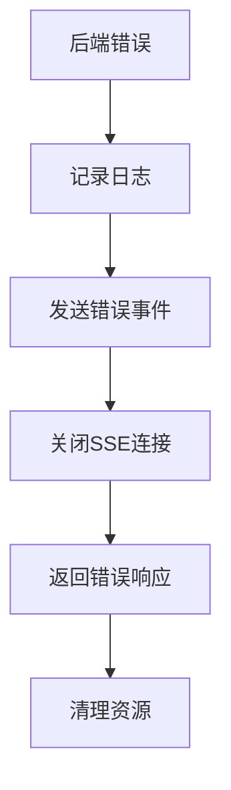

**图表来源**
- [AiChatServiceImpl.java:299-311](file://ruoyi-admin/src/main/java/com/ruoyi/ai/service/impl/AiChatServiceImpl.java#L299-L311)

**章节来源**
- [chat.html:533-548](file://ruoyi-admin/src/main/resources/templates/ai/chat.html#L533-L548)
- [AiChatServiceImpl.java:325-327](file://ruoyi-admin/src/main/java/com/ruoyi/ai/service/impl/AiChatServiceImpl.java#L325-L327)

## 依赖关系分析

AI智能问答模块的依赖关系体现了清晰的分层架构：

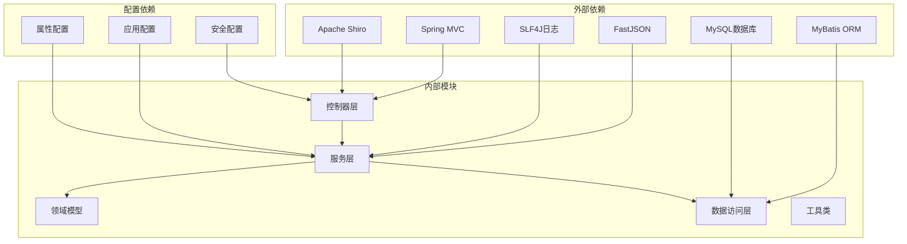

**图表来源**
- [AiChatController.java:12-25](file://ruoyi-admin/src/main/java/com/ruoyi/ai/controller/AiChatController.java#L12-L25)
- [AiChatServiceImpl.java:16-38](file://ruoyi-admin/src/main/java/com/ruoyi/ai/service/impl/AiChatServiceImpl.java#L16-L38)

### 核心依赖关系

| 依赖类型 | 依赖组件 | 作用 |
|----------|----------|------|
| 框架依赖 | Spring MVC | Web框架支持 |
| JSON处理 | FastJSON | 数据序列化 |
| 日志系统 | SLF4J | 日志记录 |
| ORM框架 | MyBatis | 数据库访问 |
| 数据库 | MySQL | 数据持久化 |
| 安全框架 | Shiro | 权限控制 |
| HTTP客户端 | RestTemplate | HTTP请求 |
| SSE支持 | SseEmitter | 实时通信 |

**章节来源**
- [AiChatServiceImpl.java:16-38](file://ruoyi-admin/src/main/java/com/ruoyi/ai/service/impl/AiChatServiceImpl.java#L16-L38)
- [AjaxResult.java:1-228](file://ruoyi-common/src/main/java/com/ruoyi/common/core/domain/AjaxResult.java#L1-L228)

## 性能考虑

AI智能问答模块在设计时充分考虑了性能优化：

### 并发处理优化

- **线程池管理**: 使用缓存线程池动态调整并发数量
- **连接复用**: HTTP连接超时配置优化网络性能
- **内存管理**: 及时释放SSE连接和缓冲区资源
- **异步处理**: SSE连接在独立线程中处理

### 响应时间优化

- **异步处理**: SSE连接在独立线程中处理
- **增量渲染**: 实时更新UI，避免完整重绘
- **流式传输**: 减少等待时间，提升用户体验
- **数据库优化**: 使用索引和批量操作

### 资源管理策略

**图表来源**
- [AiChatServiceImpl.java:184-323](file://ruoyi-admin/src/main/java/com/ruoyi/ai/service/impl/AiChatServiceImpl.java#L184-L323)

**章节来源**
- [AiChatServiceImpl.java:50-54](file://ruoyi-admin/src/main/java/com/ruoyi/ai/service/impl/AiChatServiceImpl.java#L50-L54)
- [AiChatServiceImpl.java:184-198](file://ruoyi-admin/src/main/java/com/ruoyi/ai/service/impl/AiChatServiceImpl.java#L184-L198)

## 故障排除指南

### 常见问题及解决方案

#### SSE连接问题

| 问题症状 | 可能原因 | 解决方案 |
|----------|----------|----------|
| 连接立即断开 | API Key配置错误 | 检查application.yml配置 |
| 无响应数据 | 网络连接问题 | 检查防火墙和代理设置 |
| 超时错误 | 服务器响应慢 | 调整超时参数配置 |
| 数据乱码 | 编码格式不匹配 | 确认UTF-8编码设置 |
| 对话列表不显示 | 权限不足 | 检查用户权限配置 |

#### 前端显示问题

| 问题症状 | 可能原因 | 解决方案 |
|----------|----------|----------|
| 消息不显示 | JavaScript错误 | 检查浏览器控制台 |
| Markdown不渲染 | marked库加载失败 | 确认CDN连接正常 |
| 代码高亮失效 | highlight库问题 | 检查CSS样式加载 |
| 打字动画不工作 | CSS动画冲突 | 检查样式优先级 |
| 对话切换无效 | AJAX请求失败 | 检查网络连接 |

#### 数据持久化问题

| 问题症状 | 可能原因 | 解决方案 |
|----------|----------|----------|
| 对话无法保存 | 数据库连接失败 | 检查数据库配置 |
| 消息丢失 | 事务处理异常 | 检查事务配置 |
| 查询性能差 | 缺少索引 | 添加数据库索引 |
| 数据重复 | 主键冲突 | 检查自增主键配置 |

**章节来源**
- [AiChatServiceImpl.java:299-311](file://ruoyi-admin/src/main/java/com/ruoyi/ai/service/impl/AiChatServiceImpl.java#L299-L311)
- [chat.html:533-548](file://ruoyi-admin/src/main/resources/templates/ai/chat.html#L533-L548)

### 调试技巧

1. **后端调试**: 查看SSE连接日志和AI服务响应
2. **前端调试**: 使用浏览器开发者工具监控网络请求
3. **数据库调试**: 检查对话和消息表的数据状态
4. **配置验证**: 确认AI服务配置参数正确
5. **权限检查**: 验证用户权限和访问控制

## 结论

AI智能问答模块是一个功能完整、架构清晰的智能对话系统。通过采用SSE技术实现流式响应，结合现代化的前端设计和完整的对话历史管理，为用户提供了流畅的AI交互体验。

### 主要优势

- **实时性**: SSE技术确保AI回答的实时显示
- **完整性**: 支持完整的对话生命周期管理
- **可扩展性**: 支持多种AI服务提供商，易于扩展
- **用户体验**: 完善的前端交互和视觉效果
- **数据持久化**: 完整的消息和对话数据管理
- **性能优化**: 异步处理和资源管理策略

### 技术特色

- **统一接口**: 标准化的AI服务接口设计
- **错误处理**: 完善的异常捕获和错误提示机制
- **配置灵活**: 支持多环境配置和动态参数调整
- **安全考虑**: 权限控制和输入验证机制
- **数据库优化**: 合理的表结构设计和索引策略
- **前端交互**: 丰富的用户界面和交互功能

### 扩展建议

该模块为后续的功能扩展和性能优化奠定了良好的基础，可以根据具体需求进行进一步的定制和增强：

1. **AI服务扩展**: 支持更多AI服务提供商
2. **模型管理**: 实现AI模型的动态切换
3. **会话管理**: 增强对话状态的管理能力
4. **性能监控**: 添加详细的性能指标监控
5. **安全增强**: 实现更细粒度的权限控制
6. **国际化**: 支持多语言界面和内容

该模块的完整实现为RuoYi框架增加了强大的AI智能问答能力，为用户提供了现代化的智能对话体验。