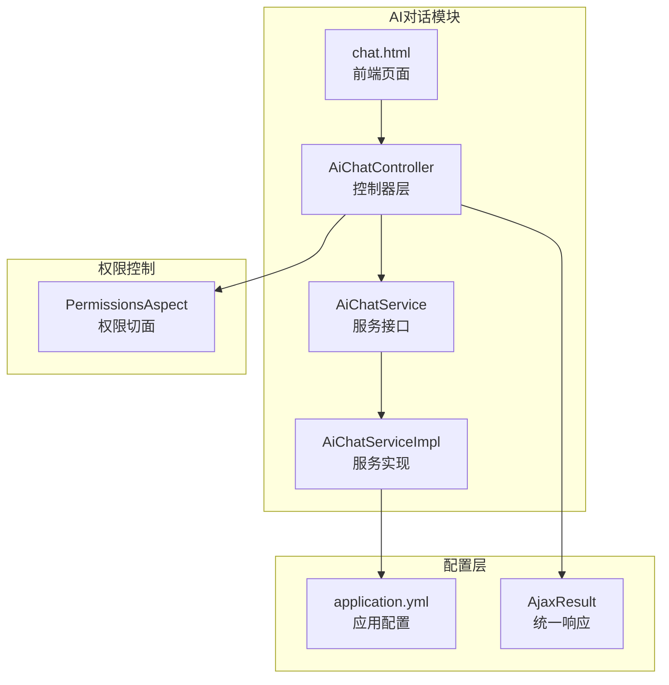
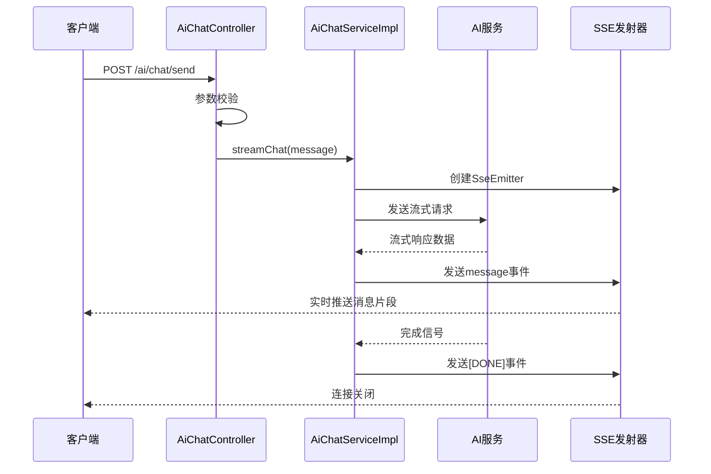
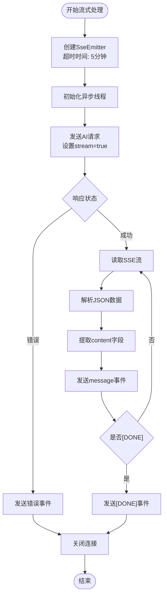
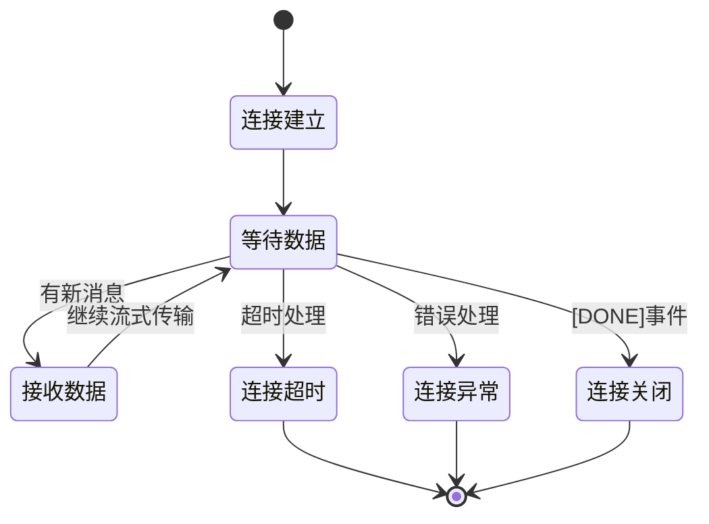
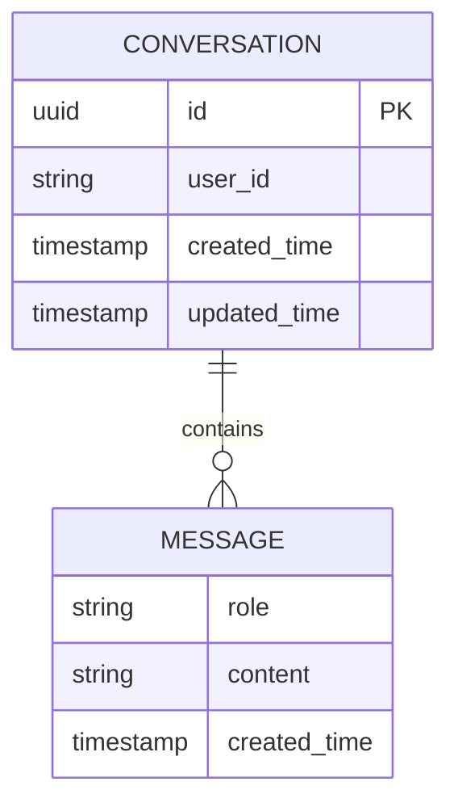
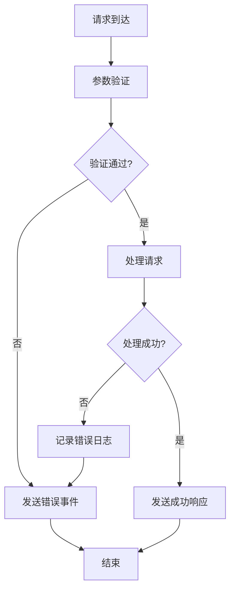

# AI对话API

<cite>
**本文档引用的文件**
- [AiChatController.java](file://ruoyi-admin/src/main/java/com/ruoyi/ai/controller/AiChatController.java)
- [AiChatService.java](file://ruoyi-admin/src/main/java/com/ruoyi/ai/service/AiChatService.java)
- [AiChatServiceImpl.java](file://ruoyi-admin/src/main/java/com/ruoyi/ai/service/impl/AiChatServiceImpl.java)
- [chat.html](file://ruoyi-admin/src/main/resources/templates/ai/chat.html)
- [application.yml](file://ruoyi-admin/src/main/resources/application.yml)
- [AjaxResult.java](file://ruoyi-common/src/main/java/com/ruoyi/common/core/domain/AjaxResult.java)
- [PermissionsAspect.java](file://ruoyi-framework/src/main/java/com/ruoyi/framework/aspectj/PermissionsAspect.java)
</cite>

## 目录
1. [简介](#简介)
2. [项目结构](#项目结构)
3. [核心组件](#核心组件)
4. [架构概览](#架构概览)
5. [详细组件分析](#详细组件分析)
6. [SSE协议详解](#sse协议详解)
7. [请求参数说明](#请求参数说明)
8. [响应格式规范](#响应格式规范)
9. [会话管理](#会话管理)
10. [前端集成指南](#前端集成指南)
11. [性能考虑](#性能考虑)
12. [故障排除](#故障排除)
13. [结论](#结论)

## 简介

AI对话API是一个基于Server-Sent Events（SSE）技术的实时对话接口，提供了与AI助手进行流式交互的能力。该系统采用Spring Boot框架构建，集成了RuoYi企业级开发框架，支持实时消息流式传输、权限控制、错误处理和会话管理等功能。

系统主要特点：
- **实时流式响应**：基于SSE协议实现实时消息推送
- **多模型支持**：支持OpenAI兼容的各种AI模型
- **权限控制**：集成Shiro权限管理系统
- **错误处理**：完善的异常捕获和错误反馈机制
- **前端集成**：提供完整的前端聊天界面

## 项目结构

AI对话功能在RuoYi项目中的组织结构如下：



**图表来源**
- [AiChatController.java:1-63](file://ruoyi-admin/src/main/java/com/ruoyi/ai/controller/AiChatController.java#L1-L63)
- [AiChatService.java:1-30](file://ruoyi-admin/src/main/java/com/ruoyi/ai/service/AiChatService.java#L1-L30)
- [AiChatServiceImpl.java:1-245](file://ruoyi-admin/src/main/java/com/ruoyi/ai/service/impl/AiChatServiceImpl.java#L1-L245)

**章节来源**
- [AiChatController.java:1-63](file://ruoyi-admin/src/main/java/com/ruoyi/ai/controller/AiChatController.java#L1-L63)
- [application.yml:141-149](file://ruoyi-admin/src/main/resources/application.yml#L141-L149)

## 核心组件

### 控制器层

AiChatController负责处理AI对话相关的HTTP请求，提供RESTful API接口。

### 服务层

AiChatService定义了AI对话的核心业务接口，包括同步和异步两种调用模式。

### 配置层

系统通过application.yml配置AI服务的基本参数，包括API Key、基础URL和模型名称。

**章节来源**
- [AiChatController.java:22-36](file://ruoyi-admin/src/main/java/com/ruoyi/ai/controller/AiChatController.java#L22-L36)
- [AiChatService.java:12-29](file://ruoyi-admin/src/main/java/com/ruoyi/ai/service/AiChatService.java#L12-L29)
- [application.yml:141-149](file://ruoyi-admin/src/main/resources/application.yml#L141-L149)

## 架构概览

AI对话系统的整体架构采用分层设计，确保了良好的可维护性和扩展性：



**图表来源**
- [AiChatController.java:42-61](file://ruoyi-admin/src/main/java/com/ruoyi/ai/controller/AiChatController.java#L42-L61)
- [AiChatServiceImpl.java:116-243](file://ruoyi-admin/src/main/java/com/ruoyi/ai/service/impl/AiChatServiceImpl.java#L116-L243)

## 详细组件分析

### AiChatController 分析

控制器层实现了AI对话的核心HTTP接口，主要包含以下功能：

#### 主要方法

1. **页面访问接口** (`GET /ai/chat`)
   - 返回AI聊天页面模板
   - 基于权限注解进行访问控制

2. **流式对话接口** (`POST /ai/chat/send`)
   - 处理用户消息发送请求
   - 返回SSE流式响应

#### 权限控制

控制器使用`@RequiresPermissions("ai:chat:view")`注解确保只有具备相应权限的用户才能访问AI对话功能。

**章节来源**
- [AiChatController.java:31-36](file://ruoyi-admin/src/main/java/com/ruoyi/ai/controller/AiChatController.java#L31-L36)
- [AiChatController.java:42-61](file://ruoyi-admin/src/main/java/com/ruoyi/ai/controller/AiChatController.java#L42-L61)

### AiChatService 接口分析

服务接口定义了AI对话的两个核心方法：

#### 同步对话方法
```java
AjaxResult chat(String message)
```
- 适用于一次性获取完整回答的场景
- 返回标准的AjaxResult响应格式

#### 流式对话方法
```java
SseEmitter streamChat(String message)
```
- 适用于需要实时流式响应的场景
- 返回SSE发射器对象

**章节来源**
- [AiChatService.java:14-29](file://ruoyi-admin/src/main/java/com/ruoyi/ai/service/AiChatService.java#L14-L29)

### AiChatServiceImpl 实现分析

服务实现类是整个AI对话功能的核心，负责与外部AI服务的通信和数据处理。

#### 关键配置参数

| 配置项 | 默认值 | 说明 |
|--------|--------|------|
| ai.api-key | sk-a5b484cc520a40b887de9984dc466dcc | AI服务API密钥 |
| ai.base-url | https://dashscope.aliyuncs.com/compatible-mode | AI服务基础URL |
| ai.model | qwen-plus | 使用的AI模型名称 |

#### 流式处理流程



**图表来源**
- [AiChatServiceImpl.java:116-243](file://ruoyi-admin/src/main/java/com/ruoyi/ai/service/impl/AiChatServiceImpl.java#L116-L243)

**章节来源**
- [AiChatServiceImpl.java:43-58](file://ruoyi-admin/src/main/java/com/ruoyi/ai/service/impl/AiChatServiceImpl.java#L43-L58)
- [AiChatServiceImpl.java:116-243](file://ruoyi-admin/src/main/java/com/ruoyi/ai/service/impl/AiChatServiceImpl.java#L116-L243)

## SSE协议详解

### 协议特性

SSE（Server-Sent Events）是一种基于HTTP的单向通信协议，特别适合实时数据推送场景。

#### 协议优势
- **单向通信**：服务器向客户端推送数据
- **自动重连**：客户端自动处理连接中断
- **事件类型**：支持多种事件类型的区分
- **缓冲机制**：浏览器内置的缓冲和重连机制

#### 连接生命周期



**图表来源**
- [AiChatServiceImpl.java:238-240](file://ruoyi-admin/src/main/java/com/ruoyi/ai/service/impl/AiChatServiceImpl.java#L238-L240)

### 事件类型定义

系统定义了两种主要的SSE事件类型：

#### message 事件
- **用途**：传输AI的流式回复内容
- **数据格式**：纯文本片段
- **触发时机**：每次AI生成新的回复片段时

#### error 事件
- **用途**：传输错误信息
- **数据格式**：错误描述文本
- **触发时机**：AI服务调用失败或内部异常时

**章节来源**
- [AiChatServiceImpl.java:196-202](file://ruoyi-admin/src/main/java/com/ruoyi/ai/service/impl/AiChatServiceImpl.java#L196-L202)
- [AiChatServiceImpl.java:169-171](file://ruoyi-admin/src/main/java/com/ruoyi/ai/service/impl/AiChatServiceImpl.java#L169-L171)

## 请求参数说明

### 基础接口参数

| 参数名 | 必填 | 类型 | 默认值 | 说明 |
|--------|------|------|--------|------|
| message | 是 | String | 无 | 用户发送的对话内容 |
| Content-Type | 是 | String | application/x-www-form-urlencoded | 表单提交格式 |

### 请求头参数

| 头名称 | 必填 | 默认值 | 说明 |
|--------|------|--------|------|
| Content-Type | 是 | application/x-www-form-urlencoded | 表单数据格式 |
| Accept | 否 | text/event-stream | SSE流式响应 |

### 完整请求示例

```javascript
// JavaScript示例
const params = new URLSearchParams();
params.append('message', '你好，AI助手');

fetch('/ai/chat/send', {
    method: 'POST',
    headers: {
        'Content-Type': 'application/x-www-form-urlencoded'
    },
    body: params.toString()
})
.then(response => {
    const reader = response.body.getReader();
    const decoder = new TextDecoder('utf-8');
    // 处理流式响应...
});
```

**章节来源**
- [AiChatController.java:44](file://ruoyi-admin/src/main/java/com/ruoyi/ai/controller/AiChatController.java#L44)
- [chat.html:224-228](file://ruoyi-admin/src/main/resources/templates/ai/chat.html#L224-L228)

## 响应格式规范

### SSE响应格式

SSE响应遵循特定的文本格式规范：

```
event: message
data: "AI回复的内容片段"

event: message  
data: "继续的回复内容"

event: message
data: "[DONE]"
```

### 事件解析规则

前端JavaScript需要按照以下规则解析SSE响应：

1. **按行解析**：以换行符分割响应内容
2. **事件识别**：检查以`event:`开头的行
3. **数据提取**：提取以`data:`开头的行内容
4. **特殊处理**：对`[DONE]`标记进行特殊处理

### 错误响应处理

当AI服务出现错误时，系统会发送错误事件：

```
event: error
data: "AI服务请求失败：错误详情"
```

**章节来源**
- [chat.html:254-275](file://ruoyi-admin/src/main/resources/templates/ai/chat.html#L254-L275)

## 会话管理

### 当前实现状态

基于代码分析，当前的AI对话实现采用**无状态会话管理**：

- **单次对话**：每次请求都是独立的对话，不保留上下文
- **即时响应**：AI服务直接处理当前消息
- **简单模型**：使用简单的消息数组结构

### 会话上下文结构



### 扩展建议

如果需要实现有状态的会话管理，可以考虑以下改进：

1. **会话存储**：引入Redis或数据库存储会话上下文
2. **上下文管理**：维护消息历史和角色信息
3. **会话持久化**：支持会话的保存和恢复
4. **并发控制**：处理多用户并发会话

**章节来源**
- [AiChatServiceImpl.java:76-84](file://ruoyi-admin/src/main/java/com/ruoyi/ai/service/impl/AiChatServiceImpl.java#L76-L84)

## 前端集成指南

### 页面集成

AI对话功能提供了一个完整的前端页面，位于`/ai/chat`路径。

#### 页面功能特性

1. **实时消息显示**：支持Markdown语法渲染
2. **流式内容更新**：实时显示AI回复内容
3. **打字动画**：显示AI正在思考的状态
4. **键盘快捷键**：支持Enter发送，Shift+Enter换行

### JavaScript集成示例

#### 基础集成代码

```javascript
// 发送消息函数
function sendMessage() {
    const message = document.getElementById('messageInput').value.trim();
    if (!message) {
        layer.msg("请输入问题内容", { icon: 5 });
        return;
    }

    // 创建AI消息气泡
    const aiMsgId = appendAiMessageEmpty();
    
    // 禁用发送按钮
    const sendBtn = document.getElementById('sendBtn');
    sendBtn.disabled = true;

    // 发送SSE请求
    const params = new URLSearchParams();
    params.append('message', message);

    fetch('/ai/chat/send', {
        method: 'POST',
        headers: { 'Content-Type': 'application/x-www-form-urlencoded' },
        body: params.toString()
    })
    .then(response => {
        // 处理流式响应...
    })
    .catch(error => {
        handleError(error);
    });
}
```

#### SSE流式处理

```javascript
// 流式响应处理
function handleSSEStream(reader, aiMsgId) {
    let buffer = '';
    let fullContent = '';

    function read() {
        reader.read().then(function(result) {
            if (result.done) {
                finalizeAiMessage(aiMsgId, fullContent);
                return;
            }

            buffer += decoder.decode(result.value, { stream: true });
            const lines = buffer.split('\n');
            buffer = lines.pop();

            for (let i = 0; i < lines.length; i++) {
                const line = lines[i].trim();
                
                // 解析SSE事件
                if (line.startsWith('data:')) {
                    const data = line.substring(5);
                    
                    if (data === '[DONE]') {
                        finalizeAiMessage(aiMsgId, fullContent);
                        return;
                    }
                    
                    if (data) {
                        fullContent += data;
                        updateAiMessage(aiMsgId, fullContent);
                    }
                }
            }
            
            read();
        });
    }
    
    read();
}
```

### 最佳实践建议

#### 错误处理策略

1. **网络异常处理**：检测网络连接状态
2. **AI服务异常**：优雅处理AI服务不可用
3. **超时处理**：合理设置请求超时时间
4. **重试机制**：实现智能重试逻辑

#### 性能优化建议

1. **内容渲染优化**：避免频繁的DOM操作
2. **内存管理**：及时清理不再使用的元素
3. **防抖处理**：防止用户快速连续发送消息
4. **缓存策略**：缓存常用的AI回复

#### 用户体验优化

1. **加载状态**：显示适当的加载提示
2. **错误反馈**：提供清晰的错误信息
3. **历史记录**：保存用户的对话历史
4. **主题适配**：支持深色/浅色主题切换

**章节来源**
- [chat.html:194-295](file://ruoyi-admin/src/main/resources/templates/ai/chat.html#L194-L295)
- [chat.html:321-355](file://ruoyi-admin/src/main/resources/templates/ai/chat.html#L321-L355)

## 性能考虑

### 系统性能指标

#### 连接管理

- **超时时间**：SSE连接超时时间为5分钟
- **线程池**：使用缓存线程池处理异步任务
- **资源释放**：确保网络连接和流资源正确关闭

#### 内存使用

- **缓冲区管理**：合理管理SSE响应的缓冲区
- **字符串拼接**：避免长时间的字符串拼接操作
- **DOM操作**：最小化频繁的DOM更新

### 性能优化建议

1. **连接复用**：考虑实现连接池管理
2. **数据压缩**：对传输的数据进行压缩
3. **批量处理**：合并多个小的消息片段
4. **缓存策略**：缓存常见的AI回复内容

**章节来源**
- [AiChatServiceImpl.java:43-47](file://ruoyi-admin/src/main/java/com/ruoyi/ai/service/impl/AiChatServiceImpl.java#L43-L47)
- [AiChatServiceImpl.java:238-240](file://ruoyi-admin/src/main/java/com/ruoyi/ai/service/impl/AiChatServiceImpl.java#L238-L240)

## 故障排除

### 常见问题及解决方案

#### 权限相关问题

**问题**：用户无法访问AI对话功能
**原因**：缺少`ai:chat:view`权限
**解决**：为用户分配相应的权限角色

#### 配置相关问题

**问题**：AI服务调用失败
**原因**：API Key配置错误或网络连接问题
**解决**：
1. 检查`ai.api-key`配置
2. 验证网络连接状态
3. 确认AI服务可用性

#### SSE连接问题

**问题**：SSE连接频繁断开
**原因**：超时设置过短或网络不稳定
**解决**：
1. 检查SSE超时配置
2. 优化网络环境
3. 实现自动重连机制

### 错误日志分析

系统提供了完善的错误日志记录：



**图表来源**
- [AiChatController.java:46-59](file://ruoyi-admin/src/main/java/com/ruoyi/ai/controller/AiChatController.java#L46-L59)
- [AiChatServiceImpl.java:212-224](file://ruoyi-admin/src/main/java/com/ruoyi/ai/service/impl/AiChatServiceImpl.java#L212-L224)

**章节来源**
- [AiChatController.java:46-59](file://ruoyi-admin/src/main/java/com/ruoyi/ai/controller/AiChatController.java#L46-L59)
- [AiChatServiceImpl.java:212-224](file://ruoyi-admin/src/main/java/com/ruoyi/ai/service/impl/AiChatServiceImpl.java#L212-L224)

## 结论

AI对话API基于RuoYi框架实现了完整的实时对话功能，具有以下特点：

### 技术优势

1. **架构清晰**：采用分层设计，职责明确
2. **协议先进**：使用SSE实现高效的实时通信
3. **扩展性强**：支持多种AI服务提供商
4. **用户体验好**：提供流畅的对话体验

### 功能完整性

- 支持实时流式对话
- 完善的错误处理机制
- 丰富的前端交互功能
- 灵活的配置选项

### 改进建议

1. **会话持久化**：实现长期的对话历史管理
2. **多轮对话**：支持复杂的上下文对话
3. **模型选择**：提供更多AI模型的选择
4. **安全增强**：加强API的安全防护

该系统为开发者提供了一个可靠的AI对话基础框架，可以根据具体需求进行定制和扩展。