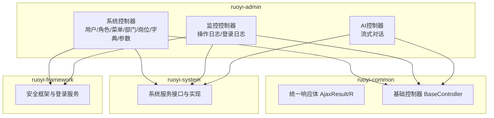
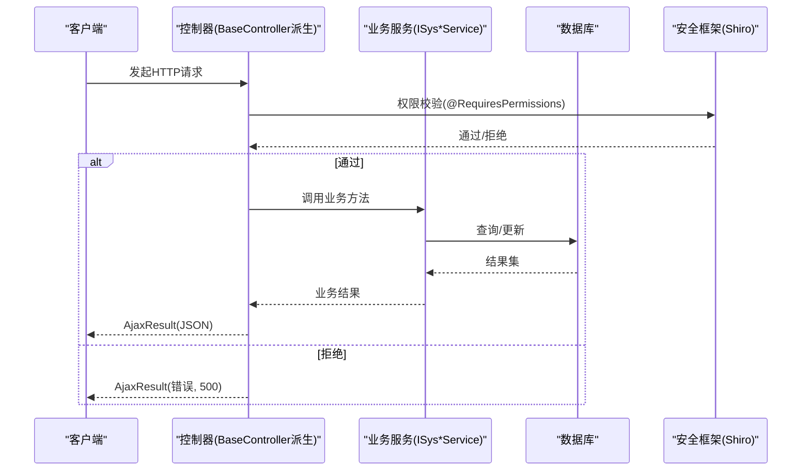
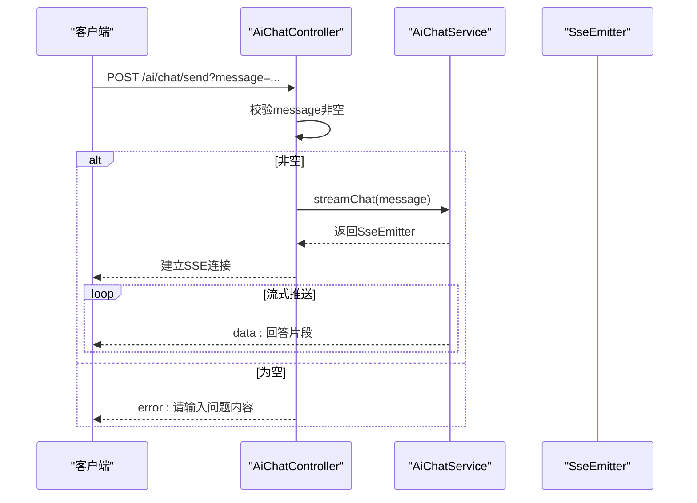
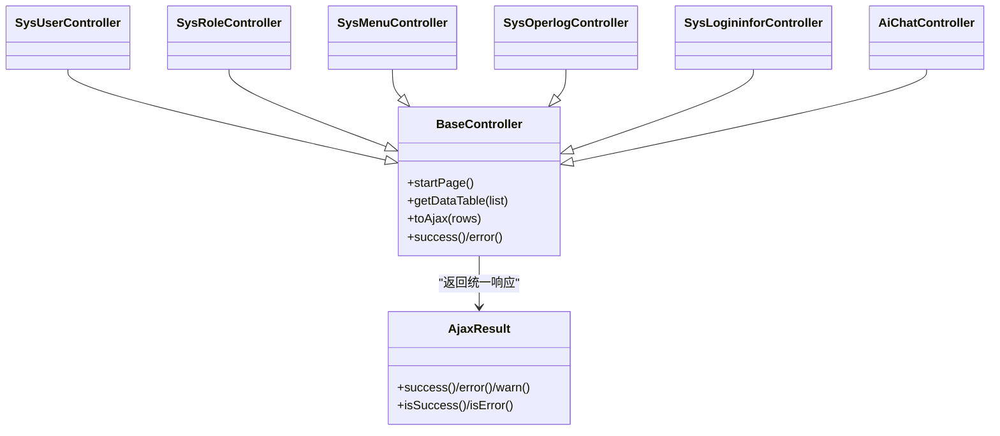

# API接口文档

<cite>
**本文引用的文件**
- [SysUserController.java](file://ruoyi-admin/src/main/java/com/ruoyi/web/controller/system/SysUserController.java)
- [SysRoleController.java](file://ruoyi-admin/src/main/java/com/ruoyi/web/controller/system/SysRoleController.java)
- [SysMenuController.java](file://ruoyi-admin/src/main/java/com/ruoyi/web/controller/system/SysMenuController.java)
- [SysDeptController.java](file://ruoyi-admin/src/main/java/com/ruoyi/web/controller/system/SysDeptController.java)
- [SysPostController.java](file://ruoyi-admin/src/main/java/com/ruoyi/web/controller/system/SysPostController.java)
- [SysDictTypeController.java](file://ruoyi-admin/src/main/java/com/ruoyi/web/controller/system/SysDictTypeController.java)
- [SysDictDataController.java](file://ruoyi-admin/src/main/java/com/ruoyi/web/controller/system/SysDictDataController.java)
- [SysConfigController.java](file://ruoyi-admin/src/main/java/com/ruoyi/web/controller/system/SysConfigController.java)
- [SysOperlogController.java](file://ruoyi-admin/src/main/java/com/ruoyi/web/controller/monitor/SysOperlogController.java)
- [SysLogininforController.java](file://ruoyi-admin/src/main/java/com/ruoyi/web/controller/monitor/SysLogininforController.java)
- [AiChatController.java](file://ruoyi-admin/src/main/java/com/ruoyi/ai/controller/AiChatController.java)
- [AjaxResult.java](file://ruoyi-common/src/main/java/com/ruoyi/common/core/domain/AjaxResult.java)
- [BaseController.java](file://ruoyi-common/src/main/java/com/ruoyi/common/core/controller/BaseController.java)
- [application.yml](file://ruoyi-admin/src/main/resources/application.yml)
- [SysLoginService.java](file://ruoyi-framework/src/main/java/com/ruoyi/framework/shiro/service/SysLoginService.java)
</cite>

## 目录
1. [简介](#简介)
2. [项目结构](#项目结构)
3. [核心组件](#核心组件)
4. [架构总览](#架构总览)
5. [详细组件分析](#详细组件分析)
6. [依赖分析](#依赖分析)
7. [性能考虑](#性能考虑)
8. [故障排查指南](#故障排查指南)
9. [结论](#结论)
10. [附录](#附录)

## 简介
本文件为 RuoYi 系统的完整 API 接口文档，覆盖用户管理、权限管理、系统监控与 AI 对话四大模块。文档对每个 RESTful 接口进行规范说明，包括 HTTP 方法、URL 路径、请求参数、响应格式、状态码、认证授权要求、调用示例与最佳实践，并解释版本管理策略与向后兼容性保障。

## 项目结构
RuoYi 采用前后端分离风格的后端工程，控制器位于 ruoyi-admin 模块，统一通过 BaseController 提供分页、权限注解与统一响应封装；业务逻辑在 ruoyi-system、ruoyi-framework 等模块中实现；公共响应体在 ruoyi-common 中定义。

图表来源
- [SysUserController.java:44-357](file://ruoyi-admin/src/main/java/com/ruoyi/web/controller/system/SysUserController.java#L44-L357)
- [SysRoleController.java:37-354](file://ruoyi-admin/src/main/java/com/ruoyi/web/controller/system/SysRoleController.java#L37-L354)
- [SysMenuController.java:32-212](file://ruoyi-admin/src/main/java/com/ruoyi/web/controller/system/SysMenuController.java#L32-L212)
- [SysOperlogController.java:28-91](file://ruoyi-admin/src/main/java/com/ruoyi/web/controller/monitor/SysOperlogController.java#L28-L91)
- [SysLogininforController.java:27-95](file://ruoyi-admin/src/main/java/com/ruoyi/web/controller/monitor/SysLogininforController.java#L27-L95)
- [AiChatController.java:23-63](file://ruoyi-admin/src/main/java/com/ruoyi/ai/controller/AiChatController.java#L23-L63)
- [BaseController.java:33-230](file://ruoyi-common/src/main/java/com/ruoyi/common/core/controller/BaseController.java#L33-L230)
- [AjaxResult.java:12-228](file://ruoyi-common/src/main/java/com/ruoyi/common/core/domain/AjaxResult.java#L12-L228)

章节来源
- [SysUserController.java:44-357](file://ruoyi-admin/src/main/java/com/ruoyi/web/controller/system/SysUserController.java#L44-L357)
- [SysRoleController.java:37-354](file://ruoyi-admin/src/main/java/com/ruoyi/web/controller/system/SysRoleController.java#L37-L354)
- [SysMenuController.java:32-212](file://ruoyi-admin/src/main/java/com/ruoyi/web/controller/system/SysMenuController.java#L32-L212)
- [SysOperlogController.java:28-91](file://ruoyi-admin/src/main/java/com/ruoyi/web/controller/monitor/SysOperlogController.java#L28-L91)
- [SysLogininforController.java:27-95](file://ruoyi-admin/src/main/java/com/ruoyi/web/controller/monitor/SysLogininforController.java#L27-L95)
- [AiChatController.java:23-63](file://ruoyi-admin/src/main/java/com/ruoyi/ai/controller/AiChatController.java#L23-L63)
- [BaseController.java:33-230](file://ruoyi-common/src/main/java/com/ruoyi/common/core/controller/BaseController.java#L33-L230)
- [AjaxResult.java:12-228](file://ruoyi-common/src/main/java/com/ruoyi/common/core/domain/AjaxResult.java#L12-L228)

## 核心组件
- 统一响应体
  - AjaxResult：以 code/msg/data 三段式返回，支持 SUCCESS/WARN/ERROR 三种状态类型。
  - BaseController：提供分页、权限注解、toAjax、success/error 等便捷方法。
- 安全与认证
  - Shiro 注解（如 @RequiresPermissions）用于权限控制。
  - SysLoginService：登录流程、验证码校验、用户状态校验、权限注入与登录信息记录。
- 配置中心
  - application.yml：包含版本号、AI 服务配置、文件上传限制、Shiro 会话与 CSRF/XSS 防护等。

章节来源
- [AjaxResult.java:12-228](file://ruoyi-common/src/main/java/com/ruoyi/common/core/domain/AjaxResult.java#L12-L228)
- [BaseController.java:33-230](file://ruoyi-common/src/main/java/com/ruoyi/common/core/controller/BaseController.java#L33-L230)
- [SysLoginService.java:36-185](file://ruoyi-framework/src/main/java/com/ruoyi/framework/shiro/service/SysLoginService.java#L36-L185)
- [application.yml:1-154](file://ruoyi-admin/src/main/resources/application.yml#L1-L154)

## 架构总览
RuoYi 的 API 层通过 Spring MVC 控制器暴露 REST 接口，控制器继承 BaseController，统一处理分页与响应；权限通过 Shiro 注解在方法级别控制；业务层由 ruoyi-system 与 ruoyi-framework 提供。

图表来源
- [SysUserController.java:64-153](file://ruoyi-admin/src/main/java/com/ruoyi/web/controller/system/SysUserController.java#L64-L153)
- [SysRoleController.java:54-149](file://ruoyi-admin/src/main/java/com/ruoyi/web/controller/system/SysRoleController.java#L54-L149)
- [SysMenuController.java:40-145](file://ruoyi-admin/src/main/java/com/ruoyi/web/controller/system/SysMenuController.java#L40-L145)
- [BaseController.java:110-140](file://ruoyi-common/src/main/java/com/ruoyi/common/core/controller/BaseController.java#L110-L140)
- [AjaxResult.java:12-228](file://ruoyi-common/src/main/java/com/ruoyi/common/core/domain/AjaxResult.java#L12-L228)

## 详细组件分析

### 用户管理接口
- 基础路径：/system/user
- 主要接口
  - GET /system/user：页面跳转，进入用户管理页
  - POST /system/user/list：分页查询用户列表
  - POST /system/user/export：导出用户为 Excel
  - POST /system/user/importData：导入用户 Excel
  - GET /system/user/importTemplate：下载导入模板
  - GET /system/user/add：进入新增用户页
  - POST /system/user/add：新增用户（含登录名/手机/邮箱唯一性校验）
  - GET /system/user/edit/{userId}：进入编辑用户页
  - POST /system/user/edit：更新用户（含唯一性校验与数据范围校验）
  - GET /system/user/resetPwd/{userId}：进入重置密码页
  - POST /system/user/resetPwd：重置用户密码
  - GET /system/user/authRole/{userId}：进入授权角色页
  - POST /system/user/authRole/insertAuthRole：授权用户角色
  - POST /system/user/remove：删除用户（不可删除本人）
  - POST /system/user/checkLoginNameUnique：校验登录名唯一
  - POST /system/user/checkPhoneUnique：校验手机号唯一
  - POST /system/user/checkEmailUnique：校验邮箱唯一
  - POST /system/user/changeStatus：切换用户状态
  - GET /system/user/deptTreeData：加载部门树
  - GET /system/user/selectDeptTree/{deptId}：选择部门树

- 请求参数
  - 分页查询：由 BaseController 内部构建 PageDomain 并交由 PageHelper 处理
  - 导入/导出：使用 ExcelUtil 泛型工具处理
  - 唯一性校验：SysUser 参数携带字段进行校验
  - 授权角色：userId 与 roleIds 数组

- 响应格式
  - 列表/分页：TableDataInfo（code/rows/total）
  - 其他：AjaxResult（code/msg/data）

- 权限要求
  - 使用 @RequiresPermissions("system:user:*") 精细控制各接口

- 示例
  - 新增用户
    - 方法：POST
    - 路径：/system/user/add
    - 请求体：SysUser（登录名、手机号、邮箱、角色ID、部门ID等）
    - 响应：AjaxResult（SUCCESS/WARN/ERROR）
  - 更新用户
    - 方法：POST
    - 路径：/system/user/edit
    - 请求体：SysUser（校验唯一性后更新）
    - 响应：AjaxResult

- 最佳实践
  - 在新增/编辑前先调用唯一性校验接口
  - 批量删除时避免删除当前登录用户
  - 更新用户后清理授权缓存

章节来源
- [SysUserController.java:64-357](file://ruoyi-admin/src/main/java/com/ruoyi/web/controller/system/SysUserController.java#L64-L357)
- [BaseController.java:56-118](file://ruoyi-common/src/main/java/com/ruoyi/common/core/controller/BaseController.java#L56-L118)
- [AjaxResult.java:12-228](file://ruoyi-common/src/main/java/com/ruoyi/common/core/domain/AjaxResult.java#L12-L228)

### 角色管理接口
- 基础路径：/system/role
- 主要接口
  - GET /system/role：页面跳转，进入角色管理页
  - POST /system/role/list：分页查询角色列表
  - POST /system/role/export：导出角色为 Excel
  - GET /system/role/add：进入新增角色页
  - POST /system/role/add：新增角色（名称/权限键唯一性校验）
  - GET /system/role/edit/{roleId}：进入编辑角色页
  - POST /system/role/edit：更新角色
  - GET /system/role/authDataScope/{roleId}：进入数据权限页
  - POST /system/role/authDataScope：保存数据权限
  - POST /system/role/remove：删除角色
  - POST /system/role/checkRoleNameUnique：校验角色名称唯一
  - POST /system/role/checkRoleKeyUnique：校验角色权限键唯一
  - GET /system/role/selectMenuTree：选择菜单树
  - POST /system/role/changeStatus：切换角色状态
  - GET /system/role/authUser/{roleId}：进入授权用户页
  - POST /system/role/authUser/allocatedList：已分配用户列表
  - POST /system/role/authUser/cancel：取消授权
  - POST /system/role/authUser/cancelAll：批量取消授权
  - GET /system/role/authUser/selectUser/{roleId}：选择未分配用户
  - POST /system/role/authUser/unallocatedList：未分配用户列表
  - POST /system/role/authUser/selectAll：批量授权用户
  - GET /system/role/deptTreeData：加载角色部门树
  - GET /system/role/view/{roleId}：查看角色详情（含菜单/数据权限/关联用户数）

- 权限要求
  - 使用 @RequiresPermissions("system:role:*") 精细控制

- 示例
  - 新增角色
    - 方法：POST
    - 路径：/system/role/add
    - 请求体：SysRole（角色名、权限键等）
    - 响应：AjaxResult

章节来源
- [SysRoleController.java:54-354](file://ruoyi-admin/src/main/java/com/ruoyi/web/controller/system/SysRoleController.java#L54-L354)
- [AjaxResult.java:12-228](file://ruoyi-common/src/main/java/com/ruoyi/common/core/domain/AjaxResult.java#L12-L228)

### 菜单管理接口
- 基础路径：/system/menu
- 主要接口
  - GET /system/menu：页面跳转，进入菜单管理页
  - POST /system/menu/list：按当前用户查询菜单列表
  - GET /system/menu/remove/{menuId}：删除菜单（禁止删除有子菜单或已分配的菜单）
  - GET /system/menu/add/{parentId}：进入新增菜单页
  - POST /system/menu/add：新增菜单（菜单名唯一性校验）
  - GET /system/menu/edit/{menuId}：进入编辑菜单页
  - POST /system/menu/edit：更新菜单
  - POST /system/menu/updateSort：保存菜单排序
  - GET /system/menu/icon：选择菜单图标页
  - POST /system/menu/checkMenuNameUnique：校验菜单名唯一
  - GET /system/menu/roleMenuTreeData：加载角色菜单树
  - GET /system/menu/menuTreeData：加载所有菜单树
  - GET /system/menu/selectMenuTree/{menuId}：选择菜单树

- 权限要求
  - 使用 @RequiresPermissions("system:menu:*") 精细控制

- 示例
  - 删除菜单
    - 方法：GET
    - 路径：/system/menu/remove/{menuId}
    - 响应：AjaxResult（若存在子菜单或已分配则提示警告）

章节来源
- [SysMenuController.java:40-212](file://ruoyi-admin/src/main/java/com/ruoyi/web/controller/system/SysMenuController.java#L40-L212)
- [AjaxResult.java:12-228](file://ruoyi-common/src/main/java/com/ruoyi/common/core/domain/AjaxResult.java#L12-L228)

### 部门管理接口
- 基础路径：/system/dept
- 主要接口
  - GET /system/dept：页面跳转，进入部门管理页
  - POST /system/dept/list：查询部门列表
  - GET /system/dept/add/{parentId}：进入新增部门页
  - POST /system/dept/add：新增部门（部门名唯一性校验）
  - GET /system/dept/edit/{deptId}：进入编辑部门页
  - POST /system/dept/edit：更新部门（禁止上级为自身，停用时需无未停用子部门）
  - POST /system/dept/updateSort：保存部门排序
  - GET /system/dept/remove/{deptId}：删除部门（禁止删除有下级或存在用户的部门）
  - POST /system/dept/checkDeptNameUnique：校验部门名唯一
  - GET /system/dept/selectDeptTree/{deptId}：选择部门树
  - GET /system/dept/selectDeptTree/{deptId}/{excludeId}：带排除ID的选择部门树
  - GET /system/dept/treeData/{excludeId}：加载部门树（排除下级）

- 权限要求
  - 使用 @RequiresPermissions("system:dept:*") 精细控制

- 示例
  - 更新部门
    - 方法：POST
    - 路径：/system/dept/edit
    - 请求体：SysDept（父级ID、状态等）
    - 响应：AjaxResult（若违反约束返回错误）

章节来源
- [SysDeptController.java:39-204](file://ruoyi-admin/src/main/java/com/ruoyi/web/controller/system/SysDeptController.java#L39-L204)
- [AjaxResult.java:12-228](file://ruoyi-common/src/main/java/com/ruoyi/common/core/domain/AjaxResult.java#L12-L228)

### 岗位管理接口
- 基础路径：/system/post
- 主要接口
  - GET /system/post：页面跳转，进入岗位管理页
  - POST /system/post/list：分页查询岗位列表
  - POST /system/post/export：导出岗位为 Excel
  - POST /system/post/remove：删除岗位
  - GET /system/post/add：进入新增岗位页
  - POST /system/post/add：新增岗位（名称/编码唯一性校验）
  - GET /system/post/edit/{postId}：进入编辑岗位页
  - POST /system/post/edit：更新岗位（名称/编码唯一性校验）
  - POST /system/post/checkPostNameUnique：校验岗位名唯一
  - POST /system/post/checkPostCodeUnique：校验岗位编码唯一

- 权限要求
  - 使用 @RequiresPermissions("system:post:*") 精细控制

- 示例
  - 新增岗位
    - 方法：POST
    - 路径：/system/post/add
    - 请求体：SysPost（岗位名、编码等）
    - 响应：AjaxResult

章节来源
- [SysPostController.java:37-157](file://ruoyi-admin/src/main/java/com/ruoyi/web/controller/system/SysPostController.java#L37-L157)
- [AjaxResult.java:12-228](file://ruoyi-common/src/main/java/com/ruoyi/common/core/domain/AjaxResult.java#L12-L228)

### 字典管理接口
- 基础路径：/system/dict 与 /system/dict/data
- 类型接口
  - GET /system/dict：页面跳转，进入字典类型管理页
  - POST /system/dict/list：分页查询字典类型
  - POST /system/dict/export：导出字典类型为 Excel
  - GET /system/dict/add：进入新增字典类型页
  - POST /system/dict/add：新增字典类型（类型唯一性校验）
  - GET /system/dict/edit/{dictId}：进入编辑字典类型页
  - POST /system/dict/edit：更新字典类型（类型唯一性校验）
  - POST /system/dict/remove：删除字典类型
  - GET /system/dict/detail/{dictId}：查看字典详情与字典列表
  - POST /system/dict/checkDictTypeUnique：校验字典类型唯一
  - GET /system/dict/selectDictTree/{columnId}/{dictType}：选择字典树
  - GET /system/dict/treeData：加载字典树
  - GET /system/dict/refreshCache：刷新字典缓存
- 数据接口
  - GET /system/dict/data：页面跳转，进入字典数据管理页
  - POST /system/dict/data/list：分页查询字典数据
  - POST /system/dict/data/export：导出字典数据为 Excel
  - GET /system/dict/data/add/{dictType}：进入新增字典数据页
  - POST /system/dict/data/add：新增字典数据
  - GET /system/dict/data/edit/{dictCode}：进入编辑字典数据页
  - POST /system/dict/data/edit：更新字典数据
  - POST /system/dict/data/remove：删除字典数据

- 权限要求
  - 使用 @RequiresPermissions("system:dict:*") 精细控制

- 示例
  - 新增字典类型
    - 方法：POST
    - 路径：/system/dict/add
    - 请求体：SysDictType（类型名、类型键等）
    - 响应：AjaxResult

章节来源
- [SysDictTypeController.java:38-189](file://ruoyi-admin/src/main/java/com/ruoyi/web/controller/system/SysDictTypeController.java#L38-L189)
- [SysDictDataController.java:37-123](file://ruoyi-admin/src/main/java/com/ruoyi/web/controller/system/SysDictDataController.java#L37-L123)
- [AjaxResult.java:12-228](file://ruoyi-common/src/main/java/com/ruoyi/common/core/domain/AjaxResult.java#L12-L228)

### 参数配置接口
- 基础路径：/system/config
- 主要接口
  - GET /system/config：页面跳转，进入参数配置页
  - POST /system/config/list：分页查询参数配置
  - POST /system/config/export：导出参数配置为 Excel
  - GET /system/config/add：进入新增参数配置页
  - POST /system/config/add：新增参数配置（键唯一性校验）
  - GET /system/config/edit/{configId}：进入编辑参数配置页
  - POST /system/config/edit：更新参数配置（键唯一性校验）
  - POST /system/config/remove：删除参数配置
  - GET /system/config/refreshCache：刷新参数缓存
  - POST /system/config/checkConfigKeyUnique：校验参数键唯一

- 权限要求
  - 使用 @RequiresPermissions("system:config:*") 精细控制

- 示例
  - 新增参数配置
    - 方法：POST
    - 路径：/system/config/add
    - 请求体：SysConfig（参数名、键、值等）
    - 响应：AjaxResult

章节来源
- [SysConfigController.java:37-159](file://ruoyi-admin/src/main/java/com/ruoyi/web/controller/system/SysConfigController.java#L37-L159)
- [AjaxResult.java:12-228](file://ruoyi-common/src/main/java/com/ruoyi/common/core/domain/AjaxResult.java#L12-L228)

### 系统监控接口
- 操作日志
  - 基础路径：/monitor/operlog
  - 主要接口
    - GET /monitor/operlog：页面跳转，进入操作日志页
    - POST /monitor/operlog/list：分页查询操作日志
    - POST /monitor/operlog/export：导出操作日志为 Excel
    - POST /monitor/operlog/remove：删除操作日志
    - GET /monitor/operlog/detail/{operId}：查看日志详情
    - POST /monitor/operlog/clean：清空操作日志
- 登录日志
  - 基础路径：/monitor/logininfor
  - 主要接口
    - GET /monitor/logininfor：页面跳转，进入登录日志页
    - POST /monitor/logininfor/list：分页查询登录日志
    - POST /monitor/logininfor/export：导出登录日志为 Excel
    - POST /monitor/logininfor/remove：删除登录日志
    - POST /monitor/logininfor/clean：清空登录日志
    - POST /monitor/logininfor/unlock：账户解锁（清除登录错误缓存）

- 权限要求
  - 使用 @RequiresPermissions("monitor:*") 精细控制

- 示例
  - 清空登录日志
    - 方法：POST
    - 路径：/monitor/logininfor/clean
    - 响应：AjaxResult

章节来源
- [SysOperlogController.java:36-91](file://ruoyi-admin/src/main/java/com/ruoyi/web/controller/monitor/SysOperlogController.java#L36-L91)
- [SysLogininforController.java:38-95](file://ruoyi-admin/src/main/java/com/ruoyi/web/controller/monitor/SysLogininforController.java#L38-L95)
- [AjaxResult.java:12-228](file://ruoyi-common/src/main/java/com/ruoyi/common/core/domain/AjaxResult.java#L12-L228)

### AI 对话接口
- 基础路径：/ai/chat
- 主要接口
  - GET /ai/chat：页面跳转，进入AI对话页
  - POST /ai/chat/send：流式发送问题并获取AI回答（SSE）
    - 请求参数：message（必填，非空）
    - 响应：SSE 流，事件名为 data，错误时事件名为 error
    - 权限：@RequiresPermissions("ai:chat:view")

- 配置
  - application.yml 中包含 AI 服务基础地址、模型名称与 API Key

- 示例
  - 发送问题
    - 方法：POST
    - 路径：/ai/chat/send?message=你好
    - 响应：SSE 流，逐条推送回答片段

图表来源
- [AiChatController.java:41-61](file://ruoyi-admin/src/main/java/com/ruoyi/ai/controller/AiChatController.java#L41-L61)

章节来源
- [AiChatController.java:31-63](file://ruoyi-admin/src/main/java/com/ruoyi/ai/controller/AiChatController.java#L31-L63)
- [application.yml:141-149](file://ruoyi-admin/src/main/resources/application.yml#L141-L149)

## 依赖分析
- 控制器与基础类
  - 所有控制器均继承 BaseController，复用分页、权限注解与统一响应封装
- 统一响应
  - AjaxResult 提供 SUCCESS/WARN/ERROR 三态与 code/msg/data 结构
- 安全控制
  - @RequiresPermissions 在控制器方法上声明所需权限
  - SysLoginService 负责登录校验与权限注入

图表来源
- [BaseController.java:33-230](file://ruoyi-common/src/main/java/com/ruoyi/common/core/controller/BaseController.java#L33-L230)
- [AjaxResult.java:12-228](file://ruoyi-common/src/main/java/com/ruoyi/common/core/domain/AjaxResult.java#L12-L228)
- [SysUserController.java:44-357](file://ruoyi-admin/src/main/java/com/ruoyi/web/controller/system/SysUserController.java#L44-L357)
- [SysRoleController.java:37-354](file://ruoyi-admin/src/main/java/com/ruoyi/web/controller/system/SysRoleController.java#L37-L354)
- [SysMenuController.java:32-212](file://ruoyi-admin/src/main/java/com/ruoyi/web/controller/system/SysMenuController.java#L32-L212)
- [SysOperlogController.java:28-91](file://ruoyi-admin/src/main/java/com/ruoyi/web/controller/monitor/SysOperlogController.java#L28-L91)
- [SysLogininforController.java:27-95](file://ruoyi-admin/src/main/java/com/ruoyi/web/controller/monitor/SysLogininforController.java#L27-L95)
- [AiChatController.java:23-63](file://ruoyi-admin/src/main/java/com/ruoyi/ai/controller/AiChatController.java#L23-L63)

## 性能考虑
- 分页与排序
  - BaseController 内部使用 PageHelper 与 TableSupport，建议前端传入合理的分页与排序参数，避免一次性拉取大量数据
- 唯一性校验
  - 新增/编辑前调用唯一性校验接口，减少无效写入
- 缓存与授权
  - 更新角色/用户/菜单等关键实体后，控制器通常会清理授权缓存，确保权限即时生效
- 文件上传
  - application.yml 中限制了单文件与总请求大小，建议前端配合分片上传与断点续传
- AI 对话
  - SSE 流式响应适合长文本输出，建议客户端做好断线重连与缓冲区管理

## 故障排查指南
- 权限不足
  - 现象：返回 AjaxResult 错误
  - 处理：确认当前用户是否具备对应 @RequiresPermissions 权限
- 唯一性冲突
  - 现象：新增/编辑返回“已存在”提示
  - 处理：先调用唯一性校验接口，或更换唯一字段值
- 删除受限
  - 现象：删除部门/菜单/角色时报“存在下级/已分配/存在用户”
  - 处理：先清理子项或解除关联后再删除
- 登录异常
  - 现象：登录失败、验证码错误、账户被拉黑
  - 处理：检查 SysLoginService 的校验逻辑与配置项（如黑名单、验证码开关）

章节来源
- [SysDeptController.java:151-163](file://ruoyi-admin/src/main/java/com/ruoyi/web/controller/system/SysDeptController.java#L151-L163)
- [SysMenuController.java:64-76](file://ruoyi-admin/src/main/java/com/ruoyi/web/controller/system/SysMenuController.java#L64-L76)
- [SysRoleController.java:170-180](file://ruoyi-admin/src/main/java/com/ruoyi/web/controller/system/SysRoleController.java#L170-L180)
- [SysLoginService.java:54-131](file://ruoyi-framework/src/main/java/com/ruoyi/framework/shiro/service/SysLoginService.java#L54-L131)

## 结论
本接口文档基于 RuoYi 当前代码实现，覆盖用户、角色、菜单、部门、岗位、字典、参数、监控与 AI 对话等核心模块。统一的 BaseController 与 AjaxResult 使响应风格一致，Shiro 注解提供了细粒度的权限控制。建议在生产环境中结合分页、缓存与安全策略，持续完善接口的可观测性与稳定性。

## 附录

### 版本管理与兼容性
- 版本标识
  - application.yml 中定义了 ruoyi.version（例如 4.8.3），可用于接口版本标注或前端灰度发布
- 兼容性建议
  - 保持请求/响应字段稳定，新增字段采用可选策略
  - 对于破坏性变更，建议通过新增版本路径或查询参数进行过渡

章节来源
- [application.yml:5-6](file://ruoyi-admin/src/main/resources/application.yml#L5-L6)

### 认证与授权
- 登录流程
  - SysLoginService 负责用户名/密码/验证码/黑名单/状态等校验，并注入角色权限与登录信息记录
- 权限注解
  - @RequiresPermissions("模块:功能:动作") 精细化控制接口访问

章节来源
- [SysLoginService.java:54-131](file://ruoyi-framework/src/main/java/com/ruoyi/framework/shiro/service/SysLoginService.java#L54-L131)

### 响应格式说明
- AjaxResult
  - 字段：code（状态码）、msg（消息）、data（数据对象）
  - 状态：SUCCESS(0)/WARN(301)/ERROR(500)
- BaseController
  - 统一分页返回 TableDataInfo（code/rows/total）
  - toAjax(rows) 自动根据影响行数返回成功/失败

章节来源
- [AjaxResult.java:12-228](file://ruoyi-common/src/main/java/com/ruoyi/common/core/domain/AjaxResult.java#L12-L228)
- [BaseController.java:110-140](file://ruoyi-common/src/main/java/com/ruoyi/common/core/controller/BaseController.java#L110-L140)