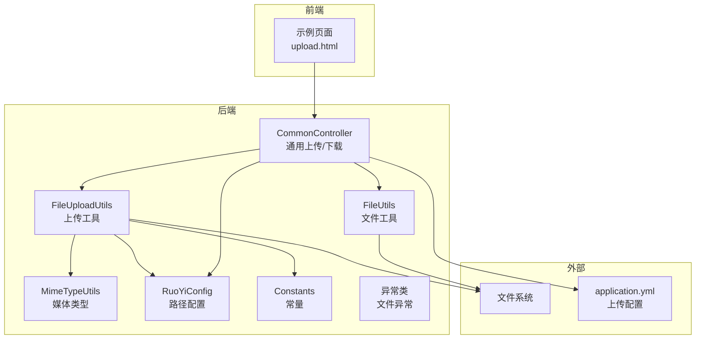
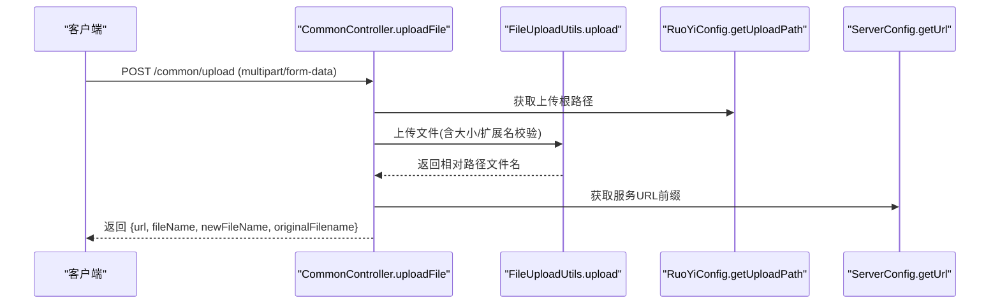
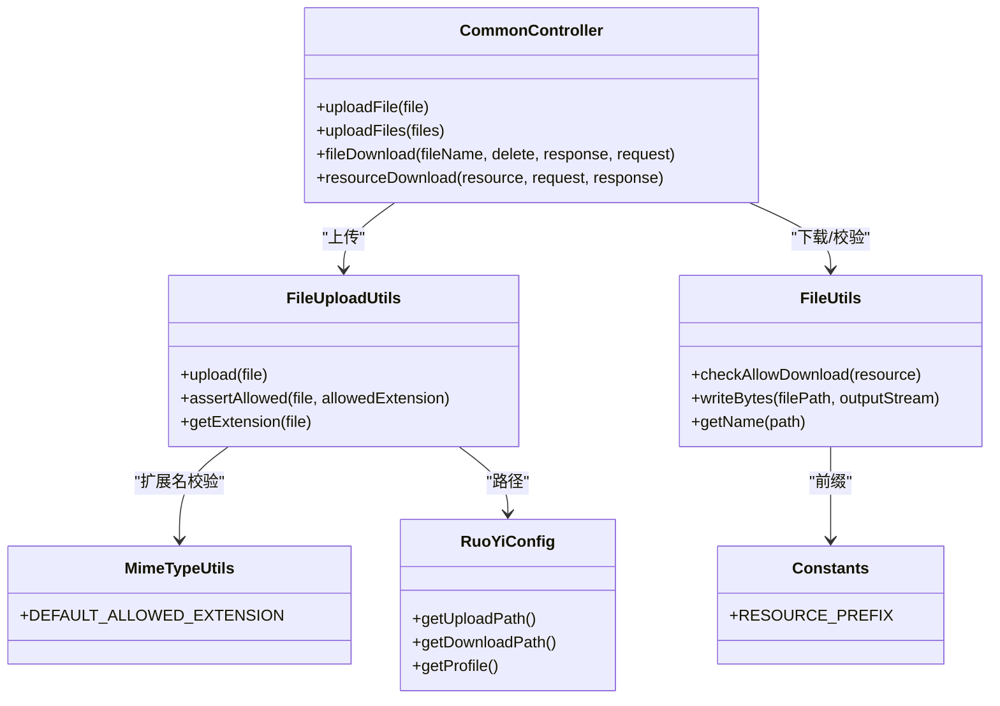

# 文件上传API

<cite>
**本文引用的文件**
- [CommonController.java](file://ruoyi-admin/src/main/java/com/ruoyi/web/controller/common/CommonController.java)
- [FileUploadUtils.java](file://ruoyi-common/src/main/java/com/ruoyi/common/utils/file/FileUploadUtils.java)
- [FileUtils.java](file://ruoyi-common/src/main/java/com/ruoyi/common/utils/file/FileUtils.java)
- [MimeTypeUtils.java](file://ruoyi-common/src/main/java/com/ruoyi/common/utils/file/MimeTypeUtils.java)
- [Constants.java](file://ruoyi-common/src/main/java/com/ruoyi/common/constant/Constants.java)
- [RuoYiConfig.java](file://ruoyi-common/src/main/java/com/ruoyi/common/config/RuoYiConfig.java)
- [application.yml](file://ruoyi-admin/src/main/resources/application.yml)
- [upload.html](file://ruoyi-admin/src/main/resources/templates/demo/form/upload.html)
- [FileException.java](file://ruoyi-common/src/main/java/com/ruoyi/common/exception/file/FileException.java)
- [FileSizeLimitExceededException.java](file://ruoyi-common/src/main/java/com/ruoyi/common/exception/file/FileSizeLimitExceededException.java)
- [InvalidExtensionException.java](file://ruoyi-common/src/main/java/com/ruoyi/common/exception/file/InvalidExtensionException.java)
</cite>

## 目录
1. [简介](#简介)
2. [项目结构](#项目结构)
3. [核心组件](#核心组件)
4. [架构总览](#架构总览)
5. [详细组件分析](#详细组件分析)
6. [依赖关系分析](#依赖关系分析)
7. [性能考量](#性能考量)
8. [故障排查指南](#故障排查指南)
9. [结论](#结论)
10. [附录](#附录)

## 简介
本文件上传API基于RuoYi框架实现，提供统一的文件上传与下载能力，覆盖单文件上传、多文件上传、批量上传、资源下载、文件删除等场景。系统支持多种文件类型与大小限制，并内置安全校验与命名策略，确保上传文件的安全性与可追溯性。

## 项目结构
文件上传相关的核心代码分布于以下模块：
- 控制层：通用上传与下载接口位于通用控制器中
- 工具层：文件上传、下载、类型判断、扩展名解析等工具类
- 配置层：全局路径配置、Spring文件上传配置
- 前端示例：Bootstrap FileInput控件集成示例页面

图表来源
- [CommonController.java:1-165](file://ruoyi-admin/src/main/java/com/ruoyi/web/controller/common/CommonController.java#L1-L165)
- [FileUploadUtils.java:1-260](file://ruoyi-common/src/main/java/com/ruoyi/common/utils/file/FileUploadUtils.java#L1-L260)
- [FileUtils.java:1-303](file://ruoyi-common/src/main/java/com/ruoyi/common/utils/file/FileUtils.java#L1-L303)
- [MimeTypeUtils.java:1-60](file://ruoyi-common/src/main/java/com/ruoyi/common/utils/file/MimeTypeUtils.java#L1-L60)
- [RuoYiConfig.java:1-125](file://ruoyi-common/src/main/java/com/ruoyi/common/config/RuoYiConfig.java#L1-L125)
- [application.yml:63-70](file://ruoyi-admin/src/main/resources/application.yml#L63-L70)

章节来源
- [CommonController.java:1-165](file://ruoyi-admin/src/main/java/com/ruoyi/web/controller/common/CommonController.java#L1-L165)
- [application.yml:63-70](file://ruoyi-admin/src/main/resources/application.yml#L63-L70)

## 核心组件
- 通用控制器：提供上传与下载接口，封装响应结果
- 上传工具：负责文件大小、扩展名、路径生成与落盘
- 文件工具：负责下载、删除、安全校验、文件名提取等
- 媒体类型：定义默认允许的扩展名集合
- 路径配置：提供上传、下载、头像、导入等路径
- 异常体系：针对文件大小、扩展名、文件名长度等异常进行分类处理

章节来源
- [CommonController.java:75-163](file://ruoyi-admin/src/main/java/com/ruoyi/web/controller/common/CommonController.java#L75-L163)
- [FileUploadUtils.java:24-260](file://ruoyi-common/src/main/java/com/ruoyi/common/utils/file/FileUploadUtils.java#L24-L260)
- [FileUtils.java:28-303](file://ruoyi-common/src/main/java/com/ruoyi/common/utils/file/FileUtils.java#L28-L303)
- [MimeTypeUtils.java:8-60](file://ruoyi-common/src/main/java/com/ruoyi/common/utils/file/MimeTypeUtils.java#L8-L60)
- [RuoYiConfig.java:13-125](file://ruoyi-common/src/main/java/com/ruoyi/common/config/RuoYiConfig.java#L13-L125)
- [FileException.java:1-200](file://ruoyi-common/src/main/java/com/ruoyi/common/exception/file/FileException.java#L1-L200)

## 架构总览
文件上传流程从HTTP请求进入通用控制器，经由上传工具完成安全校验与命名，再写入文件系统；下载流程通过文件工具进行安全校验与响应输出。

图表来源
- [CommonController.java:75-97](file://ruoyi-admin/src/main/java/com/ruoyi/web/controller/common/CommonController.java#L75-L97)
- [FileUploadUtils.java:102-139](file://ruoyi-common/src/main/java/com/ruoyi/common/utils/file/FileUploadUtils.java#L102-L139)
- [RuoYiConfig.java:118-123](file://ruoyi-common/src/main/java/com/ruoyi/common/config/RuoYiConfig.java#L118-L123)

## 详细组件分析

### 通用上传接口
- 单文件上传
  - 路径：/common/upload
  - 方法：POST
  - 请求体：multipart/form-data，字段名为file
  - 响应：包含url、fileName、newFileName、originalFilename
- 多文件上传
  - 路径：/common/uploads
  - 方法：POST
  - 请求体：multipart/form-data，字段名为files（多选）
  - 响应：包含urls、fileNames、newFileNames、originalFilenames（逗号分隔）

请求格式说明
- Content-Type：multipart/form-data
- 字段名：单文件为file，多文件为files
- 前端示例：Bootstrap FileInput控件集成，支持单文件与多文件上传

章节来源
- [CommonController.java:75-135](file://ruoyi-admin/src/main/java/com/ruoyi/web/controller/common/CommonController.java#L75-L135)
- [upload.html:44-72](file://ruoyi-admin/src/main/resources/templates/demo/form/upload.html#L44-L72)

### 通用下载接口
- 路径：/common/download
- 方法：GET
- 查询参数：fileName、delete（可选）
- 行为：校验文件名合法性，构造真实文件名，设置响应头并输出文件流；若delete为true则下载后删除

章节来源
- [CommonController.java:46-70](file://ruoyi-admin/src/main/java/com/ruoyi/web/controller/common/CommonController.java#L46-L70)
- [FileUtils.java:142-169](file://ruoyi-common/src/main/java/com/ruoyi/common/utils/file/FileUtils.java#L142-L169)

### 资源下载接口
- 路径：/common/download/resource
- 方法：GET
- 查询参数：resource
- 行为：移除资源前缀，拼接本地路径，设置响应头并输出文件流

章节来源
- [CommonController.java:140-163](file://ruoyi-admin/src/main/java/com/ruoyi/web/controller/common/CommonController.java#L140-L163)
- [FileUtils.java:113-116](file://ruoyi-common/src/main/java/com/ruoyi/common/utils/file/FileUtils.java#L113-L116)

### 文件删除接口
- 当前仓库未提供专门的“删除文件”REST接口
- 可通过下载接口携带delete=true参数实现“下载后删除”的行为
- 若需独立删除接口，可在通用控制器中新增对应方法

章节来源
- [CommonController.java:46-70](file://ruoyi-admin/src/main/java/com/ruoyi/web/controller/common/CommonController.java#L46-L70)

### 支持的文件类型与大小限制
- 默认允许扩展名（图片、文档、压缩包、视频、PDF等）
- 默认最大文件大小：50MB（工具类常量）
- Spring上传配置（application.yml）：
  - 单文件最大：10MB
  - 总请求大小：20MB

章节来源
- [MimeTypeUtils.java:29-39](file://ruoyi-common/src/main/java/com/ruoyi/common/utils/file/MimeTypeUtils.java#L29-L39)
- [FileUploadUtils.java:27-29](file://ruoyi-common/src/main/java/com/ruoyi/common/utils/file/FileUploadUtils.java#L27-L29)
- [application.yml:67-69](file://ruoyi-admin/src/main/resources/application.yml#L67-L69)

### 文件存储策略与命名规则
- 存储位置
  - 上传路径：/profile/upload（由RuoYiConfig提供）
  - 下载路径：/profile/download
- 命名规则
  - 日期目录：按上传日期生成子目录（如2026/05/23）
  - 文件名：原文件名+序列值或UUID（根据是否启用自定义命名）
  - 扩展名：从原始文件或MIME类型推断
- 路径生成
  - 返回路径前缀为/profile，便于静态资源访问

章节来源
- [RuoYiConfig.java:118-123](file://ruoyi-common/src/main/java/com/ruoyi/common/config/RuoYiConfig.java#L118-L123)
- [FileUploadUtils.java:144-155](file://ruoyi-common/src/main/java/com/ruoyi/common/utils/file/FileUploadUtils.java#L144-L155)
- [FileUploadUtils.java:171-176](file://ruoyi-common/src/main/java/com/ruoyi/common/utils/file/FileUploadUtils.java#L171-L176)
- [Constants.java:95](file://ruoyi-common/src/main/java/com/ruoyi/common/constant/Constants.java#L95)

### 安全验证机制
- 文件名长度限制：默认100字符
- 文件名合法性：仅允许字母、数字、下划线、竖线、点、中文
- 下载白名单：仅允许默认允许扩展名的文件被下载
- 防目录穿越：禁止路径中出现“..”
- MIME扩展名校验：严格比对允许扩展名集合

章节来源
- [FileUploadUtils.java:126-130](file://ruoyi-common/src/main/java/com/ruoyi/common/utils/file/FileUploadUtils.java#L126-L130)
- [FileUtils.java:142-169](file://ruoyi-common/src/main/java/com/ruoyi/common/utils/file/FileUtils.java#L142-L169)
- [MimeTypeUtils.java:29-39](file://ruoyi-common/src/main/java/com/ruoyi/common/utils/file/MimeTypeUtils.java#L29-L39)

### 预览与缩略图（概念说明）
- 仓库未提供专门的“文件预览”或“缩略图生成”接口
- 前端示例页面展示了文件列表与缩略图展示能力，但具体预览逻辑依赖前端组件
- 若需后端生成缩略图，可在上传工具或业务层扩展对应逻辑

章节来源
- [upload.html:44-72](file://ruoyi-admin/src/main/resources/templates/demo/form/upload.html#L44-L72)

## 依赖关系分析
- 控制器依赖上传工具与文件工具，上传工具依赖媒体类型与路径配置
- 异常类用于上传过程中的错误反馈
- Spring配置影响上传大小上限

图表来源
- [CommonController.java:75-163](file://ruoyi-admin/src/main/java/com/ruoyi/web/controller/common/CommonController.java#L75-L163)
- [FileUploadUtils.java:102-260](file://ruoyi-common/src/main/java/com/ruoyi/common/utils/file/FileUploadUtils.java#L102-L260)
- [FileUtils.java:142-303](file://ruoyi-common/src/main/java/com/ruoyi/common/utils/file/FileUtils.java#L142-L303)
- [MimeTypeUtils.java:29-39](file://ruoyi-common/src/main/java/com/ruoyi/common/utils/file/MimeTypeUtils.java#L29-L39)
- [RuoYiConfig.java:118-123](file://ruoyi-common/src/main/java/com/ruoyi/common/config/RuoYiConfig.java#L118-L123)
- [Constants.java:95](file://ruoyi-common/src/main/java/com/ruoyi/common/constant/Constants.java#L95)

## 性能考量
- 上传大小限制：工具类默认50MB，Spring配置限制更严格（单文件10MB，总20MB），建议根据业务调整
- 文件命名：使用日期目录与UUID/序列值，避免同名冲突，提升并发安全性
- 下载响应：采用流式输出，减少内存占用
- 建议：对大文件可考虑分片上传与断点续传（当前仓库未实现）

章节来源
- [FileUploadUtils.java:27-29](file://ruoyi-common/src/main/java/com/ruoyi/common/utils/file/FileUploadUtils.java#L27-L29)
- [application.yml:67-69](file://ruoyi-admin/src/main/resources/application.yml#L67-L69)

## 故障排查指南
- 文件过大
  - 现象：抛出文件大小超限异常
  - 处理：调整Spring配置或后端默认限制
- 扩展名不合法
  - 现象：抛出无效扩展名异常
  - 处理：确认文件扩展名是否在默认允许集合内
- 文件名过长
  - 现象：抛出文件名长度超限异常
  - 处理：缩短文件名或修改默认长度限制
- 下载失败
  - 现象：路径非法或文件不存在
  - 处理：检查文件路径、扩展名白名单与“..”穿越

章节来源
- [FileSizeLimitExceededException.java:8-17](file://ruoyi-common/src/main/java/com/ruoyi/common/exception/file/FileSizeLimitExceededException.java#L8-L17)
- [InvalidExtensionException.java:10-81](file://ruoyi-common/src/main/java/com/ruoyi/common/exception/file/InvalidExtensionException.java#L10-L81)
- [FileException.java:1-200](file://ruoyi-common/src/main/java/com/ruoyi/common/exception/file/FileException.java#L1-L200)
- [FileUtils.java:142-169](file://ruoyi-common/src/main/java/com/ruoyi/common/utils/file/FileUtils.java#L142-L169)

## 结论
该文件上传API提供了统一、安全、可扩展的上传与下载能力，具备完善的校验与命名策略。结合前端示例，可快速集成单文件与多文件上传场景。对于大文件与预览/缩略图需求，可在现有基础上扩展实现。

## 附录

### 接口一览表
- 上传
  - 单文件：POST /common/upload
  - 多文件：POST /common/uploads
- 下载
  - 普通下载：GET /common/download?fileName=...&delete=...
  - 资源下载：GET /common/download/resource?resource=...

章节来源
- [CommonController.java:46-163](file://ruoyi-admin/src/main/java/com/ruoyi/web/controller/common/CommonController.java#L46-L163)