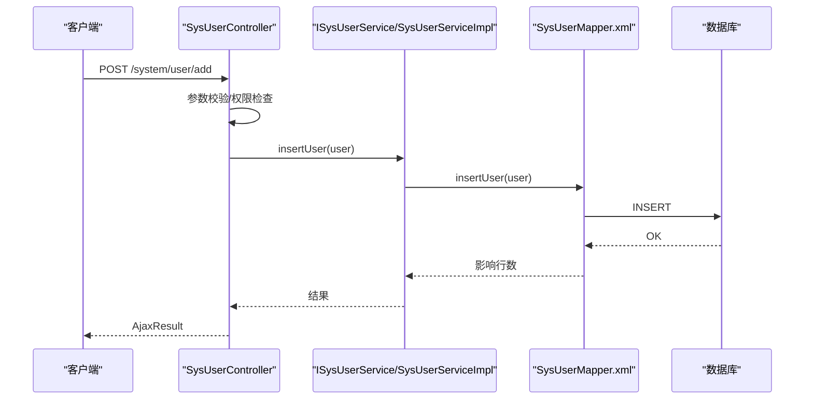
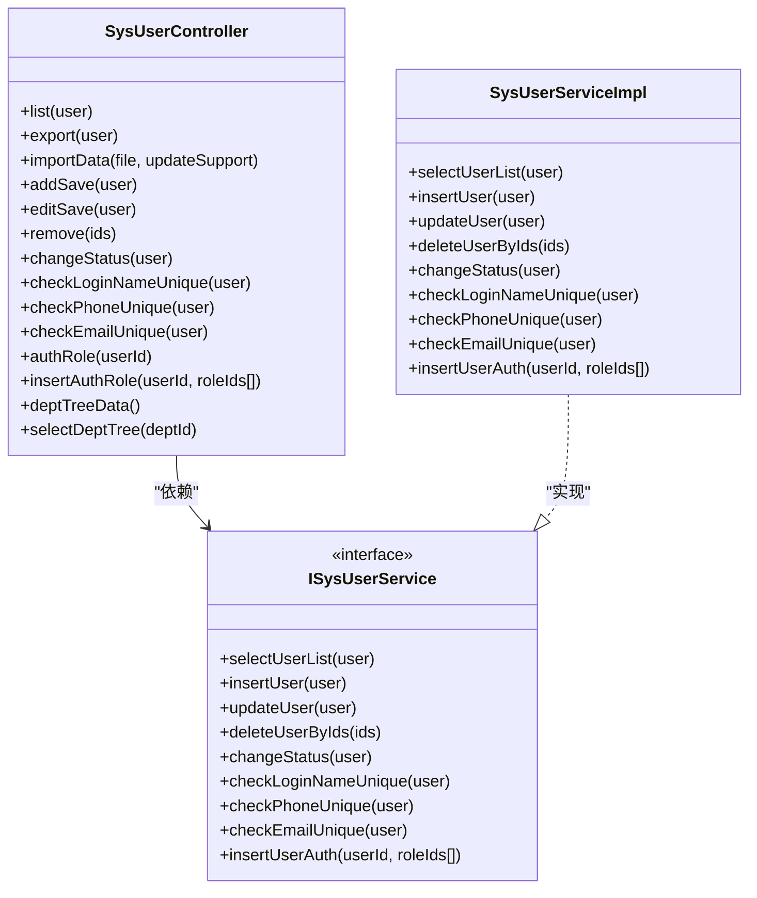

# 用户管理API

<cite>
**本文档引用的文件**
- [SysUserController.java](file://ruoyi-admin/src/main/java/com/ruoyi/web/controller/system/SysUserController.java)
- [ISysUserService.java](file://ruoyi-system/src/main/java/com/ruoyi/system/service/ISysUserService.java)
- [SysUserServiceImpl.java](file://ruoyi-system/src/main/java/com/ruoyi/system/service/impl/SysUserServiceImpl.java)
- [SysUser.java](file://ruoyi-common/src/main/java/com/ruoyi/common/core/domain/entity/SysUser.java)
- [UserConstants.java](file://ruoyi-common/src/main/java/com/ruoyi/common/constant/UserConstants.java)
- [PermissionConstants.java](file://ruoyi-common/src/main/java/com/ruoyi/common/constant/PermissionConstants.java)
- [SysUserMapper.xml](file://ruoyi-system/src/main/resources/mapper/system/SysUserMapper.xml)
- [user.html](file://ruoyi-admin/src/main/resources/templates/system/user/user.html)
- [add.html](file://ruoyi-admin/src/main/resources/templates/system/user/add.html)
- [edit.html](file://ruoyi-admin/src/main/resources/templates/system/user/edit.html)
- [authRole.html](file://ruoyi-admin/src/main/resources/templates/system/user/authRole.html)
- [profile.html](file://ruoyi-admin/src/main/resources/templates/system/user/profile/profile.html)
</cite>

## 目录
1. [简介](#简介)
2. [项目结构](#项目结构)
3. [核心组件](#核心组件)
4. [架构总览](#架构总览)
5. [详细组件分析](#详细组件分析)
6. [依赖关系分析](#依赖关系分析)
7. [性能考虑](#性能考虑)
8. [故障排除指南](#故障排除指南)
9. [结论](#结论)

## 简介
本文件面向后端开发与测试人员，系统化梳理用户管理模块的RESTful接口，覆盖用户CRUD、状态变更、导入导出、唯一性校验、角色授权、部门树选择等能力，并明确权限要求、请求参数、响应格式及典型成功/失败场景。

## 项目结构
用户管理相关代码采用经典的三层架构：
- 控制器层：负责HTTP路由、参数接收、权限校验与调用服务层
- 服务层：封装业务逻辑、数据校验、事务控制与数据范围控制
- 数据访问层：MyBatis映射XML执行SQL

```mermaid
graph TB
subgraph "控制器层"
C1["SysUserController<br/>/system/user 路由"]
end
subgraph "服务层"
S1["ISysUserService 接口"]
S2["SysUserServiceImpl 实现"]
end
subgraph "数据访问层"
M1["SysUserMapper.xml"]
end
subgraph "领域模型"
E1["SysUser 实体"]
end
subgraph "常量与权限"
K1["UserConstants 常量"]
K2["PermissionConstants 权限常量"]
end
C1 --> S1
S1 < --> S2
S2 --> M1
S2 --> E1
C1 --> K1
C1 --> K2
```

图表来源
- [SysUserController.java:44-357](file://ruoyi-admin/src/main/java/com/ruoyi/web/controller/system/SysUserController.java#L44-L357)
- [ISysUserService.java:13-235](file://ruoyi-system/src/main/java/com/ruoyi/system/service/ISysUserService.java#L13-L235)
- [SysUserServiceImpl.java:46-596](file://ruoyi-system/src/main/java/com/ruoyi/system/service/impl/SysUserServiceImpl.java#L46-L596)
- [SysUserMapper.xml](file://ruoyi-system/src/main/resources/mapper/system/SysUserMapper.xml)

章节来源
- [SysUserController.java:44-357](file://ruoyi-admin/src/main/java/com/ruoyi/web/controller/system/SysUserController.java#L44-L357)
- [ISysUserService.java:13-235](file://ruoyi-system/src/main/java/com/ruoyi/system/service/ISysUserService.java#L13-L235)
- [SysUserServiceImpl.java:46-596](file://ruoyi-system/src/main/java/com/ruoyi/system/service/impl/SysUserServiceImpl.java#L46-L596)

## 核心组件
- 控制器：SysUserController 提供用户管理的REST接口与页面跳转
- 服务：ISysUserService 定义用户业务契约；SysUserServiceImpl 实现具体逻辑
- 模型：SysUser 实体承载用户字段
- 常量：UserConstants 定义状态、长度、格式等常量；PermissionConstants 定义权限标识
- 前端模板：user.html、add.html、edit.html、authRole.html、profile.html 展示与交互

章节来源
- [SysUserController.java:44-357](file://ruoyi-admin/src/main/java/com/ruoyi/web/controller/system/SysUserController.java#L44-L357)
- [ISysUserService.java:13-235](file://ruoyi-system/src/main/java/com/ruoyi/system/service/ISysUserService.java#L13-L235)
- [SysUserServiceImpl.java:46-596](file://ruoyi-system/src/main/java/com/ruoyi/system/service/impl/SysUserServiceImpl.java#L46-L596)
- [UserConstants.java:8-74](file://ruoyi-common/src/main/java/com/ruoyi/common/constant/UserConstants.java#L8-L74)
- [PermissionConstants.java:8-28](file://ruoyi-common/src/main/java/com/ruoyi/common/constant/PermissionConstants.java#L8-L28)

## 架构总览
用户管理API遵循前后端分离的REST设计，控制器通过注解声明HTTP方法与路径，结合Shiro权限注解进行权限控制，服务层实现数据校验与业务规则，最终由MyBatis映射执行数据库操作。



图表来源
- [SysUserController.java:128-153](file://ruoyi-admin/src/main/java/com/ruoyi/web/controller/system/SysUserController.java#L128-L153)
- [SysUserServiceImpl.java:219-230](file://ruoyi-system/src/main/java/com/ruoyi/system/service/impl/SysUserServiceImpl.java#L219-L230)
- [SysUserMapper.xml](file://ruoyi-system/src/main/resources/mapper/system/SysUserMapper.xml)

## 详细组件分析

### 用户列表查询
- HTTP方法：POST
- URL路径：/system/user/list
- 权限要求：system:user:list
- 请求参数：SysUser 对象（支持分页与筛选）
- 响应格式：TableDataInfo（包含rows与total）
- 典型场景：
  - 成功：返回用户列表与总数
  - 失败：权限不足或参数异常

章节来源
- [SysUserController.java:71-79](file://ruoyi-admin/src/main/java/com/ruoyi/web/controller/system/SysUserController.java#L71-L79)
- [ISysUserService.java:21](file://ruoyi-system/src/main/java/com/ruoyi/system/service/ISysUserService.java#L21)
- [SysUserServiceImpl.java:80-85](file://ruoyi-system/src/main/java/com/ruoyi/system/service/impl/SysUserServiceImpl.java#L80-L85)

### 用户新增
- HTTP方法：POST
- URL路径：/system/user/add
- 权限要求：system:user:add
- 请求参数：SysUser 对象（含登录账号、密码、姓名、部门、角色、岗位、状态等）
- 响应格式：AjaxResult（成功/失败）
- 校验逻辑：
  - 登录账号唯一性检查
  - 手机号码唯一性检查
  - 邮箱唯一性检查
  - 数据范围校验（部门、角色）
- 典型场景：
  - 成功：新增用户并建立角色/岗位关联
  - 失败：账号/手机/邮箱重复、权限不足、参数校验失败

章节来源
- [SysUserController.java:128-153](file://ruoyi-admin/src/main/java/com/ruoyi/web/controller/system/SysUserController.java#L128-L153)
- [SysUserServiceImpl.java:388-434](file://ruoyi-system/src/main/java/com/ruoyi/system/service/impl/SysUserServiceImpl.java#L388-L434)

### 用户修改
- HTTP方法：POST
- URL路径：/system/user/edit
- 权限要求：system:user:edit
- 请求参数：SysUser 对象（含userId、角色ids、岗位ids等）
- 响应格式：AjaxResult
- 校验逻辑：
  - 禁止修改超级管理员
  - 数据范围校验
  - 唯一性检查（账号/手机/邮箱）
- 典型场景：
  - 成功：更新用户、角色、岗位
  - 失败：禁止操作超级管理员、越权访问、重复值

章节来源
- [SysUserController.java:189-212](file://ruoyi-admin/src/main/java/com/ruoyi/web/controller/system/SysUserController.java#L189-L212)
- [SysUserServiceImpl.java:442-468](file://ruoyi-system/src/main/java/com/ruoyi/system/service/impl/SysUserServiceImpl.java#L442-L468)

### 用户删除
- HTTP方法：POST
- URL路径：/system/user/remove
- 权限要求：system:user:remove
- 请求参数：ids（字符串，支持多选）
- 响应格式：AjaxResult
- 校验逻辑：
  - 禁止删除当前登录用户
  - 数据范围校验
- 典型场景：
  - 成功：批量删除用户及其关联
  - 失败：尝试删除自身、越权访问

章节来源
- [SysUserController.java:278-287](file://ruoyi-admin/src/main/java/com/ruoyi/web/controller/system/SysUserController.java#L278-L287)
- [SysUserServiceImpl.java:196-211](file://ruoyi-system/src/main/java/com/ruoyi/system/service/impl/SysUserServiceImpl.java#L196-L211)

### 用户状态变更
- HTTP方法：POST
- URL路径：/system/user/changeStatus
- 权限要求：system:user:edit
- 请求参数：SysUser（包含userId、status）
- 响应格式：AjaxResult
- 典型场景：
  - 成功：启用/停用用户
  - 失败：越权访问

章节来源
- [SysUserController.java:324-331](file://ruoyi-admin/src/main/java/com/ruoyi/web/controller/system/SysUserController.java#L324-L331)
- [SysUserServiceImpl.java:590-594](file://ruoyi-system/src/main/java/com/ruoyi/system/service/impl/SysUserServiceImpl.java#L590-L594)

### 用户重置密码
- HTTP方法：POST
- URL路径：/system/user/resetPwd
- 权限要求：system:user:resetPwd
- 请求参数：SysUser（包含userId、password、salt）
- 响应格式：AjaxResult
- 典型场景：
  - 成功：重置密码并更新会话信息（如重置的是当前用户）
  - 失败：越权访问

章节来源
- [SysUserController.java:225-242](file://ruoyi-admin/src/main/java/com/ruoyi/web/controller/system/SysUserController.java#L225-L242)
- [SysUserServiceImpl.java:324-328](file://ruoyi-system/src/main/java/com/ruoyi/system/service/impl/SysUserServiceImpl.java#L324-L328)

### 用户导入
- HTTP方法：POST
- URL路径：/system/user/importData
- 权限要求：system:user:import
- 请求参数：file（Excel文件）、updateSupport（布尔，是否更新）
- 响应格式：AjaxResult（返回导入结果消息）
- 典型场景：
  - 成功：批量导入用户，支持新增或更新
  - 失败：文件格式不符、数据校验失败

章节来源
- [SysUserController.java:94-102](file://ruoyi-admin/src/main/java/com/ruoyi/web/controller/system/SysUserController.java#L94-L102)
- [SysUserServiceImpl.java:512-582](file://ruoyi-system/src/main/java/com/ruoyi/system/service/impl/SysUserServiceImpl.java#L512-L582)

### 用户导出
- HTTP方法：POST
- URL路径：/system/user/export
- 权限要求：system:user:export
- 请求参数：SysUser（筛选条件）
- 响应格式：AjaxResult（返回Excel文件下载链接或文件流）
- 典型场景：
  - 成功：生成并返回Excel文件
  - 失败：权限不足

章节来源
- [SysUserController.java:82-90](file://ruoyi-admin/src/main/java/com/ruoyi/web/controller/system/SysUserController.java#L82-L90)

### 用户导入模板下载
- HTTP方法：GET
- URL路径：/system/user/importTemplate
- 权限要求：system:user:view
- 响应格式：AjaxResult（返回模板Excel）
- 典型场景：
  - 成功：返回模板文件
  - 失败：权限不足

章节来源
- [SysUserController.java:105-111](file://ruoyi-admin/src/main/java/com/ruoyi/web/controller/system/SysUserController.java#L105-L111)

### 用户唯一性校验
- 登录账号唯一性
  - HTTP方法：POST
  - URL路径：/system/user/checkLoginNameUnique
  - 请求参数：SysUser（包含loginName）
  - 响应格式：boolean
- 手机号码唯一性
  - HTTP方法：POST
  - URL路径：/system/user/checkPhoneUnique
  - 请求参数：SysUser（包含phonenumber）
  - 响应格式：boolean
- 邮箱唯一性
  - HTTP方法：POST
  - URL路径：/system/user/checkEmailUnique
  - 请求参数：SysUser（包含email）
  - 响应格式：boolean
- 典型场景：
  - 返回true表示唯一，false表示重复

章节来源
- [SysUserController.java:292-317](file://ruoyi-admin/src/main/java/com/ruoyi/web/controller/system/SysUserController.java#L292-L317)
- [SysUserServiceImpl.java:388-434](file://ruoyi-system/src/main/java/com/ruoyi/system/service/impl/SysUserServiceImpl.java#L388-L434)

### 用户角色授权
- 进入授权页
  - HTTP方法：GET
  - URL路径：/system/user/authRole/{userId}
  - 权限要求：system:user:edit
- 保存授权
  - HTTP方法：POST
  - URL路径：/system/user/authRole/insertAuthRole
  - 请求参数：userId、roleIds[]
  - 权限要求：system:user:edit
- 典型场景：
  - 成功：更新用户角色关联
  - 失败：越权访问

章节来源
- [SysUserController.java:247-274](file://ruoyi-admin/src/main/java/com/ruoyi/web/controller/system/SysUserController.java#L247-L274)
- [SysUserServiceImpl.java:310-316](file://ruoyi-system/src/main/java/com/ruoyi/system/service/impl/SysUserServiceImpl.java#L310-L316)

### 部门树选择
- 加载部门树
  - HTTP方法：GET
  - URL路径：/system/user/deptTreeData
  - 权限要求：system:user:list
  - 响应格式：List<Ztree>
- 选择部门树弹窗
  - HTTP方法：GET
  - URL路径：/system/user/selectDeptTree/{deptId}
  - 权限要求：system:user:list
- 典型场景：
  - 成功：返回部门树数据
  - 失败：权限不足

章节来源
- [SysUserController.java:336-356](file://ruoyi-admin/src/main/java/com/ruoyi/web/controller/system/SysUserController.java#L336-L356)

## 依赖关系分析



图表来源
- [SysUserController.java:44-357](file://ruoyi-admin/src/main/java/com/ruoyi/web/controller/system/SysUserController.java#L44-L357)
- [ISysUserService.java:13-235](file://ruoyi-system/src/main/java/com/ruoyi/system/service/ISysUserService.java#L13-L235)
- [SysUserServiceImpl.java:46-596](file://ruoyi-system/src/main/java/com/ruoyi/system/service/impl/SysUserServiceImpl.java#L46-L596)

## 性能考虑
- 分页查询：列表接口基于分页工具，避免一次性加载大量数据
- 数据范围控制：服务层通过注解与方法对用户可见数据进行过滤，减少不必要的查询
- 批量操作：删除与导入采用批量处理，降低网络往返次数
- 缓存清理：角色授权变更后清理授权缓存，保证权限一致性

## 故障排除指南
- 权限不足
  - 现象：返回失败或被拦截
  - 处理：确认用户具备对应权限标识（如system:user:add）
- 越权访问
  - 现象：抛出业务异常
  - 处理：检查数据范围校验与用户ID
- 唯一性冲突
  - 现象：新增/修改返回重复提示
  - 处理：检查登录账号、手机号、邮箱是否已被占用
- 导入失败
  - 现象：导入报错或部分失败
  - 处理：核对模板格式、必填字段与数据校验规则

章节来源
- [SysUserServiceImpl.java:442-468](file://ruoyi-system/src/main/java/com/ruoyi/system/service/impl/SysUserServiceImpl.java#L442-L468)
- [SysUserServiceImpl.java:512-582](file://ruoyi-system/src/main/java/com/ruoyi/system/service/impl/SysUserServiceImpl.java#L512-L582)

## 结论
用户管理API以清晰的REST设计与严格的权限控制为基础，覆盖了从基础CRUD到高级功能（导入导出、角色授权、部门树）的完整场景。通过统一的校验与数据范围控制，确保系统安全与数据一致性。建议在集成时严格遵循权限标识与参数规范，并结合前端模板提供的校验与交互能力提升用户体验。