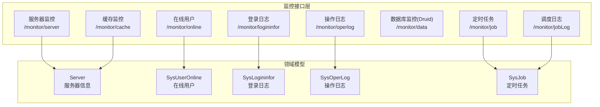
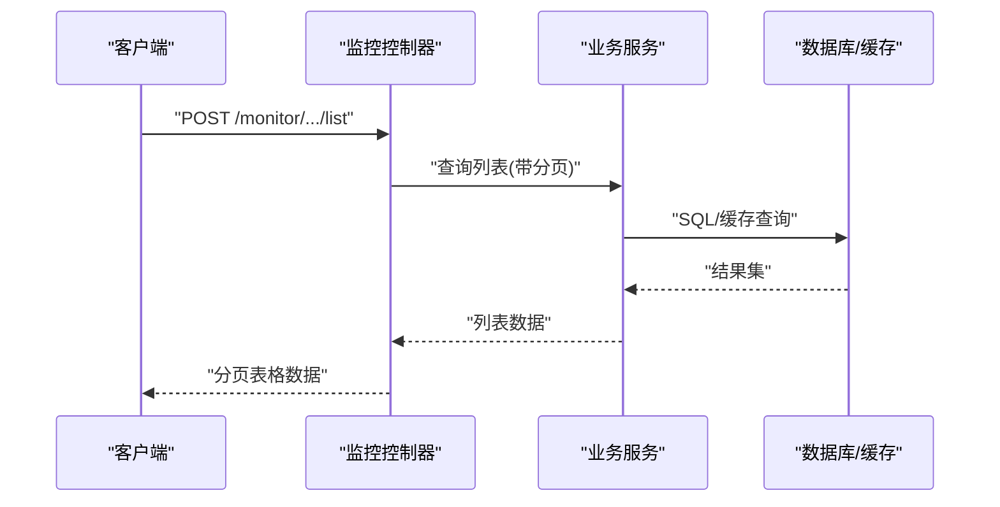
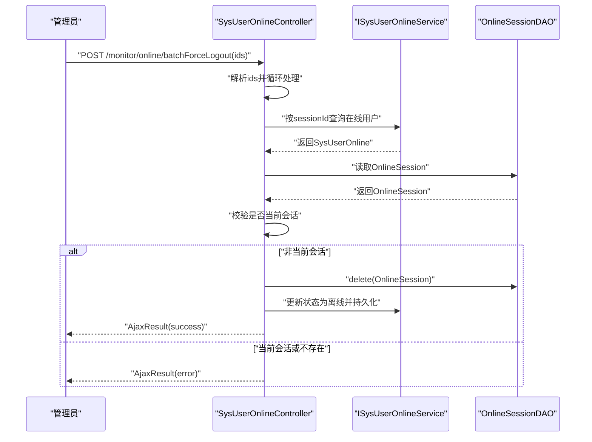
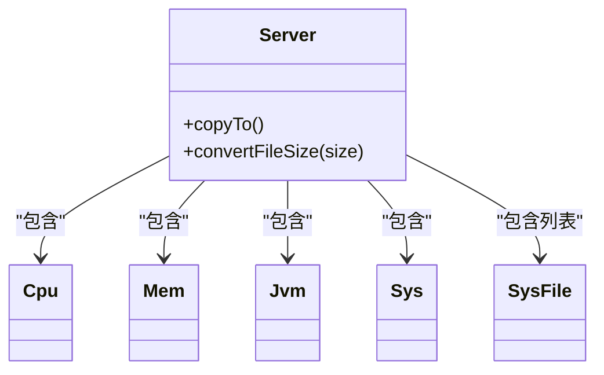
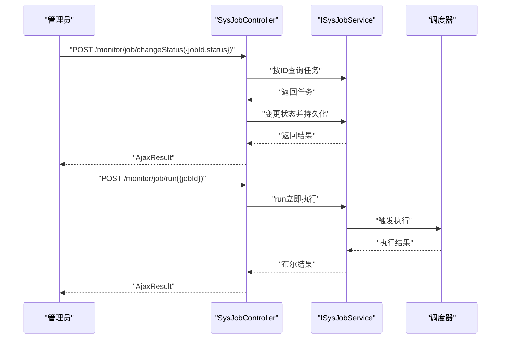
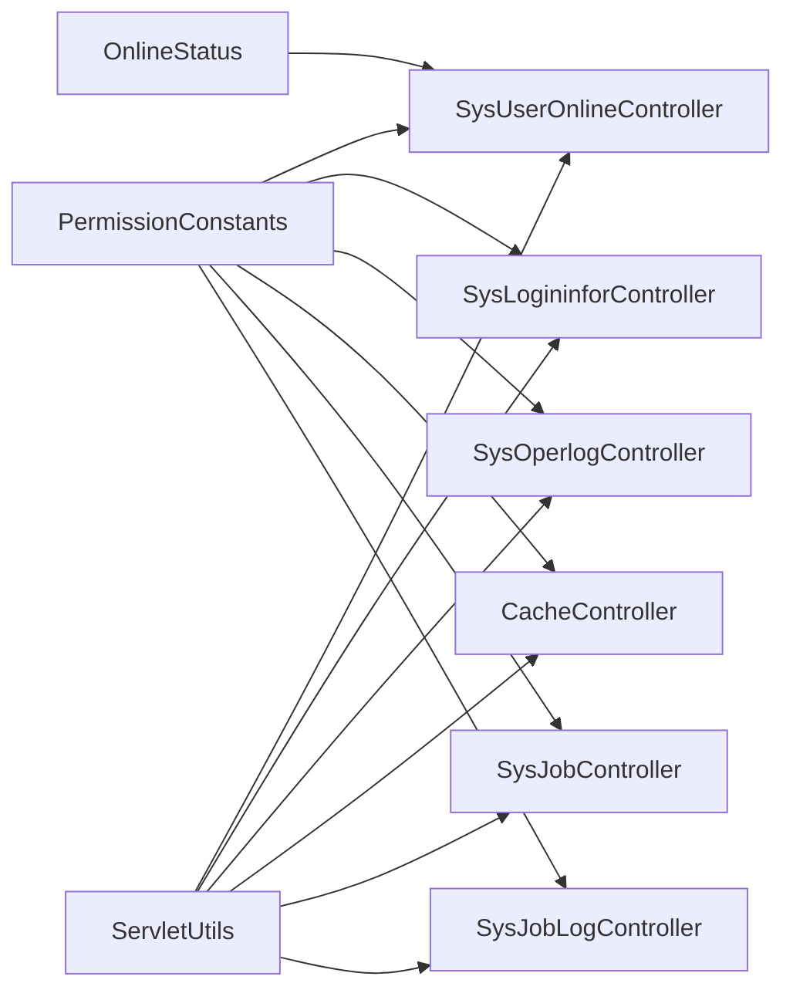

# 系统监控API

<cite>
**本文引用的文件**
- [ruoyi-admin/src/main/java/com/ruoyi/web/controller/monitor/SysUserOnlineController.java](file://ruoyi-admin/src/main/java/com/ruoyi/web/controller/monitor/SysUserOnlineController.java)
- [ruoyi-admin/src/main/java/com/ruoyi/web/controller/monitor/ServerController.java](file://ruoyi-admin/src/main/java/com/ruoyi/web/controller/monitor/ServerController.java)
- [ruoyi-admin/src/main/java/com/ruoyi/web/controller/monitor/SysLogininforController.java](file://ruoyi-admin/src/main/java/com/ruoyi/web/controller/monitor/SysLogininforController.java)
- [ruoyi-admin/src/main/java/com/ruoyi/web/controller/monitor/SysOperlogController.java](file://ruoyi-admin/src/main/java/com/ruoyi/web/controller/monitor/SysOperlogController.java)
- [ruoyi-admin/src/main/java/com/ruoyi/web/controller/monitor/CacheController.java](file://ruoyi-admin/src/main/java/com/ruoyi/web/controller/monitor/CacheController.java)
- [ruoyi-admin/src/main/java/com/ruoyi/web/controller/monitor/DruidController.java](file://ruoyi-admin/src/main/java/com/ruoyi/web/controller/monitor/DruidController.java)
- [ruoyi-quartz/src/main/java/com/ruoyi/quartz/controller/SysJobController.java](file://ruoyi-quartz/src/main/java/com/ruoyi/quartz/controller/SysJobController.java)
- [ruoyi-quartz/src/main/java/com/ruoyi/quartz/controller/SysJobLogController.java](file://ruoyi-quartz/src/main/java/com/ruoyi/quartz/controller/SysJobLogController.java)
- [ruoyi-framework/src/main/java/com/ruoyi/framework/web/domain/Server.java](file://ruoyi-framework/src/main/java/com/ruoyi/framework/web/domain/Server.java)
- [ruoyi-system/src/main/java/com/ruoyi/system/domain/SysUserOnline.java](file://ruoyi-system/src/main/java/com/ruoyi/system/domain/SysUserOnline.java)
- [ruoyi-system/src/main/java/com/ruoyi/system/domain/SysLogininfor.java](file://ruoyi-system/src/main/java/com/ruoyi/system/domain/SysLogininfor.java)
- [ruoyi-system/src/main/java/com/ruoyi/system/domain/SysOperLog.java](file://ruoyi-system/src/main/java/com/ruoyi/system/domain/SysOperLog.java)
- [ruoyi-quartz/src/main/java/com/ruoyi/quartz/domain/SysJob.java](file://ruoyi-quartz/src/main/java/com/ruoyi/quartz/domain/SysJob.java)
- [ruoyi-common/src/main/java/com/ruoyi/common/constant/PermissionConstants.java](file://ruoyi-common/src/main/java/com/ruoyi/common/constant/PermissionConstants.java)
- [ruoyi-common/src/main/java/com/ruoyi/common/enums/OnlineStatus.java](file://ruoyi-common/src/main/java/com/ruoyi/common/enums/OnlineStatus.java)
- [ruoyi-common/src/main/java/com/ruoyi/common/utils/ServletUtils.java](file://ruoyi-common/src/main/java/com/ruoyi/common/utils/ServletUtils.java)
</cite>

## 目录
1. [简介](#简介)
2. [项目结构](#项目结构)
3. [核心组件](#核心组件)
4. [架构总览](#架构总览)
5. [详细组件分析](#详细组件分析)
6. [依赖分析](#依赖分析)
7. [性能考虑](#性能考虑)
8. [故障排查指南](#故障排查指南)
9. [结论](#结论)
10. [附录](#附录)

## 简介
本文件面向系统运维与开发人员，系统性梳理RuoYi框架中“系统监控”相关RESTful接口，覆盖以下能力：
- 定时任务管理：创建、修改、暂停、恢复、删除、立即执行、导出、校验Cron表达式、查看执行日志等
- 服务器性能监控：CPU、内存、JVM、磁盘、系统信息等实时采集
- 登录日志查询：列表、导出、删除、清空、账户解锁
- 操作日志查询：列表、导出、删除、清空、详情查看
- 在线用户管理：列表、批量强制下线
- 缓存监控：缓存命名空间、键列表、键值读取、按命名空间/键清理、清空全部
- 数据库连接池监控：通过Druid页面访问
- 其他：权限常量、在线状态枚举、请求工具辅助

## 项目结构
监控相关接口主要分布在如下模块：
- ruoyi-admin：监控前端页面与控制器（在线用户、服务器、登录日志、操作日志、缓存、Druid）
- ruoyi-quartz：定时任务与调度日志控制器
- ruoyi-framework：服务器硬件与系统信息采集模型
- ruoyi-system：在线用户、登录日志、操作日志实体模型
- ruoyi-common：权限常量、在线状态枚举、请求工具

图表来源
- [ruoyi-admin/src/main/java/com/ruoyi/web/controller/monitor/SysUserOnlineController.java:30-88](file://ruoyi-admin/src/main/java/com/ruoyi/web/controller/monitor/SysUserOnlineController.java#L30-L88)
- [ruoyi-admin/src/main/java/com/ruoyi/web/controller/monitor/ServerController.java:16-31](file://ruoyi-admin/src/main/java/com/ruoyi/web/controller/monitor/ServerController.java#L16-L31)
- [ruoyi-admin/src/main/java/com/ruoyi/web/controller/monitor/SysLogininforController.java:26-94](file://ruoyi-admin/src/main/java/com/ruoyi/web/controller/monitor/SysLogininforController.java#L26-L94)
- [ruoyi-admin/src/main/java/com/ruoyi/web/controller/monitor/SysOperlogController.java:27-90](file://ruoyi-admin/src/main/java/com/ruoyi/web/controller/monitor/SysOperlogController.java#L27-L90)
- [ruoyi-admin/src/main/java/com/ruoyi/web/controller/monitor/CacheController.java:20-89](file://ruoyi-admin/src/main/java/com/ruoyi/web/controller/monitor/CacheController.java#L20-L89)
- [ruoyi-admin/src/main/java/com/ruoyi/web/controller/monitor/DruidController.java:14-26](file://ruoyi-admin/src/main/java/com/ruoyi/web/controller/monitor/DruidController.java#L14-L26)
- [ruoyi-quartz/src/main/java/com/ruoyi/quartz/controller/SysJobController.java:35-248](file://ruoyi-quartz/src/main/java/com/ruoyi/quartz/controller/SysJobController.java#L35-L248)
- [ruoyi-quartz/src/main/java/com/ruoyi/quartz/controller/SysJobLogController.java:31-103](file://ruoyi-quartz/src/main/java/com/ruoyi/quartz/controller/SysJobLogController.java#L31-L103)
- [ruoyi-framework/src/main/java/com/ruoyi/framework/web/domain/Server.java:29-241](file://ruoyi-framework/src/main/java/com/ruoyi/framework/web/domain/Server.java#L29-L241)
- [ruoyi-system/src/main/java/com/ruoyi/system/domain/SysUserOnline.java:15-204](file://ruoyi-system/src/main/java/com/ruoyi/system/domain/SysUserOnline.java#L15-L204)
- [ruoyi-system/src/main/java/com/ruoyi/system/domain/SysLogininfor.java:15-158](file://ruoyi-system/src/main/java/com/ruoyi/system/domain/SysLogininfor.java#L15-L158)
- [ruoyi-system/src/main/java/com/ruoyi/system/domain/SysOperLog.java:15-292](file://ruoyi-system/src/main/java/com/ruoyi/system/domain/SysOperLog.java#L15-L292)
- [ruoyi-quartz/src/main/java/com/ruoyi/quartz/domain/SysJob.java:20-168](file://ruoyi-quartz/src/main/java/com/ruoyi/quartz/domain/SysJob.java#L20-L168)

章节来源
- [ruoyi-admin/src/main/java/com/ruoyi/web/controller/monitor/SysUserOnlineController.java:30-88](file://ruoyi-admin/src/main/java/com/ruoyi/web/controller/monitor/SysUserOnlineController.java#L30-L88)
- [ruoyi-admin/src/main/java/com/ruoyi/web/controller/monitor/ServerController.java:16-31](file://ruoyi-admin/src/main/java/com/ruoyi/web/controller/monitor/ServerController.java#L16-L31)
- [ruoyi-admin/src/main/java/com/ruoyi/web/controller/monitor/SysLogininforController.java:26-94](file://ruoyi-admin/src/main/java/com/ruoyi/web/controller/monitor/SysLogininforController.java#L26-L94)
- [ruoyi-admin/src/main/java/com/ruoyi/web/controller/monitor/SysOperlogController.java:27-90](file://ruoyi-admin/src/main/java/com/ruoyi/web/controller/monitor/SysOperlogController.java#L27-L90)
- [ruoyi-admin/src/main/java/com/ruoyi/web/controller/monitor/CacheController.java:20-89](file://ruoyi-admin/src/main/java/com/ruoyi/web/controller/monitor/CacheController.java#L20-L89)
- [ruoyi-admin/src/main/java/com/ruoyi/web/controller/monitor/DruidController.java:14-26](file://ruoyi-admin/src/main/java/com/ruoyi/web/controller/monitor/DruidController.java#L14-L26)
- [ruoyi-quartz/src/main/java/com/ruoyi/quartz/controller/SysJobController.java:35-248](file://ruoyi-quartz/src/main/java/com/ruoyi/quartz/controller/SysJobController.java#L35-L248)
- [ruoyi-quartz/src/main/java/com/ruoyi/quartz/controller/SysJobLogController.java:31-103](file://ruoyi-quartz/src/main/java/com/ruoyi/quartz/controller/SysJobLogController.java#L31-L103)
- [ruoyi-framework/src/main/java/com/ruoyi/framework/web/domain/Server.java:29-241](file://ruoyi-framework/src/main/java/com/ruoyi/framework/web/domain/Server.java#L29-L241)
- [ruoyi-system/src/main/java/com/ruoyi/system/domain/SysUserOnline.java:15-204](file://ruoyi-system/src/main/java/com/ruoyi/system/domain/SysUserOnline.java#L15-L204)
- [ruoyi-system/src/main/java/com/ruoyi/system/domain/SysLogininfor.java:15-158](file://ruoyi-system/src/main/java/com/ruoyi/system/domain/SysLogininfor.java#L15-L158)
- [ruoyi-system/src/main/java/com/ruoyi/system/domain/SysOperLog.java:15-292](file://ruoyi-system/src/main/java/com/ruoyi/system/domain/SysOperLog.java#L15-L292)
- [ruoyi-quartz/src/main/java/com/ruoyi/quartz/domain/SysJob.java:20-168](file://ruoyi-quartz/src/main/java/com/ruoyi/quartz/domain/SysJob.java#L20-L168)

## 核心组件
- 在线用户监控：提供在线用户列表与批量强制下线能力
- 服务器监控：采集CPU、内存、JVM、系统与磁盘信息
- 登录日志：查询、导出、删除、清空、账户解锁
- 操作日志：查询、导出、删除、清空、详情查看
- 缓存监控：缓存命名空间、键列表、键值读取、清理与全清
- 定时任务：CRUD、状态切换、立即执行、导出、Cron校验与执行时间预估
- 调度日志：查询、导出、删除、清空、详情查看
- 数据库监控：Druid控制台入口

章节来源
- [ruoyi-admin/src/main/java/com/ruoyi/web/controller/monitor/SysUserOnlineController.java:30-88](file://ruoyi-admin/src/main/java/com/ruoyi/web/controller/monitor/SysUserOnlineController.java#L30-L88)
- [ruoyi-admin/src/main/java/com/ruoyi/web/controller/monitor/ServerController.java:16-31](file://ruoyi-admin/src/main/java/com/ruoyi/web/controller/monitor/ServerController.java#L16-L31)
- [ruoyi-admin/src/main/java/com/ruoyi/web/controller/monitor/SysLogininforController.java:26-94](file://ruoyi-admin/src/main/java/com/ruoyi/web/controller/monitor/SysLogininforController.java#L26-L94)
- [ruoyi-admin/src/main/java/com/ruoyi/web/controller/monitor/SysOperlogController.java:27-90](file://ruoyi-admin/src/main/java/com/ruoyi/web/controller/monitor/SysOperlogController.java#L27-L90)
- [ruoyi-admin/src/main/java/com/ruoyi/web/controller/monitor/CacheController.java:20-89](file://ruoyi-admin/src/main/java/com/ruoyi/web/controller/monitor/CacheController.java#L20-L89)
- [ruoyi-admin/src/main/java/com/ruoyi/web/controller/monitor/DruidController.java:14-26](file://ruoyi-admin/src/main/java/com/ruoyi/web/controller/monitor/DruidController.java#L14-L26)
- [ruoyi-quartz/src/main/java/com/ruoyi/quartz/controller/SysJobController.java:35-248](file://ruoyi-quartz/src/main/java/com/ruoyi/quartz/controller/SysJobController.java#L35-L248)
- [ruoyi-quartz/src/main/java/com/ruoyi/quartz/controller/SysJobLogController.java:31-103](file://ruoyi-quartz/src/main/java/com/ruoyi/quartz/controller/SysJobLogController.java#L31-L103)

## 架构总览
监控API采用前后端分离的REST风格设计，控制器统一继承BaseController，返回AjaxResult或TableDataInfo以适配表格分页与通用响应。

图表来源
- [ruoyi-admin/src/main/java/com/ruoyi/web/controller/monitor/SysUserOnlineController.java:50-57](file://ruoyi-admin/src/main/java/com/ruoyi/web/controller/monitor/SysUserOnlineController.java#L50-L57)
- [ruoyi-admin/src/main/java/com/ruoyi/web/controller/monitor/SysLogininforController.java:46-53](file://ruoyi-admin/src/main/java/com/ruoyi/web/controller/monitor/SysLogininforController.java#L46-L53)
- [ruoyi-admin/src/main/java/com/ruoyi/web/controller/monitor/SysOperlogController.java:44-51](file://ruoyi-admin/src/main/java/com/ruoyi/web/controller/monitor/SysOperlogController.java#L44-L51)
- [ruoyi-admin/src/main/java/com/ruoyi/web/controller/monitor/CacheController.java:38-42](file://ruoyi-admin/src/main/java/com/ruoyi/web/controller/monitor/CacheController.java#L38-L42)
- [ruoyi-quartz/src/main/java/com/ruoyi/quartz/controller/SysJobController.java:52-59](file://ruoyi-quartz/src/main/java/com/ruoyi/quartz/controller/SysJobController.java#L52-L59)

## 详细组件分析

### 在线用户管理
- 功能要点
  - 列表查询：支持分页与过滤字段（如登录名、IP地址、状态等）
  - 批量强制下线：根据会话ID逐个强退，防止当前会话自踢
  - 页面入口：/monitor/online
- 关键接口
  - GET /monitor/online：页面跳转
  - POST /monitor/online/list：列表查询
  - POST /monitor/online/batchForceLogout：批量强制下线
- 参数与返回
  - 列表：SysUserOnline作为查询条件；返回TableDataInfo
  - 强退：ids为逗号分隔的会话ID字符串；返回AjaxResult
- 权限要求
  - 列表与视图：monitor:online:list, monitor:online:view
  - 强制下线：monitor:online:batchForceLogout 或 monitor:online:forceLogout

图表来源
- [ruoyi-admin/src/main/java/com/ruoyi/web/controller/monitor/SysUserOnlineController.java:59-88](file://ruoyi-admin/src/main/java/com/ruoyi/web/controller/monitor/SysUserOnlineController.java#L59-L88)
- [ruoyi-system/src/main/java/com/ruoyi/system/domain/SysUserOnline.java:15-204](file://ruoyi-system/src/main/java/com/ruoyi/system/domain/SysUserOnline.java#L15-L204)
- [ruoyi-common/src/main/java/com/ruoyi/common/enums/OnlineStatus.java:8-24](file://ruoyi-common/src/main/java/com/ruoyi/common/enums/OnlineStatus.java#L8-L24)

章节来源
- [ruoyi-admin/src/main/java/com/ruoyi/web/controller/monitor/SysUserOnlineController.java:30-88](file://ruoyi-admin/src/main/java/com/ruoyi/web/controller/monitor/SysUserOnlineController.java#L30-L88)
- [ruoyi-system/src/main/java/com/ruoyi/system/domain/SysUserOnline.java:15-204](file://ruoyi-system/src/main/java/com/ruoyi/system/domain/SysUserOnline.java#L15-L204)
- [ruoyi-common/src/main/java/com/ruoyi/common/enums/OnlineStatus.java:8-24](file://ruoyi-common/src/main/java/com/ruoyi/common/enums/OnlineStatus.java#L8-L24)

### 服务器性能监控
- 功能要点
  - 采集CPU、内存、JVM、系统与磁盘信息
  - 页面入口：/monitor/server
- 关键接口
  - GET /monitor/server：返回监控页面并注入Server对象
- 数据模型
  - Server聚合Cpu、Mem、Jvm、Sys、SysFile列表

图表来源
- [ruoyi-framework/src/main/java/com/ruoyi/framework/web/domain/Server.java:29-241](file://ruoyi-framework/src/main/java/com/ruoyi/framework/web/domain/Server.java#L29-L241)

章节来源
- [ruoyi-admin/src/main/java/com/ruoyi/web/controller/monitor/ServerController.java:16-31](file://ruoyi-admin/src/main/java/com/ruoyi/web/controller/monitor/ServerController.java#L16-L31)
- [ruoyi-framework/src/main/java/com/ruoyi/framework/web/domain/Server.java:29-241](file://ruoyi-framework/src/main/java/com/ruoyi/framework/web/domain/Server.java#L29-L241)

### 登录日志查询
- 功能要点
  - 列表查询、导出Excel、删除、清空、账户解锁
- 关键接口
  - GET /monitor/logininfor：页面入口
  - POST /monitor/logininfor/list：列表查询
  - POST /monitor/logininfor/export：导出
  - POST /monitor/logininfor/remove：删除
  - POST /monitor/logininfor/clean：清空
  - POST /monitor/logininfor/unlock：解锁账户（清除登录错误缓存）
- 参数与返回
  - 列表：SysLogininfor作为查询条件；返回TableDataInfo
  - 导出/删除/清空：返回AjaxResult
  - 解锁：传入loginName，返回AjaxResult

章节来源
- [ruoyi-admin/src/main/java/com/ruoyi/web/controller/monitor/SysLogininforController.java:26-94](file://ruoyi-admin/src/main/java/com/ruoyi/web/controller/monitor/SysLogininforController.java#L26-L94)
- [ruoyi-system/src/main/java/com/ruoyi/system/domain/SysLogininfor.java:15-158](file://ruoyi-system/src/main/java/com/ruoyi/system/domain/SysLogininfor.java#L15-L158)

### 操作日志查询
- 功能要点
  - 列表查询、导出Excel、删除、清空、详情查看
- 关键接口
  - GET /monitor/operlog：页面入口
  - POST /monitor/operlog/list：列表查询
  - POST /monitor/operlog/export：导出
  - POST /monitor/operlog/remove：删除
  - GET /monitor/operlog/detail/{operId}：详情
  - POST /monitor/operlog/clean：清空
- 参数与返回
  - 列表：SysOperLog作为查询条件；返回TableDataInfo
  - 导出/删除/清空：返回AjaxResult
  - 详情：返回模板片段并注入operLog

章节来源
- [ruoyi-admin/src/main/java/com/ruoyi/web/controller/monitor/SysOperlogController.java:27-90](file://ruoyi-admin/src/main/java/com/ruoyi/web/controller/monitor/SysOperlogController.java#L27-L90)
- [ruoyi-system/src/main/java/com/ruoyi/system/domain/SysOperLog.java:15-292](file://ruoyi-system/src/main/java/com/ruoyi/system/domain/SysOperLog.java#L15-L292)

### 缓存监控
- 功能要点
  - 获取缓存命名空间、键列表、键值读取
  - 按命名空间/键清理、清空全部
- 关键接口
  - GET /monitor/cache：页面入口
  - POST /monitor/cache/getNames：刷新命名空间
  - POST /monitor/cache/getKeys：按命名空间获取键
  - POST /monitor/cache/getValue：按命名空间与键获取值
  - POST /monitor/cache/clearCacheName：按命名空间清理
  - POST /monitor/cache/clearCacheKey：按键清理
  - GET /monitor/cache/clearAll：清空全部
- 参数与返回
  - getNames/getKeys/getValue：返回模板片段（局部刷新）
  - clear*：返回AjaxResult

章节来源
- [ruoyi-admin/src/main/java/com/ruoyi/web/controller/monitor/CacheController.java:20-89](file://ruoyi-admin/src/main/java/com/ruoyi/web/controller/monitor/CacheController.java#L20-L89)

### 数据库连接池监控
- 功能要点
  - 通过Druid控制台查看连接池状态
- 关键接口
  - GET /monitor/data：重定向至/druid/index.html

章节来源
- [ruoyi-admin/src/main/java/com/ruoyi/web/controller/monitor/DruidController.java:14-26](file://ruoyi-admin/src/main/java/com/ruoyi/web/controller/monitor/DruidController.java#L14-L26)

### 定时任务管理（CRUD与调度）
- 功能要点
  - 任务CRUD：新增、编辑、删除、详情
  - 状态管理：暂停/恢复（changeStatus）
  - 立即执行：run
  - 导出：export
  - Cron表达式校验与近10次触发时间预估
  - 调度日志：查询、导出、删除、清空、详情
- 关键接口
  - GET /monitor/job：页面入口
  - POST /monitor/job/list：列表
  - POST /monitor/job/export：导出
  - POST /monitor/job/remove：删除
  - GET /monitor/job/detail/{jobId}：详情
  - POST /monitor/job/changeStatus：状态切换
  - POST /monitor/job/run：立即执行
  - GET /monitor/job/add：新增页面
  - POST /monitor/job/add：新增保存
  - GET /monitor/job/edit/{jobId}：编辑页面
  - POST /monitor/job/edit：编辑保存
  - POST /monitor/job/checkCronExpressionIsValid：校验Cron
  - GET /monitor/job/cron：Cron生成页面
  - GET /monitor/job/queryCronExpression：查询近10次触发时间
  - GET /monitor/jobLog：调度日志页面
  - POST /monitor/jobLog/list：日志列表
  - POST /monitor/jobLog/export：日志导出
  - POST /monitor/jobLog/remove：日志删除
  - GET /monitor/jobLog/detail/{jobLogId}：日志详情
  - POST /monitor/jobLog/clean：清空日志
- 参数与返回
  - 列表：SysJob/SysJobLog作为查询条件；返回TableDataInfo
  - changeStatus/run/export/remove/clean：返回AjaxResult
  - checkCronExpressionIsValid：返回布尔值
  - queryCronExpression：返回包含最近触发时间列表的AjaxResult

图表来源
- [ruoyi-quartz/src/main/java/com/ruoyi/quartz/controller/SysJobController.java:94-116](file://ruoyi-quartz/src/main/java/com/ruoyi/quartz/controller/SysJobController.java#L94-L116)
- [ruoyi-quartz/src/main/java/com/ruoyi/quartz/domain/SysJob.java:20-168](file://ruoyi-quartz/src/main/java/com/ruoyi/quartz/domain/SysJob.java#L20-L168)

章节来源
- [ruoyi-quartz/src/main/java/com/ruoyi/quartz/controller/SysJobController.java:35-248](file://ruoyi-quartz/src/main/java/com/ruoyi/quartz/controller/SysJobController.java#L35-L248)
- [ruoyi-quartz/src/main/java/com/ruoyi/quartz/controller/SysJobLogController.java:31-103](file://ruoyi-quartz/src/main/java/com/ruoyi/quartz/controller/SysJobLogController.java#L31-L103)
- [ruoyi-quartz/src/main/java/com/ruoyi/quartz/domain/SysJob.java:20-168](file://ruoyi-quartz/src/main/java/com/ruoyi/quartz/domain/SysJob.java#L20-L168)

## 依赖分析
- 控制器与服务层
  - 各监控控制器均依赖对应Service接口，遵循分层解耦
- 权限控制
  - 使用@RequiresPermissions标注，权限标识遵循“模块:功能:动作”，如monitor:job:list
- 响应封装
  - 统一返回AjaxResult或TableDataInfo，便于前端表格与通用交互
- 工具与常量
  - 权限常量：PermissionConstants
  - 在线状态枚举：OnlineStatus
  - 请求工具：ServletUtils（判断Ajax、获取参数等）

图表来源
- [ruoyi-common/src/main/java/com/ruoyi/common/constant/PermissionConstants.java:8-27](file://ruoyi-common/src/main/java/com/ruoyi/common/constant/PermissionConstants.java#L8-L27)
- [ruoyi-common/src/main/java/com/ruoyi/common/enums/OnlineStatus.java:8-24](file://ruoyi-common/src/main/java/com/ruoyi/common/enums/OnlineStatus.java#L8-L24)
- [ruoyi-common/src/main/java/com/ruoyi/common/utils/ServletUtils.java:23-200](file://ruoyi-common/src/main/java/com/ruoyi/common/utils/ServletUtils.java#L23-L200)

章节来源
- [ruoyi-common/src/main/java/com/ruoyi/common/constant/PermissionConstants.java:8-27](file://ruoyi-common/src/main/java/com/ruoyi/common/constant/PermissionConstants.java#L8-L27)
- [ruoyi-common/src/main/java/com/ruoyi/common/enums/OnlineStatus.java:8-24](file://ruoyi-common/src/main/java/com/ruoyi/common/enums/OnlineStatus.java#L8-L24)
- [ruoyi-common/src/main/java/com/ruoyi/common/utils/ServletUtils.java:23-200](file://ruoyi-common/src/main/java/com/ruoyi/common/utils/ServletUtils.java#L23-L200)

## 性能考虑
- 分页查询：列表接口统一使用分页工具，避免一次性加载大量数据
- 缓存监控：建议仅在必要时读取键值，避免对热点键频繁get
- 日志清理：定期清理登录日志与操作日志，避免表膨胀
- 定时任务：合理设置并发策略与Misfire策略，避免密集触发
- 服务器监控：采集过程包含等待与计算，建议按需调用，避免高频轮询

## 故障排查指南
- 在线用户强退失败
  - 可能原因：目标会话不存在或已是离线；尝试强退当前会话
  - 处理建议：确认ids与在线会话一致，避免自踢
- 登录/操作日志导出为空
  - 可能原因：查询条件过滤导致无数据
  - 处理建议：缩小或调整筛选条件
- 缓存键值读取异常
  - 可能原因：键不存在或序列化问题
  - 处理建议：先getNames与getKeys确认键存在性
- 定时任务状态切换无效
  - 可能原因：任务不存在或调度器异常
  - 处理建议：检查任务ID与调度器状态
- 服务器监控页面空白
  - 可能原因：系统信息采集异常或权限不足
  - 处理建议：检查monitor:server:view权限与服务器环境

章节来源
- [ruoyi-admin/src/main/java/com/ruoyi/web/controller/monitor/SysUserOnlineController.java:59-88](file://ruoyi-admin/src/main/java/com/ruoyi/web/controller/monitor/SysUserOnlineController.java#L59-L88)
- [ruoyi-admin/src/main/java/com/ruoyi/web/controller/monitor/SysLogininforController.java:55-64](file://ruoyi-admin/src/main/java/com/ruoyi/web/controller/monitor/SysLogininforController.java#L55-L64)
- [ruoyi-admin/src/main/java/com/ruoyi/web/controller/monitor/SysOperlogController.java:53-62](file://ruoyi-admin/src/main/java/com/ruoyi/web/controller/monitor/SysOperlogController.java#L53-L62)
- [ruoyi-admin/src/main/java/com/ruoyi/web/controller/monitor/CacheController.java:55-62](file://ruoyi-admin/src/main/java/com/ruoyi/web/controller/monitor/CacheController.java#L55-L62)
- [ruoyi-quartz/src/main/java/com/ruoyi/quartz/controller/SysJobController.java:94-116](file://ruoyi-quartz/src/main/java/com/ruoyi/quartz/controller/SysJobController.java#L94-L116)
- [ruoyi-admin/src/main/java/com/ruoyi/web/controller/monitor/ServerController.java:22-30](file://ruoyi-admin/src/main/java/com/ruoyi/web/controller/monitor/ServerController.java#L22-L30)

## 结论
本监控API体系覆盖了定时任务、服务器性能、登录与操作日志、在线用户、缓存与数据库连接池等关键运维场景，接口设计清晰、权限控制明确、响应格式统一，适合在生产环境中进行持续监控与运维管理。

## 附录

### 权限标识速查
- 在线用户：monitor:online:view, monitor:online:list, monitor:online:batchForceLogout, monitor:online:forceLogout
- 服务器：monitor:server:view
- 登录日志：monitor:logininfor:view, monitor:logininfor:list, monitor:logininfor:export, monitor:logininfor:remove, monitor:logininfor:unlock
- 操作日志：monitor:operlog:view, monitor:operlog:list, monitor:operlog:export, monitor:operlog:remove, monitor:operlog:detail
- 缓存：monitor:cache:view
- 定时任务：monitor:job:view, monitor:job:list, monitor:job:export, monitor:job:remove, monitor:job:detail, monitor:job:changeStatus, monitor:job:add, monitor:job:edit
- 调度日志：monitor:job:view, monitor:job:list, monitor:job:export, monitor:job:remove, monitor:job:detail
- 数据库监控：monitor:data:view

章节来源
- [ruoyi-common/src/main/java/com/ruoyi/common/constant/PermissionConstants.java:8-27](file://ruoyi-common/src/main/java/com/ruoyi/common/constant/PermissionConstants.java#L8-L27)
- [ruoyi-admin/src/main/java/com/ruoyi/web/controller/monitor/SysUserOnlineController.java:42-47](file://ruoyi-admin/src/main/java/com/ruoyi/web/controller/monitor/SysUserOnlineController.java#L42-L47)
- [ruoyi-admin/src/main/java/com/ruoyi/web/controller/monitor/ServerController.java:22-29](file://ruoyi-admin/src/main/java/com/ruoyi/web/controller/monitor/ServerController.java#L22-L29)
- [ruoyi-admin/src/main/java/com/ruoyi/web/controller/monitor/SysLogininforController.java:38-93](file://ruoyi-admin/src/main/java/com/ruoyi/web/controller/monitor/SysLogininforController.java#L38-L93)
- [ruoyi-admin/src/main/java/com/ruoyi/web/controller/monitor/SysOperlogController.java:36-89](file://ruoyi-admin/src/main/java/com/ruoyi/web/controller/monitor/SysOperlogController.java#L36-L89)
- [ruoyi-admin/src/main/java/com/ruoyi/web/controller/monitor/CacheController.java:29-89](file://ruoyi-admin/src/main/java/com/ruoyi/web/controller/monitor/CacheController.java#L29-L89)
- [ruoyi-quartz/src/main/java/com/ruoyi/quartz/controller/SysJobController.java:44-248](file://ruoyi-quartz/src/main/java/com/ruoyi/quartz/controller/SysJobController.java#L44-L248)
- [ruoyi-quartz/src/main/java/com/ruoyi/quartz/controller/SysJobLogController.java:43-102](file://ruoyi-quartz/src/main/java/com/ruoyi/quartz/controller/SysJobLogController.java#L43-L102)
- [ruoyi-admin/src/main/java/com/ruoyi/web/controller/monitor/DruidController.java:20-25](file://ruoyi-admin/src/main/java/com/ruoyi/web/controller/monitor/DruidController.java#L20-L25)