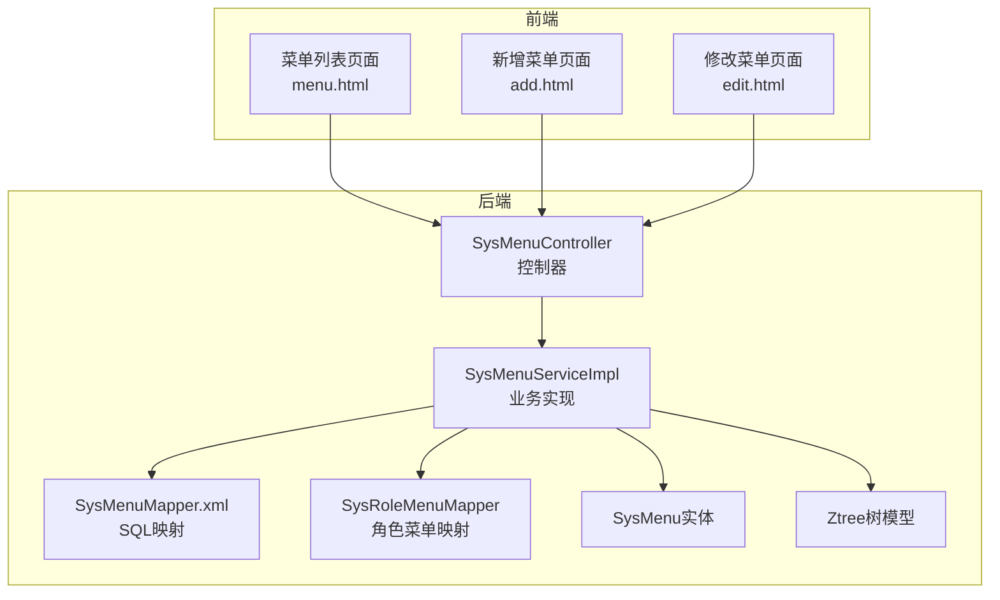
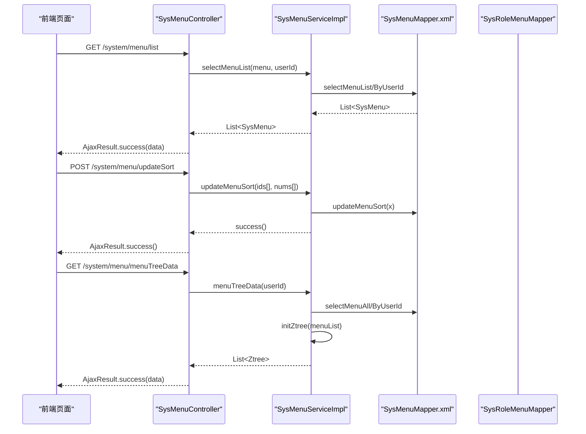
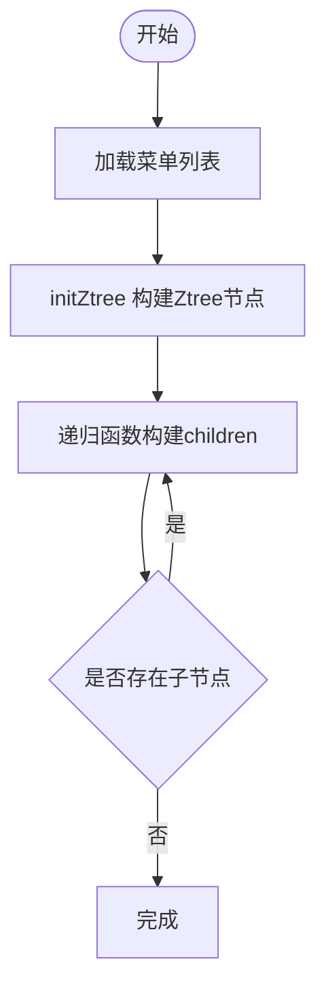
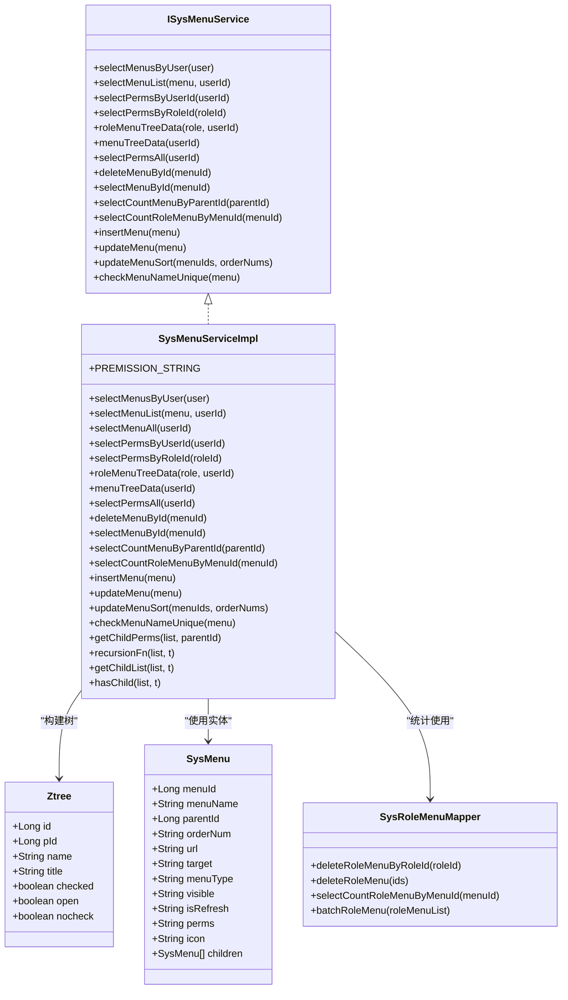
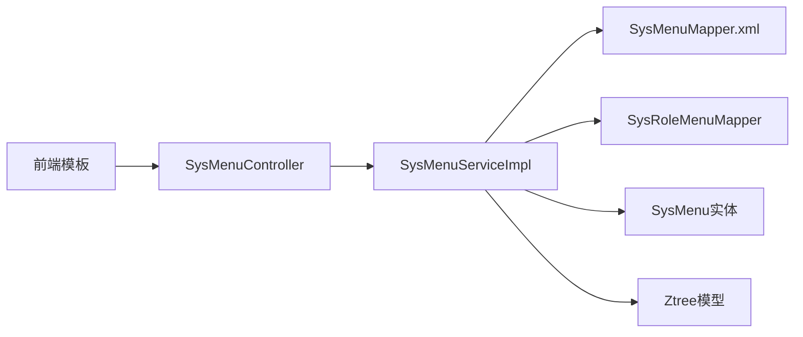

# 菜单管理API

<cite>
**本文档引用的文件**
- [SysMenuController.java](file://ruoyi-admin/src/main/java/com/ruoyi/web/controller/system/SysMenuController.java)
- [ISysMenuService.java](file://ruoyi-system/src/main/java/com/ruoyi/system/service/ISysMenuService.java)
- [SysMenuServiceImpl.java](file://ruoyi-system/src/main/java/com/ruoyi/system/service/impl/SysMenuServiceImpl.java)
- [SysMenu.java](file://ruoyi-common/src/main/java/com/ruoyi/common/core/domain/entity/SysMenu.java)
- [SysMenuMapper.xml](file://ruoyi-system/src/main/resources/mapper/system/SysMenuMapper.xml)
- [SysRoleMenuMapper.java](file://ruoyi-system/src/main/java/com/ruoyi/system/mapper/SysRoleMenuMapper.java)
- [Ztree.java](file://ruoyi-common/src/main/java/com/ruoyi/common/core/domain/Ztree.java)
- [PermissionConstants.java](file://ruoyi-common/src/main/java/com/ruoyi/common/constant/PermissionConstants.java)
- [menu.html](file://ruoyi-admin/src/main/resources/templates/system/menu/menu.html)
- [add.html](file://ruoyi-admin/src/main/resources/templates/system/menu/add.html)
- [edit.html](file://ruoyi-admin/src/main/resources/templates/system/menu/edit.html)
- [ry_20260319.sql](file://sql/ry_20260319.sql)
- [application.yml](file://ruoyi-admin/src/main/resources/application.yml)
</cite>

## 目录
1. [简介](#简介)
2. [项目结构](#项目结构)
3. [核心组件](#核心组件)
4. [架构概览](#架构概览)
5. [详细组件分析](#详细组件分析)
6. [依赖分析](#依赖分析)
7. [性能考虑](#性能考虑)
8. [故障排除指南](#故障排除指南)
9. [结论](#结论)
10. [附录](#附录)

## 简介
本文件面向后端开发者与前端工程师，系统化梳理RuoYi框架中的菜单管理API，覆盖菜单列表查询、新增、修改、删除、排序、树形结构获取、权限控制与角色关联等能力，并结合前端模板说明菜单类型、图标、排序、显示隐藏等属性的配置方法。

## 项目结构
菜单管理模块采用经典的三层架构：
- 控制器层：负责HTTP请求接收与响应封装
- 业务层：负责菜单权限、树形组装、排序等业务逻辑
- 数据访问层：负责菜单与角色菜单关联的持久化

**图表来源**
- [SysMenuController.java:31-212](file://ruoyi-admin/src/main/java/com/ruoyi/web/controller/system/SysMenuController.java#L31-L212)
- [SysMenuServiceImpl.java:34-441](file://ruoyi-system/src/main/java/com/ruoyi/system/service/impl/SysMenuServiceImpl.java#L34-L441)
- [SysMenuMapper.xml:1-197](file://ruoyi-system/src/main/resources/mapper/system/SysMenuMapper.xml#L1-L197)
- [SysRoleMenuMapper.java:11-45](file://ruoyi-system/src/main/java/com/ruoyi/system/mapper/SysRoleMenuMapper.java#L11-L45)
- [SysMenu.java:15-215](file://ruoyi-common/src/main/java/com/ruoyi/common/core/domain/entity/SysMenu.java#L15-L215)
- [Ztree.java:10-105](file://ruoyi-common/src/main/java/com/ruoyi/common/core/domain/Ztree.java#L10-L105)

**章节来源**
- [SysMenuController.java:31-212](file://ruoyi-admin/src/main/java/com/ruoyi/web/controller/system/SysMenuController.java#L31-L212)
- [SysMenuServiceImpl.java:34-441](file://ruoyi-system/src/main/java/com/ruoyi/system/service/impl/SysMenuServiceImpl.java#L34-L441)
- [SysMenuMapper.xml:1-197](file://ruoyi-system/src/main/resources/mapper/system/SysMenuMapper.xml#L1-L197)

## 核心组件
- 控制器：提供REST接口与页面跳转，统一权限注解校验
- 业务服务：封装菜单查询、树形组装、权限提取、排序更新、唯一性校验
- 实体模型：SysMenu描述菜单字段；Ztree用于树形渲染
- 数据映射：SysMenuMapper.xml定义菜单查询、插入、更新、删除、排序等SQL
- 角色菜单映射：SysRoleMenuMapper提供角色菜单关联统计与批量写入

**章节来源**
- [ISysMenuService.java:16-148](file://ruoyi-system/src/main/java/com/ruoyi/system/service/ISysMenuService.java#L16-L148)
- [SysMenu.java:15-215](file://ruoyi-common/src/main/java/com/ruoyi/common/core/domain/entity/SysMenu.java#L15-L215)
- [Ztree.java:10-105](file://ruoyi-common/src/main/java/com/ruoyi/common/core/domain/Ztree.java#L10-L105)
- [SysRoleMenuMapper.java:11-45](file://ruoyi-system/src/main/java/com/ruoyi/system/mapper/SysRoleMenuMapper.java#L11-L45)

## 架构概览
菜单管理API遵循前后端分离的REST风格，控制器通过权限注解进行安全控制，业务层调用MyBatis映射执行数据库操作，返回统一的AjaxResult或树形结构Ztree。

**图表来源**
- [SysMenuController.java:47-201](file://ruoyi-admin/src/main/java/com/ruoyi/web/controller/system/SysMenuController.java#L47-L201)
- [SysMenuServiceImpl.java:72-184](file://ruoyi-system/src/main/java/com/ruoyi/system/service/impl/SysMenuServiceImpl.java#L72-L184)
- [SysMenuMapper.xml:88-195](file://ruoyi-system/src/main/resources/mapper/system/SysMenuMapper.xml#L88-L195)
- [SysRoleMenuMapper.java:35-43](file://ruoyi-system/src/main/java/com/ruoyi/system/mapper/SysRoleMenuMapper.java#L35-L43)

## 详细组件分析

### REST API 定义
- 基础路径：/system/menu
- 权限前缀：system:menu:*（按功能细分）

接口一览
- GET /system/menu
  - 功能：进入菜单管理页面
  - 权限：system:menu:view
- POST /system/menu/list
  - 功能：分页/筛选查询菜单列表
  - 请求体：SysMenu（支持menuName、visible等条件）
  - 返回：List<SysMenu>
  - 权限：system:menu:list
- POST /system/menu/add
  - 功能：新增菜单
  - 请求体：SysMenu（含menuType、menuName、parentId、url、target、perms、orderNum、icon、visible、isRefresh等）
  - 返回：AjaxResult
  - 权限：system:menu:add
- GET /system/menu/add/{parentId}
  - 功能：打开新增页面，携带父级菜单信息
  - 权限：system:menu:add
- POST /system/menu/edit
  - 功能：修改菜单
  - 请求体：SysMenu（含menuId）
  - 返回：AjaxResult
  - 权限：system:menu:edit
- GET /system/menu/edit/{menuId}
  - 功能：打开修改页面
  - 权限：system:menu:edit
- GET /system/menu/remove/{menuId}
  - 功能：删除菜单（禁止删除存在子菜单或已被角色使用的菜单）
  - 返回：AjaxResult
  - 权限：system:menu:remove
- POST /system/menu/updateSort
  - 功能：批量保存菜单排序
  - 请求体：menuIds（数组）、orderNums（数组）
  - 返回：AjaxResult
  - 权限：system:menu:edit
- GET /system/menu/icon
  - 功能：打开图标选择页面
- POST /system/menu/checkMenuNameUnique
  - 功能：校验菜单名称在同级下唯一
  - 返回：boolean
- GET /system/menu/roleMenuTreeData
  - 功能：加载角色授权树（含勾选项）
  - 返回：List<Ztree>
- GET /system/menu/menuTreeData
  - 功能：加载所有菜单树
  - 返回：List<Ztree>
- GET /system/menu/selectMenuTree/{menuId}
  - 功能：打开选择父级菜单的树形弹窗
  - 返回：tree.html（模板）

权限常量参考
- 新增：system:menu:add
- 修改：system:menu:edit
- 删除：system:menu:remove
- 列表：system:menu:list
- 查看：system:menu:view

**章节来源**
- [SysMenuController.java:40-212](file://ruoyi-admin/src/main/java/com/ruoyi/web/controller/system/SysMenuController.java#L40-L212)
- [PermissionConstants.java:10-27](file://ruoyi-common/src/main/java/com/ruoyi/common/constant/PermissionConstants.java#L10-L27)

### 菜单实体与属性说明
- 菜单ID、父ID、名称、显示顺序、请求地址、打开方式、类型（M/C/F）、状态（显示/隐藏）、是否刷新、权限标识、图标、备注
- 菜单类型：
  - M：目录
  - C：菜单
  - F：按钮
- 可见性：
  - 0：显示
  - 1：隐藏
- 打开方式：
  - menuItem：页签
  - menuBlank：新窗口
- 是否刷新：
  - 0：刷新
  - 1：不刷新

**章节来源**
- [SysMenu.java:19-182](file://ruoyi-common/src/main/java/com/ruoyi/common/core/domain/entity/SysMenu.java#L19-L182)

### 树形结构与父子关系
- 父子关系由parentId字段维护
- 业务层通过递归算法构建子节点树
- 前端使用bootstrap-tree-table展示树形表格，支持展开/折叠、排序、搜索

**图表来源**
- [SysMenuServiceImpl.java:379-439](file://ruoyi-system/src/main/java/com/ruoyi/system/service/impl/SysMenuServiceImpl.java#L379-L439)
- [SysMenuServiceImpl.java:212-243](file://ruoyi-system/src/main/java/com/ruoyi/system/service/impl/SysMenuServiceImpl.java#L212-L243)

**章节来源**
- [SysMenuServiceImpl.java:379-439](file://ruoyi-system/src/main/java/com/ruoyi/system/service/impl/SysMenuServiceImpl.java#L379-L439)
- [menu.html:60-168](file://ruoyi-admin/src/main/resources/templates/system/menu/menu.html#L60-L168)

### 权限控制与角色关联
- 权限标识perms用于Shiro注解鉴权（如@RequiresPermissions("system:menu:list")）
- 业务层提供按用户/角色查询权限集合的方法
- 角色菜单关联通过SysRoleMenuMapper统计使用次数并支持批量写入
- 前端页面通过权限常量控制按钮显隐

**图表来源**
- [SysMenu.java:15-215](file://ruoyi-common/src/main/java/com/ruoyi/common/core/domain/entity/SysMenu.java#L15-L215)
- [Ztree.java:10-105](file://ruoyi-common/src/main/java/com/ruoyi/common/core/domain/Ztree.java#L10-L105)
- [ISysMenuService.java:16-148](file://ruoyi-system/src/main/java/com/ruoyi/system/service/ISysMenuService.java#L16-L148)
- [SysMenuServiceImpl.java:34-441](file://ruoyi-system/src/main/java/com/ruoyi/system/service/impl/SysMenuServiceImpl.java#L34-L441)
- [SysRoleMenuMapper.java:11-45](file://ruoyi-system/src/main/java/com/ruoyi/system/mapper/SysRoleMenuMapper.java#L11-L45)

**章节来源**
- [SysMenuServiceImpl.java:113-147](file://ruoyi-system/src/main/java/com/ruoyi/system/service/impl/SysMenuServiceImpl.java#L113-L147)
- [SysRoleMenuMapper.java:35-43](file://ruoyi-system/src/main/java/com/ruoyi/system/mapper/SysRoleMenuMapper.java#L35-L43)

### 菜单按钮权限标识与前端路由配置
- 按钮权限标识（F类型）用于细粒度控制（如新增、修改、删除、导出）
- 前端页面通过权限常量控制按钮显示，如“新增”、“修改”、“删除”
- 菜单类型为C时，需配置url与perms，用于路由与权限匹配

**章节来源**
- [menu.html:32-44](file://ruoyi-admin/src/main/resources/templates/system/menu/menu.html#L32-L44)
- [add.html:49-53](file://ruoyi-admin/src/main/resources/templates/system/menu/add.html#L49-L53)
- [edit.html:50-54](file://ruoyi-admin/src/main/resources/templates/system/menu/edit.html#L50-L54)

### 图标选择、菜单排序、显示隐藏
- 图标选择：点击输入框弹出图标面板，选择后回填到icon字段
- 排序：在菜单列表中可直接修改orderNum，提交后批量更新
- 显示隐藏：visible=0显示，visible=1隐藏；按钮类型（F）不参与可见性控制

**章节来源**
- [add.html:62-91](file://ruoyi-admin/src/main/resources/templates/system/menu/add.html#L62-L91)
- [edit.html:74-92](file://ruoyi-admin/src/main/resources/templates/system/menu/edit.html#L74-L92)
- [menu.html:90-152](file://ruoyi-admin/src/main/resources/templates/system/menu/menu.html#L90-L152)

### 菜单与角色权限关联
- 角色授权树：加载所有菜单树并标记角色已授权节点
- 使用校验：删除前校验是否存在子菜单与角色使用
- 关联统计：通过SysRoleMenuMapper统计菜单使用次数

**章节来源**
- [SysMenuController.java:180-201](file://ruoyi-admin/src/main/java/com/ruoyi/web/controller/system/SysMenuController.java#L180-L201)
- [SysMenuServiceImpl.java:155-171](file://ruoyi-system/src/main/java/com/ruoyi/system/service/impl/SysMenuServiceImpl.java#L155-L171)
- [SysMenuServiceImpl.java:286-302](file://ruoyi-system/src/main/java/com/ruoyi/system/service/impl/SysMenuServiceImpl.java#L286-L302)
- [SysRoleMenuMapper.java:35-43](file://ruoyi-system/src/main/java/com/ruoyi/system/mapper/SysRoleMenuMapper.java#L35-L43)

## 依赖分析
- 控制器依赖业务服务与Shiro权限注解
- 业务服务依赖数据映射与角色菜单映射
- 实体与树模型作为跨层传输载体
- 前端模板依赖控制器提供的接口与权限常量

**图表来源**
- [SysMenuController.java:37-38](file://ruoyi-admin/src/main/java/com/ruoyi/web/controller/system/SysMenuController.java#L37-L38)
- [SysMenuServiceImpl.java:38-42](file://ruoyi-system/src/main/java/com/ruoyi/system/service/impl/SysMenuServiceImpl.java#L38-L42)
- [SysMenuMapper.xml:1-5](file://ruoyi-system/src/main/resources/mapper/system/SysMenuMapper.xml#L1-L5)
- [SysRoleMenuMapper.java:11-45](file://ruoyi-system/src/main/java/com/ruoyi/system/mapper/SysRoleMenuMapper.java#L11-L45)

**章节来源**
- [SysMenuController.java:37-38](file://ruoyi-admin/src/main/java/com/ruoyi/web/controller/system/SysMenuController.java#L37-L38)
- [SysMenuServiceImpl.java:38-42](file://ruoyi-system/src/main/java/com/ruoyi/system/service/impl/SysMenuServiceImpl.java#L38-L42)

## 性能考虑
- 树形构建：递归算法在大数据量时建议分页或延迟加载
- 排序更新：批量更新使用事务，异常时抛出业务异常
- 权限查询：按用户/角色聚合查询，避免重复查询
- 前端渲染：树表控件支持本地排序与搜索，减少后端压力

## 故障排除指南
- 删除失败提示“存在子菜单/已分配”
  - 原因：子菜单存在或角色使用
  - 处理：先清理子菜单或解除角色绑定
- 排序保存异常
  - 原因：输入非法或并发冲突
  - 处理：检查输入合法性与网络稳定性
- 菜单名称重复
  - 原因：同级菜单名称重复
  - 处理：调整名称或父级

**章节来源**
- [SysMenuController.java:66-76](file://ruoyi-admin/src/main/java/com/ruoyi/web/controller/system/SysMenuController.java#L66-L76)
- [SysMenuServiceImpl.java:334-352](file://ruoyi-system/src/main/java/com/ruoyi/system/service/impl/SysMenuServiceImpl.java#L334-L352)
- [SysMenuServiceImpl.java:360-370](file://ruoyi-system/src/main/java/com/ruoyi/system/service/impl/SysMenuServiceImpl.java#L360-L370)

## 结论
菜单管理API以清晰的职责划分与完善的权限控制保障了系统的可维护性与安全性。通过树形结构与权限标识的组合，实现了灵活的菜单组织与细粒度的权限管理。建议在生产环境中配合分页、缓存与审计日志进一步优化性能与可观测性。

## 附录

### 数据库表结构要点
- sys_menu：菜单主表，包含菜单ID、父ID、名称、类型、权限标识、图标、排序、状态等
- sys_role_menu：角色与菜单关联表，用于授权与使用统计

**章节来源**
- [ry_20260319.sql:133-151](file://sql/ry_20260319.sql#L133-L151)
- [ry_20260319.sql:1-200](file://sql/ry_20260319.sql#L1-L200)

### 前端模板关键点
- 菜单列表：支持搜索、排序、增删改、展开/折叠
- 新增/修改：动态表单根据菜单类型切换字段显示
- 图标选择：弹窗式图标面板

**章节来源**
- [menu.html:1-190](file://ruoyi-admin/src/main/resources/templates/system/menu/menu.html#L1-L190)
- [add.html:1-197](file://ruoyi-admin/src/main/resources/templates/system/menu/add.html#L1-L197)
- [edit.html:1-225](file://ruoyi-admin/src/main/resources/templates/system/menu/edit.html#L1-L225)