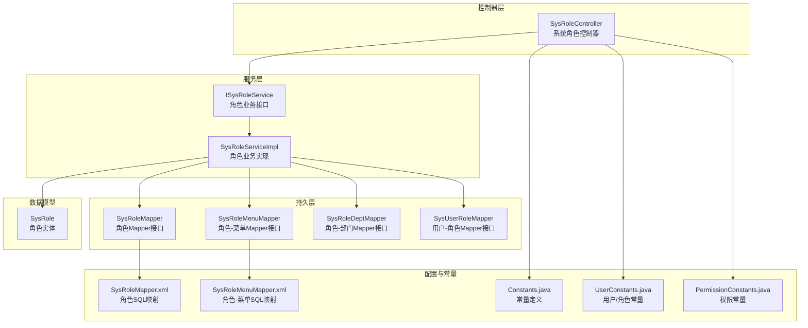
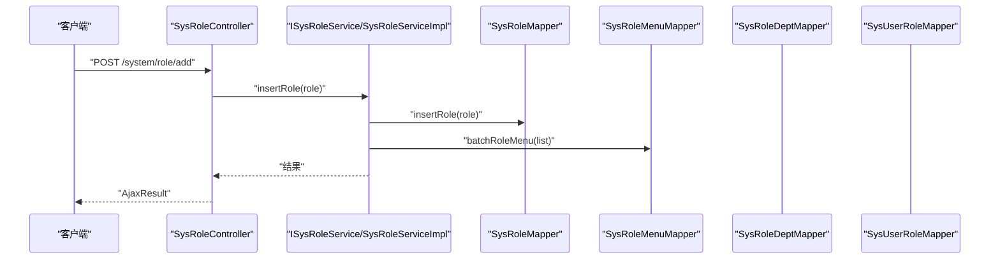
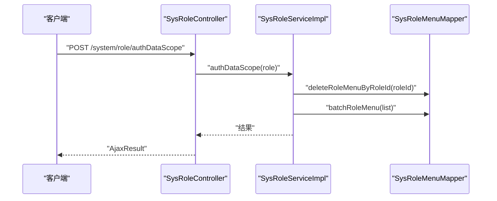
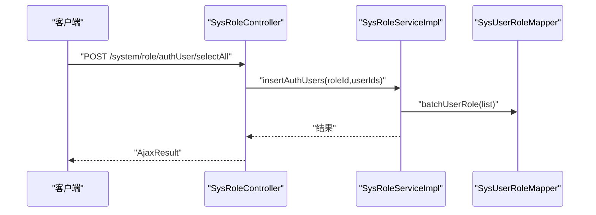
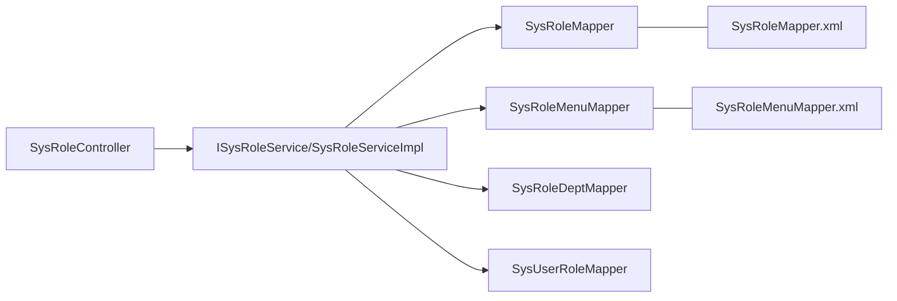

# 角色管理API

<cite>
**本文引用的文件**
- [SysRoleController.java](file://ruoyi-admin/src/main/java/com/ruoyi/web/controller/system/SysRoleController.java)
- [ISysRoleService.java](file://ruoyi-system/src/main/java/com/ruoyi/system/service/ISysRoleService.java)
- [SysRoleServiceImpl.java](file://ruoyi-system/src/main/java/com/ruoyi/system/service/impl/SysRoleServiceImpl.java)
- [SysRole.java](file://ruoyi-common/src/main/java/com/ruoyi/common/core/domain/entity/SysRole.java)
- [SysRoleMapper.java](file://ruoyi-system/src/main/java/com/ruoyi/system/mapper/SysRoleMapper.java)
- [SysRoleMenuMapper.java](file://ruoyi-system/src/main/java/com/ruoyi/system/mapper/SysRoleMenuMapper.java)
- [SysRoleDeptMapper.java](file://ruoyi-system/src/main/java/com/ruoyi/system/mapper/SysRoleDeptMapper.java)
- [SysUserRoleMapper.java](file://ruoyi-system/src/main/java/com/ruoyi/system/mapper/SysUserRoleMapper.java)
- [SysRoleMapper.xml](file://ruoyi-system/src/main/resources/mapper/system/SysRoleMapper.xml)
- [SysRoleMenuMapper.xml](file://ruoyi-system/src/main/resources/mapper/system/SysRoleMenuMapper.xml)
- [UserConstants.java](file://ruoyi-common/src/main/java/com/ruoyi/common/constant/UserConstants.java)
- [Constants.java](file://ruoyi-common/src/main/java/com/ruoyi/common/constant/Constants.java)
- [PermissionConstants.java](file://ruoyi-common/src/main/java/com/ruoyi/common/constant/PermissionConstants.java)
</cite>

## 目录
1. [简介](#简介)
2. [项目结构](#项目结构)
3. [核心组件](#核心组件)
4. [架构总览](#架构总览)
5. [详细组件分析](#详细组件分析)
6. [依赖分析](#依赖分析)
7. [性能考虑](#性能考虑)
8. [故障排查指南](#故障排查指南)
9. [结论](#结论)
10. [附录](#附录)

## 简介
本文件面向后端开发者与接口使用者，系统化梳理角色管理模块的RESTful接口与权限控制机制，覆盖角色列表查询、新增、修改、删除、状态变更、导出、校验唯一性、角色菜单授权、角色数据范围授权、角色与用户关联授权、角色详情查看、角色树形数据获取等能力。文档同时解释角色与用户的关联关系、权限传递机制以及数据权限的作用范围。

## 项目结构
角色管理API位于系统模块中，采用“控制器-服务-持久层”的分层设计，配合MyBatis映射XML完成数据库交互。权限控制通过注解与拦截器实现，数据权限通过注解与SQL拼接进行范围过滤。

图表来源
- [SysRoleController.java:36-354](file://ruoyi-admin/src/main/java/com/ruoyi/web/controller/system/SysRoleController.java#L36-L354)
- [ISysRoleService.java:13-167](file://ruoyi-system/src/main/java/com/ruoyi/system/service/ISysRoleService.java#L13-L167)
- [SysRoleServiceImpl.java:34-418](file://ruoyi-system/src/main/java/com/ruoyi/system/service/impl/SysRoleServiceImpl.java#L34-L418)
- [SysRoleMapper.java:11-85](file://ruoyi-system/src/main/java/com/ruoyi/system/mapper/SysRoleMapper.java#L11-L85)
- [SysRoleMenuMapper.java:11-45](file://ruoyi-system/src/main/java/com/ruoyi/system/mapper/SysRoleMenuMapper.java#L11-L45)
- [SysRoleDeptMapper.java:11-45](file://ruoyi-system/src/main/java/com/ruoyi/system/mapper/SysRoleDeptMapper.java#L11-L45)
- [SysUserRoleMapper.java:12-71](file://ruoyi-system/src/main/java/com/ruoyi/system/mapper/SysUserRoleMapper.java#L12-L71)
- [SysRoleMapper.xml:5-134](file://ruoyi-system/src/main/resources/mapper/system/SysRoleMapper.xml#L5-L134)
- [SysRoleMenuMapper.xml:5-34](file://ruoyi-system/src/main/resources/mapper/system/SysRoleMenuMapper.xml#L5-L34)
- [Constants.java:10-154](file://ruoyi-common/src/main/java/com/ruoyi/common/constant/Constants.java#L10-L154)
- [UserConstants.java:8-74](file://ruoyi-common/src/main/java/com/ruoyi/common/constant/UserConstants.java#L8-L74)
- [PermissionConstants.java:8-28](file://ruoyi-common/src/main/java/com/ruoyi/common/constant/PermissionConstants.java#L8-L28)

章节来源
- [SysRoleController.java:36-354](file://ruoyi-admin/src/main/java/com/ruoyi/web/controller/system/SysRoleController.java#L36-L354)
- [SysRoleServiceImpl.java:34-418](file://ruoyi-system/src/main/java/com/ruoyi/system/service/impl/SysRoleServiceImpl.java#L34-L418)

## 核心组件
- 控制器：SysRoleController 提供角色管理的全部REST接口，负责参数接收、权限校验、调用服务层并返回统一结果。
- 服务层：ISysRoleService 定义角色业务契约；SysRoleServiceImpl 实现角色CRUD、授权、数据权限、用户关联等逻辑，并通过事务保证一致性。
- 持久层：各Mapper接口与XML映射完成数据库操作，支持角色列表、角色-菜单、角色-部门、用户-角色等多维关联。
- 数据模型：SysRole 角色实体，包含角色基本信息、数据范围、菜单与部门ID数组、权限集合等。
- 常量与权限：Constants 定义数据权限范围常量；UserConstants 定义角色状态常量；PermissionConstants 定义权限点常量。

章节来源
- [SysRoleController.java:36-354](file://ruoyi-admin/src/main/java/com/ruoyi/web/controller/system/SysRoleController.java#L36-L354)
- [ISysRoleService.java:13-167](file://ruoyi-system/src/main/java/com/ruoyi/system/service/ISysRoleService.java#L13-L167)
- [SysRoleServiceImpl.java:34-418](file://ruoyi-system/src/main/java/com/ruoyi/system/service/impl/SysRoleServiceImpl.java#L34-L418)
- [SysRole.java:16-212](file://ruoyi-common/src/main/java/com/ruoyi/common/core/domain/entity/SysRole.java#L16-L212)
- [Constants.java:125-152](file://ruoyi-common/src/main/java/com/ruoyi/common/constant/Constants.java#L125-L152)
- [UserConstants.java:24-28](file://ruoyi-common/src/main/java/com/ruoyi/common/constant/UserConstants.java#L24-L28)
- [PermissionConstants.java:10-27](file://ruoyi-common/src/main/java/com/ruoyi/common/constant/PermissionConstants.java#L10-L27)

## 架构总览
角色管理API遵循前后端分离的REST风格，控制器通过注解声明权限点，服务层执行业务规则与数据权限过滤，持久层通过XML SQL完成复杂查询与批量写入。

图表来源
- [SysRoleController.java:95-113](file://ruoyi-admin/src/main/java/com/ruoyi/web/controller/system/SysRoleController.java#L95-L113)
- [SysRoleServiceImpl.java:182-205](file://ruoyi-system/src/main/java/com/ruoyi/system/service/impl/SysRoleServiceImpl.java#L182-L205)
- [SysRoleMapper.xml:110-132](file://ruoyi-system/src/main/resources/mapper/system/SysRoleMapper.xml#L110-L132)
- [SysRoleMenuMapper.xml:27-32](file://ruoyi-system/src/main/resources/mapper/system/SysRoleMenuMapper.xml#L27-L32)

## 详细组件分析

### 接口清单与规范
以下接口均以“/system/role”为前缀，遵循REST风格，使用JSON作为主要传输格式。权限点以注解形式在控制器上声明，具体权限字符串见“权限要求”。

- 列表查询
  - 方法与路径：POST /system/role/list
  - 权限要求：system:role:list
  - 请求参数：SysRole 对象字段（如角色名称、权限字符、状态、数据范围、起止时间等）
  - 响应格式：TableDataInfo（包含总条数与列表数据）
  - 备注：服务层应用数据范围注解，SQL通过参数拼接实现范围过滤

- 导出
  - 方法与路径：POST /system/role/export
  - 权限要求：system:role:export
  - 请求参数：同列表查询
  - 响应格式：AjaxResult（Excel文件下载）

- 新增角色
  - 方法与路径：POST /system/role/add
  - 权限要求：system:role:add
  - 请求参数：SysRole 对象（含角色名称、权限字符、排序、数据范围、状态、备注等）
  - 响应格式：AjaxResult（插入成功/失败）
  - 校验：名称唯一、权限字符唯一

- 修改角色
  - 方法与路径：POST /system/role/edit
  - 权限要求：system:role:edit
  - 请求参数：SysRole 对象（含角色ID）
  - 响应格式：AjaxResult（更新成功/失败）
  - 校验：名称唯一、权限字符唯一、不允许操作超级管理员角色、数据范围校验

- 删除角色
  - 方法与路径：POST /system/role/remove
  - 权限要求：system:role:remove
  - 请求参数：ids（逗号分隔的角色ID）
  - 响应格式：AjaxResult（删除成功/失败）
  - 校验：被授权用户数量为0时才可删除

- 角色状态变更
  - 方法与路径：POST /system/role/changeStatus
  - 权限要求：system:role:edit
  - 请求参数：SysRole 对象（含角色ID与新状态）
  - 响应格式：AjaxResult

- 校验角色名称唯一
  - 方法与路径：POST /system/role/checkRoleNameUnique
  - 权限要求：system:role:list
  - 请求参数：SysRole 对象（含角色名称）
  - 响应格式：boolean

- 校验角色权限唯一
  - 方法与路径：POST /system/role/checkRoleKeyUnique
  - 权限要求：system:role:list
  - 请求参数：SysRole 对象（含权限字符）
  - 响应格式：boolean

- 角色详情查看
  - 方法与路径：GET /system/role/view/{roleId}
  - 权限要求：system:role:list
  - 请求参数：路径变量 roleId
  - 响应：ModelMap（角色信息、菜单树、数据权限部门树、关联用户数量）

- 角色菜单授权页面
  - 方法与路径：GET /system/role/selectMenuTree
  - 权限要求：system:role:list
  - 响应：视图（用于选择菜单树）

- 角色菜单授权
  - 方法与路径：POST /system/role/authDataScope
  - 权限要求：system:role:edit
  - 请求参数：SysRole 对象（含角色ID与部门ID数组）
  - 响应格式：AjaxResult（更新成功/失败）
  - 说明：更新角色数据范围并重建角色-部门关联

- 加载角色部门（数据权限）树
  - 方法与路径：GET /system/role/deptTreeData
  - 权限要求：system:role:edit
  - 请求参数：SysRole 对象
  - 响应格式：List<Ztree>

- 分配用户（授权）
  - 方法与路径：GET /system/role/authUser/{roleId}
  - 权限要求：system:role:edit
  - 响应：视图（展示已分配/未分配用户）

- 已分配用户列表
  - 方法与路径：POST /system/role/authUser/allocatedList
  - 权限要求：system:role:list
  - 请求参数：SysUser 对象
  - 响应：TableDataInfo

- 未分配用户列表
  - 方法与路径：POST /system/role/authUser/unallocatedList
  - 权限要求：system:role:list
  - 请求参数：SysUser 对象
  - 响应：TableDataInfo

- 取消授权
  - 方法与路径：POST /system/role/authUser/cancel
  - 权限要求：system:role:edit
  - 请求参数：SysUserRole 对象
  - 响应：AjaxResult

- 批量取消授权
  - 方法与路径：POST /system/role/authUser/cancelAll
  - 权限要求：system:role:edit
  - 请求参数：roleId、userIds（逗号分隔）
  - 响应：AjaxResult

- 批量选择用户授权
  - 方法与路径：POST /system/role/authUser/selectAll
  - 权限要求：system:role:edit
  - 请求参数：roleId、userIds（逗号分隔）
  - 响应：AjaxResult

章节来源
- [SysRoleController.java:61-354](file://ruoyi-admin/src/main/java/com/ruoyi/web/controller/system/SysRoleController.java#L61-L354)
- [PermissionConstants.java:10-27](file://ruoyi-common/src/main/java/com/ruoyi/common/constant/PermissionConstants.java#L10-L27)

### 角色与菜单授权流程

图表来源
- [SysRoleController.java:165-180](file://ruoyi-admin/src/main/java/com/ruoyi/web/controller/system/SysRoleController.java#L165-L180)
- [SysRoleServiceImpl.java:214-247](file://ruoyi-system/src/main/java/com/ruoyi/system/service/impl/SysRoleServiceImpl.java#L214-L247)
- [SysRoleMenuMapper.xml:12-32](file://ruoyi-system/src/main/resources/mapper/system/SysRoleMenuMapper.xml#L12-L32)

### 角色与用户关联流程

图表来源
- [SysRoleController.java:310-318](file://ruoyi-admin/src/main/java/com/ruoyi/web/controller/system/SysRoleController.java#L310-L318)
- [SysRoleServiceImpl.java:402-416](file://ruoyi-system/src/main/java/com/ruoyi/system/service/impl/SysRoleServiceImpl.java#L402-L416)
- [SysUserRoleMapper.java:52-52](file://ruoyi-system/src/main/java/com/ruoyi/system/mapper/SysUserRoleMapper.java#L52-L52)

### 角色树形结构数据获取
- 接口：GET /system/role/deptTreeData
- 用途：加载角色数据权限可用的部门树（Ztree）
- 返回：List<Ztree>
- 说明：仅在角色数据范围为“自定义数据权限”时，详情页会额外返回部门树

章节来源
- [SysRoleController.java:323-330](file://ruoyi-admin/src/main/java/com/ruoyi/web/controller/system/SysRoleController.java#L323-L330)

### 角色详情查询
- 接口：GET /system/role/view/{roleId}
- 返回：ModelMap（角色、菜单树、数据权限部门树、关联用户数量）
- 说明：当角色数据范围为“自定义数据权限”时，返回部门树；否则不返回

章节来源
- [SysRoleController.java:335-353](file://ruoyi-admin/src/main/java/com/ruoyi/web/controller/system/SysRoleController.java#L335-L353)

## 依赖分析
- 控制器依赖服务层接口，服务层依赖多个Mapper接口与XML映射。
- 服务层在新增/修改角色时，先写入角色主表，再批量写入角色-菜单关联。
- 在授权数据权限时，先清理旧关联，再批量写入新的角色-部门关联。
- 在授权用户时，批量写入用户-角色关联或按条件删除。

图表来源
- [SysRoleController.java:42-52](file://ruoyi-admin/src/main/java/com/ruoyi/web/controller/system/SysRoleController.java#L42-L52)
- [SysRoleServiceImpl.java:36-46](file://ruoyi-system/src/main/java/com/ruoyi/system/service/impl/SysRoleServiceImpl.java#L36-L46)
- [SysRoleMapper.xml:5-134](file://ruoyi-system/src/main/resources/mapper/system/SysRoleMapper.xml#L5-L134)
- [SysRoleMenuMapper.xml:5-34](file://ruoyi-system/src/main/resources/mapper/system/SysRoleMenuMapper.xml#L5-L34)

章节来源
- [SysRoleServiceImpl.java:34-418](file://ruoyi-system/src/main/java/com/ruoyi/system/service/impl/SysRoleServiceImpl.java#L34-L418)

## 性能考虑
- 列表查询：服务层应用数据范围注解，SQL通过参数拼接实现范围过滤，避免全表扫描；建议在角色名称、权限字符、状态等字段建立索引。
- 批量操作：新增/修改角色菜单、授权用户、授权数据权限均使用批量插入，减少往返次数。
- 缓存与权限：控制器在新增/修改角色后清理授权缓存，确保权限生效及时性。
- 导出：基于Excel工具类导出，注意大数据量时的内存占用与超时控制。

## 故障排查指南
- 无法删除角色
  - 现象：提示“已分配,不能删除”
  - 原因：角色已被用户关联
  - 处理：先取消授权或批量取消授权后再删除

- 无权限访问角色数据
  - 现象：抛出“没有权限访问角色数据！”
  - 原因：当前登录用户对目标角色无数据范围权限
  - 处理：检查数据范围策略或提升权限

- 不允许操作超级管理员角色
  - 现象：抛出“不允许操作超级管理员角色”
  - 原因：尝试修改内置超级管理员角色
  - 处理：不要对内置管理员角色进行修改

- 名称/权限字符重复
  - 现象：校验接口返回false或新增/修改失败
  - 处理：更换唯一值后重试

章节来源
- [SysRoleServiceImpl.java:163-167](file://ruoyi-system/src/main/java/com/ruoyi/system/service/impl/SysRoleServiceImpl.java#L163-L167)
- [SysRoleServiceImpl.java:328-344](file://ruoyi-system/src/main/java/com/ruoyi/system/service/impl/SysRoleServiceImpl.java#L328-L344)
- [SysRoleServiceImpl.java:314-321](file://ruoyi-system/src/main/java/com/ruoyi/system/service/impl/SysRoleServiceImpl.java#L314-L321)
- [SysRoleController.java:194-209](file://ruoyi-admin/src/main/java/com/ruoyi/web/controller/system/SysRoleController.java#L194-L209)

## 结论
角色管理API提供了完整的角色生命周期管理能力，结合数据范围与用户关联授权，形成从“角色-菜单-数据权限-用户”的完整权限体系。通过注解式权限与数据范围过滤，既保证了安全性，也兼顾了灵活性。建议在生产环境中配合缓存清理、批量操作优化与索引策略，持续提升性能与稳定性。

## 附录

### 数据权限范围说明
- 全部数据权限：1
- 自定义数据权限：2
- 本部门数据权限：3
- 本部门及以下数据权限：4
- 仅本人数据权限：5

章节来源
- [Constants.java:126-152](file://ruoyi-common/src/main/java/com/ruoyi/common/constant/Constants.java#L126-L152)

### 角色状态说明
- 正常：0
- 停用：1

章节来源
- [UserConstants.java:24-28](file://ruoyi-common/src/main/java/com/ruoyi/common/constant/UserConstants.java#L24-L28)