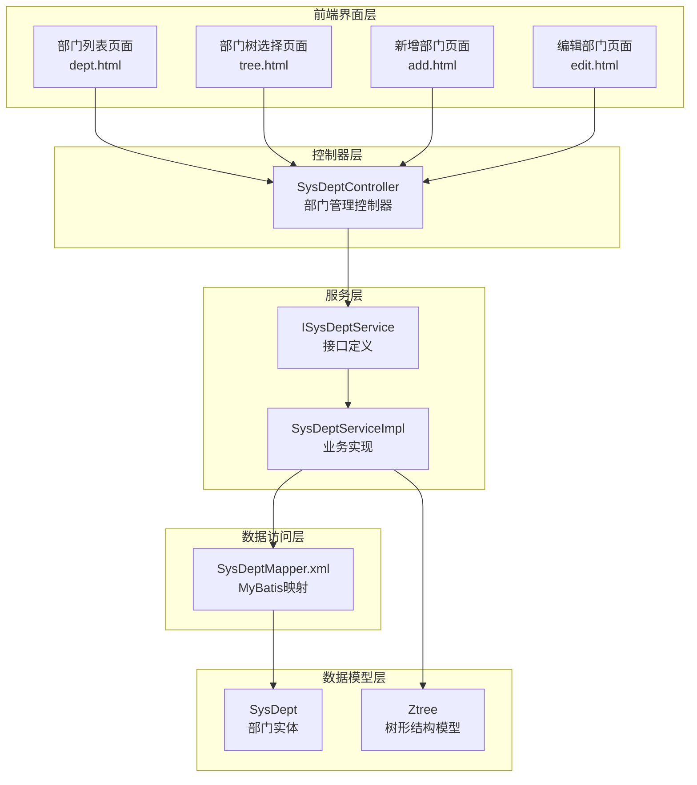
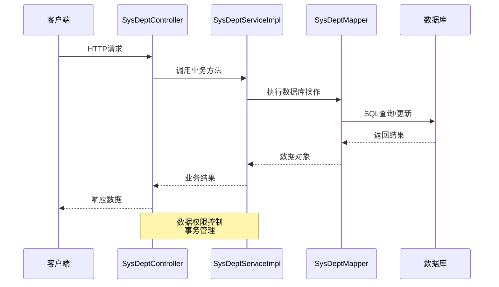
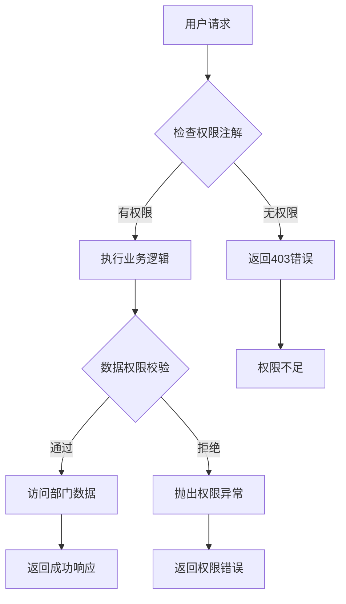
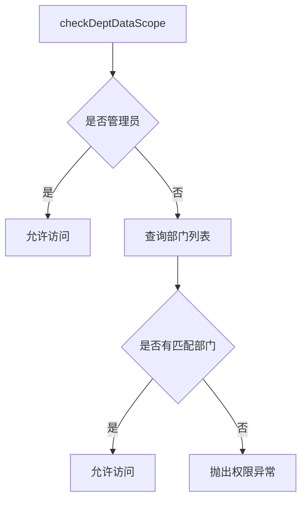
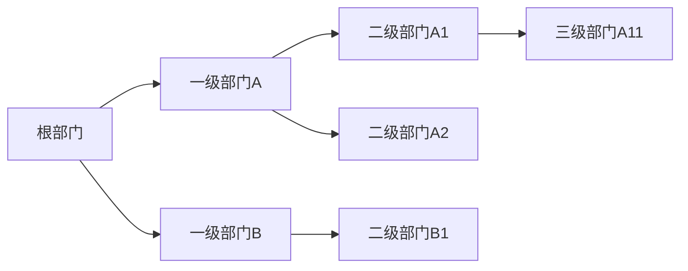
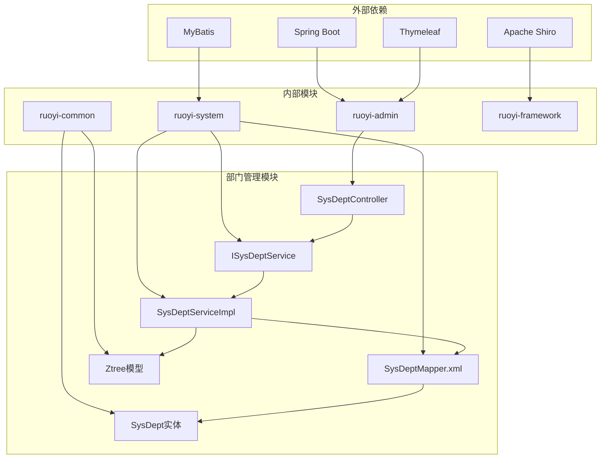
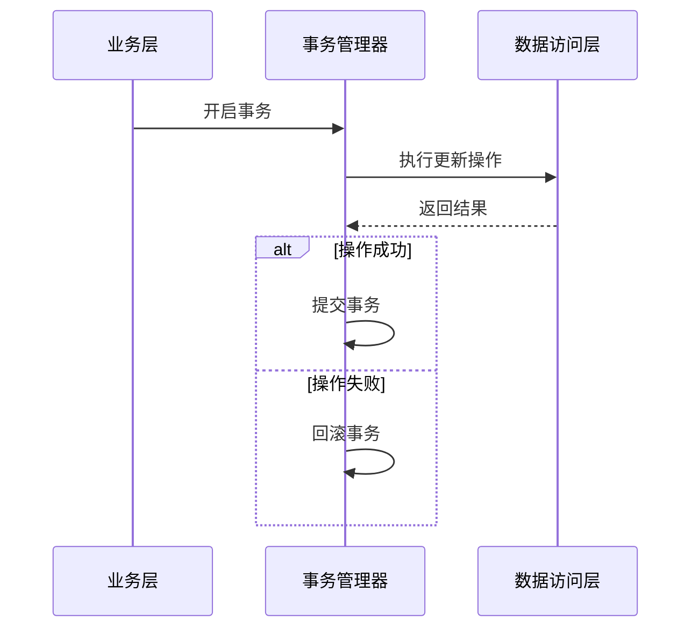

# 部门管理API

<cite>
**本文档引用的文件**
- [SysDeptController.java](file://ruoyi-admin/src/main/java/com/ruoyi/web/controller/system/SysDeptController.java)
- [SysDept.java](file://ruoyi-common/src/main/java/com/ruoyi/common/core/domain/entity/SysDept.java)
- [ISysDeptService.java](file://ruoyi-system/src/main/java/com/ruoyi/system/service/ISysDeptService.java)
- [SysDeptServiceImpl.java](file://ruoyi-system/src/main/java/com/ruoyi/system/service/impl/SysDeptServiceImpl.java)
- [SysDeptMapper.xml](file://ruoyi-system/src/main/resources/mapper/system/SysDeptMapper.xml)
- [Ztree.java](file://ruoyi-common/src/main/java/com/ruoyi/common/core/domain/Ztree.java)
- [UserConstants.java](file://ruoyi-common/src/main/java/com/ruoyi/common/constant/UserConstants.java)
- [dept.html](file://ruoyi-admin/src/main/resources/templates/system/dept/dept.html)
- [tree.html](file://ruoyi-admin/src/main/resources/templates/system/dept/tree.html)
</cite>

## 目录
1. [简介](#简介)
2. [项目结构](#项目结构)
3. [核心组件](#核心组件)
4. [架构概览](#架构概览)
5. [详细组件分析](#详细组件分析)
6. [依赖关系分析](#依赖关系分析)
7. [性能考虑](#性能考虑)
8. [故障排除指南](#故障排除指南)
9. [结论](#结论)

## 简介

本文档详细介绍了RuoYi框架中的部门管理API，这是一个基于Spring Boot的企业级管理系统的核心功能模块。部门管理API提供了完整的组织架构管理能力，包括部门的增删改查、树形结构展示、数据权限控制、排序管理等功能。

该系统采用分层架构设计，通过控制器层、服务层、数据访问层的清晰分离，实现了高度模块化的部门管理功能。系统支持多层级部门结构，具备完善的数据权限控制机制，能够满足企业复杂的组织架构管理需求。

## 项目结构

部门管理功能在RuoYi项目中采用标准的MVC架构模式，主要涉及以下几个核心模块：

**图表来源**
- [SysDeptController.java:1-204](file://ruoyi-admin/src/main/java/com/ruoyi/web/controller/system/SysDeptController.java#L1-L204)
- [SysDeptServiceImpl.java:1-354](file://ruoyi-system/src/main/java/com/ruoyi/system/service/impl/SysDeptServiceImpl.java#L1-L354)

**章节来源**
- [SysDeptController.java:1-204](file://ruoyi-admin/src/main/java/com/ruoyi/web/controller/system/SysDeptController.java#L1-L204)
- [SysDeptServiceImpl.java:1-354](file://ruoyi-system/src/main/java/com/ruoyi/system/service/impl/SysDeptServiceImpl.java#L1-L354)

## 核心组件

### 部门实体模型

部门实体是整个部门管理系统的数据基础，包含了部门管理所需的所有核心字段：

| 字段名 | 类型 | 描述 | 约束条件 |
|--------|------|------|----------|
| deptId | Long | 部门ID | 主键，自增 |
| parentId | Long | 父部门ID | 默认0表示根部门 |
| ancestors | String | 祖级列表 | 记录从根到当前部门的完整路径 |
| deptName | String | 部门名称 | 必填，长度不超过30字符 |
| orderNum | Integer | 显示顺序 | 必填，用于排序 |
| leader | String | 负责人 | 可选，长度不超过50字符 |
| phone | String | 联系电话 | 可选，长度不超过11字符 |
| email | String | 邮箱地址 | 可选，长度不超过50字符 |
| status | String | 部门状态 | '0'正常，'1'停用，默认'0' |
| delFlag | String | 删除标志 | '0'存在，'2'删除，默认'0' |

### 树形结构模型

系统使用Ztree组件来实现部门的树形展示，Ztree模型包含以下关键属性：

| 属性名 | 类型 | 描述 |
|--------|------|------|
| id | Long | 节点ID |
| pId | Long | 父节点ID |
| name | String | 节点名称 |
| title | String | 节点标题 |
| checked | Boolean | 是否勾选 |
| open | Boolean | 是否展开 |
| nocheck | Boolean | 是否可勾选 |

**章节来源**
- [SysDept.java:17-204](file://ruoyi-common/src/main/java/com/ruoyi/common/core/domain/entity/SysDept.java#L17-L204)
- [Ztree.java:10-105](file://ruoyi-common/src/main/java/com/ruoyi/common/core/domain/Ztree.java#L10-L105)

## 架构概览

部门管理API采用经典的三层架构设计，确保了代码的可维护性和扩展性：

**图表来源**
- [SysDeptController.java:32-204](file://ruoyi-admin/src/main/java/com/ruoyi/web/controller/system/SysDeptController.java#L32-L204)
- [SysDeptServiceImpl.java:28-354](file://ruoyi-system/src/main/java/com/ruoyi/system/service/impl/SysDeptServiceImpl.java#L28-L354)

### 权限控制机制

系统实现了多层次的权限控制机制：

**图表来源**
- [SysDeptController.java:39-163](file://ruoyi-admin/src/main/java/com/ruoyi/web/controller/system/SysDeptController.java#L39-L163)
- [SysDeptServiceImpl.java:313-326](file://ruoyi-system/src/main/java/com/ruoyi/system/service/impl/SysDeptServiceImpl.java#L313-L326)

**章节来源**
- [SysDeptController.java:1-204](file://ruoyi-admin/src/main/java/com/ruoyi/web/controller/system/SysDeptController.java#L1-L204)
- [SysDeptServiceImpl.java:1-354](file://ruoyi-system/src/main/java/com/ruoyi/system/service/impl/SysDeptServiceImpl.java#L1-L354)

## 详细组件分析

### 控制器层分析

SysDeptController作为部门管理的入口控制器，提供了完整的RESTful API接口：

#### 部门列表查询接口

**接口定义**
- 方法：POST
- 路径：`/system/dept/list`
- 权限：`system:dept:list`
- 功能：查询部门列表数据

**请求参数**
- 支持按部门名称模糊查询
- 支持按部门状态筛选
- 支持分页查询（由前端表格控件处理）

**响应数据**
- 返回SysDept实体列表
- 自动应用数据权限过滤

#### 部门新增接口

**接口定义**
- 方法：POST
- 路径：`/system/dept/add`
- 权限：`system:dept:add`
- 功能：新增部门信息

**请求参数**
- parentId：父部门ID
- deptName：部门名称
- orderNum：显示顺序
- leader：负责人
- phone：联系电话
- email：邮箱地址
- status：部门状态

**响应数据**
- AjaxResult对象
- 包含操作结果和消息

#### 部门修改接口

**接口定义**
- 方法：POST
- 路径：`/system/dept/edit`
- 权限：`system:dept:edit`
- 功能：修改部门信息

**请求参数**
- deptId：部门ID（必填）
- parentId：父部门ID
- deptName：部门名称
- orderNum：显示顺序
- leader：负责人
- phone：联系电话
- email：邮箱地址
- status：部门状态

**响应数据**
- AjaxResult对象
- 包含操作结果和消息

#### 部门删除接口

**接口定义**
- 方法：GET
- 路径：`/system/dept/remove/{deptId}`
- 权限：`system:dept:remove`
- 功能：删除部门信息

**请求参数**
- deptId：部门ID（路径参数）

**删除约束**
- 不能删除有下级部门的部门
- 不能删除仍有用户的部门
- 需要具备数据权限

#### 部门排序保存接口

**接口定义**
- 方法：POST
- 路径：`/system/dept/updateSort`
- 权限：`system:dept:edit`
- 功能：批量保存部门排序

**请求参数**
- deptIds：部门ID数组
- orderNums：排序数组

**响应数据**
- AjaxResult对象

#### 部门树形结构接口

**接口定义**
- 方法：GET
- 路径：`/system/dept/treeData/{excludeId}`
- 权限：`system:dept:list`
- 功能：获取部门树形结构数据

**请求参数**
- excludeId：排除的部门ID（可选）

**响应数据**
- Ztree对象列表
- 支持排除指定部门的子部门

#### 部门树选择接口

**接口定义**
- 方法：GET
- 路径：`/system/dept/selectDeptTree/{deptId}` 或 `/system/dept/selectDeptTree/{deptId}/{excludeId}`
- 权限：`system:dept:list`
- 功能：部门树选择弹窗

**请求参数**
- deptId：当前部门ID
- excludeId：排除的部门ID（可选）

**响应数据**
- 返回树形选择页面

**章节来源**
- [SysDeptController.java:39-204](file://ruoyi-admin/src/main/java/com/ruoyi/web/controller/system/SysDeptController.java#L39-L204)

### 服务层分析

ISysDeptService定义了部门管理的核心业务接口，SysDeptServiceImpl提供了完整的实现。

#### 核心业务方法

| 方法名 | 参数 | 返回值 | 功能描述 |
|--------|------|--------|----------|
| selectDeptList | SysDept | List<SysDept> | 查询部门列表 |
| selectDeptTree | SysDept | List<Ztree> | 获取部门树形结构 |
| selectDeptTreeExcludeChild | SysDept | List<Ztree> | 获取排除子部门的树形结构 |
| insertDept | SysDept | int | 新增部门 |
| updateDept | SysDept | int | 更新部门 |
| deleteDeptById | Long | int | 删除部门 |
| checkDeptNameUnique | SysDept | boolean | 验证部门名称唯一性 |
| checkDeptDataScope | Long | void | 验证部门数据权限 |
| updateDeptSort | String[], String[] | void | 保存部门排序 |

#### 数据权限控制

服务层实现了严格的数据权限控制机制：

**图表来源**
- [SysDeptServiceImpl.java:313-326](file://ruoyi-system/src/main/java/com/ruoyi/system/service/impl/SysDeptServiceImpl.java#L313-L326)

**章节来源**
- [ISysDeptService.java:13-126](file://ruoyi-system/src/main/java/com/ruoyi/system/service/ISysDeptService.java#L13-L126)
- [SysDeptServiceImpl.java:28-354](file://ruoyi-system/src/main/java/com/ruoyi/system/service/impl/SysDeptServiceImpl.java#L28-L354)

### 数据访问层分析

SysDeptMapper.xml使用MyBatis实现数据库操作，提供了完整的SQL映射。

#### 核心查询方法

| 方法名 | SQL功能 | 参数 | 返回值 |
|--------|---------|------|--------|
| selectDeptList | 查询部门列表 | SysDept | List<SysDept> |
| selectDeptById | 根据ID查询部门 | Long | SysDept |
| selectChildrenDeptById | 查询子部门 | Long | List<SysDept> |
| selectNormalChildrenDeptById | 查询正常状态子部门数量 | Long | int |
| checkDeptExistUser | 检查部门是否存在用户 | Long | int |
| selectDeptCount | 统计部门数量 | SysDept | int |
| checkDeptNameUnique | 验证部门名称唯一性 | String, Long | SysDept |

#### 祖级路径管理

系统通过ancestors字段维护部门的祖级路径，支持复杂的层级查询：

**图表来源**
- [SysDeptMapper.xml:74-87](file://ruoyi-system/src/main/resources/mapper/system/SysDeptMapper.xml#L74-L87)

**章节来源**
- [SysDeptMapper.xml:1-162](file://ruoyi-system/src/main/resources/mapper/system/SysDeptMapper.xml#L1-L162)

## 依赖关系分析

部门管理API的依赖关系体现了清晰的分层架构：

**图表来源**
- [SysDeptController.java:1-204](file://ruoyi-admin/src/main/java/com/ruoyi/web/controller/system/SysDeptController.java#L1-L204)
- [SysDeptServiceImpl.java:1-354](file://ruoyi-system/src/main/java/com/ruoyi/system/service/impl/SysDeptServiceImpl.java#L1-L354)

### 关键依赖特性

1. **权限控制依赖**：通过Apache Shiro实现基于角色的权限控制
2. **数据访问依赖**：MyBatis提供ORM映射和SQL管理
3. **前端集成依赖**：Thymeleaf模板引擎支持动态页面渲染
4. **数据模型依赖**：统一的实体模型确保数据一致性

**章节来源**
- [SysDeptController.java:1-204](file://ruoyi-admin/src/main/java/com/ruoyi/web/controller/system/SysDeptController.java#L1-L204)
- [SysDeptServiceImpl.java:1-354](file://ruoyi-system/src/main/java/com/ruoyi/system/service/impl/SysDeptServiceImpl.java#L1-L354)

## 性能考虑

### 查询优化策略

1. **索引优化**：对dept_id、parent_id、ancestors字段建立适当索引
2. **分页查询**：前端表格控件自动处理分页，减少一次性数据传输
3. **缓存策略**：利用Redis缓存常用部门数据
4. **批量操作**：支持批量更新排序，减少数据库交互次数

### 事务管理

部门更新操作采用事务管理确保数据一致性：

**图表来源**
- [SysDeptServiceImpl.java:212-232](file://ruoyi-system/src/main/java/com/ruoyi/system/service/impl/SysDeptServiceImpl.java#L212-L232)

## 故障排除指南

### 常见问题及解决方案

#### 部门删除失败

**问题现象**：删除部门时报错"存在下级部门,不允许删除"

**原因分析**：
- 目标部门仍有子部门
- 目标部门仍关联用户

**解决方法**：
1. 先删除或转移所有子部门
2. 将部门用户转移到其他部门
3. 再次尝试删除操作

#### 部门名称重复

**问题现象**：新增或修改部门时提示名称已存在

**解决方法**：
- 修改部门名称确保唯一性
- 同一父部门下部门名称必须唯一

#### 权限不足

**问题现象**：访问部门管理功能返回权限错误

**解决方法**：
- 确认用户具备相应权限
- 检查数据权限范围设置
- 联系管理员分配权限

#### 排序保存失败

**问题现象**：保存部门排序时报错

**解决方法**：
- 检查传入的ID和排序数组长度是否一致
- 确认传入的参数格式正确
- 查看系统日志获取详细错误信息

**章节来源**
- [SysDeptController.java:151-163](file://ruoyi-admin/src/main/java/com/ruoyi/web/controller/system/SysDeptController.java#L151-L163)
- [SysDeptServiceImpl.java:334-352](file://ruoyi-system/src/main/java/com/ruoyi/system/service/impl/SysDeptServiceImpl.java#L334-L352)

## 结论

部门管理API展现了RuoYi框架在企业级应用开发中的优秀实践。通过清晰的分层架构、完善的权限控制、灵活的树形结构管理和严格的业务约束，该模块能够有效支撑复杂的企业组织架构管理需求。

### 主要优势

1. **架构清晰**：采用标准的MVC模式，职责分离明确
2. **权限完善**：多层次权限控制确保数据安全
3. **功能丰富**：涵盖部门管理的全生命周期操作
4. **扩展性强**：良好的设计便于功能扩展和定制
5. **性能优化**：合理的查询策略和事务管理

### 应用建议

1. **权限配置**：根据实际业务场景合理配置数据权限
2. **性能监控**：关注部门树形查询的性能表现
3. **数据备份**：定期备份部门结构数据
4. **用户培训**：确保管理员熟悉部门管理操作流程

该部门管理API为企业提供了稳定可靠的组织架构管理基础，能够满足大多数企业的部门管理需求。