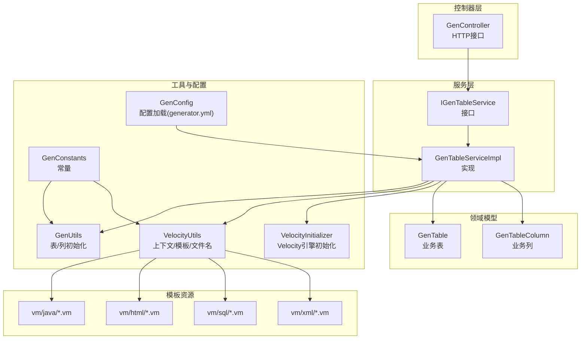
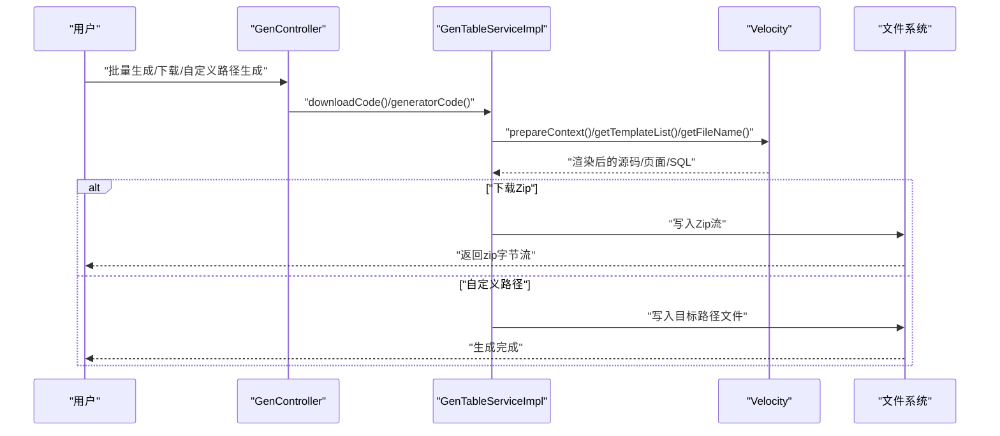
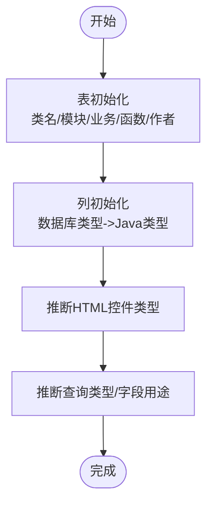
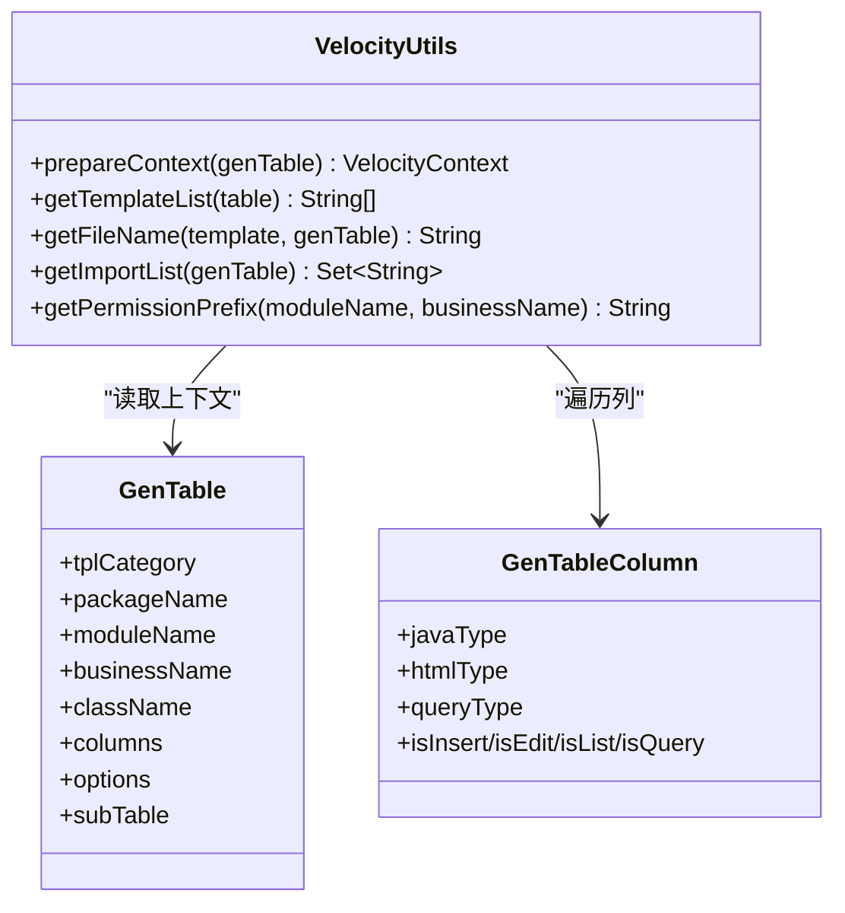
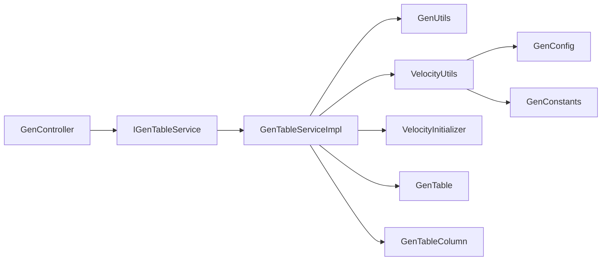

# 代码生成器模块

<cite>
**本文引用的文件**
- [GenConfig.java](file://ruoyi-generator/src/main/java/com/ruoyi/generator/config/GenConfig.java)
- [GenUtils.java](file://ruoyi-generator/src/main/java/com/ruoyi/generator/util/GenUtils.java)
- [VelocityUtils.java](file://ruoyi-generator/src/main/java/com/ruoyi/generator/util/VelocityUtils.java)
- [VelocityInitializer.java](file://ruoyi-generator/src/main/java/com/ruoyi/generator/util/VelocityInitializer.java)
- [GenTable.java](file://ruoyi-generator/src/main/java/com/ruoyi/generator/domain/GenTable.java)
- [GenTableColumn.java](file://ruoyi-generator/src/main/java/com/ruoyi/generator/domain/GenTableColumn.java)
- [GenController.java](file://ruoyi-generator/src/main/java/com/ruoyi/generator/controller/GenController.java)
- [IGenTableService.java](file://ruoyi-generator/src/main/java/com/ruoyi/generator/service/IGenTableService.java)
- [GenTableServiceImpl.java](file://ruoyi-generator/src/main/java/com/ruoyi/generator/service/impl/GenTableServiceImpl.java)
- [GenConstants.java](file://ruoyi-common/src/main/java/com/ruoyi/common/constant/GenConstants.java)
- [generator.yml](file://ruoyi-generator/src/main/resources/generator.yml)
- [domain.java.vm](file://ruoyi-generator/src/main/resources/vm/java/domain.java.vm)
- [controller.java.vm](file://ruoyi-generator/src/main/resources/vm/java/controller.java.vm)
- [list.html.vm](file://ruoyi-generator/src/main/resources/vm/html/list.html.vm)
- [sql.vm](file://ruoyi-generator/src/main/resources/vm/sql/sql.vm)
</cite>

## 目录
1. [简介](#简介)
2. [项目结构](#项目结构)
3. [核心组件](#核心组件)
4. [架构总览](#架构总览)
5. [详细组件分析](#详细组件分析)
6. [依赖关系分析](#依赖关系分析)
7. [性能考虑](#性能考虑)
8. [故障排查指南](#故障排查指南)
9. [结论](#结论)
10. [附录](#附录)

## 简介
本文件面向RuoYi框架中的“代码生成器模块”，系统性阐述基于Velocity模板引擎的代码生成实现原理与使用方法。内容涵盖：
- Velocity模板语法与变量替换机制
- 数据库表到代码实体的映射规则（字段类型转换、命名规范、注释生成）
- 生成器配置文件说明（模板选择、输出路径、代码风格）
- 自定义模板开发指南、批量代码生成流程与二次开发方法
- 常见问题排查与性能优化建议

## 项目结构
代码生成器模块位于ruoyi-generator工程中，采用按职责分层组织：
- controller：对外提供Web接口，支持导入表、编辑配置、预览、下载与自定义路径生成、批量生成、同步数据库等
- service：业务逻辑实现，负责表与列的导入、初始化、模板渲染、Zip打包与文件生成
- domain：持久化模型，封装GenTable与GenTableColumn
- util：工具类，负责Velocity上下文准备、模板选择、文件名解析、包路径推导、类型映射与命名转换
- config：生成配置加载，从generator.yml读取作者、包路径、表前缀、覆盖策略等
- resources/vm：Velocity模板资源，按java、html、xml、sql分类

图表来源
- [GenController.java:48-309](file://ruoyi-generator/src/main/java/com/ruoyi/generator/controller/GenController.java#L48-L309)
- [IGenTableService.java:12-130](file://ruoyi-generator/src/main/java/com/ruoyi/generator/service/IGenTableService.java#L12-L130)
- [GenTableServiceImpl.java:46-536](file://ruoyi-generator/src/main/java/com/ruoyi/generator/service/impl/GenTableServiceImpl.java#L46-L536)
- [GenUtils.java:16-253](file://ruoyi-generator/src/main/java/com/ruoyi/generator/util/GenUtils.java#L16-L253)
- [VelocityUtils.java:15-457](file://ruoyi-generator/src/main/java/com/ruoyi/generator/util/VelocityUtils.java#L15-L457)
- [VelocityInitializer.java:12-35](file://ruoyi-generator/src/main/java/com/ruoyi/generator/util/VelocityInitializer.java#L12-L35)
- [GenConfig.java:16-88](file://ruoyi-generator/src/main/java/com/ruoyi/generator/config/GenConfig.java#L16-L88)
- [GenConstants.java:8-118](file://ruoyi-common/src/main/java/com/ruoyi/common/constant/GenConstants.java#L8-L118)

章节来源
- [GenController.java:48-309](file://ruoyi-generator/src/main/java/com/ruoyi/generator/controller/GenController.java#L48-L309)
- [GenTableServiceImpl.java:46-536](file://ruoyi-generator/src/main/java/com/ruoyi/generator/service/impl/GenTableServiceImpl.java#L46-L536)

## 核心组件
- 配置中心GenConfig：从generator.yml读取作者、包路径、自动去前缀、表前缀、覆盖策略等
- 表/列初始化GenUtils：完成表名转类名、业务名、模块名、函数名、列类型映射、HTML控件类型、查询类型、插入/编辑/列表/查询字段标记等
- Velocity工具VelocityUtils：构建VelocityContext、选择模板、计算文件名、生成包导入列表、权限前缀、树形/子表扩展上下文
- Velocity引擎初始化VelocityInitializer：设置字符集与模板加载器
- 控制器GenController：提供导入表、编辑、预览、下载Zip、自定义路径生成、批量生成、同步数据库等接口
- 服务实现GenTableServiceImpl：整合上述工具，执行模板渲染、Zip打包、文件写入或自定义路径写入
- 模型GenTable/GenTableColumn：承载表与列元数据及生成所需标记位
- 常量GenConstants：模板类别、HTML控件类型、Java类型、查询方式、白名单字段等

章节来源
- [GenConfig.java:16-88](file://ruoyi-generator/src/main/java/com/ruoyi/generator/config/GenConfig.java#L16-L88)
- [GenUtils.java:16-253](file://ruoyi-generator/src/main/java/com/ruoyi/generator/util/GenUtils.java#L16-L253)
- [VelocityUtils.java:15-457](file://ruoyi-generator/src/main/java/com/ruoyi/generator/util/VelocityUtils.java#L15-L457)
- [VelocityInitializer.java:12-35](file://ruoyi-generator/src/main/java/com/ruoyi/generator/util/VelocityInitializer.java#L12-L35)
- [GenController.java:48-309](file://ruoyi-generator/src/main/java/com/ruoyi/generator/controller/GenController.java#L48-L309)
- [GenTableServiceImpl.java:46-536](file://ruoyi-generator/src/main/java/com/ruoyi/generator/service/impl/GenTableServiceImpl.java#L46-L536)
- [GenTable.java:16-398](file://ruoyi-generator/src/main/java/com/ruoyi/generator/domain/GenTable.java#L16-L398)
- [GenTableColumn.java:12-373](file://ruoyi-generator/src/main/java/com/ruoyi/generator/domain/GenTableColumn.java#L12-L373)
- [GenConstants.java:8-118](file://ruoyi-common/src/main/java/com/ruoyi/common/constant/GenConstants.java#L8-L118)

## 架构总览
以下序列图展示从用户触发到生成产物的关键调用链：

图表来源
- [GenController.java:247-296](file://ruoyi-generator/src/main/java/com/ruoyi/generator/controller/GenController.java#L247-L296)
- [GenTableServiceImpl.java:98-121](file://ruoyi-generator/src/main/java/com/ruoyi/generator/service/impl/GenTableServiceImpl.java#L98-L121)
- [VelocityUtils.java:34-167](file://ruoyi-generator/src/main/java/com/ruoyi/generator/util/VelocityUtils.java#L34-L167)

## 详细组件分析

### 配置中心与生成参数
- 配置项
  - author：作者名
  - packageName：生成包路径（需指向具体模块）
  - autoRemovePre：是否自动去除表前缀
  - tablePrefix：表前缀列表（逗号分隔）
  - allowOverwrite：是否允许覆盖到本地（自定义路径）
- 作用：驱动类名转换、包路径推导、权限前缀生成、文件路径拼装

章节来源
- [generator.yml:3-13](file://ruoyi-generator/src/main/resources/generator.yml#L3-L13)
- [GenConfig.java:16-88](file://ruoyi-generator/src/main/java/com/ruoyi/generator/config/GenConfig.java#L16-L88)

### 表/列初始化与映射规则
- 表初始化
  - 类名转换：根据autoRemovePre与tablePrefix去除前缀后转驼峰
  - 业务名/模块名：从包名与表名推导
  - 函数名/作者：来自表注释与配置
  - 创建人：来自当前登录用户
- 列初始化
  - Java类型映射：字符串/文本域、时间、整数/长整型/高精度、浮点型等
  - HTML控件类型：输入框、文本域、下拉框、单选框、日期控件、上传、富文本等
  - 查询类型：LIKE/EQ等
  - 字段用途标记：插入/编辑/列表/查询
  - 特殊字段识别：name/status/type/sex/file/content等自动匹配控件与查询方式

图表来源
- [GenUtils.java:21-126](file://ruoyi-generator/src/main/java/com/ruoyi/generator/util/GenUtils.java#L21-L126)
- [GenConstants.java:37-117](file://ruoyi-common/src/main/java/com/ruoyi/common/constant/GenConstants.java#L37-L117)

章节来源
- [GenUtils.java:16-253](file://ruoyi-generator/src/main/java/com/ruoyi/generator/util/GenUtils.java#L16-L253)
- [GenConstants.java:8-118](file://ruoyi-common/src/main/java/com/ruoyi/common/constant/GenConstants.java#L8-L118)

### Velocity上下文与模板选择
- 上下文变量
  - 模板类别、表名、函数名、类名、模块名、业务名、包路径、作者、日期、主键列、导入列表、权限前缀、列集合、表对象
  - 扩展选项：genView、树形字段(treeCode/treeParentCode/treeName/expandColumn)、子表上下文(subTable/*)
- 模板选择
  - 基础模板：domain、mapper、service、serviceImpl、controller、mapper.xml、sql
  - CRUD：list.html
  - 树形：tree.html、list-tree.html
  - 子表：list.html、sub-domain.java.vm
  - 可选：view.html（由扩展选项控制）

图表来源
- [VelocityUtils.java:34-167](file://ruoyi-generator/src/main/java/com/ruoyi/generator/util/VelocityUtils.java#L34-L167)
- [GenTable.java:16-398](file://ruoyi-generator/src/main/java/com/ruoyi/generator/domain/GenTable.java#L16-L398)
- [GenTableColumn.java:12-373](file://ruoyi-generator/src/main/java/com/ruoyi/generator/domain/GenTableColumn.java#L12-L373)

章节来源
- [VelocityUtils.java:15-457](file://ruoyi-generator/src/main/java/com/ruoyi/generator/util/VelocityUtils.java#L15-L457)

### 模板语法与变量替换
- 模板位置
  - Java实体：vm/java/domain.java.vm
  - 控制器：vm/java/controller.java.vm
  - HTML页面：vm/html/list.html.vm等
  - SQL脚本：vm/sql/sql.vm
- 常用指令
  - #foreach：遍历列、导入包、字典数据
  - #if/#elseif/#else：条件渲染（树形/子表/详情页）
  - #set：局部变量赋值（如属性名、注释截取）
  - ${var}：变量插值（包名、类名、字段、权限前缀等）
- 示例要点
  - 导入包：根据列类型动态加入java.util.Date、BigDecimal、JsonFormat等
  - 注解：@Excel、@JsonFormat、读取converter表达式
  - 权限：${permissionPrefix}:view、:list、:add、:edit、:remove、:export
  - 字典：通过${@dict.getType()}注入字典数据

章节来源
- [domain.java.vm:1-106](file://ruoyi-generator/src/main/resources/vm/java/domain.java.vm#L1-L106)
- [controller.java.vm:1-218](file://ruoyi-generator/src/main/resources/vm/java/controller.java.vm#L1-L218)
- [list.html.vm:1-160](file://ruoyi-generator/src/main/resources/vm/html/list.html.vm#L1-L160)
- [sql.vm:1-23](file://ruoyi-generator/src/main/resources/vm/sql/sql.vm#L1-L23)

### 生成流程与文件命名
- 文件路径
  - Java类：main/java/<包路径>/<module>/...（domain、mapper、service、controller、xml）
  - HTML：main/resources/templates/<module>/<business>/
  - SQL：业务名Menu.sql
- 文件名规则
  - domain：ClassName.java
  - mapper：ClassNameMapper.java
  - service：IClassNameService.java
  - serviceImpl：ClassNameServiceImpl.java
  - controller：ClassNameController.java
  - mapper.xml：ClassNameMapper.xml
  - list.html：businessName.html
  - tree.html：tree.html
  - add/edit/view：对应页面
  - sql.vm：businessNameMenu.sql

章节来源
- [VelocityUtils.java:173-247](file://ruoyi-generator/src/main/java/com/ruoyi/generator/util/VelocityUtils.java#L173-L247)

### 批量生成与下载
- 接口
  - /tool/gen/batchGenCode?tables=表1,表2,...：批量下载Zip
  - /tool/gen/download/{tableName}：单表下载Zip
- 实现
  - 服务层收集模板列表，逐个渲染，写入Zip输出流，响应浏览器下载

章节来源
- [GenController.java:287-296](file://ruoyi-generator/src/main/java/com/ruoyi/generator/controller/GenController.java#L287-L296)
- [GenTableServiceImpl.java:118-121](file://ruoyi-generator/src/main/java/com/ruoyi/generator/service/impl/GenTableServiceImpl.java#L118-L121)

### 自定义路径生成与覆盖策略
- 接口
  - /tool/gen/genCode/{tableName}：自定义路径生成
- 策略
  - 仅当配置allowOverwrite=true时允许覆盖本地文件
  - 服务层根据packageName推导项目路径，逐模板写入

章节来源
- [GenController.java:255-269](file://ruoyi-generator/src/main/java/com/ruoyi/generator/controller/GenController.java#L255-L269)
- [GenConfig.java:77-86](file://ruoyi-generator/src/main/java/com/ruoyi/generator/config/GenConfig.java#L77-L86)
- [VelocityUtils.java:254-262](file://ruoyi-generator/src/main/java/com/ruoyi/generator/util/VelocityUtils.java#L254-L262)

### 二次开发与扩展
- 新增模板
  - 在vm/java、vm/html、vm/xml、vm/sql下添加.vm文件
  - 在VelocityUtils.getTemplateList中注册模板路径
  - 在getFileName中增加文件名映射规则
- 扩展上下文
  - 在VelocityUtils.prepareContext中put新变量
  - 在模板中使用${var}访问
- 生成选项
  - 通过GenTable.options传入JSON参数，在VelocityUtils中解析并注入上下文（如genView、树形字段、父菜单ID等）

章节来源
- [VelocityUtils.java:134-167](file://ruoyi-generator/src/main/java/com/ruoyi/generator/util/VelocityUtils.java#L134-L167)
- [GenTable.java:84-99](file://ruoyi-generator/src/main/java/com/ruoyi/generator/domain/GenTable.java#L84-L99)

## 依赖关系分析
- 组件耦合
  - GenController依赖IGenTableService；服务实现依赖GenUtils、VelocityUtils、VelocityInitializer、GenTable/GenTableColumn、GenConstants
  - VelocityUtils依赖GenConfig与GenConstants进行上下文与模板选择
- 外部依赖
  - Velocity模板引擎、Apache Commons IO、Fastjson、Druid SQL解析（导入/创建表）

图表来源
- [GenController.java:48-309](file://ruoyi-generator/src/main/java/com/ruoyi/generator/controller/GenController.java#L48-L309)
- [GenTableServiceImpl.java:46-536](file://ruoyi-generator/src/main/java/com/ruoyi/generator/service/impl/GenTableServiceImpl.java#L46-L536)
- [VelocityUtils.java:15-457](file://ruoyi-generator/src/main/java/com/ruoyi/generator/util/VelocityUtils.java#L15-L457)
- [GenUtils.java:16-253](file://ruoyi-generator/src/main/java/com/ruoyi/generator/util/GenUtils.java#L16-L253)
- [GenConfig.java:16-88](file://ruoyi-generator/src/main/java/com/ruoyi/generator/config/GenConfig.java#L16-L88)
- [GenConstants.java:8-118](file://ruoyi-common/src/main/java/com/ruoyi/common/constant/GenConstants.java#L8-L118)

## 性能考虑
- 模板数量与渲染次数：模板越多、列越多，渲染耗时越长。建议按需启用模板（如不生成详情页时关闭genView）
- Zip打包：批量生成时一次性写入Zip，注意内存占用；可考虑分批或流式输出
- 文件写入：自定义路径生成时IO开销较大，建议在磁盘空间充足且网络稳定环境下进行
- Velocity初始化：全局一次初始化，避免重复创建引擎实例

## 故障排查指南
- 无法生成到本地
  - 现象：提示不允许覆盖
  - 原因：allowOverwrite=false
  - 处理：在generator.yml中开启allowOverwrite或使用下载Zip方式
- 模板未生效
  - 现象：新增模板未出现在生成结果
  - 原因：未在VelocityUtils.getTemplateList中注册或未在getFileName中映射文件名
  - 处理：检查模板路径与文件名映射
- 类名/包名异常
  - 现象：类名包含表前缀或驼峰不正确
  - 原因：autoRemovePre/tablePrefix配置不当
  - 处理：调整generator.yml中的前缀配置
- 字段类型/控件不正确
  - 现象：时间字段未标注@JsonFormat、浮点未用BigDecimal
  - 原因：数据库类型未命中映射规则
  - 处理：在GenUtils中补充类型映射或手动调整列配置
- 权限与菜单未生成
  - 现象：页面无按钮或菜单缺失
  - 原因：options中parentMenuId未设置或genView未启用
  - 处理：在表配置中设置parentMenuId，或启用genView扩展选项

章节来源
- [GenController.java:263-269](file://ruoyi-generator/src/main/java/com/ruoyi/generator/controller/GenController.java#L263-L269)
- [VelocityUtils.java:134-167](file://ruoyi-generator/src/main/java/com/ruoyi/generator/util/VelocityUtils.java#L134-L167)
- [GenUtils.java:35-126](file://ruoyi-generator/src/main/java/com/ruoyi/generator/util/GenUtils.java#L35-L126)
- [generator.yml:9-13](file://ruoyi-generator/src/main/resources/generator.yml#L9-L13)

## 结论
该代码生成器模块以Velocity为核心，结合配置驱动与约定优于配置的设计，实现了从数据库表到前后端代码与菜单SQL的自动化生成。通过清晰的分层与可扩展的模板体系，开发者可以快速定制生成规则、批量产出标准化代码，并在需要时进行二次开发与优化。

## 附录

### 生成器配置文件详解
- 位置：ruoyi-generator/src/main/resources/generator.yml
- 字段说明
  - gen.author：作者名
  - gen.packageName：生成包路径（需改为实际模块名）
  - gen.autoRemovePre：是否自动去除表前缀
  - gen.tablePrefix：表前缀列表（逗号分隔）
  - gen.allowOverwrite：是否允许覆盖到本地（自定义路径）

章节来源
- [generator.yml:3-13](file://ruoyi-generator/src/main/resources/generator.yml#L3-L13)

### 模板选择与输出路径对照
- 模板类别与输出
  - crud：domain、mapper、service、serviceImpl、controller、mapper.xml、list.html、add.html、edit.html、sql.vm
  - tree：额外生成tree.html、list-tree.html
  - sub：额外生成sub-domain.java.vm
  - genView：可选生成view.html

章节来源
- [VelocityUtils.java:134-167](file://ruoyi-generator/src/main/java/com/ruoyi/generator/util/VelocityUtils.java#L134-L167)