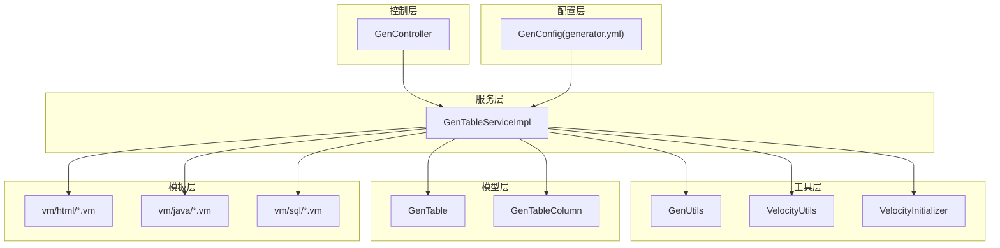
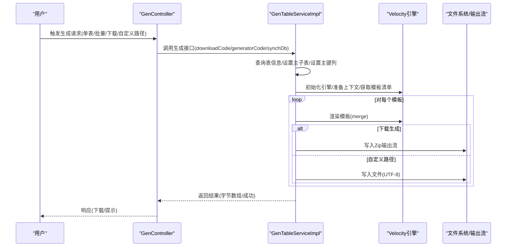
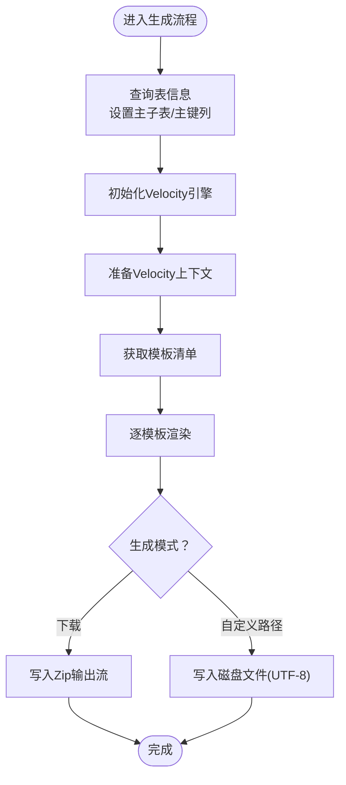
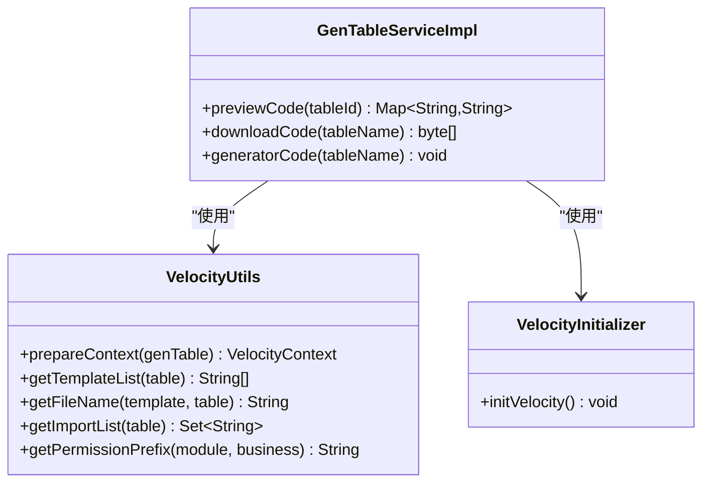
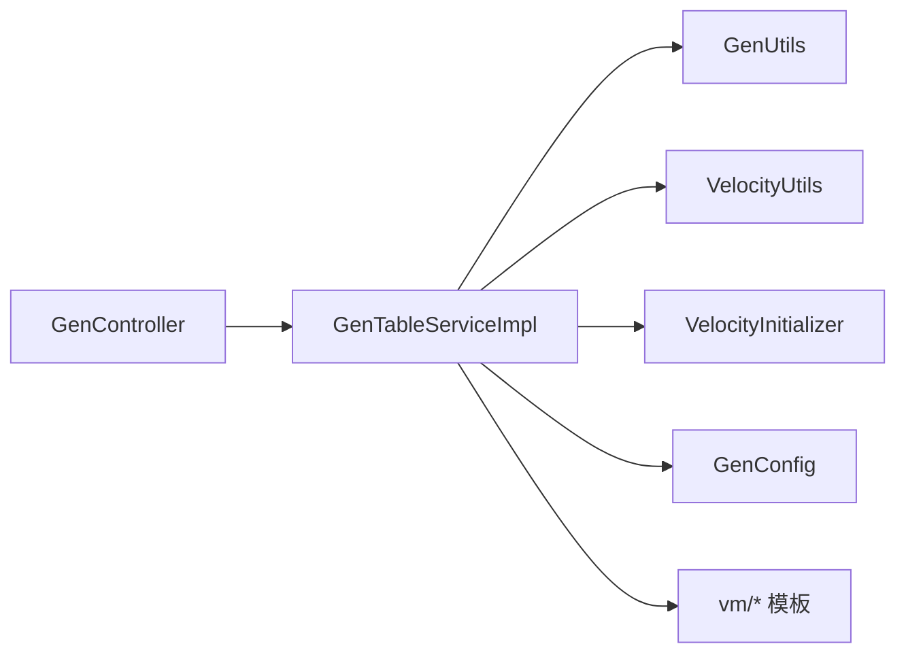

# 代码生成流程

<cite>
**本文引用的文件**
- [GenTableServiceImpl.java](file://ruoyi-generator/src/main/java/com/ruoyi/generator/service/impl/GenTableServiceImpl.java)
- [GenTable.java](file://ruoyi-generator/src/main/java/com/ruoyi/generator/domain/GenTable.java)
- [GenTableColumn.java](file://ruoyi-generator/src/main/java/com/ruoyi/generator/domain/GenTableColumn.java)
- [GenUtils.java](file://ruoyi-generator/src/main/java/com/ruoyi/generator/util/GenUtils.java)
- [VelocityUtils.java](file://ruoyi-generator/src/main/java/com/ruoyi/generator/util/VelocityUtils.java)
- [VelocityInitializer.java](file://ruoyi-generator/src/main/java/com/ruoyi/generator/util/VelocityInitializer.java)
- [GenController.java](file://ruoyi-generator/src/main/java/com/ruoyi/generator/controller/GenController.java)
- [GenConstants.java](file://ruoyi-common/src/main/java/com/ruoyi/common/constant/GenConstants.java)
- [GenConfig.java](file://ruoyi-generator/src/main/java/com/ruoyi/generator/config/GenConfig.java)
- [generator.yml](file://ruoyi-generator/src/main/resources/generator.yml)
- [gen.html](file://ruoyi-generator/src/main/resources/templates/tool/gen/gen.html)
- [edit.html](file://ruoyi-generator/src/main/resources/templates/tool/gen/edit.html)
- [importTable.html](file://ruoyi-generator/src/main/resources/templates/tool/gen/importTable.html)
- [list.html.vm](file://ruoyi-generator/src/main/resources/vm/html/list.html.vm)
- [domain.java.vm](file://ruoyi-generator/src/main/resources/vm/java/domain.java.vm)
- [sql.vm](file://ruoyi-generator/src/main/resources/vm/sql/sql.vm)
</cite>

## 目录
1. [简介](#简介)
2. [项目结构](#项目结构)
3. [核心组件](#核心组件)
4. [架构总览](#架构总览)
5. [详细组件分析](#详细组件分析)
6. [依赖分析](#依赖分析)
7. [性能考虑](#性能考虑)
8. [故障排查指南](#故障排查指南)
9. [结论](#结论)
10. [附录](#附录)

## 简介
本文面向“代码生成流程”的实现与使用，围绕服务层 GenTableServiceImpl 的完整生命周期进行深入解析，涵盖表信息查询、模板预览、代码生成与批量处理等核心能力；详细阐述从表结构解析到最终文件输出的全流程，对比单表生成、批量生成、下载生成与自定义路径生成四种模式；解释模板渲染与文件输出机制（含Zip打包、文件路径计算与字符编码处理）；提供生成结果验证方法与错误处理策略，并给出性能优化建议与大项目生成最佳实践。

## 项目结构
- 控制层：GenController 提供前端交互入口，负责路由、权限控制与响应输出。
- 服务层：GenTableServiceImpl 实现业务逻辑，包括表查询、导入、预览、生成、同步等。
- 工具层：GenUtils、VelocityUtils、VelocityInitializer 提供表字段初始化、上下文准备、模板引擎初始化与文件名计算。
- 模型层：GenTable、GenTableColumn 封装表与列元数据。
- 模板层：vm 目录下包含 Java、HTML、XML、SQL 等模板，Velocity 渲染生成目标代码。
- 配置层：generator.yml 与 GenConfig 提供全局生成配置（作者、包名、前缀、覆盖策略等）。

图表来源
- [GenController.java:48-309](file://ruoyi-generator/src/main/java/com/ruoyi/generator/controller/GenController.java#L48-L309)
- [GenTableServiceImpl.java:47-536](file://ruoyi-generator/src/main/java/com/ruoyi/generator/service/impl/GenTableServiceImpl.java#L47-L536)
- [GenUtils.java:16-253](file://ruoyi-generator/src/main/java/com/ruoyi/generator/util/GenUtils.java#L16-L253)
- [VelocityUtils.java:15-457](file://ruoyi-generator/src/main/java/com/ruoyi/generator/util/VelocityUtils.java#L15-L457)
- [VelocityInitializer.java:12-35](file://ruoyi-generator/src/main/java/com/ruoyi/generator/util/VelocityInitializer.java#L12-L35)
- [GenTable.java:16-398](file://ruoyi-generator/src/main/java/com/ruoyi/generator/domain/GenTable.java#L16-L398)
- [GenTableColumn.java:12-373](file://ruoyi-generator/src/main/java/com/ruoyi/generator/domain/GenTableColumn.java#L12-L373)
- [GenConfig.java:16-88](file://ruoyi-generator/src/main/java/com/ruoyi/generator/config/GenConfig.java#L16-L88)

章节来源
- [GenController.java:48-309](file://ruoyi-generator/src/main/java/com/ruoyi/generator/controller/GenController.java#L48-L309)
- [GenTableServiceImpl.java:47-536](file://ruoyi-generator/src/main/java/com/ruoyi/generator/service/impl/GenTableServiceImpl.java#L47-L536)

## 核心组件
- GenTableServiceImpl：服务层核心，负责表查询、导入、预览、生成、同步、校验等。
- GenTable/GenTableColumn：表与列的领域模型，承载元数据与生成配置。
- GenUtils：表与列的初始化工具，负责类名、包名、业务名、Java类型推断、HTML控件类型、查询方式等。
- VelocityUtils：模板上下文准备、模板清单、文件名计算、导入包、权限前缀、树/子表上下文注入等。
- VelocityInitializer：Velocity 引擎初始化，确保模板加载与编码正确。
- GenController：前端交互入口，提供列表、导入、预览、生成、批量生成、同步等功能接口。
- GenConfig/generator.yml：全局生成配置，如作者、包名、前缀、覆盖策略等。

章节来源
- [GenTableServiceImpl.java:47-536](file://ruoyi-generator/src/main/java/com/ruoyi/generator/service/impl/GenTableServiceImpl.java#L47-L536)
- [GenTable.java:16-398](file://ruoyi-generator/src/main/java/com/ruoyi/generator/domain/GenTable.java#L16-L398)
- [GenTableColumn.java:12-373](file://ruoyi-generator/src/main/java/com/ruoyi/generator/domain/GenTableColumn.java#L12-L373)
- [GenUtils.java:16-253](file://ruoyi-generator/src/main/java/com/ruoyi/generator/util/GenUtils.java#L16-L253)
- [VelocityUtils.java:15-457](file://ruoyi-generator/src/main/java/com/ruoyi/generator/util/VelocityUtils.java#L15-L457)
- [VelocityInitializer.java:12-35](file://ruoyi-generator/src/main/java/com/ruoyi/generator/util/VelocityInitializer.java#L12-L35)
- [GenController.java:48-309](file://ruoyi-generator/src/main/java/com/ruoyi/generator/controller/GenController.java#L48-L309)
- [GenConfig.java:16-88](file://ruoyi-generator/src/main/java/com/ruoyi/generator/config/GenConfig.java#L16-L88)
- [generator.yml:1-13](file://ruoyi-generator/src/main/resources/generator.yml#L1-L13)

## 架构总览
代码生成采用“控制器-服务-工具-模板-配置”分层架构，服务层通过 Velocity 渲染模板，结合工具类完成上下文构建与文件路径计算，最终输出到内存或磁盘。

图表来源
- [GenController.java:244-309](file://ruoyi-generator/src/main/java/com/ruoyi/generator/controller/GenController.java#L244-L309)
- [GenTableServiceImpl.java:207-404](file://ruoyi-generator/src/main/java/com/ruoyi/generator/service/impl/GenTableServiceImpl.java#L207-L404)
- [VelocityInitializer.java:17-33](file://ruoyi-generator/src/main/java/com/ruoyi/generator/util/VelocityInitializer.java#L17-L33)
- [VelocityUtils.java:34-168](file://ruoyi-generator/src/main/java/com/ruoyi/generator/util/VelocityUtils.java#L34-L168)

## 详细组件分析

### 服务层 GenTableServiceImpl 实现逻辑
- 表信息查询与导入
  - 查询单表、列表、数据库表列表、按名称批量查询。
  - 导入表结构：初始化表与列元数据，写入数据库。
- 预览代码
  - 准备 Velocity 上下文，获取模板清单，逐个渲染并返回预览内容映射。
- 生成代码
  - 下载生成：将各模板渲染结果写入 Zip 输出流，返回字节数组。
  - 自定义路径生成：渲染模板后写入磁盘文件（UTF-8），路径由模板文件名规则与生成路径决定。
- 同步数据库
  - 对比数据库列与已配置列，保留必要选项，更新或删除列。
- 校验与辅助
  - 树/子表模式参数校验，主键列设置，子表设置，选项值反序列化。

图表来源
- [GenTableServiceImpl.java:207-404](file://ruoyi-generator/src/main/java/com/ruoyi/generator/service/impl/GenTableServiceImpl.java#L207-L404)
- [VelocityUtils.java:134-168](file://ruoyi-generator/src/main/java/com/ruoyi/generator/util/VelocityUtils.java#L134-L168)

章节来源
- [GenTableServiceImpl.java:207-404](file://ruoyi-generator/src/main/java/com/ruoyi/generator/service/impl/GenTableServiceImpl.java#L207-L404)

### 模板预览与渲染机制
- 上下文准备：VelocityUtils.prepareContext 注入模板所需变量（包名、类名、业务名、权限前缀、列集合、树/子表上下文等）。
- 模板清单：根据模板类别与扩展选项动态拼接模板列表（Java、HTML、XML、SQL）。
- 文件名计算：VelocityUtils.getFileName 根据模板与表信息计算目标文件路径（Java、XML、HTML、SQL）。
- 引擎初始化：VelocityInitializer.initVelocity 设置资源加载器与输入编码。

图表来源
- [VelocityUtils.java:34-457](file://ruoyi-generator/src/main/java/com/ruoyi/generator/util/VelocityUtils.java#L34-L457)
- [VelocityInitializer.java:17-33](file://ruoyi-generator/src/main/java/com/ruoyi/generator/util/VelocityInitializer.java#L17-L33)
- [GenTableServiceImpl.java:207-290](file://ruoyi-generator/src/main/java/com/ruoyi/generator/service/impl/GenTableServiceImpl.java#L207-L290)

章节来源
- [VelocityUtils.java:34-457](file://ruoyi-generator/src/main/java/com/ruoyi/generator/util/VelocityUtils.java#L34-L457)
- [VelocityInitializer.java:17-33](file://ruoyi-generator/src/main/java/com/ruoyi/generator/util/VelocityInitializer.java#L17-L33)

### 代码生成模式对比
- 单表生成（下载）
  - 接口：GenController.download，调用 GenTableServiceImpl.downloadCode。
  - 行为：渲染模板并写入 Zip 输出流，响应二进制流。
- 单表生成（自定义路径）
  - 接口：GenController.genCode，调用 GenTableServiceImpl.generatorCode。
  - 行为：渲染模板并写入磁盘文件（UTF-8），受 allowOverwrite 限制。
- 批量生成（下载）
  - 接口：GenController.batchGenCode，遍历表名调用 downloadCode 并合并到一个 Zip。
- 同步数据库
  - 接口：GenController.synchDb，调用 GenTableServiceImpl.synchDb，对比并更新列配置。

章节来源
- [GenController.java:244-296](file://ruoyi-generator/src/main/java/com/ruoyi/generator/controller/GenController.java#L244-L296)
- [GenTableServiceImpl.java:240-404](file://ruoyi-generator/src/main/java/com/ruoyi/generator/service/impl/GenTableServiceImpl.java#L240-L404)

### 文件输出机制与路径计算
- Zip 打包：downloadCode/downloadCode(...) 使用 ZipOutputStream 将每个模板渲染结果作为独立条目写入。
- 磁盘输出：generatorCode 使用 FileUtils.writeStringToFile，字符编码为 UTF-8。
- 路径计算：getGenPath(table, template) 基于表的 genPath 与模板文件名计算最终输出路径；VelocityUtils.getFileName(template, table) 计算模板对应的目标文件名。
- 字符编码：Velocity 初始化时设置输入编码为 UTF-8；Zip 写入时也以 UTF-8 编码写入内容。

章节来源
- [GenTableServiceImpl.java:256-290](file://ruoyi-generator/src/main/java/com/ruoyi/generator/service/impl/GenTableServiceImpl.java#L256-L290)
- [GenTableServiceImpl.java:369-404](file://ruoyi-generator/src/main/java/com/ruoyi/generator/service/impl/GenTableServiceImpl.java#L369-L404)
- [VelocityUtils.java:173-247](file://ruoyi-generator/src/main/java/com/ruoyi/generator/util/VelocityUtils.java#L173-L247)
- [VelocityInitializer.java:24-25](file://ruoyi-generator/src/main/java/com/ruoyi/generator/util/VelocityInitializer.java#L24-L25)

### 表结构解析与初始化
- 表初始化：GenUtils.initTable 根据表名生成类名、业务名、模块名、包名、作者等。
- 列初始化：GenUtils.initColumnField 根据列类型推断 Java 类型、HTML 控件类型、查询方式、是否插入/编辑/列表/查询等。
- 选项反序列化：setTableFromOptions 将 options 中的树/菜单等扩展参数还原到表对象。

章节来源
- [GenUtils.java:21-126](file://ruoyi-generator/src/main/java/com/ruoyi/generator/util/GenUtils.java#L21-L126)
- [GenTableServiceImpl.java:499-518](file://ruoyi-generator/src/main/java/com/ruoyi/generator/service/impl/GenTableServiceImpl.java#L499-L518)

### 模板与目标产物
- Java 模板：domain.java.vm、mapper.java.vm、service.java.vm、serviceImpl.java.vm、controller.java.vm、sub-domain.java.vm、mapper.xml.vm。
- HTML 模板：list.html.vm、tree.html.vm、list-tree.html.vm、add.html.vm、edit.html.vm、view.html.vm。
- SQL 模板：sql.vm，生成菜单与按钮权限 SQL。
- 渲染产物：Java 源码、XML 映射、HTML 页面、菜单 SQL。

章节来源
- [list.html.vm:1-160](file://ruoyi-generator/src/main/resources/vm/html/list.html.vm#L1-L160)
- [domain.java.vm:1-106](file://ruoyi-generator/src/main/resources/vm/java/domain.java.vm#L1-L106)
- [sql.vm:1-23](file://ruoyi-generator/src/main/resources/vm/sql/sql.vm#L1-L23)
- [VelocityUtils.java:134-168](file://ruoyi-generator/src/main/java/com/ruoyi/generator/util/VelocityUtils.java#L134-L168)

## 依赖分析
- 服务层对工具层与配置层存在强依赖：上下文准备、模板清单、文件名计算、引擎初始化、全局配置。
- 控制层仅作为门面，调用服务层接口，不直接操作模板或文件系统。
- 模板与工具解耦，通过 Velocity 上下文传递数据。

图表来源
- [GenController.java:52-56](file://ruoyi-generator/src/main/java/com/ruoyi/generator/controller/GenController.java#L52-L56)
- [GenTableServiceImpl.java:51-55](file://ruoyi-generator/src/main/java/com/ruoyi/generator/service/impl/GenTableServiceImpl.java#L51-L55)
- [GenUtils.java:16-253](file://ruoyi-generator/src/main/java/com/ruoyi/generator/util/GenUtils.java#L16-L253)
- [VelocityUtils.java:15-457](file://ruoyi-generator/src/main/java/com/ruoyi/generator/util/VelocityUtils.java#L15-L457)
- [VelocityInitializer.java:12-35](file://ruoyi-generator/src/main/java/com/ruoyi/generator/util/VelocityInitializer.java#L12-L35)
- [GenConfig.java:16-88](file://ruoyi-generator/src/main/java/com/ruoyi/generator/config/GenConfig.java#L16-L88)

章节来源
- [GenController.java:52-56](file://ruoyi-generator/src/main/java/com/ruoyi/generator/controller/GenController.java#L52-L56)
- [GenTableServiceImpl.java:51-55](file://ruoyi-generator/src/main/java/com/ruoyi/generator/service/impl/GenTableServiceImpl.java#L51-L55)

## 性能考虑
- 模板渲染性能
  - 使用 Velocity 引擎缓存模板与上下文，避免重复初始化。
  - 控制模板数量与复杂度，减少不必要的条件分支与循环。
- I/O 性能
  - 下载生成优先使用内存输出流（ByteArrayOutputStream）减少磁盘抖动。
  - 批量生成时顺序写入 Zip，避免并发写入导致的锁竞争。
- 数据访问性能
  - 批量导入与同步时，尽量使用批量操作与流式处理，减少中间对象创建。
- 大项目生成建议
  - 分批生成（按模块/表分组），避免一次性占用过多内存。
  - 在自定义路径模式下，确保磁盘空间充足与写入权限。
  - 合理设置 allowOverwrite，避免频繁覆盖带来的 I/O 开销。

## 故障排查指南
- 预览失败
  - 检查模板是否存在且可加载；确认 Velocity 初始化是否成功。
  - 查看日志中是否有模板渲染异常。
- 生成失败
  - 下载生成：检查 Zip 输出流关闭与字节数组是否为空。
  - 自定义路径：检查 allowOverwrite 配置；确认目标路径可写；关注字符编码问题。
- 同步失败
  - 检查数据库表结构是否存在；确认列名匹配；核对选项保留逻辑。
- 权限与菜单
  - 确认生成的菜单 SQL 是否正确插入；权限前缀是否符合预期。

章节来源
- [GenTableServiceImpl.java:240-290](file://ruoyi-generator/src/main/java/com/ruoyi/generator/service/impl/GenTableServiceImpl.java#L240-L290)
- [GenTableServiceImpl.java:297-345](file://ruoyi-generator/src/main/java/com/ruoyi/generator/service/impl/GenTableServiceImpl.java#L297-L345)
- [GenController.java:244-309](file://ruoyi-generator/src/main/java/com/ruoyi/generator/controller/GenController.java#L244-L309)

## 结论
GenTableServiceImpl 通过清晰的服务边界与工具化的模板渲染机制，实现了从表结构到多语言产物的自动化生成。结合 Velocity 上下文与文件路径计算，支持多种生成模式与输出方式。通过合理的配置与性能优化策略，可在大项目场景下稳定高效地完成代码生成任务。

## 附录

### 生成结果验证清单
- 预览验证：确认关键模板（如 domain、controller、list.html、sql）内容正确。
- 下载验证：解压 Zip，检查文件命名与内容编码。
- 自定义路径验证：核对生成路径、文件权限与内容一致性。
- 同步验证：对比数据库列与生成列配置，确认必填/查询/显示等选项保留正确。

### 错误处理策略
- 服务层统一抛出 ServiceException，便于上层捕获与提示。
- 下载生成异常记录日志并返回空包或错误提示。
- 自定义路径生成异常时，抛出 ServiceException 并阻止覆盖。

### 最佳实践
- 在生产环境启用 allowOverwrite 时需谨慎评估风险。
- 对大表或复杂模板，建议先预览再生成，逐步推进。
- 使用树/子表模式时，务必完善树字段与父子表外键配置。