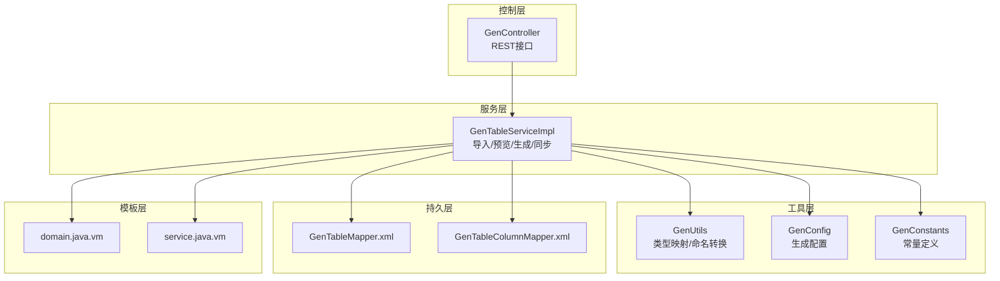
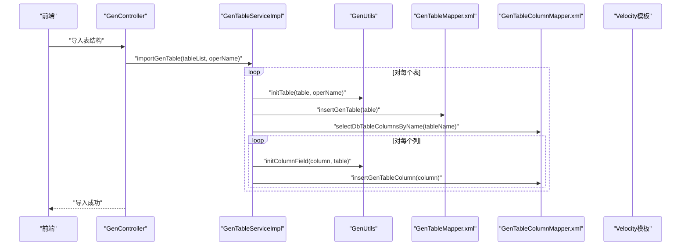
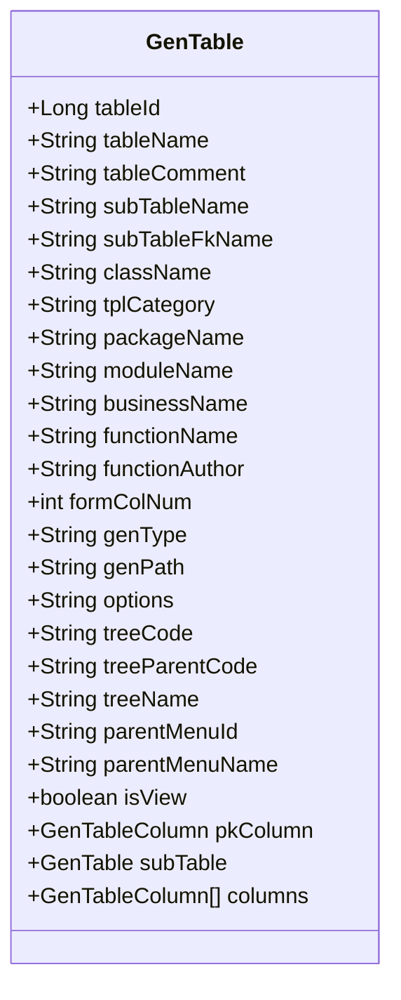
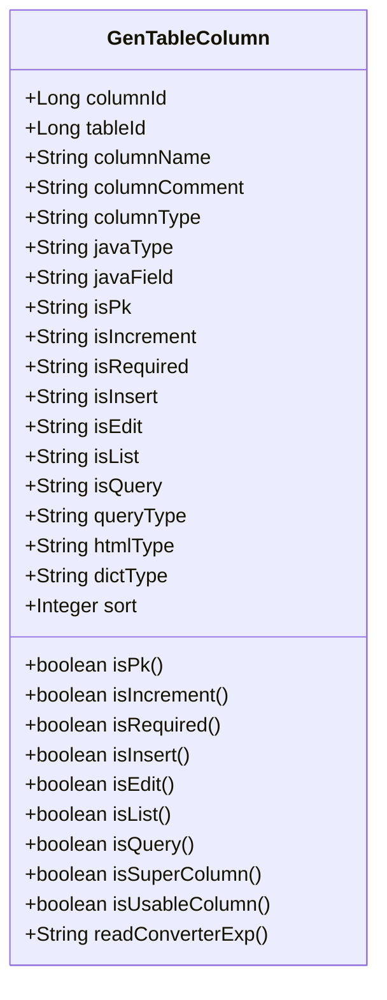
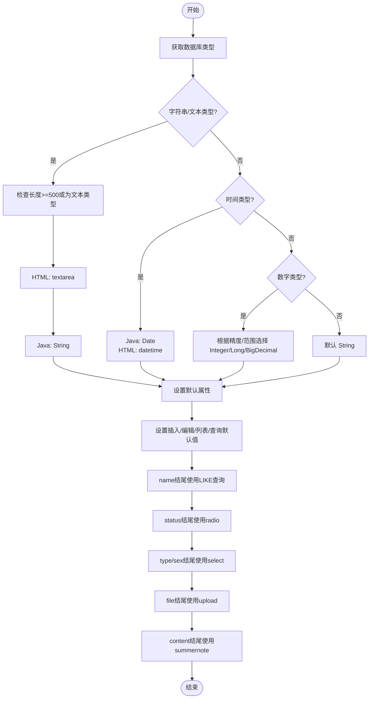
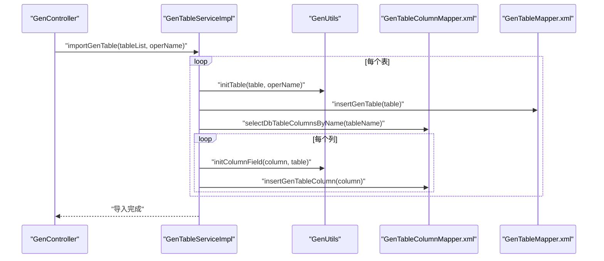
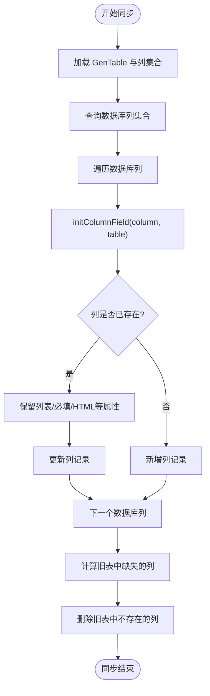
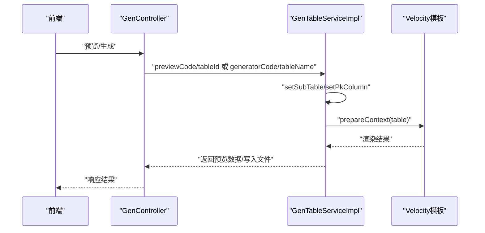
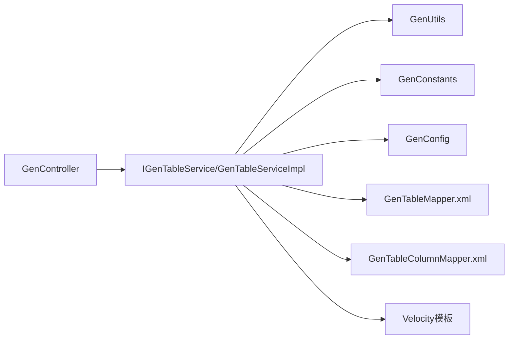

# 数据库表映射

<cite>
**本文引用的文件**
- [GenTable.java](file://ruoyi-generator/src/main/java/com/ruoyi/generator/domain/GenTable.java)
- [GenTableColumn.java](file://ruoyi-generator/src/main/java/com/ruoyi/generator/domain/GenTableColumn.java)
- [GenUtils.java](file://ruoyi-generator/src/main/java/com/ruoyi/generator/util/GenUtils.java)
- [GenController.java](file://ruoyi-generator/src/main/java/com/ruoyi/generator/controller/GenController.java)
- [GenTableServiceImpl.java](file://ruoyi-generator/src/main/java/com/ruoyi/generator/service/impl/GenTableServiceImpl.java)
- [GenConfig.java](file://ruoyi-generator/src/main/java/com/ruoyi/generator/config/GenConfig.java)
- [GenConstants.java](file://ruoyi-common/src/main/java/com/ruoyi/common/constant/GenConstants.java)
- [GenTableMapper.xml](file://ruoyi-generator/src/main/resources/mapper/generator/GenTableMapper.xml)
- [GenTableColumnMapper.xml](file://ruoyi-generator/src/main/resources/mapper/generator/GenTableColumnMapper.xml)
- [generator.yml](file://ruoyi-generator/src/main/resources/generator.yml)
- [domain.java.vm](file://ruoyi-generator/src/main/resources/vm/java/domain.java.vm)
- [service.java.vm](file://ruoyi-generator/src/main/resources/vm/java/service.java.vm)
- [IGenTableService.java](file://ruoyi-generator/src/main/java/com/ruoyi/generator/service/IGenTableService.java)
</cite>

## 目录
1. [简介](#简介)
2. [项目结构](#项目结构)
3. [核心组件](#核心组件)
4. [架构总览](#架构总览)
5. [详细组件分析](#详细组件分析)
6. [依赖关系分析](#依赖关系分析)
7. [性能考量](#性能考量)
8. [故障排查指南](#故障排查指南)
9. [结论](#结论)
10. [附录](#附录)

## 简介
本文件围绕数据库表映射与代码生成体系，系统阐述 GenTable 与 GenTableColumn 两个核心实体类的设计理念与字段语义，详解 GenUtils 工具类对表结构的解析与映射规则（数据库类型到 Java 类型、命名转换、注释提取），并给出表结构导入流程、同步机制的实现原理，以及常见数据库类型支持与兼容性说明。文档同时提供面向开发与非技术读者的渐进式理解路径，并辅以可视化图示帮助把握整体架构与关键流程。

## 项目结构
该能力位于“代码生成器”模块中，采用分层设计：
- 控制层：接收前端请求，协调服务层与模板引擎
- 服务层：封装导入、预览、生成、同步等业务逻辑
- 工具层：提供类型映射、命名转换、上下文准备等通用能力
- 持久层：基于 MyBatis 的 XML 映射，访问 gen_table 与 gen_table_column
- 模板层：Velocity 模板，按模板类别生成不同层级代码

图表来源
- [GenController.java:48-309](file://ruoyi-generator/src/main/java/com/ruoyi/generator/controller/GenController.java#L48-L309)
- [GenTableServiceImpl.java:47-536](file://ruoyi-generator/src/main/java/com/ruoyi/generator/service/impl/GenTableServiceImpl.java#L47-L536)
- [GenUtils.java:16-253](file://ruoyi-generator/src/main/java/com/ruoyi/generator/util/GenUtils.java#L16-L253)
- [GenConfig.java:16-88](file://ruoyi-generator/src/main/java/com/ruoyi/generator/config/GenConfig.java#L16-L88)
- [GenConstants.java:8-118](file://ruoyi-common/src/main/java/com/ruoyi/common/constant/GenConstants.java#L8-L118)
- [GenTableMapper.xml:5-204](file://ruoyi-generator/src/main/resources/mapper/generator/GenTableMapper.xml#L5-L204)
- [GenTableColumnMapper.xml:5-127](file://ruoyi-generator/src/main/resources/mapper/generator/GenTableColumnMapper.xml#L5-L127)
- [domain.java.vm:1-106](file://ruoyi-generator/src/main/resources/vm/java/domain.java.vm#L1-L106)
- [service.java.vm:1-74](file://ruoyi-generator/src/main/resources/vm/java/service.java.vm#L1-L74)

章节来源
- [GenController.java:48-309](file://ruoyi-generator/src/main/java/com/ruoyi/generator/controller/GenController.java#L48-L309)
- [GenTableServiceImpl.java:47-536](file://ruoyi-generator/src/main/java/com/ruoyi/generator/service/impl/GenTableServiceImpl.java#L47-L536)

## 核心组件
- GenTable：业务表元数据与生成配置载体，包含表基本信息、模板类别、包模块业务名、作者、表单布局、生成方式与路径、主键列、子表、列集合、树形/上级菜单等扩展配置。
- GenTableColumn：列级元数据与生成配置载体，包含列名、注释、数据库类型、Java 类型、Java 字段名、主键/自增/必填、增删改查/列表/查询、查询方式、HTML 控件类型、字典类型、排序等。
- GenUtils：表结构解析与默认配置初始化工具，负责数据库类型到 Java 类型映射、命名转换、HTML 控件与查询方式推断、列属性默认值设定等。
- GenConfig：从 generator.yml 读取生成配置，如作者、包名、自动去前缀、表前缀、是否允许覆盖本地生成。
- GenConstants：集中定义模板类别、数据库类型分类、页面控件类型、Java 类型、查询方式、必填标记等常量。

章节来源
- [GenTable.java:16-398](file://ruoyi-generator/src/main/java/com/ruoyi/generator/domain/GenTable.java#L16-L398)
- [GenTableColumn.java:12-373](file://ruoyi-generator/src/main/java/com/ruoyi/generator/domain/GenTableColumn.java#L12-L373)
- [GenUtils.java:16-253](file://ruoyi-generator/src/main/java/com/ruoyi/generator/util/GenUtils.java#L16-L253)
- [GenConfig.java:16-88](file://ruoyi-generator/src/main/java/com/ruoyi/generator/config/GenConfig.java#L16-L88)
- [GenConstants.java:8-118](file://ruoyi-common/src/main/java/com/ruoyi/common/constant/GenConstants.java#L8-L118)

## 架构总览
代码生成器通过控制器发起请求，服务层完成表结构导入、列信息初始化、模板渲染与输出，工具层提供类型映射与命名转换，持久层负责与数据库交互，模板层按模板类别生成目标代码。

图表来源
- [GenController.java:128-140](file://ruoyi-generator/src/main/java/com/ruoyi/generator/controller/GenController.java#L128-L140)
- [GenTableServiceImpl.java:172-199](file://ruoyi-generator/src/main/java/com/ruoyi/generator/service/impl/GenTableServiceImpl.java#L172-L199)
- [GenUtils.java:21-126](file://ruoyi-generator/src/main/java/com/ruoyi/generator/util/GenUtils.java#L21-L126)
- [GenTableMapper.xml:132-166](file://ruoyi-generator/src/main/resources/mapper/generator/GenTableMapper.xml#L132-L166)
- [GenTableColumnMapper.xml:42-46](file://ruoyi-generator/src/main/resources/mapper/generator/GenTableColumnMapper.xml#L42-L46)

## 详细组件分析

### GenTable 实体类设计与字段语义
- 表元数据：tableId、tableName、tableComment、className、tplCategory、packageName、moduleName、businessName、functionName、functionAuthor、formColNum、genType、genPath、remark。
- 关系与扩展：subTableName/subTableFkName（主子表关联）、pkColumn（主键列）、subTable（子表对象）、columns（列集合）、options（JSON化生成参数，含树形字段、上级菜单、详情页开关等）。
- 业务辅助：isView（详情页开关）、isSub/isTree/isCrud（模板类别判断）、isSuperColumn（是否基类字段）。

图表来源
- [GenTable.java:16-398](file://ruoyi-generator/src/main/java/com/ruoyi/generator/domain/GenTable.java#L16-L398)

章节来源
- [GenTable.java:16-398](file://ruoyi-generator/src/main/java/com/ruoyi/generator/domain/GenTable.java#L16-L398)

### GenTableColumn 实体类设计与字段语义
- 列元数据：columnId、tableId、columnName、columnComment、columnType、javaType、javaField。
- 属性标记：isPk、isIncrement、isRequired、isInsert、isEdit、isList、isQuery。
- 显示与查询：queryType（查询方式）、htmlType（HTML控件类型）、dictType（字典类型）、sort（排序）。
- 辅助方法：isPk/isIncrement/isRequired/isInsert/isEdit/isList/isQuery 的布尔判断；isSuperColumn（是否基类字段）；isUsableColumn（可使用列白名单）；readConverterExp（注释转枚举表达式）。

图表来源
- [GenTableColumn.java:12-373](file://ruoyi-generator/src/main/java/com/ruoyi/generator/domain/GenTableColumn.java#L12-L373)

章节来源
- [GenTableColumn.java:12-373](file://ruoyi-generator/src/main/java/com/ruoyi/generator/domain/GenTableColumn.java#L12-L373)

### GenUtils 工具类：表结构解析与映射
- 表初始化：initTable 将表名转换为类名、设置包名/模块名/业务名/功能名/作者、创建人等。
- 列初始化：initColumnField 完成数据库类型到 Java 类型映射、HTML 控件类型推断、查询方式、列属性默认值（插入/编辑/列表/查询）。
- 类型映射规则：
  - 字符串/文本：默认 String，长度≥500或文本类型使用 textarea。
  - 时间类型：Date + datetime 控件。
  - 数字类型：根据精度与范围选择 Integer/Long/BigDecimal；整数≤10位用 Integer，有小数位用 BigDecimal，否则 Long。
- 命名转换策略：
  - convertClassName 支持自动去除表前缀（由配置决定），再进行驼峰转换。
  - getModuleName/getBusinessName 从包名/表名中提取模块与业务名。
  - replaceText 移除“表/若依”等关键字。
- 注释提取机制：readConverterExp 从列注释中提取“键=值”形式的枚举映射，用于 Excel 导出读取转换。

图表来源
- [GenUtils.java:35-126](file://ruoyi-generator/src/main/java/com/ruoyi/generator/util/GenUtils.java#L35-L126)
- [GenConstants.java:37-117](file://ruoyi-common/src/main/java/com/ruoyi/common/constant/GenConstants.java#L37-L117)

章节来源
- [GenUtils.java:16-253](file://ruoyi-generator/src/main/java/com/ruoyi/generator/util/GenUtils.java#L16-L253)
- [GenConstants.java:8-118](file://ruoyi-common/src/main/java/com/ruoyi/common/constant/GenConstants.java#L8-L118)

### 表结构导入流程
- 控制器入口：importTableSave 接收表名数组，调用服务层批量导入。
- 服务层导入：
  - 逐表执行 initTable 设置基础信息。
  - 插入 gen_table 记录。
  - 查询数据库列信息（information_schema.columns），逐列执行 initColumnField 并插入 gen_table_column。
- MyBatis 映射：
  - GenTableMapper.xml 提供 selectDbTableList/selectDbTableListByNames/selectGenTableByName 等查询。
  - GenTableColumnMapper.xml 提供 selectDbTableColumnsByName 等查询与插入更新。

图表来源
- [GenController.java:128-140](file://ruoyi-generator/src/main/java/com/ruoyi/generator/controller/GenController.java#L128-L140)
- [GenTableServiceImpl.java:172-199](file://ruoyi-generator/src/main/java/com/ruoyi/generator/service/impl/GenTableServiceImpl.java#L172-L199)
- [GenTableColumnMapper.xml:42-46](file://ruoyi-generator/src/main/resources/mapper/generator/GenTableColumnMapper.xml#L42-L46)
- [GenTableMapper.xml:132-166](file://ruoyi-generator/src/main/resources/mapper/generator/GenTableMapper.xml#L132-L166)

章节来源
- [GenController.java:128-140](file://ruoyi-generator/src/main/java/com/ruoyi/generator/controller/GenController.java#L128-L140)
- [GenTableServiceImpl.java:172-199](file://ruoyi-generator/src/main/java/com/ruoyi/generator/service/impl/GenTableServiceImpl.java#L172-L199)
- [GenTableColumnMapper.xml:42-46](file://ruoyi-generator/src/main/resources/mapper/generator/GenTableColumnMapper.xml#L42-L46)
- [GenTableMapper.xml:79-100](file://ruoyi-generator/src/main/resources/mapper/generator/GenTableMapper.xml#L79-L100)

### 表结构同步机制
- 触发入口：synchDb(tableName)。
- 核心策略：
  - 读取当前 GenTable 的列集合与数据库列集合。
  - 对数据库列逐条执行 initColumnField 初始化。
  - 若列存在于旧表：保留列表显示的查询方式/字典类型；保留必填/HTML 控件（针对非主键且需要显示的列）。
  - 若列不存在于旧表：新增。
  - 删除旧表中不存在于数据库的列。
- 事务保证：同步过程在事务内执行，确保一致性。

图表来源
- [GenTableServiceImpl.java:297-345](file://ruoyi-generator/src/main/java/com/ruoyi/generator/service/impl/GenTableServiceImpl.java#L297-L345)

章节来源
- [GenTableServiceImpl.java:297-345](file://ruoyi-generator/src/main/java/com/ruoyi/generator/service/impl/GenTableServiceImpl.java#L297-L345)

### 生成与预览流程
- 预览：previewCode(tableId) 读取表与列，设置主子表与主键列，准备 Velocity 上下文，渲染模板并返回内容映射。
- 生成：
  - 下载方式：downloadCode(tableName) 将模板渲染结果打包为 zip。
  - 自定义路径：generatorCode(tableName) 直接写入文件系统（受 allowOverwrite 配置限制）。
- 模板类别：domain.java.vm/service.java.vm 等按模板类别生成对应代码。

图表来源
- [GenController.java:232-282](file://ruoyi-generator/src/main/java/com/ruoyi/generator/controller/GenController.java#L232-L282)
- [GenTableServiceImpl.java:207-290](file://ruoyi-generator/src/main/java/com/ruoyi/generator/service/impl/GenTableServiceImpl.java#L207-L290)
- [domain.java.vm:1-106](file://ruoyi-generator/src/main/resources/vm/java/domain.java.vm#L1-L106)
- [service.java.vm:1-74](file://ruoyi-generator/src/main/resources/vm/java/service.java.vm#L1-L74)

章节来源
- [GenController.java:232-282](file://ruoyi-generator/src/main/java/com/ruoyi/generator/controller/GenController.java#L232-L282)
- [GenTableServiceImpl.java:207-290](file://ruoyi-generator/src/main/java/com/ruoyi/generator/service/impl/GenTableServiceImpl.java#L207-L290)

## 依赖关系分析
- 控制器依赖服务接口与权限注解，服务层依赖工具类、MyBatis 映射与 Velocity 模板。
- 工具类依赖配置与常量，常量集中定义模板类别、数据库类型分类、HTML 控件类型、Java 类型、查询方式与必填标记。
- 持久层通过 XML 映射访问 information_schema 获取数据库元数据，并维护 gen_table 与 gen_table_column。

图表来源
- [GenController.java:48-309](file://ruoyi-generator/src/main/java/com/ruoyi/generator/controller/GenController.java#L48-L309)
- [IGenTableService.java:12-130](file://ruoyi-generator/src/main/java/com/ruoyi/generator/service/IGenTableService.java#L12-L130)
- [GenTableServiceImpl.java:47-536](file://ruoyi-generator/src/main/java/com/ruoyi/generator/service/impl/GenTableServiceImpl.java#L47-L536)
- [GenUtils.java:16-253](file://ruoyi-generator/src/main/java/com/ruoyi/generator/util/GenUtils.java#L16-L253)
- [GenConstants.java:8-118](file://ruoyi-common/src/main/java/com/ruoyi/common/constant/GenConstants.java#L8-L118)
- [GenConfig.java:16-88](file://ruoyi-generator/src/main/java/com/ruoyi/generator/config/GenConfig.java#L16-L88)
- [GenTableMapper.xml:5-204](file://ruoyi-generator/src/main/resources/mapper/generator/GenTableMapper.xml#L5-L204)
- [GenTableColumnMapper.xml:5-127](file://ruoyi-generator/src/main/resources/mapper/generator/GenTableColumnMapper.xml#L5-L127)

章节来源
- [IGenTableService.java:12-130](file://ruoyi-generator/src/main/java/com/ruoyi/generator/service/IGenTableService.java#L12-L130)
- [GenTableServiceImpl.java:47-536](file://ruoyi-generator/src/main/java/com/ruoyi/generator/service/impl/GenTableServiceImpl.java#L47-L536)

## 性能考量
- 批量导入：建议在服务层对表与列的插入使用批处理或合并写入，减少数据库往返。
- 同步策略：仅对变更列进行更新，避免全量覆盖；对缺失列与多余列分别处理，降低写放大。
- 模板渲染：预览阶段可缓存上下文，生成阶段优先内存流输出，减少磁盘 IO。
- 数据库查询：information_schema 查询应配合索引与过滤条件，避免全表扫描。

## 故障排查指南
- 导入失败：检查数据库连接与权限，确认 information_schema 可访问；查看服务层异常抛出与日志。
- 同步异常：确认表结构存在且列名一致；检查 isRequired/HTML 控件等属性保留逻辑是否符合预期。
- 生成失败：确认模板路径与 Velocity 初始化；检查生成路径权限与 allowOverwrite 配置。
- 配置问题：核对 generator.yml 中作者、包名、前缀与覆盖策略；确认 GenConfig 加载成功。

章节来源
- [GenTableServiceImpl.java:195-198](file://ruoyi-generator/src/main/java/com/ruoyi/generator/service/impl/GenTableServiceImpl.java#L195-L198)
- [GenController.java:223-228](file://ruoyi-generator/src/main/java/com/ruoyi/generator/controller/GenController.java#L223-L228)

## 结论
本体系以 GenTable/GenTableColumn 为核心数据模型，结合 GenUtils 的类型映射与命名转换、GenConfig 的配置管理、GenConstants 的统一常量，以及 MyBatis 与 Velocity 的模板渲染，实现了从数据库表到 Java 代码的自动化生成与同步。通过清晰的导入、同步与生成流程，开发者可以高效地维护代码与数据库结构的一致性，并根据模板类别灵活扩展生成内容。

## 附录

### 常见数据库类型支持与兼容性
- 字符串类型：char、varchar、nvarchar、varchar2 → Java String；文本域 textarea。
- 文本类型：tinytext、text、mediumtext、longtext → Java String；文本域 textarea。
- 时间类型：datetime、time、date、timestamp → Java Date；控件 datetime。
- 数字类型：tinyint、smallint、mediumint、int、integer、bit、bigint、float、double、decimal → 根据精度与范围映射为 Integer/Long/BigDecimal。
- 页面控件与查询方式：name 结尾 LIKE、status 结尾 radio、type/sex 结尾 select、file 结尾 upload、content 结尾 summernote。

章节来源
- [GenConstants.java:37-117](file://ruoyi-common/src/main/java/com/ruoyi/common/constant/GenConstants.java#L37-L117)
- [GenUtils.java:47-125](file://ruoyi-generator/src/main/java/com/ruoyi/generator/util/GenUtils.java#L47-L125)

### 生成配置项说明
- author：生成代码作者。
- packageName：生成包路径。
- autoRemovePre：是否自动去除表前缀。
- tablePrefix：表前缀列表（逗号分隔）。
- allowOverwrite：是否允许覆盖本地生成文件。

章节来源
- [generator.yml:4-13](file://ruoyi-generator/src/main/resources/generator.yml#L4-L13)
- [GenConfig.java:18-86](file://ruoyi-generator/src/main/java/com/ruoyi/generator/config/GenConfig.java#L18-L86)