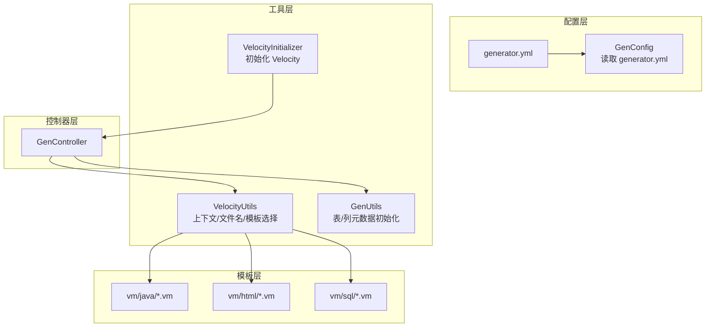
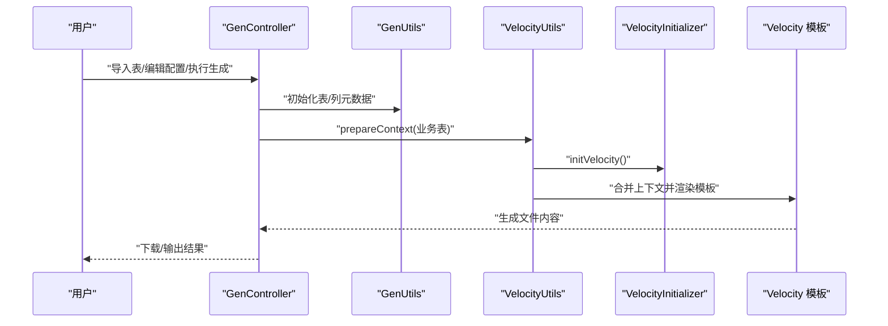
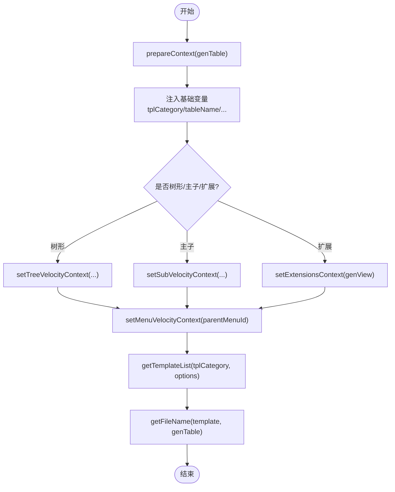
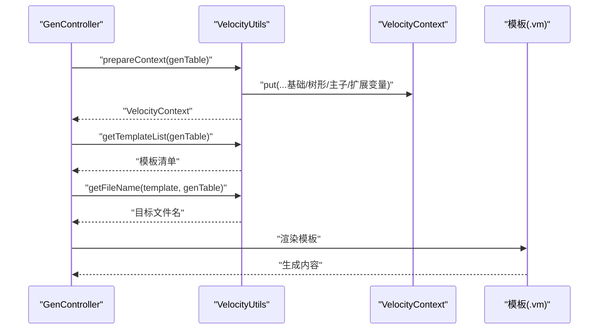
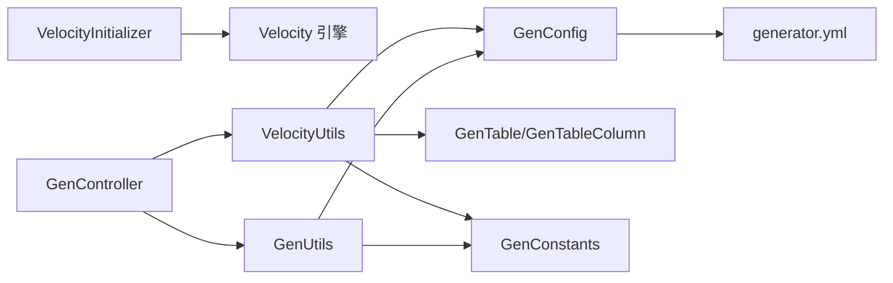

# 模板引擎与配置

<cite>
**本文引用的文件**
- [VelocityInitializer.java](file://ruoyi-generator/src/main/java/com/ruoyi/generator/util/VelocityInitializer.java)
- [VelocityUtils.java](file://ruoyi-generator/src/main/java/com/ruoyi/generator/util/VelocityUtils.java)
- [GenUtils.java](file://ruoyi-generator/src/main/java/com/ruoyi/generator/util/GenUtils.java)
- [GenConfig.java](file://ruoyi-generator/src/main/java/com/ruoyi/generator/config/GenConfig.java)
- [generator.yml](file://ruoyi-generator/src/main/resources/generator.yml)
- [GenTable.java](file://ruoyi-generator/src/main/java/com/ruoyi/generator/domain/GenTable.java)
- [GenConstants.java](file://ruoyi-common/src/main/java/com/ruoyi/common/constant/GenConstants.java)
- [domain.java.vm](file://ruoyi-generator/src/main/resources/vm/java/domain.java.vm)
- [list.html.vm](file://ruoyi-generator/src/main/resources/vm/html/list.html.vm)
- [sql.vm](file://ruoyi-generator/src/main/resources/vm/sql/sql.vm)
- [GenController.java](file://ruoyi-generator/src/main/java/com/ruoyi/generator/controller/GenController.java)
</cite>

## 目录
1. [简介](#简介)
2. [项目结构](#项目结构)
3. [核心组件](#核心组件)
4. [架构总览](#架构总览)
5. [详细组件分析](#详细组件分析)
6. [依赖分析](#依赖分析)
7. [性能考虑](#性能考虑)
8. [故障排查指南](#故障排查指南)
9. [结论](#结论)
10. [附录](#附录)

## 简介
本文件面向模板引擎与配置主题，聚焦于 Apache Velocity 在代码生成中的应用，系统性阐述：
- Velocity 初始化流程与工具类职责
- Velocity 模板语法、变量替换与上下文传递机制
- 配置文件 generator.yml 的各项参数及其作用
- 模板开发最佳实践（条件判断、循环遍历、宏定义等）
- 模板调试技巧与性能优化建议

## 项目结构
与模板引擎及配置直接相关的关键模块如下：
- 配置层：读取 generator.yml 并暴露为 GenConfig
- 生成工具层：GenUtils 负责表/列元数据初始化；VelocityUtils 负责模板上下文准备与文件名解析；VelocityInitializer 负责 Velocity 引擎初始化
- 模板层：vm 目录下按语言/用途分类存放 Velocity 模板
- 控制器层：GenController 提供导入表、编辑生成配置、执行生成等入口

图表来源
- [GenConfig.java:14-15](file://ruoyi-generator/src/main/java/com/ruoyi/generator/config/GenConfig.java#L14-L15)
- [generator.yml:1-13](file://ruoyi-generator/src/main/resources/generator.yml#L1-L13)
- [VelocityInitializer.java:17-27](file://ruoyi-generator/src/main/java/com/ruoyi/generator/util/VelocityInitializer.java#L17-L27)
- [VelocityUtils.java:34-72](file://ruoyi-generator/src/main/java/com/ruoyi/generator/util/VelocityUtils.java#L34-L72)
- [GenUtils.java:21-30](file://ruoyi-generator/src/main/java/com/ruoyi/generator/util/GenUtils.java#L21-L30)
- [GenController.java:108-140](file://ruoyi-generator/src/main/java/com/ruoyi/generator/controller/GenController.java#L108-L140)

章节来源
- [GenConfig.java:14-87](file://ruoyi-generator/src/main/java/com/ruoyi/generator/config/GenConfig.java#L14-L87)
- [generator.yml:1-13](file://ruoyi-generator/src/main/resources/generator.yml#L1-L13)

## 核心组件
- VelocityInitializer：负责加载 ClasspathResourceLoader、设置输入编码并初始化 Velocity 引擎
- VelocityUtils：构建 VelocityContext，注入模板所需变量（如表信息、列集合、权限前缀、树形/子表扩展等），并根据模板类型返回模板清单与目标文件名
- GenUtils：对 GenTable/GenTableColumn 进行元数据初始化（类名、模块名、业务名、HTML 类型、查询类型等）
- GenConfig：从 generator.yml 读取作者、包路径、表前缀、是否允许覆盖等全局配置
- GenTable：承载业务表元数据与生成选项（模板类别、树形字段、菜单上级等）

章节来源
- [VelocityInitializer.java:17-33](file://ruoyi-generator/src/main/java/com/ruoyi/generator/util/VelocityInitializer.java#L17-L33)
- [VelocityUtils.java:34-168](file://ruoyi-generator/src/main/java/com/ruoyi/generator/util/VelocityUtils.java#L34-L168)
- [GenUtils.java:21-126](file://ruoyi-generator/src/main/java/com/ruoyi/generator/util/GenUtils.java#L21-L126)
- [GenConfig.java:18-86](file://ruoyi-generator/src/main/java/com/ruoyi/generator/config/GenConfig.java#L18-L86)
- [GenTable.java:16-398](file://ruoyi-generator/src/main/java/com/ruoyi/generator/domain/GenTable.java#L16-L398)

## 架构总览
以下序列图展示从控制器触发到模板渲染与文件生成的整体流程。

图表来源
- [GenController.java:108-140](file://ruoyi-generator/src/main/java/com/ruoyi/generator/controller/GenController.java#L108-L140)
- [GenUtils.java:21-126](file://ruoyi-generator/src/main/java/com/ruoyi/generator/util/GenUtils.java#L21-L126)
- [VelocityUtils.java:34-72](file://ruoyi-generator/src/main/java/com/ruoyi/generator/util/VelocityUtils.java#L34-L72)
- [VelocityInitializer.java:17-27](file://ruoyi-generator/src/main/java/com/ruoyi/generator/util/VelocityInitializer.java#L17-L27)

## 详细组件分析

### Velocity 初始化流程（VelocityInitializer）
- 功能要点
  - 使用 ClasspathResourceLoader 加载模板
  - 设置输入编码为 UTF-8
  - 调用 Velocity.init 完成引擎初始化
- 注意事项
  - 若初始化失败会抛出运行时异常，需检查模板路径与编码配置

章节来源
- [VelocityInitializer.java:17-33](file://ruoyi-generator/src/main/java/com/ruoyi/generator/util/VelocityInitializer.java#L17-L33)

### Velocity 上下文与模板选择（VelocityUtils）
- 上下文准备（prepareContext）
  - 注入模板类别、表名、功能名、类名、模块名、业务名、包路径、作者、日期、主键列、导入列表、权限前缀、列集合、表对象
  - 条件注入：树形模板注入树编码/父编码/树名/展开列；主子模板注入子表信息；扩展注入是否生成详情页
- 模板选择（getTemplateList）
  - 根据模板类别（crud/tree/sub）与扩展选项（genView）决定模板清单
- 文件名解析（getFileName）
  - 根据模板类型与业务表信息拼接 Java/MyBatis/HTML/SQL 输出路径与文件名
- 辅助方法
  - getImportList：按列类型动态注入导入包
  - getPermissionPrefix：生成权限前缀
  - 树形/菜单上下文：解析 parentMenuId、treeCode、treeParentCode、treeName、genView 等

图表来源
- [VelocityUtils.java:34-168](file://ruoyi-generator/src/main/java/com/ruoyi/generator/util/VelocityUtils.java#L34-L168)
- [VelocityUtils.java:173-247](file://ruoyi-generator/src/main/java/com/ruoyi/generator/util/VelocityUtils.java#L173-L247)

章节来源
- [VelocityUtils.java:34-168](file://ruoyi-generator/src/main/java/com/ruoyi/generator/util/VelocityUtils.java#L34-L168)
- [VelocityUtils.java:173-247](file://ruoyi-generator/src/main/java/com/ruoyi/generator/util/VelocityUtils.java#L173-L247)

### 代码生成工具（GenUtils）
- 初始化表信息：类名、模块名、业务名、功能名、作者、创建人
- 初始化列字段：根据数据库类型推断 Java 类型、HTML 控件类型、查询类型、是否插入/编辑/列表/查询
- 名称转换：自动去除表前缀、驼峰命名、模块/业务名提取、关键字替换

章节来源
- [GenUtils.java:21-126](file://ruoyi-generator/src/main/java/com/ruoyi/generator/util/GenUtils.java#L21-L126)

### 配置中心（GenConfig 与 generator.yml）
- 配置项
  - author：作者
  - packageName：默认生成包路径
  - autoRemovePre：是否自动去除表前缀
  - tablePrefix：表前缀列表（逗号分隔）
  - allowOverwrite：是否允许覆盖本地已存在文件
- 读取机制
  - 通过 @ConfigurationProperties(prefix = "gen") 与 @PropertySource 加载 generator.yml

章节来源
- [GenConfig.java:18-86](file://ruoyi-generator/src/main/java/com/ruoyi/generator/config/GenConfig.java#L18-L86)
- [generator.yml:4-13](file://ruoyi-generator/src/main/resources/generator.yml#L4-L13)

### 模板开发最佳实践
- 条件判断
  - 使用 #if/#elseif/#else/#end 控制菜单/按钮/列显示
  - 示例：列表页根据列的 query/list/htmlType/dictType 渲染不同控件
- 循环遍历
  - 使用 #foreach 遍历 columns、importList、subclassNameList 等集合
- 宏与变量
  - 使用 #set 定义临时变量（如 AttrName、parentheseIndex、comment）
  - 使用 $table.isSuperColumn 判断是否继承基类字段
- 权限与国际化
  - 使用 $permissionPrefix 生成权限标识
  - 使用 $datetime 输出当前日期
- 模板选择
  - 根据模板类别（crud/tree/sub）与扩展选项（genView）动态选择模板

章节来源
- [domain.java.vm:30-76](file://ruoyi-generator/src/main/resources/vm/java/domain.java.vm#L30-L76)
- [list.html.vm:13-58](file://ruoyi-generator/src/main/resources/vm/html/list.html.vm#L13-L58)
- [list.html.vm:112-141](file://ruoyi-generator/src/main/resources/vm/html/list.html.vm#L112-L141)
- [sql.vm:1-23](file://ruoyi-generator/src/main/resources/vm/sql/sql.vm#L1-L23)

### 模板语法与变量替换机制
- 变量访问
  - $tableName、$functionName、$ClassName、$className、$moduleName、$businessName、$packageName、$author、$datetime、$pkColumn、$importList、$permissionPrefix、$columns、$table
  - 树形/主子/扩展上下文：$treeCode、$treeParentCode、$treeName、$expandColumn、$subTable、$subTableName、$subTableFkName、$subClassName、$genView 等
- 控制结构
  - #if/#elseif/#else/#end：条件渲染
  - #foreach：遍历集合
  - #set：局部变量赋值
- 字段与注解
  - Excel 注解、JsonFormat 注解、枚举字典渲染、日期格式化等

章节来源
- [domain.java.vm:1-106](file://ruoyi-generator/src/main/resources/vm/java/domain.java.vm#L1-L106)
- [list.html.vm:1-160](file://ruoyi-generator/src/main/resources/vm/html/list.html.vm#L1-L160)
- [sql.vm:1-23](file://ruoyi-generator/src/main/resources/vm/sql/sql.vm#L1-L23)

### 上下文传递与模板选择流程

图表来源
- [VelocityUtils.java:34-168](file://ruoyi-generator/src/main/java/com/ruoyi/generator/util/VelocityUtils.java#L34-L168)
- [VelocityUtils.java:173-247](file://ruoyi-generator/src/main/java/com/ruoyi/generator/util/VelocityUtils.java#L173-L247)
- [GenController.java:108-140](file://ruoyi-generator/src/main/java/com/ruoyi/generator/controller/GenController.java#L108-L140)

## 依赖分析
- VelocityInitializer 依赖 Velocity 引擎与常量 UTF-8
- VelocityUtils 依赖 GenConstants、GenTable、GenTableColumn、GenConfig、StringUtils、DateUtils、JSONObject
- GenUtils 依赖 GenConstants、GenConfig、StringUtils、RegExUtils
- GenConfig 依赖 Spring 配置绑定与 generator.yml
- GenController 依赖服务层接口与工具类，作为生成流程入口

图表来源
- [VelocityInitializer.java:17-33](file://ruoyi-generator/src/main/java/com/ruoyi/generator/util/VelocityInitializer.java#L17-L33)
- [VelocityUtils.java:1-14](file://ruoyi-generator/src/main/java/com/ruoyi/generator/util/VelocityUtils.java#L1-L14)
- [GenUtils.java:1-10](file://ruoyi-generator/src/main/java/com/ruoyi/generator/util/GenUtils.java#L1-L10)
- [GenConfig.java:14-15](file://ruoyi-generator/src/main/java/com/ruoyi/generator/config/GenConfig.java#L14-L15)
- [GenController.java:108-140](file://ruoyi-generator/src/main/java/com/ruoyi/generator/controller/GenController.java#L108-L140)

章节来源
- [VelocityUtils.java:1-14](file://ruoyi-generator/src/main/java/com/ruoyi/generator/util/VelocityUtils.java#L1-L14)
- [GenUtils.java:1-10](file://ruoyi-generator/src/main/java/com/ruoyi/generator/util/GenUtils.java#L1-L10)
- [GenConfig.java:14-15](file://ruoyi-generator/src/main/java/com/ruoyi/generator/config/GenConfig.java#L14-L15)

## 性能考虑
- 模板数量控制：仅在需要时添加模板，避免冗余渲染
- 上下文精简：仅注入必要变量，减少 VelocityContext 规模
- 模板复用：通过合理拆分模板与条件判断，降低重复逻辑
- I/O 优化：批量生成时尽量减少磁盘写入次数，统一输出目录
- 编码一致性：确保模板与输出编码一致，避免转码开销

## 故障排查指南
- 模板无法加载
  - 检查 VelocityInitializer 中 resource.loader 配置与 Classpath 路径
  - 确认模板位于 classpath 下的 vm 目录
- 变量缺失或为空
  - 核对 VelocityUtils.prepareContext 是否正确注入变量
  - 检查 GenTable/GenTableColumn 元数据是否完整（GenUtils.initTable/initColumnField）
- 权限前缀错误
  - 确认模块名与业务名拼接规则与实际使用一致
- 菜单/按钮未显示
  - 检查扩展选项 genView 与树形/主子模板的上下文注入
- SQL 菜单生成异常
  - 核对 parentMenuId 与权限前缀是否正确

章节来源
- [VelocityInitializer.java:17-33](file://ruoyi-generator/src/main/java/com/ruoyi/generator/util/VelocityInitializer.java#L17-L33)
- [VelocityUtils.java:34-127](file://ruoyi-generator/src/main/java/com/ruoyi/generator/util/VelocityUtils.java#L34-L127)
- [GenUtils.java:21-126](file://ruoyi-generator/src/main/java/com/ruoyi/generator/util/GenUtils.java#L21-L126)

## 结论
本项目以 Velocity 为核心模板引擎，结合配置中心与工具类，实现了灵活可扩展的代码生成体系。通过清晰的上下文传递、模板选择与文件名解析，能够高效生成 Java/MyBatis/HTML/SQL 等多类型产物。遵循本文的最佳实践与排错建议，可显著提升模板开发效率与稳定性。

## 附录

### 配置文件 generator.yml 参数说明
- author：作者
- packageName：默认生成包路径
- autoRemovePre：是否自动去除表前缀
- tablePrefix：表前缀列表（逗号分隔）
- allowOverwrite：是否允许覆盖本地已存在文件

章节来源
- [generator.yml:4-13](file://ruoyi-generator/src/main/resources/generator.yml#L4-L13)

### 模板类别与生成范围对照
- crud：单表增删改查
- tree：树表结构
- sub：主子表结构

章节来源
- [GenConstants.java:10-17](file://ruoyi-common/src/main/java/com/ruoyi/common/constant/GenConstants.java#L10-L17)
- [VelocityUtils.java:134-168](file://ruoyi-generator/src/main/java/com/ruoyi/generator/util/VelocityUtils.java#L134-L168)