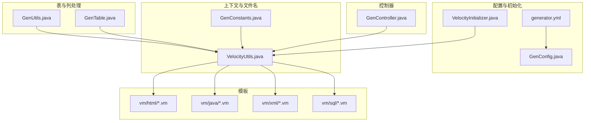
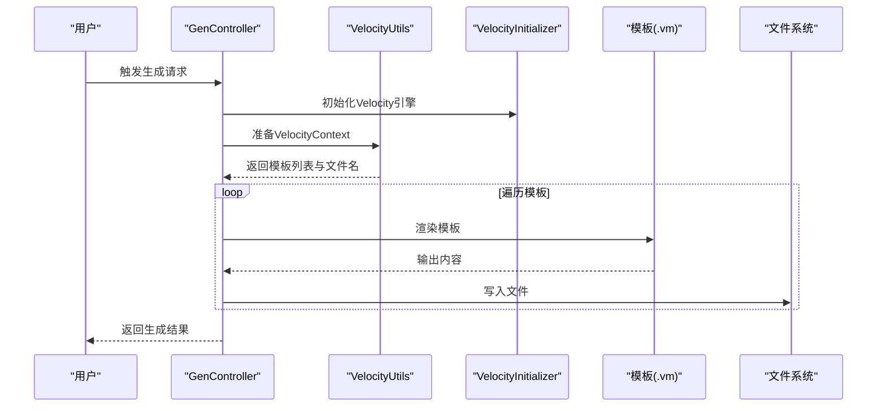
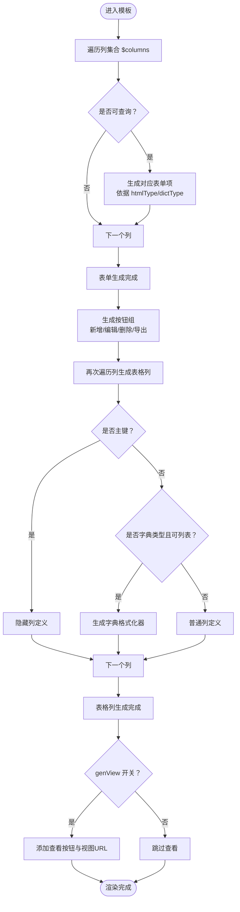
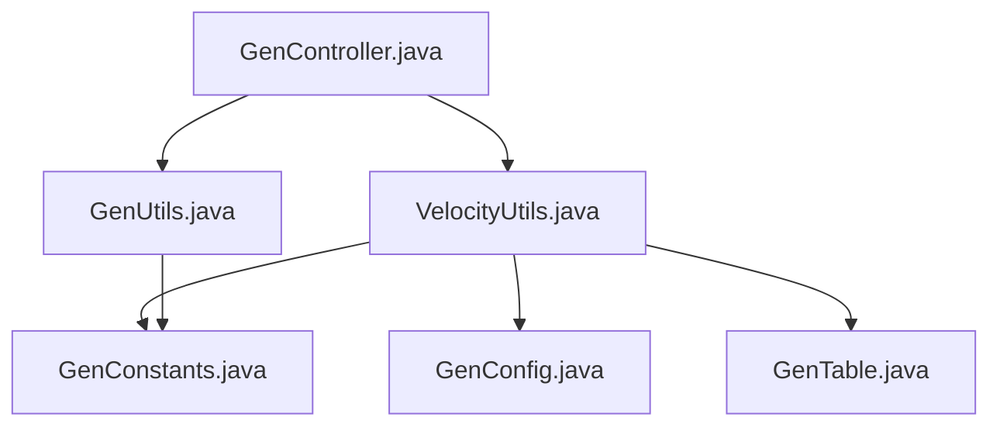

# 自定义模板开发

<cite>
**本文档引用的文件**
- [generator.yml](file://ruoyi-generator/src/main/resources/generator.yml)
- [GenConfig.java](file://ruoyi-generator/src/main/java/com/ruoyi/generator/config/GenConfig.java)
- [VelocityInitializer.java](file://ruoyi-generator/src/main/java/com/ruoyi/generator/util/VelocityInitializer.java)
- [VelocityUtils.java](file://ruoyi-generator/src/main/java/com/ruoyi/generator/util/VelocityUtils.java)
- [GenUtils.java](file://ruoyi-generator/src/main/java/com/ruoyi/generator/util/GenUtils.java)
- [GenConstants.java](file://ruoyi-common/src/main/java/com/ruoyi/common/constant/GenConstants.java)
- [GenController.java](file://ruoyi-generator/src/main/java/com/ruoyi/generator/controller/GenController.java)
- [GenTable.java](file://ruoyi-generator/src/main/java/com/ruoyi/generator/domain/GenTable.java)
- [list.html.vm](file://ruoyi-generator/src/main/resources/vm/html/list.html.vm)
- [domain.java.vm](file://ruoyi-generator/src/main/resources/vm/java/domain.java.vm)
- [mapper.xml.vm](file://ruoyi-generator/src/main/resources/vm/xml/mapper.xml.vm)
- [sql.vm](file://ruoyi-generator/src/main/resources/vm/sql/sql.vm)
- [controller.java.vm](file://ruoyi-generator/src/main/resources/vm/java/controller.java.vm)
- [service.java.vm](file://ruoyi-generator/src/main/resources/vm/java/service.java.vm)
- [mapper.java.vm](file://ruoyi-generator/src/main/resources/vm/java/mapper.java.vm)
- [serviceImpl.java.vm](file://ruoyi-generator/src/main/resources/vm/java/serviceImpl.java.vm)
</cite>

## 目录
1. [简介](#简介)
2. [项目结构](#项目结构)
3. [核心组件](#核心组件)
4. [架构总览](#架构总览)
5. [详细组件分析](#详细组件分析)
6. [依赖分析](#依赖分析)
7. [性能考虑](#性能考虑)
8. [故障排查指南](#故障排查指南)
9. [结论](#结论)
10. [附录](#附录)

## 简介
本指南面向希望基于现有代码生成体系进行“自定义模板开发”的工程师与架构师。文档围绕以下目标展开：
- 解释现有模板结构与命名规范：HTML 页面模板、Java 实体模板、SQL 脚本模板、MyBatis 映射模板的组织方式与生成规则。
- 深入说明 Velocity 模板语法在代码生成中的应用：变量引用、条件判断、循环控制、内置工具的使用方法。
- 提供模板开发最佳实践：模板复用、宏定义、样式统一、国际化支持。
- 给出模板调试技巧：上下文变量检查、渲染结果验证、错误定位方法。
- 讨论模板版本管理与升级策略，以及第三方模板集成的注意事项。

## 项目结构
代码生成模块位于 ruoyi-generator 中，采用“Velocity 模板 + Java 工具类 + 配置文件”的组合：
- 配置层：generator.yml + GenConfig.java，负责读取生成参数（作者、包路径、表前缀、是否允许覆盖等）。
- 初始化层：VelocityInitializer.java，负责初始化 Velocity 引擎，加载模板资源。
- 上下文与文件名解析：VelocityUtils.java，负责准备 VelocityContext、选择模板、计算输出文件名。
- 表与列信息处理：GenUtils.java，负责表名/业务名转换、列类型推断、HTML 控件类型映射等。
- 常量与模板类别：GenConstants.java，定义模板类别（crud/tree/sub）、查询类型、HTML 控件类型、Java 类型映射等。
- 控制器入口：GenController.java，提供导入表、编辑生成配置、生成代码等接口。
- 模板文件：vm/ 目录下按类型划分，包含 html/java/xml/sql 四类模板。

图表来源
- [GenConfig.java:1-88](file://ruoyi-generator/src/main/java/com/ruoyi/generator/config/GenConfig.java#L1-L88)
- [generator.yml:1-13](file://ruoyi-generator/src/main/resources/generator.yml#L1-L13)
- [VelocityInitializer.java:1-35](file://ruoyi-generator/src/main/java/com/ruoyi/generator/util/VelocityInitializer.java#L1-L35)
- [VelocityUtils.java:1-457](file://ruoyi-generator/src/main/java/com/ruoyi/generator/util/VelocityUtils.java#L1-L457)
- [GenUtils.java:1-253](file://ruoyi-generator/src/main/java/com/ruoyi/generator/util/GenUtils.java#L1-L253)
- [GenConstants.java:1-118](file://ruoyi-common/src/main/java/com/ruoyi/common/constant/GenConstants.java#L1-L118)
- [GenController.java:1-309](file://ruoyi-generator/src/main/java/com/ruoyi/generator/controller/GenController.java#L1-L309)
- [GenTable.java:1-398](file://ruoyi-generator/src/main/java/com/ruoyi/generator/domain/GenTable.java#L1-L398)

章节来源
- [generator.yml:1-13](file://ruoyi-generator/src/main/resources/generator.yml#L1-L13)
- [GenConfig.java:1-88](file://ruoyi-generator/src/main/java/com/ruoyi/generator/config/GenConfig.java#L1-L88)
- [VelocityInitializer.java:1-35](file://ruoyi-generator/src/main/java/com/ruoyi/generator/util/VelocityInitializer.java#L1-L35)
- [VelocityUtils.java:1-457](file://ruoyi-generator/src/main/java/com/ruoyi/generator/util/VelocityUtils.java#L1-L457)
- [GenUtils.java:1-253](file://ruoyi-generator/src/main/java/com/ruoyi/generator/util/GenUtils.java#L1-L253)
- [GenConstants.java:1-118](file://ruoyi-common/src/main/java/com/ruoyi/common/constant/GenConstants.java#L1-L118)
- [GenController.java:1-309](file://ruoyi-generator/src/main/java/com/ruoyi/generator/controller/GenController.java#L1-L309)
- [GenTable.java:1-398](file://ruoyi-generator/src/main/java/com/ruoyi/generator/domain/GenTable.java#L1-L398)

## 核心组件
- 配置与参数
  - generator.yml：定义作者、默认包路径、自动去除表前缀、表前缀、是否允许覆盖等。
  - GenConfig.java：将 yml 参数注入静态字段，供全局使用。
- Velocity 引擎初始化
  - VelocityInitializer.java：设置资源加载器与字符集，初始化引擎。
- 上下文构建与模板选择
  - VelocityUtils.prepareContext：填充 VelocityContext，包含表元信息、列集合、树/子表扩展上下文、菜单上下文等。
  - VelocityUtils.getTemplateList：根据模板类别（crud/tree/sub）与扩展选项（如 genView）决定生成哪些模板。
  - VelocityUtils.getFileName：根据模板类型与表信息计算输出文件路径与文件名。
- 表与列信息处理
  - GenUtils：表名转类名、业务名提取、列类型推断、HTML 控件类型映射、默认字段要求标记等。
- 常量与模板类别
  - GenConstants：模板类别常量、查询类型、HTML 控件类型、Java 类型映射、字段白名单等。
- 控制器入口
  - GenController：提供导入表、编辑生成配置、生成代码等接口，调用服务层完成生成。

章节来源
- [generator.yml:1-13](file://ruoyi-generator/src/main/resources/generator.yml#L1-L13)
- [GenConfig.java:1-88](file://ruoyi-generator/src/main/java/com/ruoyi/generator/config/GenConfig.java#L1-L88)
- [VelocityInitializer.java:1-35](file://ruoyi-generator/src/main/java/com/ruoyi/generator/util/VelocityInitializer.java#L1-L35)
- [VelocityUtils.java:34-168](file://ruoyi-generator/src/main/java/com/ruoyi/generator/util/VelocityUtils.java#L34-L168)
- [GenUtils.java:21-253](file://ruoyi-generator/src/main/java/com/ruoyi/generator/util/GenUtils.java#L21-L253)
- [GenConstants.java:8-118](file://ruoyi-common/src/main/java/com/ruoyi/common/constant/GenConstants.java#L8-L118)
- [GenController.java:48-200](file://ruoyi-generator/src/main/java/com/ruoyi/generator/controller/GenController.java#L48-L200)

## 架构总览
代码生成从控制器入口触发，经由上下文构建与模板选择，最终通过 Velocity 渲染生成文件。整体流程如下：

图表来源
- [GenController.java:48-200](file://ruoyi-generator/src/main/java/com/ruoyi/generator/controller/GenController.java#L48-L200)
- [VelocityInitializer.java:17-33](file://ruoyi-generator/src/main/java/com/ruoyi/generator/util/VelocityInitializer.java#L17-L33)
- [VelocityUtils.java:34-247](file://ruoyi-generator/src/main/java/com/ruoyi/generator/util/VelocityUtils.java#L34-L247)

## 详细组件分析

### Velocity 模板语法与上下文变量
- 变量引用
  - 使用 $variable 形式访问上下文变量，如 $className、$packageName、$columns、$permissionPrefix、$treeCode 等。
- 条件判断
  - 使用 #if(...) ... #end 进行条件分支；例如根据列是否可查询、是否为主键、是否为树表字段等进行不同渲染。
- 循环控制
  - 使用 #foreach($item in $list) ... #end 遍历列集合或子表集合；在 Java/SQL/XML 模板中广泛出现。
- 内置工具
  - 字符串工具：toCamelCase、substring、format 等；用于字段名转换、路径拼接、权限前缀生成等。
  - JSON 工具：JSONObject.parseObject(options) 将扩展参数解析为对象后读取键值。
  - 逻辑工具：空值判断、布尔判断、数组包含判断等。

章节来源
- [VelocityUtils.java:42-127](file://ruoyi-generator/src/main/java/com/ruoyi/generator/util/VelocityUtils.java#L42-L127)
- [GenUtils.java:172-214](file://ruoyi-generator/src/main/java/com/ruoyi/generator/util/GenUtils.java#L172-L214)
- [GenConstants.java:37-117](file://ruoyi-common/src/main/java/com/ruoyi/common/constant/GenConstants.java#L37-L117)

### HTML 页面模板（列表页）
- 模板位置：vm/html/list.html.vm
- 功能要点
  - 动态生成查询表单：遍历 $columns，依据列的 htmlType 与 dictType 生成输入框、下拉框、日期控件等。
  - 动态生成表格列：遍历 $columns，依据列的 pk 与 list 属性生成列定义，并对字典类型列生成格式化器。
  - 权限控制：使用 $permissionPrefix 生成按钮权限标识。
  - 详情页开关：当扩展参数 genView 为真时，启用查看按钮与视图 URL。
- Velocity 语法示例
  - 条件判断：#if($column.query) ... #end
  - 字典类型：#if(($column.htmlType == "select" || ...) && "" != $dictType) ... #end
  - 循环：#foreach($column in $columns) ... #end

图表来源
- [list.html.vm:13-160](file://ruoyi-generator/src/main/resources/vm/html/list.html.vm#L13-L160)
- [VelocityUtils.java:74-127](file://ruoyi-generator/src/main/java/com/ruoyi/generator/util/VelocityUtils.java#L74-L127)

章节来源
- [list.html.vm:1-160](file://ruoyi-generator/src/main/resources/vm/html/list.html.vm#L1-L160)
- [VelocityUtils.java:74-127](file://ruoyi-generator/src/main/java/com/ruoyi/generator/util/VelocityUtils.java#L74-L127)

### Java 实体模板（Domain）
- 模板位置：vm/java/domain.java.vm
- 功能要点
  - 根据表类别（crud/tree/sub）选择继承基类（BaseEntity/TreeEntity）。
  - 遍历 $columns 生成字段、注解（Excel、JsonFormat 等）与 getter/setter。
  - 支持子表集合字段与 getter/setter。
  - 对字段名进行驼峰与首字母大写处理，保证 Java 命名规范。
- Velocity 语法示例
  - 条件：#if($table.crud || $table.sub) ... #elseif($table.tree) ... #end
  - 循环：#foreach ($column in $columns) ... #end
  - 字符串处理：#set($AttrName=...)、#if($parentheseIndex != -1) ... #end

章节来源
- [domain.java.vm:1-106](file://ruoyi-generator/src/main/resources/vm/java/domain.java.vm#L1-L106)
- [VelocityUtils.java:21-26](file://ruoyi-generator/src/main/java/com/ruoyi/generator/util/VelocityUtils.java#L21-L26)

### MyBatis 映射模板（Mapper XML）
- 模板位置：vm/xml/mapper.xml.vm
- 功能要点
  - 生成 resultMap、通用查询片段、条件查询 where 片段。
  - 支持多条件查询类型（EQ/NE/GT/GTE/LT/LTE/LIKE/BETWEEN）。
  - 支持树表与主子表场景的特殊查询与集合映射。
  - 支持批量插入子表数据。
- Velocity 语法示例
  - 条件：#if($table.tree) ... #elseif($table.sub) ... #end
  - 循环：#foreach($column in $columns) ... #end
  - 查询类型：#if($column.queryType == "EQ") ... #elseif($column.queryType == "LIKE") ... #end

章节来源
- [mapper.xml.vm:1-152](file://ruoyi-generator/src/main/resources/vm/xml/mapper.xml.vm#L1-L152)
- [GenConstants.java:109-116](file://ruoyi-common/src/main/java/com/ruoyi/common/constant/GenConstants.java#L109-L116)

### SQL 脚本模板（菜单与按钮）
- 模板位置：vm/sql/sql.vm
- 功能要点
  - 生成菜单与按钮的 SQL 脚本，包含权限标识、图标、排序等。
  - 使用 $permissionPrefix 与 $parentMenuId 动态生成。
- Velocity 语法示例
  - 变量引用：${functionName}、${permissionPrefix}、${parentMenuId}

章节来源
- [sql.vm:1-23](file://ruoyi-generator/src/main/resources/vm/sql/sql.vm#L1-L23)
- [VelocityUtils.java:81-87](file://ruoyi-generator/src/main/java/com/ruoyi/generator/util/VelocityUtils.java#L81-L87)

### Java 控制器模板（Controller）
- 模板位置：vm/java/controller.java.vm
- 功能要点
  - 生成控制器类，包含列表查询、导出、新增、编辑、删除等方法。
  - 根据模板类别（crud/tree/sub）生成不同的方法签名与返回类型。
  - 支持详情页开关 genView，生成查看接口。
- Velocity 语法示例
  - 条件：#if($table.crud || $table.sub) ... #elseif($table.tree) ... #end
  - 方法名：${businessName}、${className}、${pkColumn.javaField}

章节来源
- [controller.java.vm:1-218](file://ruoyi-generator/src/main/resources/vm/java/controller.java.vm#L1-L218)
- [VelocityUtils.java:111-127](file://ruoyi-generator/src/main/java/com/ruoyi/generator/util/VelocityUtils.java#L111-L127)

### Java 服务接口与实现模板（Service/ServiceImpl）
- 模板位置：vm/java/service.java.vm、vm/java/serviceImpl.java.vm
- 功能要点
  - 生成服务接口与实现类，包含 CRUD 与树表/主子表特有方法。
  - 实现类中处理时间字段赋值、事务注解、批量插入子表等。
- Velocity 语法示例
  - 条件：#if($table.tree) ... #end、#if($table.sub) ... #end
  - 循环：#foreach ($column in $columns) ... #end

章节来源
- [service.java.vm:1-74](file://ruoyi-generator/src/main/resources/vm/java/service.java.vm#L1-L74)
- [serviceImpl.java.vm:1-214](file://ruoyi-generator/src/main/resources/vm/java/serviceImpl.java.vm#L1-L214)

### Java Mapper 接口模板（Mapper）
- 模板位置：vm/java/mapper.java.vm
- 功能要点
  - 生成 Mapper 接口，包含 CRUD 与树表/主子表特有方法。
- Velocity 语法示例
  - 条件：#if($table.sub) ... #end

章节来源
- [mapper.java.vm:1-92](file://ruoyi-generator/src/main/resources/vm/java/mapper.java.vm#L1-L92)

### 模板命名规范与组织方式
- HTML 模板
  - 路径：vm/html/
  - 常见模板：list.html.vm、tree.html.vm、add.html.vm、edit.html.vm、view.html.vm
  - 输出路径：main/resources/templates/{moduleName}/{businessName}/
- Java 模板
  - 路径：vm/java/
  - 常见模板：domain.java.vm、controller.java.vm、mapper.java.vm、service.java.vm、serviceImpl.java.vm、sub-domain.java.vm
  - 输出路径：main/java/{packageName}/domain|controller|mapper|service|service/impl|...
- XML 模板
  - 路径：vm/xml/
  - 常见模板：mapper.xml.vm
  - 输出路径：main/resources/mapper/{moduleName}/{ClassName}Mapper.xml
- SQL 模板
  - 路径：vm/sql/
  - 常见模板：sql.vm
  - 输出文件：{businessName}Menu.sql

章节来源
- [VelocityUtils.java:173-247](file://ruoyi-generator/src/main/java/com/ruoyi/generator/util/VelocityUtils.java#L173-L247)

### 模板开发最佳实践
- 模板复用
  - 将公共片段抽取为独立 vm 文件并在主模板中 include，减少重复代码。
- 宏定义
  - 在 Velocity 中通过 #macro 定义常用片段（如列定义、按钮组），提升一致性与可维护性。
- 样式统一
  - 使用统一的 CSS 类名与布局网格（col-xs-*、col-sm-*），确保生成页面风格一致。
- 国际化支持
  - 在模板中使用字典类型与国际化工具，结合后端字典服务实现标签本地化。

[本节为通用指导，无需列出具体文件来源]

### 模板调试技巧
- 上下文变量检查
  - 在模板中使用 #set 临时赋值并输出，或在 VelocityUtils 中打印上下文键值，确认变量存在与取值正确。
- 渲染结果验证
  - 生成少量测试表，对比生成文件与预期差异，逐步定位问题。
- 错误定位方法
  - 关注模板语法错误（括号不匹配、未闭合的 #end）、变量不存在、循环索引越界等问题。
  - 结合日志与异常堆栈，定位具体模板与行号。

[本节为通用指导，无需列出具体文件来源]

### 模板版本管理与升级策略
- 版本化命名
  - 为模板增加版本号后缀（如 *.vm.v1），便于追踪变更与回滚。
- 渐进式升级
  - 先在独立分支或测试环境验证新模板，再逐步推广至生产。
- 向后兼容
  - 保持模板接口稳定，避免破坏既有生成产物；对破坏性变更提供迁移脚本。
- 第三方模板集成
  - 统一模板目录结构与命名规范，确保与现有 VelocityUtils 的文件名计算逻辑兼容。
  - 提供配置项以切换模板版本或启用第三方模板。

[本节为通用指导，无需列出具体文件来源]

## 依赖分析
- 组件耦合
  - VelocityUtils 依赖 GenConfig、GenConstants、GenTable、GenTableColumn，承担上下文构建与文件名计算的核心职责。
  - GenUtils 依赖 GenConstants 与配置，负责表与列信息的预处理。
  - GenController 作为入口，协调服务层与模板渲染。
- 外部依赖
  - Velocity 引擎、Apache Commons Lang/IO、FastJSON、Druid SQL 等。

图表来源
- [VelocityUtils.java:1-457](file://ruoyi-generator/src/main/java/com/ruoyi/generator/util/VelocityUtils.java#L1-L457)
- [GenUtils.java:1-253](file://ruoyi-generator/src/main/java/com/ruoyi/generator/util/GenUtils.java#L1-L253)
- [GenController.java:1-309](file://ruoyi-generator/src/main/java/com/ruoyi/generator/controller/GenController.java#L1-L309)
- [GenConstants.java:1-118](file://ruoyi-common/src/main/java/com/ruoyi/common/constant/GenConstants.java#L1-L118)
- [GenConfig.java:1-88](file://ruoyi-generator/src/main/java/com/ruoyi/generator/config/GenConfig.java#L1-L88)
- [GenTable.java:1-398](file://ruoyi-generator/src/main/java/com/ruoyi/generator/domain/GenTable.java#L1-L398)

章节来源
- [VelocityUtils.java:1-457](file://ruoyi-generator/src/main/java/com/ruoyi/generator/util/VelocityUtils.java#L1-L457)
- [GenUtils.java:1-253](file://ruoyi-generator/src/main/java/com/ruoyi/generator/util/GenUtils.java#L1-L253)
- [GenController.java:1-309](file://ruoyi-generator/src/main/java/com/ruoyi/generator/controller/GenController.java#L1-L309)
- [GenConstants.java:1-118](file://ruoyi-common/src/main/java/com/ruoyi/common/constant/GenConstants.java#L1-L118)
- [GenConfig.java:1-88](file://ruoyi-generator/src/main/java/com/ruoyi/generator/config/GenConfig.java#L1-L88)
- [GenTable.java:1-398](file://ruoyi-generator/src/main/java/com/ruoyi/generator/domain/GenTable.java#L1-L398)

## 性能考虑
- 模板数量与渲染次数
  - 生成模板越多，渲染耗时越长；建议按需生成（如仅生成 CRUD 或树表模板）。
- 大字段与复杂查询
  - 大文本字段与复杂查询条件会增加 XML 与 SQL 模板体积；可通过拆分查询或延迟加载优化。
- 字符串处理与循环
  - 避免在模板中进行大量字符串拼接与深层嵌套循环，必要时在 Java 层预处理。

[本节为通用指导，无需列出具体文件来源]

## 故障排查指南
- 常见问题
  - 模板变量缺失：检查 VelocityUtils 中上下文构建逻辑，确认所需键已放入 Context。
  - 模板语法错误：检查 #if/#foreach/#set 是否配对，注意大小写与缩进。
  - 文件名冲突：核对 VelocityUtils.getFileName 的路径拼接逻辑，避免覆盖已有文件。
- 排查步骤
  - 打印上下文：在 VelocityUtils.prepareContext 后输出关键键值。
  - 分步验证：先生成单一模板（如 domain.java.vm），确认无误后再批量生成。
  - 日志定位：关注 Velocity 渲染异常与文件写入异常，结合异常堆栈定位问题。

章节来源
- [VelocityUtils.java:34-168](file://ruoyi-generator/src/main/java/com/ruoyi/generator/util/VelocityUtils.java#L34-L168)
- [VelocityInitializer.java:17-33](file://ruoyi-generator/src/main/java/com/ruoyi/generator/util/VelocityInitializer.java#L17-L33)

## 结论
通过本文档，您应能够：
- 理解现有模板结构与命名规范，掌握 Velocity 模板语法在代码生成中的应用。
- 基于 GenConstants、VelocityUtils、GenUtils 等核心组件，进行自定义模板开发与优化。
- 应用最佳实践与调试技巧，确保模板质量与稳定性。
- 制定模板版本管理与升级策略，平滑集成第三方模板。

[本节为总结性内容，无需列出具体文件来源]

## 附录
- 术语
  - 模板类别：crud（单表增删改查）、tree（树表）、sub（主子表）
  - 上下文变量：由 VelocityUtils.prepareContext 注入的键值对
  - 扩展参数：GenTable.options 中的 JSON 字符串，用于控制模板行为（如 genView、树表字段等）

[本节为补充说明，无需列出具体文件来源]