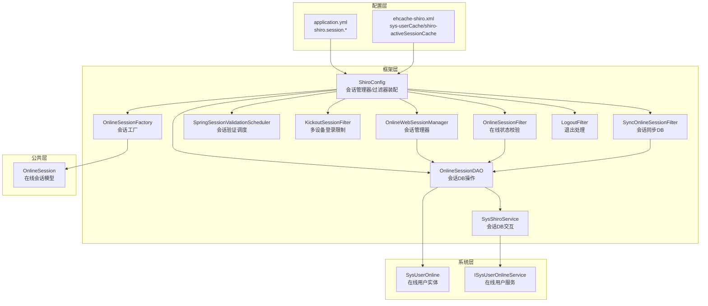
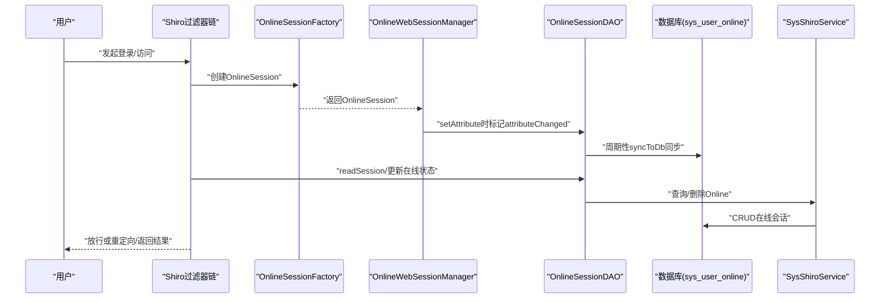
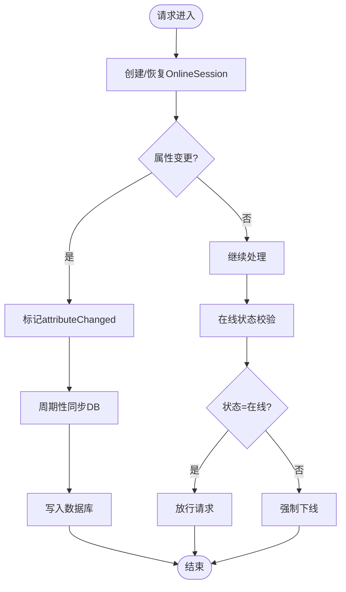
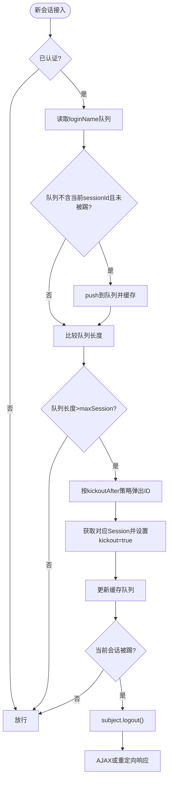
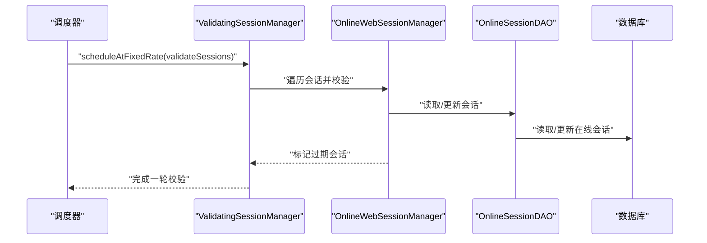
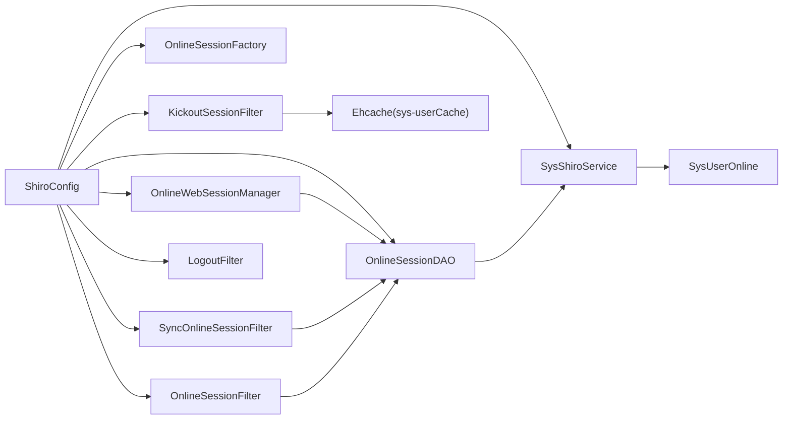

# 会话管理与安全

<cite>
**本文引用的文件**
- [ShiroConfig.java](file://ruoyi-framework/src/main/java/com/ruoyi/framework/config/ShiroConfig.java)
- [OnlineWebSessionManager.java](file://ruoyi-framework/src/main/java/com/ruoyi/framework/shiro/web/session/OnlineWebSessionManager.java)
- [OnlineSessionDAO.java](file://ruoyi-framework/src/main/java/com/ruoyi/framework/shiro/session/OnlineSessionDAO.java)
- [OnlineSessionFactory.java](file://ruoyi-framework/src/main/java/com/ruoyi/framework/shiro/session/OnlineSessionFactory.java)
- [SpringSessionValidationScheduler.java](file://ruoyi-framework/src/main/java/com/ruoyi/framework/shiro/web/session/SpringSessionValidationScheduler.java)
- [KickoutSessionFilter.java](file://ruoyi-framework/src/main/java/com/ruoyi/framework/shiro/web/filter/kickout/KickoutSessionFilter.java)
- [OnlineSessionFilter.java](file://ruoyi-framework/src/main/java/com/ruoyi/framework/shiro/web/filter/online/OnlineSessionFilter.java)
- [SyncOnlineSessionFilter.java](file://ruoyi-framework/src/main/java/com/ruoyi/framework/shiro/web/filter/sync/SyncOnlineSessionFilter.java)
- [LogoutFilter.java](file://ruoyi-framework/src/main/java/com/ruoyi/framework/shiro/web/filter/LogoutFilter.java)
- [SysShiroService.java](file://ruoyi-framework/src/main/java/com/ruoyi/framework/shiro/service/SysShiroService.java)
- [OnlineSession.java](file://ruoyi-common/src/main/java/com/ruoyi/common/core/session/OnlineSession.java)
- [SysUserOnline.java](file://ruoyi-system/src/main/java/com/ruoyi/system/domain/SysUserOnline.java)
- [ISysUserOnlineService.java](file://ruoyi-system/src/main/java/com/ruoyi/system/service/ISysUserOnlineService.java)
- [application.yml](file://ruoyi-admin/src/main/resources/application.yml)
- [ehcache-shiro.xml](file://ruoyi-admin/src/main/resources/ehcache/ehcache-shiro.xml)
</cite>

## 目录
1. [简介](#简介)
2. [项目结构](#项目结构)
3. [核心组件](#核心组件)
4. [架构总览](#架构总览)
5. [详细组件分析](#详细组件分析)
6. [依赖分析](#依赖分析)
7. [性能考虑](#性能考虑)
8. [故障排查指南](#故障排查指南)
9. [结论](#结论)
10. [附录](#附录)

## 简介
本文件面向RuoYi系统的会话管理与安全机制，围绕在线用户会话的生命周期、多设备登录限制、会话超时与自动登出、以及会话安全增强（会话固定防护、IP绑定、UA校验）展开，提供配置参数详解、性能优化建议与故障排查方法，并给出可操作的配置示例与监控指标说明。

## 项目结构
RuoYi采用基于Apache Shiro的安全框架，结合自定义OnlineSession与数据库持久化，实现在线会话的统一管理。核心模块分布如下：
- 框架层（ruoyi-framework）：Shiro配置、会话管理器、会话DAO、会话工厂、过滤器链与调度器
- 公共层（ruoyi-common）：在线会话模型OnlineSession
- 系统层（ruoyi-system）：在线用户实体SysUserOnline与服务接口ISysUserOnlineService
- 配置层（ruoyi-admin）：应用配置application.yml与Ehcache缓存配置ehcache-shiro.xml

图表来源
- [ShiroConfig.java:296-346](file://ruoyi-framework/src/main/java/com/ruoyi/framework/config/ShiroConfig.java#L296-L346)
- [OnlineWebSessionManager.java:29-35](file://ruoyi-framework/src/main/java/com/ruoyi/framework/shiro/web/session/OnlineWebSessionManager.java#L29-L35)
- [OnlineSessionDAO.java:21-47](file://ruoyi-framework/src/main/java/com/ruoyi/framework/shiro/session/OnlineSessionDAO.java#L21-L47)
- [OnlineSessionFactory.java:25-69](file://ruoyi-framework/src/main/java/com/ruoyi/framework/shiro/session/OnlineSessionFactory.java#L25-L69)
- [SpringSessionValidationScheduler.java:23-131](file://ruoyi-framework/src/main/java/com/ruoyi/framework/shiro/web/session/SpringSessionValidationScheduler.java#L23-L131)
- [KickoutSessionFilter.java:31-176](file://ruoyi-framework/src/main/java/com/ruoyi/framework/shiro/web/filter/kickout/KickoutSessionFilter.java#L31-L176)
- [OnlineSessionFilter.java:23-101](file://ruoyi-framework/src/main/java/com/ruoyi/framework/shiro/web/filter/online/OnlineSessionFilter.java#L23-L101)
- [SyncOnlineSessionFilter.java:15-39](file://ruoyi-framework/src/main/java/com/ruoyi/framework/shiro/web/filter/sync/SyncOnlineSessionFilter.java#L15-L39)
- [LogoutFilter.java:24-91](file://ruoyi-framework/src/main/java/com/ruoyi/framework/shiro/web/filter/LogoutFilter.java#L24-L91)
- [SysShiroService.java:19-53](file://ruoyi-framework/src/main/java/com/ruoyi/framework/shiro/service/SysShiroService.java#L19-L53)
- [OnlineSession.java:13-166](file://ruoyi-common/src/main/java/com/ruoyi/common/core/session/OnlineSession.java#L13-L166)
- [SysUserOnline.java:15-205](file://ruoyi-system/src/main/java/com/ruoyi/system/domain/SysUserOnline.java#L15-L205)
- [ISysUserOnlineService.java:12-76](file://ruoyi-system/src/main/java/com/ruoyi/system/service/ISysUserOnlineService.java#L12-L76)

章节来源
- [ShiroConfig.java:296-346](file://ruoyi-framework/src/main/java/com/ruoyi/framework/config/ShiroConfig.java#L296-L346)
- [application.yml:86-124](file://ruoyi-admin/src/main/resources/application.yml#L86-L124)
- [ehcache-shiro.xml:15-91](file://ruoyi-admin/src/main/resources/ehcache/ehcache-shiro.xml#L15-L91)

## 核心组件
- 会话管理器OnlineWebSessionManager：负责会话创建、属性变更标记、与OnlineSessionDAO协同持久化
- 会话DAO OnlineSessionDAO：基于EnterpriseCacheSessionDAO扩展，支持周期性同步到数据库，维护last_sync_db_timestamp
- 会话工厂 OnlineSessionFactory：根据SysUserOnline重建OnlineSession，支持序列化恢复与降级重建
- 会话验证调度器 SpringSessionValidationScheduler：按配置周期调用validateSessions，清理过期会话
- 多设备登录限制 KickoutSessionFilter：基于Ehcache队列控制同一用户最大会话数，支持“踢出前者/后者”
- 在线状态校验 OnlineSessionFilter：读取DB中的在线会话，注入上下文，强制下线off_line状态会话
- 会话同步过滤器 SyncOnlineSessionFilter：在请求处理前将OnlineSession变更同步至数据库
- 退出过滤器 LogoutFilter：统一退出入口，记录日志并清理缓存
- 会话DB服务 SysShiroService：封装OnlineSession与SysUserOnline之间的转换与删除
- 在线会话模型 OnlineSession：扩展SimpleSession，增加用户维度属性与attributeChanged标记
- 在线用户实体 SysUserOnline：数据库侧在线会话载体，包含序列化会话数据

章节来源
- [OnlineWebSessionManager.java:29-35](file://ruoyi-framework/src/main/java/com/ruoyi/framework/shiro/web/session/OnlineWebSessionManager.java#L29-L35)
- [OnlineSessionDAO.java:21-47](file://ruoyi-framework/src/main/java/com/ruoyi/framework/shiro/session/OnlineSessionDAO.java#L21-L47)
- [OnlineSessionFactory.java:25-69](file://ruoyi-framework/src/main/java/com/ruoyi/framework/shiro/session/OnlineSessionFactory.java#L25-L69)
- [SpringSessionValidationScheduler.java:23-131](file://ruoyi-framework/src/main/java/com/ruoyi/framework/shiro/web/session/SpringSessionValidationScheduler.java#L23-L131)
- [KickoutSessionFilter.java:31-176](file://ruoyi-framework/src/main/java/com/ruoyi/framework/shiro/web/filter/kickout/KickoutSessionFilter.java#L31-L176)
- [OnlineSessionFilter.java:23-101](file://ruoyi-framework/src/main/java/com/ruoyi/framework/shiro/web/filter/online/OnlineSessionFilter.java#L23-L101)
- [SyncOnlineSessionFilter.java:15-39](file://ruoyi-framework/src/main/java/com/ruoyi/framework/shiro/web/filter/sync/SyncOnlineSessionFilter.java#L15-L39)
- [LogoutFilter.java:24-91](file://ruoyi-framework/src/main/java/com/ruoyi/framework/shiro/web/filter/LogoutFilter.java#L24-L91)
- [SysShiroService.java:19-53](file://ruoyi-framework/src/main/java/com/ruoyi/framework/shiro/service/SysShiroService.java#L19-L53)
- [OnlineSession.java:13-166](file://ruoyi-common/src/main/java/com/ruoyi/common/core/session/OnlineSession.java#L13-L166)
- [SysUserOnline.java:15-205](file://ruoyi-system/src/main/java/com/ruoyi/system/domain/SysUserOnline.java#L15-L205)

## 架构总览
RuoYi的会话管理以Shiro为核心，结合Ehcache与数据库双写策略，实现高可用与强一致兼顾。会话生命周期的关键节点包括：登录创建会话、请求期间在线状态校验、属性变更同步、定时验证清理、多设备并发控制、退出清理。

图表来源
- [OnlineSessionFactory.java:29-69](file://ruoyi-framework/src/main/java/com/ruoyi/framework/shiro/session/OnlineSessionFactory.java#L29-L69)
- [OnlineWebSessionManager.java:33-35](file://ruoyi-framework/src/main/java/com/ruoyi/framework/shiro/web/session/OnlineWebSessionManager.java#L33-L35)
- [OnlineSessionDAO.java:21-47](file://ruoyi-framework/src/main/java/com/ruoyi/framework/shiro/session/OnlineSessionDAO.java#L21-L47)
- [SysShiroService.java:27-53](file://ruoyi-framework/src/main/java/com/ruoyi/framework/shiro/service/SysShiroService.java#L27-L53)
- [SysUserOnline.java:15-205](file://ruoyi-system/src/main/java/com/ruoyi/system/domain/SysUserOnline.java#L15-L205)

## 详细组件分析

### 会话生命周期与状态跟踪
- 创建阶段：OnlineSessionFactory根据请求上下文与SysUserOnline重建OnlineSession，支持从sessionData反序列化恢复认证信息
- 属性变更：OnlineWebSessionManager在setAttribute时标记attributeChanged，避免无谓同步
- 同步阶段：SyncOnlineSessionFilter在每次请求前将OnlineSession变更同步至数据库，受dbSyncPeriod控制
- 在线校验：OnlineSessionFilter读取数据库在线会话，注入上下文；若状态为off_line则强制下线
- 销毁阶段：退出过滤器统一清理缓存与会话，SysShiroService删除数据库记录

图表来源
- [OnlineWebSessionManager.java:33-35](file://ruoyi-framework/src/main/java/com/ruoyi/framework/shiro/web/session/OnlineWebSessionManager.java#L33-L35)
- [SyncOnlineSessionFilter.java:22-33](file://ruoyi-framework/src/main/java/com/ruoyi/framework/shiro/web/filter/sync/SyncOnlineSessionFilter.java#L22-L33)
- [OnlineSessionFilter.java:36-72](file://ruoyi-framework/src/main/java/com/ruoyi/framework/shiro/web/filter/online/OnlineSessionFilter.java#L36-L72)
- [OnlineSessionDAO.java:21-47](file://ruoyi-framework/src/main/java/com/ruoyi/framework/shiro/session/OnlineSessionDAO.java#L21-L47)

章节来源
- [OnlineSessionFactory.java:29-69](file://ruoyi-framework/src/main/java/com/ruoyi/framework/shiro/session/OnlineSessionFactory.java#L29-L69)
- [OnlineWebSessionManager.java:33-35](file://ruoyi-framework/src/main/java/com/ruoyi/framework/shiro/web/session/OnlineWebSessionManager.java#L33-L35)
- [SyncOnlineSessionFilter.java:22-33](file://ruoyi-framework/src/main/java/com/ruoyi/framework/shiro/web/filter/sync/SyncOnlineSessionFilter.java#L22-L33)
- [OnlineSessionFilter.java:36-72](file://ruoyi-framework/src/main/java/com/ruoyi/framework/shiro/web/filter/online/OnlineSessionFilter.java#L36-L72)
- [OnlineSessionDAO.java:21-47](file://ruoyi-framework/src/main/java/com/ruoyi/framework/shiro/session/OnlineSessionDAO.java#L21-L47)

### 多设备登录限制与强制下线
- 控制逻辑：KickoutSessionFilter基于Ehcache队列维护同一loginName下的会话ID序列，超过maxSession时按kickoutAfter策略踢出前者或后者
- 强制下线：被踢出会话设置kickout属性并在后续请求中触发logout，返回JSON或重定向到kickoutUrl
- 配置项：shiro.session.maxSession、shiro.session.kickoutAfter、shiro.session.kickoutUrl

图表来源
- [KickoutSessionFilter.java:61-132](file://ruoyi-framework/src/main/java/com/ruoyi/framework/shiro/web/filter/kickout/KickoutSessionFilter.java#L61-L132)
- [ShiroConfig.java:414-426](file://ruoyi-framework/src/main/java/com/ruoyi/framework/config/ShiroConfig.java#L414-L426)

章节来源
- [KickoutSessionFilter.java:31-176](file://ruoyi-framework/src/main/java/com/ruoyi/framework/shiro/web/filter/kickout/KickoutSessionFilter.java#L31-L176)
- [ShiroConfig.java:414-426](file://ruoyi-framework/src/main/java/com/ruoyi/framework/config/ShiroConfig.java#L414-L426)

### 会话超时与自动登出
- 全局超时：OnlineWebSessionManager设置全局会话超时时间（分钟转毫秒），由SpringSessionValidationScheduler按validationInterval周期调用validateSessions清理
- 配置项：shiro.session.expireTime、shiro.session.validationInterval
- 退出处理：LogoutFilter统一执行subject.logout()并清理缓存

图表来源
- [SpringSessionValidationScheduler.java:75-115](file://ruoyi-framework/src/main/java/com/ruoyi/framework/shiro/web/session/SpringSessionValidationScheduler.java#L75-L115)
- [OnlineWebSessionManager.java:232-252](file://ruoyi-framework/src/main/java/com/ruoyi/framework/shiro/web/session/OnlineWebSessionManager.java#L232-L252)
- [application.yml:111-118](file://ruoyi-admin/src/main/resources/application.yml#L111-L118)

章节来源
- [SpringSessionValidationScheduler.java:23-131](file://ruoyi-framework/src/main/java/com/ruoyi/framework/shiro/web/session/SpringSessionValidationScheduler.java#L23-L131)
- [OnlineWebSessionManager.java:232-252](file://ruoyi-framework/src/main/java/com/ruoyi/framework/shiro/web/session/OnlineWebSessionManager.java#L232-L252)
- [application.yml:111-118](file://ruoyi-admin/src/main/resources/application.yml#L111-L118)

### 会话安全增强
- 会话固定攻击防护：通过禁用JSESSIONID重写、使用自定义SessionId策略与RememberMe加密，降低会话劫持风险
- IP地址绑定与用户代理验证：OnlineSessionFilter在读取在线会话时可扩展校验IP/UA一致性（当前实现主要依赖在线状态与强制下线），建议在业务层补充IP/UA校验逻辑
- Cookie安全：application.yml中启用HttpOnly与可配置domain/path/maxAge，支持cipherKey加密RememberMe

章节来源
- [ShiroConfig.java:232-252](file://ruoyi-framework/src/main/java/com/ruoyi/framework/config/ShiroConfig.java#L232-L252)
- [application.yml:99-110](file://ruoyi-admin/src/main/resources/application.yml#L99-L110)
- [ehcache-shiro.xml:15-91](file://ruoyi-admin/src/main/resources/ehcache/ehcache-shiro.xml#L15-L91)

## 依赖分析
- 组件耦合
  - ShiroConfig装配各组件，形成清晰的依赖闭环
  - OnlineWebSessionManager依赖OnlineSessionDAO与OnlineSessionFactory
  - OnlineSessionDAO依赖SysShiroService与数据库
  - 过滤器链依赖OnlineSessionDAO与Ehcache缓存
- 外部依赖
  - Ehcache缓存：sys-userCache用于用户会话队列，shiro-activeSessionCache用于活动会话缓存
  - 数据库：SysUserOnline表存储在线会话与序列化数据

图表来源
- [ShiroConfig.java:296-346](file://ruoyi-framework/src/main/java/com/ruoyi/framework/config/ShiroConfig.java#L296-L346)
- [OnlineSessionDAO.java:21-47](file://ruoyi-framework/src/main/java/com/ruoyi/framework/shiro/session/OnlineSessionDAO.java#L21-L47)
- [SysShiroService.java:19-53](file://ruoyi-framework/src/main/java/com/ruoyi/framework/shiro/service/SysShiroService.java#L19-L53)
- [ehcache-shiro.xml:35-88](file://ruoyi-admin/src/main/resources/ehcache/ehcache-shiro.xml#L35-L88)

章节来源
- [ShiroConfig.java:296-346](file://ruoyi-framework/src/main/java/com/ruoyi/framework/config/ShiroConfig.java#L296-L346)
- [ehcache-shiro.xml:35-88](file://ruoyi-admin/src/main/resources/ehcache/ehcache-shiro.xml#L35-L88)

## 性能考虑
- 同步频率与抖动：dbSyncPeriod与validationInterval需结合业务QPS与数据库压力调优，避免频繁写入
- 缓存命中：Ehcache配置合理设置TTL与淘汰策略，减少磁盘溢出
- 会话序列化：sessionData序列化/反序列化成本较高，建议在服务重启场景使用，日常以增量更新为主
- 并发控制：maxSession建议按业务场景设置，kickoutAfter=false可降低对“后登录者”的影响

## 故障排查指南
- 会话未同步到DB
  - 检查dbSyncPeriod与SyncOnlineSessionFilter是否生效
  - 关注OnlineSessionDAO的last_sync_db_timestamp标记
- 会话超时频繁
  - 核对shiro.session.expireTime与validationInterval配置
  - 查看调度器是否正常运行
- 多设备登录异常
  - 检查sys-userCache缓存是否正确初始化
  - 确认kickoutAfter与maxSession配置
- 强制下线无效
  - 确认OnlineSessionFilter读取DB并设置kickout=true
  - 检查会话状态字段是否被其他流程覆盖
- 退出后仍保留会话
  - 检查LogoutFilter是否执行subject.logout()
  - 确认SysShiroService删除Online记录

章节来源
- [OnlineSessionDAO.java:21-47](file://ruoyi-framework/src/main/java/com/ruoyi/framework/shiro/session/OnlineSessionDAO.java#L21-L47)
- [SpringSessionValidationScheduler.java:75-115](file://ruoyi-framework/src/main/java/com/ruoyi/framework/shiro/web/session/SpringSessionValidationScheduler.java#L75-L115)
- [KickoutSessionFilter.java:94-132](file://ruoyi-framework/src/main/java/com/ruoyi/framework/shiro/web/filter/kickout/KickoutSessionFilter.java#L94-L132)
- [OnlineSessionFilter.java:66-87](file://ruoyi-framework/src/main/java/com/ruoyi/framework/shiro/web/filter/online/OnlineSessionFilter.java#L66-L87)
- [LogoutFilter.java:44-75](file://ruoyi-framework/src/main/java/com/ruoyi/framework/shiro/web/filter/LogoutFilter.java#L44-L75)

## 结论
RuoYi通过Shiro与自定义OnlineSession实现了完善的在线会话管理：会话生命周期清晰、多设备并发可控、超时清理可靠、退出流程统一。结合合理的配置与监控，可在保证安全性的同时获得良好的性能表现。

## 附录

### 配置参数详解
- 会话超时与验证
  - shiro.session.expireTime：全局会话超时（分钟），-1表示永不过期
  - shiro.session.validationInterval：会话验证调度间隔（分钟）
- 多设备登录
  - shiro.session.maxSession：同一用户最大会话数（-1不限制）
  - shiro.session.kickoutAfter：踢出策略（false踢出前者，true踢出后者）
  - shiro.session.kickoutUrl：被踢出后的重定向地址
- 数据库同步
  - shiro.session.dbSyncPeriod：会话同步DB周期（分钟）
- Cookie与记住我
  - shiro.cookie.domain/path/httpOnly/maxAge：Cookie属性
  - shiro.rememberMe.enabled：是否启用记住我
  - shiro.cookie.cipherKey：记住我加密密钥（建议固定）

章节来源
- [application.yml:86-124](file://ruoyi-admin/src/main/resources/application.yml#L86-L124)
- [ShiroConfig.java:52-116](file://ruoyi-framework/src/main/java/com/ruoyi/framework/config/ShiroConfig.java#L52-L116)

### 监控指标建议
- 在线会话总数与峰值
- 会话同步成功率与延迟
- 会话验证任务耗时与失败次数
- 多设备登录触发次数与踢出比例
- 退出请求成功率与异常日志