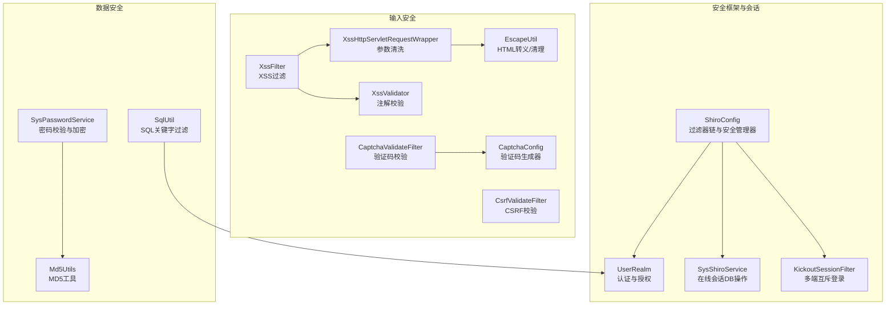
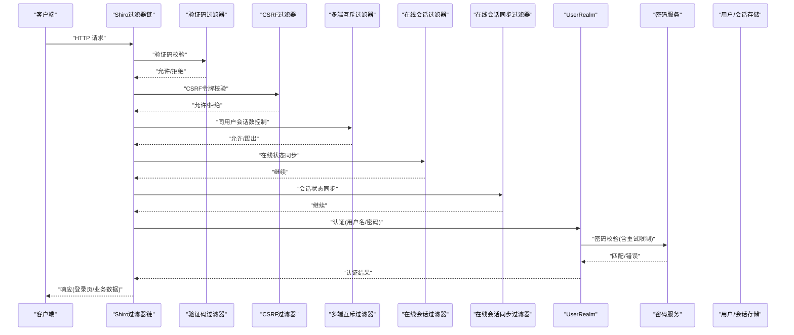
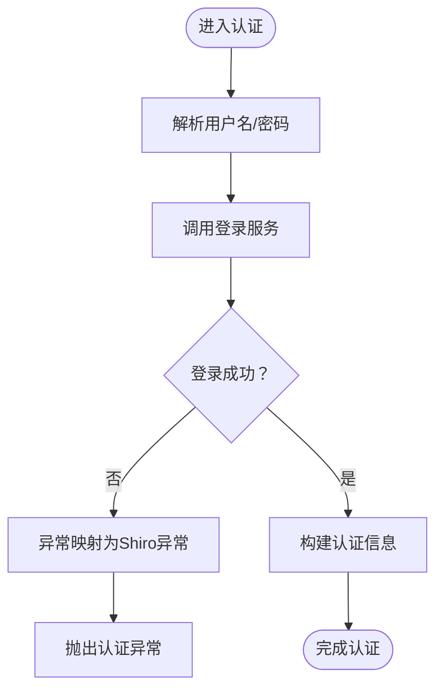
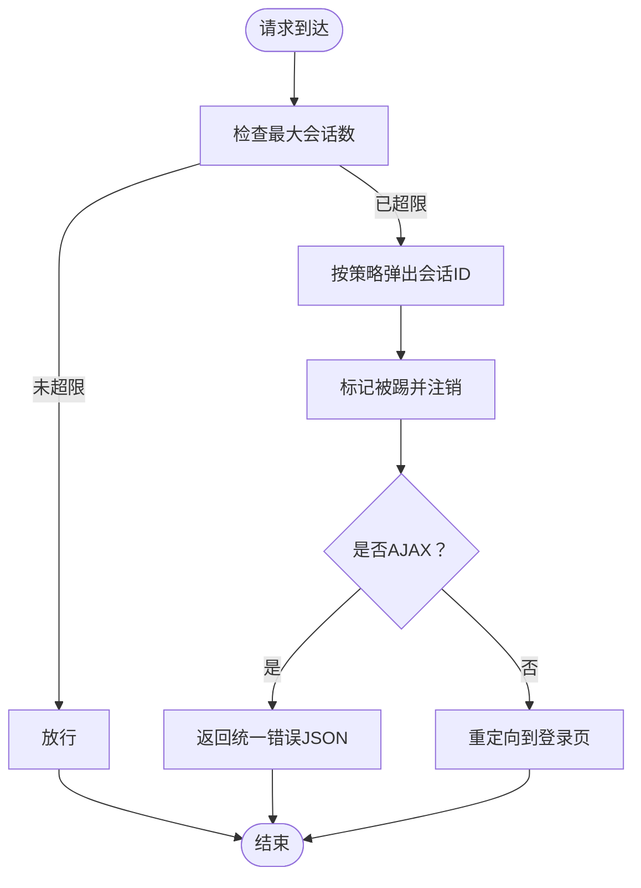
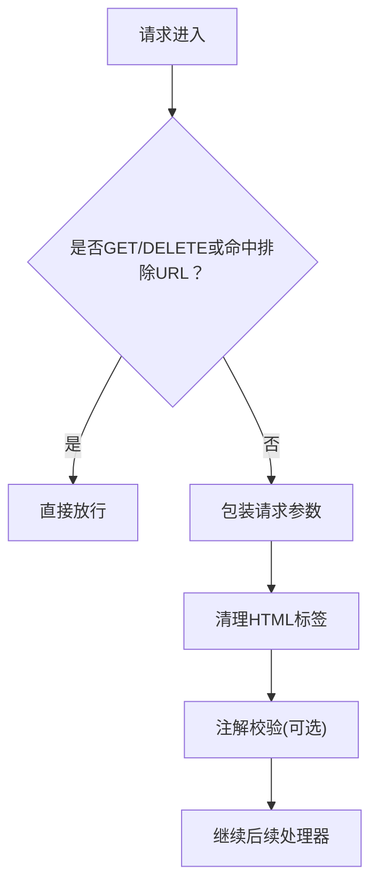
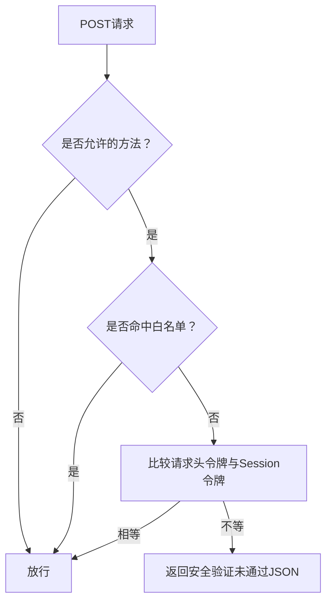
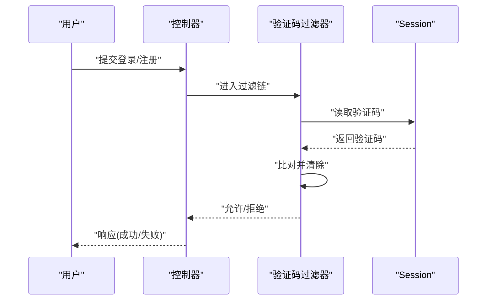
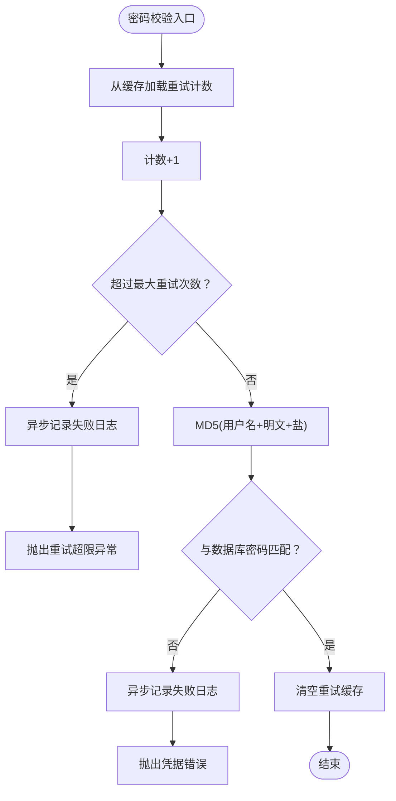
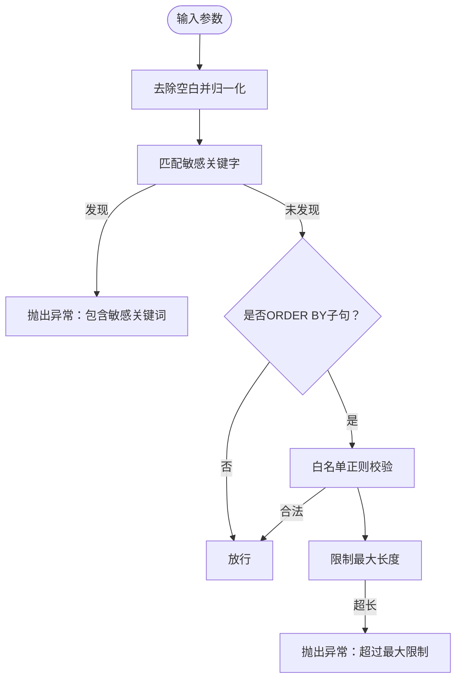
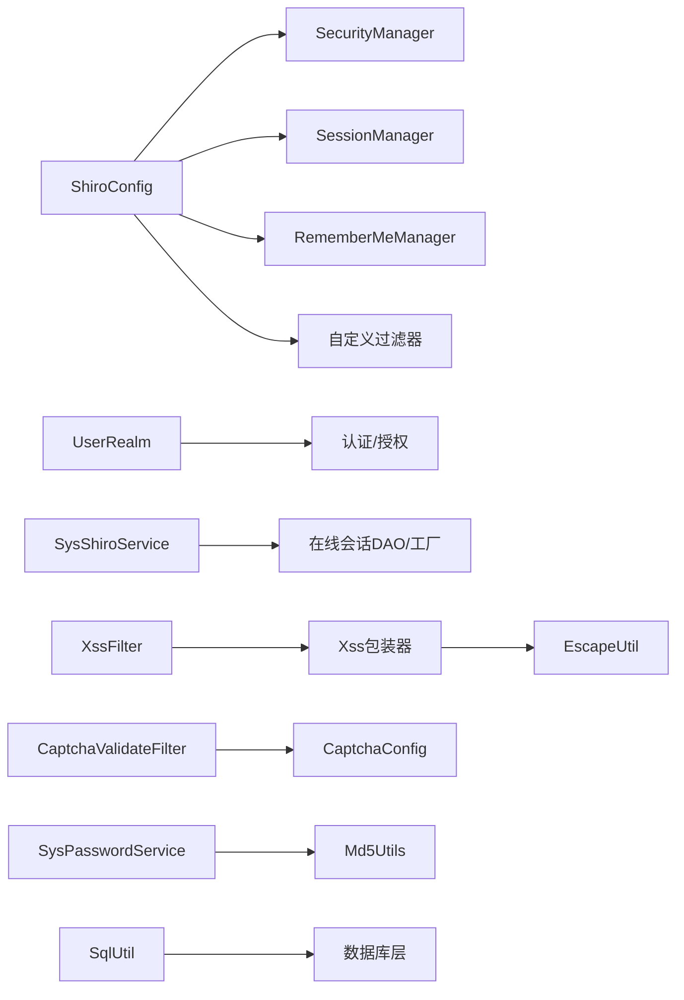

# 安全设计

<cite>
**本文引用的文件**
- [ShiroConfig.java](file://ruoyi-framework/src/main/java/com/ruoyi/framework/config/ShiroConfig.java)
- [UserRealm.java](file://ruoyi-framework/src/main/java/com/ruoyi/framework/shiro/realm/UserRealm.java)
- [SysShiroService.java](file://ruoyi-framework/src/main/java/com/ruoyi/framework/shiro/service/SysShiroService.java)
- [XssFilter.java](file://ruoyi-common/src/main/java/com/ruoyi/common/xss/XssFilter.java)
- [XssHttpServletRequestWrapper.java](file://ruoyi-common/src/main/java/com/ruoyi/common/xss/XssHttpServletRequestWrapper.java)
- [Xss.java](file://ruoyi-common/src/main/java/com/ruoyi/common/xss/Xss.java)
- [XssValidator.java](file://ruoyi-common/src/main/java/com/ruoyi/common/xss/XssValidator.java)
- [EscapeUtil.java](file://ruoyi-common/src/main/java/com/ruoyi/common/utils/html/EscapeUtil.java)
- [CsrfValidateFilter.java](file://ruoyi-framework/src/main/java/com/ruoyi/framework/shiro/web/filter/csrf/CsrfValidateFilter.java)
- [CaptchaValidateFilter.java](file://ruoyi-framework/src/main/java/com/ruoyi/framework/shiro/web/filter/captcha/CaptchaValidateFilter.java)
- [KickoutSessionFilter.java](file://ruoyi-framework/src/main/java/com/ruoyi/framework/shiro/web/filter/kickout/KickoutSessionFilter.java)
- [SysPasswordService.java](file://ruoyi-framework/src/main/java/com/ruoyi/framework/shiro/service/SysPasswordService.java)
- [Md5Utils.java](file://ruoyi-common/src/main/java/com/ruoyi/common/utils/security/Md5Utils.java)
- [SqlUtil.java](file://ruoyi-common/src/main/java/com/ruoyi/common/utils/sql/SqlUtil.java)
- [CaptchaConfig.java](file://ruoyi-framework/src/main/java/com/ruoyi/framework/config/CaptchaConfig.java)
</cite>

## 目录
1. [简介](#简介)
2. [项目结构](#项目结构)
3. [核心组件](#核心组件)
4. [架构总览](#架构总览)
5. [组件详解](#组件详解)
6. [依赖关系分析](#依赖关系分析)
7. [性能与安全特性](#性能与安全特性)
8. [故障排查指南](#故障排查指南)
9. [结论](#结论)
10. [附录：最佳实践与加固清单](#附录最佳实践与加固清单)

## 简介
本文件面向RuoYi系统在安全设计方面的技术文档，重点覆盖以下方面：
- 基于Apache Shiro的安全框架集成：认证流程、授权机制、会话管理与多端互斥登录。
- 输入安全：XSS防护、CSRF防护、SQL注入防护。
- 密码安全：加密算法、盐值管理、密码强度策略与暴力破解防护。
- 验证码机制与账户锁定策略。
- 安全配置最佳实践、漏洞扫描与渗透测试建议。

## 项目结构
围绕安全主题的关键模块分布如下：
- 安全框架与会话：ShiroConfig、UserRealm、SysShiroService、KickoutSessionFilter等。
- 输入安全：XssFilter、XssHttpServletRequestWrapper、XssValidator、EscapeUtil、CsrfValidateFilter、CaptchaValidateFilter、CaptchaConfig。
- 数据安全：SysPasswordService、Md5Utils、SqlUtil。

**图表来源**
- [ShiroConfig.java:296-346](file://ruoyi-framework/src/main/java/com/ruoyi/framework/config/ShiroConfig.java#L296-L346)
- [UserRealm.java:56-81](file://ruoyi-framework/src/main/java/com/ruoyi/framework/shiro/realm/UserRealm.java#L56-L81)
- [SysShiroService.java:18-53](file://ruoyi-framework/src/main/java/com/ruoyi/framework/shiro/service/SysShiroService.java#L18-L53)
- [KickoutSessionFilter.java:31-132](file://ruoyi-framework/src/main/java/com/ruoyi/framework/shiro/web/filter/kickout/KickoutSessionFilter.java#L31-L132)
- [XssFilter.java:21-55](file://ruoyi-common/src/main/java/com/ruoyi/common/xss/XssFilter.java#L21-L55)
- [XssHttpServletRequestWrapper.java:12-39](file://ruoyi-common/src/main/java/com/ruoyi/common/xss/XssHttpServletRequestWrapper.java#L12-L39)
- [XssValidator.java:14-39](file://ruoyi-common/src/main/java/com/ruoyi/common/xss/XssValidator.java#L14-L39)
- [EscapeUtil.java:10-62](file://ruoyi-common/src/main/java/com/ruoyi/common/utils/html/EscapeUtil.java#L10-L62)
- [CsrfValidateFilter.java:20-59](file://ruoyi-framework/src/main/java/com/ruoyi/framework/shiro/web/filter/csrf/CsrfValidateFilter.java#L20-L59)
- [CaptchaValidateFilter.java:17-78](file://ruoyi-framework/src/main/java/com/ruoyi/framework/shiro/web/filter/captcha/CaptchaValidateFilter.java#L17-L78)
- [CaptchaConfig.java:16-83](file://ruoyi-framework/src/main/java/com/ruoyi/framework/config/CaptchaConfig.java#L16-L83)
- [SysPasswordService.java:26-85](file://ruoyi-framework/src/main/java/com/ruoyi/framework/shiro/service/SysPasswordService.java#L26-L85)
- [Md5Utils.java:13-67](file://ruoyi-common/src/main/java/com/ruoyi/common/utils/security/Md5Utils.java#L13-L67)
- [SqlUtil.java:11-71](file://ruoyi-common/src/main/java/com/ruoyi/common/utils/sql/SqlUtil.java#L11-L71)

**章节来源**
- [ShiroConfig.java:49-346](file://ruoyi-framework/src/main/java/com/ruoyi/framework/config/ShiroConfig.java#L49-L346)
- [XssFilter.java:21-74](file://ruoyi-common/src/main/java/com/ruoyi/common/xss/XssFilter.java#L21-L74)
- [CsrfValidateFilter.java:20-77](file://ruoyi-framework/src/main/java/com/ruoyi/framework/shiro/web/filter/csrf/CsrfValidateFilter.java#L20-L77)
- [CaptchaValidateFilter.java:17-80](file://ruoyi-framework/src/main/java/com/ruoyi/framework/shiro/web/filter/captcha/CaptchaValidateFilter.java#L17-L80)
- [SysPasswordService.java:26-85](file://ruoyi-framework/src/main/java/com/ruoyi/framework/shiro/service/SysPasswordService.java#L26-L85)
- [SqlUtil.java:11-71](file://ruoyi-common/src/main/java/com/ruoyi/common/utils/sql/SqlUtil.java#L11-L71)

## 核心组件
- Shiro安全配置与过滤器链：集中定义登录、未授权、会话超时、记住我、CSRF、验证码、在线会话同步、多端互斥等过滤器及顺序。
- 用户域Realm：负责认证（登录服务调用、异常映射）与授权（角色与权限集合）。
- 在线会话服务：提供会话的数据库层操作与工厂化创建。
- 输入安全组件：XSS过滤器与包装器、HTML转义/清理工具、CSRF校验过滤器、验证码过滤器与生成器。
- 密码安全：密码加密与校验、登录尝试次数限制、盐值参与计算。
- SQL安全：关键字过滤与排序子句白名单校验。

**章节来源**
- [ShiroConfig.java:296-346](file://ruoyi-framework/src/main/java/com/ruoyi/framework/config/ShiroConfig.java#L296-L346)
- [UserRealm.java:56-133](file://ruoyi-framework/src/main/java/com/ruoyi/framework/shiro/realm/UserRealm.java#L56-L133)
- [SysShiroService.java:18-53](file://ruoyi-framework/src/main/java/com/ruoyi/framework/shiro/service/SysShiroService.java#L18-L53)
- [XssFilter.java:21-74](file://ruoyi-common/src/main/java/com/ruoyi/common/xss/XssFilter.java#L21-L74)
- [XssHttpServletRequestWrapper.java:12-39](file://ruoyi-common/src/main/java/com/ruoyi/common/xss/XssHttpServletRequestWrapper.java#L12-L39)
- [EscapeUtil.java:10-62](file://ruoyi-common/src/main/java/com/ruoyi/common/utils/html/EscapeUtil.java#L10-L62)
- [CsrfValidateFilter.java:20-77](file://ruoyi-framework/src/main/java/com/ruoyi/framework/shiro/web/filter/csrf/CsrfValidateFilter.java#L20-L77)
- [CaptchaValidateFilter.java:17-80](file://ruoyi-framework/src/main/java/com/ruoyi/framework/shiro/web/filter/captcha/CaptchaValidateFilter.java#L17-L80)
- [CaptchaConfig.java:16-83](file://ruoyi-framework/src/main/java/com/ruoyi/framework/config/CaptchaConfig.java#L16-L83)
- [SysPasswordService.java:26-85](file://ruoyi-framework/src/main/java/com/ruoyi/framework/shiro/service/SysPasswordService.java#L26-L85)
- [Md5Utils.java:13-67](file://ruoyi-common/src/main/java/com/ruoyi/common/utils/security/Md5Utils.java#L13-L67)
- [SqlUtil.java:11-71](file://ruoyi-common/src/main/java/com/ruoyi/common/utils/sql/SqlUtil.java#L11-L71)

## 架构总览
下图展示从请求进入至响应返回的完整安全链路，包括认证、授权、会话、输入安全与数据安全各环节。

**图表来源**
- [ShiroConfig.java:296-346](file://ruoyi-framework/src/main/java/com/ruoyi/framework/config/ShiroConfig.java#L296-L346)
- [CaptchaValidateFilter.java:40-78](file://ruoyi-framework/src/main/java/com/ruoyi/framework/shiro/web/filter/captcha/CaptchaValidateFilter.java#L40-L78)
- [CsrfValidateFilter.java:28-59](file://ruoyi-framework/src/main/java/com/ruoyi/framework/shiro/web/filter/csrf/CsrfValidateFilter.java#L28-L59)
- [KickoutSessionFilter.java:54-132](file://ruoyi-framework/src/main/java/com/ruoyi/framework/shiro/web/filter/kickout/KickoutSessionFilter.java#L54-L132)
- [UserRealm.java:86-133](file://ruoyi-framework/src/main/java/com/ruoyi/framework/shiro/realm/UserRealm.java#L86-L133)
- [SysPasswordService.java:42-85](file://ruoyi-framework/src/main/java/com/ruoyi/framework/shiro/service/SysPasswordService.java#L42-L85)

## 组件详解

### 认证流程与授权机制
- 认证入口：UserRealm在doGetAuthenticationInfo中接收UsernamePasswordToken，委托SysLoginService执行登录逻辑，并根据异常映射为未知账户、凭据错误、超额重试、账户/角色锁定等。
- 授权入口：UserRealm在doGetAuthorizationInfo中依据当前用户动态加载角色与权限集合，管理员拥有通配权限。
- 异常映射：将业务异常转换为Shiro认证异常，便于统一处理与提示。

**图表来源**
- [UserRealm.java:86-133](file://ruoyi-framework/src/main/java/com/ruoyi/framework/shiro/realm/UserRealm.java#L86-L133)

**章节来源**
- [UserRealm.java:56-133](file://ruoyi-framework/src/main/java/com/ruoyi/framework/shiro/realm/UserRealm.java#L56-L133)

### 会话管理与多端互斥登录
- 会话管理器：配置全局超时、失效会话清理、SessionDAO与SessionFactory、Ehcache缓存。
- 在线会话过滤器：同步在线状态，避免离线后仍持有有效状态。
- 多端互斥过滤器：基于用户名维护会话ID队列，超过阈值按“先登后踢/后登先踢”策略踢出旧会话，并在AJAX与非AJAX场景分别返回不同响应。

**图表来源**
- [KickoutSessionFilter.java:54-148](file://ruoyi-framework/src/main/java/com/ruoyi/framework/shiro/web/filter/kickout/KickoutSessionFilter.java#L54-L148)
- [ShiroConfig.java:232-252](file://ruoyi-framework/src/main/java/com/ruoyi/framework/config/ShiroConfig.java#L232-L252)

**章节来源**
- [ShiroConfig.java:232-252](file://ruoyi-framework/src/main/java/com/ruoyi/framework/config/ShiroConfig.java#L232-L252)
- [KickoutSessionFilter.java:54-148](file://ruoyi-framework/src/main/java/com/ruoyi/framework/shiro/web/filter/kickout/KickoutSessionFilter.java#L54-L148)

### XSS防护
- 过滤器：XssFilter在初始化时可配置排除URL列表，对非GET/DELETE请求进行包装处理。
- 包装器：XssHttpServletRequestWrapper对参数值进行清理与去空白，结合EscapeUtil.clean移除HTML标签。
- 注解：Xss注解配合XssValidator基于正则检测HTML标签，作为补充校验手段。
- 转义工具：EscapeUtil提供HTML转义/反转义与纯文本清理能力。

**图表来源**
- [XssFilter.java:43-67](file://ruoyi-common/src/main/java/com/ruoyi/common/xss/XssFilter.java#L43-L67)
- [XssHttpServletRequestWrapper.java:22-38](file://ruoyi-common/src/main/java/com/ruoyi/common/xss/XssHttpServletRequestWrapper.java#L22-L38)
- [EscapeUtil.java:59-62](file://ruoyi-common/src/main/java/com/ruoyi/common/utils/html/EscapeUtil.java#L59-L62)
- [Xss.java:15-27](file://ruoyi-common/src/main/java/com/ruoyi/common/xss/Xss.java#L15-L27)
- [XssValidator.java:18-38](file://ruoyi-common/src/main/java/com/ruoyi/common/xss/XssValidator.java#L18-L38)

**章节来源**
- [XssFilter.java:21-74](file://ruoyi-common/src/main/java/com/ruoyi/common/xss/XssFilter.java#L21-L74)
- [XssHttpServletRequestWrapper.java:12-39](file://ruoyi-common/src/main/java/com/ruoyi/common/xss/XssHttpServletRequestWrapper.java#L12-L39)
- [EscapeUtil.java:10-168](file://ruoyi-common/src/main/java/com/ruoyi/common/utils/html/EscapeUtil.java#L10-L168)
- [Xss.java:15-27](file://ruoyi-common/src/main/java/com/ruoyi/common/xss/Xss.java#L15-L27)
- [XssValidator.java:14-39](file://ruoyi-common/src/main/java/com/ruoyi/common/xss/XssValidator.java#L14-L39)

### CSRF防护
- 过滤器：CsrfValidateFilter仅对POST请求生效，从请求头读取令牌并与Session中的令牌比对，支持白名单路径。
- 未通过时返回统一JSON错误，确保AJAX场景一致性。

**图表来源**
- [CsrfValidateFilter.java:28-59](file://ruoyi-framework/src/main/java/com/ruoyi/framework/shiro/web/filter/csrf/CsrfValidateFilter.java#L28-L59)

**章节来源**
- [CsrfValidateFilter.java:20-77](file://ruoyi-framework/src/main/java/com/ruoyi/framework/shiro/web/filter/csrf/CsrfValidateFilter.java#L20-L77)

### 验证码机制
- 配置：CaptchaConfig提供两种验证码生成器（普通与数学表达式），可配置尺寸、字体、噪点、模糊效果等。
- 过滤器：CaptchaValidateFilter在启用状态下拦截登录/注册POST请求，从Session中取出验证码并比对，比对后立即清除以防止复用。
- 未通过时设置错误属性以便视图层提示。

**图表来源**
- [CaptchaValidateFilter.java:48-78](file://ruoyi-framework/src/main/java/com/ruoyi/framework/shiro/web/filter/captcha/CaptchaValidateFilter.java#L48-L78)
- [CaptchaConfig.java:18-83](file://ruoyi-framework/src/main/java/com/ruoyi/framework/config/CaptchaConfig.java#L18-L83)

**章节来源**
- [CaptchaValidateFilter.java:17-80](file://ruoyi-framework/src/main/java/com/ruoyi/framework/shiro/web/filter/captcha/CaptchaValidateFilter.java#L17-L80)
- [CaptchaConfig.java:16-83](file://ruoyi-framework/src/main/java/com/ruoyi/framework/config/CaptchaConfig.java#L16-L83)

### 密码安全机制
- 加密算法：SysPasswordService使用MD5哈希，输入为“用户名+明文密码+盐值”，输出十六进制字符串。
- 盐值管理：密码字段包含salt，校验时与用户名、明文拼接后参与哈希。
- 密码强度策略：代码未内置复杂度规则，建议在业务层或前端增加长度、字符集、历史密码等策略。
- 暴力破解防护：通过登录尝试次数缓存与上限配置实现重试限制，超过阈值记录失败日志并抛出异常。

**图表来源**
- [SysPasswordService.java:42-85](file://ruoyi-framework/src/main/java/com/ruoyi/framework/shiro/service/SysPasswordService.java#L42-L85)
- [Md5Utils.java:55-66](file://ruoyi-common/src/main/java/com/ruoyi/common/utils/security/Md5Utils.java#L55-L66)

**章节来源**
- [SysPasswordService.java:26-85](file://ruoyi-framework/src/main/java/com/ruoyi/framework/shiro/service/SysPasswordService.java#L26-L85)
- [Md5Utils.java:13-67](file://ruoyi-common/src/main/java/com/ruoyi/common/utils/security/Md5Utils.java#L13-L67)

### SQL注入防护
- 关键字过滤：SqlUtil对输入进行归一化与关键字匹配，包含常见注入关键字与敏感函数。
- 排序子句白名单：仅允许字母、数字、下划线、空格、逗号、点号，且限制最大长度，防止ORDER BY注入。
- 异常提示：一旦检测到风险，抛出工具异常，阻止危险参数进入数据库层。

**图表来源**
- [SqlUtil.java:31-71](file://ruoyi-common/src/main/java/com/ruoyi/common/utils/sql/SqlUtil.java#L31-L71)

**章节来源**
- [SqlUtil.java:11-71](file://ruoyi-common/src/main/java/com/ruoyi/common/utils/sql/SqlUtil.java#L11-L71)

## 依赖关系分析
- ShiroConfig集中装配SecurityManager、SessionManager、RememberMe、Ehcache、自定义过滤器与过滤链。
- UserRealm依赖菜单/角色服务与登录服务，承担认证与授权职责。
- SysShiroService封装在线会话的DB操作与Session工厂。
- 输入安全组件相互协作：过滤器负责拦截与包装，包装器与工具负责清洗与转义。
- 密码服务与MD5工具共同构成密码校验与加密链路。
- SQL工具贯穿数据层，作为最后一道防线。

**图表来源**
- [ShiroConfig.java:257-270](file://ruoyi-framework/src/main/java/com/ruoyi/framework/config/ShiroConfig.java#L257-L270)
- [UserRealm.java:56-81](file://ruoyi-framework/src/main/java/com/ruoyi/framework/shiro/realm/UserRealm.java#L56-L81)
- [SysShiroService.java:18-53](file://ruoyi-framework/src/main/java/com/ruoyi/framework/shiro/service/SysShiroService.java#L18-L53)
- [XssFilter.java:21-55](file://ruoyi-common/src/main/java/com/ruoyi/common/xss/XssFilter.java#L21-L55)
- [XssHttpServletRequestWrapper.java:12-39](file://ruoyi-common/src/main/java/com/ruoyi/common/xss/XssHttpServletRequestWrapper.java#L12-L39)
- [EscapeUtil.java:10-62](file://ruoyi-common/src/main/java/com/ruoyi/common/utils/html/EscapeUtil.java#L10-L62)
- [CaptchaValidateFilter.java:17-78](file://ruoyi-framework/src/main/java/com/ruoyi/framework/shiro/web/filter/captcha/CaptchaValidateFilter.java#L17-L78)
- [CaptchaConfig.java:16-83](file://ruoyi-framework/src/main/java/com/ruoyi/framework/config/CaptchaConfig.java#L16-L83)
- [SysPasswordService.java:26-85](file://ruoyi-framework/src/main/java/com/ruoyi/framework/shiro/service/SysPasswordService.java#L26-L85)
- [Md5Utils.java:13-67](file://ruoyi-common/src/main/java/com/ruoyi/common/utils/security/Md5Utils.java#L13-L67)
- [SqlUtil.java:11-71](file://ruoyi-common/src/main/java/com/ruoyi/common/utils/sql/SqlUtil.java#L11-L71)

**章节来源**
- [ShiroConfig.java:257-270](file://ruoyi-framework/src/main/java/com/ruoyi/framework/config/ShiroConfig.java#L257-L270)
- [UserRealm.java:56-81](file://ruoyi-framework/src/main/java/com/ruoyi/framework/shiro/realm/UserRealm.java#L56-L81)
- [SysShiroService.java:18-53](file://ruoyi-framework/src/main/java/com/ruoyi/framework/shiro/service/SysShiroService.java#L18-L53)
- [XssFilter.java:21-74](file://ruoyi-common/src/main/java/com/ruoyi/common/xss/XssFilter.java#L21-L74)
- [XssHttpServletRequestWrapper.java:12-39](file://ruoyi-common/src/main/java/com/ruoyi/common/xss/XssHttpServletRequestWrapper.java#L12-L39)
- [EscapeUtil.java:10-168](file://ruoyi-common/src/main/java/com/ruoyi/common/utils/html/EscapeUtil.java#L10-L168)
- [CaptchaValidateFilter.java:17-80](file://ruoyi-framework/src/main/java/com/ruoyi/framework/shiro/web/filter/captcha/CaptchaValidateFilter.java#L17-L80)
- [CaptchaConfig.java:16-83](file://ruoyi-framework/src/main/java/com/ruoyi/framework/config/CaptchaConfig.java#L16-L83)
- [SysPasswordService.java:26-85](file://ruoyi-framework/src/main/java/com/ruoyi/framework/shiro/service/SysPasswordService.java#L26-L85)
- [Md5Utils.java:13-67](file://ruoyi-common/src/main/java/com/ruoyi/common/utils/security/Md5Utils.java#L13-L67)
- [SqlUtil.java:11-71](file://ruoyi-common/src/main/java/com/ruoyi/common/utils/sql/SqlUtil.java#L11-L71)

## 性能与安全特性
- 会话与缓存：Ehcache作为Shiro缓存与登录记录缓存，降低数据库压力；SessionDAO与SessionFactory定制化提升在线会话管理效率。
- 过滤器链顺序：验证码、CSRF、多端互斥、在线同步等前置过滤器减少后续认证/授权成本。
- XSS与SQL防护：在请求入口进行参数清洗与关键字过滤，避免脏数据进入业务与持久层。
- 密码安全：采用“用户名+明文+盐”的MD5组合，建议结合更强的现代口令哈希（如bcrypt/scrypt/pbkdf2）与密码强度策略。

[本节为通用指导，无需列出具体文件来源]

## 故障排查指南
- 登录失败/验证码错误：检查验证码过滤器启用状态、Session中验证码键值、请求参数名称是否正确。
- CSRF校验失败：确认请求头携带令牌、白名单配置、请求方法是否为POST。
- 多端互斥导致频繁被踢：调整最大会话数、踢出策略，或优化用户登录场景。
- XSS告警：核对XssFilter排除列表、包装器是否生效、注解校验是否误判。
- SQL注入异常：检查输入参数是否包含敏感关键字或越界ORDER BY长度。
- 密码错误/重试超限：确认盐值是否一致、最大重试次数配置、异步日志是否记录。

**章节来源**
- [CaptchaValidateFilter.java:48-78](file://ruoyi-framework/src/main/java/com/ruoyi/framework/shiro/web/filter/captcha/CaptchaValidateFilter.java#L48-L78)
- [CsrfValidateFilter.java:28-59](file://ruoyi-framework/src/main/java/com/ruoyi/framework/shiro/web/filter/csrf/CsrfValidateFilter.java#L28-L59)
- [KickoutSessionFilter.java:54-148](file://ruoyi-framework/src/main/java/com/ruoyi/framework/shiro/web/filter/kickout/KickoutSessionFilter.java#L54-L148)
- [XssFilter.java:43-67](file://ruoyi-common/src/main/java/com/ruoyi/common/xss/XssFilter.java#L43-L67)
- [SqlUtil.java:55-71](file://ruoyi-common/src/main/java/com/ruoyi/common/utils/sql/SqlUtil.java#L55-L71)
- [SysPasswordService.java:42-85](file://ruoyi-framework/src/main/java/com/ruoyi/framework/shiro/service/SysPasswordService.java#L42-L85)

## 结论
RuoYi通过Shiro实现了完善的认证、授权与会话管理体系，并辅以XSS、CSRF、验证码、SQL关键字过滤与密码安全策略，形成多层次的安全防护。建议在生产环境中进一步强化口令哈希算法、完善密码强度策略、细化白名单与例外规则，并定期开展漏洞扫描与渗透测试以持续加固。

[本节为总结性内容，无需列出具体文件来源]

## 附录：最佳实践与加固清单
- 安全配置
  - 明确登录URL、未授权URL、会话超时与验证间隔。
  - 启用并合理配置验证码、CSRF白名单。
  - 严格限制记住我功能与Cookie属性（HttpOnly、SameSite、域与路径）。
- 输入安全
  - 对所有非GET/DELETE请求启用XssFilter与参数包装。
  - 在表单与富文本入口增加Xss注解校验。
  - 对外部可控参数进行SQL关键字过滤与白名单校验。
- 密码安全
  - 建议升级口令哈希算法（如bcrypt）并引入随机盐。
  - 引入密码强度策略（长度、复杂度、历史密码）。
  - 严格控制登录重试次数与封禁时长。
- 会话与多端
  - 合理设置最大会话数与踢出策略。
  - 对AJAX与非AJAX场景统一返回格式。
- 运维与测试
  - 定期进行OWASP Top 10扫描与渗透测试。
  - 建立安全事件监控与审计日志。

[本节为通用指导，无需列出具体文件来源]