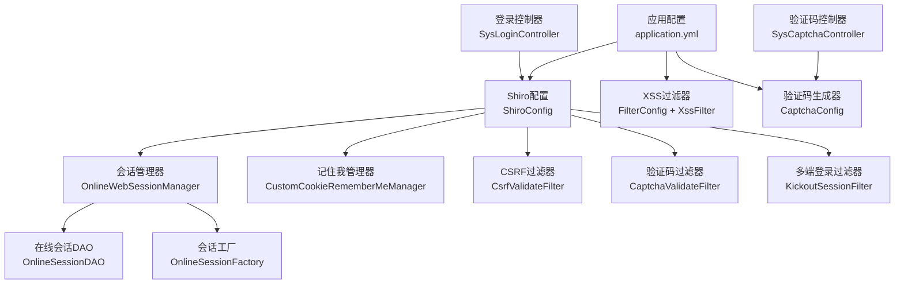
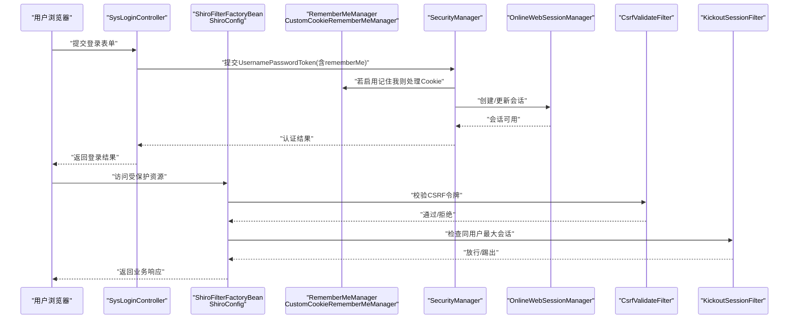
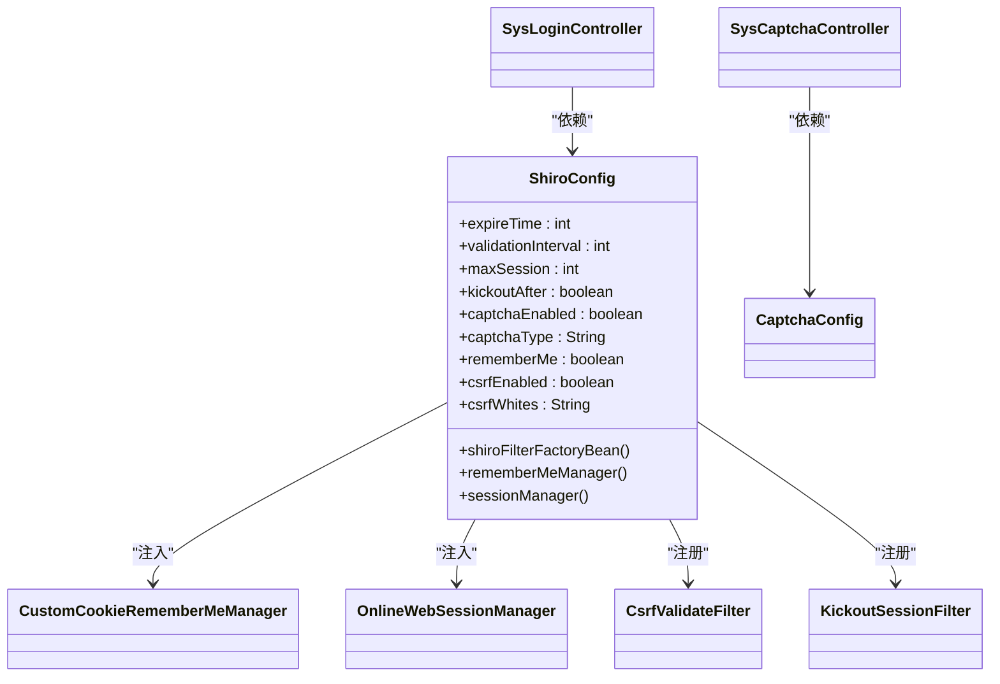

# 安全配置与最佳实践

<cite>
**本文引用的文件**
- [ShiroConfig.java](file://ruoyi-framework/src/main/java/com/ruoyi/framework/config/ShiroConfig.java)
- [CaptchaConfig.java](file://ruoyi-framework/src/main/java/com/ruoyi/framework/config/CaptchaConfig.java)
- [application.yml](file://ruoyi-admin/src/main/resources/application.yml)
- [ehcache-shiro.xml](file://ruoyi-admin/src/main/resources/ehcache/ehcache-shiro.xml)
- [SysLoginController.java](file://ruoyi-admin/src/main/java/com/ruoyi/web/controller/system/SysLoginController.java)
- [SysCaptchaController.java](file://ruoyi-admin/src/main/java/com/ruoyi/web/controller/system/SysCaptchaController.java)
- [CustomCookieRememberMeManager.java](file://ruoyi-framework/src/main/java/com/ruoyi/framework/shiro/rememberMe/CustomCookieRememberMeManager.java)
- [CsrfValidateFilter.java](file://ruoyi-framework/src/main/java/com/ruoyi/framework/shiro/web/filter/csrf/CsrfValidateFilter.java)
- [KickoutSessionFilter.java](file://ruoyi-framework/src/main/java/com/ruoyi/framework/shiro/web/filter/kickout/KickoutSessionFilter.java)
- [OnlineWebSessionManager.java](file://ruoyi-framework/src/main/java/com/ruoyi/framework/shiro/web/session/OnlineWebSessionManager.java)
- [FilterConfig.java](file://ruoyi-framework/src/main/java/com/ruoyi/framework/config/FilterConfig.java)
- [XssFilter.java](file://ruoyi-common/src/main/java/com/ruoyi/common/xss/XssFilter.java)
- [PermitAllUrlProperties.java](file://ruoyi-framework/src/main/java/com/ruoyi/framework/config/properties/PermitAllUrlProperties.java)
- [ShiroConstants.java](file://ruoyi-common/src/main/java/com/ruoyi/common/constant/ShiroConstants.java)
</cite>

## 目录
1. [简介](#简介)
2. [项目结构](#项目结构)
3. [核心组件](#核心组件)
4. [架构总览](#架构总览)
5. [详细组件分析](#详细组件分析)
6. [依赖关系分析](#依赖关系分析)
7. [性能考量](#性能考量)
8. [故障排查指南](#故障排查指南)
9. [结论](#结论)
10. [附录](#附录)

## 简介
本文件面向RuoYi系统在生产环境中的安全配置与最佳实践，围绕Shiro权限体系、验证码、CSRF防护、记住我、XSS防护、会话与缓存、以及安全头与HTTPS等主题展开。文档同时给出参数说明、优先级与覆盖规则、生产建议、漏洞扫描与渗透测试策略、检查清单、部署前验证步骤与应急响应预案，并提供可追溯的配置示例路径与故障排除指引。

## 项目结构
RuoYi的安全相关能力主要由以下模块协同实现：
- 配置层：application.yml集中承载Shiro、CSRF、XSS、会话与缓存等关键参数
- 过滤器与拦截器：ShiroConfig装配过滤链，结合自定义过滤器完成验证码、CSRF、多端登录控制、在线会话同步
- 会话与缓存：OnlineWebSessionManager与ehcache-shiro.xml共同保障会话有效性与缓存策略
- 控制器：SysLoginController与SysCaptchaController负责登录入口与验证码生成
- 安全工具：XssFilter、PermitAllUrlProperties等辅助安全策略落地

图表来源
- [application.yml:86-140](file://ruoyi-admin/src/main/resources/application.yml#L86-L140)
- [ShiroConfig.java:296-346](file://ruoyi-framework/src/main/java/com/ruoyi/framework/config/ShiroConfig.java#L296-L346)
- [OnlineWebSessionManager.java:29-176](file://ruoyi-framework/src/main/java/com/ruoyi/framework/shiro/web/session/OnlineWebSessionManager.java#L29-L176)
- [CustomCookieRememberMeManager.java:21-80](file://ruoyi-framework/src/main/java/com/ruoyi/framework/shiro/rememberMe/CustomCookieRememberMeManager.java#L21-L80)
- [CsrfValidateFilter.java:20-77](file://ruoyi-framework/src/main/java/com/ruoyi/framework/shiro/web/filter/csrf/CsrfValidateFilter.java#L20-L77)
- [KickoutSessionFilter.java:31-176](file://ruoyi-framework/src/main/java/com/ruoyi/framework/shiro/web/filter/kickout/KickoutSessionFilter.java#L31-L176)
- [FilterConfig.java:21-45](file://ruoyi-framework/src/main/java/com/ruoyi/framework/config/FilterConfig.java#L21-L45)
- [XssFilter.java:21-74](file://ruoyi-common/src/main/java/com/ruoyi/common/xss/XssFilter.java#L21-L74)
- [CaptchaConfig.java:16-84](file://ruoyi-framework/src/main/java/com/ruoyi/framework/config/CaptchaConfig.java#L16-L84)
- [SysLoginController.java:29-83](file://ruoyi-admin/src/main/java/com/ruoyi/web/controller/system/SysLoginController.java#L29-L83)
- [SysCaptchaController.java:25-92](file://ruoyi-admin/src/main/java/com/ruoyi/web/controller/system/SysCaptchaController.java#L25-L92)

章节来源
- [application.yml:16-154](file://ruoyi-admin/src/main/resources/application.yml#L16-L154)
- [ShiroConfig.java:49-449](file://ruoyi-framework/src/main/java/com/ruoyi/framework/config/ShiroConfig.java#L49-L449)

## 核心组件
- Shiro配置与过滤链：集中于ShiroConfig，定义会话超时、验证周期、最大会话数、踢出策略、验证码开关与类型、记住我Cookie属性、CSRF开关与白名单、以及过滤器链装配
- 验证码：CaptchaConfig提供两种Kaptcha实例（字符与算术），SysCaptchaController生成验证码图片并写入Session
- CSRF防护：CsrfValidateFilter校验请求头中的CSRF令牌，支持白名单匹配
- 记住我：CustomCookieRememberMeManager定制序列化与权限字符串处理，ShiroConfig注入cipherKey与Cookie属性
- 多端登录控制：KickoutSessionFilter基于缓存与SessionManager实现同用户最大会话数控制与踢出逻辑
- 在线会话管理：OnlineWebSessionManager扩展属性变更标记与批量过期清理
- XSS防护：FilterConfig按配置启用XssFilter，XssFilter对非GET/DELETE请求进行包装清洗
- 全局放行URL：PermitAllUrlProperties扫描带Anonymous注解的Controller方法，动态构建“匿名访问”白名单
- 常量与会话键：ShiroConstants统一CSRF、验证码、在线会话等键名

章节来源
- [ShiroConfig.java:52-147](file://ruoyi-framework/src/main/java/com/ruoyi/framework/config/ShiroConfig.java#L52-L147)
- [CaptchaConfig.java:18-82](file://ruoyi-framework/src/main/java/com/ruoyi/framework/config/CaptchaConfig.java#L18-L82)
- [SysCaptchaController.java:37-92](file://ruoyi-admin/src/main/java/com/ruoyi/web/controller/system/SysCaptchaController.java#L37-L92)
- [CsrfValidateFilter.java:27-59](file://ruoyi-framework/src/main/java/com/ruoyi/framework/shiro/web/filter/csrf/CsrfValidateFilter.java#L27-L59)
- [CustomCookieRememberMeManager.java:26-78](file://ruoyi-framework/src/main/java/com/ruoyi/framework/shiro/rememberMe/CustomCookieRememberMeManager.java#L26-L78)
- [KickoutSessionFilter.java:53-148](file://ruoyi-framework/src/main/java/com/ruoyi/framework/shiro/web/filter/kickout/KickoutSessionFilter.java#L53-L148)
- [OnlineWebSessionManager.java:33-168](file://ruoyi-framework/src/main/java/com/ruoyi/framework/shiro/web/session/OnlineWebSessionManager.java#L33-L168)
- [FilterConfig.java:29-43](file://ruoyi-framework/src/main/java/com/ruoyi/framework/config/FilterConfig.java#L29-L43)
- [XssFilter.java:42-67](file://ruoyi-common/src/main/java/com/ruoyi/common/xss/XssFilter.java#L42-L67)
- [PermitAllUrlProperties.java:38-94](file://ruoyi-framework/src/main/java/com/ruoyi/framework/config/properties/PermitAllUrlProperties.java#L38-L94)
- [ShiroConstants.java:36-74](file://ruoyi-common/src/main/java/com/ruoyi/common/constant/ShiroConstants.java#L36-L74)

## 架构总览
下图展示登录与安全过滤的关键交互流程：

图表来源
- [SysLoginController.java:55-75](file://ruoyi-admin/src/main/java/com/ruoyi/web/controller/system/SysLoginController.java#L55-L75)
- [ShiroConfig.java:296-346](file://ruoyi-framework/src/main/java/com/ruoyi/framework/config/ShiroConfig.java#L296-L346)
- [CustomCookieRememberMeManager.java:26-78](file://ruoyi-framework/src/main/java/com/ruoyi/framework/shiro/rememberMe/CustomCookieRememberMeManager.java#L26-L78)
- [CsrfValidateFilter.java:27-59](file://ruoyi-framework/src/main/java/com/ruoyi/framework/shiro/web/filter/csrf/CsrfValidateFilter.java#L27-L59)
- [KickoutSessionFilter.java:53-148](file://ruoyi-framework/src/main/java/com/ruoyi/framework/shiro/web/filter/kickout/KickoutSessionFilter.java#L53-L148)

## 详细组件分析

### Shiro配置与过滤链
- 关键参数
  - 会话：expireTime、validationInterval、maxSession、kickoutAfter
  - 验证码：captchaEnabled、captchaType
  - Cookie：domain、path、httpOnly、maxAge、cipherKey
  - 认证：loginUrl、unauthorizedUrl
  - 记住我：enabled
  - CSRF：enabled、whites
- 过滤链要点
  - 静态资源匿名访问
  - /login与/register附加captchaValidate
  - 全站默认"user,kickout,onlineSession,syncOnlineSession,csrfValidateFilter"
  - 动态匿名URL来自PermitAllUrlProperties
- 会话与缓存
  - OnlineWebSessionManager设置全局超时、禁用JSESSIONID、启用定时校验、注入OnlineSessionDAO与Factory
  - EhCacheManager从ehcache-shiro.xml加载缓存配置，命名空间与ShiroConstants一致

章节来源
- [ShiroConfig.java:52-147](file://ruoyi-framework/src/main/java/com/ruoyi/framework/config/ShiroConfig.java#L52-L147)
- [ShiroConfig.java:296-346](file://ruoyi-framework/src/main/java/com/ruoyi/framework/config/ShiroConfig.java#L296-L346)
- [OnlineWebSessionManager.java:232-252](file://ruoyi-framework/src/main/java/com/ruoyi/framework/shiro/web/session/OnlineWebSessionManager.java#L232-L252)
- [ehcache-shiro.xml:15-91](file://ruoyi-admin/src/main/resources/ehcache/ehcache-shiro.xml#L15-L91)

### 验证码设置
- 生成器
  - 字符与算术两类Kaptcha实例，分别设置尺寸、字体、干扰样式、会话键等
- 生成接口
  - SysCaptchaController根据type参数返回不同验证码图片，并将正确答案写入Session
- 验证流程
  - ShiroConfig将captchaValidate过滤器绑定至/login与/register，结合ShiroConstants中的验证码键进行校验

章节来源
- [CaptchaConfig.java:18-82](file://ruoyi-framework/src/main/java/com/ruoyi/framework/config/CaptchaConfig.java#L18-L82)
- [SysCaptchaController.java:37-92](file://ruoyi-admin/src/main/java/com/ruoyi/web/controller/system/SysCaptchaController.java#L37-L92)
- [ShiroConfig.java:372-378](file://ruoyi-framework/src/main/java/com/ruoyi/framework/config/ShiroConfig.java#L372-L378)
- [ShiroConstants.java:50-74](file://ruoyi-common/src/main/java/com/ruoyi/common/constant/ShiroConstants.java#L50-L74)

### CSRF防护
- 过滤器行为
  - 仅对POST请求校验；白名单匹配直接放行；从Session读取csrf_token并与请求头X-CSRF-Token比对
- 配置项
  - application.yml中csrf.enabled与csrf.whites决定开关与例外路径
- 响应策略
  - 非AJAX请求重定向，AJAX返回标准错误结构

章节来源
- [CsrfValidateFilter.java:27-59](file://ruoyi-framework/src/main/java/com/ruoyi/framework/shiro/web/filter/csrf/CsrfValidateFilter.java#L27-L59)
- [application.yml:134-140](file://ruoyi-admin/src/main/resources/application.yml#L134-L140)
- [ShiroConstants.java:36-44](file://ruoyi-common/src/main/java/com/ruoyi/common/constant/ShiroConstants.java#L36-L44)

### 记住我功能
- Cookie属性
  - 域、路径、HttpOnly、过期天数、cipherKey由ShiroConfig注入
- 安全增强
  - CustomCookieRememberMeManager在序列化前清空角色权限字符串，避免请求头过大；恢复身份时再补回权限
- 生产建议
  - 明确cipherKey并妥善保管；若更换密钥将导致旧Cookie失效

章节来源
- [CustomCookieRememberMeManager.java:26-78](file://ruoyi-framework/src/main/java/com/ruoyi/framework/shiro/rememberMe/CustomCookieRememberMeManager.java#L26-L78)
- [ShiroConfig.java:383-409](file://ruoyi-framework/src/main/java/com/ruoyi/framework/config/ShiroConfig.java#L383-L409)
- [application.yml:109](file://ruoyi-admin/src/main/resources/application.yml#L109)

### 多端登录与会话控制
- 机制
  - KickoutSessionFilter维护用户会话队列，超过maxSession则按kickoutAfter策略踢出旧会话
  - OnlineWebSessionManager标记属性变更并同步在线会话
- 配置
  - application.yml中session.maxSession、session.kickoutAfter、session.expireTime、session.validationInterval

章节来源
- [KickoutSessionFilter.java:53-148](file://ruoyi-framework/src/main/java/com/ruoyi/framework/shiro/web/filter/kickout/KickoutSessionFilter.java#L53-L148)
- [OnlineWebSessionManager.java:33-90](file://ruoyi-framework/src/main/java/com/ruoyi/framework/shiro/web/session/OnlineWebSessionManager.java#L33-L90)
- [application.yml:110-121](file://ruoyi-admin/src/main/resources/application.yml#L110-L121)

### XSS防护
- 启用条件
  - application.yml中xss.enabled为true时，FilterConfig注册XssFilter
- 过滤范围
  - XssFilter对非GET/DELETE请求进行包装清洗，支持excludes白名单
- URL模式
  - xss.urlPatterns与xss.excludes由application.yml配置

章节来源
- [FilterConfig.java:21-45](file://ruoyi-framework/src/main/java/com/ruoyi/framework/config/FilterConfig.java#L21-L45)
- [XssFilter.java:42-67](file://ruoyi-common/src/main/java/com/ruoyi/common/xss/XssFilter.java#L42-L67)
- [application.yml:125-133](file://ruoyi-admin/src/main/resources/application.yml#L125-L133)

### 全局放行URL与匿名访问
- 动态发现
  - PermitAllUrlProperties扫描带Anonymous注解的Controller方法，拼装通配URL并注入Shiro过滤链为"anon"
- 与静态白名单叠加
  - ShiroConfig在过滤链中先加入PermitAllUrlProperties解析出的URL，再追加"/login"等

章节来源
- [PermitAllUrlProperties.java:38-94](file://ruoyi-framework/src/main/java/com/ruoyi/framework/config/properties/PermitAllUrlProperties.java#L38-L94)
- [ShiroConfig.java:320-327](file://ruoyi-framework/src/main/java/com/ruoyi/framework/config/ShiroConfig.java#L320-L327)

## 依赖关系分析
- 组件耦合
  - ShiroConfig对RememberMeManager、SessionManager、EhCacheManager、各自定义Filter强依赖
  - OnlineWebSessionManager依赖在线会话服务以批量清理过期会话
  - SysLoginController与SysCaptchaController分别对接Shiro与验证码生成器
- 外部依赖
  - Ehcache缓存、Kaptcha验证码库、Shiro Spring集成
- 循环依赖
  - 代码层面未见循环依赖迹象

图表来源
- [ShiroConfig.java:296-409](file://ruoyi-framework/src/main/java/com/ruoyi/framework/config/ShiroConfig.java#L296-L409)
- [CustomCookieRememberMeManager.java:21-80](file://ruoyi-framework/src/main/java/com/ruoyi/framework/shiro/rememberMe/CustomCookieRememberMeManager.java#L21-L80)
- [OnlineWebSessionManager.java:29-176](file://ruoyi-framework/src/main/java/com/ruoyi/framework/shiro/web/session/OnlineWebSessionManager.java#L29-L176)
- [CsrfValidateFilter.java:20-77](file://ruoyi-framework/src/main/java/com/ruoyi/framework/shiro/web/filter/csrf/CsrfValidateFilter.java#L20-L77)
- [KickoutSessionFilter.java:31-176](file://ruoyi-framework/src/main/java/com/ruoyi/framework/shiro/web/filter/kickout/KickoutSessionFilter.java#L31-L176)
- [CaptchaConfig.java:16-84](file://ruoyi-framework/src/main/java/com/ruoyi/framework/config/CaptchaConfig.java#L16-L84)
- [SysLoginController.java:29-83](file://ruoyi-admin/src/main/java/com/ruoyi/web/controller/system/SysLoginController.java#L29-L83)
- [SysCaptchaController.java:25-92](file://ruoyi-admin/src/main/java/com/ruoyi/web/controller/system/SysCaptchaController.java#L25-L92)

## 性能考量
- 会话与缓存
  - 合理设置validationInterval与expireTime，避免过于频繁的会话扫描
  - Ehcache命名与过期策略需与业务负载匹配，避免内存与磁盘压力
- CSRF与验证码
  - CSRF仅对POST生效，白名单尽量精确，减少不必要的校验开销
  - 验证码图片生成与Session写入成本可控，注意并发场景下的Session竞争
- XSS过滤
  - 仅对必要URL启用，避免对静态资源与GET请求造成额外负担

[本节为通用建议，无需特定文件来源]

## 故障排查指南
- 登录失败/验证码错误
  - 检查application.yml中shiro.user.captchaEnabled与captchaType
  - 确认SysCaptchaController已将正确答案写入Session，且ShiroConfig的captchaValidate过滤器已启用
  - 参考路径：[application.yml:95-98](file://ruoyi-admin/src/main/resources/application.yml#L95-L98)、[SysCaptchaController.java:66](file://ruoyi-admin/src/main/java/com/ruoyi/web/controller/system/SysCaptchaController.java#L66)、[ShiroConfig.java:372-378](file://ruoyi-framework/src/main/java/com/ruoyi/framework/config/ShiroConfig.java#L372-L378)
- CSRF校验失败
  - 确认请求头X-CSRF-Token存在且与Session中的csrf_token一致
  - 检查application.yml中csrf.enabled与csrf.whites配置
  - 参考路径：[CsrfValidateFilter.java:43-51](file://ruoyi-framework/src/main/java/com/ruoyi/framework/shiro/web/filter/csrf/CsrfValidateFilter.java#L43-L51)、[application.yml:137-139](file://ruoyi-admin/src/main/resources/application.yml#L137-L139)
- 记住我Cookie无效
  - 检查cipherKey是否配置且与生成时一致；确认Cookie域、路径、HttpOnly、maxAge
  - 参考路径：[application.yml:108-109](file://ruoyi-admin/src/main/resources/application.yml#L108-L109)、[ShiroConfig.java:383-409](file://ruoyi-framework/src/main/java/com/ruoyi/framework/config/ShiroConfig.java#L383-L409)
- 多端登录被踢出
  - 检查session.maxSession与session.kickoutAfter；确认KickoutSessionFilter生效
  - 参考路径：[application.yml:117-120](file://ruoyi-admin/src/main/resources/application.yml#L117-L120)、[KickoutSessionFilter.java:94-126](file://ruoyi-framework/src/main/java/com/ruoyi/framework/shiro/web/filter/kickout/KickoutSessionFilter.java#L94-L126)
- XSS导致请求被拦截
  - 检查xss.enabled、xss.urlPatterns与xss.excludes；确认非GET/DELETE请求被正确包装
  - 参考路径：[FilterConfig.java:21-45](file://ruoyi-framework/src/main/java/com/ruoyi/framework/config/FilterConfig.java#L21-L45)、[XssFilter.java:42-67](file://ruoyi-common/src/main/java/com/ruoyi/common/xss/XssFilter.java#L42-L67)
- 全局放行URL未生效
  - 检查Anonymous注解是否正确标注；确认PermitAllUrlProperties扫描包路径与生成的urls
  - 参考路径：[PermitAllUrlProperties.java:38-94](file://ruoyi-framework/src/main/java/com/ruoyi/framework/config/properties/PermitAllUrlProperties.java#L38-L94)、[ShiroConfig.java:320-327](file://ruoyi-framework/src/main/java/com/ruoyi/framework/config/ShiroConfig.java#L320-L327)

## 结论
RuoYi通过ShiroConfig集中管理安全策略，结合验证码、CSRF、记住我、多端登录与在线会话同步等机制，形成完整的安全闭环。生产部署应重点关注HTTPS、安全头、会话超时与缓存策略、XSS与CSRF白名单、以及密钥与Cookie安全。建议配合OWASP Top 10进行渗透测试与漏洞扫描，持续完善安全基线。

[本节为总结性内容，无需特定文件来源]

## 附录

### 安全配置优先级与覆盖规则
- 配置来源优先级（从高到低）
  1) 运行时配置（如动态参数、环境变量覆盖）
  2) 模块配置（各模块application.yml片段）
  3) 全局配置（ruoyi-admin/application.yml）
- 覆盖规则
  - Shiro过滤链：静态白名单 → 动态匿名URL → 具体路径过滤器 → 全站默认过滤器
  - 记住我：cipherKey显式配置优先于自动生成
  - CSRF：白名单优先于校验

章节来源
- [application.yml:86-140](file://ruoyi-admin/src/main/resources/application.yml#L86-L140)
- [ShiroConfig.java:320-346](file://ruoyi-framework/src/main/java/com/ruoyi/framework/config/ShiroConfig.java#L320-L346)
- [PermitAllUrlProperties.java:38-94](file://ruoyi-framework/src/main/java/com/ruoyi/framework/config/properties/PermitAllUrlProperties.java#L38-L94)

### 生产环境安全配置最佳实践
- HTTPS与安全头
  - 强制HTTPS重定向与HSTS
  - 设置Content-Security-Policy、X-Frame-Options、X-Content-Type-Options、Referrer-Policy
- 会话安全
  - 启用HttpOnly与Secure（如使用HTTPS）
  - 合理设置maxAge与validationInterval
  - 使用强cipherKey并定期轮换
- 日志与审计
  - 记录登录、登出、认证失败、会话过期与踢出事件
  - 审计敏感操作（新增/修改用户、角色、权限）

[本节为通用建议，无需特定文件来源]

### OWASP Top 10防护策略与检测方法
- 注入与认证缺陷
  - 输入校验与参数化查询；最小权限原则；失败锁定与告警
- XSS与CSRF
  - 启用XSS过滤与CSRF校验；白名单与严格CSP
- 权限与会话管理
  - 角色权限最小化；会话超时与踢出；禁止会话固定
- 敏感数据与日志
  - 数据脱敏与加密；避免敏感信息落库与日志

[本节为通用建议，无需特定文件来源]

### 安全配置检查清单
- Shiro
  - 登录页验证码开关与类型
  - 记住我开关与cipherKey
  - 会话超时、验证周期、最大会话数、踢出策略
- CSRF
  - 开关与白名单
- XSS
  - 开关、URL模式与排除列表
- 缓存与会话
  - Ehcache命名与过期策略
- 日志与审计
  - 登录、认证失败、会话事件记录

章节来源
- [application.yml:95-140](file://ruoyi-admin/src/main/resources/application.yml#L95-L140)
- [ehcache-shiro.xml:15-91](file://ruoyi-admin/src/main/resources/ehcache/ehcache-shiro.xml#L15-L91)

### 部署前安全验证步骤
- 参数核对
  - 逐项对照检查application.yml关键参数
- 过滤链验证
  - 登录页验证码生成与校验
  - CSRF白名单路径可用性
  - 全站默认过滤器链生效
- 会话与缓存
  - 在线会话同步与过期清理
  - Ehcache缓存命中与过期
- 安全扫描
  - 静态扫描与渗透测试（参考OWASP Top 10）

章节来源
- [SysCaptchaController.java:37-92](file://ruoyi-admin/src/main/java/com/ruoyi/web/controller/system/SysCaptchaController.java#L37-L92)
- [CsrfValidateFilter.java:27-59](file://ruoyi-framework/src/main/java/com/ruoyi/framework/shiro/web/filter/csrf/CsrfValidateFilter.java#L27-L59)
- [OnlineWebSessionManager.java:95-168](file://ruoyi-framework/src/main/java/com/ruoyi/framework/shiro/web/session/OnlineWebSessionManager.java#L95-L168)

### 应急响应预案
- 事件分级
  - 认证失败风暴、会话异常、CSRF攻击、XSS事件
- 处置流程
  - 快速隔离、日志取证、临时降级（如关闭CSRF或验证码）、修复发布与复盘
- 恢复验证
  - 修复后进行端到端回归与安全扫描

[本节为通用建议，无需特定文件来源]