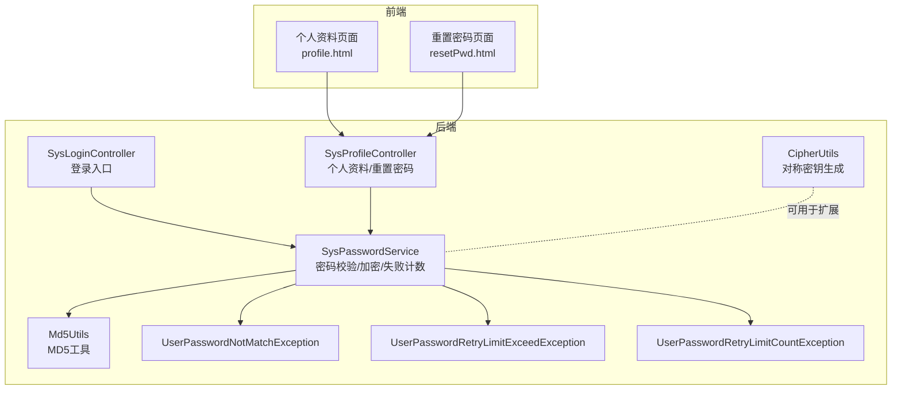
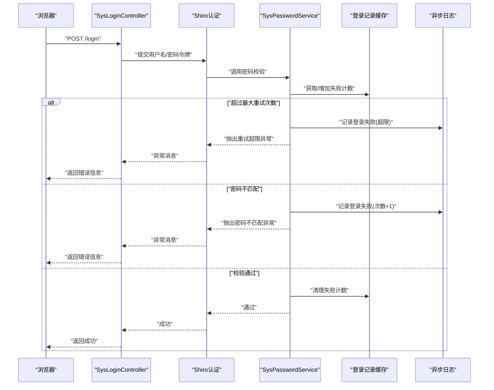
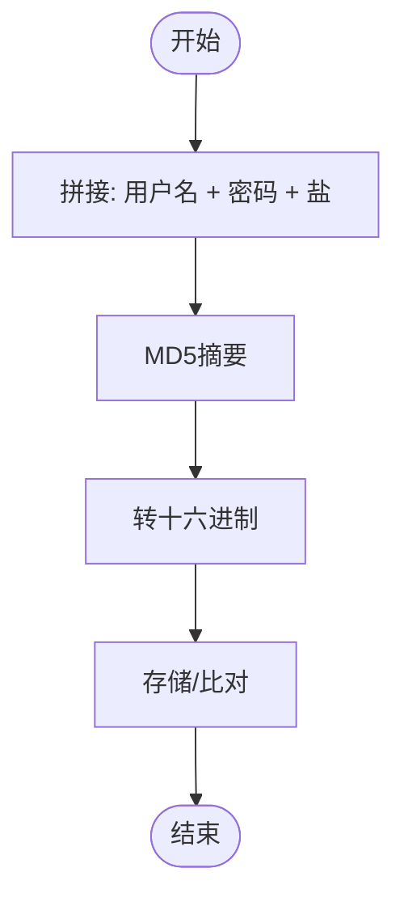
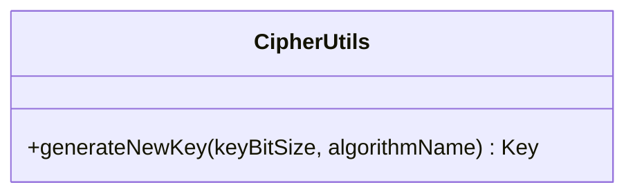
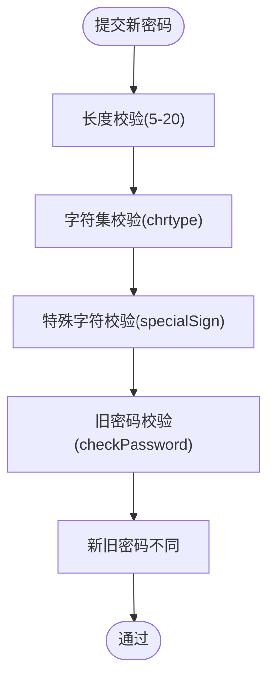
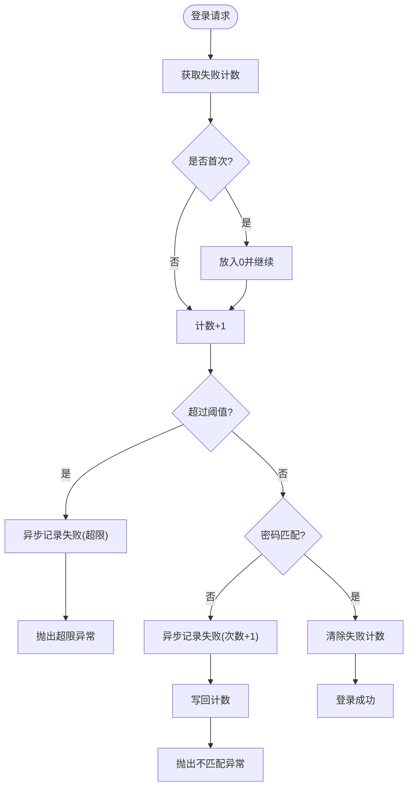
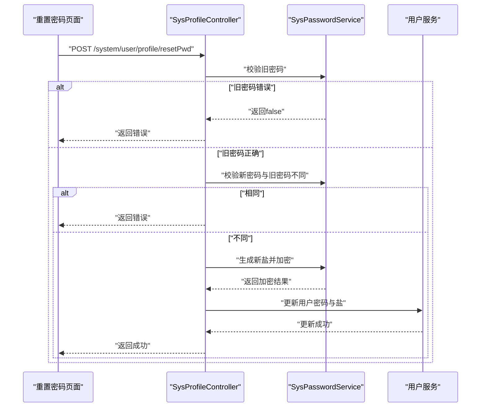
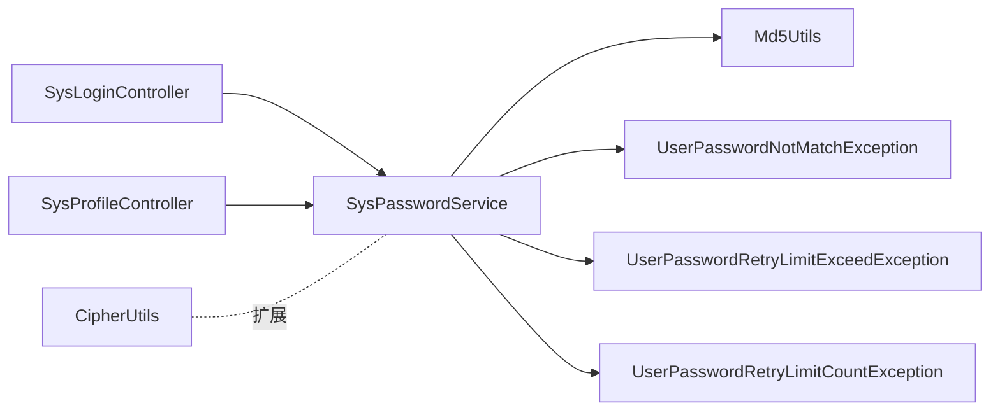

# 密码安全机制

<cite>
**本文引用的文件**
- [ruoyi-framework/SysPasswordService.java](file://ruoyi-framework/src/main/java/com/ruoyi/framework/shiro/service/SysPasswordService.java)
- [ruoyi-common/Md5Utils.java](file://ruoyi-common/src/main/java/com/ruoyi/common/utils/security/Md5Utils.java)
- [ruoyi-common/CipherUtils.java](file://ruoyi-common/src/main/java/com/ruoyi/common/utils/security/CipherUtils.java)
- [ruoyi-admin/SysProfileController.java](file://ruoyi-admin/src/main/java/com/ruoyi/web/controller/system/SysProfileController.java)
- [ruoyi-admin/SysLoginController.java](file://ruoyi-admin/src/main/java/com/ruoyi/web/controller/system/SysLoginController.java)
- [ruoyi-admin/SysIndexController.java](file://ruoyi-admin/src/main/java/com/ruoyi/web/controller/system/SysIndexController.java)
- [ruoyi-common/UserPasswordNotMatchException.java](file://ruoyi-common/src/main/java/com/ruoyi/common/exception/user/UserPasswordNotMatchException.java)
- [ruoyi-common/UserPasswordRetryLimitExceedException.java](file://ruoyi-common/src/main/java/com/ruoyi/common/exception/user/UserPasswordRetryLimitExceedException.java)
- [ruoyi-common/UserPasswordRetryLimitCountException.java](file://ruoyi-common/src/main/java/com/ruoyi/common/exception/user/UserPasswordRetryLimitCountException.java)
- [ruoyi-admin/resetPwd.html](file://ruoyi-admin/src/main/resources/templates/system/user/profile/resetPwd.html)
- [ruoyi-admin/profile.html](file://ruoyi-admin/src/main/resources/templates/system/user/profile/profile.html)
- [ruoyi-admin/application.yml](file://ruoyi-admin/src/main/resources/application.yml)
- [ruoyi-system/ry_20260319.sql](file://sql/ry_20260319.sql)
</cite>

## 目录
1. [引言](#引言)
2. [项目结构](#项目结构)
3. [核心组件](#核心组件)
4. [架构总览](#架构总览)
5. [详细组件分析](#详细组件分析)
6. [依赖分析](#依赖分析)
7. [性能考虑](#性能考虑)
8. [故障排查指南](#故障排查指南)
9. [结论](#结论)
10. [附录](#附录)

## 引言
本文件面向RuoYi系统的密码安全机制，围绕以下目标展开：解释密码加密算法（MD5加盐）、对称加密工具（AES密钥生成）、SHA-256哈希的应用场景；梳理密码强度校验规则（长度、复杂度、字符集限制）；阐述登录失败重试限制（失败计数、临时锁定、解锁）；给出密码修改流程（旧密验证、新密安全检查、盐值更新）；并提供配置最佳实践、策略定制方法与安全审计日志建议。

## 项目结构
RuoYi密码安全相关能力分布于多个模块：
- 前端模板层：用户个人资料与重置密码页面，包含客户端表单校验与提示。
- 控制器层：登录控制器、个人资料控制器，负责接收请求、调用服务与返回结果。
- 服务层：密码服务（登录校验、加密、失败计数），Shiro集成用于认证。
- 工具与异常：MD5工具、对称密钥生成工具、密码相关异常类型。
- 配置与数据库：应用配置、系统配置项（密码字符范围、初始修改策略、密码有效期等）。

图表来源
- [ruoyi-admin/SysLoginController.java:55-75](file://ruoyi-admin/src/main/java/com/ruoyi/web/controller/system/SysLoginController.java#L55-L75)
- [ruoyi-admin/SysProfileController.java:77-98](file://ruoyi-admin/src/main/java/com/ruoyi/web/controller/system/SysProfileController.java#L77-L98)
- [ruoyi-framework/SysPasswordService.java:42-84](file://ruoyi-framework/src/main/java/com/ruoyi/framework/shiro/service/SysPasswordService.java#L42-L84)
- [ruoyi-common/Md5Utils.java:55-66](file://ruoyi-common/src/main/java/com/ruoyi/common/utils/security/Md5Utils.java#L55-L66)
- [ruoyi-common/CipherUtils.java:21-35](file://ruoyi-common/src/main/java/com/ruoyi/common/utils/security/CipherUtils.java#L21-L35)
- [ruoyi-common/UserPasswordNotMatchException.java:8-16](file://ruoyi-common/src/main/java/com/ruoyi/common/exception/user/UserPasswordNotMatchException.java#L8-L16)
- [ruoyi-common/UserPasswordRetryLimitExceedException.java:8-16](file://ruoyi-common/src/main/java/com/ruoyi/common/exception/user/UserPasswordRetryLimitExceedException.java#L8-L16)
- [ruoyi-common/UserPasswordRetryLimitCountException.java:8-16](file://ruoyi-common/src/main/java/com/ruoyi/common/exception/user/UserPasswordRetryLimitCountException.java#L8-L16)

章节来源
- [ruoyi-admin/SysLoginController.java:55-75](file://ruoyi-admin/src/main/java/com/ruoyi/web/controller/system/SysLoginController.java#L55-L75)
- [ruoyi-admin/SysProfileController.java:77-98](file://ruoyi-admin/src/main/java/com/ruoyi/web/controller/system/SysProfileController.java#L77-L98)
- [ruoyi-framework/SysPasswordService.java:42-84](file://ruoyi-framework/src/main/java/com/ruoyi/framework/shiro/service/SysPasswordService.java#L42-L84)

## 核心组件
- 密码服务（SysPasswordService）
  - 负责登录密码校验、失败次数统计与缓存、成功后清理缓存、使用用户名+密码+盐进行MD5加盐加密。
  - 失败次数阈值通过配置注入，超过阈值抛出“超出最大重试次数”异常。
- MD5工具（Md5Utils）
  - 提供MD5摘要与十六进制转换，作为底层加密工具。
- 对称密钥工具（CipherUtils）
  - 提供对称密钥生成接口，可用于后续扩展AES等对称加密存储或传输场景。
- 个人资料控制器（SysProfileController）
  - 提供旧密码校验接口与重置密码接口，调用密码服务完成验证与加密更新。
- 登录控制器（SysLoginController）
  - 接收登录请求，交由Shiro进行认证，异常信息统一处理。
- 配置与策略
  - 密码字符范围、初始密码修改策略、密码有效期等通过系统配置项控制。
- 异常体系
  - 密码不匹配、重试次数不足、重试次数超限等异常类型，便于前端与日志区分处理。

章节来源
- [ruoyi-framework/SysPasswordService.java:42-84](file://ruoyi-framework/src/main/java/com/ruoyi/framework/shiro/service/SysPasswordService.java#L42-L84)
- [ruoyi-common/Md5Utils.java:55-66](file://ruoyi-common/src/main/java/com/ruoyi/common/utils/security/Md5Utils.java#L55-L66)
- [ruoyi-common/CipherUtils.java:21-35](file://ruoyi-common/src/main/java/com/ruoyi/common/utils/security/CipherUtils.java#L21-L35)
- [ruoyi-admin/SysProfileController.java:77-98](file://ruoyi-admin/src/main/java/com/ruoyi/web/controller/system/SysProfileController.java#L77-L98)
- [ruoyi-admin/SysLoginController.java:55-75](file://ruoyi-admin/src/main/java/com/ruoyi/web/controller/system/SysLoginController.java#L55-L75)
- [ruoyi-common/UserPasswordNotMatchException.java:8-16](file://ruoyi-common/src/main/java/com/ruoyi/common/exception/user/UserPasswordNotMatchException.java#L8-L16)
- [ruoyi-common/UserPasswordRetryLimitExceedException.java:8-16](file://ruoyi-common/src/main/java/com/ruoyi/common/exception/user/UserPasswordRetryLimitExceedException.java#L8-L16)
- [ruoyi-common/UserPasswordRetryLimitCountException.java:8-16](file://ruoyi-common/src/main/java/com/ruoyi/common/exception/user/UserPasswordRetryLimitCountException.java#L8-L16)

## 架构总览
下图展示从登录到密码校验、失败计数与日志记录的整体流程。

图表来源
- [ruoyi-admin/SysLoginController.java:55-75](file://ruoyi-admin/src/main/java/com/ruoyi/web/controller/system/SysLoginController.java#L55-L75)
- [ruoyi-framework/SysPasswordService.java:42-84](file://ruoyi-framework/src/main/java/com/ruoyi/framework/shiro/service/SysPasswordService.java#L42-L84)

## 详细组件分析

### 组件一：密码加密与校验（MD5加盐）
- 加密算法
  - 使用用户名+密码+盐值拼接后进行MD5摘要，并以十六进制形式存储。
  - 该方式属于加盐MD5，可有效缓解彩虹表攻击，但MD5本身已被认为不再适合高强度密码存储场景。
- 工具类
  - Md5Utils提供MD5摘要与十六进制转换，SysPasswordService中通过Shiro的Md5Hash进行最终编码。
- 应用场景
  - 登录校验与密码更新均采用此加盐MD5方案。

图表来源
- [ruoyi-framework/SysPasswordService.java:81-84](file://ruoyi-framework/src/main/java/com/ruoyi/framework/shiro/service/SysPasswordService.java#L81-L84)
- [ruoyi-common/Md5Utils.java:55-66](file://ruoyi-common/src/main/java/com/ruoyi/common/utils/security/Md5Utils.java#L55-L66)

章节来源
- [ruoyi-framework/SysPasswordService.java:81-84](file://ruoyi-framework/src/main/java/com/ruoyi/framework/shiro/service/SysPasswordService.java#L81-L84)
- [ruoyi-common/Md5Utils.java:55-66](file://ruoyi-common/src/main/java/com/ruoyi/common/utils/security/Md5Utils.java#L55-L66)

### 组件二：对称加密工具（AES密钥生成）
- 功能概述
  - 提供基于JCA KeyGenerator的对称密钥生成接口，支持指定算法与位长。
- 应用场景
  - 当前系统登录密码采用加盐MD5；对称密钥工具可用于扩展：如生成AES密钥用于敏感字段加密、会话加密或配置项加密等。
- 注意事项
  - AES密钥需安全保管与轮换，避免硬编码在源码中。

图表来源
- [ruoyi-common/CipherUtils.java:21-35](file://ruoyi-common/src/main/java/com/ruoyi/common/utils/security/CipherUtils.java#L21-L35)

章节来源
- [ruoyi-common/CipherUtils.java:21-35](file://ruoyi-common/src/main/java/com/ruoyi/common/utils/security/CipherUtils.java#L21-L35)

### 组件三：密码强度验证规则
- 客户端校验（页面模板）
  - 新密码长度限制：最小5位、最大20位。
  - 复杂度校验：通过自定义校验器specialSign进行特殊字符校验。
  - 字符集限制：根据系统配置sys.account.chrtype控制字符范围（0任意、1仅数字、2仅字母、3字母+数字、4字母+数字+特殊字符）。
- 服务端校验（控制器）
  - 旧密码远程校验：/system/user/profile/checkPassword接口调用密码服务进行匹配。
  - 新旧密码一致性检查：防止新密码与旧密码相同。
- 建议补充
  - 引入常见弱密码字典校验（如弱口令列表）与复杂度评分（数字、小写、大写、特殊字符种类）。
  - 增强服务端复杂度校验逻辑，避免仅依赖前端。

图表来源
- [ruoyi-admin/resetPwd.html:50-91](file://ruoyi-admin/src/main/resources/templates/system/user/profile/resetPwd.html#L50-L91)
- [ruoyi-admin/SysProfileController.java:79-98](file://ruoyi-admin/src/main/java/com/ruoyi/web/controller/system/SysProfileController.java#L79-L98)
- [ruoyi-admin/profile.html:107-137](file://ruoyi-admin/src/main/resources/templates/system/user/profile/profile.html#L107-L137)

章节来源
- [ruoyi-admin/resetPwd.html:50-91](file://ruoyi-admin/src/main/resources/templates/system/user/profile/resetPwd.html#L50-L91)
- [ruoyi-admin/SysProfileController.java:79-98](file://ruoyi-admin/src/main/java/com/ruoyi/web/controller/system/SysProfileController.java#L79-L98)
- [ruoyi-admin/profile.html:107-137](file://ruoyi-admin/src/main/resources/templates/system/user/profile/profile.html#L107-L137)

### 组件四：登录失败重试限制机制
- 失败计数
  - 使用Shiro缓存中的AtomicInteger记录每个用户的失败次数。
  - 首次访问不存在键时初始化为0，每次失败递增。
- 临时锁定
  - 超过阈值user.password.maxRetryCount后，记录登录失败日志并抛出“超出最大重试次数”异常。
- 解锁机制
  - 成功登录后清除缓存中的失败计数；未实现定时自动解锁，需结合业务策略设计。
- 日志记录
  - 失败时异步记录登录信息，包含失败原因与当前失败次数。

图表来源
- [ruoyi-framework/SysPasswordService.java:42-84](file://ruoyi-framework/src/main/java/com/ruoyi/framework/shiro/service/SysPasswordService.java#L42-L84)

章节来源
- [ruoyi-framework/SysPasswordService.java:42-84](file://ruoyi-framework/src/main/java/com/ruoyi/framework/shiro/service/SysPasswordService.java#L42-L84)
- [ruoyi-common/UserPasswordRetryLimitExceedException.java:8-16](file://ruoyi-common/src/main/java/com/ruoyi/common/exception/user/UserPasswordRetryLimitExceedException.java#L8-L16)
- [ruoyi-common/UserPasswordNotMatchException.java:8-16](file://ruoyi-common/src/main/java/com/ruoyi/common/exception/user/UserPasswordNotMatchException.java#L8-L16)

### 组件五：密码修改流程
- 步骤概览
  - 旧密码校验：调用checkPassword接口确认旧密码。
  - 新旧对比：禁止新密码与旧密码相同。
  - 更新盐值与密码：生成新盐，使用用户名+新密码+新盐进行加盐MD5加密并更新。
  - 写回用户信息：持久化更新并刷新当前会话用户信息。
- 前端交互
  - 页面模板提供旧密码、新密码、确认密码输入与复杂度提示。
  - 表单提交触发保存操作，成功后刷新状态。

图表来源
- [ruoyi-admin/SysProfileController.java:77-98](file://ruoyi-admin/src/main/java/com/ruoyi/web/controller/system/SysProfileController.java#L77-L98)
- [ruoyi-framework/SysPasswordService.java:81-84](file://ruoyi-framework/src/main/java/com/ruoyi/framework/shiro/service/SysPasswordService.java#L81-L84)

章节来源
- [ruoyi-admin/SysProfileController.java:77-98](file://ruoyi-admin/src/main/java/com/ruoyi/web/controller/system/SysProfileController.java#L77-L98)
- [ruoyi-admin/resetPwd.html:50-101](file://ruoyi-admin/src/main/resources/templates/system/user/profile/resetPwd.html#L50-L101)

### 组件六：密码有效期与强制修改策略
- 密码有效期
  - 通过配置sys.account.passwordValidateDays设置密码更新周期（天），超过周期则提示修改。
- 初始密码修改
  - 通过配置sys.account.initPasswordModify控制是否在首次登录且未修改初始密码时强制修改。
- 实现位置
  - 在SysIndexController中提供判断逻辑，用于前端引导用户修改密码。

章节来源
- [ruoyi-admin/SysIndexController.java:162-181](file://ruoyi-admin/src/main/java/com/ruoyi/web/controller/system/SysIndexController.java#L162-L181)
- [sql/ry_20260319.sql:546-549](file://sql/ry_20260319.sql#L546-L549)

## 依赖分析
- 组件耦合
  - SysLoginController依赖Shiro进行认证，SysPasswordService负责具体密码校验与失败计数。
  - SysProfileController依赖SysPasswordService进行旧密码校验与新密码加密更新。
  - Md5Utils与CipherUtils为通用工具，被密码服务与可能的扩展模块复用。
- 外部依赖
  - Shiro缓存用于失败计数持久化；异步日志用于审计记录。
- 循环依赖
  - 未发现循环依赖，职责清晰。

图表来源
- [ruoyi-admin/SysLoginController.java:55-75](file://ruoyi-admin/src/main/java/com/ruoyi/web/controller/system/SysLoginController.java#L55-L75)
- [ruoyi-admin/SysProfileController.java:77-98](file://ruoyi-admin/src/main/java/com/ruoyi/web/controller/system/SysProfileController.java#L77-L98)
- [ruoyi-framework/SysPasswordService.java:42-84](file://ruoyi-framework/src/main/java/com/ruoyi/framework/shiro/service/SysPasswordService.java#L42-L84)
- [ruoyi-common/Md5Utils.java:55-66](file://ruoyi-common/src/main/java/com/ruoyi/common/utils/security/Md5Utils.java#L55-L66)
- [ruoyi-common/CipherUtils.java:21-35](file://ruoyi-common/src/main/java/com/ruoyi/common/utils/security/CipherUtils.java#L21-L35)
- [ruoyi-common/UserPasswordNotMatchException.java:8-16](file://ruoyi-common/src/main/java/com/ruoyi/common/exception/user/UserPasswordNotMatchException.java#L8-L16)
- [ruoyi-common/UserPasswordRetryLimitExceedException.java:8-16](file://ruoyi-common/src/main/java/com/ruoyi/common/exception/user/UserPasswordRetryLimitExceedException.java#L8-L16)
- [ruoyi-common/UserPasswordRetryLimitCountException.java:8-16](file://ruoyi-common/src/main/java/com/ruoyi/common/exception/user/UserPasswordRetryLimitCountException.java#L8-L16)

## 性能考虑
- 缓存命中率
  - 失败计数基于内存缓存，建议结合分布式缓存与过期策略，避免内存膨胀。
- 计算开销
  - MD5计算成本低，但频繁失败计数写回需注意缓存同步与并发安全。
- 日志异步化
  - 登录失败日志采用异步记录，降低阻塞风险。

## 故障排查指南
- 常见问题
  - “密码不匹配”：检查旧密码是否正确、是否被篡改或跨域问题。
  - “超出最大重试次数”：确认user.password.maxRetryCount配置是否合理，是否存在恶意尝试。
  - “新旧密码相同”：确保新密码与旧密码不同。
- 定位手段
  - 查看登录失败日志与失败次数缓存状态。
  - 核对配置项sys.account.chrtype、sys.account.passwordValidateDays、sys.account.initPasswordModify。
  - 检查Shiro缓存与异步日志模块运行状态。

章节来源
- [ruoyi-framework/SysPasswordService.java:42-84](file://ruoyi-framework/src/main/java/com/ruoyi/framework/shiro/service/SysPasswordService.java#L42-L84)
- [ruoyi-common/UserPasswordNotMatchException.java:8-16](file://ruoyi-common/src/main/java/com/ruoyi/common/exception/user/UserPasswordNotMatchException.java#L8-L16)
- [ruoyi-common/UserPasswordRetryLimitExceedException.java:8-16](file://ruoyi-common/src/main/java/com/ruoyi/common/exception/user/UserPasswordRetryLimitExceedException.java#L8-L16)

## 结论
RuoYi当前密码安全机制以“加盐MD5”为核心，配合Shiro缓存实现登录失败重试限制与异步审计日志。页面层提供基础复杂度与字符集约束，服务层完成旧密码校验与新密码加密更新。建议在保持现有机制的基础上，引入更强的密码哈希（如bcrypt/scrypt/argon2）与更严格的复杂度校验、弱口令字典校验，并完善定时解锁与密钥轮换策略，以进一步提升安全性。

## 附录

### 密码安全配置清单
- 登录失败重试上限
  - 配置项：user.password.maxRetryCount
  - 类型：整数
  - 默认值：依据部署配置
  - 作用：超过该次数后临时锁定
- 密码字符范围
  - 配置项：sys.account.chrtype
  - 取值：0任意、1仅数字、2仅字母、3字母+数字、4字母+数字+特殊字符
- 初始密码修改策略
  - 配置项：sys.account.initPasswordModify
  - 取值：0关闭、1开启
- 密码有效期（天）
  - 配置项：sys.account.passwordValidateDays
  - 取值：0不限制、>0有效
- 记住我功能
  - 配置项：shiro.rememberMe.enabled
  - 类型：布尔
  - 作用：控制是否启用“记住我”

章节来源
- [ruoyi-admin/application.yml](file://ruoyi-admin/src/main/resources/application.yml)
- [sql/ry_20260319.sql:546-549](file://sql/ry_20260319.sql#L546-L549)

### 最佳实践与建议
- 密码哈希升级
  - 将加盐MD5替换为bcrypt、scrypt或argon2，提高抗暴力破解能力。
- 复杂度与字典校验
  - 引入弱口令字典与复杂度评分，拒绝常见弱口令与简单序列。
- 安全存储与密钥管理
  - 对称密钥通过CipherUtils生成后，使用安全密钥管理系统（KMS）托管与轮换。
- 审计与告警
  - 登录失败、密码修改、密码过期等事件纳入统一审计日志，设置阈值告警。
- 用户体验
  - 明确提示密码有效期与字符集要求，减少重复失败导致的锁定。