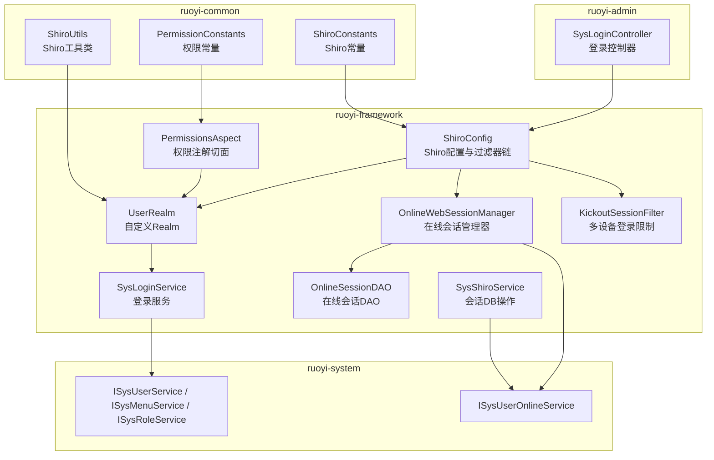
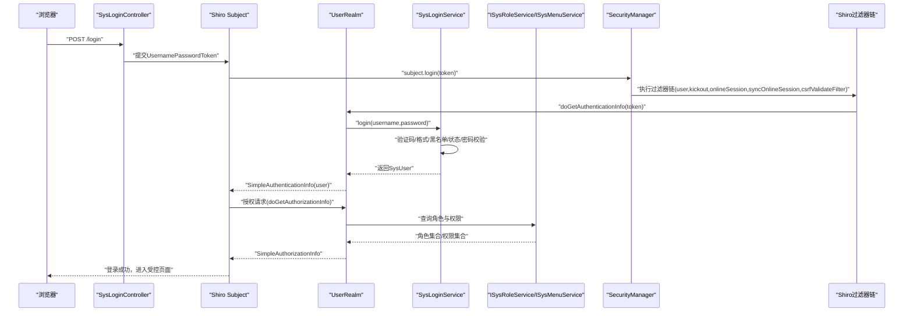
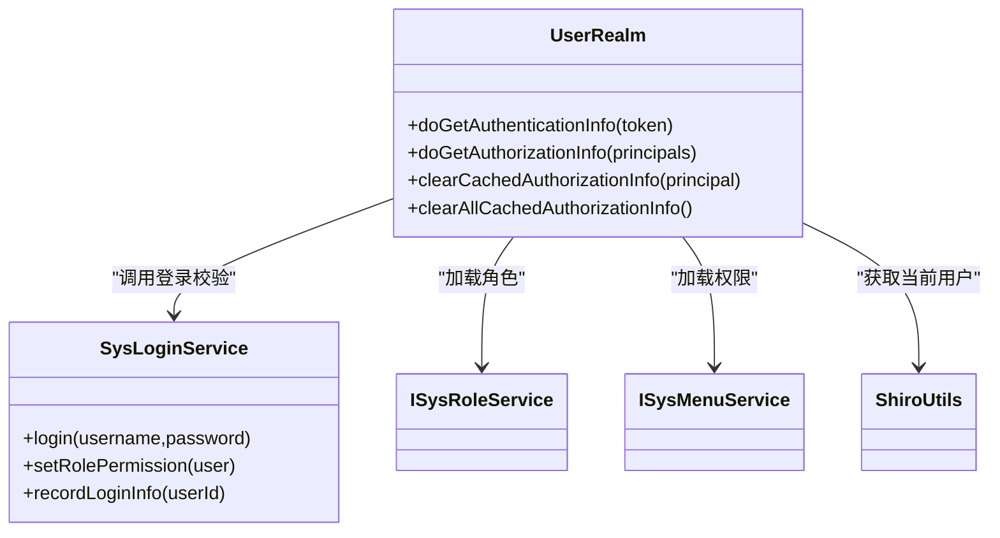
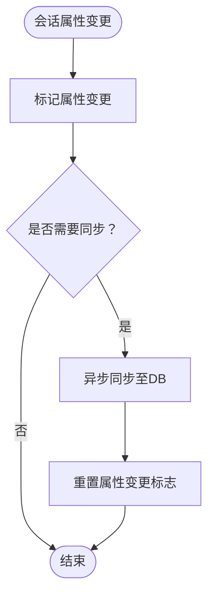
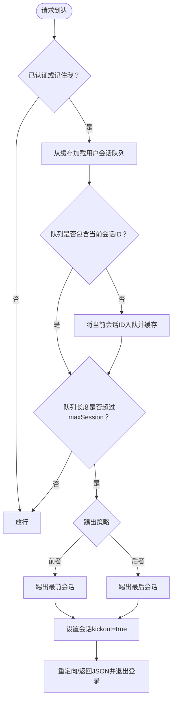
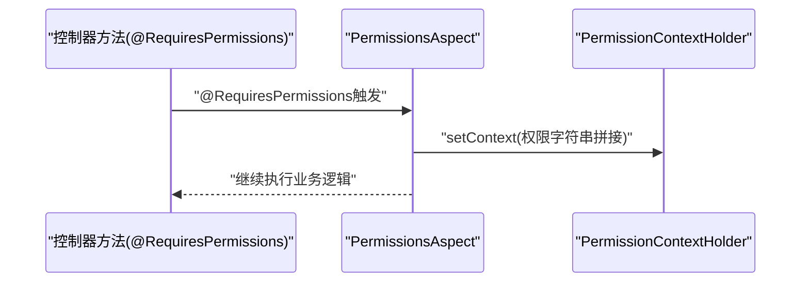
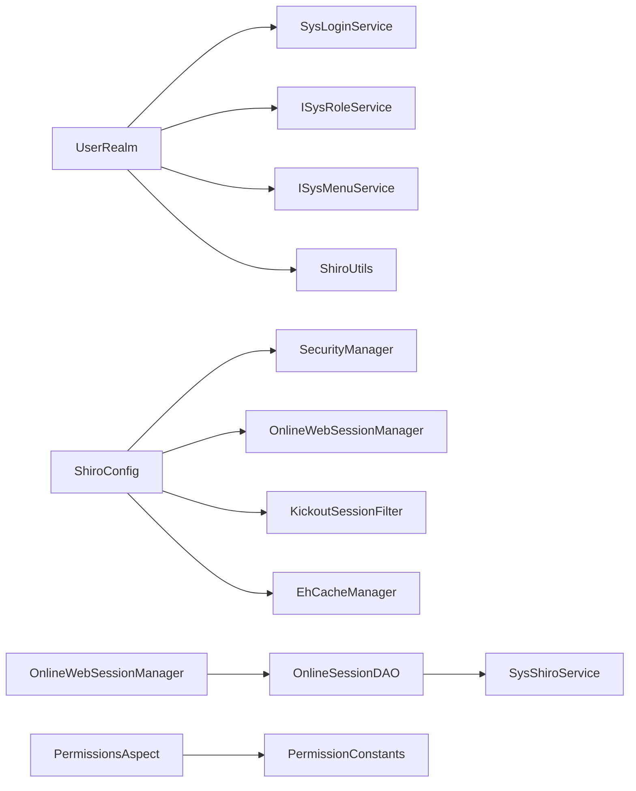

# 认证与授权机制

<cite>
**本文引用的文件**   
- [UserRealm.java](file://ruoyi-framework/src/main/java/com/ruoyi/framework/shiro/realm/UserRealm.java)
- [ShiroConfig.java](file://ruoyi-framework/src/main/java/com/ruoyi/framework/config/ShiroConfig.java)
- [SysLoginService.java](file://ruoyi-framework/src/main/java/com/ruoyi/framework/shiro/service/SysLoginService.java)
- [SysShiroService.java](file://ruoyi-framework/src/main/java/com/ruoyi/framework/shiro/service/SysShiroService.java)
- [OnlineSessionDAO.java](file://ruoyi-framework/src/main/java/com/ruoyi/framework/shiro/session/OnlineSessionDAO.java)
- [OnlineWebSessionManager.java](file://ruoyi-framework/src/main/java/com/ruoyi/framework/shiro/web/session/OnlineWebSessionManager.java)
- [KickoutSessionFilter.java](file://ruoyi-framework/src/main/java/com/ruoyi/framework/shiro/web/filter/kickout/KickoutSessionFilter.java)
- [SysLoginController.java](file://ruoyi-admin/src/main/java/com/ruoyi/web/controller/system/SysLoginController.java)
- [PermissionsAspect.java](file://ruoyi-framework/src/main/java/com/ruoyi/framework/aspectj/PermissionsAspect.java)
- [ShiroUtils.java](file://ruoyi-common/src/main/java/com/ruoyi/common/utils/ShiroUtils.java)
- [PermissionConstants.java](file://ruoyi-common/src/main/java/com/ruoyi/common/constant/PermissionConstants.java)
- [ShiroConstants.java](file://ruoyi-common/src/main/java/com/ruoyi/common/constant/ShiroConstants.java)
- [application.yml](file://ruoyi-admin/src/main/resources/application.yml)
</cite>

## 目录
1. [简介](#简介)
2. [项目结构](#项目结构)
3. [核心组件](#核心组件)
4. [架构总览](#架构总览)
5. [详细组件分析](#详细组件分析)
6. [依赖分析](#依赖分析)
7. [性能考虑](#性能考虑)
8. [故障排查指南](#故障排查指南)
9. [结论](#结论)
10. [附录](#附录)

## 简介
本文件面向RuoYi系统的认证与授权机制，围绕基于Apache Shiro的RBAC权限模型展开，重点覆盖以下方面：
- 自定义Realm认证流程：UserRealm如何接收登录令牌、调用登录服务完成身份验证，并在认证异常时进行精确映射。
- 授权与权限缓存：UserRealm如何从角色与菜单服务加载角色与权限集合，以及授权缓存的清理策略。
- 会话管理：在线用户会话跟踪、会话超时控制、数据库级会话同步、多设备登录并发限制与踢出策略。
- 权限注解：@RequiresPermissions、@RequiresRoles等注解在控制器与业务层的应用场景与最佳实践。
- 认证配置最佳实践：登录失败处理、账户锁定策略、会话并发控制、记住我、CSRF与验证码等。

## 项目结构
RuoYi采用模块化组织，认证与授权相关的关键代码分布在如下模块：
- ruoyi-framework：Shiro配置、Realm、会话管理、过滤器、权限注解切面、工具类等。
- ruoyi-admin：系统控制器（含登录控制器），负责对外暴露登录接口与页面。
- ruoyi-common：常量、工具类、权限常量等公共能力。
- ruoyi-system：用户、角色、菜单、在线会话等领域服务与Mapper。

图表来源
- [ShiroConfig.java:296-346](file://ruoyi-framework/src/main/java/com/ruoyi/framework/config/ShiroConfig.java#L296-L346)
- [UserRealm.java:40-133](file://ruoyi-framework/src/main/java/com/ruoyi/framework/shiro/realm/UserRealm.java#L40-L133)
- [OnlineWebSessionManager.java:29-176](file://ruoyi-framework/src/main/java/com/ruoyi/framework/shiro/web/session/OnlineWebSessionManager.java#L29-L176)
- [OnlineSessionDAO.java:21-119](file://ruoyi-framework/src/main/java/com/ruoyi/framework/shiro/session/OnlineSessionDAO.java#L21-L119)
- [KickoutSessionFilter.java:31-176](file://ruoyi-framework/src/main/java/com/ruoyi/framework/shiro/web/filter/kickout/KickoutSessionFilter.java#L31-L176)
- [PermissionsAspect.java:18-31](file://ruoyi-framework/src/main/java/com/ruoyi/framework/aspectj/PermissionsAspect.java#L18-L31)
- [SysLoginService.java:37-185](file://ruoyi-framework/src/main/java/com/ruoyi/framework/shiro/service/SysLoginService.java#L37-L185)
- [SysShiroService.java:19-54](file://ruoyi-framework/src/main/java/com/ruoyi/framework/shiro/service/SysShiroService.java#L19-L54)
- [ShiroUtils.java:16-105](file://ruoyi-common/src/main/java/com/ruoyi/common/utils/ShiroUtils.java#L16-L105)
- [PermissionConstants.java:8-28](file://ruoyi-common/src/main/java/com/ruoyi/common/constant/PermissionConstants.java#L8-L28)
- [ShiroConstants.java:8-85](file://ruoyi-common/src/main/java/com/ruoyi/common/constant/ShiroConstants.java#L8-L85)

章节来源
- [ShiroConfig.java:296-346](file://ruoyi-framework/src/main/java/com/ruoyi/framework/config/ShiroConfig.java#L296-L346)
- [application.yml:86-124](file://ruoyi-admin/src/main/resources/application.yml#L86-L124)

## 核心组件
- 自定义Realm（UserRealm）：负责认证与授权。认证阶段委托SysLoginService执行用户名/密码校验、验证码校验、黑名单校验、密码强度校验与账户状态校验；授权阶段根据用户角色与菜单加载权限集合，并支持管理员全权。
- Shiro配置（ShiroConfig）：集中定义缓存管理器、安全管理器、会话管理器、过滤器链、记住我、CSRF、验证码、多设备登录限制等。
- 登录服务（SysLoginService）：封装登录校验逻辑，包括验证码、用户名/密码格式、黑名单、账户状态、密码验证、权限注入与登录信息记录。
- 在线会话管理（OnlineWebSessionManager + OnlineSessionDAO）：在线会话属性变更标记与数据库同步、会话失效批量清理、在线用户查询与离线处理。
- 多设备登录限制（KickoutSessionFilter）：基于缓存维护同一用户会话队列，超过阈值时按策略踢出先前或后续登录者。
- 权限注解切面（PermissionsAspect）：将控制器上的@RequiresPermissions权限字符串上下文化，便于统一权限匹配。
- Shiro工具类（ShiroUtils）：提供Subject、Session、用户信息、管理员判断等便捷方法。
- 常量与配置（ShiroConstants、PermissionConstants、application.yml）：统一常量定义与配置项入口。

章节来源
- [UserRealm.java:40-133](file://ruoyi-framework/src/main/java/com/ruoyi/framework/shiro/realm/UserRealm.java#L40-L133)
- [ShiroConfig.java:154-270](file://ruoyi-framework/src/main/java/com/ruoyi/framework/config/ShiroConfig.java#L154-L270)
- [SysLoginService.java:54-131](file://ruoyi-framework/src/main/java/com/ruoyi/framework/shiro/service/SysLoginService.java#L54-L131)
- [OnlineWebSessionManager.java:33-176](file://ruoyi-framework/src/main/java/com/ruoyi/framework/shiro/web/session/OnlineWebSessionManager.java#L33-L176)
- [OnlineSessionDAO.java:68-119](file://ruoyi-framework/src/main/java/com/ruoyi/framework/shiro/session/OnlineSessionDAO.java#L68-L119)
- [KickoutSessionFilter.java:61-132](file://ruoyi-framework/src/main/java/com/ruoyi/framework/shiro/web/filter/kickout/KickoutSessionFilter.java#L61-L132)
- [PermissionsAspect.java:20-29](file://ruoyi-framework/src/main/java/com/ruoyi/framework/aspectj/PermissionsAspect.java#L20-L29)
- [ShiroUtils.java:33-92](file://ruoyi-common/src/main/java/com/ruoyi/common/utils/ShiroUtils.java#L33-L92)
- [ShiroConstants.java:80-84](file://ruoyi-common/src/main/java/com/ruoyi/common/constant/ShiroConstants.java#L80-L84)
- [PermissionConstants.java:10-27](file://ruoyi-common/src/main/java/com/ruoyi/common/constant/PermissionConstants.java#L10-L27)
- [application.yml:86-124](file://ruoyi-admin/src/main/resources/application.yml#L86-L124)

## 架构总览
下图展示从浏览器发起登录请求到完成认证与授权、进入受控访问的完整流程，以及会话与在线用户管理的交互。

图表来源
- [SysLoginController.java:55-75](file://ruoyi-admin/src/main/java/com/ruoyi/web/controller/system/SysLoginController.java#L55-L75)
- [UserRealm.java:86-133](file://ruoyi-framework/src/main/java/com/ruoyi/framework/shiro/realm/UserRealm.java#L86-L133)
- [SysLoginService.java:54-131](file://ruoyi-framework/src/main/java/com/ruoyi/framework/shiro/service/SysLoginService.java#L54-L131)
- [ShiroConfig.java:296-346](file://ruoyi-framework/src/main/java/com/ruoyi/framework/config/ShiroConfig.java#L296-L346)

## 详细组件分析

### 自定义Realm：认证与授权
- 认证流程
  - UserRealm接收UsernamePasswordToken，提取用户名与密码。
  - 委托SysLoginService执行登录校验，涵盖验证码、用户名/密码格式、黑名单、账户状态、密码验证等。
  - 将异常映射为Shiro标准异常类型，便于上层统一处理。
  - 成功后构造SimpleAuthenticationInfo返回。
- 授权流程
  - 读取当前用户（ShiroUtils.getSysUser）。
  - 管理员拥有“admin”角色与“*:*:*”全部权限。
  - 普通用户通过ISysRoleService与ISysMenuService加载角色与权限集合，填充SimpleAuthorizationInfo。
- 缓存与清理
  - 授权缓存由ShiroConfig配置的EhCacheManager管理。
  - 支持按主体清理单个用户缓存与清空所有授权缓存。

图表来源
- [UserRealm.java:40-133](file://ruoyi-framework/src/main/java/com/ruoyi/framework/shiro/realm/UserRealm.java#L40-L133)
- [SysLoginService.java:54-131](file://ruoyi-framework/src/main/java/com/ruoyi/framework/shiro/service/SysLoginService.java#L54-L131)

章节来源
- [UserRealm.java:56-81](file://ruoyi-framework/src/main/java/com/ruoyi/framework/shiro/realm/UserRealm.java#L56-L81)
- [UserRealm.java:86-133](file://ruoyi-framework/src/main/java/com/ruoyi/framework/shiro/realm/UserRealm.java#L86-L133)
- [SysLoginService.java:54-131](file://ruoyi-framework/src/main/java/com/ruoyi/framework/shiro/service/SysLoginService.java#L54-L131)

### 会话管理：在线用户跟踪、超时与DB同步
- 会话管理器（OnlineWebSessionManager）
  - 拦截会话属性变更，标记需要同步至数据库。
  - 定期验证会话有效性，对过期会话进行批量清理与缓存清理。
- 会话DAO（OnlineSessionDAO）
  - 读取会话：通过SysShiroService从数据库加载在线会话。
  - 更新会话：按周期将在线会话属性同步至数据库，避免频繁写入。
  - 删除会话：会话停止时更新状态并删除数据库记录。
- 配置要点
  - 会话超时、同步周期、验证间隔、记住我Cookie参数均来自application.yml与ShiroConfig。

图表来源
- [OnlineWebSessionManager.java:34-42](file://ruoyi-framework/src/main/java/com/ruoyi/framework/shiro/web/session/OnlineWebSessionManager.java#L34-L42)
- [OnlineSessionDAO.java:68-102](file://ruoyi-framework/src/main/java/com/ruoyi/framework/shiro/session/OnlineSessionDAO.java#L68-L102)

章节来源
- [OnlineWebSessionManager.java:33-176](file://ruoyi-framework/src/main/java/com/ruoyi/framework/shiro/web/session/OnlineWebSessionManager.java#L33-L176)
- [OnlineSessionDAO.java:21-119](file://ruoyi-framework/src/main/java/com/ruoyi/framework/shiro/session/OnlineSessionDAO.java#L21-L119)
- [SysShiroService.java:27-53](file://ruoyi-framework/src/main/java/com/ruoyi/framework/shiro/service/SysShiroService.java#L27-L53)
- [application.yml:110-120](file://ruoyi-admin/src/main/resources/application.yml#L110-L120)

### 多设备登录限制与踢出策略
- 过滤器（KickoutSessionFilter）
  - 维护同一用户会话ID队列，依据maxSession与kickoutAfter策略决定踢出前者还是后者。
  - 踢出后设置会话属性并重定向或返回JSON提示。
- 配置要点
  - maxSession、kickoutAfter、kickoutUrl等由ShiroConfig与application.yml共同决定。

图表来源
- [KickoutSessionFilter.java:61-132](file://ruoyi-framework/src/main/java/com/ruoyi/framework/shiro/web/filter/kickout/KickoutSessionFilter.java#L61-L132)
- [ShiroConfig.java:414-426](file://ruoyi-framework/src/main/java/com/ruoyi/framework/config/ShiroConfig.java#L414-L426)

章节来源
- [KickoutSessionFilter.java:31-176](file://ruoyi-framework/src/main/java/com/ruoyi/framework/shiro/web/filter/kickout/KickoutSessionFilter.java#L31-L176)
- [application.yml:117-120](file://ruoyi-admin/src/main/resources/application.yml#L117-L120)

### 权限注解与上下文传递
- PermissionsAspect
  - 在控制器方法执行前，将@RequiresPermissions的权限字符串以逗号拼接并放入当前请求上下文，便于后续权限匹配。
- 常量
  - PermissionConstants提供权限后缀常量（新增、编辑、删除、导出、查看、列表），用于权限消息提示与匹配。

图表来源
- [PermissionsAspect.java:20-29](file://ruoyi-framework/src/main/java/com/ruoyi/framework/aspectj/PermissionsAspect.java#L20-L29)
- [PermissionConstants.java:10-27](file://ruoyi-common/src/main/java/com/ruoyi/common/constant/PermissionConstants.java#L10-L27)

章节来源
- [PermissionsAspect.java:18-31](file://ruoyi-framework/src/main/java/com/ruoyi/framework/aspectj/PermissionsAspect.java#L18-L31)
- [PermissionConstants.java:8-28](file://ruoyi-common/src/main/java/com/ruoyi/common/constant/PermissionConstants.java#L8-L28)

### 登录控制器与认证入口
- SysLoginController
  - GET /login：渲染登录页，携带是否开启记住我与注册开关。
  - POST /login：封装UsernamePasswordToken并调用subject.login，捕获认证异常并返回友好提示。
- 配置
  - 登录URL、未授权URL、记住我开关等由application.yml与ShiroConfig共同控制。

章节来源
- [SysLoginController.java:40-83](file://ruoyi-admin/src/main/java/com/ruoyi/web/controller/system/SysLoginController.java#L40-L83)
- [application.yml:88-98](file://ruoyi-admin/src/main/resources/application.yml#L88-L98)
- [ShiroConfig.java:296-346](file://ruoyi-framework/src/main/java/com/ruoyi/framework/config/ShiroConfig.java#L296-L346)

## 依赖分析
- 组件耦合
  - UserRealm依赖SysLoginService、ISysRoleService、ISysMenuService与ShiroUtils。
  - ShiroConfig装配SecurityManager、SessionManager、EhCacheManager、过滤器链与RememberMe。
  - OnlineWebSessionManager与OnlineSessionDAO协作完成在线会话的属性变更标记与DB同步。
  - KickoutSessionFilter依赖CacheManager与SessionManager实现并发控制。
  - PermissionsAspect与PermissionConstants配合实现注解式权限上下文传递。
- 外部依赖
  - Ehcache作为Shiro缓存与用户会话缓存。
  - Spring AOP与Spring MVC集成Shiro注解与控制器。

图表来源
- [UserRealm.java:40-133](file://ruoyi-framework/src/main/java/com/ruoyi/framework/shiro/realm/UserRealm.java#L40-L133)
- [SysLoginService.java:37-185](file://ruoyi-framework/src/main/java/com/ruoyi/framework/shiro/service/SysLoginService.java#L37-L185)
- [ShiroConfig.java:154-270](file://ruoyi-framework/src/main/java/com/ruoyi/framework/config/ShiroConfig.java#L154-L270)
- [OnlineWebSessionDAO.java:21-119](file://ruoyi-framework/src/main/java/com/ruoyi/framework/shiro/session/OnlineSessionDAO.java#L21-L119)
- [OnlineWebSessionManager.java:29-176](file://ruoyi-framework/src/main/java/com/ruoyi/framework/shiro/web/session/OnlineWebSessionManager.java#L29-L176)
- [KickoutSessionFilter.java:31-176](file://ruoyi-framework/src/main/java/com/ruoyi/framework/shiro/web/filter/kickout/KickoutSessionFilter.java#L31-L176)
- [PermissionsAspect.java:18-31](file://ruoyi-framework/src/main/java/com/ruoyi/framework/aspectj/PermissionsAspect.java#L18-L31)
- [PermissionConstants.java:8-28](file://ruoyi-common/src/main/java/com/ruoyi/common/constant/PermissionConstants.java#L8-L28)

## 性能考虑
- 缓存策略
  - 授权缓存与用户会话缓存均使用Ehcache，建议合理设置缓存容量与TTL，避免内存压力。
- 会话同步
  - dbSyncPeriod控制同步频率，建议结合业务并发与数据库负载调整，避免过于频繁写库。
- 会话验证
  - validationInterval与globalSessionTimeout需平衡用户体验与资源占用，过短可能导致频繁校验。
- 并发控制
  - maxSession与kickoutAfter影响用户体验，建议在高并发场景下适度收紧并提供明确提示。

## 故障排查指南
- 登录失败
  - 检查application.yml中的验证码开关、验证码类型与登录URL配置。
  - 关注SysLoginService的异常分支（用户名不存在、密码不匹配、账户锁定、黑名单等）。
- 权限不足
  - 确认UserRealm是否正确加载角色与权限集合；检查ShiroConfig的授权缓存配置。
  - 若使用注解，确认PermissionsAspect是否生效，以及@RequiresPermissions的值是否正确。
- 多设备被踢出
  - 检查ShiroConfig的kickout配置与缓存键空间；确认KickoutSessionFilter是否正确注入过滤器链。
- 会话不同步
  - 检查OnlineSessionDAO的dbSyncPeriod与属性变更标记逻辑；确认异步任务是否正常执行。
- 会话超时频繁
  - 调整application.yml中的expireTime与validationInterval；评估业务是否需要更长会话。

章节来源
- [application.yml:86-124](file://ruoyi-admin/src/main/resources/application.yml#L86-L124)
- [SysLoginService.java:54-131](file://ruoyi-framework/src/main/java/com/ruoyi/framework/shiro/service/SysLoginService.java#L54-L131)
- [UserRealm.java:56-81](file://ruoyi-framework/src/main/java/com/ruoyi/framework/shiro/realm/UserRealm.java#L56-L81)
- [PermissionsAspect.java:20-29](file://ruoyi-framework/src/main/java/com/ruoyi/framework/aspectj/PermissionsAspect.java#L20-L29)
- [KickoutSessionFilter.java:61-132](file://ruoyi-framework/src/main/java/com/ruoyi/framework/shiro/web/filter/kickout/KickoutSessionFilter.java#L61-L132)
- [OnlineSessionDAO.java:68-102](file://ruoyi-framework/src/main/java/com/ruoyi/framework/shiro/session/OnlineSessionDAO.java#L68-L102)

## 结论
RuoYi基于Shiro构建的认证与授权体系具备清晰的职责划分与可扩展性：
- UserRealm承担认证与授权核心逻辑，结合SysLoginService实现严谨的登录校验。
- ShiroConfig集中配置过滤器链、会话管理、缓存与安全策略，确保整体一致性。
- 在线会话管理通过OnlineWebSessionManager与OnlineSessionDAO实现属性变更与DB同步，保障会话状态一致性。
- 多设备登录限制通过KickoutSessionFilter实现灵活的并发控制策略。
- 权限注解与上下文传递提升开发效率与权限表达的一致性。

建议在生产环境中结合业务场景调优缓存、会话与并发策略，并完善日志与监控以快速定位问题。

## 附录
- 配置项参考（摘自application.yml）
  - 登录与未授权地址、首页地址、验证码开关与类型
  - Cookie域名、路径、HttpOnly、过期时间、密钥
  - 会话超时、DB同步周期、验证间隔、最大会话数、踢出策略
  - 记住我开关
- 最佳实践
  - 登录失败处理：统一异常映射与日志记录，避免泄露敏感信息。
  - 账户锁定策略：结合密码重试次数与临时锁定时间，防止暴力破解。
  - 会话并发控制：根据业务并发与安全需求设置maxSession与kickoutAfter。
  - 记住我：设置合理的cipherKey与maxAge，注意跨设备兼容性。
  - CSRF与验证码：在高风险接口启用CSRF白名单与验证码，降低攻击面。

章节来源
- [application.yml:88-124](file://ruoyi-admin/src/main/resources/application.yml#L88-L124)