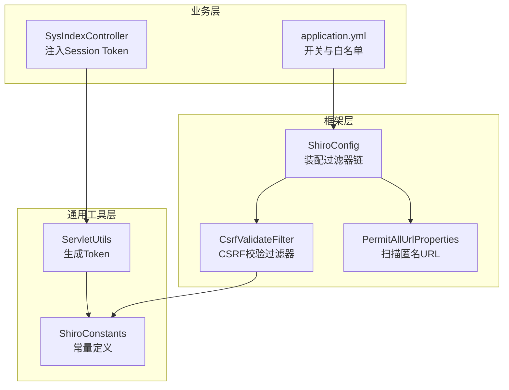
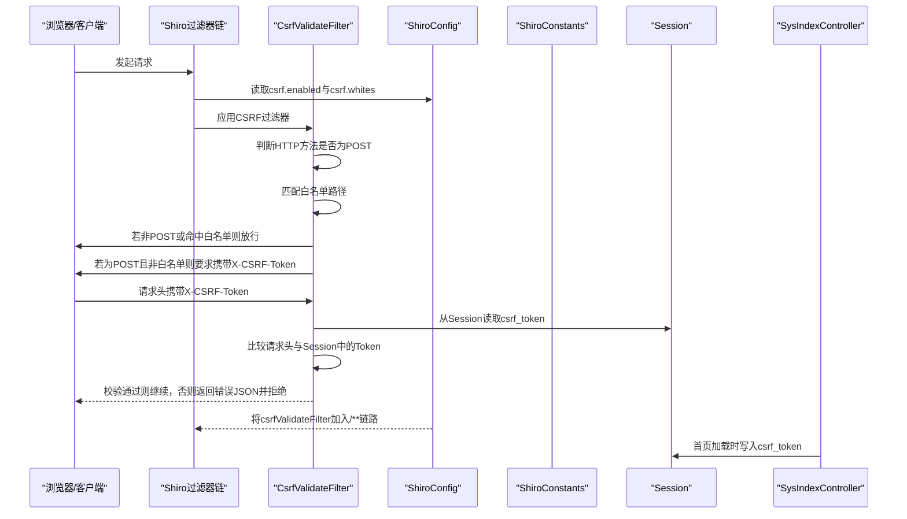
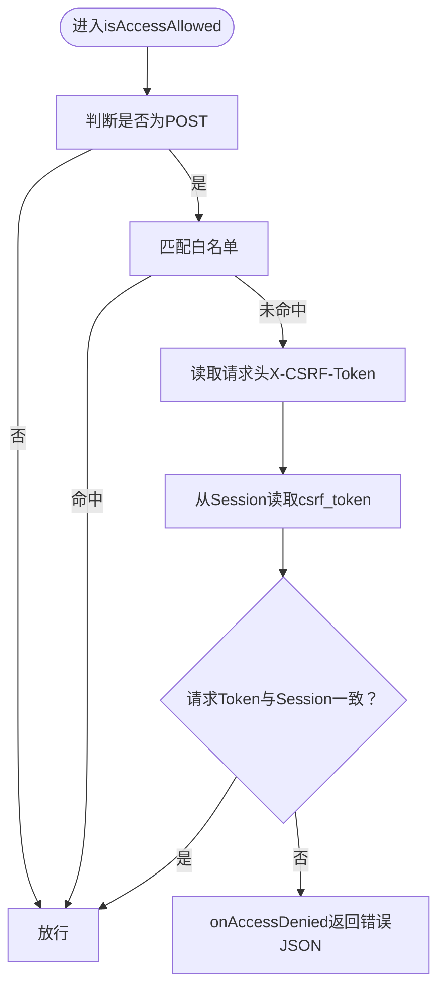
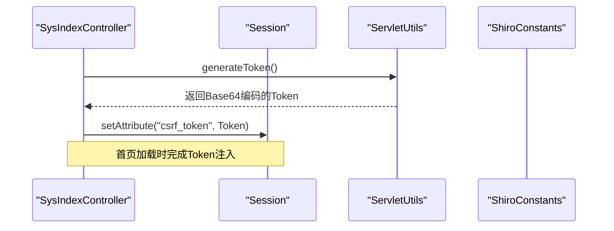
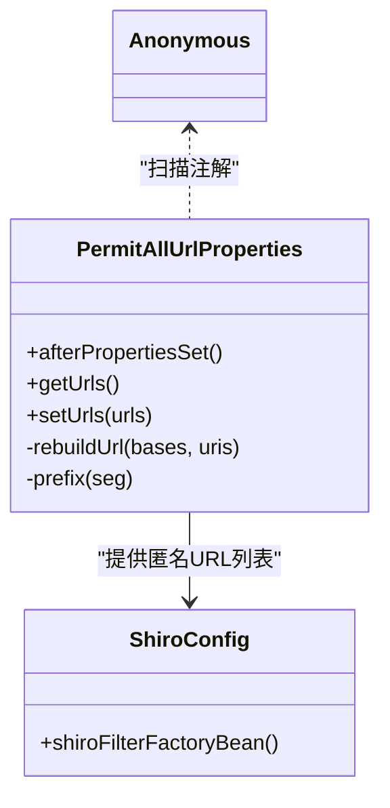
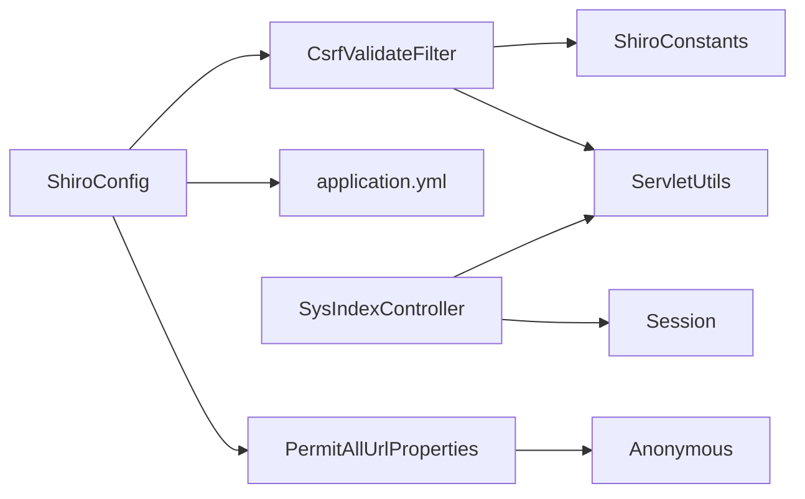

# CSRF跨站请求伪造防护

<cite>
**本文引用的文件**
- [CsrfValidateFilter.java](file://ruoyi-framework/src/main/java/com/ruoyi/framework/shiro/web/filter/csrf/CsrfValidateFilter.java)
- [ShiroConfig.java](file://ruoyi-framework/src/main/java/com/ruoyi/framework/config/ShiroConfig.java)
- [ShiroConstants.java](file://ruoyi-common/src/main/java/com/ruoyi/common/constant/ShiroConstants.java)
- [ServletUtils.java](file://ruoyi-common/src/main/java/com/ruoyi/common/utils/ServletUtils.java)
- [SysIndexController.java](file://ruoyi-admin/src/main/java/com/ruoyi/web/controller/system/SysIndexController.java)
- [application.yml](file://ruoyi-admin/src/main/resources/application.yml)
- [PermitAllUrlProperties.java](file://ruoyi-framework/src/main/java/com/ruoyi/framework/config/properties/PermitAllUrlProperties.java)
- [Anonymous.java](file://ruoyi-common/src/main/java/com/ruoyi/common/annotation/Anonymous.java)
</cite>

## 目录
1. [简介](#简介)
2. [项目结构](#项目结构)
3. [核心组件](#核心组件)
4. [架构总览](#架构总览)
5. [组件详解](#组件详解)
6. [依赖关系分析](#依赖关系分析)
7. [性能与安全考量](#性能与安全考量)
8. [故障排查指南](#故障排查指南)
9. [结论](#结论)
10. [附录：配置示例与最佳实践](#附录配置示例与最佳实践)

## 简介
本文件面向RuoYi系统的CSRF跨站请求伪造防护机制，聚焦于CsrfValidateFilter过滤器的工作原理与实现细节，涵盖CSRF Token的生成、存储与验证流程；Token在Session中的存储策略与跨请求传递方式；PermitAllUrlProperties中“例外URL”的配置方法与安全边界；不同HTTP方法的CSRF保护策略（重点为POST）；以及常见CSRF攻击场景与跨域请求的特殊处理建议。文档同时提供可操作的配置示例与最佳实践，帮助开发者在保证安全的前提下提升系统可用性。

## 项目结构
围绕CSRF防护的关键代码分布在以下模块与文件中：
- 过滤器实现：CsrfValidateFilter（Shiro过滤链中的CSRF校验）
- 配置入口：ShiroConfig（启用/禁用CSRF、配置白名单、装配过滤器链）
- 常量定义：ShiroConstants（CSRF相关头与Session键）
- 工具方法：ServletUtils（生成CSRF Token）
- 初始化控制器：SysIndexController（在会话中注入CSRF Token）
- 配置文件：application.yml（开关与白名单）
- 例外URL：PermitAllUrlProperties + Anonymous注解（匿名访问的URL集合）

**图表来源**
- [ShiroConfig.java:282-346](file://ruoyi-framework/src/main/java/com/ruoyi/framework/config/ShiroConfig.java#L282-L346)
- [CsrfValidateFilter.java:1-77](file://ruoyi-framework/src/main/java/com/ruoyi/framework/shiro/web/filter/csrf/CsrfValidateFilter.java#L1-L77)
- [ShiroConstants.java:35-44](file://ruoyi-common/src/main/java/com/ruoyi/common/constant/ShiroConstants.java#L35-L44)
- [ServletUtils.java:221-233](file://ruoyi-common/src/main/java/com/ruoyi/common/utils/ServletUtils.java#L221-L233)
- [SysIndexController.java:85-88](file://ruoyi-admin/src/main/java/com/ruoyi/web/controller/system/SysIndexController.java#L85-L88)
- [application.yml:134-140](file://ruoyi-admin/src/main/resources/application.yml#L134-L140)
- [PermitAllUrlProperties.java:27-101](file://ruoyi-framework/src/main/java/com/ruoyi/framework/config/properties/PermitAllUrlProperties.java#L27-L101)

**章节来源**
- [ShiroConfig.java:136-346](file://ruoyi-framework/src/main/java/com/ruoyi/framework/config/ShiroConfig.java#L136-L346)
- [CsrfValidateFilter.java:1-77](file://ruoyi-framework/src/main/java/com/ruoyi/framework/shiro/web/filter/csrf/CsrfValidateFilter.java#L1-L77)
- [ShiroConstants.java:35-44](file://ruoyi-common/src/main/java/com/ruoyi/common/constant/ShiroConstants.java#L35-L44)
- [ServletUtils.java:221-233](file://ruoyi-common/src/main/java/com/ruoyi/common/utils/ServletUtils.java#L221-L233)
- [SysIndexController.java:85-88](file://ruoyi-admin/src/main/java/com/ruoyi/web/controller/system/SysIndexController.java#L85-L88)
- [application.yml:134-140](file://ruoyi-admin/src/main/resources/application.yml#L134-L140)
- [PermitAllUrlProperties.java:27-101](file://ruoyi-framework/src/main/java/com/ruoyi/framework/config/properties/PermitAllUrlProperties.java#L27-L101)

## 核心组件
- CsrfValidateFilter：基于Apache Shiro的AccessControlFilter扩展，负责对匹配的请求进行CSRF校验。仅对POST方法强制校验，白名单路径放行，校验失败返回统一JSON响应并拒绝访问。
- ShiroConfig：集中配置CSRF开关与白名单，并将CsrfValidateFilter加入到Shiro过滤器链的末尾，确保在所有受保护资源上生效。
- ShiroConstants：定义CSRF相关的Session键与请求头键，作为前后端交互的契约。
- ServletUtils：提供生成CSRF Token的工具方法，使用SecureRandom生成强随机字节并进行Base64编码。
- SysIndexController：在用户进入系统首页时，向Session写入CSRF Token，确保后续AJAX请求携带正确的Token。
- application.yml：提供csrf.enabled与csrf.whites两个关键配置项，用于控制CSRF开关与白名单。
- PermitAllUrlProperties + Anonymous：扫描带@Anonymous注解的URL，构建匿名访问白名单，与CSRF白名单互补。

**章节来源**
- [CsrfValidateFilter.java:27-76](file://ruoyi-framework/src/main/java/com/ruoyi/framework/shiro/web/filter/csrf/CsrfValidateFilter.java#L27-L76)
- [ShiroConfig.java:136-291](file://ruoyi-framework/src/main/java/com/ruoyi/framework/config/ShiroConfig.java#L136-L291)
- [ShiroConstants.java:35-44](file://ruoyi-common/src/main/java/com/ruoyi/common/constant/ShiroConstants.java#L35-L44)
- [ServletUtils.java:221-233](file://ruoyi-common/src/main/java/com/ruoyi/common/utils/ServletUtils.java#L221-L233)
- [SysIndexController.java:85-88](file://ruoyi-admin/src/main/java/com/ruoyi/web/controller/system/SysIndexController.java#L85-L88)
- [application.yml:134-140](file://ruoyi-admin/src/main/resources/application.yml#L134-L140)
- [PermitAllUrlProperties.java:27-101](file://ruoyi-framework/src/main/java/com/ruoyi/framework/config/properties/PermitAllUrlProperties.java#L27-L101)
- [Anonymous.java:9-19](file://ruoyi-common/src/main/java/com/ruoyi/common/annotation/Anonymous.java#L9-L19)

## 架构总览
下图展示了从请求进入Shiro过滤器链，到CSRF校验与Token验证的整体流程。

**图表来源**
- [ShiroConfig.java:282-346](file://ruoyi-framework/src/main/java/com/ruoyi/framework/config/ShiroConfig.java#L282-L346)
- [CsrfValidateFilter.java:27-65](file://ruoyi-framework/src/main/java/com/ruoyi/framework/shiro/web/filter/csrf/CsrfValidateFilter.java#L27-L65)
- [ShiroConstants.java:35-44](file://ruoyi-common/src/main/java/com/ruoyi/common/constant/ShiroConstants.java#L35-L44)
- [SysIndexController.java:85-88](file://ruoyi-admin/src/main/java/com/ruoyi/web/controller/system/SysIndexController.java#L85-L88)

## 组件详解

### CsrfValidateFilter工作原理
- 方法拦截策略：仅对POST方法进行CSRF校验，其他方法（如GET、PUT、DELETE）直接放行。
- 白名单放行：若请求路径匹配预设白名单，则直接放行。
- Token提取：从请求头X-CSRF-Token中读取客户端携带的Token。
- 会话对比：从当前Session中读取csrf_token并与请求头Token进行严格比较（大小写不敏感）。
- 拒绝策略：校验失败时返回统一JSON错误响应并拒绝访问。

**图表来源**
- [CsrfValidateFilter.java:27-65](file://ruoyi-framework/src/main/java/com/ruoyi/framework/shiro/web/filter/csrf/CsrfValidateFilter.java#L27-L65)
- [ShiroConstants.java:35-44](file://ruoyi-common/src/main/java/com/ruoyi/common/constant/ShiroConstants.java#L35-L44)

**章节来源**
- [CsrfValidateFilter.java:27-65](file://ruoyi-framework/src/main/java/com/ruoyi/framework/shiro/web/filter/csrf/CsrfValidateFilter.java#L27-L65)

### CSRF Token生成、存储与传递
- 生成算法：使用SecureRandom生成32字节强随机数，再进行Base64编码，确保熵足够高。
- 存储机制：在用户会话（Session）中以csrf_token为键保存。
- 传递方式：前端在发起POST请求时，需将Token放入请求头X-CSRF-Token中。

**图表来源**
- [SysIndexController.java:85-88](file://ruoyi-admin/src/main/java/com/ruoyi/web/controller/system/SysIndexController.java#L85-L88)
- [ServletUtils.java:221-233](file://ruoyi-common/src/main/java/com/ruoyi/common/utils/ServletUtils.java#L221-L233)
- [ShiroConstants.java:35-44](file://ruoyi-common/src/main/java/com/ruoyi/common/constant/ShiroConstants.java#L35-L44)

**章节来源**
- [ServletUtils.java:221-233](file://ruoyi-common/src/main/java/com/ruoyi/common/utils/ServletUtils.java#L221-L233)
- [SysIndexController.java:85-88](file://ruoyi-admin/src/main/java/com/ruoyi/web/controller/system/SysIndexController.java#L85-L88)
- [ShiroConstants.java:35-44](file://ruoyi-common/src/main/java/com/ruoyi/common/constant/ShiroConstants.java#L35-L44)

### PermitAllUrlProperties与例外URL
- 扫描机制：启动时扫描带@Controller与@RequestMapping的方法，结合@Anonymous注解，构建匿名访问URL集合。
- 与CSRF白名单的关系：PermitAllUrlProperties构建的是“无需鉴权”的URL白名单；CSRF白名单是“无需CSRF校验”的URL白名单。两者作用域不同，应分别配置。
- 安全边界：仅对明确不需要鉴权的公开接口使用匿名访问；对需要鉴权但无需CSRF校验的接口使用CSRF白名单。

**图表来源**
- [PermitAllUrlProperties.java:27-101](file://ruoyi-framework/src/main/java/com/ruoyi/framework/config/properties/PermitAllUrlProperties.java#L27-L101)
- [Anonymous.java:9-19](file://ruoyi-common/src/main/java/com/ruoyi/common/annotation/Anonymous.java#L9-L19)
- [ShiroConfig.java:320-322](file://ruoyi-framework/src/main/java/com/ruoyi/framework/config/ShiroConfig.java#L320-L322)

**章节来源**
- [PermitAllUrlProperties.java:27-101](file://ruoyi-framework/src/main/java/com/ruoyi/framework/config/properties/PermitAllUrlProperties.java#L27-L101)
- [Anonymous.java:9-19](file://ruoyi-common/src/main/java/com/ruoyi/common/annotation/Anonymous.java#L9-L19)
- [ShiroConfig.java:320-322](file://ruoyi-framework/src/main/java/com/ruoyi/framework/config/ShiroConfig.java#L320-L322)

### HTTP方法的CSRF保护策略
- POST：强制校验，必须携带X-CSRF-Token且与Session一致。
- GET/HEAD/OPTIONS/TRACE：不进行CSRF校验（默认放行）。
- PUT/DELETE：当前实现未对这些方法进行CSRF校验。若业务存在敏感变更操作，建议在相应控制器或拦截器中补充Token校验逻辑，或调整为仅允许POST并使用语义化方法的客户端库。

**章节来源**
- [CsrfValidateFilter.java:61-65](file://ruoyi-framework/src/main/java/com/ruoyi/framework/shiro/web/filter/csrf/CsrfValidateFilter.java#L61-L65)

### 异常处理与统一响应
- 拒绝访问时，CsrfValidateFilter通过ServletUtils输出统一JSON格式的错误响应，避免泄露内部细节。
- 建议前端在收到该错误时提示用户刷新页面或重新登录，以重新获取有效的CSRF Token。

**章节来源**
- [CsrfValidateFilter.java:54-59](file://ruoyi-framework/src/main/java/com/ruoyi/framework/shiro/web/filter/csrf/CsrfValidateFilter.java#L54-L59)

## 依赖关系分析
- CsrfValidateFilter依赖ShiroConstants中的头与Session键，依赖ShiroUtils与ServletUtils进行会话与工具调用。
- ShiroConfig负责装配CsrfValidateFilter并将其加入/**过滤链，同时读取application.yml中的开关与白名单配置。
- SysIndexController在会话中注入csrf_token，确保后续请求具备有效Token。
- PermitAllUrlProperties与Anonymous共同决定匿名访问URL集合，与CSRF白名单互不冲突。

**图表来源**
- [CsrfValidateFilter.java:1-77](file://ruoyi-framework/src/main/java/com/ruoyi/framework/shiro/web/filter/csrf/CsrfValidateFilter.java#L1-L77)
- [ShiroConfig.java:136-291](file://ruoyi-framework/src/main/java/com/ruoyi/framework/config/ShiroConfig.java#L136-L291)
- [application.yml:134-140](file://ruoyi-admin/src/main/resources/application.yml#L134-L140)
- [SysIndexController.java:85-88](file://ruoyi-admin/src/main/java/com/ruoyi/web/controller/system/SysIndexController.java#L85-L88)
- [PermitAllUrlProperties.java:27-101](file://ruoyi-framework/src/main/java/com/ruoyi/framework/config/properties/PermitAllUrlProperties.java#L27-L101)
- [Anonymous.java:9-19](file://ruoyi-common/src/main/java/com/ruoyi/common/annotation/Anonymous.java#L9-L19)

**章节来源**
- [ShiroConfig.java:282-346](file://ruoyi-framework/src/main/java/com/ruoyi/framework/config/ShiroConfig.java#L282-L346)
- [CsrfValidateFilter.java:1-77](file://ruoyi-framework/src/main/java/com/ruoyi/framework/shiro/web/filter/csrf/CsrfValidateFilter.java#L1-L77)

## 性能与安全考量
- Token生成成本极低，使用Base64编码便于传输与存储。
- 仅对POST方法校验，避免对大量只读请求引入额外开销。
- 白名单应尽量精简，仅包含确需放行的公开接口。
- 建议对跨域场景增加CORS策略与SameSite Cookie等综合防护，CSRF过滤器仅覆盖同源请求场景。

[本节为通用指导，不直接分析具体文件]

## 故障排查指南
- 现象：POST请求被拒绝，返回统一错误JSON
  - 可能原因：缺少X-CSRF-Token头、Token与Session不一致、Token已过期或被覆盖
  - 处理步骤：确认前端是否在每次POST请求中携带X-CSRF-Token；确认页面首次加载时Session中是否存在csrf_token；检查是否存在多标签页并发导致Token失效
- 现象：白名单路径仍被CSRF拦截
  - 可能原因：路径匹配规则不正确或白名单未生效
  - 处理步骤：核对application.yml中的csrf.whites配置；确认路径是否以/开头且与请求路径一致；检查ShiroConfig中白名单注入逻辑
- 现象：PUT/DELETE请求未被拦截
  - 可能原因：当前实现仅针对POST方法
  - 处理步骤：根据业务需求在控制器或自定义拦截器中补充Token校验

**章节来源**
- [CsrfValidateFilter.java:27-65](file://ruoyi-framework/src/main/java/com/ruoyi/framework/shiro/web/filter/csrf/CsrfValidateFilter.java#L27-L65)
- [application.yml:134-140](file://ruoyi-admin/src/main/resources/application.yml#L134-L140)
- [ShiroConfig.java:282-291](file://ruoyi-framework/src/main/java/com/ruoyi/framework/config/ShiroConfig.java#L282-L291)

## 结论
RuoYi的CSRF防护以轻量、可控为核心设计：仅对POST方法进行校验，通过Session与请求头的Token比对实现强约束；配合白名单与匿名访问机制，既保障安全又兼顾易用性。对于跨域、PUT/DELETE等场景，建议结合CORS与前端策略进一步完善整体安全体系。

[本节为总结性内容，不直接分析具体文件]

## 附录：配置示例与最佳实践

### 配置示例
- 开启CSRF并配置白名单
  - 在application.yml中设置：
    - csrf.enabled=true
    - csrf.whites=/druid,/captcha,/openapi/**
- 在ShiroConfig中确认过滤器链已启用：
  - 将csrfValidateFilter加入/**链路，确保所有受保护资源均受CSRF保护

**章节来源**
- [application.yml:134-140](file://ruoyi-admin/src/main/resources/application.yml#L134-L140)
- [ShiroConfig.java:282-346](file://ruoyi-framework/src/main/java/com/ruoyi/framework/config/ShiroConfig.java#L282-L346)

### Token生成与传递最佳实践
- 生成：由ServletUtils.generateToken()生成，建议在用户登录或进入系统首页时写入Session
- 传递：前端在每次POST请求时，从隐藏字段或全局状态中读取Token并放入请求头X-CSRF-Token
- 更新：若检测到Token失效（如多标签页并发），建议在登录或页面刷新时重新注入

**章节来源**
- [ServletUtils.java:221-233](file://ruoyi-common/src/main/java/com/ruoyi/common/utils/ServletUtils.java#L221-L233)
- [SysIndexController.java:85-88](file://ruoyi-admin/src/main/java/com/ruoyi/web/controller/system/SysIndexController.java#L85-L88)
- [ShiroConstants.java:35-44](file://ruoyi-common/src/main/java/com/ruoyi/common/constant/ShiroConstants.java#L35-L44)

### 例外URL配置方法与安全考虑
- 匿名访问URL：通过@Anonymous注解标注控制器或方法，PermitAllUrlProperties在启动时扫描并加入匿名白名单
- CSRF白名单：仅对确需绕过CSRF校验的接口配置，如验证码、监控面板等
- 安全边界：匿名白名单与CSRF白名单职责不同，不应混用；对敏感接口严禁加入白名单

**章节来源**
- [PermitAllUrlProperties.java:27-101](file://ruoyi-framework/src/main/java/com/ruoyi/framework/config/properties/PermitAllUrlProperties.java#L27-L101)
- [Anonymous.java:9-19](file://ruoyi-common/src/main/java/com/ruoyi/common/annotation/Anonymous.java#L9-L19)
- [ShiroConfig.java:320-322](file://ruoyi-framework/src/main/java/com/ruoyi/framework/config/ShiroConfig.java#L320-L322)

### 常见CSRF攻击场景与防护
- 场景一：用户在已登录状态下访问恶意站点，恶意站点构造POST表单提交至系统
  - 防护：启用POST校验，要求携带X-CSRF-Token；前端在每次POST请求中注入并传递
- 场景二：跨域请求携带Cookie但未携带Token
  - 防护：CSRF过滤器仅覆盖同源请求；建议配合SameSite Cookie与CORS策略；对跨域场景采用签名或双提交Cookie等方案
- 场景三：多标签页并发导致Token失效
  - 防护：在页面刷新或登录时重新注入Session Token；前端在请求失败时主动刷新Token并重试

[本节为通用指导，不直接分析具体文件]