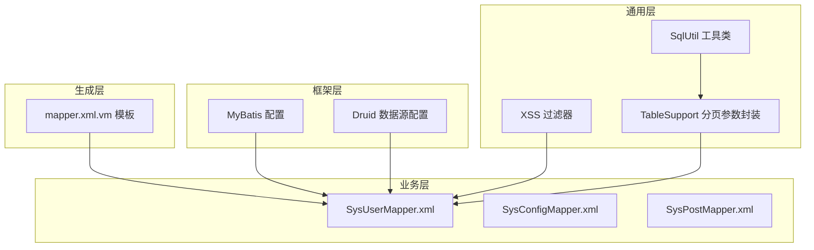
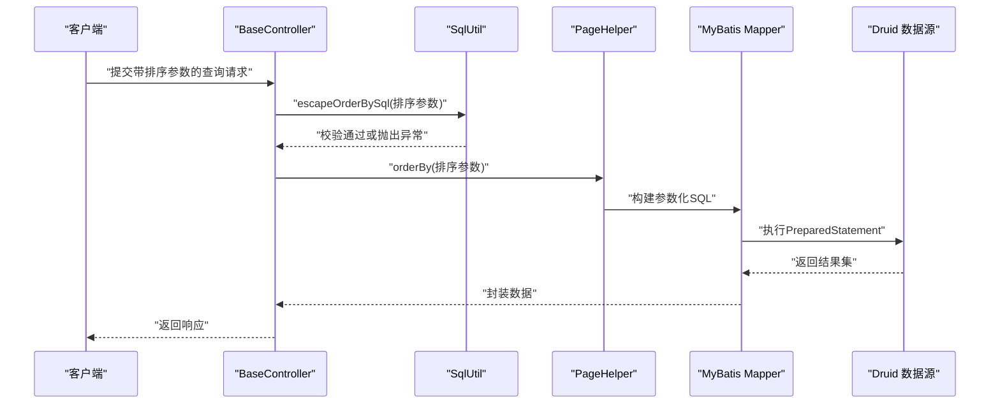
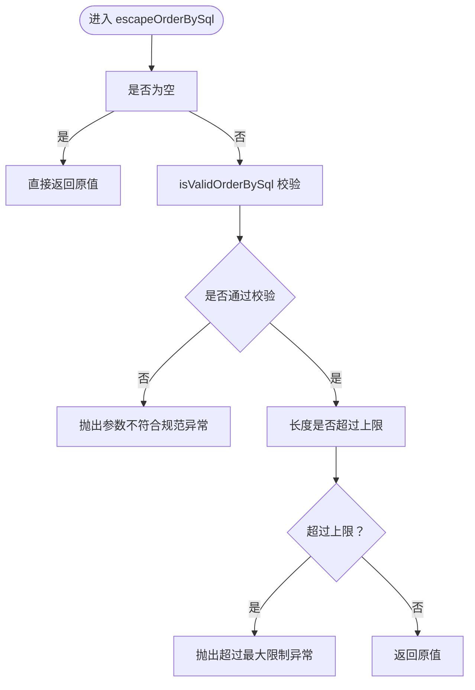
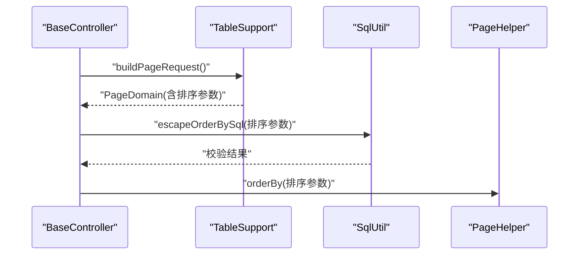
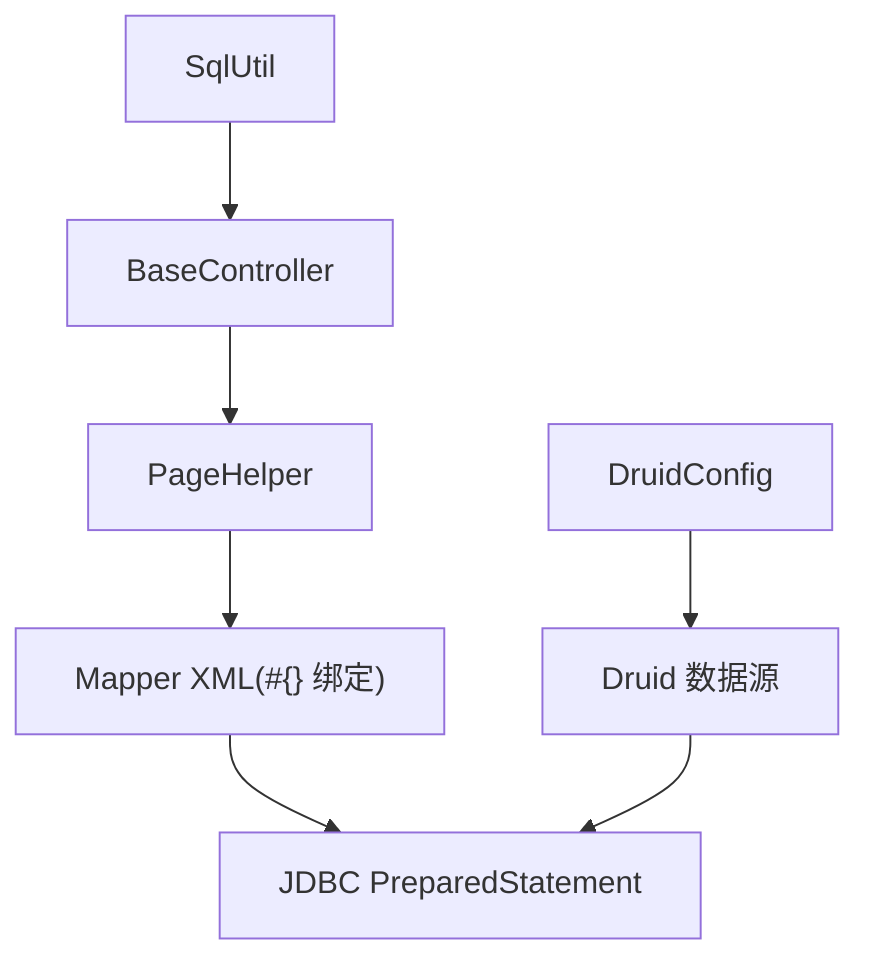

# SQL注入防护

<cite>
**本文引用的文件**
- [ruoyi-common/src/main/java/com/ruoyi/common/utils/sql/SqlUtil.java](file://ruoyi-common/src/main/java/com/ruoyi/common/utils/sql/SqlUtil.java)
- [ruoyi-common/src/main/java/com/ruoyi/common/core/controller/BaseController.java](file://ruoyi-common/src/main/java/com/ruoyi/common/core/controller/BaseController.java)
- [ruoyi-common/src/main/java/com/ruoyi/common/core/page/TableSupport.java](file://ruoyi-common/src/main/java/com/ruoyi/common/core/page/TableSupport.java)
- [ruoyi-admin/src/main/resources/mybatis/mybatis-config.xml](file://ruoyi-admin/src/main/resources/mybatis/mybatis-config.xml)
- [ruoyi-system/src/main/resources/mapper/system/SysConfigMapper.xml](file://ruoyi-system/src/main/resources/mapper/system/SysConfigMapper.xml)
- [ruoyi-system/src/main/resources/mapper/system/SysPostMapper.xml](file://ruoyi-system/src/main/resources/mapper/system/SysPostMapper.xml)
- [ruoyi-system/src/main/resources/mapper/system/SysUserMapper.xml](file://ruoyi-system/src/main/resources/mapper/system/SysUserMapper.xml)
- [ruoyi-generator/src/main/resources/vm/xml/mapper.xml.vm](file://ruoyi-generator/src/main/resources/vm/xml/mapper.xml.vm)
- [ruoyi-framework/src/main/java/com/ruoyi/framework/config/DruidConfig.java](file://ruoyi-framework/src/main/java/com/ruoyi/framework/config/DruidConfig.java)
- [ruoyi-admin/src/main/resources/application-druid.yml](file://ruoyi-admin/src/main/resources/application-druid.yml)
- [ruoyi-admin/src/main/resources/application.yml](file://ruoyi-admin/src/main/resources/application.yml)
- [ruoyi-common/src/main/java/com/ruoyi/common/xss/XssFilter.java](file://ruoyi-common/src/main/java/com/ruoyi/common/xss/XssFilter.java)
- [ruoyi-common/src/main/java/com/ruoyi/common/xss/XssHttpServletRequestWrapper.java](file://ruoyi-common/src/main/java/com/ruoyi/common/xss/XssHttpServletRequestWrapper.java)
- [ruoyi-common/src/main/java/com/ruoyi/common/xss/XssValidator.java](file://ruoyi-common/src/main/java/com/ruoyi/common/xss/XssValidator.java)
</cite>

## 目录
1. [简介](#简介)
2. [项目结构](#项目结构)
3. [核心组件](#核心组件)
4. [架构总览](#架构总览)
5. [详细组件分析](#详细组件分析)
6. [依赖分析](#依赖分析)
7. [性能考虑](#性能考虑)
8. [故障排查指南](#故障排查指南)
9. [结论](#结论)
10. [附录](#附录)

## 简介
本文件面向RuoYi系统，围绕SQL注入防护机制展开，重点覆盖以下方面：
- SqlUtil工具类的SQL安全过滤能力：危险字符检测、SQL关键字过滤、排序参数合法性校验与长度限制。
- MyBatis映射文件中的参数绑定机制与“#{}”与“${}”的使用差异及安全影响。
- 预编译语句（PreparedStatement）的使用原则与最佳实践。
- 数据库操作的安全编码规范：输入验证、参数化查询、存储过程调用注意事项。
- 常见SQL注入攻击手法与对应防护策略。
- 数据库层面的安全配置建议。

## 项目结构
RuoYi系统采用多模块结构，与SQL注入防护相关的关键位置如下：
- 通用工具与安全：ruoyi-common（SqlUtil、XSS过滤、分页与表格支持）
- 框架配置：ruoyi-framework（Druid连接池配置、MyBatis配置）
- 业务模块：ruoyi-system（Mapper XML示例）
- 代码生成：ruoyi-generator（模板生成的Mapper XML）

图表来源
- [ruoyi-common/src/main/java/com/ruoyi/common/utils/sql/SqlUtil.java:1-72](file://ruoyi-common/src/main/java/com/ruoyi/common/utils/sql/SqlUtil.java#L1-L72)
- [ruoyi-common/src/main/java/com/ruoyi/common/core/page/TableSupport.java:1-56](file://ruoyi-common/src/main/java/com/ruoyi/common/core/page/TableSupport.java#L1-L56)
- [ruoyi-admin/src/main/resources/mybatis/mybatis-config.xml:1-20](file://ruoyi-admin/src/main/resources/mybatis/mybatis-config.xml#L1-L20)
- [ruoyi-framework/src/main/java/com/ruoyi/framework/config/DruidConfig.java:1-129](file://ruoyi-framework/src/main/java/com/ruoyi/framework/config/DruidConfig.java#L1-L129)
- [ruoyi-system/src/main/resources/mapper/system/SysUserMapper.xml:49-158](file://ruoyi-system/src/main/resources/mapper/system/SysUserMapper.xml#L49-L158)
- [ruoyi-system/src/main/resources/mapper/system/SysConfigMapper.xml:1-36](file://ruoyi-system/src/main/resources/mapper/system/SysConfigMapper.xml#L1-L36)
- [ruoyi-system/src/main/resources/mapper/system/SysPostMapper.xml:1-35](file://ruoyi-system/src/main/resources/mapper/system/SysPostMapper.xml#L1-L35)
- [ruoyi-generator/src/main/resources/vm/xml/mapper.xml.vm:87-118](file://ruoyi-generator/src/main/resources/vm/xml/mapper.xml.vm#L87-L118)

章节来源
- [ruoyi-common/src/main/java/com/ruoyi/common/utils/sql/SqlUtil.java:1-72](file://ruoyi-common/src/main/java/com/ruoyi/common/utils/sql/SqlUtil.java#L1-L72)
- [ruoyi-common/src/main/java/com/ruoyi/common/core/page/TableSupport.java:1-56](file://ruoyi-common/src/main/java/com/ruoyi/common/core/page/TableSupport.java#L1-L56)
- [ruoyi-admin/src/main/resources/mybatis/mybatis-config.xml:1-20](file://ruoyi-admin/src/main/resources/mybatis/mybatis-config.xml#L1-L20)
- [ruoyi-framework/src/main/java/com/ruoyi/framework/config/DruidConfig.java:1-129](file://ruoyi-framework/src/main/java/com/ruoyi/framework/config/DruidConfig.java#L1-L129)
- [ruoyi-system/src/main/resources/mapper/system/SysUserMapper.xml:49-158](file://ruoyi-system/src/main/resources/mapper/system/SysUserMapper.xml#L49-L158)
- [ruoyi-system/src/main/resources/mapper/system/SysConfigMapper.xml:1-36](file://ruoyi-system/src/main/resources/mapper/system/SysConfigMapper.xml#L1-L36)
- [ruoyi-system/src/main/resources/mapper/system/SysPostMapper.xml:1-35](file://ruoyi-system/src/main/resources/mapper/system/SysPostMapper.xml#L1-L35)
- [ruoyi-generator/src/main/resources/vm/xml/mapper.xml.vm:87-118](file://ruoyi-generator/src/main/resources/vm/xml/mapper.xml.vm#L87-L118)

## 核心组件
- SqlUtil：提供排序参数合法性校验、关键字过滤、长度限制等安全能力，用于拦截潜在的注入式排序参数与危险关键字。
- BaseController：在分页排序场景中调用SqlUtil对排序参数进行安全处理，并通过PageHelper设置排序。
- MyBatis配置：启用日志、缓存、默认执行器等，确保SQL执行可审计与可观察。
- Druid数据源：提供连接池健康监控、慢SQL统计、白名单控制等能力，辅助发现异常SQL行为。
- XSS过滤器：作为输入清洗的第一道防线，减少恶意输入进入后端逻辑。

章节来源
- [ruoyi-common/src/main/java/com/ruoyi/common/utils/sql/SqlUtil.java:1-72](file://ruoyi-common/src/main/java/com/ruoyi/common/utils/sql/SqlUtil.java#L1-L72)
- [ruoyi-common/src/main/java/com/ruoyi/common/core/controller/BaseController.java:65-73](file://ruoyi-common/src/main/java/com/ruoyi/common/core/controller/BaseController.java#L65-L73)
- [ruoyi-admin/src/main/resources/mybatis/mybatis-config.xml:1-20](file://ruoyi-admin/src/main/resources/mybatis/mybatis-config.xml#L1-L20)
- [ruoyi-framework/src/main/java/com/ruoyi/framework/config/DruidConfig.java:1-129](file://ruoyi-framework/src/main/java/com/ruoyi/framework/config/DruidConfig.java#L1-L129)
- [ruoyi-common/src/main/java/com/ruoyi/common/xss/XssFilter.java:1-74](file://ruoyi-common/src/main/java/com/ruoyi/common/xss/XssFilter.java#L1-L74)

## 架构总览
RuoYi在SQL注入防护上的整体思路：
- 输入层：XSS过滤器对请求参数进行清洗；SqlUtil对排序参数进行白名单与长度校验。
- 映射层：MyBatis使用#{}进行参数绑定，避免拼接导致的注入；模板生成的XML也统一采用#{}。
- 执行层：Druid连接池监控SQL执行，结合PageHelper与分页参数，降低越权与滥用风险。
- 配置层：application.yml集中声明MyBatis、分页、XSS等安全相关配置。

图表来源
- [ruoyi-common/src/main/java/com/ruoyi/common/core/controller/BaseController.java:65-73](file://ruoyi-common/src/main/java/com/ruoyi/common/core/controller/BaseController.java#L65-L73)
- [ruoyi-common/src/main/java/com/ruoyi/common/utils/sql/SqlUtil.java:31-42](file://ruoyi-common/src/main/java/com/ruoyi/common/utils/sql/SqlUtil.java#L31-L42)
- [ruoyi-admin/src/main/resources/mybatis/mybatis-config.xml:1-20](file://ruoyi-admin/src/main/resources/mybatis/mybatis-config.xml#L1-L20)
- [ruoyi-framework/src/main/java/com/ruoyi/framework/config/DruidConfig.java:1-129](file://ruoyi-framework/src/main/java/com/ruoyi/framework/config/DruidConfig.java#L1-L129)

## 详细组件分析

### SqlUtil：SQL安全过滤与排序参数校验
- 关键字过滤：维护常用SQL关键字正则，对输入进行归一化后匹配，命中即抛出异常，阻止潜在注入。
- 排序参数校验：仅允许字母、数字、下划线、空格、逗号、点号，防止注入式ORDER BY；同时限制最大长度，避免超长参数。
- 异常类型：UtilException，便于上层捕获与统一处理。

图表来源
- [ruoyi-common/src/main/java/com/ruoyi/common/utils/sql/SqlUtil.java:31-50](file://ruoyi-common/src/main/java/com/ruoyi/common/utils/sql/SqlUtil.java#L31-L50)

章节来源
- [ruoyi-common/src/main/java/com/ruoyi/common/utils/sql/SqlUtil.java:1-72](file://ruoyi-common/src/main/java/com/ruoyi/common/utils/sql/SqlUtil.java#L1-L72)

### BaseController：分页排序安全入口
- 在startOrderBy中读取分页参数，调用SqlUtil对排序参数进行安全处理，再交由PageHelper设置排序，确保排序参数始终受控。

图表来源
- [ruoyi-common/src/main/java/com/ruoyi/common/core/controller/BaseController.java:65-73](file://ruoyi-common/src/main/java/com/ruoyi/common/core/controller/BaseController.java#L65-L73)
- [ruoyi-common/src/main/java/com/ruoyi/common/core/page/TableSupport.java:52-55](file://ruoyi-common/src/main/java/com/ruoyi/common/core/page/TableSupport.java#L52-L55)

章节来源
- [ruoyi-common/src/main/java/com/ruoyi/common/core/controller/BaseController.java:65-73](file://ruoyi-common/src/main/java/com/ruoyi/common/core/controller/BaseController.java#L65-L73)
- [ruoyi-common/src/main/java/com/ruoyi/common/core/page/TableSupport.java:1-56](file://ruoyi-common/src/main/java/com/ruoyi/common/core/page/TableSupport.java#L1-L56)

### MyBatis映射文件与参数绑定：#{} vs ${}
- 参数绑定：映射文件广泛使用#{}进行参数绑定，确保传入值以参数形式参与SQL执行，避免字符串拼接引发注入。
- 动态SQL：部分场景使用${}拼接（如数据范围过滤），需严格控制来源与范围，避免直接暴露用户输入。
- 生成模板：代码生成器模板同样采用#{}绑定，保证生成的SQL具备参数化特性。

图表来源
- [ruoyi-system/src/main/resources/mapper/system/SysUserMapper.xml:97-123](file://ruoyi-system/src/main/resources/mapper/system/SysUserMapper.xml#L97-L123)
- [ruoyi-system/src/main/resources/mapper/system/SysConfigMapper.xml:25-34](file://ruoyi-system/src/main/resources/mapper/system/SysConfigMapper.xml#L25-L34)
- [ruoyi-system/src/main/resources/mapper/system/SysPostMapper.xml:25-35](file://ruoyi-system/src/main/resources/mapper/system/SysPostMapper.xml#L25-L35)
- [ruoyi-generator/src/main/resources/vm/xml/mapper.xml.vm:91-118](file://ruoyi-generator/src/main/resources/vm/xml/mapper.xml.vm#L91-L118)

章节来源
- [ruoyi-system/src/main/resources/mapper/system/SysUserMapper.xml:49-158](file://ruoyi-system/src/main/resources/mapper/system/SysUserMapper.xml#L49-L158)
- [ruoyi-system/src/main/resources/mapper/system/SysConfigMapper.xml:1-36](file://ruoyi-system/src/main/resources/mapper/system/SysConfigMapper.xml#L1-L36)
- [ruoyi-system/src/main/resources/mapper/system/SysPostMapper.xml:1-35](file://ruoyi-system/src/main/resources/mapper/system/SysPostMapper.xml#L1-L35)
- [ruoyi-generator/src/main/resources/vm/xml/mapper.xml.vm:87-118](file://ruoyi-generator/src/main/resources/vm/xml/mapper.xml.vm#L87-L118)

### 预编译语句（PreparedStatement）使用原则与最佳实践
- 原则
  - 优先使用#{}进行参数绑定，避免任何字符串拼接。
  - 对LIKE查询使用函数包裹或显式拼接，避免直接拼接用户输入。
  - 对IN子句、动态表名/列名等动态内容，必须进行白名单校验与长度限制。
- 最佳实践
  - 使用PageHelper时，排序参数必须经SqlUtil校验。
  - 对日期/时间范围查询，使用范围参数绑定而非字符串拼接。
  - 存储过程调用时，使用IN/OUT参数绑定，避免动态拼接SQL。

章节来源
- [ruoyi-common/src/main/java/com/ruoyi/common/utils/sql/SqlUtil.java:1-72](file://ruoyi-common/src/main/java/com/ruoyi/common/utils/sql/SqlUtil.java#L1-L72)
- [ruoyi-system/src/main/resources/mapper/system/SysUserMapper.xml:66-72](file://ruoyi-system/src/main/resources/mapper/system/SysUserMapper.xml#L66-L72)

### 数据库操作安全编码规范
- 用户输入验证
  - 在Controller层对必填字段、长度、格式进行校验；对排序参数使用SqlUtil进行白名单与长度校验。
- 参数化查询
  - 所有外部输入均通过#{}绑定；避免使用${}拼接。
- 存储过程调用
  - 严格限定参数类型与长度；避免动态拼接SQL。
- 动态SQL
  - 对动态表名/列名进行白名单校验；对动态WHERE片段进行严格来源控制。

章节来源
- [ruoyi-common/src/main/java/com/ruoyi/common/core/controller/BaseController.java:65-73](file://ruoyi-common/src/main/java/com/ruoyi/common/core/controller/BaseController.java#L65-L73)
- [ruoyi-common/src/main/java/com/ruoyi/common/utils/sql/SqlUtil.java:1-72](file://ruoyi-common/src/main/java/com/ruoyi/common/utils/sql/SqlUtil.java#L1-L72)
- [ruoyi-system/src/main/resources/mapper/system/SysUserMapper.xml:97-123](file://ruoyi-system/src/main/resources/mapper/system/SysUserMapper.xml#L97-L123)

### 常见SQL注入攻击手法与防护策略
- 注入手法
  - 注释符绕过、UNION查询、函数注入（如extractvalue/updatexml）、系统函数（如user()）、关键字变形等。
- 防护策略
  - 使用SqlUtil关键字过滤与排序参数白名单校验，阻断注入尝试。
  - 严格区分#{}与${}，禁止在动态SQL中直接拼接用户输入。
  - 对LIKE、IN、动态表名/列名等场景进行白名单与长度限制。

章节来源
- [ruoyi-common/src/main/java/com/ruoyi/common/utils/sql/SqlUtil.java:16-70](file://ruoyi-common/src/main/java/com/ruoyi/common/utils/sql/SqlUtil.java#L16-L70)

### 数据库层面的安全配置建议
- 连接池与监控
  - 启用Druid慢SQL记录与白名单控制，定期审查慢SQL与异常访问。
  - 合理设置连接池参数（初始大小、最大活跃、空闲、超时）。
- 访问控制
  - 限制数据库账户权限，按最小权限原则分配。
  - 对控制台访问设置白名单与强口令。
- 审计与日志
  - 启用数据库审计与慢查询日志，结合Druid监控定位问题。

章节来源
- [ruoyi-framework/src/main/java/com/ruoyi/framework/config/DruidConfig.java:1-129](file://ruoyi-framework/src/main/java/com/ruoyi/framework/config/DruidConfig.java#L1-L129)
- [ruoyi-admin/src/main/resources/application-druid.yml:33-61](file://ruoyi-admin/src/main/resources/application-druid.yml#L33-L61)
- [ruoyi-admin/src/main/resources/application.yml:125-132](file://ruoyi-admin/src/main/resources/application.yml#L125-L132)

## 依赖分析
- SqlUtil与BaseController：BaseController在分页排序阶段依赖SqlUtil进行参数校验，耦合度低、职责清晰。
- MyBatis与Mapper：Mapper XML统一采用#{}绑定，生成模板亦遵循该原则，降低误用风险。
- Druid与监控：DruidConfig负责数据源装配与监控过滤器注册，为SQL审计提供基础。

图表来源
- [ruoyi-common/src/main/java/com/ruoyi/common/utils/sql/SqlUtil.java:1-72](file://ruoyi-common/src/main/java/com/ruoyi/common/utils/sql/SqlUtil.java#L1-L72)
- [ruoyi-common/src/main/java/com/ruoyi/common/core/controller/BaseController.java:65-73](file://ruoyi-common/src/main/java/com/ruoyi/common/core/controller/BaseController.java#L65-L73)
- [ruoyi-system/src/main/resources/mapper/system/SysUserMapper.xml:49-158](file://ruoyi-system/src/main/resources/mapper/system/SysUserMapper.xml#L49-L158)
- [ruoyi-framework/src/main/java/com/ruoyi/framework/config/DruidConfig.java:1-129](file://ruoyi-framework/src/main/java/com/ruoyi/framework/config/DruidConfig.java#L1-L129)

章节来源
- [ruoyi-common/src/main/java/com/ruoyi/common/utils/sql/SqlUtil.java:1-72](file://ruoyi-common/src/main/java/com/ruoyi/common/utils/sql/SqlUtil.java#L1-L72)
- [ruoyi-common/src/main/java/com/ruoyi/common/core/controller/BaseController.java:65-73](file://ruoyi-common/src/main/java/com/ruoyi/common/core/controller/BaseController.java#L65-L73)
- [ruoyi-system/src/main/resources/mapper/system/SysUserMapper.xml:49-158](file://ruoyi-system/src/main/resources/mapper/system/SysUserMapper.xml#L49-L158)
- [ruoyi-framework/src/main/java/com/ruoyi/framework/config/DruidConfig.java:1-129](file://ruoyi-framework/src/main/java/com/ruoyi/framework/config/DruidConfig.java#L1-L129)

## 性能考虑
- 参数化查询提升复用率与缓存效率，减少SQL解析开销。
- 合理设置分页大小与排序字段，避免超长排序参数带来的额外校验成本。
- 使用Druid慢SQL监控，及时发现并优化热点SQL。

## 故障排查指南
- 排序参数异常
  - 现象：请求报错提示参数不符合规范或超过最大限制。
  - 排查：确认前端传参是否仅包含字母、数字、下划线、空格、逗号、点号；检查排序长度是否超过限制。
- 关键字触发异常
  - 现象：请求报错提示包含敏感关键词。
  - 排查：检查输入是否包含SQL关键字或变形；确认未误用${}拼接。
- XSS过滤影响
  - 现象：参数被清洗或截断。
  - 排查：确认XSS过滤配置与排除列表；必要时调整urlPatterns与excludes。
- Druid监控告警
  - 现象：慢SQL或异常访问告警。
  - 排查：查看控制台白名单与登录凭据；核对SQL执行计划与参数绑定情况。

章节来源
- [ruoyi-common/src/main/java/com/ruoyi/common/utils/sql/SqlUtil.java:31-70](file://ruoyi-common/src/main/java/com/ruoyi/common/utils/sql/SqlUtil.java#L31-L70)
- [ruoyi-common/src/main/java/com/ruoyi/common/xss/XssFilter.java:1-74](file://ruoyi-common/src/main/java/com/ruoyi/common/xss/XssFilter.java#L1-L74)
- [ruoyi-framework/src/main/java/com/ruoyi/framework/config/DruidConfig.java:85-127](file://ruoyi-framework/src/main/java/com/ruoyi/framework/config/DruidConfig.java#L85-L127)

## 结论
RuoYi通过“输入清洗（XSS）+ 排序参数白名单与长度限制（SqlUtil）+ 参数化绑定（MyBatis）+ 连接池监控（Druid）”的多层防护体系，有效降低了SQL注入风险。实际开发中应坚持使用#{}、严格校验动态SQL来源、合理配置监控与白名单，持续优化慢SQL与参数化执行效率。

## 附录
- 配置要点
  - MyBatis：typeAliasesPackage、mapperLocations、configLocation。
  - PageHelper：helperDialect、supportMethodsArguments、params。
  - XSS：enabled、excludes、urlPatterns。
  - Druid：initialSize、maxActive、minIdle、validationQuery、statViewServlet、wall配置。

章节来源
- [ruoyi-admin/src/main/resources/application.yml:71-85](file://ruoyi-admin/src/main/resources/application.yml#L71-L85)
- [ruoyi-admin/src/main/resources/application.yml:125-132](file://ruoyi-admin/src/main/resources/application.yml#L125-L132)
- [ruoyi-admin/src/main/resources/application.yml:1-154](file://ruoyi-admin/src/main/resources/application.yml#L1-L154)
- [ruoyi-admin/src/main/resources/application-druid.yml:1-61](file://ruoyi-admin/src/main/resources/application-druid.yml#L1-L61)
- [ruoyi-admin/src/main/resources/mybatis/mybatis-config.xml:1-20](file://ruoyi-admin/src/main/resources/mybatis/mybatis-config.xml#L1-L20)