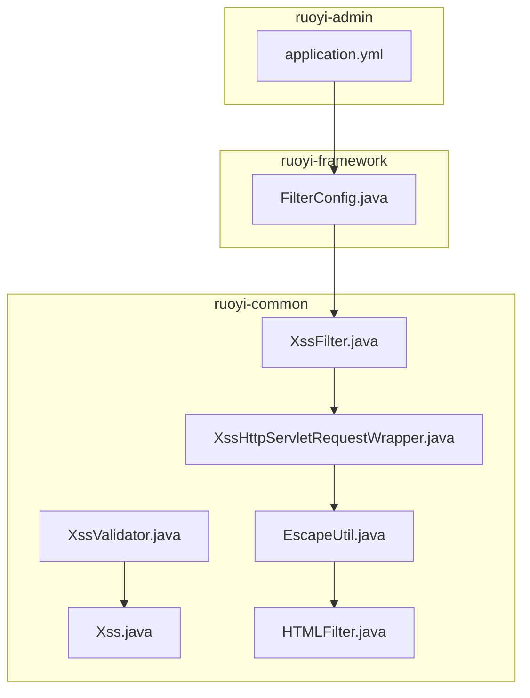
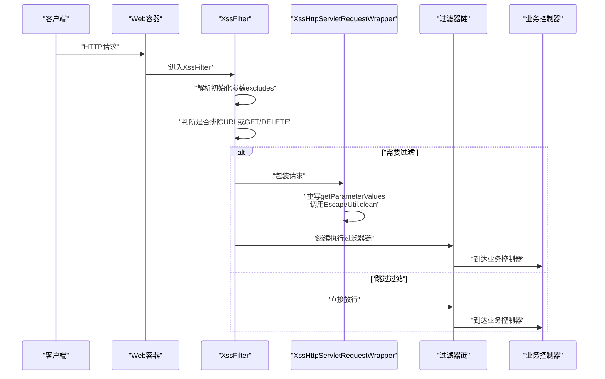
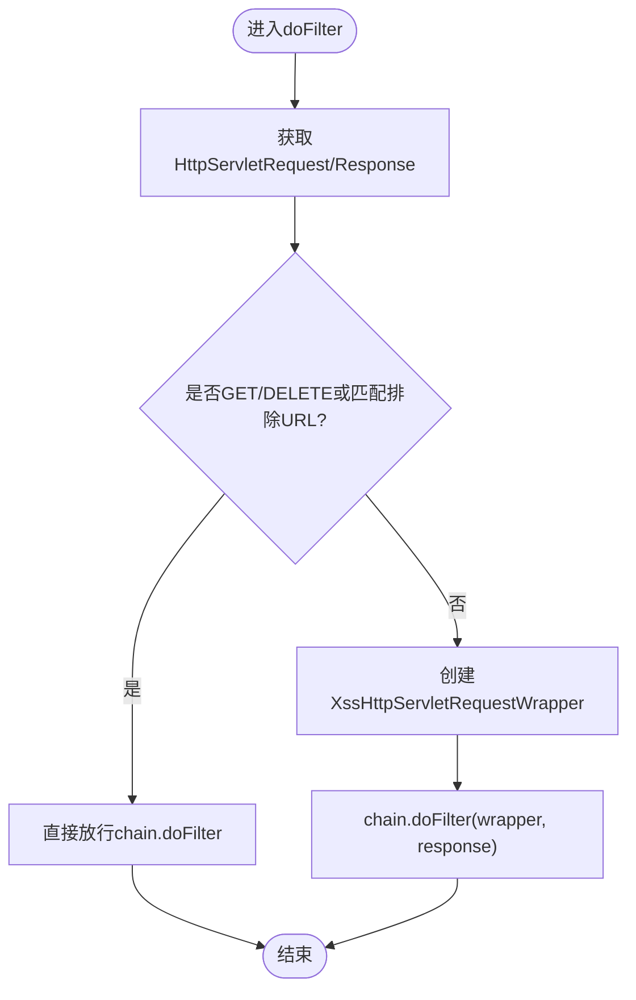
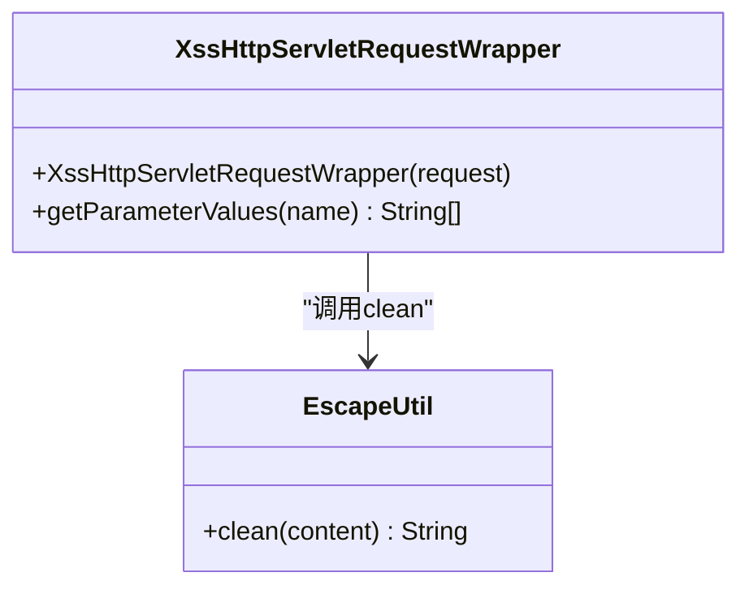
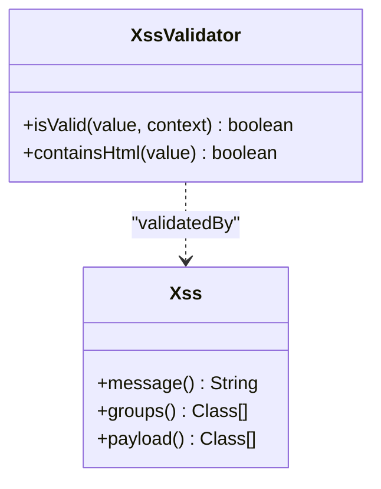
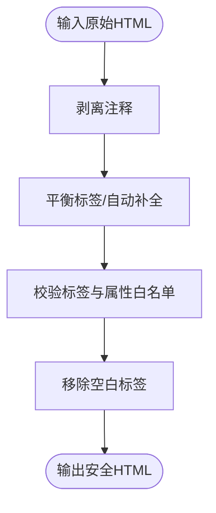
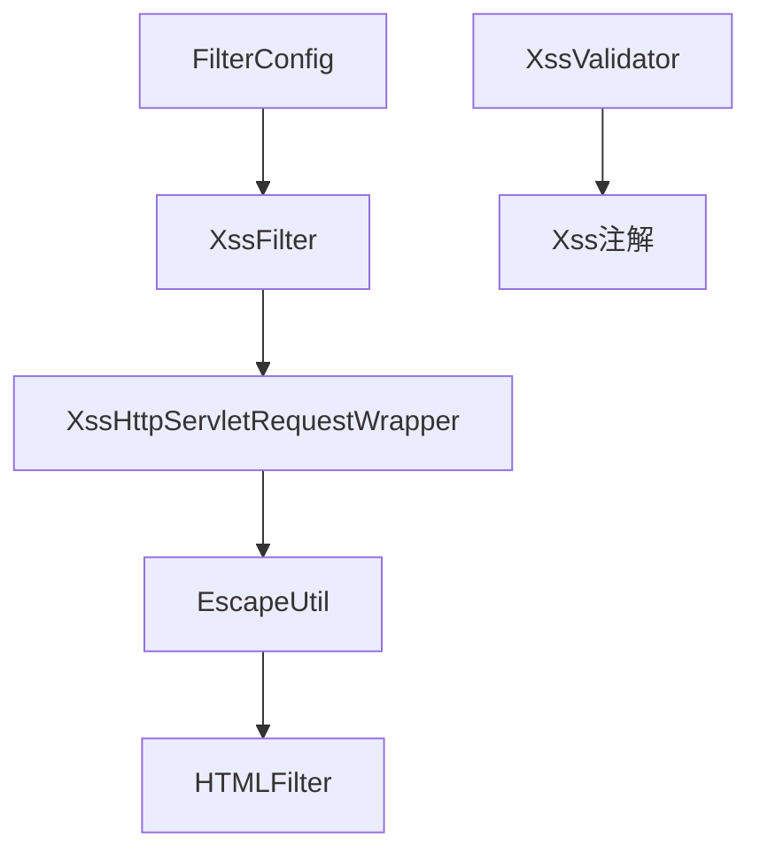

# XSS跨站脚本攻击防护

<cite>
**本文档引用的文件**
- [XssFilter.java](file://ruoyi-common/src/main/java/com/ruoyi/common/xss/XssFilter.java)
- [XssHttpServletRequestWrapper.java](file://ruoyi-common/src/main/java/com/ruoyi/common/xss/XssHttpServletRequestWrapper.java)
- [XssValidator.java](file://ruoyi-common/src/main/java/com/ruoyi/common/xss/XssValidator.java)
- [Xss.java](file://ruoyi-common/src/main/java/com/ruoyi/common/xss/Xss.java)
- [HTMLFilter.java](file://ruoyi-common/src/main/java/com/ruoyi/common/utils/html/HTMLFilter.java)
- [EscapeUtil.java](file://ruoyi-common/src/main/java/com/ruoyi/common/utils/html/EscapeUtil.java)
- [FilterConfig.java](file://ruoyi-framework/src/main/java/com/ruoyi/framework/config/FilterConfig.java)
- [application.yml](file://ruoyi-admin/src/main/resources/application.yml)
</cite>

## 目录
1. [简介](#简介)
2. [项目结构](#项目结构)
3. [核心组件](#核心组件)
4. [架构总览](#架构总览)
5. [详细组件分析](#详细组件分析)
6. [依赖关系分析](#依赖关系分析)
7. [性能考虑](#性能考虑)
8. [故障排查指南](#故障排查指南)
9. [结论](#结论)
10. [附录](#附录)

## 简介
本技术文档围绕RuoYi系统中的XSS（跨站脚本攻击）防护机制展开，重点解析以下关键组件与实现细节：
- XssFilter过滤器：负责在请求进入业务层前进行XSS拦截与参数清洗。
- XssHttpServletRequestWrapper包装器：重写请求参数方法，对输入内容进行转义与清理。
- XssValidator验证器：基于注解的后端校验，检测是否包含HTML标签。
- HTMLFilter：通用HTML标签过滤器，提供白名单机制与协议限制。
- EscapeUtil：统一的转义/反转义与HTML清理工具。
- FilterConfig与application.yml：XSS过滤器的装配、启用与配置。

通过本文件，读者可以全面理解RuoYi的XSS防护体系、配置方法以及常见攻击场景的应对策略。

## 项目结构
XSS防护相关代码主要分布在两个模块：
- ruoyi-common：包含XSS过滤器、包装器、验证注解、HTML过滤器与转义工具。
- ruoyi-framework：包含过滤器注册与装配逻辑，以及Spring Boot条件化启用。
- ruoyi-admin：包含系统配置文件，提供XSS过滤器的开关、排除URL与匹配模式等配置项。

图表来源
- [XssFilter.java:1-74](file://ruoyi-common/src/main/java/com/ruoyi/common/xss/XssFilter.java#L1-L74)
- [XssHttpServletRequestWrapper.java:1-39](file://ruoyi-common/src/main/java/com/ruoyi/common/xss/XssHttpServletRequestWrapper.java#L1-L39)
- [HTMLFilter.java:1-570](file://ruoyi-common/src/main/java/com/ruoyi/common/utils/html/HTMLFilter.java#L1-L570)
- [EscapeUtil.java:1-168](file://ruoyi-common/src/main/java/com/ruoyi/common/utils/html/EscapeUtil.java#L1-L168)
- [XssValidator.java:1-39](file://ruoyi-common/src/main/java/com/ruoyi/common/xss/XssValidator.java#L1-L39)
- [Xss.java:1-28](file://ruoyi-common/src/main/java/com/ruoyi/common/xss/Xss.java#L1-L28)
- [FilterConfig.java:1-45](file://ruoyi-framework/src/main/java/com/ruoyi/framework/config/FilterConfig.java#L1-L45)
- [application.yml:125-133](file://ruoyi-admin/src/main/resources/application.yml#L125-L133)

章节来源
- [XssFilter.java:1-74](file://ruoyi-common/src/main/java/com/ruoyi/common/xss/XssFilter.java#L1-L74)
- [FilterConfig.java:19-43](file://ruoyi-framework/src/main/java/com/ruoyi/framework/config/FilterConfig.java#L19-L43)
- [application.yml:125-133](file://ruoyi-admin/src/main/resources/application.yml#L125-L133)

## 核心组件
- XssFilter：实现javax.servlet.Filter接口，负责在请求到达业务控制器前进行XSS过滤。其初始化参数来自FilterConfig，支持从配置中读取“排除URL”列表；在请求处理阶段，对非排除且非GET/DELETE方法的请求，使用XssHttpServletRequestWrapper进行包装后再放行。
- XssHttpServletRequestWrapper：继承自HttpServletRequestWrapper，重写getParameterValues方法，对每个参数值调用EscapeUtil.clean进行HTML清理，并进行trim去空白，从而在源头上消除潜在XSS风险。
- XssValidator：实现ConstraintValidator<Xss, String>，用于字段或参数级别的后端校验。其核心逻辑是判断输入是否包含HTML标签，若包含则拒绝。
- Xss注解：声明式约束，配合XssValidator使用，可直接标注在实体字段、方法参数等位置。
- HTMLFilter：通用HTML过滤器，提供白名单元素与属性、协议限制、注释剥离、自闭合标签处理、空白标签移除等功能，是EscapeUtil.clean的底层实现。
- EscapeUtil：提供escape/unescape编码解码、clean清理HTML标签等能力，内部委托HTMLFilter完成过滤。

章节来源
- [XssFilter.java:21-74](file://ruoyi-common/src/main/java/com/ruoyi/common/xss/XssFilter.java#L21-L74)
- [XssHttpServletRequestWrapper.java:12-39](file://ruoyi-common/src/main/java/com/ruoyi/common/xss/XssHttpServletRequestWrapper.java#L12-L39)
- [XssValidator.java:14-39](file://ruoyi-common/src/main/java/com/ruoyi/common/xss/XssValidator.java#L14-L39)
- [Xss.java:15-27](file://ruoyi-common/src/main/java/com/ruoyi/common/xss/Xss.java#L15-L27)
- [HTMLFilter.java:18-570](file://ruoyi-common/src/main/java/com/ruoyi/common/utils/html/HTMLFilter.java#L18-L570)
- [EscapeUtil.java:10-62](file://ruoyi-common/src/main/java/com/ruoyi/common/utils/html/EscapeUtil.java#L10-L62)

## 架构总览
下图展示了XSS防护在请求生命周期中的作用点与组件协作关系：

图表来源
- [XssFilter.java:29-67](file://ruoyi-common/src/main/java/com/ruoyi/common/xss/XssFilter.java#L29-L67)
- [XssHttpServletRequestWrapper.java:22-38](file://ruoyi-common/src/main/java/com/ruoyi/common/xss/XssHttpServletRequestWrapper.java#L22-L38)
- [FilterConfig.java:30-43](file://ruoyi-framework/src/main/java/com/ruoyi/framework/config/FilterConfig.java#L30-L43)

## 详细组件分析

### XssFilter过滤器
- 初始化流程：从FilterConfig读取excludes参数，按逗号拆分后填充到排除列表。
- 请求处理流程：
  - 获取请求路径与方法，若为GET或DELETE则直接放行；
  - 否则判断当前URL是否匹配排除列表，若匹配则放行；
  - 否则使用XssHttpServletRequestWrapper包装请求，再继续过滤器链。
- 关键点：
  - 仅对非GET/DELETE请求进行过滤，减少对只读请求的开销；
  - 支持多URL模式匹配，便于精细化控制；
  - 通过包装器实现对参数的统一清洗。

图表来源
- [XssFilter.java:42-67](file://ruoyi-common/src/main/java/com/ruoyi/common/xss/XssFilter.java#L42-L67)

章节来源
- [XssFilter.java:28-74](file://ruoyi-common/src/main/java/com/ruoyi/common/xss/XssFilter.java#L28-L74)

### XssHttpServletRequestWrapper包装器
- 重写方法：getParameterValues(String name)
- 处理逻辑：
  - 若存在参数值数组，则逐项调用EscapeUtil.clean进行HTML清理；
  - 对清理结果进行trim去空白，避免多余空格影响后续处理；
  - 返回新的字符串数组，确保业务层接收的是“已清洗”的参数。
- 影响范围：所有通过getParameterValues获取的表单参数均会被清洗，覆盖POST、PUT等写操作。

图表来源
- [XssHttpServletRequestWrapper.java:12-39](file://ruoyi-common/src/main/java/com/ruoyi/common/xss/XssHttpServletRequestWrapper.java#L12-L39)
- [EscapeUtil.java:59-62](file://ruoyi-common/src/main/java/com/ruoyi/common/utils/html/EscapeUtil.java#L59-L62)

章节来源
- [XssHttpServletRequestWrapper.java:22-38](file://ruoyi-common/src/main/java/com/ruoyi/common/xss/XssHttpServletRequestWrapper.java#L22-L38)

### XssValidator验证器与Xss注解
- Xss注解：声明式约束，支持在方法、字段、构造函数、参数上使用，默认提示信息为“不允许任何脚本运行”，可指定分组与负载。
- XssValidator：
  - 对空值直接返回true（允许），避免对必填字段产生误判；
  - 使用正则匹配HTML标签，若发现HTML片段则判定为不合法；
  - 作为Bean Validation的一部分，在参数绑定或数据校验阶段生效。

图表来源
- [Xss.java:15-27](file://ruoyi-common/src/main/java/com/ruoyi/common/xss/Xss.java#L15-L27)
- [XssValidator.java:14-39](file://ruoyi-common/src/main/java/com/ruoyi/common/xss/XssValidator.java#L14-L39)

章节来源
- [Xss.java:10-27](file://ruoyi-common/src/main/java/com/ruoyi/common/xss/Xss.java#L10-L27)
- [XssValidator.java:18-38](file://ruoyi-common/src/main/java/com/ruoyi/common/xss/XssValidator.java#L18-L38)

### HTMLFilter的HTML标签过滤策略
- 白名单机制：
  - 允许元素集合：如a（允许href、target）、img（允许src、width、height、alt）、b、strong、i、em等；
  - 自闭合标签：如img；
  - 必须成对出现的标签：如a、b、strong、i、em；
  - 协议限制：仅允许http、mailto、https等协议；
  - 实体与转义：对特定HTML实体进行校验与转义。
- 过滤步骤：
  - 去除注释；
  - 平衡标签（可选择是否自动补全）；
  - 校验标签与属性，保留白名单内元素；
  - 移除空白标签；
  - 最终输出安全的HTML字符串。
- 性能与可用性：
  - 提供可配置构造，支持通过Map传入白名单、协议、属性等；
  - 内部使用并发安全的模式缓存，提升重复过滤场景的性能。

图表来源
- [HTMLFilter.java:198-214](file://ruoyi-common/src/main/java/com/ruoyi/common/utils/html/HTMLFilter.java#L198-L214)
- [HTMLFilter.java:103-135](file://ruoyi-common/src/main/java/com/ruoyi/common/utils/html/HTMLFilter.java#L103-L135)

章节来源
- [HTMLFilter.java:54-135](file://ruoyi-common/src/main/java/com/ruoyi/common/utils/html/HTMLFilter.java#L54-L135)
- [HTMLFilter.java:226-298](file://ruoyi-common/src/main/java/com/ruoyi/common/utils/html/HTMLFilter.java#L226-L298)
- [HTMLFilter.java:326-435](file://ruoyi-common/src/main/java/com/ruoyi/common/utils/html/HTMLFilter.java#L326-L435)

### EscapeUtil的转义与清理
- clean方法：委托HTMLFilter.filter，实现对HTML标签的清理；
- escape/unescape：提供编码与解码能力，用于URL/字符集安全处理；
- 在包装器中被调用，确保参数在进入业务层前已被清洗。

章节来源
- [EscapeUtil.java:37-62](file://ruoyi-common/src/main/java/com/ruoyi/common/utils/html/EscapeUtil.java#L37-L62)

## 依赖关系分析
- FilterConfig通过Spring Boot条件化装配XssFilter，仅当配置项xss.enabled=true时启用；
- XssFilter依赖EscapeUtil.clean与StringUtils进行参数清洗与URL匹配；
- XssValidator依赖Xss注解与正则表达式进行HTML标签检测；
- HTMLFilter作为EscapeUtil.clean的底层实现，提供白名单与协议控制。

图表来源
- [FilterConfig.java:20-43](file://ruoyi-framework/src/main/java/com/ruoyi/framework/config/FilterConfig.java#L20-L43)
- [XssFilter.java:14](file://ruoyi-common/src/main/java/com/ruoyi/common/xss/XssFilter.java#L14)
- [XssHttpServletRequestWrapper.java:5](file://ruoyi-common/src/main/java/com/ruoyi/common/xss/XssHttpServletRequestWrapper.java#L5)
- [EscapeUtil.java:61](file://ruoyi-common/src/main/java/com/ruoyi/common/utils/html/EscapeUtil.java#L61)
- [HTMLFilter.java:18](file://ruoyi-common/src/main/java/com/ruoyi/common/utils/html/HTMLFilter.java#L18)
- [XssValidator.java:14](file://ruoyi-common/src/main/java/com/ruoyi/common/xss/XssValidator.java#L14)
- [Xss.java:17](file://ruoyi-common/src/main/java/com/ruoyi/common/xss/Xss.java#L17)

章节来源
- [FilterConfig.java:19-43](file://ruoyi-framework/src/main/java/com/ruoyi/framework/config/FilterConfig.java#L19-L43)
- [XssFilter.java:14](file://ruoyi-common/src/main/java/com/ruoyi/common/xss/XssFilter.java#L14)
- [XssHttpServletRequestWrapper.java:5](file://ruoyi-common/src/main/java/com/ruoyi/common/xss/XssHttpServletRequestWrapper.java#L5)
- [XssValidator.java:14](file://ruoyi-common/src/main/java/com/ruoyi/common/xss/XssValidator.java#L14)
- [Xss.java:17](file://ruoyi-common/src/main/java/com/ruoyi/common/xss/Xss.java#L17)
- [EscapeUtil.java:61](file://ruoyi-common/src/main/java/com/ruoyi/common/utils/html/EscapeUtil.java#L61)
- [HTMLFilter.java:18](file://ruoyi-common/src/main/java/com/ruoyi/common/utils/html/HTMLFilter.java#L18)

## 性能考虑
- 过滤器粒度控制：仅对非GET/DELETE请求进行过滤，降低只读请求的处理开销。
- 参数批量处理：包装器对参数数组进行循环处理，注意在高并发场景下避免过大参数体带来的CPU压力。
- 正则匹配优化：XssValidator的HTML标签检测使用预编译正则，建议在高频校验场景中复用实例以减少编译成本。
- 白名单配置：合理设置允许元素与属性，避免过度宽松导致误放行，同时减少不必要的标签处理逻辑。
- 缓存与并发：HTMLFilter内部使用并发安全的模式缓存，适合重复过滤场景；在极端高QPS下可结合限流与降级策略。

## 故障排查指南
- 过滤器未生效
  - 检查application.yml中xss.enabled是否为true；
  - 确认urlPatterns是否覆盖目标路径；
  - 排查excludes是否误将目标URL加入排除列表。
- 参数被过度清洗
  - 检查包装器是否对必要富文本字段生效，必要时调整排除URL或在业务层进行差异化处理；
  - 确认HTMLFilter白名单配置是否满足业务需求。
- 校验误报
  - 检查XssValidator对空值的处理逻辑；
  - 确认输入是否包含不可见HTML片段，必要时在前端或网关层做预处理。
- 性能问题
  - 关注大参数体与复杂HTML的处理耗时；
  - 结合监控指标定位热点接口，评估是否需要缓存或限流。

章节来源
- [application.yml:125-133](file://ruoyi-admin/src/main/resources/application.yml#L125-L133)
- [FilterConfig.java:23-43](file://ruoyi-framework/src/main/java/com/ruoyi/framework/config/FilterConfig.java#L23-L43)
- [XssFilter.java:57-67](file://ruoyi-common/src/main/java/com/ruoyi/common/xss/XssFilter.java#L57-L67)
- [XssValidator.java:18-26](file://ruoyi-common/src/main/java/com/ruoyi/common/xss/XssValidator.java#L18-L26)

## 结论
RuoYi的XSS防护体系采用“过滤器前置清洗 + 注解后置校验 + 白名单过滤”的多层策略：
- XssFilter在入口处对参数进行统一清洗，阻断绝大多数XSS注入；
- XssHttpServletRequestWrapper保证参数在业务层可见时已是安全状态；
- XssValidator与Xss注解提供声明式校验，增强数据层面的安全性；
- HTMLFilter与EscapeUtil构成底层过滤能力，具备良好的扩展性与性能表现。

通过合理的配置与白名单策略，可在保障功能灵活性的同时，有效抵御常见XSS攻击。

## 附录

### XSS防护配置示例
- 启用与禁用
  - 在application.yml中设置xss.enabled为true/false。
- 排除URL设置
  - 使用xss.excludes配置多个排除路径，以逗号分隔。
- 匹配URL设置
  - 使用xss.urlPatterns配置需要过滤的URL模式，支持通配符。
- 示例路径
  - [application.yml:125-133](file://ruoyi-admin/src/main/resources/application.yml#L125-L133)
  - [FilterConfig.java:23-43](file://ruoyi-framework/src/main/java/com/ruoyi/framework/config/FilterConfig.java#L23-L43)

### 常见XSS攻击场景与防护措施
- 存储型XSS
  - 场景：用户提交内容存储至数据库并在页面展示；
  - 防护：在入库前使用HTMLFilter进行白名单过滤，或在展示前进行二次转义。
- 反射型XSS
  - 场景：通过URL参数注入脚本；
  - 防护：XssFilter对参数进行清洗，XssValidator对HTML标签进行检测。
- DOM型XSS
  - 场景：前端JS动态拼接HTML；
  - 防护：前端渲染时严格使用模板引擎或DOM操作库，避免innerHTML直接拼接用户输入。
- 富文本场景
  - 场景：允许有限HTML标签；
  - 防护：通过HTMLFilter的白名单配置，仅允许必要的标签与属性，避免script与事件属性。