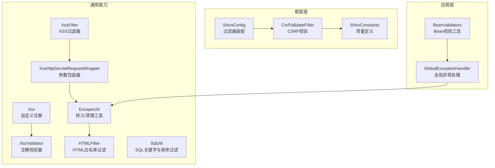
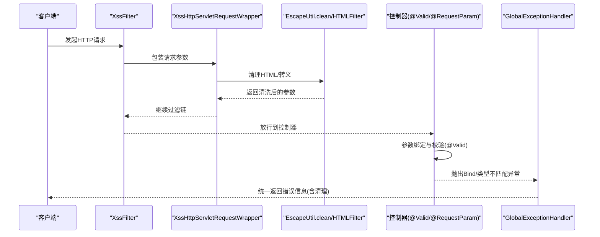
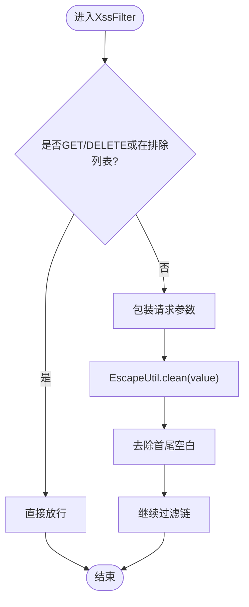
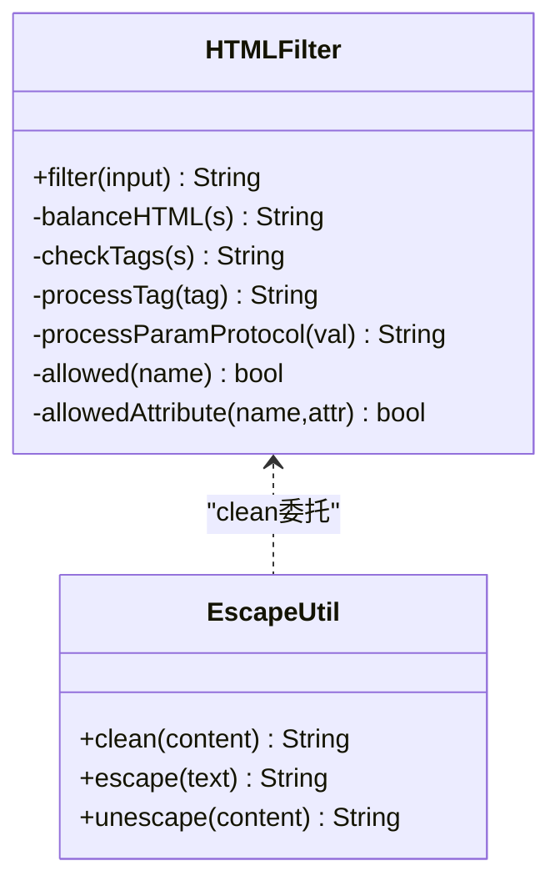
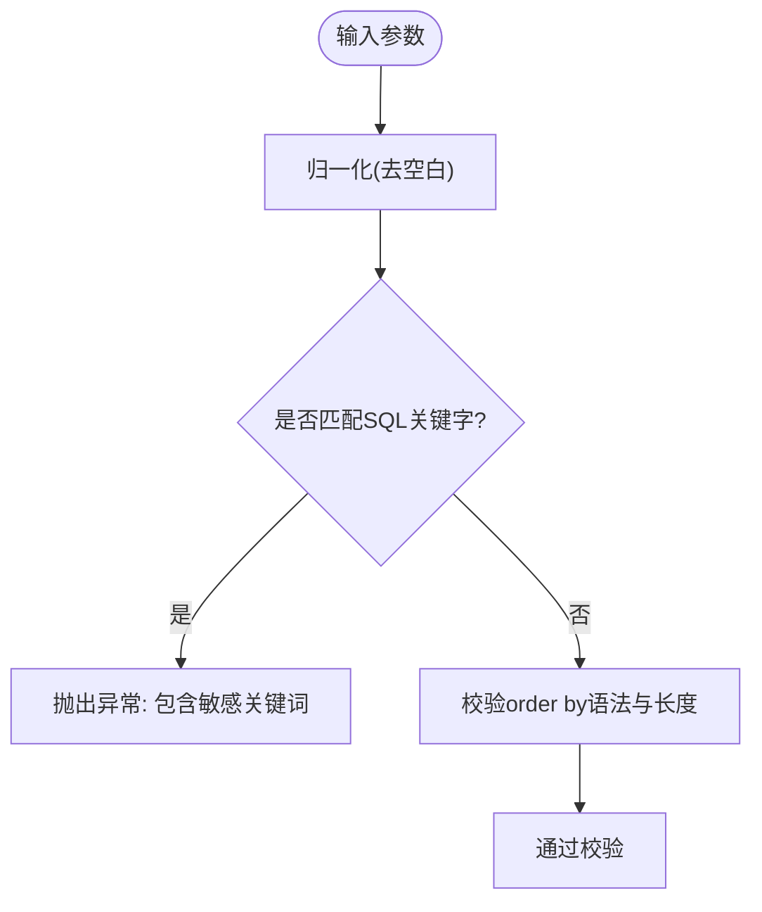
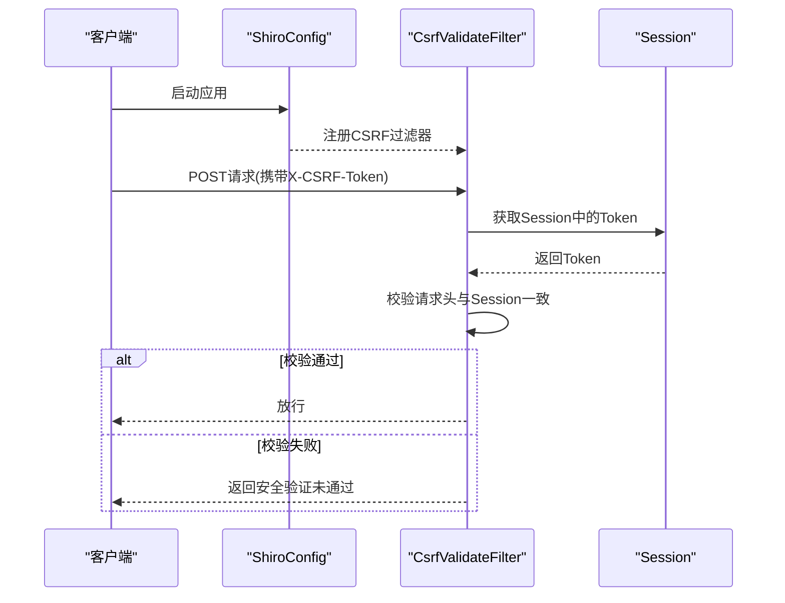
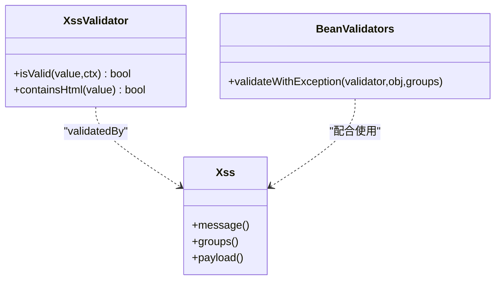
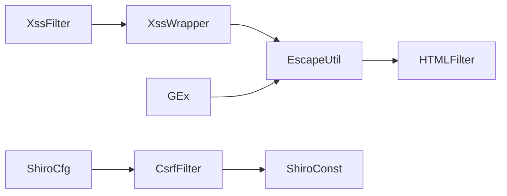

# 输入过滤与防护

<cite>
**本文引用的文件**   
- [XssFilter.java](file://ruoyi-common/src/main/java/com/ruoyi/common/xss/XssFilter.java)
- [XssHttpServletRequestWrapper.java](file://ruoyi-common/src/main/java/com/ruoyi/common/xss/XssHttpServletRequestWrapper.java)
- [Xss.java](file://ruoyi-common/src/main/java/com/ruoyi/common/xss/Xss.java)
- [XssValidator.java](file://ruoyi-common/src/main/java/com/ruoyi/common/xss/XssValidator.java)
- [HTMLFilter.java](file://ruoyi-common/src/main/java/com/ruoyi/common/utils/html/HTMLFilter.java)
- [EscapeUtil.java](file://ruoyi-common/src/main/java/com/ruoyi/common/utils/html/EscapeUtil.java)
- [SqlUtil.java](file://ruoyi-common/src/main/java/com/ruoyi/common/utils/sql/SqlUtil.java)
- [CsrfValidateFilter.java](file://ruoyi-framework/src/main/java/com/ruoyi/framework/shiro/web/filter/csrf/CsrfValidateFilter.java)
- [ShiroConfig.java](file://ruoyi-framework/src/main/java/com/ruoyi/framework/config/ShiroConfig.java)
- [ShiroConstants.java](file://ruoyi-common/src/main/java/com/ruoyi/common/constant/ShiroConstants.java)
- [GlobalExceptionHandler.java](file://ruoyi-framework/src/main/java/com/ruoyi/framework/web/exception/GlobalExceptionHandler.java)
- [BeanValidators.java](file://ruoyi-common/src/main/java/com/ruoyi/common/utils/bean/BeanValidators.java)
</cite>

## 目录
1. [简介](#简介)
2. [项目结构](#项目结构)
3. [核心组件](#核心组件)
4. [架构总览](#架构总览)
5. [详细组件分析](#详细组件分析)
6. [依赖分析](#依赖分析)
7. [性能考虑](#性能考虑)
8. [故障排查指南](#故障排查指南)
9. [结论](#结论)
10. [附录](#附录)

## 简介
本文件面向RuoYi系统的输入过滤与防护机制，围绕以下目标展开：
- XSS（跨站脚本攻击）防护：XssFilter过滤器工作机制、HTML标签白名单策略、JavaScript代码过滤规则
- SQL注入防护：参数绑定、预编译语句的使用、危险字符过滤
- CSRF（跨站请求伪造）防护：Token生成、验证与跨域请求处理
- 输入验证最佳实践：@RequestParam注解的使用、@Valid注解的数据校验与自定义验证器
- 提供具体防护配置示例、常见攻击场景应对策略与安全编码规范

## 项目结构
RuoYi系统在“通用能力”模块提供输入过滤与防护的基础能力，在“框架层”通过Shiro集成CSRF等安全过滤器，并在“全局异常处理器”中统一处理参数类型不匹配等输入异常。

图表来源
- [XssFilter.java:1-74](file://ruoyi-common/src/main/java/com/ruoyi/common/xss/XssFilter.java#L1-L74)
- [XssHttpServletRequestWrapper.java:1-39](file://ruoyi-common/src/main/java/com/ruoyi/common/xss/XssHttpServletRequestWrapper.java#L1-L39)
- [HTMLFilter.java:1-570](file://ruoyi-common/src/main/java/com/ruoyi/common/utils/html/HTMLFilter.java#L1-L570)
- [EscapeUtil.java:1-168](file://ruoyi-common/src/main/java/com/ruoyi/common/utils/html/EscapeUtil.java#L1-L168)
- [Xss.java:1-28](file://ruoyi-common/src/main/java/com/ruoyi/common/xss/Xss.java#L1-L28)
- [XssValidator.java:1-39](file://ruoyi-common/src/main/java/com/ruoyi/common/xss/XssValidator.java#L1-L39)
- [CsrfValidateFilter.java:1-77](file://ruoyi-framework/src/main/java/com/ruoyi/framework/shiro/web/filter/csrf/CsrfValidateFilter.java#L1-L77)
- [ShiroConfig.java:1-449](file://ruoyi-framework/src/main/java/com/ruoyi/framework/config/ShiroConfig.java#L1-L449)
- [ShiroConstants.java:1-85](file://ruoyi-common/src/main/java/com/ruoyi/common/constant/ShiroConstants.java#L1-L85)
- [GlobalExceptionHandler.java:107-149](file://ruoyi-framework/src/main/java/com/ruoyi/framework/web/exception/GlobalExceptionHandler.java#L107-L149)
- [BeanValidators.java:1-24](file://ruoyi-common/src/main/java/com/ruoyi/common/utils/bean/BeanValidators.java#L1-L24)

章节来源
- [XssFilter.java:1-74](file://ruoyi-common/src/main/java/com/ruoyi/common/xss/XssFilter.java#L1-L74)
- [ShiroConfig.java:296-346](file://ruoyi-framework/src/main/java/com/ruoyi/framework/config/ShiroConfig.java#L296-L346)

## 核心组件
- XSS过滤链路：XssFilter → XssHttpServletRequestWrapper → EscapeUtil.clean/HTMLFilter
- SQL注入防护：SqlUtil对排序字段与关键字进行严格校验
- CSRF防护：CsrfValidateFilter基于Shiro过滤器链，校验请求头中的CSRF Token
- 输入验证：@Xss注解 + XssValidator，以及@Valid配合BeanValidators统一异常处理

章节来源
- [XssFilter.java:21-74](file://ruoyi-common/src/main/java/com/ruoyi/common/xss/XssFilter.java#L21-L74)
- [XssHttpServletRequestWrapper.java:12-39](file://ruoyi-common/src/main/java/com/ruoyi/common/xss/XssHttpServletRequestWrapper.java#L12-L39)
- [EscapeUtil.java:37-62](file://ruoyi-common/src/main/java/com/ruoyi/common/utils/html/EscapeUtil.java#L37-L62)
- [HTMLFilter.java:18-135](file://ruoyi-common/src/main/java/com/ruoyi/common/utils/html/HTMLFilter.java#L18-L135)
- [SqlUtil.java:11-72](file://ruoyi-common/src/main/java/com/ruoyi/common/utils/sql/SqlUtil.java#L11-L72)
- [CsrfValidateFilter.java:20-77](file://ruoyi-framework/src/main/java/com/ruoyi/framework/shiro/web/filter/csrf/CsrfValidateFilter.java#L20-L77)
- [ShiroConfig.java:285-291](file://ruoyi-framework/src/main/java/com/ruoyi/framework/config/ShiroConfig.java#L285-L291)
- [Xss.java:15-27](file://ruoyi-common/src/main/java/com/ruoyi/common/xss/Xss.java#L15-L27)
- [XssValidator.java:14-39](file://ruoyi-common/src/main/java/com/ruoyi/common/xss/XssValidator.java#L14-L39)
- [GlobalExceptionHandler.java:116-128](file://ruoyi-framework/src/main/java/com/ruoyi/framework/web/exception/GlobalExceptionHandler.java#L116-L128)
- [BeanValidators.java:13-24](file://ruoyi-common/src/main/java/com/ruoyi/common/utils/bean/BeanValidators.java#L13-L24)

## 架构总览
XSS与SQL注入主要在请求进入业务层之前进行过滤与校验；CSRF通过Shiro过滤器链在请求到达控制器前完成Token校验。全局异常处理器统一捕获参数类型不匹配等输入异常并进行安全清理。

图表来源
- [XssFilter.java:42-55](file://ruoyi-common/src/main/java/com/ruoyi/common/xss/XssFilter.java#L42-L55)
- [XssHttpServletRequestWrapper.java:22-38](file://ruoyi-common/src/main/java/com/ruoyi/common/xss/XssHttpServletRequestWrapper.java#L22-L38)
- [EscapeUtil.java:59-61](file://ruoyi-common/src/main/java/com/ruoyi/common/utils/html/EscapeUtil.java#L59-L61)
- [GlobalExceptionHandler.java:116-128](file://ruoyi-framework/src/main/java/com/ruoyi/framework/web/exception/GlobalExceptionHandler.java#L116-L128)

## 详细组件分析

### XSS防护机制
- 过滤器初始化与排除规则
  - 从初始化参数读取排除URL列表，支持GET/DELETE方法直接放行
  - 非排除且非GET/DELETE的请求进入XSS清洗流程
- 参数清洗
  - 包装HttpServletRequest，覆盖getParameterValues，逐个调用EscapeUtil.clean并trim
  - clean内部委托HTMLFilter执行白名单过滤
- 注解与校验
  - @Xss注解用于字段/参数级校验，结合XssValidator判断是否包含HTML标签
  - 校验逻辑基于正则提取HTML片段，若存在则拒绝

图表来源
- [XssFilter.java:29-67](file://ruoyi-common/src/main/java/com/ruoyi/common/xss/XssFilter.java#L29-L67)
- [XssHttpServletRequestWrapper.java:22-38](file://ruoyi-common/src/main/java/com/ruoyi/common/xss/XssHttpServletRequestWrapper.java#L22-L38)
- [EscapeUtil.java:59-61](file://ruoyi-common/src/main/java/com/ruoyi/common/utils/html/EscapeUtil.java#L59-L61)

章节来源
- [XssFilter.java:21-74](file://ruoyi-common/src/main/java/com/ruoyi/common/xss/XssFilter.java#L21-L74)
- [XssHttpServletRequestWrapper.java:12-39](file://ruoyi-common/src/main/java/com/ruoyi/common/xss/XssHttpServletRequestWrapper.java#L12-L39)
- [Xss.java:15-27](file://ruoyi-common/src/main/java/com/ruoyi/common/xss/Xss.java#L15-L27)
- [XssValidator.java:14-39](file://ruoyi-common/src/main/java/com/ruoyi/common/xss/XssValidator.java#L14-L39)
- [HTMLFilter.java:18-135](file://ruoyi-common/src/main/java/com/ruoyi/common/utils/html/HTMLFilter.java#L18-L135)
- [EscapeUtil.java:37-62](file://ruoyi-common/src/main/java/com/ruoyi/common/utils/html/EscapeUtil.java#L37-L62)

### HTML标签白名单与JavaScript过滤
- 白名单策略
  - 预置允许元素与属性集合，如链接、图片及其常用属性
  - 自闭合标签与必须成对出现的标签分别处理
  - 对协议属性进行白名单校验，禁止危险协议
- JavaScript过滤
  - 通过HTMLFilter的标签解析与属性过滤，移除潜在危险标签与属性
  - 对注释、实体编码等进行规范化处理，避免绕过

图表来源
- [HTMLFilter.java:18-570](file://ruoyi-common/src/main/java/com/ruoyi/common/utils/html/HTMLFilter.java#L18-L570)
- [EscapeUtil.java:37-62](file://ruoyi-common/src/main/java/com/ruoyi/common/utils/html/EscapeUtil.java#L37-L62)

章节来源
- [HTMLFilter.java:103-135](file://ruoyi-common/src/main/java/com/ruoyi/common/utils/html/HTMLFilter.java#L103-L135)
- [HTMLFilter.java:326-435](file://ruoyi-common/src/main/java/com/ruoyi/common/utils/html/HTMLFilter.java#L326-L435)
- [EscapeUtil.java:59-61](file://ruoyi-common/src/main/java/com/ruoyi/common/utils/html/EscapeUtil.java#L59-L61)

### SQL注入防护
- 关键字过滤
  - 对输入进行归一化处理，剔除空白字符
  - 使用“|”分隔的正则表达式匹配常见SQL关键字与危险函数
  - 一旦命中，抛出异常阻止执行
- 排序字段校验
  - 限定orderBy子句的字符集与最大长度，避免注入与性能问题
  - 非法输入直接拒绝

图表来源
- [SqlUtil.java:55-70](file://ruoyi-common/src/main/java/com/ruoyi/common/utils/sql/SqlUtil.java#L55-L70)
- [SqlUtil.java:31-50](file://ruoyi-common/src/main/java/com/ruoyi/common/utils/sql/SqlUtil.java#L31-L50)

章节来源
- [SqlUtil.java:11-72](file://ruoyi-common/src/main/java/com/ruoyi/common/utils/sql/SqlUtil.java#L11-L72)

### CSRF防护机制
- Token生成与存储
  - 通过Shiro配置启用CSRF过滤器，Token存储于Session中
- 请求校验
  - 仅对POST请求进行校验；从请求头读取X-CSRF-Token并与Session中的Token比对
  - 放行白名单URL；校验失败返回统一JSON提示
- 跨域处理
  - 该实现基于请求头校验，跨域场景需确保前端正确携带X-CSRF-Token头

图表来源
- [ShiroConfig.java:285-291](file://ruoyi-framework/src/main/java/com/ruoyi/framework/config/ShiroConfig.java#L285-L291)
- [CsrfValidateFilter.java:28-52](file://ruoyi-framework/src/main/java/com/ruoyi/framework/shiro/web/filter/csrf/CsrfValidateFilter.java#L28-L52)
- [ShiroConstants.java:38-43](file://ruoyi-common/src/main/java/com/ruoyi/common/constant/ShiroConstants.java#L38-L43)

章节来源
- [CsrfValidateFilter.java:20-77](file://ruoyi-framework/src/main/java/com/ruoyi/framework/shiro/web/filter/csrf/CsrfValidateFilter.java#L20-L77)
- [ShiroConfig.java:296-346](file://ruoyi-framework/src/main/java/com/ruoyi/framework/config/ShiroConfig.java#L296-L346)
- [ShiroConstants.java:8-85](file://ruoyi-common/src/main/java/com/ruoyi/common/constant/ShiroConstants.java#L8-L85)

### 输入验证最佳实践
- @RequestParam与@Valid
  - 控制器方法参数可使用@RequestParam接收请求参数
  - 使用@Valid触发JSR-303校验，结合自定义注解（如@Xss）实现更细粒度的输入约束
- 自定义验证器
  - XssValidator基于正则识别HTML标签，作为@Xss注解的校验实现
- Bean校验工具
  - BeanValidators.validateWithException在需要时抛出约束异常，便于统一处理
- 全局异常处理
  - 对参数类型不匹配异常进行捕获，必要时对异常值进行HTML清理再返回

图表来源
- [Xss.java:15-27](file://ruoyi-common/src/main/java/com/ruoyi/common/xss/Xss.java#L15-L27)
- [XssValidator.java:14-39](file://ruoyi-common/src/main/java/com/ruoyi/common/xss/XssValidator.java#L14-L39)
- [BeanValidators.java:13-24](file://ruoyi-common/src/main/java/com/ruoyi/common/utils/bean/BeanValidators.java#L13-L24)

章节来源
- [Xss.java:15-27](file://ruoyi-common/src/main/java/com/ruoyi/common/xss/Xss.java#L15-L27)
- [XssValidator.java:14-39](file://ruoyi-common/src/main/java/com/ruoyi/common/xss/XssValidator.java#L14-L39)
- [BeanValidators.java:13-24](file://ruoyi-common/src/main/java/com/ruoyi/common/utils/bean/BeanValidators.java#L13-L24)
- [GlobalExceptionHandler.java:116-128](file://ruoyi-framework/src/main/java/com/ruoyi/framework/web/exception/GlobalExceptionHandler.java#L116-L128)

## 依赖分析
- XSS链路依赖关系清晰：XssFilter → XssHttpServletRequestWrapper → EscapeUtil → HTMLFilter
- CSRF依赖Shiro过滤器链装配，依赖ShiroConstants中的Token键名与请求头键名
- 全局异常处理器依赖EscapeUtil进行安全清理

图表来源
- [XssFilter.java:42-54](file://ruoyi-common/src/main/java/com/ruoyi/common/xss/XssFilter.java#L42-L54)
- [XssHttpServletRequestWrapper.java:22-33](file://ruoyi-common/src/main/java/com/ruoyi/common/xss/XssHttpServletRequestWrapper.java#L22-L33)
- [EscapeUtil.java:59-61](file://ruoyi-common/src/main/java/com/ruoyi/common/utils/html/EscapeUtil.java#L59-L61)
- [ShiroConfig.java:331-339](file://ruoyi-framework/src/main/java/com/ruoyi/framework/config/ShiroConfig.java#L331-L339)
- [CsrfValidateFilter.java:43-51](file://ruoyi-framework/src/main/java/com/ruoyi/framework/shiro/web/filter/csrf/CsrfValidateFilter.java#L43-L51)
- [ShiroConstants.java:38-43](file://ruoyi-common/src/main/java/com/ruoyi/common/constant/ShiroConstants.java#L38-L43)
- [GlobalExceptionHandler.java:124](file://ruoyi-framework/src/main/java/com/ruoyi/framework/web/exception/GlobalExceptionHandler.java#L124)

章节来源
- [ShiroConfig.java:296-346](file://ruoyi-framework/src/main/java/com/ruoyi/framework/config/ShiroConfig.java#L296-L346)

## 性能考虑
- XSS清洗
  - HTMLFilter采用正则与状态计数，建议对高频请求关注标签数量与嵌套深度
  - 参数数组逐一清洗，注意批量参数的内存占用
- SQL校验
  - 归一化与正则匹配成本较低，但需避免在热路径上重复构造正则
- CSRF
  - 仅对POST请求校验，白名单短路放行，开销可控

## 故障排查指南
- XSS相关
  - 若发现富文本丢失或样式异常，检查HTMLFilter白名单配置与allowed属性
  - 参数被过度清洗导致显示异常，可在业务侧对可信输出进行反向转义
- SQL相关
  - 出现“参数不符合规范，不能进行查询”或“参数已超过最大限制”，检查传入的排序字段是否合规
- CSRF相关
  - 校验失败返回安全验证未通过，确认前端是否正确携带X-CSRF-Token头
  - 白名单URL未生效，检查ShiroConfig中的csrfWhites配置与路径匹配
- 输入验证
  - 参数类型不匹配时，全局异常处理器会对异常值进行清理后再返回，便于定位问题

章节来源
- [GlobalExceptionHandler.java:116-128](file://ruoyi-framework/src/main/java/com/ruoyi/framework/web/exception/GlobalExceptionHandler.java#L116-L128)
- [ShiroConfig.java:285-291](file://ruoyi-framework/src/main/java/com/ruoyi/framework/config/ShiroConfig.java#L285-L291)
- [CsrfValidateFilter.java:43-52](file://ruoyi-framework/src/main/java/com/ruoyi/framework/shiro/web/filter/csrf/CsrfValidateFilter.java#L43-L52)

## 结论
RuoYi系统在输入过滤与防护方面形成了“过滤器链 + 注解校验 + 全局异常处理”的闭环：
- XSS通过白名单与参数清洗双重保障
- SQL注入通过关键字与排序校验降低风险
- CSRF通过Shiro过滤器链实现请求级保护
- 输入验证结合@Valid与自定义注解，配合全局异常处理，提升整体安全性与可维护性

## 附录
- 配置要点
  - XSS排除URL：在XssFilter初始化参数中配置，支持多路径
  - CSRF开关与白名单：通过ShiroConfig的csrf.enabled与csrf.whites配置
  - SQL关键字与排序长度：SqlUtil内置规则，可根据业务调整
- 最佳实践
  - 优先使用预编译语句与参数绑定，避免动态拼接SQL
  - 对富文本输入采用白名单策略，谨慎保留样式与链接
  - CSRF仅对修改类请求启用，GET/DELETE等只读请求可放行
  - 在控制器中结合@Valid与自定义注解，实现参数级安全约束