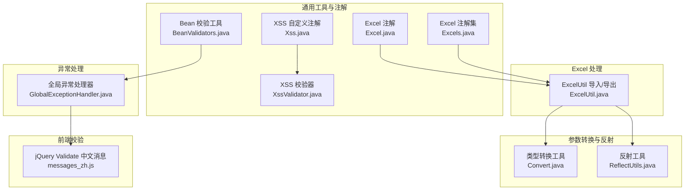
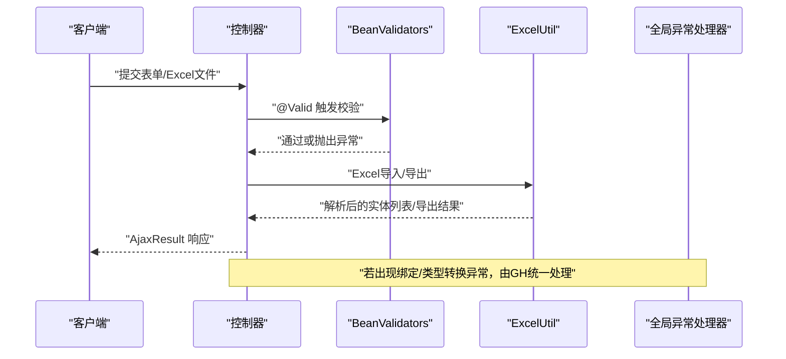
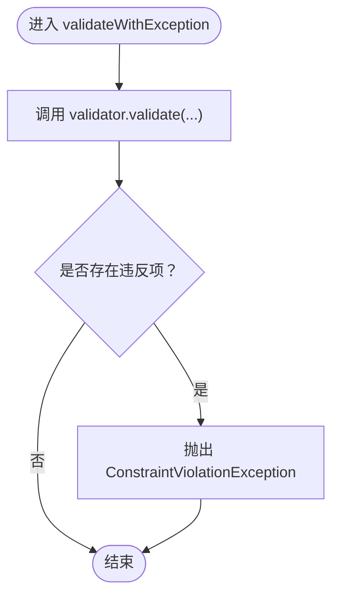
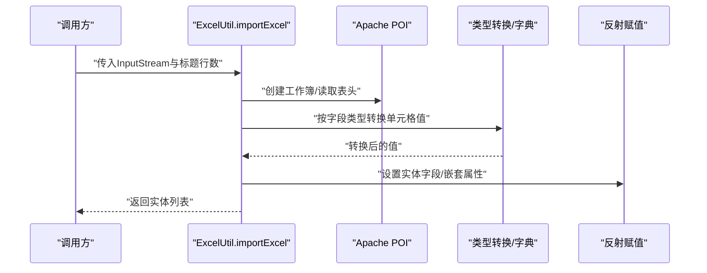
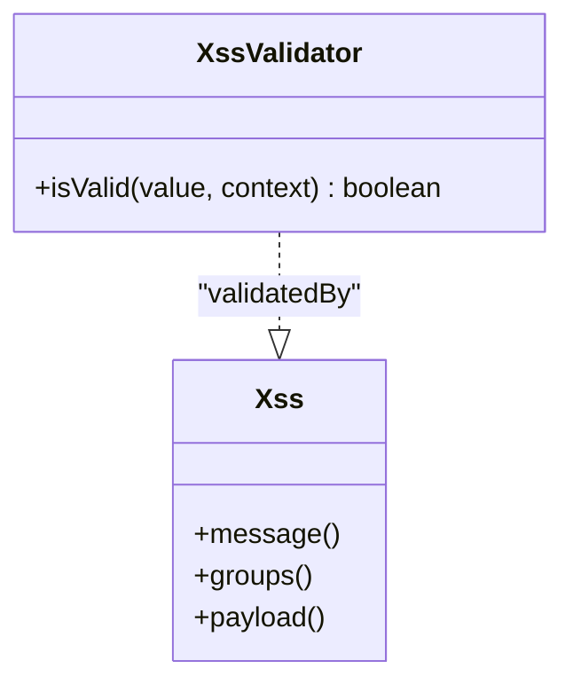
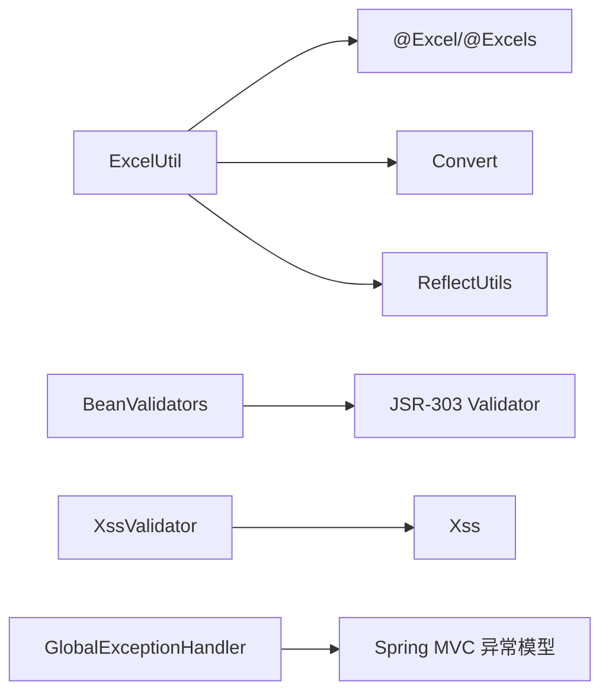

# 输入验证与数据校验

<cite>
**本文引用的文件**   
- [BeanValidators.java](file://ruoyi-common/src/main/java/com/ruoyi/common/utils/bean/BeanValidators.java)
- [Excel.java](file://ruoyi-common/src/main/java/com/ruoyi/common/annotation/Excel.java)
- [Excels.java](file://ruoyi-common/src/main/java/com/ruoyi/common/annotation/Excels.java)
- [ExcelUtil.java](file://ruoyi-common/src/main/java/com/ruoyi/common/utils/poi/ExcelUtil.java)
- [Xss.java](file://ruoyi-common/src/main/java/com/ruoyi/common/xss/Xss.java)
- [XssValidator.java](file://ruoyi-common/src/main/java/com/ruoyi/common/xss/XssValidator.java)
- [GlobalExceptionHandler.java](file://ruoyi-framework/src/main/java/com/ruoyi/framework/web/exception/GlobalExceptionHandler.java)
- [Convert.java](file://ruoyi-common/src/main/java/com/ruoyi/common/core/text/Convert.java)
- [ReflectUtils.java](file://ruoyi-common/src/main/java/com/ruoyi/common/utils/reflect/ReflectUtils.java)
- [messages_zh.js](file://ruoyi-admin/src/main/resources/static/ajax/libs/validate/messages_zh.js)
</cite>

## 目录
1. [简介](#简介)
2. [项目结构](#项目结构)
3. [核心组件](#核心组件)
4. [架构总览](#架构总览)
5. [详细组件分析](#详细组件分析)
6. [依赖分析](#依赖分析)
7. [性能考虑](#性能考虑)
8. [故障排查指南](#故障排查指南)
9. [结论](#结论)
10. [附录](#附录)

## 简介
本技术文档聚焦于RuoYi系统的输入验证与数据校验机制，覆盖以下主题：
- BeanValidators工具类的Bean验证能力：基于JSR-303的校验触发与异常抛出策略
- Excel注解驱动的批量数据验证：通过@Excel/@Excels在导入导出流程中进行格式与业务规则校验
- @Valid在Controller层的使用与嵌套对象校验
- @RequestParam的参数类型转换与默认值处理
- 错误信息国际化与验证异常统一处理
- 常见数据验证场景的实现思路与性能优化建议

## 项目结构
围绕验证与校验的关键模块分布如下：
- 验证注解与工具：ruoyi-common/annotation 与 ruoyi-common/utils/bean
- Excel导入导出与校验：ruoyi-common/utils/poi
- 参数类型转换与反射工具：ruoyi-common/core/text 与 ruoyi-common/utils/reflect
- 全局异常处理：ruoyi-framework/web/exception
- 前端校验与本地化：ruoyi-admin/static/ajax/libs/validate

图表来源
- [Excel.java:17-197](file://ruoyi-common/src/main/java/com/ruoyi/common/annotation/Excel.java#L17-L197)
- [Excels.java:13-18](file://ruoyi-common/src/main/java/com/ruoyi/common/annotation/Excels.java#L13-L18)
- [BeanValidators.java:13-24](file://ruoyi-common/src/main/java/com/ruoyi/common/utils/bean/BeanValidators.java#L13-L24)
- [Xss.java:15-27](file://ruoyi-common/src/main/java/com/ruoyi/common/xss/Xss.java#L15-L27)
- [XssValidator.java:14-39](file://ruoyi-common/src/main/java/com/ruoyi/common/xss/XssValidator.java#L14-L39)
- [ExcelUtil.java:94-212](file://ruoyi-common/src/main/java/com/ruoyi/common/utils/poi/ExcelUtil.java#L94-L212)
- [Convert.java](file://ruoyi-common/src/main/java/com/ruoyi/common/core/text/Convert.java)
- [ReflectUtils.java:170-204](file://ruoyi-common/src/main/java/com/ruoyi/common/utils/reflect/ReflectUtils.java#L170-L204)
- [GlobalExceptionHandler.java:28-149](file://ruoyi-framework/src/main/java/com/ruoyi/framework/web/exception/GlobalExceptionHandler.java#L28-L149)
- [messages_zh.js:1-25](file://ruoyi-admin/src/main/resources/static/ajax/libs/validate/messages_zh.js#L1-L25)

章节来源
- [Excel.java:17-197](file://ruoyi-common/src/main/java/com/ruoyi/common/annotation/Excel.java#L17-L197)
- [ExcelUtil.java:94-212](file://ruoyi-common/src/main/java/com/ruoyi/common/utils/poi/ExcelUtil.java#L94-L212)
- [BeanValidators.java:13-24](file://ruoyi-common/src/main/java/com/ruoyi/common/utils/bean/BeanValidators.java#L13-L24)
- [GlobalExceptionHandler.java:28-149](file://ruoyi-framework/src/main/java/com/ruoyi/framework/web/exception/GlobalExceptionHandler.java#L28-L149)

## 核心组件
- BeanValidators：封装JSR-303校验入口，将未通过的校验转换为异常抛出，便于统一处理
- Excel注解体系：@Excel/@Excels声明式控制导出/导入字段的名称、类型、字典映射、公式防护等
- ExcelUtil：基于注解解析与Apache POI实现的Excel导入/导出，内置类型转换、字典反查、图片读取等逻辑
- Xss注解与校验器：自定义JSR-303注解与校验器，过滤HTML标签，防范XSS
- 全局异常处理器：捕获绑定与类型转换异常，统一返回AjaxResult
- 类型转换与反射工具：Convert与ReflectUtils负责参数与实体字段的类型安全转换与赋值

章节来源
- [BeanValidators.java:13-24](file://ruoyi-common/src/main/java/com/ruoyi/common/utils/bean/BeanValidators.java#L13-L24)
- [Excel.java:17-197](file://ruoyi-common/src/main/java/com/ruoyi/common/annotation/Excel.java#L17-L197)
- [ExcelUtil.java:94-212](file://ruoyi-common/src/main/java/com/ruoyi/common/utils/poi/ExcelUtil.java#L94-L212)
- [Xss.java:15-27](file://ruoyi-common/src/main/java/com/ruoyi/common/xss/Xss.java#L15-L27)
- [XssValidator.java:14-39](file://ruoyi-common/src/main/java/com/ruoyi/common/xss/XssValidator.java#L14-L39)
- [GlobalExceptionHandler.java:28-149](file://ruoyi-framework/src/main/java/com/ruoyi/framework/web/exception/GlobalExceptionHandler.java#L28-L149)
- [Convert.java](file://ruoyi-common/src/main/java/com/ruoyi/common/core/text/Convert.java)
- [ReflectUtils.java:170-204](file://ruoyi-common/src/main/java/com/ruoyi/common/utils/reflect/ReflectUtils.java#L170-L204)

## 架构总览
RuoYi的验证与校验采用“注解声明 + 工具解析 + 异常统一处理”的分层架构：
- 控制器层：接收请求参数，触发@Valid与JSR-303校验
- 业务/工具层：BeanValidators执行校验；ExcelUtil按注解解析Excel并进行类型转换与字典映射
- 异常层：GlobalExceptionHandler捕获并格式化错误响应

图表来源
- [BeanValidators.java:15-23](file://ruoyi-common/src/main/java/com/ruoyi/common/utils/bean/BeanValidators.java#L15-L23)
- [ExcelUtil.java:318-530](file://ruoyi-common/src/main/java/com/ruoyi/common/utils/poi/ExcelUtil.java#L318-L530)
- [GlobalExceptionHandler.java:115-139](file://ruoyi-framework/src/main/java/com/ruoyi/framework/web/exception/GlobalExceptionHandler.java#L115-L139)

## 详细组件分析

### BeanValidators 工具类
- 功能要点
  - 接收Spring Validator实例与待校验对象，按分组执行校验
  - 若存在违反项，直接抛出ConstraintViolationException，便于上层统一拦截
- 使用建议
  - 在服务层或控制器层调用，结合@Valid/@Validated标注参数或对象
  - 可配合分组接口对不同场景（新增/编辑）施加差异化约束

图表来源
- [BeanValidators.java:15-23](file://ruoyi-common/src/main/java/com/ruoyi/common/utils/bean/BeanValidators.java#L15-L23)

章节来源
- [BeanValidators.java:13-24](file://ruoyi-common/src/main/java/com/ruoyi/common/utils/bean/BeanValidators.java#L13-L24)

### Excel 注解与 ExcelUtil 批量校验
- 注解能力
  - 字段别名、排序、宽度/高度、对齐、颜色、提示、组合框、字典映射、精度与舍入、默认值、日期格式、读取转换表达式、目标属性链、是否导出、是否统计、是否合并、单元格类型、处理器与参数、导入/导出类型限定等
- 导入流程要点
  - 解析表头与字段映射，逐行读取单元格值
  - 按字段类型执行类型转换（字符串、整型、长整型、浮点、BigDecimal、日期、布尔）
  - 支持日期格式化、字典反查、读取转换表达式、自定义处理器、图片读取
  - 通过反射设置嵌套属性（targetAttr支持多级）
- 导出流程要点
  - 根据注解生成标题、子表头、样式与合并区域
  - 写入数据并支持多Sheet导出

图表来源
- [ExcelUtil.java:357-530](file://ruoyi-common/src/main/java/com/ruoyi/common/utils/poi/ExcelUtil.java#L357-L530)
- [Excel.java:17-197](file://ruoyi-common/src/main/java/com/ruoyi/common/annotation/Excel.java#L17-L197)

章节来源
- [Excel.java:17-197](file://ruoyi-common/src/main/java/com/ruoyi/common/annotation/Excel.java#L17-L197)
- [Excels.java:13-18](file://ruoyi-common/src/main/java/com/ruoyi/common/annotation/Excels.java#L13-L18)
- [ExcelUtil.java:318-530](file://ruoyi-common/src/main/java/com/ruoyi/common/utils/poi/ExcelUtil.java#L318-L530)
- [Convert.java](file://ruoyi-common/src/main/java/com/ruoyi/common/core/text/Convert.java)
- [ReflectUtils.java:170-204](file://ruoyi-common/src/main/java/com/ruoyi/common/utils/reflect/ReflectUtils.java#L170-L204)

### XSS 自定义注解与校验器
- 注解Xss：声明式标注在字段/参数上，定义默认提示与分组
- 校验器XssValidator：基于正则检测HTML标签，空值放行，非空时禁止HTML
- 应用场景：防止富文本注入与脚本攻击

图表来源
- [Xss.java:15-27](file://ruoyi-common/src/main/java/com/ruoyi/common/xss/Xss.java#L15-L27)
- [XssValidator.java:14-39](file://ruoyi-common/src/main/java/com/ruoyi/common/xss/XssValidator.java#L14-L39)

章节来源
- [Xss.java:15-27](file://ruoyi-common/src/main/java/com/ruoyi/common/xss/Xss.java#L15-L27)
- [XssValidator.java:14-39](file://ruoyi-common/src/main/java/com/ruoyi/common/xss/XssValidator.java#L14-L39)

### Controller 层 @Valid 与嵌套对象校验
- 使用方式
  - 在控制器方法参数上使用@Valid或@Validated，触发JSR-303校验
  - 对嵌套对象（如DTO内含List/子对象）同样生效，前提是子对象字段也标注了相应约束
- 与BeanValidators协作
  - 可在服务层显式调用BeanValidators.validateWithException，集中抛出约束异常
- 与Excel导入联动
  - ExcelUtil在导入时已对字段类型与字典映射进行转换与校验，结合@Valid可进一步保证业务规则

章节来源
- [BeanValidators.java:15-23](file://ruoyi-common/src/main/java/com/ruoyi/common/utils/bean/BeanValidators.java#L15-L23)
- [ExcelUtil.java:420-526](file://ruoyi-common/src/main/java/com/ruoyi/common/utils/poi/ExcelUtil.java#L420-L526)

### @RequestParam 参数类型转换与默认值处理
- 类型转换
  - 通过Convert与ReflectUtils对字符串/基础类型进行安全转换，避免类型不匹配异常
  - 对日期、数字、布尔等类型提供容错处理
- 默认值
  - Excel注解的defaultValue可用于缺失值回退
  - 控制器层可通过@RequestParam(defaultValue=...)设置默认值
- 异常处理
  - MethodArgumentTypeMismatchException由全局异常处理器统一拦截并返回AjaxResult

章节来源
- [Convert.java](file://ruoyi-common/src/main/java/com/ruoyi/common/core/text/Convert.java)
- [ReflectUtils.java:170-204](file://ruoyi-common/src/main/java/com/ruoyi/common/utils/reflect/ReflectUtils.java#L170-L204)
- [Excel.java:77-79](file://ruoyi-common/src/main/java/com/ruoyi/common/annotation/Excel.java#L77-L79)
- [GlobalExceptionHandler.java:115-128](file://ruoyi-framework/src/main/java/com/ruoyi/framework/web/exception/GlobalExceptionHandler.java#L115-L128)

### 错误信息国际化与验证异常处理
- 前端本地化
  - messages_zh.js提供jQuery Validate中文错误提示
- 后端统一处理
  - GlobalExceptionHandler针对BindException与MethodArgumentTypeMismatchException返回AjaxResult，确保前后端一致的错误格式

章节来源
- [messages_zh.js:1-25](file://ruoyi-admin/src/main/resources/static/ajax/libs/validate/messages_zh.js#L1-L25)
- [GlobalExceptionHandler.java:115-139](file://ruoyi-framework/src/main/java/com/ruoyi/framework/web/exception/GlobalExceptionHandler.java#L115-L139)

## 依赖分析
- 组件耦合
  - ExcelUtil强依赖Excel注解与Convert/ReflectUtils，用于类型转换与反射赋值
  - BeanValidators独立于具体业务，仅依赖JSR-303 Validator
  - Xss注解与校验器形成自包含的扩展点
  - 全局异常处理器面向Spring MVC异常模型，向上游提供统一响应
- 外部依赖
  - Apache POI用于Excel读写
  - JSR-303/Hibernate Validator用于Bean校验
  - Spring MVC用于参数绑定与异常传播

图表来源
- [ExcelUtil.java:94-212](file://ruoyi-common/src/main/java/com/ruoyi/common/utils/poi/ExcelUtil.java#L94-L212)
- [Excel.java:17-197](file://ruoyi-common/src/main/java/com/ruoyi/common/annotation/Excel.java#L17-L197)
- [BeanValidators.java:15-23](file://ruoyi-common/src/main/java/com/ruoyi/common/utils/bean/BeanValidators.java#L15-L23)
- [Xss.java:15-27](file://ruoyi-common/src/main/java/com/ruoyi/common/xss/Xss.java#L15-L27)
- [XssValidator.java:14-39](file://ruoyi-common/src/main/java/com/ruoyi/common/xss/XssValidator.java#L14-L39)
- [GlobalExceptionHandler.java:28-149](file://ruoyi-framework/src/main/java/com/ruoyi/framework/web/exception/GlobalExceptionHandler.java#L28-L149)

## 性能考虑
- Excel导入
  - 使用SXSSFWorkbook进行多Sheet导出，降低内存占用
  - 合理设置sheetSize与样式缓存，减少重复计算
  - 对字典映射与图片读取进行缓存与延迟处理
- 类型转换
  - Convert与ReflectUtils在大量数据时需注意装箱/拆箱成本，必要时批量处理
- 校验策略
  - 对高频接口启用分组校验，缩小校验范围
  - 将复杂校验逻辑下沉至自定义注解（如Xss），提升可复用性

## 故障排查指南
- 常见问题
  - 参数类型不匹配：检查@RequestParam类型与前端传参，查看MethodArgumentTypeMismatchException的错误信息
  - 绑定失败：确认对象字段命名与前端一致，查看BindException的首个错误消息
  - Excel导入异常：核对表头名称与@Excel.name是否一致，检查日期格式与字典类型
  - XSS校验失败：检查输入是否包含HTML标签，必要时清理或调整策略
- 定位手段
  - 查看全局异常处理器的日志输出与返回码
  - 在BeanValidators处断点，确认是否有ConstraintViolationException抛出
  - 在ExcelUtil导入流程中定位字段映射与类型转换环节

章节来源
- [GlobalExceptionHandler.java:115-139](file://ruoyi-framework/src/main/java/com/ruoyi/framework/web/exception/GlobalExceptionHandler.java#L115-L139)
- [BeanValidators.java:15-23](file://ruoyi-common/src/main/java/com/ruoyi/common/utils/bean/BeanValidators.java#L15-L23)
- [ExcelUtil.java:357-530](file://ruoyi-common/src/main/java/com/ruoyi/common/utils/poi/ExcelUtil.java#L357-L530)
- [XssValidator.java:18-26](file://ruoyi-common/src/main/java/com/ruoyi/common/xss/XssValidator.java#L18-L26)

## 结论
RuoYi通过注解驱动与工具类封装，构建了覆盖Bean校验、Excel批量校验、参数类型转换与异常统一处理的完整验证体系。结合XSS自定义注解与前端本地化消息，既保证了数据质量与安全性，又提升了开发效率与用户体验。建议在实际项目中遵循分组校验、注解优先、异常统一的原则，并结合性能优化策略持续迭代。

## 附录
- 最佳实践清单
  - 字段约束：优先使用标准JSR-303注解，复杂规则使用自定义注解
  - Excel校验：明确表头与字段映射，合理使用字典与读取转换表达式
  - 参数处理：严格区分@RequestParam与@RequestBody，必要时提供默认值
  - 错误处理：统一返回AjaxResult，前端配套本地化消息
  - XSS防护：对敏感输入启用Xss注解，避免富文本注入
  - 性能优化：批量导入使用SXSSFWorkbook，缓存字典与样式，减少反射开销