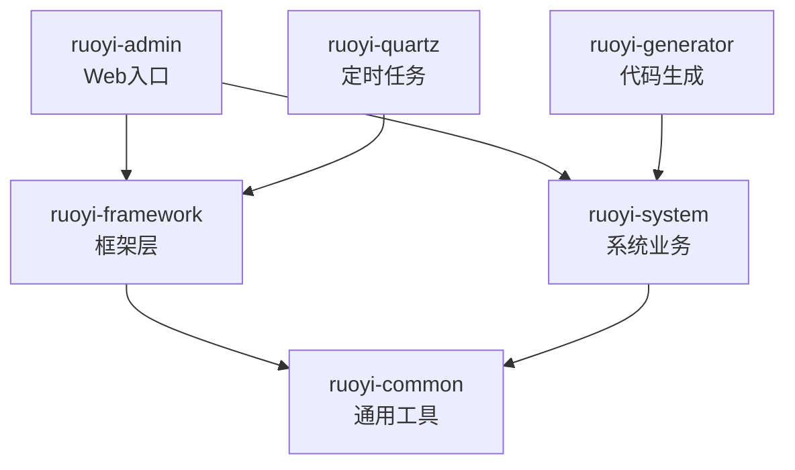
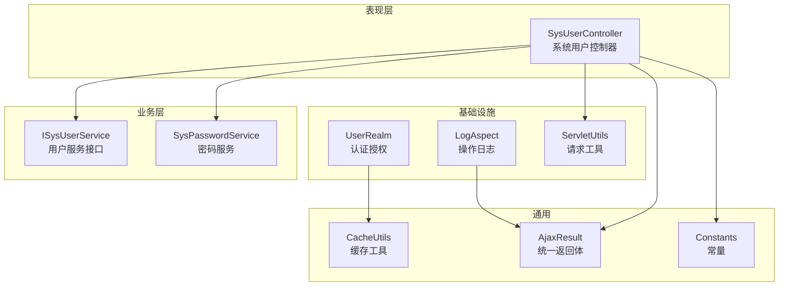
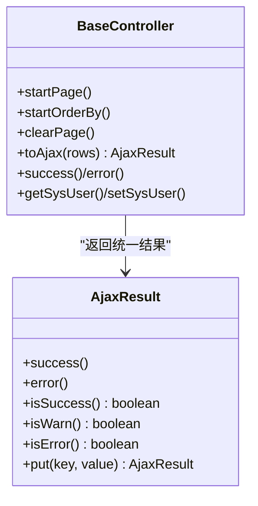
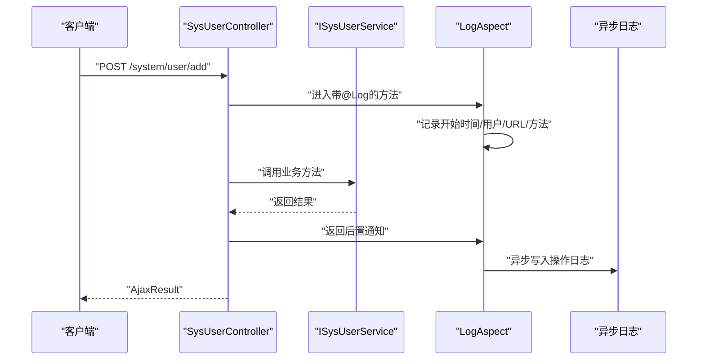
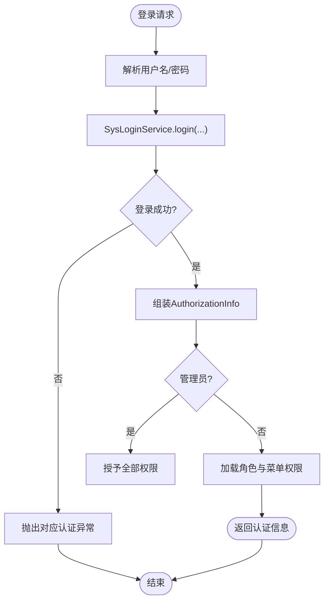
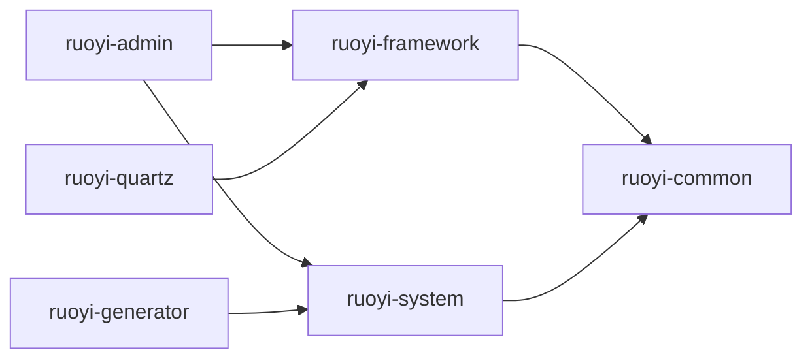

# 代码规范与最佳实践

<cite>
**本文引用的文件**
- [pom.xml](file://pom.xml)
- [README.md](file://README.md)
- [RuoYiApplication.java](file://ruoyi-admin/src/main/java/com/ruoyi/RuoYiApplication.java)
- [BaseController.java](file://ruoyi-common/src/main/java/com/ruoyi/common/core/controller/BaseController.java)
- [AjaxResult.java](file://ruoyi-common/src/main/java/com/ruoyi/common/core/domain/AjaxResult.java)
- [ServletUtils.java](file://ruoyi-common/src/main/java/com/ruoyi/common/utils/ServletUtils.java)
- [LogAspect.java](file://ruoyi-framework/src/main/java/com/ruoyi/framework/aspectj/LogAspect.java)
- [Log.java](file://ruoyi-common/src/main/java/com/ruoyi/common/annotation/Log.java)
- [Constants.java](file://ruoyi-common/src/main/java/com/ruoyi/common/constant/Constants.java)
- [DateUtils.java](file://ruoyi-common/src/main/java/com/ruoyi/common/utils/DateUtils.java)
- [SysUserController.java](file://ruoyi-admin/src/main/java/com/ruoyi/web/controller/system/SysUserController.java)
- [UserRealm.java](file://ruoyi-framework/src/main/java/com/ruoyi/framework/shiro/realm/UserRealm.java)
- [Md5Utils.java](file://ruoyi-common/src/main/java/com/ruoyi/common/utils/security/Md5Utils.java)
- [CacheUtils.java](file://ruoyi-common/src/main/java/com/ruoyi/common/utils/CacheUtils.java)
</cite>

## 目录
1. [引言](#引言)
2. [项目结构](#项目结构)
3. [核心组件](#核心组件)
4. [架构总览](#架构总览)
5. [详细组件分析](#详细组件分析)
6. [依赖分析](#依赖分析)
7. [性能考量](#性能考量)
8. [故障排查指南](#故障排查指南)
9. [结论](#结论)
10. [附录](#附录)

## 引言
本指南面向RuoYi系统的开发与维护团队，旨在建立统一的Java编码规范与最佳实践，覆盖命名约定、注释与格式化、设计模式应用、代码审查清单、异常与日志规范、资源管理等方面。文档以仓库现有实现为依据，结合常见工程实践，帮助提升代码质量、安全性和可维护性。

## 项目结构
RuoYi采用多模块Maven聚合工程组织，核心模块包括：
- ruoyi-admin：Web控制台入口与页面模板
- ruoyi-framework：框架层（安全、拦截、异步、配置等）
- ruoyi-system：系统业务模块（用户、角色、菜单、字典等）
- ruoyi-common：通用工具与常量
- ruoyi-quartz：定时任务
- ruoyi-generator：代码生成

图表来源
- [pom.xml:235-242](file://pom.xml#L235-L242)

章节来源
- [pom.xml:1-290](file://pom.xml#L1-L290)
- [README.md:1-2](file://README.md#L1-L2)

## 核心组件
- 应用入口与启动
  - 启动类位于ruoyi-admin模块，排除数据源自动装配，便于自定义数据源配置。
  - 参考路径：[RuoYiApplication.java:1-29](file://ruoyi-admin/src/main/java/com/ruoyi/RuoYiApplication.java#L1-L29)

- Web控制器基类
  - BaseController封装了分页、请求/响应/会话获取、统一返回体AjaxResult、用户上下文等通用能力。
  - 参考路径：[BaseController.java:1-230](file://ruoyi-common/src/main/java/com/ruoyi/common/core/controller/BaseController.java#L1-L230)

- 统一返回体
  - AjaxResult提供SUCCESS/WARN/ERROR三态返回，并支持链式扩展。
  - 参考路径：[AjaxResult.java:1-228](file://ruoyi-common/src/main/java/com/ruoyi/common/core/domain/AjaxResult.java#L1-L228)

- Servlet工具
  - ServletUtils封装参数解析、Ajax判断、移动端识别、URL编解码、CSRF Token生成等。
  - 参考路径：[ServletUtils.java:1-233](file://ruoyi-common/src/main/java/com/ruoyi/common/utils/ServletUtils.java#L1-L233)

- 日志切面
  - LogAspect通过注解收集请求/响应、耗时、异常、用户信息等，异步落库。
  - 参考路径：[LogAspect.java:1-266](file://ruoyi-framework/src/main/java/com/ruoyi/framework/aspectj/LogAspect.java#L1-L266)，注解定义：[Log.java:1-51](file://ruoyi-common/src/main/java/com/ruoyi/common/annotation/Log.java#L1-L51)

- 常量与工具
  - Constants集中管理字符串常量与缓存键前缀；DateUtils提供日期时间工具；CacheUtils封装Shiro缓存访问。
  - 参考路径：[Constants.java:1-154](file://ruoyi-common/src/main/java/com/ruoyi/common/constant/Constants.java#L1-L154)，[DateUtils.java:1-192](file://ruoyi-common/src/main/java/com/ruoyi/common/utils/DateUtils.java#L1-L192)，[CacheUtils.java:1-198](file://ruoyi-common/src/main/java/com/ruoyi/common/utils/CacheUtils.java#L1-L198)

章节来源
- [RuoYiApplication.java:1-29](file://ruoyi-admin/src/main/java/com/ruoyi/RuoYiApplication.java#L1-L29)
- [BaseController.java:1-230](file://ruoyi-common/src/main/java/com/ruoyi/common/core/controller/BaseController.java#L1-L230)
- [AjaxResult.java:1-228](file://ruoyi-common/src/main/java/com/ruoyi/common/core/domain/AjaxResult.java#L1-L228)
- [ServletUtils.java:1-233](file://ruoyi-common/src/main/java/com/ruoyi/common/utils/ServletUtils.java#L1-L233)
- [LogAspect.java:1-266](file://ruoyi-framework/src/main/java/com/ruoyi/framework/aspectj/LogAspect.java#L1-L266)
- [Log.java:1-51](file://ruoyi-common/src/main/java/com/ruoyi/common/annotation/Log.java#L1-L51)
- [Constants.java:1-154](file://ruoyi-common/src/main/java/com/ruoyi/common/constant/Constants.java#L1-L154)
- [DateUtils.java:1-192](file://ruoyi-common/src/main/java/com/ruoyi/common/utils/DateUtils.java#L1-L192)
- [CacheUtils.java:1-198](file://ruoyi-common/src/main/java/com/ruoyi/common/utils/CacheUtils.java#L1-L198)

## 架构总览
RuoYi遵循经典的MVC分层与职责分离：
- 表现层（Controller）：接收请求、参数校验、调用服务、返回统一结果
- 业务层（Service）：组合领域模型与数据访问，保证事务与一致性
- 数据访问层（Mapper/DAO）：MyBatis映射与SQL执行
- 基础设施（Framework）：安全（Shiro）、日志（AOP）、异步、配置、拦截器等

图表来源
- [SysUserController.java:1-357](file://ruoyi-admin/src/main/java/com/ruoyi/web/controller/system/SysUserController.java#L1-L357)
- [UserRealm.java:1-159](file://ruoyi-framework/src/main/java/com/ruoyi/framework/shiro/realm/UserRealm.java#L1-L159)
- [LogAspect.java:1-266](file://ruoyi-framework/src/main/java/com/ruoyi/framework/aspectj/LogAspect.java#L1-L266)
- [ServletUtils.java:1-233](file://ruoyi-common/src/main/java/com/ruoyi/common/utils/ServletUtils.java#L1-L233)
- [AjaxResult.java:1-228](file://ruoyi-common/src/main/java/com/ruoyi/common/core/domain/AjaxResult.java#L1-L228)
- [Constants.java:1-154](file://ruoyi-common/src/main/java/com/ruoyi/common/constant/Constants.java#L1-L154)
- [CacheUtils.java:1-198](file://ruoyi-common/src/main/java/com/ruoyi/common/utils/CacheUtils.java#L1-L198)

## 详细组件分析

### 组件A：统一返回体与控制器基类
- AjaxResult
  - 设计要点：继承HashMap，提供静态工厂方法与链式扩展；枚举Type区分状态码；isSuccess/isWarn/isError便于分支判断。
  - 使用建议：对外统一返回AjaxResult，避免直接抛异常或返回原始对象。
  - 参考路径：[AjaxResult.java:1-228](file://ruoyi-common/src/main/java/com/ruoyi/common/core/domain/AjaxResult.java#L1-L228)

- BaseController
  - 设计要点：封装分页、排序、会话、统一返回、用户上下文；initBinder自动解析日期；clearPage避免线程变量泄漏。
  - 使用建议：所有Controller继承BaseController，确保分页与返回风格一致。
  - 参考路径：[BaseController.java:1-230](file://ruoyi-common/src/main/java/com/ruoyi/common/core/controller/BaseController.java#L1-L230)

图表来源
- [AjaxResult.java:1-228](file://ruoyi-common/src/main/java/com/ruoyi/common/core/domain/AjaxResult.java#L1-L228)
- [BaseController.java:1-230](file://ruoyi-common/src/main/java/com/ruoyi/common/core/controller/BaseController.java#L1-L230)

章节来源
- [AjaxResult.java:1-228](file://ruoyi-common/src/main/java/com/ruoyi/common/core/domain/AjaxResult.java#L1-L228)
- [BaseController.java:1-230](file://ruoyi-common/src/main/java/com/ruoyi/common/core/controller/BaseController.java#L1-L230)

### 组件B：日志切面与注解
- Log注解
  - 作用：在方法上标注标题、业务类型、操作人类型、是否记录请求/响应、排除参数等。
  - 参考路径：[Log.java:1-51](file://ruoyi-common/src/main/java/com/ruoyi/common/annotation/Log.java#L1-L51)

- LogAspect
  - 作用：前置记录开始时间，后置/异常分别记录响应与异常；异步写入操作日志表；过滤敏感字段；限制参数长度。
  - 参考路径：[LogAspect.java:1-266](file://ruoyi-framework/src/main/java/com/ruoyi/framework/aspectj/LogAspect.java#L1-L266)

图表来源
- [SysUserController.java:1-357](file://ruoyi-admin/src/main/java/com/ruoyi/web/controller/system/SysUserController.java#L1-L357)
- [LogAspect.java:1-266](file://ruoyi-framework/src/main/java/com/ruoyi/framework/aspectj/LogAspect.java#L1-L266)
- [Log.java:1-51](file://ruoyi-common/src/main/java/com/ruoyi/common/annotation/Log.java#L1-L51)

章节来源
- [Log.java:1-51](file://ruoyi-common/src/main/java/com/ruoyi/common/annotation/Log.java#L1-L51)
- [LogAspect.java:1-266](file://ruoyi-framework/src/main/java/com/ruoyi/framework/aspectj/LogAspect.java#L1-L266)

### 组件C：安全与认证授权
- UserRealm
  - 作用：实现Shiro的认证与授权；根据用户角色决定权限集合；异常映射到具体业务异常类型；提供缓存清理能力。
  - 参考路径：[UserRealm.java:1-159](file://ruoyi-framework/src/main/java/com/ruoyi/framework/shiro/realm/UserRealm.java#L1-L159)

图表来源
- [UserRealm.java:1-159](file://ruoyi-framework/src/main/java/com/ruoyi/framework/shiro/realm/UserRealm.java#L1-L159)

章节来源
- [UserRealm.java:1-159](file://ruoyi-framework/src/main/java/com/ruoyi/framework/shiro/realm/UserRealm.java#L1-L159)

### 组件D：加密与缓存
- Md5Utils
  - 作用：提供MD5摘要计算；注意：生产环境建议使用更安全的密码哈希方案（如bcrypt）。
  - 参考路径：[Md5Utils.java:1-68](file://ruoyi-common/src/main/java/com/ruoyi/common/utils/security/Md5Utils.java#L1-L68)

- CacheUtils
  - 作用：通过SpringUtils获取CacheManager，封装常用缓存读写与批量清理。
  - 参考路径：[CacheUtils.java:1-198](file://ruoyi-common/src/main/java/com/ruoyi/common/utils/CacheUtils.java#L1-L198)

章节来源
- [Md5Utils.java:1-68](file://ruoyi-common/src/main/java/com/ruoyi/common/utils/security/Md5Utils.java#L1-L68)
- [CacheUtils.java:1-198](file://ruoyi-common/src/main/java/com/ruoyi/common/utils/CacheUtils.java#L1-L198)

## 依赖分析
- 版本与依赖管理
  - 顶层pom集中管理Spring Boot、Shiro、Druid、Swagger、PageHelper、Tomcat、Logback等版本，模块间通过dependencyManagement统一约束。
  - 参考路径：[pom.xml:14-92](file://pom.xml#L14-L92)

- 模块依赖关系
  - ruoyi-admin依赖framework与common；framework依赖common；system依赖common；quartz与generator独立但复用common。
  - 参考路径：[pom.xml:235-242](file://pom.xml#L235-L242)

图表来源
- [pom.xml:235-242](file://pom.xml#L235-L242)

章节来源
- [pom.xml:1-290](file://pom.xml#L1-L290)

## 性能考量
- 分页与排序
  - BaseController通过PageHelper与TableSupport构建分页与排序，避免一次性加载全量数据。
  - 参考路径：[BaseController.java:57-73](file://ruoyi-common/src/main/java/com/ruoyi/common/core/controller/BaseController.java#L57-L73)

- 日志异步化
  - LogAspect将操作日志写入异步队列，降低同步IO对主流程影响。
  - 参考路径：[LogAspect.java:125-125](file://ruoyi-framework/src/main/java/com/ruoyi/framework/aspectj/LogAspect.java#L125-L125)

- 参数与长度限制
  - LogAspect对请求参数与响应JSON进行长度限制，防止超长参数导致内存压力。
  - 参考路径：[LogAspect.java:51-51](file://ruoyi-framework/src/main/java/com/ruoyi/framework/aspectj/LogAspect.java#L51-L51)，[LogAspect.java:178-179](file://ruoyi-framework/src/main/java/com/ruoyi/framework/aspectj/LogAspect.java#L178-L179)

- 缓存与清理
  - CacheUtils提供按需清理与批量清理，避免缓存膨胀。
  - 参考路径：[CacheUtils.java:125-134](file://ruoyi-common/src/main/java/com/ruoyi/common/utils/CacheUtils.java#L125-L134)

## 故障排查指南
- 统一异常与返回
  - AjaxResult提供SUCCESS/WARN/ERROR三态，便于前端统一处理；BaseController提供toAjax便捷方法。
  - 参考路径：[AjaxResult.java:1-228](file://ruoyi-common/src/main/java/com/ruoyi/common/core/domain/AjaxResult.java#L1-L228)，[BaseController.java:126-140](file://ruoyi-common/src/main/java/com/ruoyi/common/core/controller/BaseController.java#L126-L140)

- 安全相关
  - UserRealm对未知账户、密码不匹配、尝试次数过多、账户锁定等场景进行明确异常映射，便于定位问题。
  - 参考路径：[UserRealm.java:102-130](file://ruoyi-framework/src/main/java/com/ruoyi/framework/shiro/realm/UserRealm.java#L102-L130)

- 日志审计
  - LogAspect记录请求参数、响应结果、异常信息、耗时与用户信息，便于问题回溯。
  - 参考路径：[LogAspect.java:85-137](file://ruoyi-framework/src/main/java/com/ruoyi/framework/aspectj/LogAspect.java#L85-L137)

- Servlet工具
  - isAjaxRequest用于区分Ajax与非Ajax请求；checkAgentIsMobile用于移动端适配；generateToken用于CSRF防护。
  - 参考路径：[ServletUtils.java:137-159](file://ruoyi-common/src/main/java/com/ruoyi/common/utils/ServletUtils.java#L137-L159)，[ServletUtils.java:164-183](file://ruoyi-common/src/main/java/com/ruoyi/common/utils/ServletUtils.java#L164-L183)，[ServletUtils.java:226-231](file://ruoyi-common/src/main/java/com/ruoyi/common/utils/ServletUtils.java#L226-L231)

章节来源
- [AjaxResult.java:1-228](file://ruoyi-common/src/main/java/com/ruoyi/common/core/domain/AjaxResult.java#L1-L228)
- [BaseController.java:126-140](file://ruoyi-common/src/main/java/com/ruoyi/common/core/controller/BaseController.java#L126-L140)
- [UserRealm.java:102-130](file://ruoyi-framework/src/main/java/com/ruoyi/framework/shiro/realm/UserRealm.java#L102-L130)
- [LogAspect.java:85-137](file://ruoyi-framework/src/main/java/com/ruoyi/framework/aspectj/LogAspect.java#L85-L137)
- [ServletUtils.java:137-159](file://ruoyi-common/src/main/java/com/ruoyi/common/utils/ServletUtils.java#L137-L159)
- [ServletUtils.java:164-183](file://ruoyi-common/src/main/java/com/ruoyi/common/utils/ServletUtils.java#L164-L183)
- [ServletUtils.java:226-231](file://ruoyi-common/src/main/java/com/ruoyi/common/utils/ServletUtils.java#L226-L231)

## 结论
本指南基于RuoYi现有实现总结了编码规范与最佳实践，涵盖命名、注释、格式化、设计模式、代码审查、异常与日志、资源管理等维度。建议在团队内推广统一风格，持续通过静态检查与代码评审强化规范落地。

## 附录

### Java编码规范与最佳实践清单
- 命名约定
  - 包名：全小写，采用域名反写（com.ruoyi），避免缩写。
  - 类名：帕斯卡命名，语义清晰；接口以I开头或以er/able结尾（如ISysUserService）。
  - 方法名：驼峰命名，动词+名词；布尔方法以is/has/can等开头。
  - 变量名：驼峰命名，避免单字母；常量全大写+下划线。
  - 参考路径：[SysUserController.java:1-357](file://ruoyi-admin/src/main/java/com/ruoyi/web/controller/system/SysUserController.java#L1-L357)，[UserRealm.java:1-159](file://ruoyi-framework/src/main/java/com/ruoyi/framework/shiro/realm/UserRealm.java#L1-L159)

- 注释标准
  - 类与方法使用Javadoc注释，说明用途、参数、返回值、异常与注意事项。
  - 关键业务逻辑补充行内注释，解释为什么而非是什么。
  - 参考路径：[BaseController.java:28-33](file://ruoyi-common/src/main/java/com/ruoyi/common/core/controller/BaseController.java#L28-L33)，[LogAspect.java:33-40](file://ruoyi-framework/src/main/java/com/ruoyi/framework/aspectj/LogAspect.java#L33-L40)

- 代码格式化
  - 统一使用UTF-8编码；缩进与空行保持一致；长参数分行书写；括号换行风格统一。
  - 参考路径：[pom.xml:16-18](file://pom.xml#L16-L18)

- 设计模式应用
  - MVC分层：Controller负责编排，Service负责业务，Mapper负责持久化。
  - 统一返回：AjaxResult贯穿前后端交互。
  - 切面日志：LogAspect以横切关注点记录操作轨迹。
  - 参考路径：[AjaxResult.java:1-228](file://ruoyi-common/src/main/java/com/ruoyi/common/core/domain/AjaxResult.java#L1-L228)，[LogAspect.java:1-266](file://ruoyi-framework/src/main/java/com/ruoyi/framework/aspectj/LogAspect.java#L1-L266)

- 代码审查检查清单
  - 安全性：输入校验、参数脱敏、权限控制、密码加密策略、CSRF防护。
  - 性能：分页与排序、异步日志、缓存命中、避免N+1查询。
  - 可维护性：单一职责、异常分类、日志可追踪、配置集中管理。
  - 参考路径：[SysUserController.java:1-357](file://ruoyi-admin/src/main/java/com/ruoyi/web/controller/system/SysUserController.java#L1-L357)，[LogAspect.java:1-266](file://ruoyi-framework/src/main/java/com/ruoyi/framework/aspectj/LogAspect.java#L1-L266)，[CacheUtils.java:1-198](file://ruoyi-common/src/main/java/com/ruoyi/common/utils/CacheUtils.java#L1-L198)

- 异常处理规范
  - 使用AjaxResult.error/error(String)统一返回错误；在Service层抛出业务异常，在全局异常处理器中转换为AjaxResult。
  - 参考路径：[AjaxResult.java:156-182](file://ruoyi-common/src/main/java/com/ruoyi/common/core/domain/AjaxResult.java#L156-L182)

- 日志记录标准
  - 使用@Log注解标记关键操作；LogAspect自动记录请求参数、响应结果、异常、耗时与用户信息。
  - 参考路径：[Log.java:1-51](file://ruoyi-common/src/main/java/com/ruoyi/common/annotation/Log.java#L1-L51)，[LogAspect.java:1-266](file://ruoyi-framework/src/main/java/com/ruoyi/framework/aspectj/LogAspect.java#L1-L266)

- 资源管理最佳实践
  - BaseController.clearPage避免线程变量泄漏；ServletUtils统一参数解析与编码；DateUtils统一时间格式。
  - 参考路径：[BaseController.java:78-81](file://ruoyi-common/src/main/java/com/ruoyi/common/core/controller/BaseController.java#L78-L81)，[ServletUtils.java:1-233](file://ruoyi-common/src/main/java/com/ruoyi/common/utils/ServletUtils.java#L1-L233)，[DateUtils.java:1-192](file://ruoyi-common/src/main/java/com/ruoyi/common/utils/DateUtils.java#L1-L192)