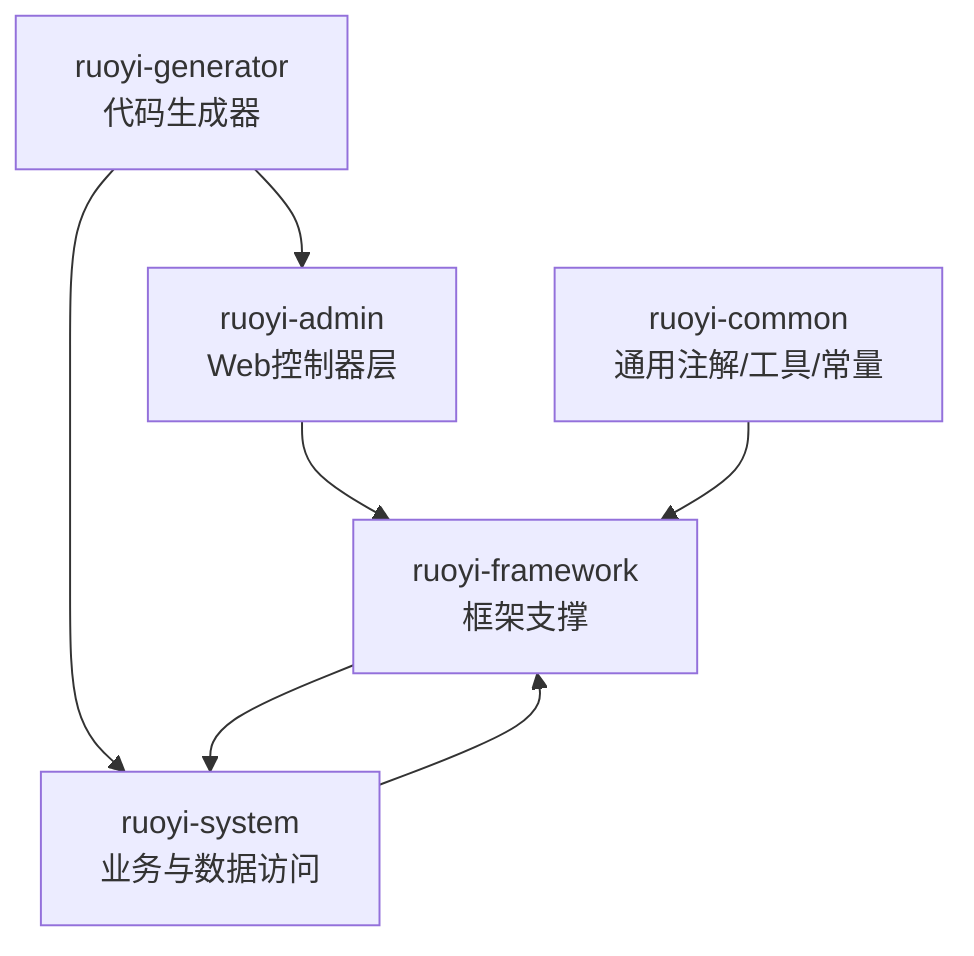
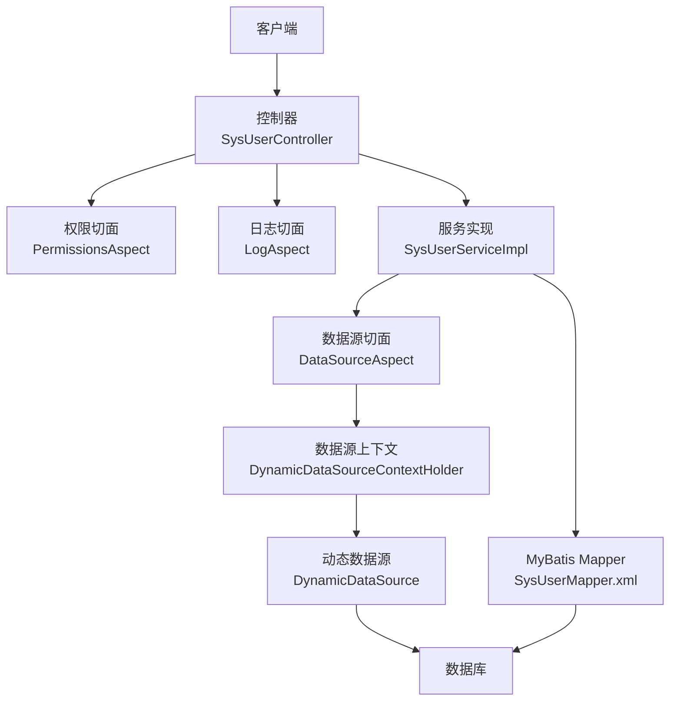
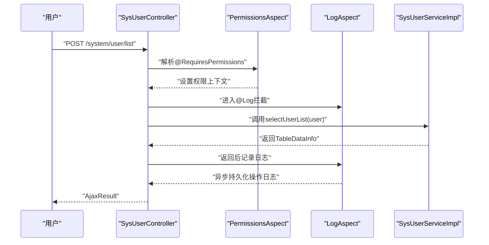
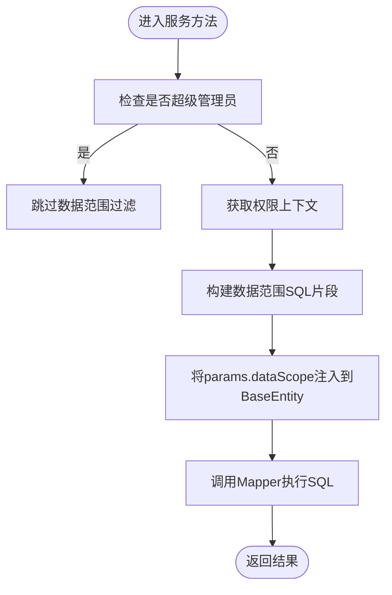
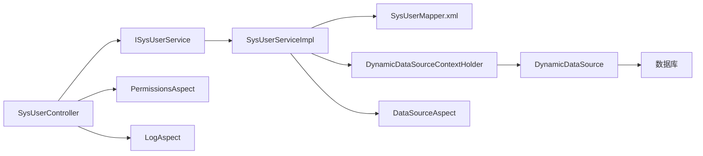

# 功能扩展开发

<cite>
**本文引用的文件**   
- [RuoYiApplication.java](file://ruoyi-admin/src/main/java/com/ruoyi/RuoYiApplication.java)
- [ApplicationConfig.java](file://ruoyi-framework/src/main/java/com/ruoyi/framework/config/ApplicationConfig.java)
- [SysUserController.java](file://ruoyi-admin/src/main/java/com/ruoyi/web/controller/system/SysUserController.java)
- [SysUserServiceImpl.java](file://ruoyi-system/src/main/java/com/ruoyi/system/service/impl/SysUserServiceImpl.java)
- [SysUserMapper.xml](file://ruoyi-system/src/main/resources/mapper/system/SysUserMapper.xml)
- [PermissionsAspect.java](file://ruoyi-framework/src/main/java/com/ruoyi/framework/aspectj/PermissionsAspect.java)
- [DataScopeAspect.java](file://ruoyi-framework/src/main/java/com/ruoyi/framework/aspectj/DataScopeAspect.java)
- [LogAspect.java](file://ruoyi-framework/src/main/java/com/ruoyi/framework/aspectj/LogAspect.java)
- [DataSourceAspect.java](file://ruoyi-framework/src/main/java/com/ruoyi/framework/aspectj/DataSourceAspect.java)
- [DynamicDataSource.java](file://ruoyi-framework/src/main/java/com/ruoyi/framework/datasource/DynamicDataSource.java)
- [DynamicDataSourceContextHolder.java](file://ruoyi-common/src/main/java/com/ruoyi/common/config/datasource/DynamicDataSourceContextHolder.java)
- [DataSource.java](file://ruoyi-common/src/main/java/com/ruoyi/common/annotation/DataSource.java)
- [DataScope.java](file://ruoyi-common/src/main/java/com/ruoyi/common/annotation/DataScope.java)
- [Log.java](file://ruoyi-common/src/main/java/com/ruoyi/common/annotation/Log.java)
- [DataSourceType.java](file://ruoyi-common/src/main/java/com/ruoyi/common/enums/DataSourceType.java)
- [UserRealm.java](file://ruoyi-framework/src/main/java/com/ruoyi/framework/shiro/realm/UserRealm.java)
- [VelocityUtils.java](file://ruoyi-generator/src/main/java/com/ruoyi/generator/util/VelocityUtils.java)
</cite>

## 目录
1. [简介](#简介)
2. [项目结构](#项目结构)
3. [核心组件](#核心组件)
4. [架构总览](#架构总览)
5. [详细组件分析](#详细组件分析)
6. [依赖分析](#依赖分析)
7. [性能考虑](#性能考虑)
8. [故障排查指南](#故障排查指南)
9. [结论](#结论)
10. [附录](#附录)

## 简介
本指南面向在RuoYi系统上进行功能扩展开发的工程师，围绕以下目标提供可操作的开发流程与最佳实践：
- 基于现有架构创建新功能模块：控制器、服务类、数据访问层
- AOP切面编程在权限控制、数据权限、日志记录中的应用
- 插件机制与第三方组件集成策略
- 数据权限注解的使用与自定义权限控制开发
- 代码生成器的扩展与自定义模板开发
- 模块间通信与依赖管理
- 动态数据源切换与多租户支持方案

## 项目结构
RuoYi采用多模块分层架构，核心模块包括：
- ruoyi-admin：Web控制器层，提供REST/HTML接口
- ruoyi-system：业务领域模型与MyBatis映射
- ruoyi-framework：框架支撑（AOP、Shiro、动态数据源、拦截器等）
- ruoyi-common：通用注解、常量、工具与实体基类
- ruoyi-generator：代码生成器（Velocity模板）
- ruoyi-quartz：定时任务模块（可作为扩展参考）

图表来源
- [RuoYiApplication.java:12-17](file://ruoyi-admin/src/main/java/com/ruoyi/RuoYiApplication.java#L12-L17)
- [ApplicationConfig.java:12-20](file://ruoyi-framework/src/main/java/com/ruoyi/framework/config/ApplicationConfig.java#L12-L20)

章节来源
- [RuoYiApplication.java:12-17](file://ruoyi-admin/src/main/java/com/ruoyi/RuoYiApplication.java#L12-L17)
- [ApplicationConfig.java:12-20](file://ruoyi-framework/src/main/java/com/ruoyi/framework/config/ApplicationConfig.java#L12-L20)

## 核心组件
- 控制器层：以系统用户模块为例，展示权限注解、日志注解与服务调用的典型模式
- 服务层：封装业务逻辑，结合数据权限注解与数据范围过滤
- 数据访问层：MyBatis XML映射，配合AOP注入的数据范围SQL片段
- AOP切面：权限解析、数据权限过滤、日志记录、数据源切换
- 动态数据源：基于ThreadLocal的上下文切换与路由

章节来源
- [SysUserController.java:64-79](file://ruoyi-admin/src/main/java/com/ruoyi/web/controller/system/SysUserController.java#L64-L79)
- [SysUserServiceImpl.java:80-85](file://ruoyi-system/src/main/java/com/ruoyi/system/service/impl/SysUserServiceImpl.java#L80-L85)
- [SysUserMapper.xml:62-89](file://ruoyi-system/src/main/resources/mapper/system/SysUserMapper.xml#L62-L89)
- [PermissionsAspect.java:20-29](file://ruoyi-framework/src/main/java/com/ruoyi/framework/aspectj/PermissionsAspect.java#L20-L29)
- [DataScopeAspect.java:34-54](file://ruoyi-framework/src/main/java/com/ruoyi/framework/aspectj/DataScopeAspect.java#L34-L54)
- [LogAspect.java:56-71](file://ruoyi-framework/src/main/java/com/ruoyi/framework/aspectj/LogAspect.java#L56-L71)
- [DataSourceAspect.java:37-56](file://ruoyi-framework/src/main/java/com/ruoyi/framework/aspectj/DataSourceAspect.java#L37-L56)
- [DynamicDataSource.java:22-26](file://ruoyi-framework/src/main/java/com/ruoyi/framework/datasource/DynamicDataSource.java#L22-L26)

## 架构总览
RuoYi通过Spring Boot + MyBatis + Shiro + AOP构建，控制器接收请求，经Shiro鉴权与AOP切面处理后，调用服务层，服务层通过Mapper访问数据库。动态数据源与数据权限在AOP层面完成横切增强。

图表来源
- [SysUserController.java:64-79](file://ruoyi-admin/src/main/java/com/ruoyi/web/controller/system/SysUserController.java#L64-L79)
- [PermissionsAspect.java:20-29](file://ruoyi-framework/src/main/java/com/ruoyi/framework/aspectj/PermissionsAspect.java#L20-L29)
- [LogAspect.java:56-71](file://ruoyi-framework/src/main/java/com/ruoyi/framework/aspectj/LogAspect.java#L56-L71)
- [SysUserServiceImpl.java:80-85](file://ruoyi-system/src/main/java/com/ruoyi/system/service/impl/SysUserServiceImpl.java#L80-L85)
- [DataSourceAspect.java:37-56](file://ruoyi-framework/src/main/java/com/ruoyi/framework/aspectj/DataSourceAspect.java#L37-L56)
- [DynamicDataSourceContextHolder.java:24-36](file://ruoyi-common/src/main/java/com/ruoyi/common/config/datasource/DynamicDataSourceContextHolder.java#L24-L36)
- [DynamicDataSource.java:22-26](file://ruoyi-framework/src/main/java/com/ruoyi/framework/datasource/DynamicDataSource.java#L22-L26)
- [SysUserMapper.xml:62-89](file://ruoyi-system/src/main/resources/mapper/system/SysUserMapper.xml#L62-L89)

## 详细组件分析

### 控制器层开发流程
- 新建控制器类，位于对应模块的web/controller目录下
- 使用权限注解标识访问控制点，如“system:user:list”
- 使用日志注解记录操作行为，配置是否保存请求/响应参数
- 调用服务接口，返回统一结果包装

图表来源
- [SysUserController.java:71-79](file://ruoyi-admin/src/main/java/com/ruoyi/web/controller/system/SysUserController.java#L71-L79)
- [PermissionsAspect.java:20-29](file://ruoyi-framework/src/main/java/com/ruoyi/framework/aspectj/PermissionsAspect.java#L20-L29)
- [LogAspect.java:67-71](file://ruoyi-framework/src/main/java/com/ruoyi/framework/aspectj/LogAspect.java#L67-L71)

章节来源
- [SysUserController.java:64-79](file://ruoyi-admin/src/main/java/com/ruoyi/web/controller/system/SysUserController.java#L64-L79)
- [Log.java:16-50](file://ruoyi-common/src/main/java/com/ruoyi/common/annotation/Log.java#L16-L50)

### 服务层开发流程
- 在服务接口中声明业务方法
- 在实现类中注入Mapper与相关服务
- 对涉及数据范围的方法添加数据权限注解，自动注入SQL过滤条件
- 在事务边界内处理业务一致性

图表来源
- [SysUserServiceImpl.java:80-85](file://ruoyi-system/src/main/java/com/ruoyi/system/service/impl/SysUserServiceImpl.java#L80-L85)
- [DataScopeAspect.java:41-54](file://ruoyi-framework/src/main/java/com/ruoyi/framework/aspectj/DataScopeAspect.java#L41-L54)
- [SysUserMapper.xml:87-89](file://ruoyi-system/src/main/resources/mapper/system/SysUserMapper.xml#L87-L89)

章节来源
- [SysUserServiceImpl.java:80-85](file://ruoyi-system/src/main/java/com/ruoyi/system/service/impl/SysUserServiceImpl.java#L80-L85)
- [DataScope.java:14-43](file://ruoyi-common/src/main/java/com/ruoyi/common/annotation/DataScope.java#L14-L43)

### 数据访问层开发流程
- 在Mapper接口中声明方法
- 在XML中编写SQL，使用参数对象的params携带数据范围SQL片段
- MyBatis会将${params.dataScope}原样替换，实现动态过滤

章节来源
- [SysUserMapper.xml:62-89](file://ruoyi-system/src/main/resources/mapper/system/SysUserMapper.xml#L62-L89)

### AOP切面编程应用

#### 权限控制切面
- 将@RequiresPermissions的多个权限值合并到请求上下文中，便于服务层按角色匹配

章节来源
- [PermissionsAspect.java:20-29](file://ruoyi-framework/src/main/java/com/ruoyi/framework/aspectj/PermissionsAspect.java#L20-L29)

#### 数据权限过滤切面
- 解析注解参数，根据用户角色的数据范围策略生成SQL片段
- 清理并注入params.dataScope，避免SQL注入风险

章节来源
- [DataScopeAspect.java:34-54](file://ruoyi-framework/src/main/java/com/ruoyi/framework/aspectj/DataScopeAspect.java#L34-L54)
- [DataScopeAspect.java:149-157](file://ruoyi-framework/src/main/java/com/ruoyi/framework/aspectj/DataScopeAspect.java#L149-L157)

#### 日志记录切面
- 统计请求耗时、记录操作人、IP、URL、请求参数、响应结果
- 异步落库，降低同步开销

章节来源
- [LogAspect.java:56-71](file://ruoyi-framework/src/main/java/com/ruoyi/framework/aspectj/LogAspect.java#L56-L71)
- [LogAspect.java:85-137](file://ruoyi-framework/src/main/java/com/ruoyi/framework/aspectj/LogAspect.java#L85-L137)

#### 数据源切换切面
- 方法级或类级@DataSource注解决定使用主库或从库
- 切换后清理上下文，避免线程污染

章节来源
- [DataSourceAspect.java:37-56](file://ruoyi-framework/src/main/java/com/ruoyi/framework/aspectj/DataSourceAspect.java#L37-L56)
- [DataSource.java:18-28](file://ruoyi-common/src/main/java/com/ruoyi/common/annotation/DataSource.java#L18-L28)
- [DynamicDataSourceContextHolder.java:24-44](file://ruoyi-common/src/main/java/com/ruoyi/common/config/datasource/DynamicDataSourceContextHolder.java#L24-L44)
- [DynamicDataSource.java:22-26](file://ruoyi-framework/src/main/java/com/ruoyi/framework/datasource/DynamicDataSource.java#L22-L26)
- [DataSourceType.java:8-19](file://ruoyi-common/src/main/java/com/ruoyi/common/enums/DataSourceType.java#L8-L19)

### 插件机制与第三方组件集成
- 插件化建议：将可插拔能力抽象为SPI接口，通过配置开关启用/禁用
- 第三方组件集成：遵循Spring Boot Starter规范，提供自动装配与外部配置项
- 安全与隔离：通过AOP与权限注解确保插件不越权访问核心资源

[本节为通用指导，无需特定文件引用]

### 数据权限注解与自定义权限控制
- 使用@RequiresPermissions在控制器标注权限点
- 使用@DataScope在服务方法标注数据范围过滤规则
- 自定义权限：在Realm中扩展授权逻辑，支持更细粒度的权限判定

章节来源
- [UserRealm.java:56-81](file://ruoyi-framework/src/main/java/com/ruoyi/framework/shiro/realm/UserRealm.java#L56-L81)

### 代码生成器扩展与自定义模板
- 生成器通过Velocity模板渲染，支持CRUD、树结构、主子表等模板组合
- 可扩展模板：在templates/tool/gen下新增.vm文件，调整VelocityUtils中的模板清单与文件名映射
- 生成物：自动输出Java实体、Mapper、Service、Controller、XML、HTML及初始化SQL

章节来源
- [VelocityUtils.java:134-168](file://ruoyi-generator/src/main/java/com/ruoyi/generator/util/VelocityUtils.java#L134-L168)
- [VelocityUtils.java:173-247](file://ruoyi-generator/src/main/java/com/ruoyi/generator/util/VelocityUtils.java#L173-L247)

### 模块间通信与依赖管理
- 控制器依赖服务接口，服务依赖Mapper与领域模型
- AOP横切关注点通过注解与切点定义，避免侵入式耦合
- 依赖注入与事务管理由Spring容器负责，确保一致性

章节来源
- [SysUserController.java:49-62](file://ruoyi-admin/src/main/java/com/ruoyi/web/controller/system/SysUserController.java#L49-L62)
- [SysUserServiceImpl.java:50-72](file://ruoyi-system/src/main/java/com/ruoyi/system/service/impl/SysUserServiceImpl.java#L50-L72)

### 动态数据源切换与多租户支持
- 动态数据源：通过ThreadLocal存储当前数据源键，在AOP中设置/清理
- 多租户：可在上下文键中携带租户标识，路由到对应数据源实例
- 读写分离：MASTER/SLAVE枚举控制主从库选择

章节来源
- [DynamicDataSourceContextHolder.java:11-44](file://ruoyi-common/src/main/java/com/ruoyi/common/config/datasource/DynamicDataSourceContextHolder.java#L11-L44)
- [DynamicDataSource.java:13-26](file://ruoyi-framework/src/main/java/com/ruoyi/framework/datasource/DynamicDataSource.java#L13-L26)
- [DataSourceAspect.java:37-56](file://ruoyi-framework/src/main/java/com/ruoyi/framework/aspectj/DataSourceAspect.java#L37-L56)
- [DataSourceType.java:8-19](file://ruoyi-common/src/main/java/com/ruoyi/common/enums/DataSourceType.java#L8-L19)

## 依赖分析
- 控制器依赖服务接口，服务依赖Mapper与领域模型
- AOP切面依赖注解与上下文工具
- 动态数据源依赖上下文与路由实现

图表来源
- [SysUserController.java:49-62](file://ruoyi-admin/src/main/java/com/ruoyi/web/controller/system/SysUserController.java#L49-L62)
- [SysUserServiceImpl.java:50-72](file://ruoyi-system/src/main/java/com/ruoyi/system/service/impl/SysUserServiceImpl.java#L50-L72)
- [SysUserMapper.xml:62-89](file://ruoyi-system/src/main/resources/mapper/system/SysUserMapper.xml#L62-L89)
- [DynamicDataSourceContextHolder.java:24-36](file://ruoyi-common/src/main/java/com/ruoyi/common/config/datasource/DynamicDataSourceContextHolder.java#L24-L36)
- [DynamicDataSource.java:22-26](file://ruoyi-framework/src/main/java/com/ruoyi/framework/datasource/DynamicDataSource.java#L22-L26)
- [PermissionsAspect.java:20-29](file://ruoyi-framework/src/main/java/com/ruoyi/framework/aspectj/PermissionsAspect.java#L20-L29)
- [LogAspect.java:67-71](file://ruoyi-framework/src/main/java/com/ruoyi/framework/aspectj/LogAspect.java#L67-L71)
- [DataSourceAspect.java:37-56](file://ruoyi-framework/src/main/java/com/ruoyi/framework/aspectj/DataSourceAspect.java#L37-L56)

## 性能考虑
- 异步日志：操作日志通过异步队列持久化，避免阻塞主线程
- SQL注入防护：AOP清理params.dataScope，严格拼接SQL片段
- 读写分离：通过注解选择从库，提升查询吞吐
- 缓存与权限：Shiro授权缓存减少重复计算

[本节为通用指导，无需特定文件引用]

## 故障排查指南
- 权限不足：确认@RequiresPermissions与用户角色权限是否匹配
- 数据看不到：检查@DataScope注解与用户角色数据范围策略
- 日志未记录：确认@Log注解配置与异步任务是否正常
- 数据源切换无效：检查@DataSource注解层级与上下文清理逻辑

章节来源
- [PermissionsAspect.java:20-29](file://ruoyi-framework/src/main/java/com/ruoyi/framework/aspectj/PermissionsAspect.java#L20-L29)
- [DataScopeAspect.java:149-157](file://ruoyi-framework/src/main/java/com/ruoyi/framework/aspectj/DataScopeAspect.java#L149-L157)
- [LogAspect.java:85-137](file://ruoyi-framework/src/main/java/com/ruoyi/framework/aspectj/LogAspect.java#L85-L137)
- [DataSourceAspect.java:37-56](file://ruoyi-framework/src/main/java/com/ruoyi/framework/aspectj/DataSourceAspect.java#L37-L56)

## 结论
通过遵循RuoYi的分层架构与AOP横切机制，开发者可以快速、安全地扩展新功能模块。建议在新增模块时：
- 严格使用权限与日志注解
- 正确配置数据权限与数据源注解
- 借助代码生成器提高开发效率
- 通过模板扩展满足定制化需求

[本节为总结性内容，无需特定文件引用]

## 附录

### 新功能模块开发清单
- 控制器：定义路由、权限注解、日志注解、参数校验
- 服务接口：声明业务方法
- 服务实现：注入依赖、加注数据权限、事务控制
- Mapper接口与XML：编写SQL，使用params.dataScope
- 配置与扫描：确保Mapper扫描与AOP生效

章节来源
- [ApplicationConfig.java:12-20](file://ruoyi-framework/src/main/java/com/ruoyi/framework/config/ApplicationConfig.java#L12-L20)
- [SysUserController.java:64-79](file://ruoyi-admin/src/main/java/com/ruoyi/web/controller/system/SysUserController.java#L64-L79)
- [SysUserServiceImpl.java:80-85](file://ruoyi-system/src/main/java/com/ruoyi/system/service/impl/SysUserServiceImpl.java#L80-L85)
- [SysUserMapper.xml:62-89](file://ruoyi-system/src/main/resources/mapper/system/SysUserMapper.xml#L62-L89)