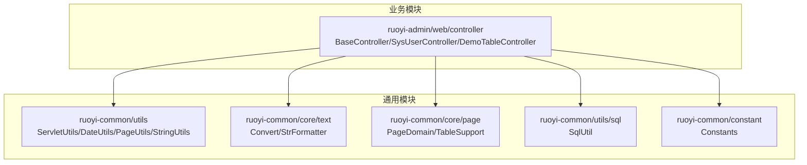
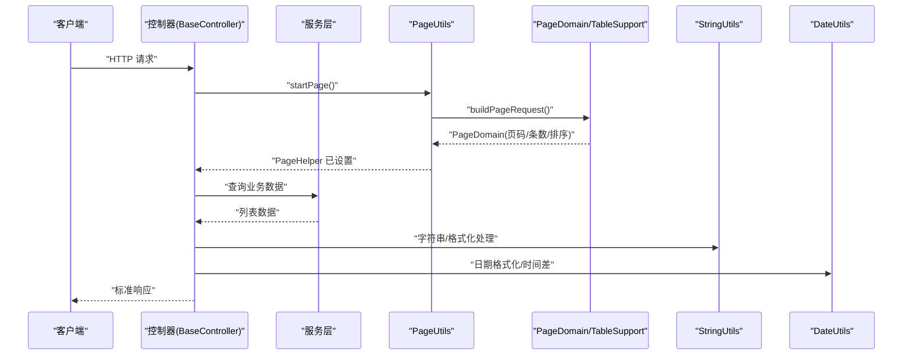
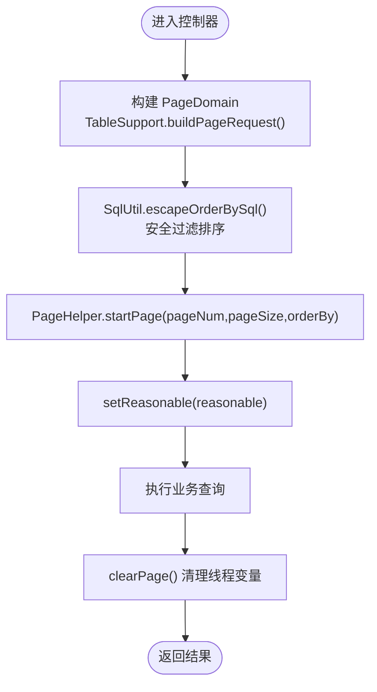
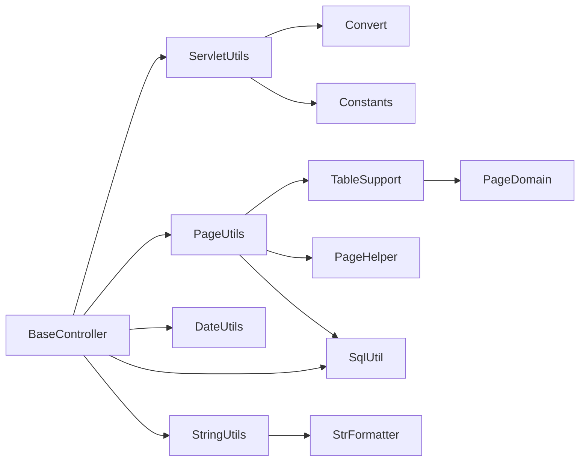

# 常用工具类使用

<cite>
**本文引用的文件**
- [ServletUtils.java](file://ruoyi-common/src/main/java/com/ruoyi/common/utils/ServletUtils.java)
- [DateUtils.java](file://ruoyi-common/src/main/java/com/ruoyi/common/utils/DateUtils.java)
- [PageUtils.java](file://ruoyi-common/src/main/java/com/ruoyi/common/utils/PageUtils.java)
- [StringUtils.java](file://ruoyi-common/src/main/java/com/ruoyi/common/utils/StringUtils.java)
- [Constants.java](file://ruoyi-common/src/main/java/com/ruoyi/common/constant/Constants.java)
- [Convert.java](file://ruoyi-common/src/main/java/com/ruoyi/common/core/text/Convert.java)
- [TableSupport.java](file://ruoyi-common/src/main/java/com/ruoyi/common/core/page/TableSupport.java)
- [PageDomain.java](file://ruoyi-common/src/main/java/com/ruoyi/common/core/page/PageDomain.java)
- [SqlUtil.java](file://ruoyi-common/src/main/java/com/ruoyi/common/utils/sql/SqlUtil.java)
- [BaseController.java](file://ruoyi-admin/src/main/java/com/ruoyi/web/controller/BaseController.java)
- [SysUserController.java](file://ruoyi-admin/src/main/java/com/ruoyi/web/controller/system/SysUserController.java)
- [DemoTableController.java](file://ruoyi-admin/src/main/java/com/ruoyi/web/controller/demo/controller/DemoTableController.java)
</cite>

## 目录
1. [简介](#简介)
2. [项目结构](#项目结构)
3. [核心组件](#核心组件)
4. [架构总览](#架构总览)
5. [详细组件分析](#详细组件分析)
6. [依赖分析](#依赖分析)
7. [性能考虑](#性能考虑)
8. [故障排查指南](#故障排查指南)
9. [结论](#结论)
10. [附录](#附录)

## 简介
本指南聚焦于 RuoYi 系统中的常用工具类，围绕 ServletUtils、DateUtils、PageUtils、StringUtils 的功能、API、典型使用场景与最佳实践展开，帮助开发者快速掌握这些工具类的使用方法、设计原理与扩展方向，并提供性能与安全注意事项。

## 项目结构
- 工具类集中位于 ruoyi-common 模块的 utils 及其子包中，提供 Web 请求、日期、分页、字符串等通用能力。
- 控制器层（ruoyi-admin）通过 BaseController 统一集成分页、日期、字符串等工具，形成统一的业务入口。

图表来源
- [ServletUtils.java:1-233](file://ruoyi-common/src/main/java/com/ruoyi/common/utils/ServletUtils.java#L1-L233)
- [DateUtils.java:1-192](file://ruoyi-common/src/main/java/com/ruoyi/common/utils/DateUtils.java#L1-L192)
- [PageUtils.java:1-36](file://ruoyi-common/src/main/java/com/ruoyi/common/utils/PageUtils.java#L1-L36)
- [StringUtils.java:1-715](file://ruoyi-common/src/main/java/com/ruoyi/common/utils/StringUtils.java#L1-L715)
- [Convert.java:1-1011](file://ruoyi-common/src/main/java/com/ruoyi/common/core/text/Convert.java#L1-L1011)
- [TableSupport.java:1-57](file://ruoyi-common/src/main/java/com/ruoyi/common/core/page/TableSupport.java#L1-L57)
- [PageDomain.java:1-90](file://ruoyi-common/src/main/java/com/ruoyi/common/core/page/PageDomain.java#L1-L90)
- [SqlUtil.java:1-72](file://ruoyi-common/src/main/java/com/ruoyi/common/utils/sql/SqlUtil.java#L1-L72)
- [Constants.java:1-154](file://ruoyi-common/src/main/java/com/ruoyi/common/constant/Constants.java#L1-L154)
- [BaseController.java:1-43](file://ruoyi-admin/src/main/java/com/ruoyi/web/controller/BaseController.java#L1-L43)
- [SysUserController.java:1-357](file://ruoyi-admin/src/main/java/com/ruoyi/web/controller/system/SysUserController.java#L1-L357)
- [DemoTableController.java:1-1024](file://ruoyi-admin/src/main/java/com/ruoyi/web/controller/demo/controller/DemoTableController.java#L1-L1024)

章节来源
- [BaseController.java:1-43](file://ruoyi-admin/src/main/java/com/ruoyi/web/controller/BaseController.java#L1-L43)

## 核心组件
- ServletUtils：封装 Web 请求参数获取、响应渲染、Ajax 判断、UA 移动端识别、URL 编解码、CSRF Token 生成等。
- DateUtils：提供日期时间格式化、解析、服务器启动时间、时间差计算、LocalDate/LocalDateTime 到 Date 的转换等。
- PageUtils：基于 PageHelper 的分页入口，负责从请求构建 PageDomain 并设置分页参数，同时提供清理线程变量的能力。
- StringUtils：提供空值判断、字符串截取、格式化、驼峰/下划线互转、Ant Path 匹配、左填充等丰富字符串处理能力。

章节来源
- [ServletUtils.java:1-233](file://ruoyi-common/src/main/java/com/ruoyi/common/utils/ServletUtils.java#L1-L233)
- [DateUtils.java:1-192](file://ruoyi-common/src/main/java/com/ruoyi/common/utils/DateUtils.java#L1-L192)
- [PageUtils.java:1-36](file://ruoyi-common/src/main/java/com/ruoyi/common/utils/PageUtils.java#L1-L36)
- [StringUtils.java:1-715](file://ruoyi-common/src/main/java/com/ruoyi/common/utils/StringUtils.java#L1-L715)

## 架构总览
工具类在控制器层的使用路径如下：控制器通过 BaseController 统一入口，结合 ServletUtils 获取请求参数，使用 StringUtils 处理字符串，使用 DateUtils 处理日期，使用 PageUtils 启动分页，最终返回标准数据结构。

图表来源
- [BaseController.java:1-43](file://ruoyi-admin/src/main/java/com/ruoyi/web/controller/BaseController.java#L1-L43)
- [PageUtils.java:1-36](file://ruoyi-common/src/main/java/com/ruoyi/common/utils/PageUtils.java#L1-L36)
- [TableSupport.java:1-57](file://ruoyi-common/src/main/java/com/ruoyi/common/core/page/TableSupport.java#L1-L57)
- [PageDomain.java:1-90](file://ruoyi-common/src/main/java/com/ruoyi/common/core/page/PageDomain.java#L1-L90)
- [StringUtils.java:1-715](file://ruoyi-common/src/main/java/com/ruoyi/common/utils/StringUtils.java#L1-L715)
- [DateUtils.java:1-192](file://ruoyi-common/src/main/java/com/ruoyi/common/utils/DateUtils.java#L1-L192)

## 详细组件分析

### ServletUtils 工具类
- 主要职责
  - 参数获取：支持 String/Integer/Boolean 的安全转换与默认值。
  - 请求/响应/会话获取：通过 RequestContextHolder 获取当前线程上下文。
  - 响应渲染：统一 JSON 输出。
  - Ajax 判断：依据 Accept、X-Requested-With、URI 后缀、特殊参数判断。
  - 移动端 UA 检测：基于常见移动设备标识。
  - URL 编解码：UTF-8 编解码。
  - CSRF Token：随机字节生成 Base64 编码令牌。
- 关键 API（方法签名、参数、返回值）
  - getParameter(name): 获取字符串参数
  - getParameter(name, default): 带默认值获取
  - getParameterToInt(name[, default]): 转整型
  - getParameterToBool(name[, default]): 转布尔型
  - getRequest()/getResponse()/getSession(): 获取上下文对象
  - renderString(response, string): 输出 JSON 字符串
  - isAjaxRequest(request): 判断是否 Ajax
  - checkAgentIsMobile(ua): 判断是否移动端
  - urlEncode(str)/urlDecode(str): URL 编解码
  - generateToken(): 生成 CSRF Token
- 使用场景
  - 控制器中统一获取分页参数、排序字段、查询条件。
  - 前后端交互中区分 Ajax 与非 Ajax，决定返回 JSON 或页面。
  - 移动端适配与安全防护（CSRF Token）。
- 设计要点
  - 通过 Convert 实现类型安全转换，避免异常。
  - 使用 Constants 中的 UTF-8 常量保证编码一致性。
- 扩展建议
  - 可增加 IP 白名单校验、请求头签名校验等。

章节来源
- [ServletUtils.java:1-233](file://ruoyi-common/src/main/java/com/ruoyi/common/utils/ServletUtils.java#L1-L233)
- [Convert.java:1-1011](file://ruoyi-common/src/main/java/com/ruoyi/common/core/text/Convert.java#L1-L1011)
- [Constants.java:1-154](file://ruoyi-common/src/main/java/com/ruoyi/common/constant/Constants.java#L1-L154)

### DateUtils 工具类
- 主要职责
  - 当前日期/时间字符串获取与格式化。
  - 日期字符串解析，支持多种格式。
  - 服务器启动时间获取。
  - 日期差计算（天数、时分秒）。
  - LocalDate/LocalDateTime 到 Date 的转换。
- 关键 API（方法签名、参数、返回值）
  - getNowDate(): 当前 Date
  - getDate()/getTime()/dateTimeNow()/dateTimeNow(format): 当前日期/时间字符串
  - parseDateToStr(format, date): 格式化日期
  - dateTime(format, ts): 字符串转日期
  - datePath()/dateTime(): 生成日期路径
  - parseDate(obj): 字符串/对象解析为 Date
  - getServerStartDate(): 服务器启动时间
  - differentDaysByMillisecond(date1, date2): 相差天数
  - timeDistance(endDate, startTime): 时间差（天/小时/分钟）
  - toDate(localDate/LocalDateTime): 转 Date
- 使用场景
  - 日志时间戳、报表日期、定时任务时间计算。
  - 前端传参日期字符串解析与格式化输出。
- 设计要点
  - 基于 Apache Commons Lang 的 DateUtils 扩展，复用成熟解析策略。
  - 使用 ZoneId 等时区转换，避免本地化问题。
- 扩展建议
  - 可增加时区转换、国际化日期格式支持。

章节来源
- [DateUtils.java:1-192](file://ruoyi-common/src/main/java/com/ruoyi/common/utils/DateUtils.java#L1-L192)

### PageUtils 工具类
- 主要职责
  - 从请求中构建 PageDomain 并设置分页参数。
  - 清理 PageHelper 的线程变量，避免线程复用导致的脏数据。
- 关键 API（方法签名、参数、返回值）
  - startPage(): 设置分页（页码、条数、排序、合理化）
  - clearPage(): 清理分页线程变量
- 使用场景
  - 列表查询统一入口，自动从请求参数解析分页与排序。
- 设计要点
  - 依赖 TableSupport 构建 PageDomain，再交给 PageHelper。
  - 通过 SqlUtil.escapeOrderBySql 对排序字段进行安全过滤。
- 扩展建议
  - 可增加默认排序、最大页大小限制等策略。

图表来源
- [PageUtils.java:1-36](file://ruoyi-common/src/main/java/com/ruoyi/common/utils/PageUtils.java#L1-L36)
- [TableSupport.java:1-57](file://ruoyi-common/src/main/java/com/ruoyi/common/core/page/TableSupport.java#L1-L57)
- [PageDomain.java:1-90](file://ruoyi-common/src/main/java/com/ruoyi/common/core/page/PageDomain.java#L1-L90)
- [SqlUtil.java:1-72](file://ruoyi-common/src/main/java/com/ruoyi/common/utils/sql/SqlUtil.java#L1-L72)

章节来源
- [PageUtils.java:1-36](file://ruoyi-common/src/main/java/com/ruoyi/common/utils/PageUtils.java#L1-L36)
- [TableSupport.java:1-57](file://ruoyi-common/src/main/java/com/ruoyi/common/core/page/TableSupport.java#L1-L57)
- [PageDomain.java:1-90](file://ruoyi-common/src/main/java/com/ruoyi/common/core/page/PageDomain.java#L1-L90)
- [SqlUtil.java:1-72](file://ruoyi-common/src/main/java/com/ruoyi/common/utils/sql/SqlUtil.java#L1-L72)

### StringUtils 工具类
- 主要职责
  - 空值判断：字符串、集合、数组、Map。
  - 字符串截取与格式化。
  - 驼峰与下划线互转。
  - Ant 风格路径匹配。
  - 左填充（数字/字符串）。
  - 其他实用字符串处理。
- 关键 API（方法签名、参数、返回值）
  - nvl(value, default): 空值返回默认值
  - isEmpty/isNotEmpty(...): 集合/数组/Map/字符串判空
  - trim(str): 去空白
  - hide(str, start, end): 指定区间替换为星号
  - substring(str, start[, end]): 截取
  - substringBetweenLast(str, open, close): 查找中间子串
  - format(template, params...): 占位符格式化
  - ishttp(link): 是否 http(s) 开头
  - str2List/str2Set(str, sep, filterBlank, trim): 字符串拆分
  - containsAny/containsAnyIgnoreCase: 包含判断
  - toUnderScoreCase/toCamelCase/convertToCamelCase: 命名互转
  - isMatch(pattern, url): Ant 匹配
  - padl(numOrStr, size[, c]): 左填充
- 使用场景
  - 参数校验、日志格式化、字段命名转换、路径匹配、导出列处理。
- 设计要点
  - 大量基于 Apache Commons Lang 的 StringUtils 扩展，增强可读性与易用性。
  - StrFormatter 提供安全占位符格式化，避免转义复杂度。
- 扩展建议
  - 可增加正则表达式工具、Unicode/Emoji 处理等。

章节来源
- [StringUtils.java:1-715](file://ruoyi-common/src/main/java/com/ruoyi/common/utils/StringUtils.java#L1-L715)
- [StrFormatter.java:1-93](file://ruoyi-common/src/main/java/com/ruoyi/common/core/text/StrFormatter.java#L1-L93)

## 依赖分析
- ServletUtils 依赖 Convert 进行类型转换，依赖 Constants 提供 UTF-8 常量。
- PageUtils 依赖 TableSupport 构建 PageDomain，再委托 PageHelper；排序字段通过 SqlUtil.escapeOrderBySql 过滤。
- BaseController 在初始化绑定时引入 DateUtils、PageUtils、ServletUtils、StringUtils、SqlUtil 等，统一业务入口。
- StringUtils 依赖 StrFormatter 进行格式化，依赖 Constants 中的协议常量。

图表来源
- [ServletUtils.java:1-233](file://ruoyi-common/src/main/java/com/ruoyi/common/utils/ServletUtils.java#L1-L233)
- [Convert.java:1-1011](file://ruoyi-common/src/main/java/com/ruoyi/common/core/text/Convert.java#L1-L1011)
- [Constants.java:1-154](file://ruoyi-common/src/main/java/com/ruoyi/common/constant/Constants.java#L1-L154)
- [PageUtils.java:1-36](file://ruoyi-common/src/main/java/com/ruoyi/common/utils/PageUtils.java#L1-L36)
- [TableSupport.java:1-57](file://ruoyi-common/src/main/java/com/ruoyi/common/core/page/TableSupport.java#L1-L57)
- [PageDomain.java:1-90](file://ruoyi-common/src/main/java/com/ruoyi/common/core/page/PageDomain.java#L1-L90)
- [SqlUtil.java:1-72](file://ruoyi-common/src/main/java/com/ruoyi/common/utils/sql/SqlUtil.java#L1-L72)
- [BaseController.java:1-43](file://ruoyi-admin/src/main/java/com/ruoyi/web/controller/BaseController.java#L1-L43)
- [StringUtils.java:1-715](file://ruoyi-common/src/main/java/com/ruoyi/common/utils/StringUtils.java#L1-L715)
- [StrFormatter.java:1-93](file://ruoyi-common/src/main/java/com/ruoyi/common/core/text/StrFormatter.java#L1-L93)

章节来源
- [BaseController.java:1-43](file://ruoyi-admin/src/main/java/com/ruoyi/web/controller/BaseController.java#L1-L43)

## 性能考虑
- 字符串处理
  - 使用 StringUtils 的格式化与命名转换时，尽量避免在高频路径重复构造大量临时对象；可复用模板与常量。
- 日期处理
  - DateUtils 使用 SimpleDateFormat 进行格式化/解析，建议在高并发场景下关注线程安全；必要时使用 ThreadLocal 或现代时间 API。
- 分页处理
  - PageUtils 依赖 PageHelper，需确保在每次请求结束后调用 clearPage()，避免线程复用导致的分页参数泄漏。
- 类型转换
  - ServletUtils 通过 Convert 进行类型转换，尽量提供默认值，减少异常分支与空指针风险。

## 故障排查指南
- Ajax 判断不生效
  - 检查请求头 Accept/X-Requested-With 是否正确设置，或确认 URI 后缀与特殊参数是否符合判断逻辑。
- 分页参数无效
  - 确认请求参数名与 TableSupport 中常量一致（pageNum/pageSize/orderByColumn/isAsc/reasonable），并检查 SqlUtil 对排序字段的安全过滤是否抛出异常。
- 字符串格式化异常
  - 检查 StrFormatter 的占位符与转义规则，避免误用转义字符导致格式化失败。
- 日期解析失败
  - 确认前端传参格式与 DateUtils 的 parsePatterns 匹配，或显式传入 format 参数。

章节来源
- [ServletUtils.java:137-159](file://ruoyi-common/src/main/java/com/ruoyi/common/utils/ServletUtils.java#L137-L159)
- [SqlUtil.java:31-50](file://ruoyi-common/src/main/java/com/ruoyi/common/utils/sql/SqlUtil.java#L31-L50)
- [StrFormatter.java:30-91](file://ruoyi-common/src/main/java/com/ruoyi/common/core/text/StrFormatter.java#L30-L91)
- [DateUtils.java:81-91](file://ruoyi-common/src/main/java/com/ruoyi/common/utils/DateUtils.java#L81-L91)

## 结论
ServletUtils、DateUtils、PageUtils、StringUtils 是 RuoYi 系统中支撑 Web 层与业务层的关键工具类。它们通过统一的 API、类型安全的转换与丰富的字符串/日期/分页处理能力，显著提升了开发效率与代码一致性。遵循本文的使用建议、性能与安全注意事项，可在保证稳定性的同时提升系统整体质量。

## 附录

### API 一览（方法签名、参数、返回值）

- ServletUtils
  - getParameter(name): 获取字符串参数
  - getParameter(name, default): 带默认值获取
  - getParameterToInt(name[, default]): 转整型
  - getParameterToBool(name[, default]): 转布尔型
  - getRequest()/getResponse()/getSession(): 获取上下文对象
  - renderString(response, string): 输出 JSON 字符串
  - isAjaxRequest(request): 判断是否 Ajax
  - checkAgentIsMobile(ua): 判断是否移动端
  - urlEncode(str)/urlDecode(str): URL 编解码
  - generateToken(): 生成 CSRF Token

- DateUtils
  - getNowDate(): 当前 Date
  - getDate()/getTime()/dateTimeNow()/dateTimeNow(format): 当前日期/时间字符串
  - parseDateToStr(format, date): 格式化日期
  - dateTime(format, ts): 字符串转日期
  - datePath()/dateTime(): 生成日期路径
  - parseDate(obj): 字符串/对象解析为 Date
  - getServerStartDate(): 服务器启动时间
  - differentDaysByMillisecond(date1, date2): 相差天数
  - timeDistance(endDate, startTime): 时间差（天/小时/分钟）
  - toDate(localDate/LocalDateTime): 转 Date

- PageUtils
  - startPage(): 设置分页（页码、条数、排序、合理化）
  - clearPage(): 清理分页线程变量

- StringUtils
  - nvl(value, default): 空值返回默认值
  - isEmpty/isNotEmpty(...): 集合/数组/Map/字符串判空
  - trim(str): 去空白
  - hide(str, start, end): 指定区间替换为星号
  - substring(str, start[, end]): 截取
  - substringBetweenLast(str, open, close): 查找中间子串
  - format(template, params...): 占位符格式化
  - ishttp(link): 是否 http(s) 开头
  - str2List/str2Set(str, sep, filterBlank, trim): 字符串拆分
  - containsAny/containsAnyIgnoreCase: 包含判断
  - toUnderScoreCase/toCamelCase/convertToCamelCase: 命名互转
  - isMatch(pattern, url): Ant 匹配
  - padl(numOrStr, size[, c]): 左填充

章节来源
- [ServletUtils.java:35-233](file://ruoyi-common/src/main/java/com/ruoyi/common/utils/ServletUtils.java#L35-L233)
- [DateUtils.java:41-191](file://ruoyi-common/src/main/java/com/ruoyi/common/utils/DateUtils.java#L41-L191)
- [PageUtils.java:18-35](file://ruoyi-common/src/main/java/com/ruoyi/common/utils/PageUtils.java#L18-L35)
- [StringUtils.java:35-715](file://ruoyi-common/src/main/java/com/ruoyi/common/utils/StringUtils.java#L35-L715)

### 实际使用示例（路径引用）
- 控制器中统一分页入口与数据返回
  - [SysUserController.list(...) 调用 startPage() 与 getDataTable():74-79](file://ruoyi-admin/src/main/java/com/ruoyi/web/controller/system/SysUserController.java#L74-L79)
  - [DemoTableController 中分页与导出示例:194-200](file://ruoyi-admin/src/main/java/com/ruoyi/web/controller/demo/controller/DemoTableController.java#L194-L200)
- BaseController 统一初始化绑定与工具类引入
  - [BaseController.initBinder 引入日期类型转换:40-43](file://ruoyi-admin/src/main/java/com/ruoyi/web/controller/BaseController.java#L40-L43)

章节来源
- [SysUserController.java:74-79](file://ruoyi-admin/src/main/java/com/ruoyi/web/controller/system/SysUserController.java#L74-L79)
- [DemoTableController.java:194-200](file://ruoyi-admin/src/main/java/com/ruoyi/web/controller/demo/controller/DemoTableController.java#L194-L200)
- [BaseController.java:40-43](file://ruoyi-admin/src/main/java/com/ruoyi/web/controller/BaseController.java#L40-L43)