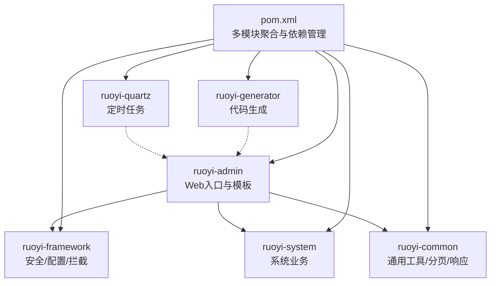
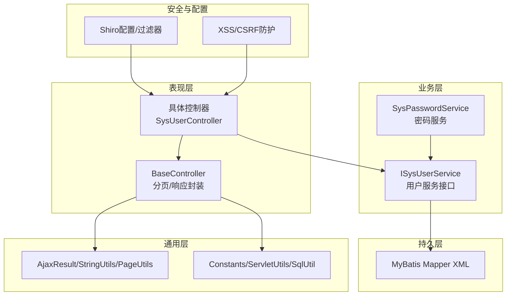
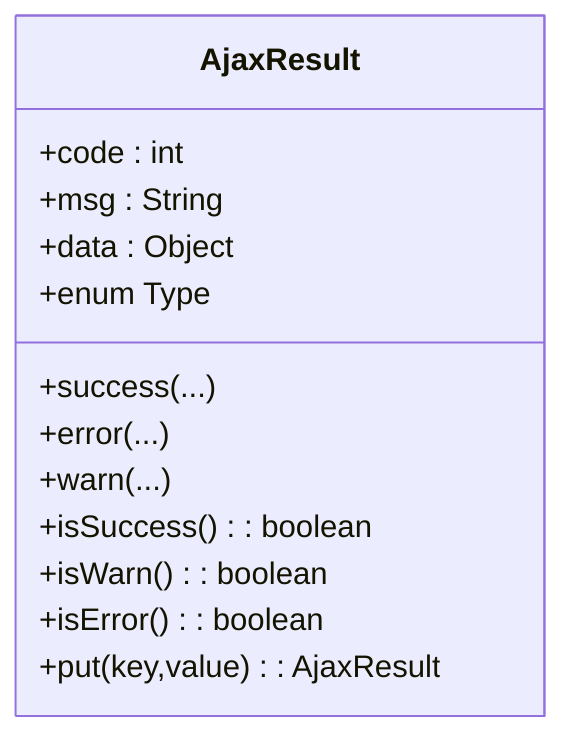
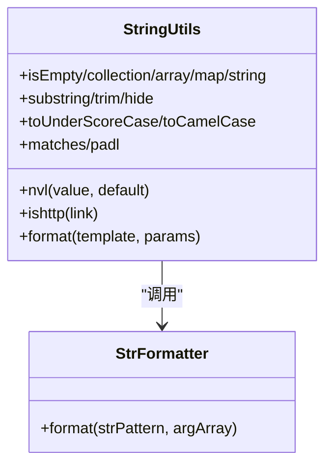
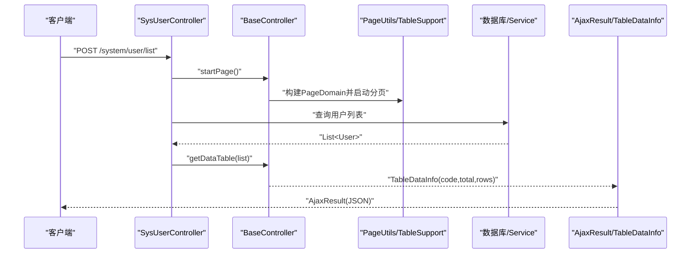
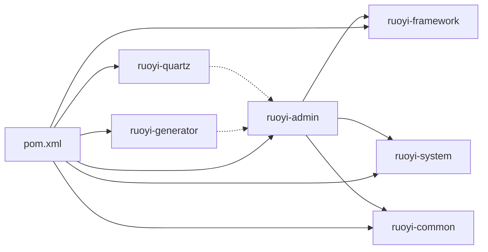

# 开发指南

<cite>
**本文引用的文件**
- [pom.xml](file://pom.xml)
- [RuoYiApplication.java](file://ruoyi-admin/src/main/java/com/ruoyi/RuoYiApplication.java)
- [application.yml](file://ruoyi-admin/src/main/resources/application.yml)
- [AjaxResult.java](file://ruoyi-common/src/main/java/com/ruoyi/common/core/domain/AjaxResult.java)
- [StringUtils.java](file://ruoyi-common/src/main/java/com/ruoyi/common/utils/StringUtils.java)
- [PageDomain.java](file://ruoyi-common/src/main/java/com/ruoyi/common/core/page/PageDomain.java)
- [TableDataInfo.java](file://ruoyi-common/src/main/java/com/ruoyi/common/core/page/TableDataInfo.java)
- [TableSupport.java](file://ruoyi-common/src/main/java/com/ruoyi/common/core/page/TableSupport.java)
- [PageUtils.java](file://ruoyi-common/src/main/java/com/ruoyi/common/utils/PageUtils.java)
- [BaseController.java](file://ruoyi-common/src/main/java/com/ruoyi/common/core/controller/BaseController.java)
- [SysUserController.java](file://ruoyi-admin/src/main/java/com/ruoyi/web/controller/system/SysUserController.java)
- [Constants.java](file://ruoyi-common/src/main/java/com/ruoyi/common/constant/Constants.java)
- [SqlUtil.java](file://ruoyi-common/src/main/java/com/ruoyi/common/utils/sql/SqlUtil.java)
- [ServletUtils.java](file://ruoyi-common/src/main/java/com/ruoyi/common/utils/ServletUtils.java)
- [StrFormatter.java](file://ruoyi-common/src/main/java/com/ruoyi/common/core/text/StrFormatter.java)
- [README.md](file://README.md)
</cite>

## 目录
1. [简介](#简介)
2. [项目结构](#项目结构)
3. [核心组件](#核心组件)
4. [架构总览](#架构总览)
5. [详细组件分析](#详细组件分析)
6. [依赖分析](#依赖分析)
7. [性能考虑](#性能考虑)
8. [故障排查指南](#故障排查指南)
9. [结论](#结论)
10. [附录](#附录)

## 简介
本指南面向RuoYi系统的开发者，提供从代码规范、最佳实践到工具类使用、环境搭建、扩展开发、代码审查、性能优化与常见陷阱的完整参考。文档以仓库中的实际代码为依据，结合模块化结构与典型控制器示例，帮助快速上手并高质量交付。

## 项目结构
RuoYi采用多模块Maven工程组织，核心模块包括：
- ruoyi-admin：Web应用入口与前端模板资源
- ruoyi-common：通用工具、常量、分页与统一响应体
- ruoyi-framework：安全、拦截、配置、异常处理等基础设施
- ruoyi-system：系统业务模块（用户、角色、菜单、字典等）
- ruoyi-quartz：定时任务模块
- ruoyi-generator：代码生成模块

图表来源
- [pom.xml:235-242](file://pom.xml#L235-L242)
- [RuoYiApplication.java:12](file://ruoyi-admin/src/main/java/com/ruoyi/RuoYiApplication.java#L12)

章节来源
- [pom.xml:235-242](file://pom.xml#L235-L242)
- [README.md:1-2](file://README.md#L1-L2)

## 核心组件
本节聚焦于开发中最常用的三类组件：统一响应体、字符串工具与分页组件，并给出使用场景与最佳实践。

- 统一响应体 AjaxResult
  - 作用：封装接口返回的统一结构（状态码、消息、数据），便于前端一致处理
  - 关键点：提供SUCCESS/WARN/ERROR三类枚举；支持链式put扩展；内置isSuccess/isWarn/isError判断
  - 使用场景：所有REST接口返回统一格式；错误/警告/成功分支清晰
  - 参考实现路径：[AjaxResult.java:12-228](file://ruoyi-common/src/main/java/com/ruoyi/common/core/domain/AjaxResult.java#L12-L228)

- 字符串工具 StringUtils
  - 作用：提供判空、截取、隐藏、驼峰/下划线互转、Ant风格匹配、填充等高频能力
  - 关键点：继承Apache Commons Lang3，扩展NVL、AntPathMatcher匹配、大小写转换等
  - 使用场景：参数校验、日志格式化、路径匹配、脱敏展示
  - 参考实现路径：[StringUtils.java:18-715](file://ruoyi-common/src/main/java/com/ruoyi/common/utils/StringUtils.java#L18-L715)

- 分页组件
  - PageDomain：封装pageNum、pageSize、orderByColumn、isAsc、reasonable等分页参数
  - TableSupport：从请求参数构建PageDomain
  - PageUtils：启动分页、清理线程变量，集成PageHelper
  - TableDataInfo：表格分页返回对象（total、rows、code、msg）
  - 使用场景：后台列表查询、导出、分页排序
  - 参考实现路径：
    - [PageDomain.java:10-90](file://ruoyi-common/src/main/java/com/ruoyi/common/core/page/PageDomain.java#L10-L90)
    - [TableSupport.java:11-57](file://ruoyi-common/src/main/java/com/ruoyi/common/core/page/TableSupport.java#L11-L57)
    - [PageUtils.java:13-36](file://ruoyi-common/src/main/java/com/ruoyi/common/utils/PageUtils.java#L13-L36)
    - [TableDataInfo.java:11-85](file://ruoyi-common/src/main/java/com/ruoyi/common/core/page/TableDataInfo.java#L11-L85)

章节来源
- [AjaxResult.java:12-228](file://ruoyi-common/src/main/java/com/ruoyi/common/core/domain/AjaxResult.java#L12-L228)
- [StringUtils.java:18-715](file://ruoyi-common/src/main/java/com/ruoyi/common/utils/StringUtils.java#L18-L715)
- [PageDomain.java:10-90](file://ruoyi-common/src/main/java/com/ruoyi/common/core/page/PageDomain.java#L10-L90)
- [TableSupport.java:11-57](file://ruoyi-common/src/main/java/com/ruoyi/common/core/page/TableSupport.java#L11-L57)
- [PageUtils.java:13-36](file://ruoyi-common/src/main/java/com/ruoyi/common/utils/PageUtils.java#L13-L36)
- [TableDataInfo.java:11-85](file://ruoyi-common/src/main/java/com/ruoyi/common/core/page/TableDataInfo.java#L11-L85)

## 架构总览
RuoYi采用“控制器-服务-持久层”三层架构，配合统一响应体、分页与安全框架，形成稳定可扩展的开发骨架。

图表来源
- [BaseController.java:33-230](file://ruoyi-common/src/main/java/com/ruoyi/common/core/controller/BaseController.java#L33-L230)
- [SysUserController.java:43-357](file://ruoyi-admin/src/main/java/com/ruoyi/web/controller/system/SysUserController.java#L43-L357)
- [ServletUtils.java:23-233](file://ruoyi-common/src/main/java/com/ruoyi/common/utils/ServletUtils.java#L23-L233)
- [SqlUtil.java:11-72](file://ruoyi-common/src/main/java/com/ruoyi/common/utils/sql/SqlUtil.java#L11-L72)

## 详细组件分析

### AjaxResult 统一响应体
- 设计要点
  - 继承HashMap，键名常量CODE_TAG、MSG_TAG、DATA_TAG统一约定
  - Type枚举区分SUCCESS/WARN/ERROR，便于前端分支处理
  - 提供success/error/warn静态工厂方法与toAjax便捷方法
  - 支持链式put扩展，便于追加业务字段
- 使用建议
  - 所有接口返回统一通过AjaxResult或其静态工厂方法
  - 错误/警告需携带明确msg；成功可选带data
  - 复杂场景在data中返回嵌套结构，保持前后端契约稳定

图表来源
- [AjaxResult.java:12-228](file://ruoyi-common/src/main/java/com/ruoyi/common/core/domain/AjaxResult.java#L12-L228)

章节来源
- [AjaxResult.java:12-228](file://ruoyi-common/src/main/java/com/ruoyi/common/core/domain/AjaxResult.java#L12-L228)

### StringUtils 字符串工具
- 设计要点
  - 继承Commons Lang3，扩展判空、截取、隐藏、大小写转换、Ant匹配、填充等
  - 提供nvl、hide、substring、toUnderScoreCase、toCamelCase、matches、padl等
  - 与StrFormatter配合实现占位符格式化
- 使用建议
  - 参数校验优先使用isEmpty/isNotNull
  - 路径/URL匹配使用ishttp与AntPathMatcher
  - 日志/提示信息格式化使用format，避免手动拼接

图表来源
- [StringUtils.java:18-715](file://ruoyi-common/src/main/java/com/ruoyi/common/utils/StringUtils.java#L18-L715)
- [StrFormatter.java:10-93](file://ruoyi-common/src/main/java/com/ruoyi/common/core/text/StrFormatter.java#L10-L93)

章节来源
- [StringUtils.java:18-715](file://ruoyi-common/src/main/java/com/ruoyi/common/utils/StringUtils.java#L18-L715)
- [StrFormatter.java:10-93](file://ruoyi-common/src/main/java/com/ruoyi/common/core/text/StrFormatter.java#L10-L93)

### 分页组件与表格数据模型
- 设计要点
  - PageDomain封装分页参数，支持驼峰列名转下划线与排序方向
  - TableSupport从请求参数构建PageDomain
  - PageUtils启动分页并设置合理化参数，SqlUtil对orderBy进行安全校验
  - BaseController统一处理分页与响应封装，getDataTable返回TableDataInfo
- 使用建议
  - 控制器中先调用startPage，再查询列表，最后getDataTable
  - 排序字段必须来自受控白名单，避免SQL注入
  - 合理设置reasonable，避免越界分页

图表来源
- [SysUserController.java:72-79](file://ruoyi-admin/src/main/java/com/ruoyi/web/controller/system/SysUserController.java#L72-L79)
- [BaseController.java:57-118](file://ruoyi-common/src/main/java/com/ruoyi/common/core/controller/BaseController.java#L57-L118)
- [PageUtils.java:18-26](file://ruoyi-common/src/main/java/com/ruoyi/common/utils/PageUtils.java#L18-L26)
- [TableSupport.java:41-55](file://ruoyi-common/src/main/java/com/ruoyi/common/core/page/TableSupport.java#L41-L55)
- [TableDataInfo.java:11-85](file://ruoyi-common/src/main/java/com/ruoyi/common/core/page/TableDataInfo.java#L11-L85)

章节来源
- [PageDomain.java:10-90](file://ruoyi-common/src/main/java/com/ruoyi/common/core/page/PageDomain.java#L10-L90)
- [TableSupport.java:11-57](file://ruoyi-common/src/main/java/com/ruoyi/common/core/page/TableSupport.java#L11-L57)
- [PageUtils.java:13-36](file://ruoyi-common/src/main/java/com/ruoyi/common/utils/PageUtils.java#L13-L36)
- [TableDataInfo.java:11-85](file://ruoyi-common/src/main/java/com/ruoyi/common/core/page/TableDataInfo.java#L11-L85)
- [BaseController.java:33-230](file://ruoyi-common/src/main/java/com/ruoyi/common/core/controller/BaseController.java#L33-L230)
- [SysUserController.java:43-357](file://ruoyi-admin/src/main/java/com/ruoyi/web/controller/system/SysUserController.java#L43-L357)

### BaseController 分页与响应封装
- 设计要点
  - startPage/startOrderBy/clearPage统一分页生命周期
  - getDataTable封装TableDataInfo，简化列表响应
  - toAjax将影响行数或布尔结果映射为成功/失败
  - 提供request/response/session与用户上下文便捷方法
- 使用建议
  - 所有列表接口继承BaseController，复用分页与响应逻辑
  - 对外暴露的JSON接口统一返回AjaxResult或TableDataInfo

章节来源
- [BaseController.java:33-230](file://ruoyi-common/src/main/java/com/ruoyi/common/core/controller/BaseController.java#L33-L230)

## 依赖分析
- 模块依赖
  - ruoyi-admin依赖ruoyi-framework、ruoyi-system、ruoyi-common
  - ruoyi-quartz与ruoyi-generator作为独立模块，通过ruoyi-admin间接使用
- 核心依赖
  - Spring Boot、Shiro、PageHelper、Swagger、Druid、POI、Yauaa、OSHI等版本在父POM中集中管理

图表来源
- [pom.xml:235-242](file://pom.xml#L235-L242)

章节来源
- [pom.xml:40-233](file://pom.xml#L40-L233)

## 性能考虑
- 分页与排序
  - 使用PageUtils启动分页，避免一次性加载全量数据
  - 排序字段经SqlUtil校验，限制长度与字符集，防止注入与超长排序
- 安全与校验
  - SqlUtil对orderBy与通用输入进行关键字过滤
  - XSS/CSRF在配置中启用，建议按需调整白名单
- 并发与线程
  - PageHelper使用ThreadLocal存储分页上下文，务必在请求结束时清理（clearPage）

章节来源
- [PageUtils.java:18-36](file://ruoyi-common/src/main/java/com/ruoyi/common/utils/PageUtils.java#L18-L36)
- [SqlUtil.java:31-71](file://ruoyi-common/src/main/java/com/ruoyi/common/utils/sql/SqlUtil.java#L31-L71)
- [application.yml:125-140](file://ruoyi-admin/src/main/resources/application.yml#L125-L140)

## 故障排查指南
- 常见问题定位
  - AjaxResult返回错误：检查控制器是否正确使用error/success/warn工厂方法
  - 分页异常：确认请求参数pageNum/pageSize/orderByColumn/isAsc是否合法
  - SQL注入告警：核对排序字段是否通过SqlUtil.escapeOrderBySql
  - XSS/CSRF：检查application.yml中对应开关与白名单配置
- 工具辅助
  - ServletUtils.isAjaxRequest用于识别AJAX请求
  - Constants中定义了HTTP/HTTPS前缀常量，便于URL校验

章节来源
- [ServletUtils.java:137-159](file://ruoyi-common/src/main/java/com/ruoyi/common/utils/ServletUtils.java#L137-L159)
- [Constants.java:28-36](file://ruoyi-common/src/main/java/com/ruoyi/common/constant/Constants.java#L28-L36)
- [SqlUtil.java:31-71](file://ruoyi-common/src/main/java/com/ruoyi/common/utils/sql/SqlUtil.java#L31-L71)

## 结论
通过统一响应体、完备的字符串工具与健壮的分页体系，RuoYi为业务开发提供了高一致性与低复杂度的支撑。遵循本文的规范与最佳实践，可在保证安全性与性能的前提下高效扩展模块、集成第三方能力。

## 附录

### 开发环境搭建与调试
- 环境要求
  - JDK 1.8、Maven、IDE（推荐IntelliJ IDEA）
- 启动步骤
  - 使用RuoYiApplication.main启动
  - 访问本地端口（默认80），根据application.yml调整
- 调试技巧
  - 在BaseController的initBinder中设置断点，观察日期转换
  - 在SysUserController的列表接口断点，跟踪分页与响应封装
- 单元测试
  - 建议针对工具类（StringUtils、SqlUtil）编写边界与异常场景测试
  - 针对分页逻辑编写Mock测试，覆盖合理化与排序校验

章节来源
- [RuoYiApplication.java:12-29](file://ruoyi-admin/src/main/java/com/ruoyi/RuoYiApplication.java#L12-L29)
- [application.yml:16-70](file://ruoyi-admin/src/main/resources/application.yml#L16-L70)
- [BaseController.java:40-52](file://ruoyi-common/src/main/java/com/ruoyi/common/core/controller/BaseController.java#L40-L52)

### 功能扩展与插件机制
- 新模块开发
  - 新建模块（如ruoyi-demo-module），在父POM中注册为module
  - 在ruoyi-admin中新增路由与菜单，控制器继承BaseController
- 插件机制
  - 可通过配置中心或动态Bean注册扩展点（结合Spring Boot特性）
- 第三方集成
  - 在application.yml中新增配置项，通过@ConfigurationProperties绑定
  - 注意安全校验与异常处理，确保与SqlUtil/ServletUtils等工具协同

章节来源
- [pom.xml:235-242](file://pom.xml#L235-L242)
- [application.yml:141-154](file://ruoyi-admin/src/main/resources/application.yml#L141-L154)

### 代码规范与最佳实践
- 命名约定
  - 类名：帕斯卡命名；方法/字段：驼峰；常量：全大写+下划线
  - 控制器：SysUserController；服务：ISysUserService；实体：SysUser
- 注释标准
  - 类/方法使用Javadoc，简述职责与参数/返回
  - 关键逻辑补充注释，尤其是安全校验与边界条件
- 架构设计原则
  - 分层清晰：控制器仅编排，服务负责业务，持久层专注数据
  - 统一异常与响应：通过BaseController与AjaxResult收敛
  - 安全优先：输入校验、SQL过滤、XSS/CSRF防护

章节来源
- [SysUserController.java:38-46](file://ruoyi-admin/src/main/java/com/ruoyi/web/controller/system/SysUserController.java#L38-L46)
- [BaseController.java:28-33](file://ruoyi-common/src/main/java/com/ruoyi/common/core/controller/BaseController.java#L28-L33)

### 代码审查要点
- 响应一致性：是否全部使用AjaxResult/DataTable封装
- 安全性：排序字段是否经SqlUtil校验；输入是否过滤敏感词
- 分页健壮性：pageNum/pageSize是否合理化；orderBy长度限制
- 可读性：方法粒度适中，注释清晰，异常处理明确

章节来源
- [SqlUtil.java:31-71](file://ruoyi-common/src/main/java/com/ruoyi/common/utils/sql/SqlUtil.java#L31-L71)
- [PageUtils.java:18-26](file://ruoyi-common/src/main/java/com/ruoyi/common/utils/PageUtils.java#L18-L26)
- [BaseController.java:110-140](file://ruoyi-common/src/main/java/com/ruoyi/common/core/controller/BaseController.java#L110-L140)