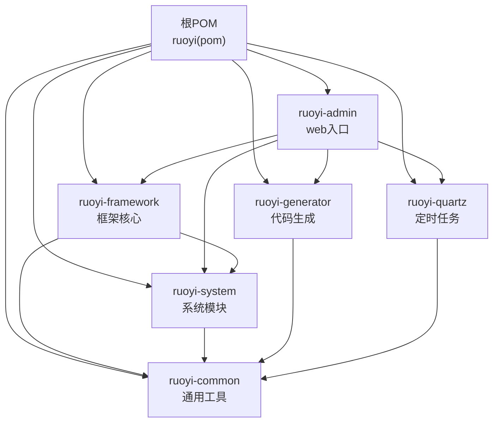
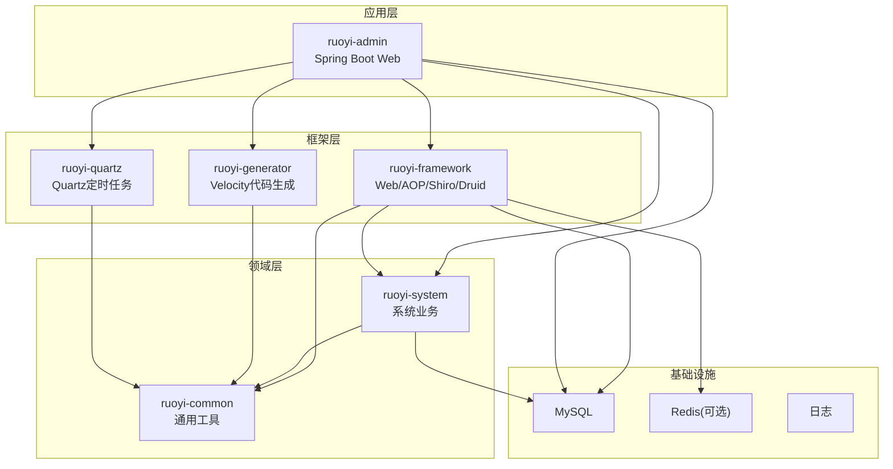
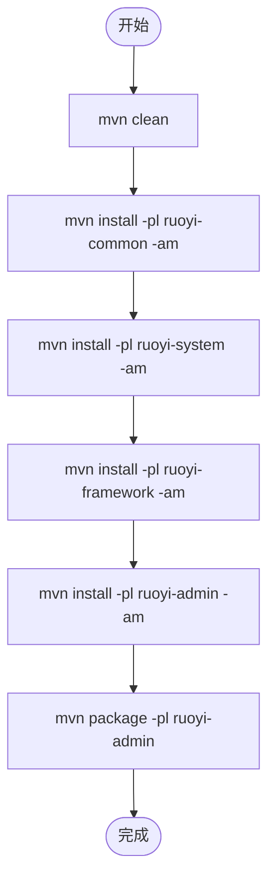
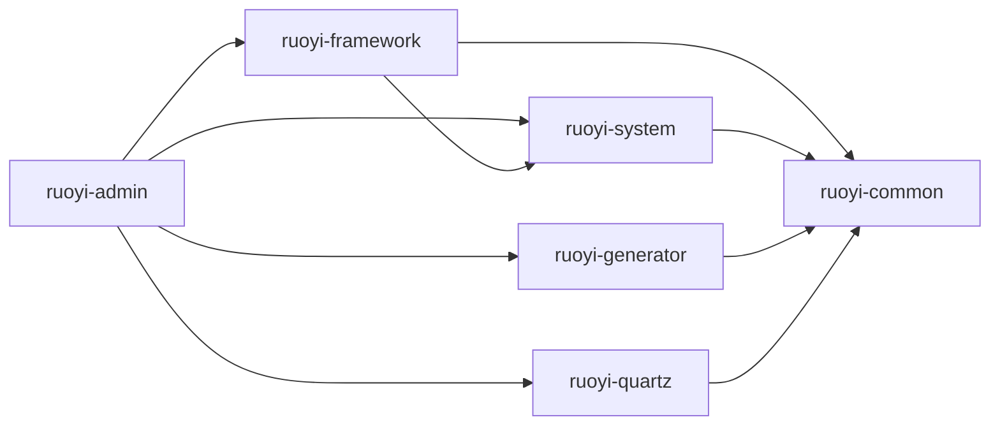

# 开发环境搭建

<cite>
**本文引用的文件列表**
- [根POM文件](file://pom.xml)
- [ruoyi-admin模块POM](file://ruoyi-admin/pom.xml)
- [ruoyi-framework模块POM](file://ruoyi-framework/pom.xml)
- [ruoyi-system模块POM](file://ruoyi-system/pom.xml)
- [ruoyi-common模块POM](file://ruoyi-common/pom.xml)
- [ruoyi-quartz模块POM](file://ruoyi-quartz/pom.xml)
- [ruoyi-generator模块POM](file://ruoyi-generator/pom.xml)
- [ruoyi-admin应用配置](file://ruoyi-admin/src/main/resources/application.yml)
- [ruoyi-admin启动类](file://ruoyi-admin/src/main/java/com/ruoyi/RuoYiApplication.java)
- [数据库初始化SQL-主库](file://sql/ry_20260319.sql)
- [数据库初始化SQL-定时任务](file://sql/quartz.sql)
- [Windows运行脚本](file://bin/run.bat)
- [Windows打包脚本](file://bin/package.bat)
- [Windows清理脚本](file://bin/clean.bat)
- [Linux运行脚本](file://ry.sh)
- [.gitignore文件](file://.gitignore)
</cite>

## 目录
1. [简介](#简介)
2. [项目结构](#项目结构)
3. [核心组件](#核心组件)
4. [架构总览](#架构总览)
5. [详细组件分析](#详细组件分析)
6. [依赖关系分析](#依赖关系分析)
7. [性能考虑](#性能考虑)
8. [故障排查指南](#故障排查指南)
9. [结论](#结论)
10. [附录](#附录)

## 简介
本指南面向首次接触RuoYi系统的开发者，提供从零开始的开发环境搭建步骤，覆盖JDK、Maven、MySQL等必需软件的安装和配置步骤。提供IDE（IntelliJ IDEA/Eclipse/VS Code）的项目导入和配置方法，包括插件推荐和代码模板设置。解释Maven多模块项目的构建流程和依赖管理。提供数据库初始化脚本的执行步骤和配置文件的修改方法。包含常见环境问题的解决方案和性能调优建议。说明热部署配置和调试模式的设置方法。

## 项目结构
RuoYi采用标准的Maven多模块工程组织：
- 父POM统一管理版本、依赖与插件
- 子模块按功能拆分：web入口、框架核心、系统模块、定时任务、代码生成、通用工具
- ruoyi-admin作为Spring Boot可执行应用入口，聚合其他模块并打包为可运行产物

**图表来源**
- [根POM文件:235-242](file://pom.xml#L235-L242)
- [ruoyi-admin模块POM:45-61](file://ruoyi-admin/pom.xml#L45-L61)
- [ruoyi-framework模块POM:68-72](file://ruoyi-framework/pom.xml#L68-L72)
- [ruoyi-system模块POM:18-24](file://ruoyi-system/pom.xml#L18-L24)
- [ruoyi-quartz模块POM:18-36](file://ruoyi-quartz/pom.xml#L18-L36)
- [ruoyi-generator模块POM:18-36](file://ruoyi-generator/pom.xml#L18-L36)
- [ruoyi-common模块POM:18-96](file://ruoyi-common/pom.xml#L18-L96)

**章节来源**
- [根POM文件:235-242](file://pom.xml#L235-L242)
- [ruoyi-admin模块POM:18-63](file://ruoyi-admin/pom.xml#L18-L63)
- [ruoyi-framework模块POM:18-74](file://ruoyi-framework/pom.xml#L18-L74)
- [ruoyi-system模块POM:18-26](file://ruoyi-system/pom.xml#L18-L26)
- [ruoyi-common模块POM:18-96](file://ruoyi-common/pom.xml#L18-L96)
- [ruoyi-quartz模块POM:18-36](file://ruoyi-quartz/pom.xml#L18-L36)
- [ruoyi-generator模块POM:18-36](file://ruoyi-generator/pom.xml#L18-L36)

## 核心组件
- JDK与Maven
  - Java版本：1.8（见根POM属性）
  - Maven：使用Maven 3.6+（由Spring Boot 2.5.x要求推断）
- 数据库
  - MySQL Connector/J：由ruoyi-admin引入
  - 初始化脚本：主库与定时任务脚本
- Web与安全
  - Spring Boot Starter Web、Thymeleaf、Swagger3、Shiro、Druid
- 定时任务与代码生成
  - Quartz、Velocity、PageHelper、Fastjson、POI、Yauaa等

**章节来源**
- [根POM文件:14-37](file://pom.xml#L14-L37)
- [ruoyi-admin模块POM:39-43](file://ruoyi-admin/pom.xml#L39-L43)
- [ruoyi-admin应用配置:1-154](file://ruoyi-admin/src/main/resources/application.yml#L1-L154)

## 架构总览
RuoYi采用"多模块聚合+独立可运行"的架构。ruoyi-admin作为Spring Boot应用入口，通过依赖聚合其他模块；数据库连接由Druid连接池管理；Shiro负责认证授权；Swagger提供接口文档；定时任务模块基于Quartz；代码生成模块基于Velocity模板。

**图表来源**
- [根POM文件:235-242](file://pom.xml#L235-L242)
- [ruoyi-admin模块POM:45-61](file://ruoyi-admin/pom.xml#L45-L61)
- [ruoyi-framework模块POM:68-72](file://ruoyi-framework/pom.xml#L68-L72)
- [ruoyi-system模块POM:18-24](file://ruoyi-system/pom.xml#L18-L24)
- [ruoyi-quartz模块POM:18-36](file://ruoyi-quartz/pom.xml#L18-L36)
- [ruoyi-generator模块POM:18-36](file://ruoyi-generator/pom.xml#L18-L36)
- [ruoyi-common模块POM:18-96](file://ruoyi-common/pom.xml#L18-L96)

## 详细组件分析

### JDK与Maven安装与配置
- JDK
  - Java版本要求：1.8（见根POM属性）
  - 建议使用JDK 8u200+或对应版本，确保与Spring Boot 2.5.x兼容
- Maven
  - 使用Maven 3.6+（Spring Boot 2.5.x推荐）
  - 配置国内镜像仓库（根POM已配置阿里云公共仓库）
- 验证
  - 打开终端执行：java -version、mvn -version

**章节来源**
- [根POM文件:14-37](file://pom.xml#L14-L37)

### MySQL安装与配置
- 安装
  - 安装MySQL 5.7+或8.0（根据实际环境选择）
- 创建数据库与用户
  - 建议创建数据库名为ruoyi（字符集utf8mb4）
  - 创建用户并授权（示例：用户名ruoyi，密码ruoyi）
- 初始化脚本
  - 主库初始化：执行sql/ry_20260319.sql
  - 定时任务初始化：执行sql/quartz.sql
- 注意
  - 若使用非root用户，请确保具备CREATE、ALTER、DROP、INSERT、UPDATE、DELETE、SELECT等权限

**章节来源**
- [数据库初始化SQL-主库:1-20](file://sql/ry_20260319.sql#L1-L20)
- [数据库初始化SQL-定时任务:1-20](file://sql/quartz.sql#L1-L20)

### IDE导入与配置（IntelliJ IDEA/Eclipse/VS Code）

#### IntelliJ IDEA
- 导入方式
  - File -> Open -> 选择根POM文件（pom.xml）
  - 选择"Use plugin registry"或"Import project from external model"选择Maven
- 项目结构
  - 展示为多模块工程，模块包含ruoyi-admin、ruoyi-framework、ruoyi-system、ruoyi-quartz、ruoyi-generator、ruoyi-common
- SDK与语言级别
  - Project SDK选择JDK 1.8
  - Language Level设为8
- Maven设置
  - Settings -> Build Tools -> Maven
  - 选择本地Maven仓库与settings.xml（若需使用私有仓库）
- 插件推荐
  - Lombok（简化实体类）
  - MyBatis Log Plugin（查看MyBatis SQL）
  - Rainbow Brackets（括号配对高亮）
  - String Manipulation（字符串处理）
- 代码模板
  - File -> Settings -> Editor -> Live Templates
  - 可添加常用快捷模板（如lombok注解、常用日志、异常抛出等）
- 运行配置
  - Run/Debug Configurations -> Spring Boot
  - Main class选择RuoYiApplication
  - VM Options可设置-Dfile.encoding=UTF-8等

#### Eclipse
- 导入方式
  - File -> Import -> Maven -> Existing Maven Projects
  - Browse选择根目录，勾选所有模块
- SDK与编码
  - Project Properties -> Java Build Path -> Libraries -> Modulepath/Classpath选择JDK 1.8
  - Project Properties -> Resource -> Text file encoding设为UTF-8
- 插件推荐
  - Lombok Agent
  - Mylyn（任务管理）
  - m2eclipse（Maven支持）
- 代码模板
  - Preferences -> Java -> Editor -> Templates
  - 添加常用模板（如lombok注解、日志、异常等）

#### VS Code
- 导入方式
  - 打开项目根目录，VS Code会自动检测Maven项目结构
  - 安装推荐插件：Spring Boot Extension Pack、Language Support for Java(TM) by Red Hat、Apache Maven for Java、Project Manager for Java
- 项目结构
  - VS Code将显示为多模块工程，包含所有子模块
- SDK与语言级别
  - 在.settings文件夹中配置JDK 1.8
  - 语言级别设为8
- Maven设置
  - VS Code内置Maven支持，无需额外配置
  - 可在设置中配置Maven路径和用户设置文件
- 插件推荐
  - Spring Boot Extension Pack（Spring Boot支持）
  - Language Support for Java(TM) by Red Hat（Java语言支持）
  - Apache Maven for Java（Maven支持）
  - Project Manager for Java（项目管理）
  - Lombok Annotations Support for VS Code（Lombok支持）
- 代码模板
  - VS Code内置Live Templates功能
  - 可通过扩展添加更多模板
- 运行配置
  - 使用Spring Boot Dashboard运行应用
  - 或通过终端执行mvn spring-boot:run命令
- .vscode目录忽略配置
  - 项目已包含.vscode目录忽略规则，确保VS Code特定配置不会提交到版本控制
  - 忽略规则位于.gitignore文件第38-39行

**更新** 新增VS Code开发环境配置说明，包括插件推荐、运行配置和.gitignore中的.vscode忽略规则

**章节来源**
- [根POM文件:14-37](file://pom.xml#L14-L37)
- [ruoyi-admin启动类:12-17](file://ruoyi-admin/src/main/java/com/ruoyi/RuoYiApplication.java#L12-L17)
- [.gitignore文件:38-39](file://.gitignore#L38-L39)

### Maven多模块构建流程与依赖管理
- 构建顺序
  - 先构建ruoyi-common，再构建ruoyi-system，然后ruoyi-framework，最后ruoyi-admin
  - ruoyi-quartz与ruoyi-generator作为可选模块，按需构建
- 关键依赖
  - ruoyi-admin依赖ruoyi-framework、ruoyi-system、ruoyi-quartz、ruoyi-generator
  - ruoyi-framework依赖ruoyi-system与ruoyi-common
  - ruoyi-system依赖ruoyi-common
  - ruoyi-generator与ruoyi-quartz依赖ruoyi-common
- 依赖版本统一
  - 父POM通过dependencyManagement集中管理版本，避免冲突
- 打包
  - ruoyi-admin使用spring-boot-maven-plugin进行repackage，生成可执行jar/war
  - war打包需设置failOnMissingWebXml=false

**图表来源**
- [根POM文件:235-242](file://pom.xml#L235-L242)
- [ruoyi-admin模块POM:65-81](file://ruoyi-admin/pom.xml#L65-L81)

**章节来源**
- [根POM文件:40-232](file://pom.xml#L40-L232)
- [ruoyi-admin模块POM:18-63](file://ruoyi-admin/pom.xml#L18-L63)
- [ruoyi-framework模块POM:18-74](file://ruoyi-framework/pom.xml#L18-L74)
- [ruoyi-system模块POM:18-26](file://ruoyi-system/pom.xml#L18-L26)
- [ruoyi-common模块POM:18-96](file://ruoyi-common/pom.xml#L18-L96)
- [ruoyi-quartz模块POM:18-36](file://ruoyi-quartz/pom.xml#L18-L36)
- [ruoyi-generator模块POM:18-36](file://ruoyi-generator/pom.xml#L18-L36)

### 数据库初始化与配置文件修改
- 初始化步骤
  - 创建数据库ruoyi（字符集utf8mb4）
  - 执行sql/ry_20260319.sql初始化主库数据
  - 执行sql/quartz.sql初始化定时任务相关表
- 配置文件修改
  - ruoyi-admin/src/main/resources/application.yml中修改数据库连接信息（url、username、password）
  - 如需启用Druid监控，可参考application-druid.yml（文件存在但未在父POM中声明profiles.active）
  - 文件上传路径ruoyi.profile需根据实际环境调整
  - Swagger.enabled可根据需要开启/关闭
- 验证
  - 启动应用后访问Swagger接口文档（若启用）或访问首页确认数据库连通性

**章节来源**
- [ruoyi-admin应用配置:1-154](file://ruoyi-admin/src/main/resources/application.yml#L1-L154)
- [数据库初始化SQL-主库:1-20](file://sql/ry_20260319.sql#L1-L20)
- [数据库初始化SQL-定时任务:1-20](file://sql/quartz.sql#L1-L20)

### 热部署与调试模式设置
- 热部署
  - 使用Spring Boot DevTools（在各模块添加依赖）
  - 修改代码后自动重启，适用于快速迭代
- 调试模式
  - IntelliJ IDEA：Run/Debug Configurations -> VM Options添加-Dfile.encoding=UTF-8等
  - Eclipse：在Debug Configurations中设置VM Arguments
  - VS Code：通过launch.json配置调试参数
- 日志级别
  - application.yml中可调整com.ruoyi、org.springframework等包的日志级别
- 端口与上下文
  - server.port、server.servlet.context-path可按需修改

**章节来源**
- [ruoyi-admin应用配置:16-33](file://ruoyi-admin/src/main/resources/application.yml#L16-L33)
- [ruoyi-admin模块POM:18-63](file://ruoyi-admin/pom.xml#L18-L63)

## 依赖关系分析
- 模块间依赖
  - ruoyi-admin -> ruoyi-framework、ruoyi-system、ruoyi-quartz、ruoyi-generator
  - ruoyi-framework -> ruoyi-system、ruoyi-common
  - ruoyi-system -> ruoyi-common
  - ruoyi-generator、ruoyi-quartz -> ruoyi-common
- 外部依赖
  - Spring Boot 2.5.15、Shiro 1.13.0、Druid 1.2.28、Swagger3、PageHelper、Fastjson、POI、Yauaa等
- 版本控制
  - 父POM通过dependencyManagement集中管理，避免版本漂移

**图表来源**
- [根POM文件:235-242](file://pom.xml#L235-L242)
- [ruoyi-admin模块POM:45-61](file://ruoyi-admin/pom.xml#L45-L61)
- [ruoyi-framework模块POM:68-72](file://ruoyi-framework/pom.xml#L68-L72)
- [ruoyi-system模块POM:18-24](file://ruoyi-system/pom.xml#L18-L24)
- [ruoyi-quartz模块POM:18-36](file://ruoyi-quartz/pom.xml#L18-L36)
- [ruoyi-generator模块POM:18-36](file://ruoyi-generator/pom.xml#L18-L36)
- [ruoyi-common模块POM:18-96](file://ruoyi-common/pom.xml#L18-L96)

**章节来源**
- [根POM文件:40-232](file://pom.xml#L40-L232)
- [ruoyi-admin模块POM:18-63](file://ruoyi-admin/pom.xml#L18-L63)
- [ruoyi-framework模块POM:18-74](file://ruoyi-framework/pom.xml#L18-L74)
- [ruoyi-system模块POM:18-26](file://ruoyi-system/pom.xml#L18-L26)
- [ruoyi-common模块POM:18-96](file://ruoyi-common/pom.xml#L18-L96)
- [ruoyi-quartz模块POM:18-36](file://ruoyi-quartz/pom.xml#L18-L36)
- [ruoyi-generator模块POM:18-36](file://ruoyi-generator/pom.xml#L18-L36)

## 性能考虑
- 数据库连接池
  - 使用Druid连接池，合理配置初始化大小、最小空闲、最大活跃等参数
- 定时任务
  - Quartz并发策略与执行策略需结合业务场景调整
- 缓存
  - 可结合Redis实现会话与热点数据缓存（若启用）
- 日志
  - 生产环境建议降低日志级别，避免I/O瓶颈
- 前端静态资源
  - 可启用压缩插件（注释掉的YUI Compressor示例在ruoyi-admin中存在）

**章节来源**
- [ruoyi-admin模块POM:82-123](file://ruoyi-admin/pom.xml#L82-L123)
- [ruoyi-framework模块POM:32-36](file://ruoyi-framework/pom.xml#L32-L36)

## 故障排查指南
- 启动失败（端口占用）
  - 修改application.yml中的server.port为未被占用端口
- 数据库连接失败
  - 检查application.yml中的数据库URL、用户名、密码
  - 确认MySQL服务已启动且网络可达
- 初始化失败
  - 确认执行了主库与定时任务两个SQL脚本
  - 检查字符集与排序规则是否正确
- Swagger不可用
  - 确认swagger.enabled=true且未被拦截器屏蔽
- 热部署无效
  - 确认DevTools依赖已添加且IDE已启用自动编译
- Maven构建失败
  - 清理缓存：mvn clean
  - 更新依赖：mvn dependency:resolve
  - 检查网络与Maven镜像配置
- VS Code无法识别项目
  - 确保已安装Spring Boot Extension Pack和Language Support for Java插件
  - 重新加载窗口以重新检测项目结构

**章节来源**
- [ruoyi-admin应用配置:16-154](file://ruoyi-admin/src/main/resources/application.yml#L16-L154)
- [根POM文件:265-288](file://pom.xml#L265-L288)

## 结论
通过以上步骤，您可以在本地成功搭建RuoYi的开发环境。建议优先完成JDK/Maven/MySQL的安装与配置，随后导入IDE并执行数据库初始化脚本，最后启动ruoyi-admin验证环境。后续可按需启用热部署、调整日志级别与性能参数，逐步完善开发与调试体验。新增的VS Code支持为开发者提供了更多的IDE选择，配合.gitignore中的.vscode忽略规则，可以更好地管理开发环境配置。

## 附录

### 快速运行脚本
- Windows
  - 运行：bin\run.bat
  - 打包：bin\package.bat
  - 清理：bin\clean.bat
- Linux
  - 运行：./ry.sh

**章节来源**
- [Windows运行脚本](file://bin/run.bat)
- [Windows打包脚本](file://bin/package.bat)
- [Windows清理脚本](file://bin/clean.bat)
- [Linux运行脚本](file://ry.sh)