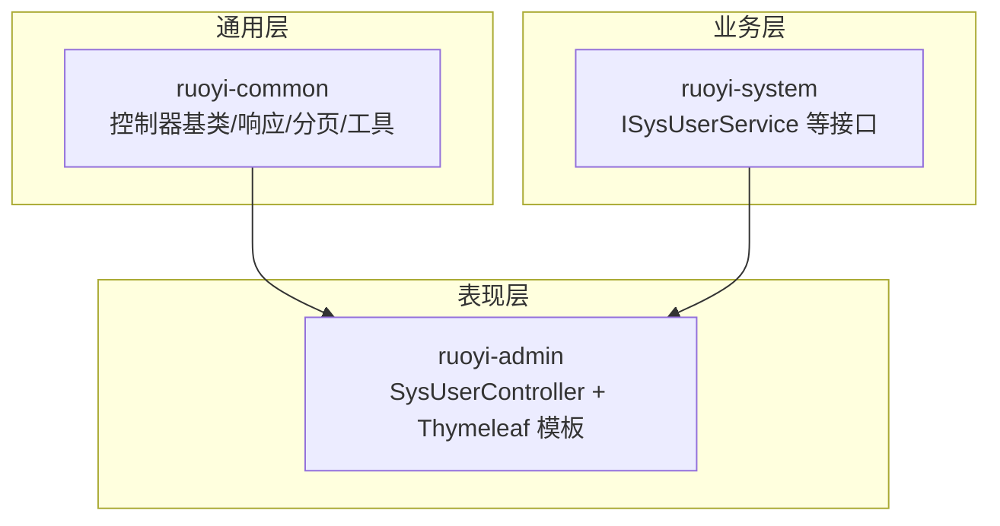
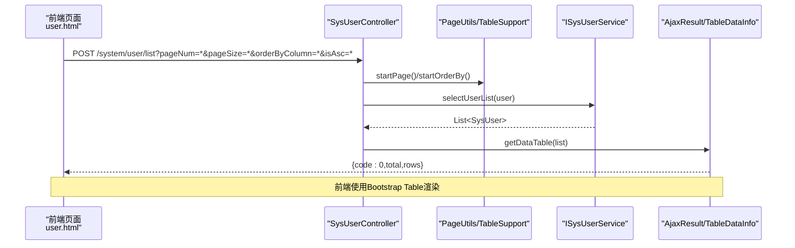
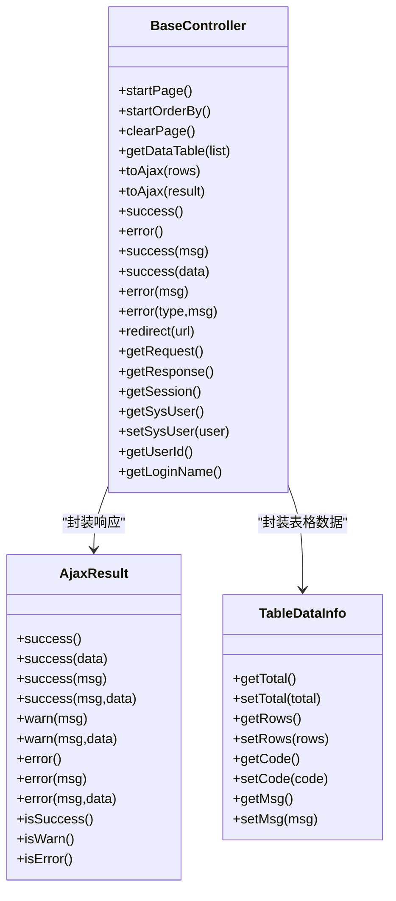
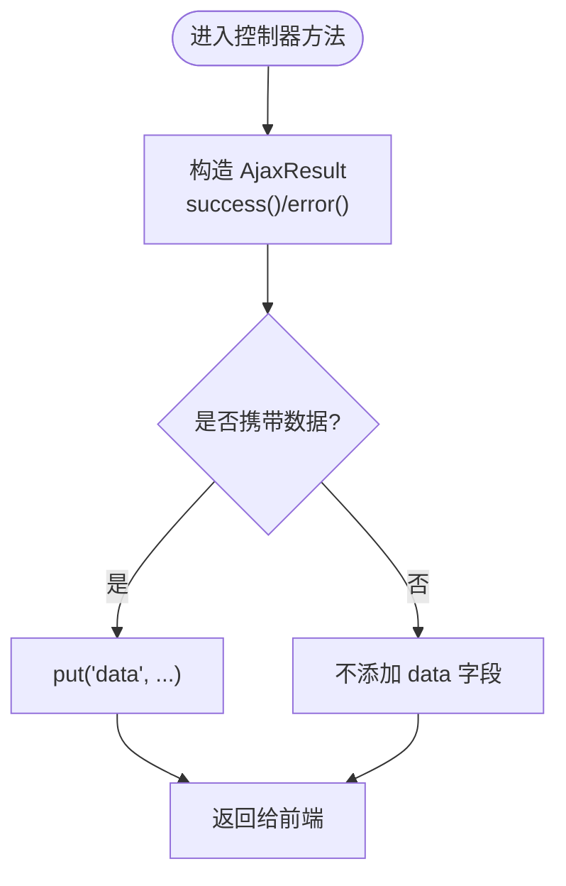
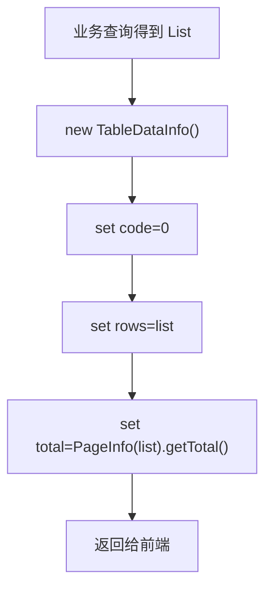
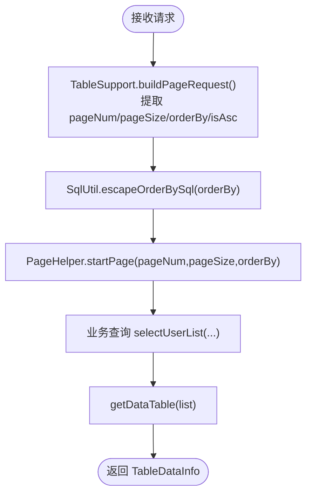
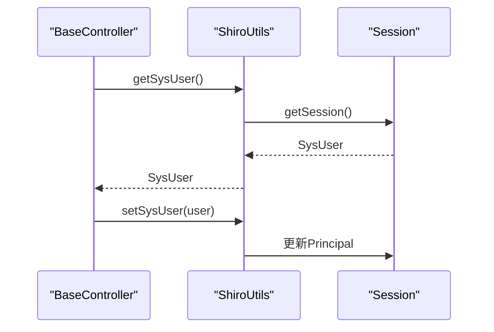
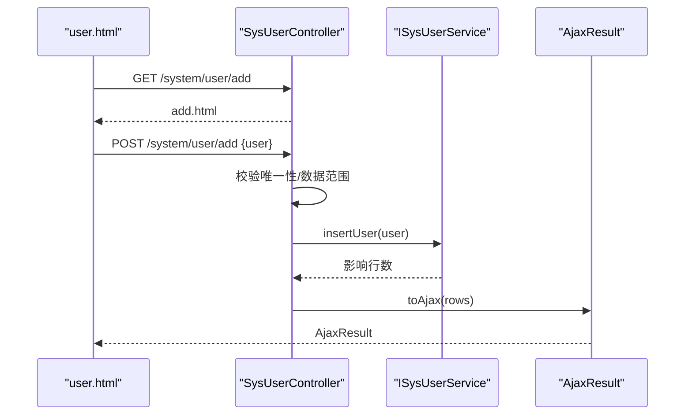
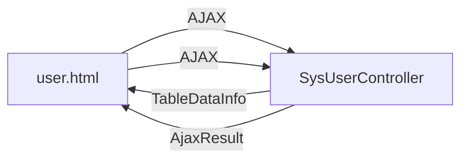
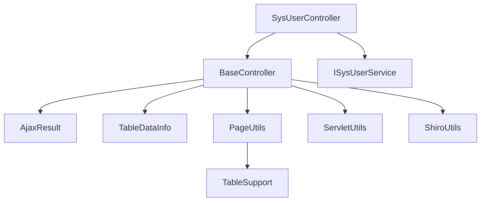

# 控制器开发模式

<cite>
**本文引用的文件**
- [BaseController.java](file://ruoyi-common/src/main/java/com/ruoyi/common/core/controller/BaseController.java)
- [AjaxResult.java](file://ruoyi-common/src/main/java/com/ruoyi/common/core/domain/AjaxResult.java)
- [TableDataInfo.java](file://ruoyi-common/src/main/java/com/ruoyi/common/core/page/TableDataInfo.java)
- [PageDomain.java](file://ruoyi-common/src/main/java/com/ruoyi/common/core/page/PageDomain.java)
- [TableSupport.java](file://ruoyi-common/src/main/java/com/ruoyi/common/core/page/TableSupport.java)
- [PageUtils.java](file://ruoyi-common/src/main/java/com/ruoyi/common/utils/PageUtils.java)
- [ServletUtils.java](file://ruoyi-common/src/main/java/com/ruoyi/common/utils/ServletUtils.java)
- [ShiroUtils.java](file://ruoyi-common/src/main/java/com/ruoyi/common/utils/ShiroUtils.java)
- [SysUserController.java](file://ruoyi-admin/src/main/java/com/ruoyi/web/controller/system/SysUserController.java)
- [ISysUserService.java](file://ruoyi-system/src/main/java/com/ruoyi/system/service/ISysUserService.java)
- [user.html](file://ruoyi-admin/src/main/resources/templates/system/user/user.html)
- [add.html](file://ruoyi-admin/src/main/resources/templates/system/user/add.html)
- [edit.html](file://ruoyi-admin/src/main/resources/templates/system/user/edit.html)
</cite>

## 目录
1. [简介](#简介)
2. [项目结构](#项目结构)
3. [核心组件](#核心组件)
4. [架构总览](#架构总览)
5. [详细组件分析](#详细组件分析)
6. [依赖关系分析](#依赖关系分析)
7. [性能考量](#性能考量)
8. [故障排查指南](#故障排查指南)
9. [结论](#结论)
10. [附录](#附录)

## 简介
本指南聚焦于RuoYi系统的控制器开发模式，围绕BaseController基类的设计理念与核心能力展开，系统讲解分页处理、Ajax响应封装、用户会话管理；详解AjaxResult的使用与响应格式标准化；阐述TableDataInfo在表格数据处理中的应用及分页查询最佳实践；并给出控制器层的开发规范（RESTful API设计原则、参数校验、异常处理），以SysUserController为例展示完整的CRUD实现，并说明前后端交互模式与数据传输协议。

## 项目结构
RuoYi采用多模块分层架构：
- ruoyi-common：通用工具、领域模型、分页与会话工具
- ruoyi-system：系统业务服务接口与实现
- ruoyi-admin：Web控制器与前端模板
- ruoyi-framework：框架集成（Shiro、拦截器、全局异常等）
- ruoyi-generator/quartz：代码生成与定时任务（与控制器开发模式相关度较低）

**图表来源**
- [BaseController.java:33-230](file://ruoyi-common/src/main/java/com/ruoyi/common/core/controller/BaseController.java#L33-L230)
- [SysUserController.java:45-357](file://ruoyi-admin/src/main/java/com/ruoyi/web/controller/system/SysUserController.java#L45-L357)
- [ISysUserService.java:13-235](file://ruoyi-system/src/main/java/com/ruoyi/system/service/ISysUserService.java#L13-L235)

**章节来源**
- [BaseController.java:33-230](file://ruoyi-common/src/main/java/com/ruoyi/common/core/controller/BaseController.java#L33-L230)
- [SysUserController.java:45-357](file://ruoyi-admin/src/main/java/com/ruoyi/web/controller/system/SysUserController.java#L45-L357)

## 核心组件
- BaseController：Web层通用控制器基类，统一处理分页、排序、会话、Ajax响应与页面跳转
- AjaxResult：统一的Ajax响应封装，标准化code/msg/data三段式结构
- TableDataInfo：表格分页数据载体，承载rows/total/code/msg
- PageDomain/TableSupport/PageUtils：分页参数构建与启动、排序SQL安全转义
- ServletUtils/ShiroUtils：请求上下文与会话工具，提供用户信息获取与设置

**章节来源**
- [BaseController.java:54-230](file://ruoyi-common/src/main/java/com/ruoyi/common/core/controller/BaseController.java#L54-L230)
- [AjaxResult.java:12-228](file://ruoyi-common/src/main/java/com/ruoyi/common/core/domain/AjaxResult.java#L12-L228)
- [TableDataInfo.java:11-85](file://ruoyi-common/src/main/java/com/ruoyi/common/core/page/TableDataInfo.java#L11-L85)
- [PageDomain.java:10-90](file://ruoyi-common/src/main/java/com/ruoyi/common/core/page/PageDomain.java#L10-L90)
- [TableSupport.java:11-57](file://ruoyi-common/src/main/java/com/ruoyi/common/core/page/TableSupport.java#L11-L57)
- [PageUtils.java:13-36](file://ruoyi-common/src/main/java/com/ruoyi/common/utils/PageUtils.java#L13-L36)
- [ServletUtils.java:23-233](file://ruoyi-common/src/main/java/com/ruoyi/common/utils/ServletUtils.java#L23-L233)
- [ShiroUtils.java:16-105](file://ruoyi-common/src/main/java/com/ruoyi/common/utils/ShiroUtils.java#L16-L105)

## 架构总览
控制器层通过BaseController统一入口，结合分页工具与AjaxResult进行标准响应；业务层由ISysUserService提供用户CRUD与校验能力；前端模板通过Bootstrap Table与jQuery插件发起AJAX请求，接收统一的AjaxResult/ TableDataInfo结构。

**图表来源**
- [SysUserController.java:71-79](file://ruoyi-admin/src/main/java/com/ruoyi/web/controller/system/SysUserController.java#L71-L79)
- [PageUtils.java:18-26](file://ruoyi-common/src/main/java/com/ruoyi/common/utils/PageUtils.java#L18-L26)
- [TableSupport.java:41-55](file://ruoyi-common/src/main/java/com/ruoyi/common/core/page/TableSupport.java#L41-L55)
- [ISysUserService.java:21](file://ruoyi-system/src/main/java/com/ruoyi/system/service/ISysUserService.java#L21)
- [BaseController.java:110-118](file://ruoyi-common/src/main/java/com/ruoyi/common/core/controller/BaseController.java#L110-L118)

## 详细组件分析

### BaseController 设计理念与核心功能
- 分页处理：startPage()基于TableSupport/PageUtils从请求中提取pageNum/pageSize/orderBy/isAsc，安全转义排序字段后交由PageHelper启动分页
- 排序控制：startOrderBy()读取PageDomain并调用SqlUtil.escapeOrderBySql避免注入，再传给PageHelper.orderBy
- Ajax响应：toAjax()/success()/error()统一封装，支持布尔/整数结果映射
- 表格数据：getDataTable()将列表包装为TableDataInfo，自动计算total并设置code=0
- 会话管理：getSession()/getSysUser()/setSysUser()基于ShiroUtils与Session交互，提供登录用户信息的读写
- 请求上下文：getRequest()/getResponse()便捷获取Servlet上下文

**图表来源**
- [BaseController.java:54-230](file://ruoyi-common/src/main/java/com/ruoyi/common/core/controller/BaseController.java#L54-L230)
- [AjaxResult.java:12-228](file://ruoyi-common/src/main/java/com/ruoyi/common/core/domain/AjaxResult.java#L12-L228)
- [TableDataInfo.java:11-85](file://ruoyi-common/src/main/java/com/ruoyi/common/core/page/TableDataInfo.java#L11-L85)

**章节来源**
- [BaseController.java:54-230](file://ruoyi-common/src/main/java/com/ruoyi/common/core/controller/BaseController.java#L54-L230)

### AjaxResult 使用与响应格式标准化
- 标准字段：code（状态码）、msg（消息）、data（数据体）
- 状态枚举：SUCCESS(0)/WARN(301)/ERROR(500)，便于前端统一判断
- 工厂方法：success()/error()/warn()及其带msg/data变体，支持链式put扩展
- 判定方法：isSuccess()/isWarn()/isError()用于分支逻辑

**图表来源**
- [AjaxResult.java:90-182](file://ruoyi-common/src/main/java/com/ruoyi/common/core/domain/AjaxResult.java#L90-L182)

**章节来源**
- [AjaxResult.java:12-228](file://ruoyi-common/src/main/java/com/ruoyi/common/core/domain/AjaxResult.java#L12-L228)

### TableDataInfo 在表格数据处理中的应用
- 字段含义：total（总数）、rows（列表）、code（状态码）、msg（消息）
- 生成流程：BaseController.getDataTable(list)自动计算total并设置code=0
- 前端约定：Bootstrap Table期望收到{code,total,rows}结构

**图表来源**
- [BaseController.java:110-118](file://ruoyi-common/src/main/java/com/ruoyi/common/core/controller/BaseController.java#L110-L118)
- [TableDataInfo.java:15-85](file://ruoyi-common/src/main/java/com/ruoyi/common/core/page/TableDataInfo.java#L15-L85)

**章节来源**
- [BaseController.java:110-118](file://ruoyi-common/src/main/java/com/ruoyi/common/core/controller/BaseController.java#L110-L118)
- [TableDataInfo.java:11-85](file://ruoyi-common/src/main/java/com/ruoyi/common/core/page/TableDataInfo.java#L11-L85)

### 分页查询最佳实践
- 参数来源：前端通过pageNum/pageSize/orderByColumn/isAsc传递分页与排序
- 安全性：PageDomain将列名转下划线并拼接isAsc，PageUtils在启动分页前调用SqlUtil.escapeOrderBySql
- 启动顺序：先startPage()，再执行业务查询，最后getDataTable()封装
- 清理：控制器末尾可调用clearPage()清理ThreadLocal分页状态

**图表来源**
- [TableSupport.java:41-55](file://ruoyi-common/src/main/java/com/ruoyi/common/core/page/TableSupport.java#L41-L55)
- [PageUtils.java:18-26](file://ruoyi-common/src/main/java/com/ruoyi/common/utils/PageUtils.java#L18-L26)
- [BaseController.java:57-81](file://ruoyi-common/src/main/java/com/ruoyi/common/core/controller/BaseController.java#L57-L81)

**章节来源**
- [PageDomain.java:27-34](file://ruoyi-common/src/main/java/com/ruoyi/common/core/page/PageDomain.java#L27-L34)
- [TableSupport.java:41-55](file://ruoyi-common/src/main/java/com/ruoyi/common/core/page/TableSupport.java#L41-L55)
- [PageUtils.java:18-26](file://ruoyi-common/src/main/java/com/ruoyi/common/utils/PageUtils.java#L18-L26)
- [BaseController.java:57-81](file://ruoyi-common/src/main/java/com/ruoyi/common/core/controller/BaseController.java#L57-L81)

### 用户会话管理
- 获取登录用户：getSysUser()/getUserId()/getLoginName()基于ShiroUtils从Subject/Session中读取
- 更新会话：setSysUser()在重置密码等场景更新当前会话用户信息
- 权限与范围：配合Shiro注解与数据范围校验，确保操作用户与目标用户一致

**图表来源**
- [BaseController.java:201-212](file://ruoyi-common/src/main/java/com/ruoyi/common/core/controller/BaseController.java#L201-L212)
- [ShiroUtils.java:33-51](file://ruoyi-common/src/main/java/com/ruoyi/common/utils/ShiroUtils.java#L33-L51)

**章节来源**
- [BaseController.java:201-212](file://ruoyi-common/src/main/java/com/ruoyi/common/core/controller/BaseController.java#L201-L212)
- [ShiroUtils.java:33-51](file://ruoyi-common/src/main/java/com/ruoyi/common/utils/ShiroUtils.java#L33-L51)

### 控制器层开发规范
- RESTful设计：路径语义化，如/system/user/list、/system/user/add、/system/user/remove
- 参数校验：@Validated标注实体参数，结合前端远程校验（如唯一性检查）
- 权限控制：@RequiresPermissions声明式权限
- 响应统一：优先使用AjaxResult/TableDataInfo，避免直接返回原始对象
- 异常处理：全局异常由框架处理，控制器内尽量通过返回error()或AjaxResult.error()表达业务异常

**章节来源**
- [SysUserController.java:64-357](file://ruoyi-admin/src/main/java/com/ruoyi/web/controller/system/SysUserController.java#L64-L357)

### SysUserController 完整 CRUD 实战
- 列表查询：POST /system/user/list，分页+排序+过滤，返回TableDataInfo
- 新增用户：GET /system/user/add（页面）+ POST /system/user/add（保存），含参数校验与唯一性检查
- 修改用户：GET /system/user/edit/{id}（页面）+ POST /system/user/edit（保存），含参数校验与唯一性检查
- 删除用户：POST /system/user/remove，支持批量删除
- 导入导出：ExcelUtil封装导入/导出，返回AjaxResult
- 校验唯一性：/system/user/checkLoginNameUnique、/system/user/checkPhoneUnique、/system/user/checkEmailUnique
- 状态变更：/system/user/changeStatus
- 角色授权：/system/user/authRole/insertAuthRole

**图表来源**
- [SysUserController.java:116-153](file://ruoyi-admin/src/main/java/com/ruoyi/web/controller/system/SysUserController.java#L116-L153)
- [ISysUserService.java:102](file://ruoyi-system/src/main/java/com/ruoyi/system/service/ISysUserService.java#L102)
- [BaseController.java:126-140](file://ruoyi-common/src/main/java/com/ruoyi/common/core/controller/BaseController.java#L126-L140)

**章节来源**
- [SysUserController.java:71-153](file://ruoyi-admin/src/main/java/com/ruoyi/web/controller/system/SysUserController.java#L71-L153)
- [ISysUserService.java:102](file://ruoyi-system/src/main/java/com/ruoyi/system/service/ISysUserService.java#L102)

### 前后端交互模式与数据传输协议
- 请求方式：GET/POST，JSON响应为主
- 分页参数：pageNum/pageSize/orderByColumn/isAsc/params[beginTime]/params[endTime]等
- 响应格式：AjaxResult（code/msg/data）或TableDataInfo（code/total/rows/msg）
- 前端模板：user.html使用Bootstrap Table初始化，配置columns、url、toolbar等
- 校验机制：前端jQuery.validate结合后端唯一性接口进行实时校验

**图表来源**
- [user.html:116-194](file://ruoyi-admin/src/main/resources/templates/system/user/user.html#L116-L194)
- [SysUserController.java:71-79](file://ruoyi-admin/src/main/java/com/ruoyi/web/controller/system/SysUserController.java#L71-L79)
- [BaseController.java:110-118](file://ruoyi-common/src/main/java/com/ruoyi/common/core/controller/BaseController.java#L110-L118)

**章节来源**
- [user.html:116-194](file://ruoyi-admin/src/main/resources/templates/system/user/user.html#L116-L194)
- [add.html:152-228](file://ruoyi-admin/src/main/resources/templates/system/user/add.html#L152-L228)
- [edit.html:137-195](file://ruoyi-admin/src/main/resources/templates/system/user/edit.html#L137-L195)

## 依赖关系分析
- 控制器依赖：BaseController依赖AjaxResult、TableDataInfo、PageUtils、TableSupport、ServletUtils、ShiroUtils
- 业务依赖：SysUserController依赖ISysUserService与各领域服务（角色、部门、岗位）
- 前端依赖：模板通过jQuery/Bootstrap Table/layer等库与控制器交互

**图表来源**
- [SysUserController.java:45](file://ruoyi-admin/src/main/java/com/ruoyi/web/controller/system/SysUserController.java#L45)
- [BaseController.java:15-25](file://ruoyi-common/src/main/java/com/ruoyi/common/core/controller/BaseController.java#L15-L25)
- [PageUtils.java:13](file://ruoyi-common/src/main/java/com/ruoyi/common/utils/PageUtils.java#L13)
- [TableSupport.java:11](file://ruoyi-common/src/main/java/com/ruoyi/common/core/page/TableSupport.java#L11)
- [ServletUtils.java:23](file://ruoyi-common/src/main/java/com/ruoyi/common/utils/ServletUtils.java#L23)
- [ShiroUtils.java:16](file://ruoyi-common/src/main/java/com/ruoyi/common/utils/ShiroUtils.java#L16)
- [ISysUserService.java:13](file://ruoyi-system/src/main/java/com/ruoyi/system/service/ISysUserService.java#L13)

**章节来源**
- [SysUserController.java:45](file://ruoyi-admin/src/main/java/com/ruoyi/web/controller/system/SysUserController.java#L45)
- [BaseController.java:15-25](file://ruoyi-common/src/main/java/com/ruoyi/common/core/controller/BaseController.java#L15-L25)

## 性能考量
- 分页与排序：PageHelper线程变量需在请求结束后清理，避免内存泄漏
- SQL安全：排序字段经escapeOrderBySql处理，防止注入
- 响应体积：AjaxResult按需携带data，避免大对象传输
- 前端渲染：Bootstrap Table分页渲染，建议合理设置pageSize与列宽

[本节为通用指导，无需特定文件引用]

## 故障排查指南
- 分页无效：检查前端是否正确传递pageNum/pageSize/orderByColumn/isAsc；后端是否调用startPage()/startOrderBy()
- 排序报错：确认排序字段是否存在于数据库列名，避免非法列名导致异常
- Ajax响应格式不符：确认控制器返回AjaxResult或TableDataInfo，前端按约定解析
- 会话异常：重置密码后需调用setSysUser()更新当前会话用户信息
- 权限不足：检查@RequiresPermissions注解与菜单权限配置

**章节来源**
- [BaseController.java:57-81](file://ruoyi-common/src/main/java/com/ruoyi/common/core/controller/BaseController.java#L57-L81)
- [BaseController.java:201-212](file://ruoyi-common/src/main/java/com/ruoyi/common/core/controller/BaseController.java#L201-L212)
- [SysUserController.java:276-287](file://ruoyi-admin/src/main/java/com/ruoyi/web/controller/system/SysUserController.java#L276-L287)

## 结论
RuoYi的控制器开发模式以BaseController为核心，通过AjaxResult与TableDataInfo实现响应标准化，借助PageUtils/TableSupport完成安全分页与排序，结合Shiro实现会话与权限管理。SysUserController展示了完整的CRUD流程与前后端交互协议。遵循本文规范可快速构建一致、安全、易维护的控制器层。

[本节为总结，无需特定文件引用]

## 附录
- 常用路径与方法
  - 列表：POST /system/user/list
  - 新增：GET /system/user/add → POST /system/user/add
  - 修改：GET /system/user/edit/{id} → POST /system/user/edit
  - 删除：POST /system/user/remove
  - 导入/导出：POST /system/user/importData、POST /system/user/export
  - 唯一性校验：POST /system/user/checkLoginNameUnique、/checkPhoneUnique、/checkEmailUnique
  - 状态变更：POST /system/user/changeStatus
  - 角色授权：POST /system/user/authRole/insertAuthRole

**章节来源**
- [SysUserController.java:64-357](file://ruoyi-admin/src/main/java/com/ruoyi/web/controller/system/SysUserController.java#L64-L357)