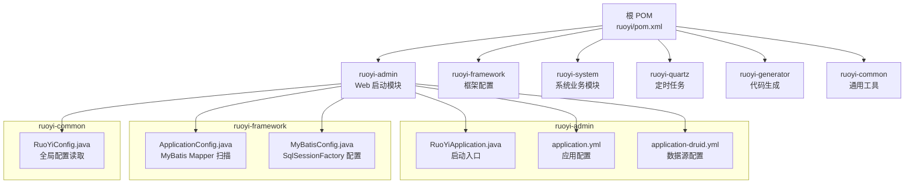
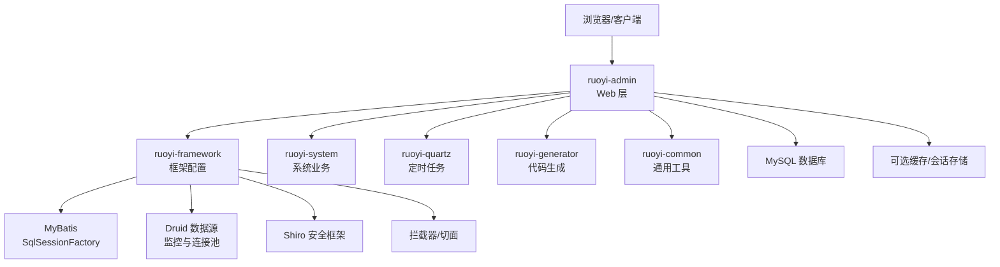
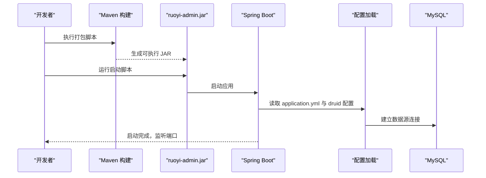
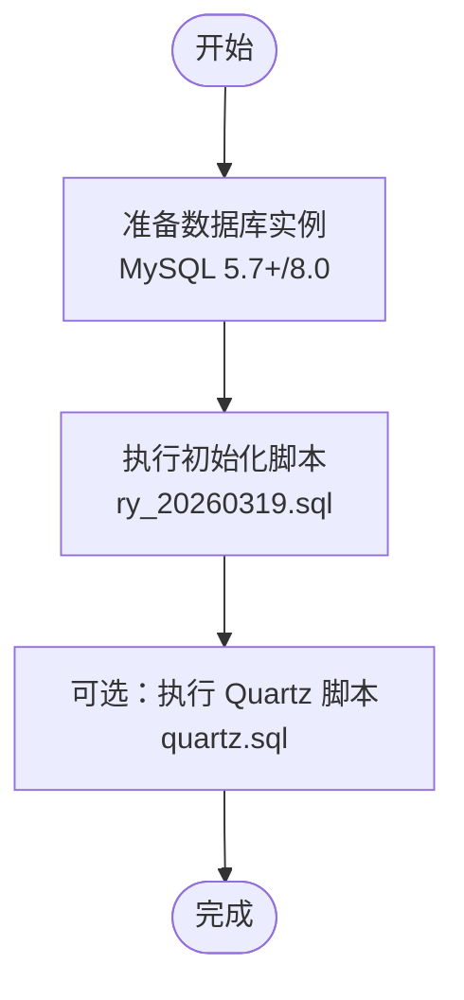
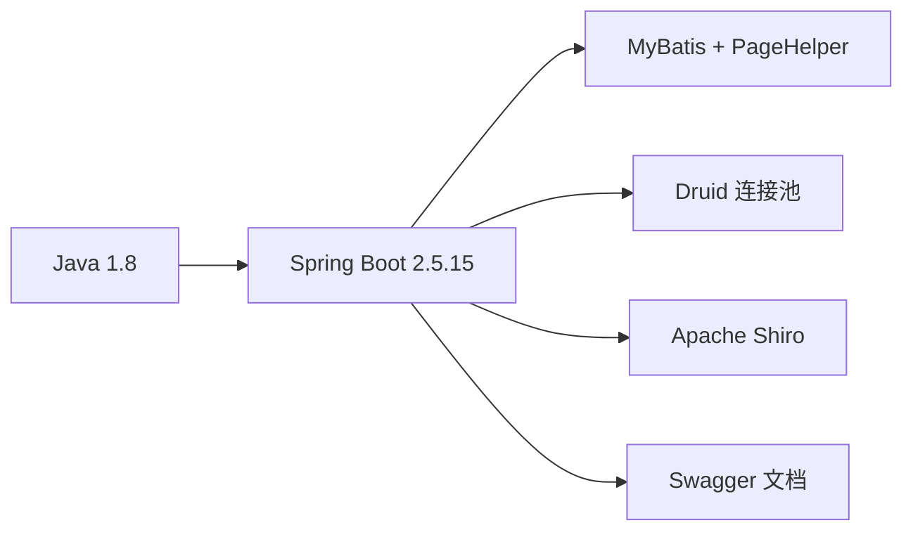

# 快速开始

<cite>
**本文引用的文件**
- [README.md](file://README.md)
- [pom.xml](file://pom.xml)
- [RuoYiApplication.java](file://ruoyi-admin/src/main/java/com/ruoyi/RuoYiApplication.java)
- [application.yml](file://ruoyi-admin/src/main/resources/application.yml)
- [application-druid.yml](file://ruoyi-admin/src/main/resources/application-druid.yml)
- [RuoYiConfig.java](file://ruoyi-common/src/main/java/com/ruoyi/common/config/RuoYiConfig.java)
- [ApplicationConfig.java](file://ruoyi-framework/src/main/java/com/ruoyi/framework/config/ApplicationConfig.java)
- [MyBatisConfig.java](file://ruoyi-framework/src/main/java/com/ruoyi/framework/config/MyBatisConfig.java)
- [ry_20260319.sql](file://sql/ry_20260319.sql)
- [quartz.sql](file://sql/quartz.sql)
- [run.bat](file://bin/run.bat)
- [package.bat](file://bin/package.bat)
- [clean.bat](file://bin/clean.bat)
- [ry.sh](file://ry.sh)
- [ry.bat](file://ry.bat)
</cite>

## 目录
1. [简介](#简介)
2. [项目结构](#项目结构)
3. [核心组件](#核心组件)
4. [架构总览](#架构总览)
5. [详细组件分析](#详细组件分析)
6. [依赖分析](#依赖分析)
7. [性能考虑](#性能考虑)
8. [故障排除指南](#故障排除指南)
9. [结论](#结论)
10. [附录](#附录)

## 简介
本指南面向首次接触 RuoYi 管理系统的用户，目标是在约 30 分钟内完成从环境准备、数据库初始化、代码构建到系统启动与首个功能验证的全流程。文档覆盖 JDK 版本、数据库配置、Maven 环境、配置文件修改、打包与启动脚本使用、常见问题排查等关键步骤。

## 项目结构
RuoYi 采用多模块 Maven 工程组织，核心模块包括：
- ruoyi-admin：Web 启动模块与前端模板资源
- ruoyi-framework：框架配置与拦截器、Shiro、Druid、MyBatis 等基础设施
- ruoyi-system：系统管理业务模块（用户、角色、菜单、字典等）
- ruoyi-quartz：定时任务模块
- ruoyi-generator：代码生成模块
- ruoyi-common：通用工具与常量定义

图表来源
- [pom.xml:235-242](file://pom.xml#L235-L242)
- [RuoYiApplication.java:12-18](file://ruoyi-admin/src/main/java/com/ruoyi/RuoYiApplication.java#L12-L18)
- [application.yml:16-154](file://ruoyi-admin/src/main/resources/application.yml#L16-L154)
- [application-druid.yml:1-61](file://ruoyi-admin/src/main/resources/application-druid.yml#L1-L61)
- [ApplicationConfig.java:12-20](file://ruoyi-framework/src/main/java/com/ruoyi/framework/config/ApplicationConfig.java#L12-L20)
- [MyBatisConfig.java:116-131](file://ruoyi-framework/src/main/java/com/ruoyi/framework/config/MyBatisConfig.java#L116-L131)
- [RuoYiConfig.java:11-124](file://ruoyi-common/src/main/java/com/ruoyi/common/config/RuoYiConfig.java#L11-L124)

章节来源
- [pom.xml:14-37](file://pom.xml#L14-L37)
- [pom.xml:235-242](file://pom.xml#L235-L242)

## 核心组件
- 启动入口：RuoYiApplication 作为 Spring Boot 启动类，排除数据源自动装配以配合动态数据源配置。
- 配置体系：application.yml 提供通用配置；application-druid.yml 提供 Druid 数据源与控制台配置；RuoYiConfig 读取 ruoyi.* 前缀的全局配置。
- 框架配置：ApplicationConfig 指定 MyBatis Mapper 扫描路径；MyBatisConfig 动态解析别名包与 Mapper XML 路径。
- 构建与运行：根目录提供 Windows/Linux 启动与打包脚本，支持 JVM 参数与日志输出。

章节来源
- [RuoYiApplication.java:12-18](file://ruoyi-admin/src/main/java/com/ruoyi/RuoYiApplication.java#L12-L18)
- [application.yml:16-154](file://ruoyi-admin/src/main/resources/application.yml#L16-L154)
- [application-druid.yml:1-61](file://ruoyi-admin/src/main/resources/application-druid.yml#L1-L61)
- [RuoYiConfig.java:11-124](file://ruoyi-common/src/main/java/com/ruoyi/common/config/RuoYiConfig.java#L11-L124)
- [ApplicationConfig.java:12-20](file://ruoyi-framework/src/main/java/com/ruoyi/framework/config/ApplicationConfig.java#L12-L20)
- [MyBatisConfig.java:116-131](file://ruoyi-framework/src/main/java/com/ruoyi/framework/config/MyBatisConfig.java#L116-L131)

## 架构总览
RuoYi 的运行时架构围绕 Spring Boot + MyBatis + Druid + Shiro 展开，采用多模块解耦，Admin 模块负责 Web 层与静态资源，Framework 模块提供基础设施，System/Quartz/Generator/Common 模块承载业务与通用能力。

图表来源
- [pom.xml:235-242](file://pom.xml#L235-L242)
- [application.yml:47-79](file://ruoyi-admin/src/main/resources/application.yml#L47-L79)
- [application-druid.yml:2-61](file://ruoyi-admin/src/main/resources/application-druid.yml#L2-L61)

## 详细组件分析

### 启动流程与配置加载
- 启动类排除数据源自动装配，由框架按需加载动态数据源。
- 读取 application.yml 与激活的 profile（druid），加载 Druid 数据源与 MyBatis 配置。
- 启动后打印欢迎信息，表示服务已就绪。

图表来源
- [RuoYiApplication.java:12-18](file://ruoyi-admin/src/main/java/com/ruoyi/RuoYiApplication.java#L12-L18)
- [application.yml:16-154](file://ruoyi-admin/src/main/resources/application.yml#L16-L154)
- [application-druid.yml:1-61](file://ruoyi-admin/src/main/resources/application-druid.yml#L1-L61)

章节来源
- [RuoYiApplication.java:12-18](file://ruoyi-admin/src/main/java/com/ruoyi/RuoYiApplication.java#L12-L18)
- [application.yml:16-154](file://ruoyi-admin/src/main/resources/application.yml#L16-L154)
- [application-druid.yml:1-61](file://ruoyi-admin/src/main/resources/application-druid.yml#L1-L61)

### 数据库初始化与定时任务脚本
- 使用 SQL 脚本初始化系统基础数据与菜单权限。
- Quartz 脚本初始化调度相关表结构。
- 建议在本地或云数据库中先执行初始化脚本，再启动应用。

图表来源
- [ry_20260319.sql:1-200](file://sql/ry_20260319.sql#L1-L200)
- [quartz.sql](file://sql/quartz.sql)

章节来源
- [ry_20260319.sql:1-200](file://sql/ry_20260319.sql#L1-L200)
- [quartz.sql](file://sql/quartz.sql)

### 配置文件修改指南
- 服务器端口与上下文路径：在 application.yml 中调整 server.port 与 server.servlet.context-path。
- 文件上传路径：修改 ruoyi.profile 指向实际上传目录（Windows 示例路径已在配置中给出）。
- 数据源配置：在 application-druid.yml 中填写正确的 JDBC URL、用户名与密码。
- MyBatis 与分页插件：确认 mybatis.typeAliasesPackage、mapperLocations 与 pagehelper.dialect。
- Shiro 与 XSS/CSRF：根据安全策略调整 shiro.*、xss.*、csrf.* 配置。
- Swagger：生产环境建议关闭 swagger.enabled。

章节来源
- [application.yml:16-154](file://ruoyi-admin/src/main/resources/application.yml#L16-L154)
- [application-druid.yml:1-61](file://ruoyi-admin/src/main/resources/application-druid.yml#L1-L61)
- [RuoYiConfig.java:11-124](file://ruoyi-common/src/main/java/com/ruoyi/common/config/RuoYiConfig.java#L11-L124)

### 构建与运行脚本
- Windows
  - 打包：双击 bin/package.bat 或在命令行执行 Maven 打包命令。
  - 运行：双击 bin/run.bat 或在 ruoyi-admin/target 目录执行 java -jar ruoyi-admin.jar。
  - 清理：双击 bin/clean.bat。
- Linux/macOS
  - 打包：在根目录执行 Maven 打包命令。
  - 运行：使用 ry.sh start/stop/restart/status 或直接 java -jar ruoyi-admin.jar。
  - JVM 参数：可在脚本中调整内存与 GC 参数。

章节来源
- [package.bat:10](file://bin/package.bat#L10)
- [run.bat:9-11](file://bin/run.bat#L9-L11)
- [clean.bat:10](file://bin/clean.bat#L10)
- [ry.sh:6](file://ry.sh#L6)
- [ry.bat:7](file://ry.bat#L7)

## 依赖分析
- Java 版本：Java 1.8（源码与目标编译版本一致）。
- Spring Boot：2.5.15，统一管理依赖与插件版本。
- MyBatis：通过 MyBatisConfig 动态解析别名包与 Mapper XML。
- Druid：提供连接池、SQL 监控与慢 SQL 记录。
- Shiro：提供认证与授权能力，结合 EhCache 与 RememberMe。
- Swagger：提供接口文档，便于调试与联调。

图表来源
- [pom.xml:14-37](file://pom.xml#L14-L37)
- [MyBatisConfig.java:116-131](file://ruoyi-framework/src/main/java/com/ruoyi/framework/config/MyBatisConfig.java#L116-L131)
- [application-druid.yml:1-61](file://ruoyi-admin/src/main/resources/application-druid.yml#L1-L61)

章节来源
- [pom.xml:14-37](file://pom.xml#L14-L37)
- [MyBatisConfig.java:116-131](file://ruoyi-framework/src/main/java/com/ruoyi/framework/config/MyBatisConfig.java#L116-L131)

## 性能考虑
- JVM 内存：根据业务规模调整 -Xms/-Xmx 与 Metaspace 大小。
- 连接池：合理设置 Druid 的初始连接、最小空闲、最大活跃与等待超时。
- SQL 监控：开启慢 SQL 记录与合并统计，定位性能瓶颈。
- 缓存：结合 EhCache 与 Redis（如需）提升热点数据访问效率。
- 线程与并发：根据业务并发量调整 Tomcat 线程池参数。

## 故障排除指南
- 端口占用
  - 现象：启动失败提示端口被占用。
  - 处理：修改 application.yml 中 server.port 为未被占用端口。
- 数据库连接失败
  - 现象：启动报错无法连接数据库。
  - 处理：核对 application-druid.yml 中 JDBC URL、用户名、密码；确认数据库服务可达。
- MyBatis 映射异常
  - 现象：找不到 Mapper XML 或实体别名。
  - 处理：检查 mybatis.mapperLocations 与 mybatis.typeAliasesPackage；确认 Mapper XML 路径与命名规范。
- 文件上传路径不可写
  - 现象：上传失败或抛出 IO 异常。
  - 处理：修改 ruoyi.profile 指向有写权限的目录（Windows/Linux 路径格式正确）。
- Druid 控制台访问受限
  - 现象：无法访问 /druid 登录页。
  - 处理：确认 druid.statViewServlet.login-username/password 与 allow 白名单配置。
- Shiro 认证失败
  - 现象：登录后无权限或跳转未授权页。
  - 处理：检查 shiro.user.* 与权限标识 perms；确认用户角色与菜单权限配置完整。
- Swagger 文档异常
  - 现象：接口文档 404 或加载失败。
  - 处理：确认 swagger.enabled 与相关过滤器配置；检查跨域与安全拦截规则。

章节来源
- [application.yml:16-154](file://ruoyi-admin/src/main/resources/application.yml#L16-L154)
- [application-druid.yml:1-61](file://ruoyi-admin/src/main/resources/application-druid.yml#L1-L61)
- [MyBatisConfig.java:94-114](file://ruoyi-framework/src/main/java/com/ruoyi/framework/config/MyBatisConfig.java#L94-L114)
- [RuoYiConfig.java:73-123](file://ruoyi-common/src/main/java/com/ruoyi/common/config/RuoYiConfig.java#L73-L123)

## 结论
按照本指南完成环境准备、数据库初始化、配置修改与打包运行，您可以在 30 分钟内成功启动 RuoYi 并验证首个功能模块。后续可根据业务扩展模块与自定义配置，逐步完善系统能力。

## 附录

### 快速开始清单
- 环境准备
  - 安装 JDK 1.8
  - 安装 Maven
  - 准备 MySQL 实例
- 克隆与构建
  - 执行 Maven 打包生成 ruoyi-admin.jar
- 数据库初始化
  - 执行 ry_20260319.sql 与可选 quartz.sql
- 修改配置
  - application.yml：端口、上传路径、MyBatis、分页、Shiro、XSS/CSRF、Swagger
  - application-druid.yml：JDBC URL、用户名、密码、Druid 参数
- 启动与验证
  - Windows：双击 run.bat 或使用 ry.bat
  - Linux/macOS：使用 ry.sh 或直接 java -jar ruoyi-admin.jar
  - 浏览器访问：http://localhost[:port]/index

章节来源
- [package.bat:10](file://bin/package.bat#L10)
- [run.bat:9-11](file://bin/run.bat#L9-L11)
- [ry.sh:6](file://ry.sh#L6)
- [ry.bat:7](file://ry.bat#L7)
- [application.yml:16-154](file://ruoyi-admin/src/main/resources/application.yml#L16-L154)
- [application-druid.yml:1-61](file://ruoyi-admin/src/main/resources/application-druid.yml#L1-L61)
- [ry_20260319.sql:1-200](file://sql/ry_20260319.sql#L1-L200)