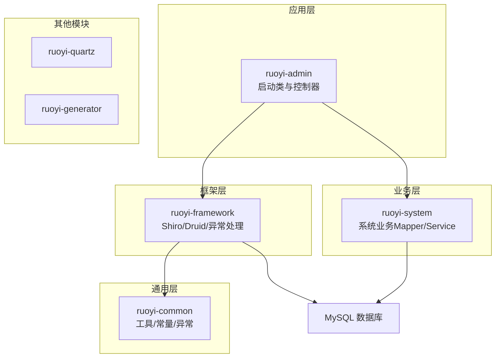
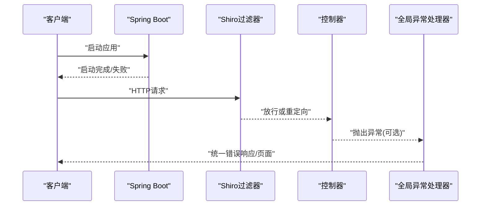
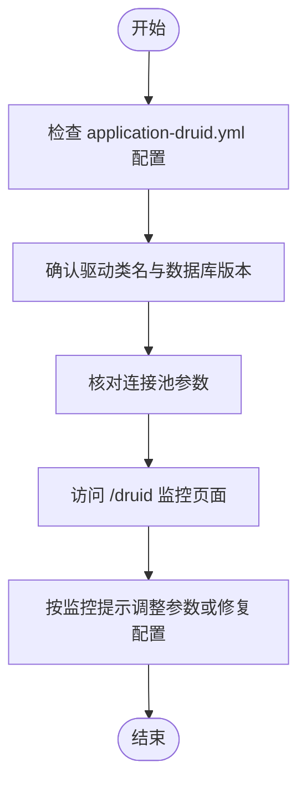
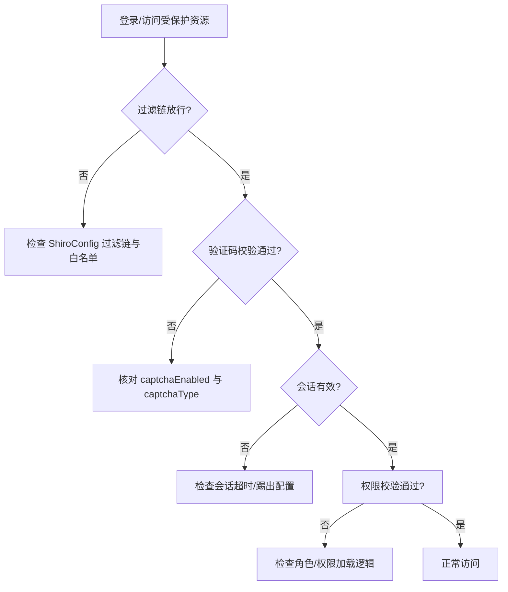
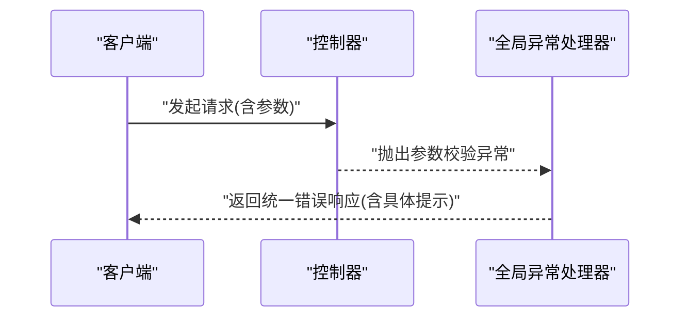
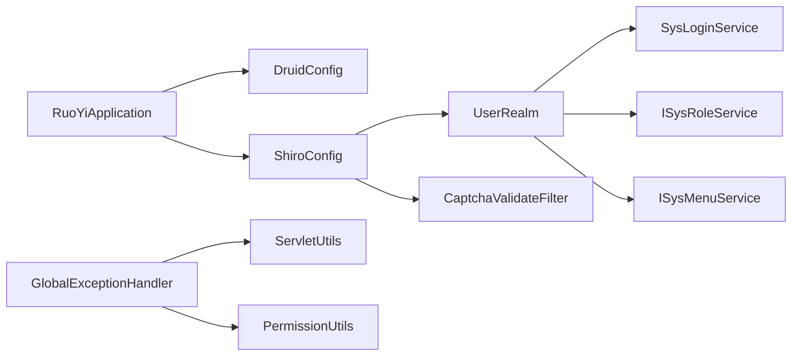

# 常见问题诊断

<cite>
**本文引用的文件**
- [RuoYiApplication.java](file://ruoyi-admin/src/main/java/com/ruoyi/RuoYiApplication.java)
- [application.yml](file://ruoyi-admin/src/main/resources/application.yml)
- [application-druid.yml](file://ruoyi-admin/src/main/resources/application-druid.yml)
- [ShiroConfig.java](file://ruoyi-framework/src/main/java/com/ruoyi/framework/config/ShiroConfig.java)
- [DruidConfig.java](file://ruoyi-framework/src/main/java/com/ruoyi/framework/config/DruidConfig.java)
- [GlobalExceptionHandler.java](file://ruoyi-framework/src/main/java/com/ruoyi/framework/web/exception/GlobalExceptionHandler.java)
- [UserRealm.java](file://ruoyi-framework/src/main/java/com/ruoyi/framework/shiro/realm/UserRealm.java)
- [CaptchaValidateFilter.java](file://ruoyi-framework/src/main/java/com/ruoyi/framework/shiro/web/filter/captcha/CaptchaValidateFilter.java)
- [ServletUtils.java](file://ruoyi-common/src/main/java/com/ruoyi/common/utils/ServletUtils.java)
- [PermissionUtils.java](file://ruoyi-common/src/main/java/com/ruoyi/common/utils/security/PermissionUtils.java)
- [ry_20260319.sql](file://sql/ry_20260319.sql)
</cite>

## 目录
1. [简介](#简介)
2. [项目结构](#项目结构)
3. [核心组件](#核心组件)
4. [架构总览](#架构总览)
5. [详细组件分析](#详细组件分析)
6. [依赖分析](#依赖分析)
7. [性能考虑](#性能考虑)
8. [故障排除指南](#故障排除指南)
9. [结论](#结论)
10. [附录](#附录)

## 简介
本指南面向RuoYi系统的开发者与运维人员，聚焦于启动失败、数据库连接异常、权限验证错误、请求参数错误等常见问题的诊断与解决。内容覆盖Spring Boot启动异常排查、数据库连接池配置检查、Shiro权限配置验证、REST API参数验证失败处理等具体场景，并提供症状描述、可能原因分析与对应解决步骤，帮助快速定位与修复问题。

## 项目结构
RuoYi采用多模块结构，关键模块与职责如下：
- ruoyi-admin：Web应用入口与控制器层，包含启动类与前端模板资源。
- ruoyi-framework：框架层，包含Shiro安全配置、Druid数据源配置、全局异常处理、拦截器与服务封装。
- ruoyi-common：通用工具与常量、异常体系、实体模型与分页等。
- ruoyi-system：系统业务模块，包含用户、角色、菜单、字典等业务Mapper与Service。
- ruoyi-quartz、ruoyi-generator：定时任务与代码生成模块。
- sql：数据库初始化脚本。

**图表来源**
- [RuoYiApplication.java:12-17](file://ruoyi-admin/src/main/java/com/ruoyi/RuoYiApplication.java#L12-L17)
- [ShiroConfig.java:296-346](file://ruoyi-framework/src/main/java/com/ruoyi/framework/config/ShiroConfig.java#L296-L346)
- [DruidConfig.java:52-60](file://ruoyi-framework/src/main/java/com/ruoyi/framework/config/DruidConfig.java#L52-L60)
- [ry_20260319.sql:1-200](file://sql/ry_20260319.sql#L1-L200)

**章节来源**
- [RuoYiApplication.java:12-17](file://ruoyi-admin/src/main/java/com/ruoyi/RuoYiApplication.java#L12-L17)
- [application.yml:16-85](file://ruoyi-admin/src/main/resources/application.yml#L16-L85)
- [application-druid.yml:1-61](file://ruoyi-admin/src/main/resources/application-druid.yml#L1-L61)

## 核心组件
- Spring Boot启动类：排除默认数据源自动装配，由框架自定义数据源与动态路由。
- Shiro安全配置：统一过滤链、会话管理、记住我、验证码、CSRF等。
- Druid数据源配置：主从数据源、连接池参数、监控控制台与慢SQL记录。
- 全局异常处理：针对权限校验、请求方法不支持、参数类型不匹配、业务异常等统一处理。
- 用户Realm：登录认证与授权逻辑，结合业务服务加载角色与权限。
- Servlet工具：判断Ajax请求、生成CSRF Token等。
- 权限工具：根据权限字符串生成提示消息。

**章节来源**
- [RuoYiApplication.java:12-17](file://ruoyi-admin/src/main/java/com/ruoyi/RuoYiApplication.java#L12-L17)
- [ShiroConfig.java:296-346](file://ruoyi-framework/src/main/java/com/ruoyi/framework/config/ShiroConfig.java#L296-L346)
- [DruidConfig.java:35-60](file://ruoyi-framework/src/main/java/com/ruoyi/framework/config/DruidConfig.java#L35-L60)
- [GlobalExceptionHandler.java:36-139](file://ruoyi-framework/src/main/java/com/ruoyi/framework/web/exception/GlobalExceptionHandler.java#L36-L139)
- [UserRealm.java:86-133](file://ruoyi-framework/src/main/java/com/ruoyi/framework/shiro/realm/UserRealm.java#L86-L133)
- [ServletUtils.java:137-159](file://ruoyi-common/src/main/java/com/ruoyi/common/utils/ServletUtils.java#L137-L159)
- [PermissionUtils.java:59-85](file://ruoyi-common/src/main/java/com/ruoyi/common/utils/security/PermissionUtils.java#L59-L85)

## 架构总览
下图展示启动、请求处理与异常处理的关键交互：

**图表来源**
- [RuoYiApplication.java:15-27](file://ruoyi-admin/src/main/java/com/ruoyi/RuoYiApplication.java#L15-L27)
- [ShiroConfig.java:296-346](file://ruoyi-framework/src/main/java/com/ruoyi/framework/config/ShiroConfig.java#L296-L346)
- [GlobalExceptionHandler.java:36-100](file://ruoyi-framework/src/main/java/com/ruoyi/framework/web/exception/GlobalExceptionHandler.java#L36-L100)

## 详细组件分析

### 组件A：Spring Boot启动异常排查
- 症状
  - 应用启动报错、端口占用、配置加载失败。
- 可能原因
  - 端口冲突（默认80）、profile未正确激活、配置文件缺失或格式错误。
- 诊断步骤
  - 检查server.port与防火墙/代理占用情况。
  - 确认spring.profiles.active已启用druid配置。
  - 校验application.yml与application-druid.yml的语法与键名。
  - 查看启动日志中的异常堆栈与“致命错误”提示。
- 解决方案
  - 更换端口或释放占用端口。
  - 确保spring.profiles.active与实际存在的配置文件匹配。
  - 修正配置项拼写与缩进，避免YAML解析错误。

**章节来源**
- [RuoYiApplication.java:15-27](file://ruoyi-admin/src/main/java/com/ruoyi/RuoYiApplication.java#L15-L27)
- [application.yml:62-62](file://ruoyi-admin/src/main/resources/application.yml#L62-L62)
- [application-druid.yml:1-61](file://ruoyi-admin/src/main/resources/application-druid.yml#L1-L61)

### 组件B：数据库连接池配置检查
- 症状
  - 启动时报数据库连接失败、SQL执行超时、连接池耗尽。
- 可能原因
  - 数据源URL/用户名/密码错误；驱动类名不匹配；连接池参数不合理。
- 诊断步骤
  - 校验application-druid.yml中的master/slave配置。
  - 确认驱动类名与数据库版本兼容。
  - 检查maxActive、minIdle、maxWait、validationQuery等参数是否合理。
  - 通过Druid监控控制台查看连接池状态与慢SQL。
- 解决方案
  - 更新正确的数据库URL、用户名与密码。
  - 调整连接池参数以匹配业务并发与数据库性能。
  - 如未使用从库，确保slave.enabled=false且从库配置为空。

**图表来源**
- [application-druid.yml:6-61](file://ruoyi-admin/src/main/resources/application-druid.yml#L6-L61)
- [DruidConfig.java:35-60](file://ruoyi-framework/src/main/java/com/ruoyi/framework/config/DruidConfig.java#L35-L60)

**章节来源**
- [application-druid.yml:6-61](file://ruoyi-admin/src/main/resources/application-druid.yml#L6-L61)
- [DruidConfig.java:35-60](file://ruoyi-framework/src/main/java/com/ruoyi/framework/config/DruidConfig.java#L35-L60)

### 组件C：Shiro权限配置验证
- 症状
  - 登录成功但跳转到未授权页；接口返回权限不足；验证码不生效。
- 可能原因
  - 过滤链配置不当；验证码开关与类型不一致；会话超时或被踢出；记住我密钥未固定导致失效。
- 诊断步骤
  - 检查ShiroConfig中的过滤链定义与anon白名单。
  - 核对shiro.user.captchaEnabled与captchaType。
  - 查看会话管理器与KickoutSessionFilter配置。
  - 确认rememberMe的cipherKey是否设置，避免随机密钥导致Cookie失效。
- 解决方案
  - 补充必要的anon放行路径，确保登录/注册接口可匿名访问。
  - 统一验证码开关与类型，确保前后端一致。
  - 固定rememberMe cipherKey，重启后旧Cookie仍有效。
  - 调整expireTime、validationInterval、maxSession等参数。

**图表来源**
- [ShiroConfig.java:296-346](file://ruoyi-framework/src/main/java/com/ruoyi/framework/config/ShiroConfig.java#L296-L346)
- [CaptchaValidateFilter.java:48-78](file://ruoyi-framework/src/main/java/com/ruoyi/framework/shiro/web/filter/captcha/CaptchaValidateFilter.java#L48-L78)
- [UserRealm.java:56-81](file://ruoyi-framework/src/main/java/com/ruoyi/framework/shiro/realm/UserRealm.java#L56-L81)

**章节来源**
- [ShiroConfig.java:296-346](file://ruoyi-framework/src/main/java/com/ruoyi/framework/config/ShiroConfig.java#L296-L346)
- [CaptchaValidateFilter.java:48-78](file://ruoyi-framework/src/main/java/com/ruoyi/framework/shiro/web/filter/captcha/CaptchaValidateFilter.java#L48-L78)
- [UserRealm.java:56-81](file://ruoyi-framework/src/main/java/com/ruoyi/framework/shiro/realm/UserRealm.java#L56-L81)

### 组件D：REST API参数验证失败处理
- 症状
  - 参数类型不匹配、路径变量缺失、绑定异常，接口返回错误。
- 可能原因
  - 前端传参类型与后端期望不一致；缺少必填路径变量；参数绑定失败。
- 诊断步骤
  - 查看全局异常处理器对MethodArgumentTypeMismatchException、MissingPathVariableException、BindException的处理分支。
  - 使用浏览器开发者工具或Postman检查请求头与参数类型。
  - 确认Controller层参数注解与前端传参一致。
- 解决方案
  - 修正前端传参类型或后端参数类型。
  - 补齐路径变量或查询参数。
  - 在Controller中增加必要的校验注解与错误提示。

**图表来源**
- [GlobalExceptionHandler.java:116-139](file://ruoyi-framework/src/main/java/com/ruoyi/framework/web/exception/GlobalExceptionHandler.java#L116-L139)
- [ServletUtils.java:137-159](file://ruoyi-common/src/main/java/com/ruoyi/common/utils/ServletUtils.java#L137-L159)

**章节来源**
- [GlobalExceptionHandler.java:116-139](file://ruoyi-framework/src/main/java/com/ruoyi/framework/web/exception/GlobalExceptionHandler.java#L116-L139)
- [ServletUtils.java:137-159](file://ruoyi-common/src/main/java/com/ruoyi/common/utils/ServletUtils.java#L137-L159)

## 依赖分析
- 启动类排除默认数据源自动装配，交由DruidConfig与DynamicDataSource接管。
- ShiroConfig依赖配置文件中的shiro与csrf、xss等开关，以及PermitAllUrlProperties。
- GlobalExceptionHandler依赖ServletUtils识别Ajax请求，并结合PermissionUtils生成权限提示消息。
- UserRealm依赖SysLoginService、ISysRoleService、ISysMenuService加载用户角色与权限。

**图表来源**
- [RuoYiApplication.java:12-17](file://ruoyi-admin/src/main/java/com/ruoyi/RuoYiApplication.java#L12-L17)
- [ShiroConfig.java:296-346](file://ruoyi-framework/src/main/java/com/ruoyi/framework/config/ShiroConfig.java#L296-L346)
- [GlobalExceptionHandler.java:36-100](file://ruoyi-framework/src/main/java/com/ruoyi/framework/web/exception/GlobalExceptionHandler.java#L36-L100)
- [UserRealm.java:50-51](file://ruoyi-framework/src/main/java/com/ruoyi/framework/shiro/realm/UserRealm.java#L50-L51)

**章节来源**
- [RuoYiApplication.java:12-17](file://ruoyi-admin/src/main/java/com/ruoyi/RuoYiApplication.java#L12-L17)
- [ShiroConfig.java:296-346](file://ruoyi-framework/src/main/java/com/ruoyi/framework/config/ShiroConfig.java#L296-L346)
- [GlobalExceptionHandler.java:36-100](file://ruoyi-framework/src/main/java/com/ruoyi/framework/web/exception/GlobalExceptionHandler.java#L36-L100)
- [UserRealm.java:50-51](file://ruoyi-framework/src/main/java/com/ruoyi/framework/shiro/realm/UserRealm.java#L50-L51)

## 性能考虑
- 连接池参数调优：根据业务并发与数据库性能，合理设置maxActive、minIdle、maxWait、validationQuery与连接生命周期参数。
- 监控与慢SQL：开启Druid慢SQL记录与监控控制台，定期分析慢查询与连接池瓶颈。
- Shiro会话与缓存：合理设置会话超时与验证间隔，避免频繁重建会话；Ehcache缓存需避免配置文件被占用导致无法热更。
- 异常处理：统一异常响应，减少不必要的异常堆栈输出，提升接口稳定性与可观测性。

## 故障排除指南

### 启动失败
- 症状：启动报错、端口被占用、配置加载失败。
- 可能原因：端口冲突、profile未激活、配置文件语法错误。
- 解决步骤：
  - 检查server.port与系统占用，必要时更换端口。
  - 确认spring.profiles.active与实际配置文件一致。
  - 修正application.yml与application-druid.yml的键名与缩进。

**章节来源**
- [application.yml:16-85](file://ruoyi-admin/src/main/resources/application.yml#L16-L85)
- [application-druid.yml:1-61](file://ruoyi-admin/src/main/resources/application-druid.yml#L1-L61)
- [RuoYiApplication.java:15-27](file://ruoyi-admin/src/main/java/com/ruoyi/RuoYiApplication.java#L15-L27)

### 数据库连接异常
- 症状：启动阶段连接数据库失败、SQL执行超时、连接池耗尽。
- 可能原因：URL/用户名/密码错误、驱动不匹配、连接池参数不合理。
- 解决步骤：
  - 校验application-druid.yml的master配置与数据库连通性。
  - 确认驱动类名与数据库版本兼容。
  - 调整maxActive、minIdle、maxWait、validationQuery等参数。
  - 通过/druid监控页面观察连接池状态与慢SQL。

**章节来源**
- [application-druid.yml:6-61](file://ruoyi-admin/src/main/resources/application-druid.yml#L6-L61)
- [DruidConfig.java:35-60](file://ruoyi-framework/src/main/java/com/ruoyi/framework/config/DruidConfig.java#L35-L60)

### 权限验证错误
- 症状：登录成功后跳转未授权页、接口返回权限不足。
- 可能原因：过滤链未放行登录/注册、验证码开关不一致、会话被踢出、记住我密钥随机。
- 解决步骤：
  - 在ShiroConfig中补充登录/注册与静态资源的anon放行。
  - 统一验证码开关与类型，确保前后端一致。
  - 固定rememberMe cipherKey，避免随机密钥导致Cookie失效。
  - 调整会话超时与踢出策略，避免误踢。

**章节来源**
- [ShiroConfig.java:296-346](file://ruoyi-framework/src/main/java/com/ruoyi/framework/config/ShiroConfig.java#L296-L346)
- [CaptchaValidateFilter.java:48-78](file://ruoyi-framework/src/main/java/com/ruoyi/framework/shiro/web/filter/captcha/CaptchaValidateFilter.java#L48-L78)
- [UserRealm.java:56-81](file://ruoyi-framework/src/main/java/com/ruoyi/framework/shiro/realm/UserRealm.java#L56-L81)

### 请求参数错误
- 症状：参数类型不匹配、路径变量缺失、绑定异常。
- 可能原因：前端传参类型与后端不一致、缺少必填参数。
- 解决步骤：
  - 查看全局异常处理器对MethodArgumentTypeMismatchException、MissingPathVariableException、BindException的处理。
  - 校正前端传参类型或后端参数类型。
  - 补齐路径变量或查询参数。

**章节来源**
- [GlobalExceptionHandler.java:116-139](file://ruoyi-framework/src/main/java/com/ruoyi/framework/web/exception/GlobalExceptionHandler.java#L116-L139)
- [ServletUtils.java:137-159](file://ruoyi-common/src/main/java/com/ruoyi/common/utils/ServletUtils.java#L137-L159)

## 结论
通过以上诊断流程与配置要点，可系统性地定位并解决RuoYi在启动、数据库连接、权限验证与参数校验方面的常见问题。建议在开发与运维过程中持续关注连接池与Shiro配置的合理性，并利用全局异常处理与监控页面提升问题发现与恢复效率。

## 附录
- 数据库初始化脚本包含用户、角色、菜单等基础数据，用于快速验证系统功能与权限配置。

**章节来源**
- [ry_20260319.sql:1-200](file://sql/ry_20260319.sql#L1-L200)