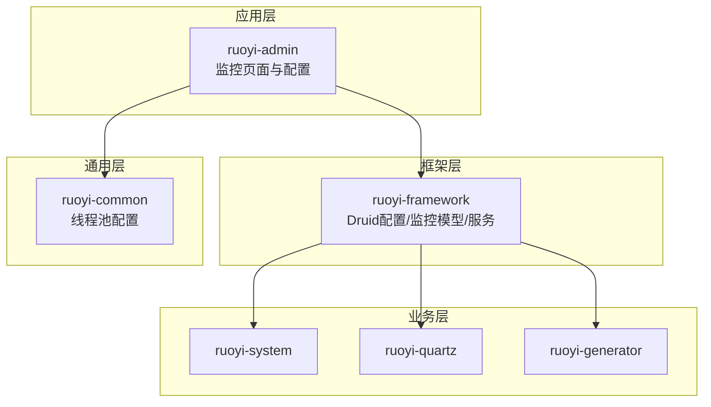
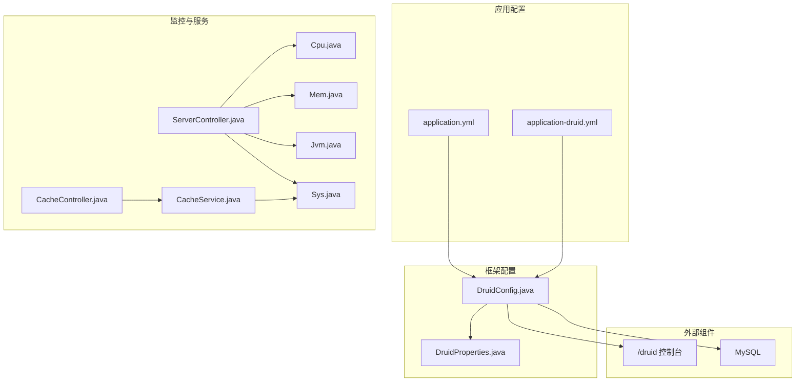
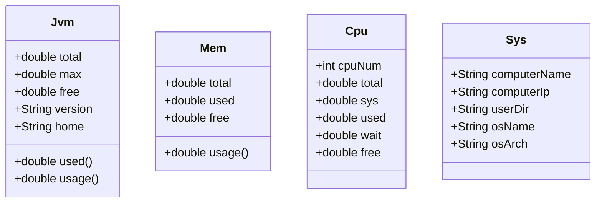
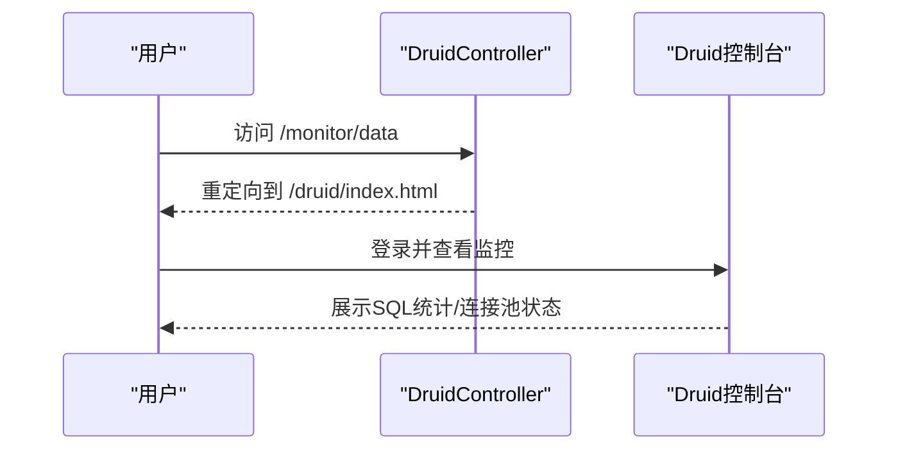
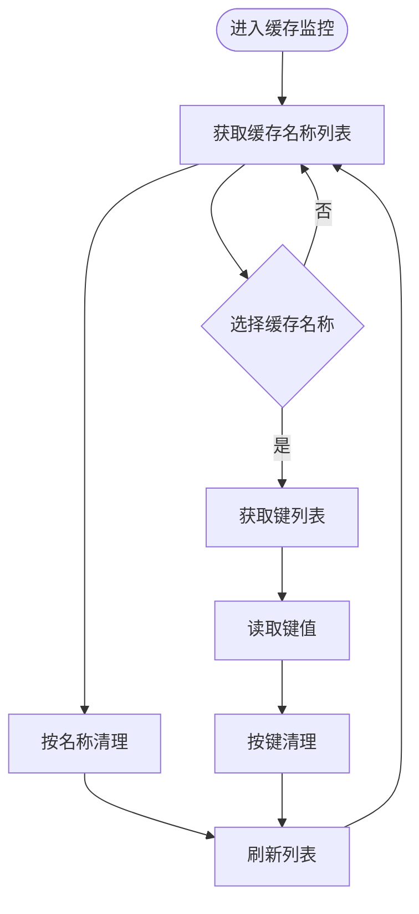
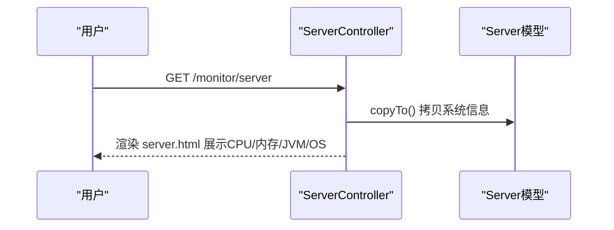
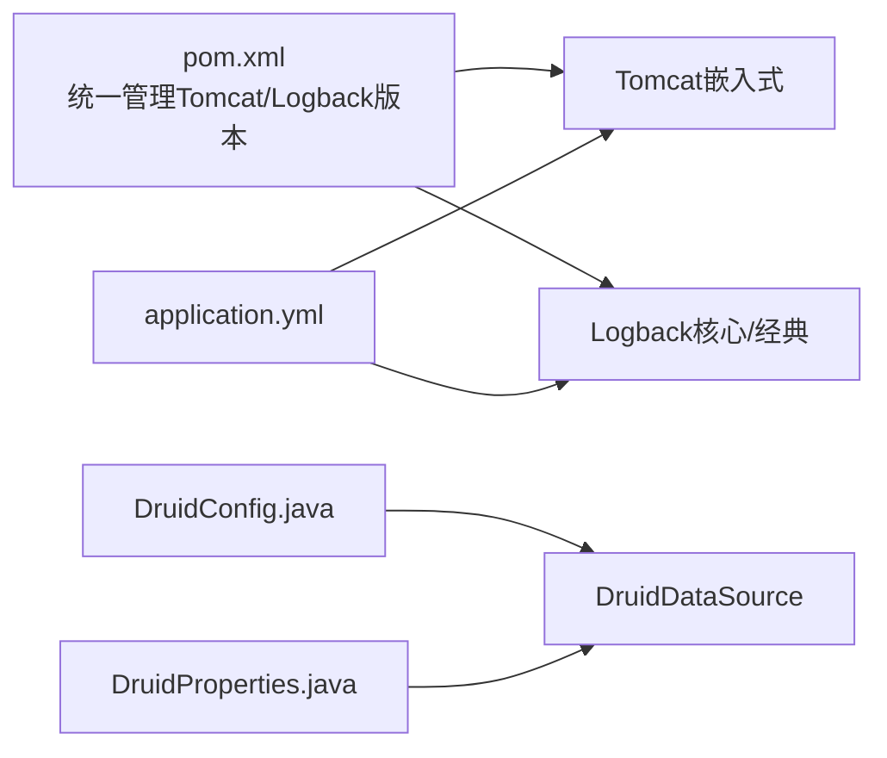

# 性能调优

<cite>
**本文引用的文件**   
- [application.yml](file://ruoyi-admin/src/main/resources/application.yml)
- [application-druid.yml](file://ruoyi-admin/src/main/resources/application-druid.yml)
- [DruidConfig.java](file://ruoyi-framework/src/main/java/com/ruoyi/framework/config/DruidConfig.java)
- [DruidProperties.java](file://ruoyi-framework/src/main/java/com/ruoyi/framework/config/properties/DruidProperties.java)
- [DruidController.java](file://ruoyi-admin/src/main/java/com/ruoyi/web/controller/monitor/DruidController.java)
- [CacheController.java](file://ruoyi-admin/src/main/java/com/ruoyi/web/controller/monitor/CacheController.java)
- [CacheService.java](file://ruoyi-framework/src/main/java/com/ruoyi/framework/web/service/CacheService.java)
- [ehcache-shiro.xml](file://ruoyi-admin/src/main/resources/ehcache/ehcache-shiro.xml)
- [ThreadPoolConfig.java](file://ruoyi-common/src/main/java/com/ruoyi/common/config/thread/ThreadPoolConfig.java)
- [Cpu.java](file://ruoyi-framework/src/main/java/com/ruoyi/framework/web/domain/server/Cpu.java)
- [Mem.java](file://ruoyi-framework/src/main/java/com/ruoyi/framework/web/domain/server/Mem.java)
- [Jvm.java](file://ruoyi-framework/src/main/java/com/ruoyi/framework/web/domain/server/Jvm.java)
- [Sys.java](file://ruoyi-framework/src/main/java/com/ruoyi/framework/web/domain/server/Sys.java)
- [ServerController.java](file://ruoyi-admin/src/main/java/com/ruoyi/web/controller/monitor/ServerController.java)
- [server.html](file://ruoyi-admin/src/main/resources/templates/monitor/server/server.html)
- [pom.xml](file://pom.xml)
</cite>

## 目录
1. [简介](#简介)
2. [项目结构](#项目结构)
3. [核心组件](#核心组件)
4. [架构总览](#架构总览)
5. [详细组件分析](#详细组件分析)
6. [依赖分析](#依赖分析)
7. [性能考量](#性能考量)
8. [故障排查指南](#故障排查指南)
9. [结论](#结论)
10. [附录](#附录)

## 简介
本指南面向运维与开发人员，围绕RuoYi系统在生产环境中的性能调优展开，重点覆盖以下方面：
- JVM参数优化策略：堆内存配置、垃圾回收器选择、性能监控参数
- 数据库连接池优化：Druid连接池配置、连接数限制、SQL监控设置
- 缓存策略调整：本地缓存与Ehcache配置、Redis缓存建议
- 系统监控指标解读：CPU使用率、内存与JVM指标、数据库连接池状态监控

本指南以仓库内现有配置与监控实现为依据，结合通用性能优化原则，给出可落地的建议与流程。

## 项目结构
RuoYi采用多模块结构，与性能调优相关的关键模块与文件如下：
- ruoyi-admin：前端模板与监控页面、应用配置入口
- ruoyi-framework：框架层，包含Druid配置、系统监控模型与服务
- ruoyi-common：通用配置与线程池配置
- ruoyi-system、ruoyi-quartz、ruoyi-generator：业务与调度模块（与性能调优间接相关）

**章节来源**
- [application.yml:16-33](file://ruoyi-admin/src/main/resources/application.yml#L16-L33)
- [pom.xml:59-95](file://pom.xml#L59-L95)

## 核心组件
- 应用配置与服务器参数：定义Tomcat线程池、日志级别、文件上传大小等
- Druid连接池：数据源配置、连接池参数、慢SQL与白墙过滤器
- 缓存监控：本地缓存名称、键列表、值读取与清理
- 系统监控：CPU、内存、JVM、操作系统信息模型与页面展示
- 线程池：通用线程池与定时任务线程池配置

**章节来源**
- [application.yml:17-33](file://ruoyi-admin/src/main/resources/application.yml#L17-L33)
- [application-druid.yml:20-41](file://ruoyi-admin/src/main/resources/application-druid.yml#L20-L41)
- [DruidConfig.java:35-79](file://ruoyi-framework/src/main/java/com/ruoyi/framework/config/DruidConfig.java#L35-L79)
- [CacheController.java:20-41](file://ruoyi-admin/src/main/java/com/ruoyi/web/controller/monitor/CacheController.java#L20-L41)
- [CacheService.java:15-85](file://ruoyi-framework/src/main/java/com/ruoyi/framework/web/service/CacheService.java#L15-L85)
- [ThreadPoolConfig.java:18-63](file://ruoyi-common/src/main/java/com/ruoyi/common/config/thread/ThreadPoolConfig.java#L18-L63)

## 架构总览
下图展示了与性能调优相关的核心交互：应用配置驱动服务器与连接池；监控控制器通过服务层读取系统与缓存信息；Druid控制台用于SQL与连接池可视化。

**图表来源**
- [application.yml:17-33](file://ruoyi-admin/src/main/resources/application.yml#L17-L33)
- [application-druid.yml:20-41](file://ruoyi-admin/src/main/resources/application-druid.yml#L20-L41)
- [DruidConfig.java:35-79](file://ruoyi-framework/src/main/java/com/ruoyi/framework/config/DruidConfig.java#L35-L79)
- [ServerController.java:18-31](file://ruoyi-admin/src/main/java/com/ruoyi/web/controller/monitor/ServerController.java#L18-L31)
- [CacheController.java:20-41](file://ruoyi-admin/src/main/java/com/ruoyi/web/controller/monitor/CacheController.java#L20-L41)
- [CacheService.java:15-85](file://ruoyi-framework/src/main/java/com/ruoyi/framework/web/service/CacheService.java#L15-L85)

## 详细组件分析

### 1) JVM参数优化策略
- 堆内存配置
  - 建议：根据容器/物理机内存与业务峰值QPS，设定初始堆与最大堆，避免频繁Full GC
  - 参考项：JVM内存模型字段与使用率计算，可用于监控阈值设定
- 垃圾回收器选择
  - 建议：低延迟场景优先ZGC/G1；吞吐优先场景可选G1/Parallel；需结合GC日志与停顿时间评估
  - 参考项：JVM内存与使用率指标可用于评估GC效果
- 性能监控参数
  - 建议：启用JFR、GC日志、类加载与编译统计；结合系统监控页面的JVM指标进行对比分析

**图表来源**
- [Jvm.java:12-83](file://ruoyi-framework/src/main/java/com/ruoyi/framework/web/domain/server/Jvm.java#L12-L83)
- [Mem.java:10-61](file://ruoyi-framework/src/main/java/com/ruoyi/framework/web/domain/server/Mem.java#L10-L61)
- [Cpu.java:10-101](file://ruoyi-framework/src/main/java/com/ruoyi/framework/web/domain/server/Cpu.java#L10-L101)
- [Sys.java:8-85](file://ruoyi-framework/src/main/java/com/ruoyi/framework/web/domain/server/Sys.java#L8-L85)

**章节来源**
- [Jvm.java:12-83](file://ruoyi-framework/src/main/java/com/ruoyi/framework/web/domain/server/Jvm.java#L12-L83)
- [Mem.java:10-61](file://ruoyi-framework/src/main/java/com/ruoyi/framework/web/domain/server/Mem.java#L10-L61)
- [Cpu.java:10-101](file://ruoyi-framework/src/main/java/com/ruoyi/framework/web/domain/server/Cpu.java#L10-L101)
- [Sys.java:8-85](file://ruoyi-framework/src/main/java/com/ruoyi/framework/web/domain/server/Sys.java#L8-L85)
- [server.html:141-164](file://ruoyi-admin/src/main/resources/templates/monitor/server/server.html#L141-L164)

### 2) 数据库连接池优化（Druid）
- 连接池参数
  - 初始连接数、最小空闲、最大活跃、获取连接最大等待、连接/套接字超时、空闲连接检测周期与生命周期
- SQL监控
  - 统计过滤器、慢SQL阈值、SQL合并、白名单墙配置
- 控制台访问
  - StatViewServlet白名单、登录凭据、URL模式

**图表来源**
- [DruidController.java:14-26](file://ruoyi-admin/src/main/java/com/ruoyi/web/controller/monitor/DruidController.java#L14-L26)
- [application-druid.yml:44-51](file://ruoyi-admin/src/main/resources/application-druid.yml#L44-L51)

**章节来源**
- [application-druid.yml:20-41](file://ruoyi-admin/src/main/resources/application-druid.yml#L20-L41)
- [application-druid.yml:52-61](file://ruoyi-admin/src/main/resources/application-druid.yml#L52-L61)
- [DruidConfig.java:35-79](file://ruoyi-framework/src/main/java/com/ruoyi/framework/config/DruidConfig.java#L35-L79)
- [DruidProperties.java:14-74](file://ruoyi-framework/src/main/java/com/ruoyi/framework/config/properties/DruidProperties.java#L14-L74)

### 3) 缓存策略调整
- 本地缓存与Ehcache
  - Ehcache默认缓存与登录记录缓存配置，包含堆内最大元素、TTL/空闲时间、溢出磁盘等
  - 缓存监控页面支持列出缓存名称、键列表、读取值、按名称清理
- Redis缓存建议
  - 使用Spring Cache或RedisTemplate进行热点数据缓存
  - 配置序列化策略、过期时间、键空间命名规范、哨兵/集群部署
  - 结合监控页面进行缓存命中率与容量观察

**图表来源**
- [CacheController.java:20-41](file://ruoyi-admin/src/main/java/com/ruoyi/web/controller/monitor/CacheController.java#L20-L41)
- [CacheService.java:15-85](file://ruoyi-framework/src/main/java/com/ruoyi/framework/web/service/CacheService.java#L15-L85)
- [ehcache-shiro.xml:16-28](file://ruoyi-admin/src/main/resources/ehcache/ehcache-shiro.xml#L16-L28)

**章节来源**
- [CacheController.java:20-41](file://ruoyi-admin/src/main/java/com/ruoyi/web/controller/monitor/CacheController.java#L20-L41)
- [CacheService.java:15-85](file://ruoyi-framework/src/main/java/com/ruoyi/framework/web/service/CacheService.java#L15-L85)
- [ehcache-shiro.xml:16-28](file://ruoyi-admin/src/main/resources/ehcache/ehcache-shiro.xml#L16-L28)

### 4) 系统监控指标解读
- CPU使用率
  - 核心数、总使用率、系统/用户使用率、等待率、空闲率
- 内存与JVM
  - 系统内存总量/已用/剩余、使用率；JVM总/最大/空闲、使用率、版本与启动信息
- 数据库连接池状态
  - 通过Druid控制台查看活跃/空闲连接、SQL执行统计、慢SQL

**图表来源**
- [ServerController.java:18-31](file://ruoyi-admin/src/main/java/com/ruoyi/web/controller/monitor/ServerController.java#L18-L31)
- [server.html:1-164](file://ruoyi-admin/src/main/resources/templates/monitor/server/server.html#L1-164)

**章节来源**
- [Cpu.java:10-101](file://ruoyi-framework/src/main/java/com/ruoyi/framework/web/domain/server/Cpu.java#L10-L101)
- [Mem.java:10-61](file://ruoyi-framework/src/main/java/com/ruoyi/framework/web/domain/server/Mem.java#L10-L61)
- [Jvm.java:12-83](file://ruoyi-framework/src/main/java/com/ruoyi/framework/web/domain/server/Jvm.java#L12-L83)
- [Sys.java:8-85](file://ruoyi-framework/src/main/java/com/ruoyi/framework/web/domain/server/Sys.java#L8-L85)
- [server.html:1-164](file://ruoyi-admin/src/main/resources/templates/monitor/server/server.html#L1-164)

### 5) 线程池与异步处理
- 通用线程池
  - 核心/最大线程数、队列容量、空闲存活时间、拒绝策略
- 定时任务线程池
  - 调度线程池与异常打印钩子，便于定位任务执行问题

**章节来源**
- [ThreadPoolConfig.java:18-63](file://ruoyi-common/src/main/java/com/ruoyi/common/config/thread/ThreadPoolConfig.java#L18-L63)

## 依赖分析
- Tomcat嵌入式版本与日志实现由顶层pom统一管理，确保与应用配置一致
- Druid作为数据源，配合DruidConfig与DruidProperties进行装配与参数注入

**图表来源**
- [pom.xml:59-95](file://pom.xml#L59-L95)
- [application.yml:17-33](file://ruoyi-admin/src/main/resources/application.yml#L17-L33)
- [DruidConfig.java:35-79](file://ruoyi-framework/src/main/java/com/ruoyi/framework/config/DruidConfig.java#L35-L79)
- [DruidProperties.java:14-74](file://ruoyi-framework/src/main/java/com/ruoyi/framework/config/properties/DruidProperties.java#L14-L74)

**章节来源**
- [pom.xml:59-95](file://pom.xml#L59-L95)
- [application.yml:17-33](file://ruoyi-admin/src/main/resources/application.yml#L17-L33)
- [DruidConfig.java:35-79](file://ruoyi-framework/src/main/java/com/ruoyi/framework/config/DruidConfig.java#L35-L79)
- [DruidProperties.java:14-74](file://ruoyi-framework/src/main/java/com/ruoyi/framework/config/properties/DruidProperties.java#L14-L74)

## 性能考量
- JVM
  - 建议结合系统监控页面的JVM指标与GC日志，动态调整堆大小与回收器
  - 对于高并发短请求场景，优先降低停顿；对于批处理场景，优先吞吐
- 数据库
  - 依据业务峰值QPS与平均响应时间，合理设置Druid最大活跃连接数与等待超时
  - 启用慢SQL监控，定期复盘慢查询与锁等待
- 缓存
  - 本地缓存适用于热点小对象；大对象与跨节点共享建议Redis
  - 配置合理的TTL与淘汰策略，结合监控页面观察命中率
- 线程池
  - IO密集型任务适当增大最大线程数；CPU密集型任务与核心数匹配
  - 队列容量与拒绝策略需结合SLA与异常处理能力

## 故障排查指南
- 连接池耗尽
  - 现象：请求阻塞、超时上升
  - 排查：查看Druid控制台连接池状态、慢SQL、等待时间；核对maxActive与maxWait
- 缓存雪崩/穿透
  - 现象：瞬时大量未命中导致后端压力骤增
  - 排查：确认热点键TTL与互斥更新；检查缓存名称与键列表
- 系统CPU飙升
  - 现象：CPU使用率异常升高
  - 排查：结合CPU/内存/JVM监控页面定位热点线程与GC
- 线程池拒绝
  - 现象：任务被拒绝
  - 排查：检查拒绝策略与队列容量，评估任务类型与线程数

**章节来源**
- [application-druid.yml:20-41](file://ruoyi-admin/src/main/resources/application-druid.yml#L20-L41)
- [CacheController.java:20-41](file://ruoyi-admin/src/main/java/com/ruoyi/web/controller/monitor/CacheController.java#L20-L41)
- [CacheService.java:15-85](file://ruoyi-framework/src/main/java/com/ruoyi/framework/web/service/CacheService.java#L15-L85)
- [ThreadPoolConfig.java:18-63](file://ruoyi-common/src/main/java/com/ruoyi/common/config/thread/ThreadPoolConfig.java#L18-L63)

## 结论
本指南基于RuoYi现有配置与监控实现，给出了JVM、数据库连接池、缓存与线程池的优化思路与排障路径。建议在生产环境中持续观测系统监控页面与Druid控制台，并结合业务增长趋势迭代调参，以获得稳定且高性能的运行表现。

## 附录
- 关键配置参考路径
  - [application.yml:17-33](file://ruoyi-admin/src/main/resources/application.yml#L17-L33)
  - [application-druid.yml:20-41](file://ruoyi-admin/src/main/resources/application-druid.yml#L20-L41)
  - [DruidConfig.java:35-79](file://ruoyi-framework/src/main/java/com/ruoyi/framework/config/DruidConfig.java#L35-L79)
  - [DruidProperties.java:14-74](file://ruoyi-framework/src/main/java/com/ruoyi/framework/config/properties/DruidProperties.java#L14-L74)
  - [CacheController.java:20-41](file://ruoyi-admin/src/main/java/com/ruoyi/web/controller/monitor/CacheController.java#L20-L41)
  - [CacheService.java:15-85](file://ruoyi-framework/src/main/java/com/ruoyi/framework/web/service/CacheService.java#L15-L85)
  - [ThreadPoolConfig.java:18-63](file://ruoyi-common/src/main/java/com/ruoyi/common/config/thread/ThreadPoolConfig.java#L18-L63)
  - [server.html:1-164](file://ruoyi-admin/src/main/resources/templates/monitor/server/server.html#L1-164)