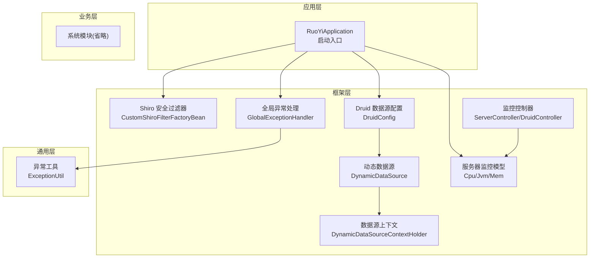
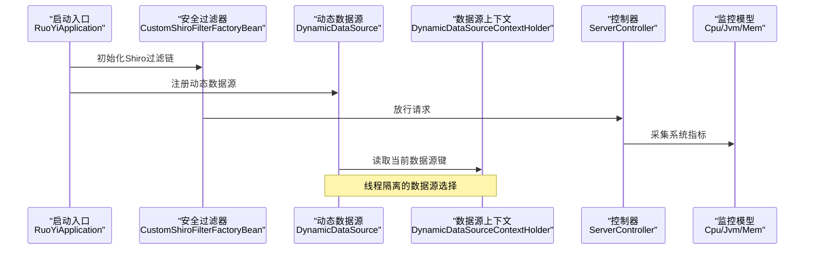
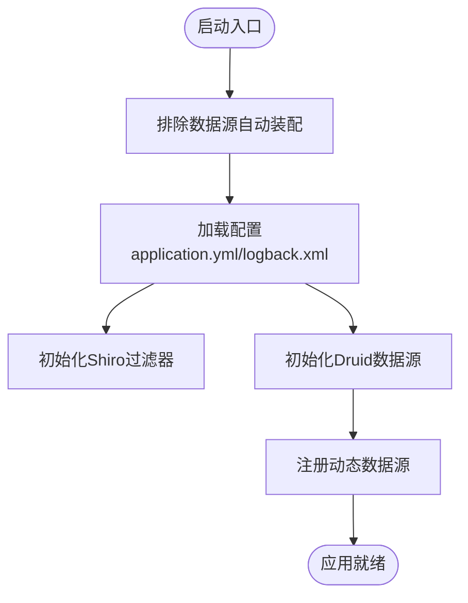
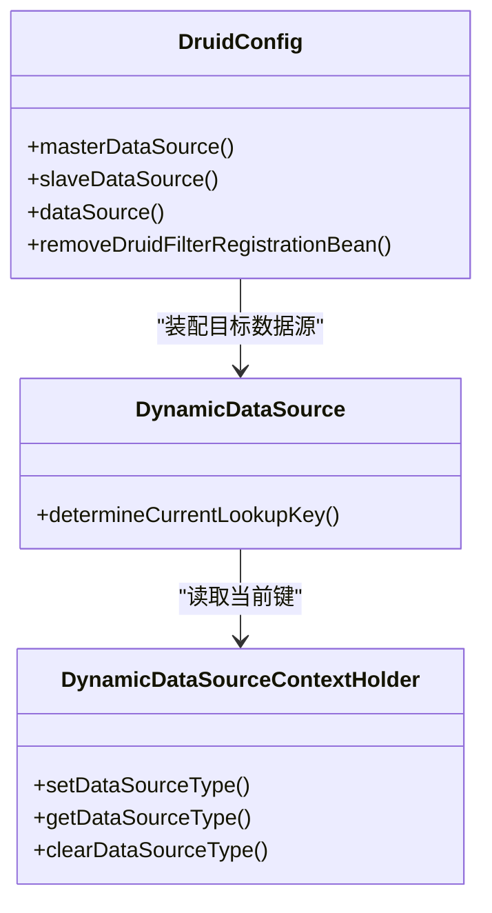
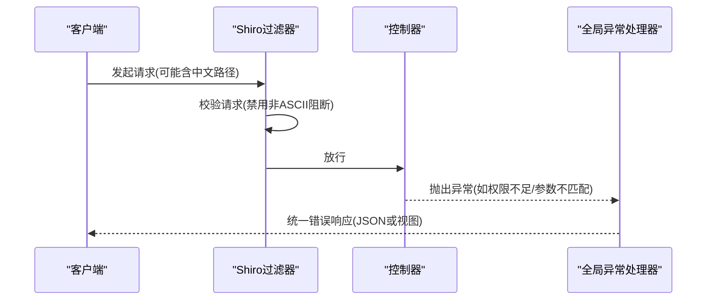
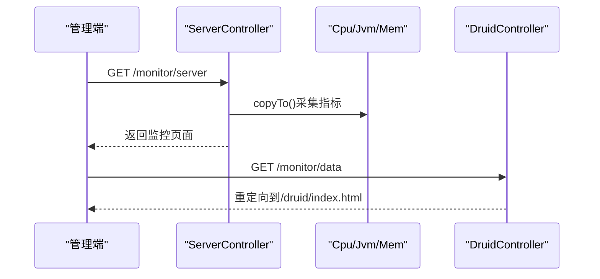
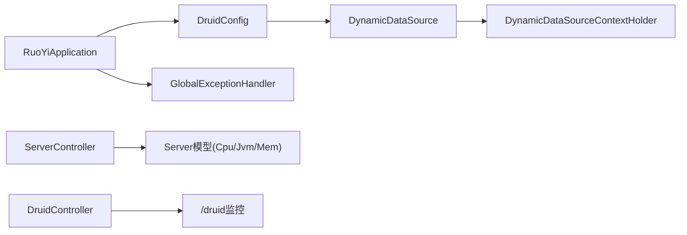

# 故障排查

<cite>
**本文引用的文件**
- [application.yml](file://ruoyi-admin/src/main/resources/application.yml)
- [logback.xml](file://ruoyi-admin/src/main/resources/logback.xml)
- [RuoYiApplication.java](file://ruoyi-admin/src/main/java/com/ruoyi/RuoYiApplication.java)
- [DruidConfig.java](file://ruoyi-framework/src/main/java/com/ruoyi/framework/config/DruidConfig.java)
- [DynamicDataSourceContextHolder.java](file://ruoyi-common/src/main/java/com/ruoyi/common/config/datasource/DynamicDataSourceContextHolder.java)
- [DynamicDataSource.java](file://ruoyi-framework/src/main/java/com/ruoyi/framework/datasource/DynamicDataSource.java)
- [CustomShiroFilterFactoryBean.java](file://ruoyi-framework/src/main/java/com/ruoyi/framework/shiro/web/CustomShiroFilterFactoryBean.java)
- [GlobalExceptionHandler.java](file://ruoyi-framework/src/main/java/com/ruoyi/framework/web/exception/GlobalExceptionHandler.java)
- [Cpu.java](file://ruoyi-framework/src/main/java/com/ruoyi/framework/web/domain/server/Cpu.java)
- [Jvm.java](file://ruoyi-framework/src/main/java/com/ruoyi/framework/web/domain/server/Jvm.java)
- [Mem.java](file://ruoyi-framework/src/main/java/com/ruoyi/framework/web/domain/server/Mem.java)
- [ServerController.java](file://ruoyi-admin/src/main/java/com/ruoyi/web/controller/monitor/ServerController.java)
- [DruidController.java](file://ruoyi-admin/src/main/java/com/ruoyi/web/controller/monitor/DruidController.java)
- [ExceptionUtil.java](file://ruoyi-common/src/main/java/com/ruoyi/common/utils/ExceptionUtil.java)
</cite>

## 目录
1. [简介](#简介)
2. [项目结构](#项目结构)
3. [核心组件](#核心组件)
4. [架构总览](#架构总览)
5. [详细组件分析](#详细组件分析)
6. [依赖分析](#依赖分析)
7. [性能考虑](#性能考虑)
8. [故障排查指南](#故障排查指南)
9. [结论](#结论)
10. [附录](#附录)

## 简介
本手册面向RuoYi系统的运维与开发人员，聚焦于常见故障的诊断与处置，涵盖启动失败、数据库连接异常、权限验证错误、性能问题等场景。内容包括日志分析技巧、系统监控指标解读、JVM与数据库调优建议、缓存策略调整以及紧急故障处理与数据恢复流程。文档中的所有技术细节均来自仓库内实际代码与配置文件，并通过图示与来源标注帮助快速定位问题根因。

## 项目结构
RuoYi采用多模块分层架构：admin前端控制器与模板、framework框架层（安全、数据源、监控）、common通用工具与实体、system业务模块、quartz定时任务模块、generator代码生成模块，以及sql脚本资源。应用启动入口位于admin模块，框架层负责安全、数据源动态切换、全局异常处理与监控采集，common提供工具与常量，system承载业务表与服务。

**图表来源**
- [RuoYiApplication.java:1-29](file://ruoyi-admin/src/main/java/com/ruoyi/RuoYiApplication.java#L1-L29)
- [CustomShiroFilterFactoryBean.java:1-85](file://ruoyi-framework/src/main/java/com/ruoyi/framework/shiro/web/CustomShiroFilterFactoryBean.java#L1-L85)
- [DruidConfig.java:1-129](file://ruoyi-framework/src/main/java/com/ruoyi/framework/config/DruidConfig.java#L1-L129)
- [DynamicDataSource.java:1-27](file://ruoyi-framework/src/main/java/com/ruoyi/framework/datasource/DynamicDataSource.java#L1-L27)
- [DynamicDataSourceContextHolder.java:1-46](file://ruoyi-common/src/main/java/com/ruoyi/common/config/datasource/DynamicDataSourceContextHolder.java#L1-L46)
- [GlobalExceptionHandler.java:1-150](file://ruoyi-framework/src/main/java/com/ruoyi/framework/web/exception/GlobalExceptionHandler.java#L1-L150)
- [Cpu.java:1-102](file://ruoyi-framework/src/main/java/com/ruoyi/framework/web/domain/server/Cpu.java#L1-L102)
- [Jvm.java:1-131](file://ruoyi-framework/src/main/java/com/ruoyi/framework/web/domain/server/Jvm.java#L1-L131)
- [Mem.java:1-62](file://ruoyi-framework/src/main/java/com/ruoyi/framework/web/domain/server/Mem.java#L1-L62)
- [ServerController.java:1-32](file://ruoyi-admin/src/main/java/com/ruoyi/web/controller/monitor/ServerController.java#L1-L32)
- [DruidController.java:1-27](file://ruoyi-admin/src/main/java/com/ruoyi/web/controller/monitor/DruidController.java#L1-L27)
- [ExceptionUtil.java:1-68](file://ruoyi-common/src/main/java/com/ruoyi/common/utils/ExceptionUtil.java#L1-L68)

**章节来源**
- [RuoYiApplication.java:1-29](file://ruoyi-admin/src/main/java/com/ruoyi/RuoYiApplication.java#L1-L29)
- [application.yml:1-154](file://ruoyi-admin/src/main/resources/application.yml#L1-L154)
- [logback.xml:1-93](file://ruoyi-admin/src/main/resources/logback.xml#L1-L93)

## 核心组件
- 启动入口与排除自动装配：应用启动类排除数据源自动装配，由框架层统一管理数据源与安全。
- 安全过滤器：自定义Shiro过滤器工厂，修复中文路径导致的400问题，确保URL中文解析正确。
- 数据源配置：Druid多数据源配置，支持主从切换与动态数据源路由。
- 动态数据源上下文：基于ThreadLocal的数据源切换上下文，保证请求线程内的数据源一致性。
- 全局异常处理：集中捕获权限校验、请求方式不支持、业务异常等，统一返回JSON或视图。
- 监控模型：CPU、内存、JVM指标封装，配合监控控制器展示系统健康度。
- 日志配置：Logback按级别与文件滚动输出，控制台与文件双通道，便于问题定位。

**章节来源**
- [RuoYiApplication.java:12-28](file://ruoyi-admin/src/main/java/com/ruoyi/RuoYiApplication.java#L12-L28)
- [CustomShiroFilterFactoryBean.java:21-65](file://ruoyi-framework/src/main/java/com/ruoyi/framework/shiro/web/CustomShiroFilterFactoryBean.java#L21-L65)
- [DruidConfig.java:32-79](file://ruoyi-framework/src/main/java/com/ruoyi/framework/config/DruidConfig.java#L32-L79)
- [DynamicDataSourceContextHolder.java:11-45](file://ruoyi-common/src/main/java/com/ruoyi/common/config/datasource/DynamicDataSourceContextHolder.java#L11-L45)
- [DynamicDataSource.java:13-27](file://ruoyi-framework/src/main/java/com/ruoyi/framework/datasource/DynamicDataSource.java#L13-L27)
- [GlobalExceptionHandler.java:28-149](file://ruoyi-framework/src/main/java/com/ruoyi/framework/web/exception/GlobalExceptionHandler.java#L28-L149)
- [Cpu.java:10-102](file://ruoyi-framework/src/main/java/com/ruoyi/framework/web/domain/server/Cpu.java#L10-L102)
- [Jvm.java:12-131](file://ruoyi-framework/src/main/java/com/ruoyi/framework/web/domain/server/Jvm.java#L12-L131)
- [Mem.java:10-62](file://ruoyi-framework/src/main/java/com/ruoyi/framework/web/domain/server/Mem.java#L10-L62)
- [logback.xml:74-93](file://ruoyi-admin/src/main/resources/logback.xml#L74-L93)

## 架构总览
下图展示了启动、请求处理、数据源路由与监控的关键交互：

**图表来源**
- [RuoYiApplication.java:15-28](file://ruoyi-admin/src/main/java/com/ruoyi/RuoYiApplication.java#L15-L28)
- [CustomShiroFilterFactoryBean.java:30-65](file://ruoyi-framework/src/main/java/com/ruoyi/framework/shiro/web/CustomShiroFilterFactoryBean.java#L30-L65)
- [DynamicDataSource.java:22-26](file://ruoyi-framework/src/main/java/com/ruoyi/framework/datasource/DynamicDataSource.java#L22-L26)
- [DynamicDataSourceContextHolder.java:24-44](file://ruoyi-common/src/main/java/com/ruoyi/common/config/datasource/DynamicDataSourceContextHolder.java#L24-L44)
- [ServerController.java:22-30](file://ruoyi-admin/src/main/java/com/ruoyi/web/controller/monitor/ServerController.java#L22-L30)
- [Cpu.java:10-102](file://ruoyi-framework/src/main/java/com/ruoyi/framework/web/domain/server/Cpu.java#L10-L102)
- [Jvm.java:12-131](file://ruoyi-framework/src/main/java/com/ruoyi/framework/web/domain/server/Jvm.java#L12-L131)
- [Mem.java:10-62](file://ruoyi-framework/src/main/java/com/ruoyi/framework/web/domain/server/Mem.java#L10-L62)

## 详细组件分析

### 启动与配置
- 启动类排除了数据源自动装配，避免重复初始化，由DruidConfig与DynamicDataSource统一接管。
- application.yml定义了服务器端口、Tomcat线程池、日志级别、Shiro参数、MyBatis与PageHelper等关键配置。
- logback.xml定义了控制台与文件输出、按级别过滤、滚动策略与自定义格式。

**图表来源**
- [RuoYiApplication.java:12-28](file://ruoyi-admin/src/main/java/com/ruoyi/RuoYiApplication.java#L12-L28)
- [application.yml:17-79](file://ruoyi-admin/src/main/resources/application.yml#L17-L79)
- [logback.xml:8-93](file://ruoyi-admin/src/main/resources/logback.xml#L8-L93)

**章节来源**
- [RuoYiApplication.java:12-28](file://ruoyi-admin/src/main/java/com/ruoyi/RuoYiApplication.java#L12-L28)
- [application.yml:17-79](file://ruoyi-admin/src/main/resources/application.yml#L17-L79)
- [logback.xml:74-93](file://ruoyi-admin/src/main/resources/logback.xml#L74-L93)

### 数据库连接与动态数据源
- DruidConfig提供master/slave数据源Bean，并通过DynamicDataSource聚合，结合ThreadLocal上下文实现请求级数据源切换。
- 当从配置中无法获取slave数据源时，DynamicDataSourceContextHolder会记录切换日志，便于排查。

**图表来源**
- [DruidConfig.java:35-79](file://ruoyi-framework/src/main/java/com/ruoyi/framework/config/DruidConfig.java#L35-L79)
- [DynamicDataSource.java:22-26](file://ruoyi-framework/src/main/java/com/ruoyi/framework/datasource/DynamicDataSource.java#L22-L26)
- [DynamicDataSourceContextHolder.java:24-44](file://ruoyi-common/src/main/java/com/ruoyi/common/config/datasource/DynamicDataSourceContextHolder.java#L24-L44)

**章节来源**
- [DruidConfig.java:35-79](file://ruoyi-framework/src/main/java/com/ruoyi/framework/config/DruidConfig.java#L35-L79)
- [DynamicDataSource.java:13-27](file://ruoyi-framework/src/main/java/com/ruoyi/framework/datasource/DynamicDataSource.java#L13-L27)
- [DynamicDataSourceContextHolder.java:11-45](file://ruoyi-common/src/main/java/com/ruoyi/common/config/datasource/DynamicDataSourceContextHolder.java#L11-L45)

### 权限验证与异常处理
- CustomShiroFilterFactoryBean在创建实例时设置InvalidRequestFilter的block非ASCII校验为false，避免中文路径导致400。
- GlobalExceptionHandler对授权失败、请求方式不支持、运行时异常、系统异常、业务异常、参数类型不匹配等进行分类处理，AJAX请求返回JSON，非AJAX跳转错误页面。

**图表来源**
- [CustomShiroFilterFactoryBean.java:53-65](file://ruoyi-framework/src/main/java/com/ruoyi/framework/shiro/web/CustomShiroFilterFactoryBean.java#L53-L65)
- [GlobalExceptionHandler.java:36-149](file://ruoyi-framework/src/main/java/com/ruoyi/framework/web/exception/GlobalExceptionHandler.java#L36-L149)

**章节来源**
- [CustomShiroFilterFactoryBean.java:21-65](file://ruoyi-framework/src/main/java/com/ruoyi/framework/shiro/web/CustomShiroFilterFactoryBean.java#L21-L65)
- [GlobalExceptionHandler.java:28-149](file://ruoyi-framework/src/main/java/com/ruoyi/framework/web/exception/GlobalExceptionHandler.java#L28-L149)

### 监控与指标
- ServerController提供系统监控页面，调用Server模型复制主机信息。
- Cpu/Jvm/Mem封装CPU使用率、内存使用率、JVM运行参数等指标。
- DruidController重定向至/druid监控页面，便于查看数据库连接池状态。

**图表来源**
- [ServerController.java:22-30](file://ruoyi-admin/src/main/java/com/ruoyi/web/controller/monitor/ServerController.java#L22-L30)
- [Cpu.java:10-102](file://ruoyi-framework/src/main/java/com/ruoyi/framework/web/domain/server/Cpu.java#L10-L102)
- [Jvm.java:12-131](file://ruoyi-framework/src/main/java/com/ruoyi/framework/web/domain/server/Jvm.java#L12-L131)
- [Mem.java:10-62](file://ruoyi-framework/src/main/java/com/ruoyi/framework/web/domain/server/Mem.java#L10-L62)
- [DruidController.java:20-26](file://ruoyi-admin/src/main/java/com/ruoyi/web/controller/monitor/DruidController.java#L20-L26)

**章节来源**
- [ServerController.java:16-31](file://ruoyi-admin/src/main/java/com/ruoyi/web/controller/monitor/ServerController.java#L16-L31)
- [Cpu.java:10-102](file://ruoyi-framework/src/main/java/com/ruoyi/framework/web/domain/server/Cpu.java#L10-L102)
- [Jvm.java:12-131](file://ruoyi-framework/src/main/java/com/ruoyi/framework/web/domain/server/Jvm.java#L12-L131)
- [Mem.java:10-62](file://ruoyi-framework/src/main/java/com/ruoyi/framework/web/domain/server/Mem.java#L10-L62)
- [DruidController.java:14-27](file://ruoyi-admin/src/main/java/com/ruoyi/web/controller/monitor/DruidController.java#L14-L27)

## 依赖分析
- 启动类排除数据源自动装配，避免与DruidConfig冲突。
- DruidConfig依赖DruidProperties与DynamicDataSource，实现主从数据源与动态路由。
- DynamicDataSource继承AbstractRoutingDataSource，通过ThreadLocal键决定当前数据源。
- GlobalExceptionHandler依赖权限工具与Servlet工具，统一处理各类异常。
- 监控控制器依赖Server模型，Server模型依赖Cpu/Jvm/Mem指标对象。

**图表来源**
- [RuoYiApplication.java:12-28](file://ruoyi-admin/src/main/java/com/ruoyi/RuoYiApplication.java#L12-L28)
- [DruidConfig.java:52-79](file://ruoyi-framework/src/main/java/com/ruoyi/framework/config/DruidConfig.java#L52-L79)
- [DynamicDataSource.java:13-27](file://ruoyi-framework/src/main/java/com/ruoyi/framework/datasource/DynamicDataSource.java#L13-L27)
- [DynamicDataSourceContextHolder.java:19-44](file://ruoyi-common/src/main/java/com/ruoyi/common/config/datasource/DynamicDataSourceContextHolder.java#L19-L44)
- [GlobalExceptionHandler.java:28-149](file://ruoyi-framework/src/main/java/com/ruoyi/framework/web/exception/GlobalExceptionHandler.java#L28-L149)
- [ServerController.java:22-30](file://ruoyi-admin/src/main/java/com/ruoyi/web/controller/monitor/ServerController.java#L22-L30)
- [DruidController.java:20-26](file://ruoyi-admin/src/main/java/com/ruoyi/web/controller/monitor/DruidController.java#L20-L26)

**章节来源**
- [RuoYiApplication.java:12-28](file://ruoyi-admin/src/main/java/com/ruoyi/RuoYiApplication.java#L12-L28)
- [DruidConfig.java:32-79](file://ruoyi-framework/src/main/java/com/ruoyi/framework/config/DruidConfig.java#L32-L79)
- [DynamicDataSource.java:13-27](file://ruoyi-framework/src/main/java/com/ruoyi/framework/datasource/DynamicDataSource.java#L13-L27)
- [GlobalExceptionHandler.java:28-149](file://ruoyi-framework/src/main/java/com/ruoyi/framework/web/exception/GlobalExceptionHandler.java#L28-L149)

## 性能考虑
- 线程池与连接数：application.yml中配置了Tomcat最大线程数、最小空闲线程与接受队列长度，需根据并发峰值与CPU核数调优。
- 日志级别：生产环境建议提升com.ruoyi日志级别至info，降低debug开销；保留ERROR级别以便快速定位异常。
- 数据库连接池：通过/druid监控页面观察活跃连接、空闲连接、等待计数与SQL拦截统计，识别慢查询与连接泄露。
- JVM参数：结合Jvm模型的运行时长、内存使用率与GC行为，调整堆大小、新生代比例与GC策略。
- 缓存策略：利用ehcache与Shiro缓存，合理设置TTL与淘汰策略，避免热点key导致缓存抖动。

[本节为通用指导，无需具体文件来源]

## 故障排查指南

### 启动失败
- 症状：应用无法启动或启动后立即退出。
- 排查步骤：
  - 检查启动类是否正确排除数据源自动装配。
  - 查看控制台输出与日志文件，确认是否有致命异常。
  - 核对application.yml中的server.port与端口占用情况。
- 关联文件：
  - [RuoYiApplication.java:12-28](file://ruoyi-admin/src/main/java/com/ruoyi/RuoYiApplication.java#L12-L28)
  - [application.yml:17-22](file://ruoyi-admin/src/main/resources/application.yml#L17-L22)
  - [logback.xml:79-87](file://ruoyi-admin/src/main/resources/logback.xml#L79-L87)

**章节来源**
- [RuoYiApplication.java:12-28](file://ruoyi-admin/src/main/java/com/ruoyi/RuoYiApplication.java#L12-L28)
- [application.yml:17-22](file://ruoyi-admin/src/main/resources/application.yml#L17-L22)
- [logback.xml:79-87](file://ruoyi-admin/src/main/resources/logback.xml#L79-L87)

### 数据库连接异常
- 症状：SQL执行报错、连接池耗尽、事务异常。
- 排查步骤：
  - 访问/druid监控页面，检查活跃连接、创建/销毁速率、SQL慢查询数量。
  - 在application.yml中确认spring.datasource.druid.*配置项是否正确。
  - 观察DynamicDataSourceContextHolder日志，确认是否存在频繁切换或未清理的上下文。
- 关联文件：
  - [DruidController.java:20-26](file://ruoyi-admin/src/main/java/com/ruoyi/web/controller/monitor/DruidController.java#L20-L26)
  - [DruidConfig.java:35-50](file://ruoyi-framework/src/main/java/com/ruoyi/framework/config/DruidConfig.java#L35-L50)
  - [DynamicDataSourceContextHolder.java:24-44](file://ruoyi-common/src/main/java/com/ruoyi/common/config/datasource/DynamicDataSourceContextHolder.java#L24-L44)

**章节来源**
- [DruidController.java:20-26](file://ruoyi-admin/src/main/java/com/ruoyi/web/controller/monitor/DruidController.java#L20-L26)
- [DruidConfig.java:35-50](file://ruoyi-framework/src/main/java/com/ruoyi/framework/config/DruidConfig.java#L35-L50)
- [DynamicDataSourceContextHolder.java:24-44](file://ruoyi-common/src/main/java/com/ruoyi/common/config/datasource/DynamicDataSourceContextHolder.java#L24-L44)

### 权限验证错误
- 症状：403权限不足、AJAX返回错误、页面跳转到未授权页。
- 排查步骤：
  - 检查Shiro过滤器是否正确设置InvalidRequestFilter的block非ASCII为false。
  - 查看GlobalExceptionHandler对AuthorizationException的处理分支，区分AJAX与非AJAX响应。
  - 确认用户角色与权限是否正确配置。
- 关联文件：
  - [CustomShiroFilterFactoryBean.java:53-59](file://ruoyi-framework/src/main/java/com/ruoyi/framework/shiro/web/CustomShiroFilterFactoryBean.java#L53-L59)
  - [GlobalExceptionHandler.java:36-49](file://ruoyi-framework/src/main/java/com/ruoyi/framework/web/exception/GlobalExceptionHandler.java#L36-L49)

**章节来源**
- [CustomShiroFilterFactoryBean.java:53-59](file://ruoyi-framework/src/main/java/com/ruoyi/framework/shiro/web/CustomShiroFilterFactoryBean.java#L53-L59)
- [GlobalExceptionHandler.java:36-49](file://ruoyi-framework/src/main/java/com/ruoyi/framework/web/exception/GlobalExceptionHandler.java#L36-L49)

### 性能问题
- 症状：CPU飙升、内存增长、接口响应缓慢。
- 排查步骤：
  - 通过ServerController页面查看CPU使用率、内存使用率与JVM运行时长。
  - 结合logback.xml的INFO/ERROR级别输出，定位高频异常与慢日志。
  - 使用/druid监控页面分析慢SQL与连接池状态。
- 关联文件：
  - [ServerController.java:22-30](file://ruoyi-admin/src/main/java/com/ruoyi/web/controller/monitor/ServerController.java#L22-L30)
  - [Cpu.java:10-102](file://ruoyi-framework/src/main/java/com/ruoyi/framework/web/domain/server/Cpu.java#L10-L102)
  - [Jvm.java:12-131](file://ruoyi-framework/src/main/java/com/ruoyi/framework/web/domain/server/Jvm.java#L12-L131)
  - [Mem.java:10-62](file://ruoyi-framework/src/main/java/com/ruoyi/framework/web/domain/server/Mem.java#L10-L62)
  - [logback.xml:74-93](file://ruoyi-admin/src/main/resources/logback.xml#L74-L93)
  - [DruidController.java:20-26](file://ruoyi-admin/src/main/java/com/ruoyi/web/controller/monitor/DruidController.java#L20-L26)

**章节来源**
- [ServerController.java:22-30](file://ruoyi-admin/src/main/java/com/ruoyi/web/controller/monitor/ServerController.java#L22-L30)
- [Cpu.java:10-102](file://ruoyi-framework/src/main/java/com/ruoyi/framework/web/domain/server/Cpu.java#L10-L102)
- [Jvm.java:12-131](file://ruoyi-framework/src/main/java/com/ruoyi/framework/web/domain/server/Jvm.java#L12-L131)
- [Mem.java:10-62](file://ruoyi-framework/src/main/java/com/ruoyi/framework/web/domain/server/Mem.java#L10-L62)
- [logback.xml:74-93](file://ruoyi-admin/src/main/resources/logback.xml#L74-L93)
- [DruidController.java:20-26](file://ruoyi-admin/src/main/java/com/ruoyi/web/controller/monitor/DruidController.java#L20-L26)

### 日志分析技巧
- 日志级别配置：在application.yml中调整com.ruoyi与org.springframework的日志级别；在logback.xml中设置root与logger级别。
- 关键信息定位：关注GlobalExceptionHandler记录的请求URI与异常堆栈；关注DynamicDataSourceContextHolder的切换日志。
- 错误堆栈分析：使用ExceptionUtil提取根因与异常链，判断是否由特定子异常引发。
- 输出通道：控制台用于实时调试，文件输出用于离线分析与归档。

**章节来源**
- [application.yml:34-40](file://ruoyi-admin/src/main/resources/application.yml#L34-L40)
- [logback.xml:74-93](file://ruoyi-admin/src/main/resources/logback.xml#L74-L93)
- [GlobalExceptionHandler.java:31-149](file://ruoyi-framework/src/main/java/com/ruoyi/framework/web/exception/GlobalExceptionHandler.java#L31-L149)
- [DynamicDataSourceContextHolder.java:24-28](file://ruoyi-common/src/main/java/com/ruoyi/common/config/datasource/DynamicDataSourceContextHolder.java#L24-L28)
- [ExceptionUtil.java:17-67](file://ruoyi-common/src/main/java/com/ruoyi/common/utils/ExceptionUtil.java#L17-L67)

### 监控指标解读
- CPU使用率：Cpu.total/sys/used/wait/free百分比反映系统负载与等待情况。
- 内存使用：Mem.total/used/free与Jvm的total/max/free/usage体现内存压力与泄漏风险。
- 连接池状态：通过/druid监控页面观察活跃/空闲连接、创建/销毁速率、慢查询计数与SQL拦截统计。
- 建议：结合ServerController页面与logback输出，形成“指标—日志—监控”的闭环分析。

**章节来源**
- [Cpu.java:10-102](file://ruoyi-framework/src/main/java/com/ruoyi/framework/web/domain/server/Cpu.java#L10-L102)
- [Jvm.java:12-131](file://ruoyi-framework/src/main/java/com/ruoyi/framework/web/domain/server/Jvm.java#L12-L131)
- [Mem.java:10-62](file://ruoyi-framework/src/main/java/com/ruoyi/framework/web/domain/server/Mem.java#L10-L62)
- [DruidController.java:20-26](file://ruoyi-admin/src/main/java/com/ruoyi/web/controller/monitor/DruidController.java#L20-L26)

### 性能调优指南
- JVM参数：依据Jvm模型的运行时长与内存使用率，调整堆大小、新生代比例与GC策略，减少Full GC频率。
- 数据库查询：通过/druid监控页面识别慢SQL，结合MyBatis日志与分页配置优化查询。
- 缓存策略：结合ehcache与Shiro缓存，设置合理的TTL与淘汰策略，避免热点key导致缓存抖动。
- 线程池：根据并发峰值与CPU核数，调整Tomcat线程池参数，避免排队过长与线程饥饿。

**章节来源**
- [Jvm.java:12-131](file://ruoyi-framework/src/main/java/com/ruoyi/framework/web/domain/server/Jvm.java#L12-L131)
- [application.yml:23-33](file://ruoyi-admin/src/main/resources/application.yml#L23-L33)
- [DruidController.java:20-26](file://ruoyi-admin/src/main/java/com/ruoyi/web/controller/monitor/DruidController.java#L20-L26)

### 紧急故障处理流程
- 快速止损：临时降低日志级别至WARN/ERROR，减少IO压力；必要时重启应用以释放异常状态。
- 证据保全：导出sys-error.log与/druid慢查询日志，保留异常堆栈与请求上下文。
- 修复验证：在测试环境复现问题，确认修复后再灰度发布。
- 回滚预案：准备最近一次稳定版本的部署包与数据库备份，确保可快速回滚。

**章节来源**
- [logback.xml:74-93](file://ruoyi-admin/src/main/resources/logback.xml#L74-L93)
- [DruidController.java:20-26](file://ruoyi-admin/src/main/java/com/ruoyi/web/controller/monitor/DruidController.java#L20-L26)

### 数据恢复方案
- 数据库备份：定期导出数据库快照，保留增量日志，确保可回滚到最近一致点。
- 配置回滚：若配置变更导致异常，回退到上一个稳定的application.yml与logback.xml版本。
- 缓存重建：在数据恢复后，重建或清空相关缓存，确保缓存与数据库一致。

**章节来源**
- [application.yml:1-154](file://ruoyi-admin/src/main/resources/application.yml#L1-154)
- [logback.xml:1-93](file://ruoyi-admin/src/main/resources/logback.xml#L1-93)

## 结论
本手册基于RuoYi的实际代码与配置，提供了从启动、数据源、安全、监控到性能与应急处理的完整排查路径。建议在生产环境中持续关注日志级别、连接池状态与关键指标，建立标准化的监控与告警机制，确保问题早发现、早处理、可追溯。

## 附录
- 常用端点与职责
  - /monitor/server：系统监控页面，展示CPU、内存、JVM指标。
  - /monitor/data：重定向至/druid监控页面，查看数据库连接池状态。
- 关键配置要点
  - server.port、tomcat线程池参数、日志级别、Shiro参数、MyBatis与PageHelper配置。

**章节来源**
- [ServerController.java:22-30](file://ruoyi-admin/src/main/java/com/ruoyi/web/controller/monitor/ServerController.java#L22-L30)
- [DruidController.java:20-26](file://ruoyi-admin/src/main/java/com/ruoyi/web/controller/monitor/DruidController.java#L20-L26)
- [application.yml:17-79](file://ruoyi-admin/src/main/resources/application.yml#L17-L79)