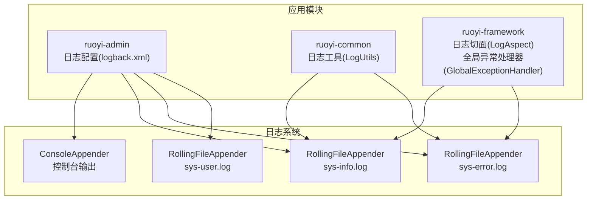
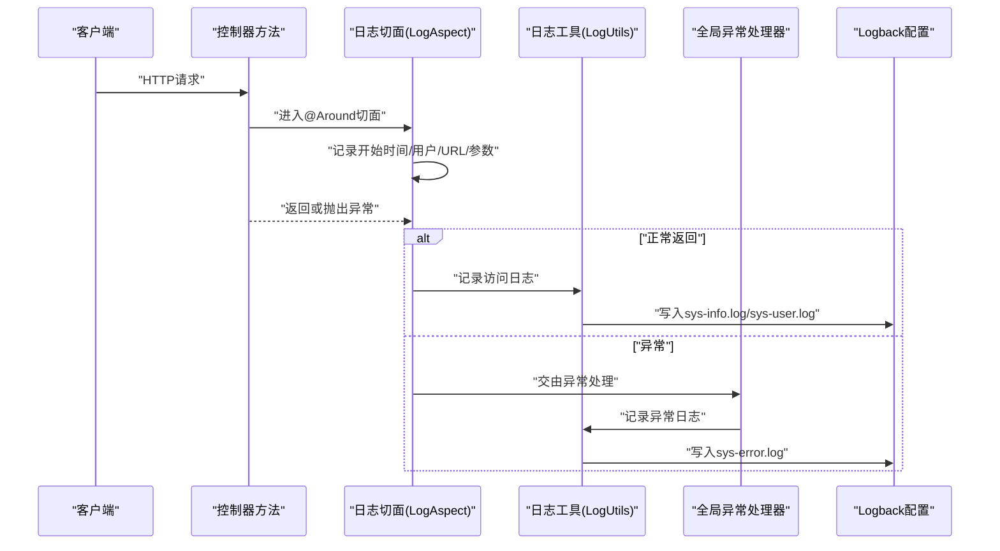
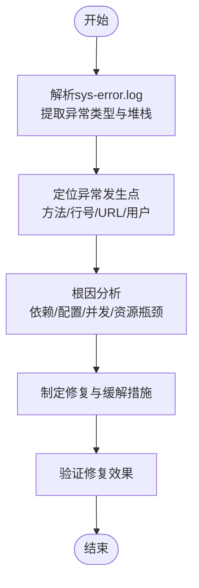
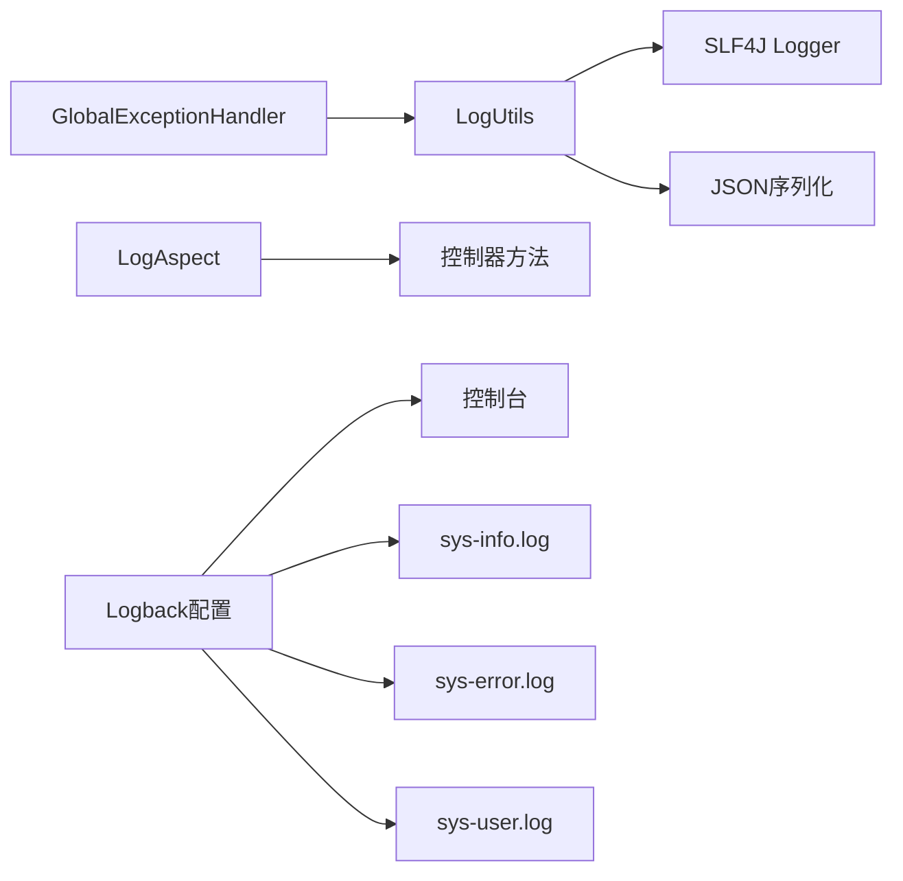

# 日志分析

<cite>
**本文引用的文件**
- [ruoyi-admin/src/main/resources/logback.xml](file://ruoyi-admin/src/main/resources/logback.xml)
- [ruoyi-common/src/main/java/com/ruoi/common/utils/LogUtils.java](file://ruoyi-common/src/main/java/com/ruoi/common/utils/LogUtils.java)
- [ruoyi-framework/src/main/java/com/ruoi/framework/aspectj/LogAspect.java](file://ruoyi-framework/src/main/java/com/ruoi/framework/aspectj/LogAspect.java)
- [ruoyi-framework/src/main/java/com/ruoi/framework/web/exception/GlobalExceptionHandler.java](file://ruoyi-framework/src/main/java/com/ruoi/framework/web/exception/GlobalExceptionHandler.java)
</cite>

## 目录
1. [简介](#简介)
2. [项目结构](#项目结构)
3. [核心组件](#核心组件)
4. [架构总览](#架构总览)
5. [详细组件分析](#详细组件分析)
6. [依赖分析](#依赖分析)
7. [性能考虑](#性能考虑)
8. [故障排查指南](#故障排查指南)
9. [结论](#结论)
10. [附录](#附录)

## 简介
本手册面向RuoYi系统的日志分析与运维实践，聚焦于Logback日志配置与日志级别策略，涵盖请求日志、业务日志、异常日志的定位方法，错误堆栈的识别与根因分析流程，并给出日志文件管理、轮转策略与监控告警的落地建议。读者可据此快速定位问题、优化日志策略并建立稳定可观测的日志体系。

## 项目结构
RuoYi采用多模块分层设计，日志能力主要由以下模块协同实现：
- 配置层：ruoyi-admin 提供Logback配置文件，定义日志输出位置、格式、滚动策略与级别过滤。
- 工具层：ruoyi-common 提供统一日志工具类，封装访问日志、异常日志等记录入口。
- 切面层：ruoyi-framework 的日志切面用于拦截控制器方法，自动采集请求上下文与耗时等信息。
- 异常层：ruoyi-framework 的全局异常处理器负责捕获未处理异常并落盘，确保异常可追溯。

图表来源
- [ruoyi-admin/src/main/resources/logback.xml:1-93](file://ruoyi-admin/src/main/resources/logback.xml#L1-L93)
- [ruoyi-common/src/main/java/com/ruoi/common/utils/LogUtils.java:1-136](file://ruoyi-common/src/main/java/com/ruoi/common/utils/LogUtils.java#L1-L136)
- [ruoyi-framework/src/main/java/com/ruoi/framework/aspectj/LogAspect.java](file://ruoyi-framework/src/main/java/com/ruoi/framework/aspectj/LogAspect.java)
- [ruoyi-framework/src/main/java/com/ruoi/framework/web/exception/GlobalExceptionHandler.java](file://ruoyi-framework/src/main/java/com/ruoi/framework/web/exception/GlobalExceptionHandler.java)

章节来源
- [ruoyi-admin/src/main/resources/logback.xml:1-93](file://ruoyi-admin/src/main/resources/logback.xml#L1-L93)

## 核心组件
- Logback配置文件：定义日志目录、输出格式、滚动策略、级别过滤与根/分类logger。
- 日志工具类：封装访问日志、页面错误日志、异常日志的统一记录入口。
- 日志切面：在控制器方法前后织入日志，采集用户、URL、参数、耗时等信息。
- 全局异常处理器：捕获未处理异常，统一格式化输出并落盘，便于根因分析。

章节来源
- [ruoyi-admin/src/main/resources/logback.xml:1-93](file://ruoyi-admin/src/main/resources/logback.xml#L1-L93)
- [ruoyi-common/src/main/java/com/ruoi/common/utils/LogUtils.java:1-136](file://ruoyi-common/src/main/java/com/ruoi/common/utils/LogUtils.java#L1-L136)
- [ruoyi-framework/src/main/java/com/ruoi/framework/aspectj/LogAspect.java](file://ruoyi-framework/src/main/java/com/ruoi/framework/aspectj/LogAspect.java)
- [ruoyi-framework/src/main/java/com/ruoi/framework/web/exception/GlobalExceptionHandler.java](file://ruoyi-framework/src/main/java/com/ruoi/framework/web/exception/GlobalExceptionHandler.java)

## 架构总览
下图展示从请求到日志落盘的关键路径，包括切面采集、工具类记录与异常处理器兜底：

图表来源
- [ruoyi-framework/src/main/java/com/ruoi/framework/aspectj/LogAspect.java](file://ruoyi-framework/src/main/java/com/ruoi/framework/aspectj/LogAspect.java)
- [ruoyi-common/src/main/java/com/ruoi/common/utils/LogUtils.java:1-136](file://ruoyi-common/src/main/java/com/ruoi/common/utils/LogUtils.java#L1-L136)
- [ruoyi-framework/src/main/java/com/ruoi/framework/web/exception/GlobalExceptionHandler.java](file://ruoyi-framework/src/main/java/com/ruoi/framework/web/exception/GlobalExceptionHandler.java)
- [ruoyi-admin/src/main/resources/logback.xml:1-93](file://ruoyi-admin/src/main/resources/logback.xml#L1-L93)

## 详细组件分析

### Logback配置与级别策略
- 日志目录与格式
  - 日志目录通过属性统一管理，便于集中运维与磁盘规划。
  - 输出格式包含时间戳、线程名、级别、Logger名、方法与行号、消息与换行符，便于快速定位。
- 控制台输出
  - 控制台Appender用于开发调试，建议在生产关闭或降低级别。
- 文件输出与滚动策略
  - 系统信息日志(sys-info.log)：按天滚动，保留60天；仅记录INFO及以上级别。
  - 系统错误日志(sys-error.log)：按天滚动，保留60天；仅记录ERROR级别，避免污染。
  - 用户访问日志(sys-user.log)：按天滚动，保留60天；记录所有级别，便于审计与追踪。
- 分级与命名空间
  - 根logger默认INFO并输出到控制台。
  - com.ruoyi包级别为INFO，避免框架噪声。
  - org.springframework级别为WARN，减少Spring内部噪音。
  - 自定义logger sys-user绑定到用户访问日志Appender，实现独立归档。

章节来源
- [ruoyi-admin/src/main/resources/logback.xml:1-93](file://ruoyi-admin/src/main/resources/logback.xml#L1-L93)

### 日志工具类：访问日志与异常日志
- 访问日志
  - 记录字段包含用户名、会话ID、IP、Accept头、User-Agent、URL、请求参数、Referer等，统一以方括号分隔，便于解析。
  - 通过专用Logger写入sys-user.log，便于与业务日志分离。
- 异常日志
  - 统一记录“异常”标识、当前用户、消息体，并携带异常堆栈。
  - 通过专用Logger写入sys-error.log，确保异常被单独归档以便检索。
- 页面错误日志
  - 捕获Servlet错误属性（状态码、URI、异常等），拼接后写入sys-error.log，便于前端错误溯源。

章节来源
- [ruoyi-common/src/main/java/com/ruoi/common/utils/LogUtils.java:1-136](file://ruoyi-common/src/main/java/com/ruoi/common/utils/LogUtils.java#L1-L136)

### 日志切面：请求生命周期日志
- 功能要点
  - 在控制器方法执行前后织入，记录用户、URL、参数、耗时等关键信息。
  - 将访问日志委托给日志工具类，确保格式一致与落盘规范。
- 适用场景
  - 快速定位慢接口、高错误率接口与异常请求。
  - 结合sys-user.log与业务日志，还原完整调用链。

章节来源
- [ruoyi-framework/src/main/java/com/ruoi/framework/aspectj/LogAspect.java](file://ruoyi-framework/src/main/java/com/ruoi/framework/aspectj/LogAspect.java)

### 全局异常处理器：兜底与可观测性
- 职责
  - 捕获未处理异常，统一格式化输出，避免敏感信息泄露。
  - 将异常信息写入sys-error.log，保证异常可追溯。
- 建议
  - 在生产环境开启，避免异常直接暴露给客户端。
  - 结合日志级别与过滤器，避免重复记录与噪声。

章节来源
- [ruoyi-framework/src/main/java/com/ruoi/framework/web/exception/GlobalExceptionHandler.java](file://ruoyi-framework/src/main/java/com/ruoi/framework/web/exception/GlobalExceptionHandler.java)

### 日志级别与适用场景
- DEBUG
  - 用途：开发调试、细粒度跟踪。
  - 建议：开发环境开启，生产关闭或提升至INFO以上，避免性能影响。
- INFO
  - 用途：常规业务事件、访问日志、关键流程节点。
  - 建议：生产默认级别，配合sys-info.log滚动归档。
- WARN
  - 用途：潜在风险、非致命异常、阈值警告。
  - 建议：结合监控告警，关注趋势变化。
- ERROR
  - 用途：异常、失败、错误事件。
  - 建议：严格落盘到sys-error.log，配合堆栈分析与根因定位。

章节来源
- [ruoyi-admin/src/main/resources/logback.xml:74-78](file://ruoyi-admin/src/main/resources/logback.xml#L74-L78)
- [ruoyi-common/src/main/java/com/ruoi/common/utils/LogUtils.java:56-104](file://ruoyi-common/src/main/java/com/ruoi/common/utils/LogUtils.java#L56-L104)

### 关键日志信息定位方法
- 请求日志
  - 关注sys-user.log中的用户、URL、参数、Referer字段，结合业务日志快速复现。
  - 使用日志检索工具按用户或URL聚合，定位高频异常请求。
- 业务日志
  - 关注sys-info.log中业务关键节点与耗时，结合切面日志还原调用链。
- 异常日志
  - 关注sys-error.log中的异常类型、堆栈与上下文，优先处理根因异常。

章节来源
- [ruoyi-common/src/main/java/com/ruoi/common/utils/LogUtils.java:28-104](file://ruoyi-common/src/main/java/com/ruoi/common/utils/LogUtils.java#L28-L104)
- [ruoyi-admin/src/main/resources/logback.xml:60-92](file://ruoyi-admin/src/main/resources/logback.xml#L60-L92)

### 错误堆栈分析方法
- 异常类型识别
  - 通过异常类名与消息快速判断是业务异常、参数异常还是系统异常。
- 调用链追踪
  - 结合切面日志中的方法与行号、请求参数与耗时，定位异常发生点。
- 根因分析
  - 从sys-error.log中提取异常堆栈，逐层向上追溯，确认上游依赖或配置问题。
  - 对重复异常进行聚合统计，识别热点问题与回归风险。

图表来源
- [ruoyi-common/src/main/java/com/ruoi/common/utils/LogUtils.java:56-104](file://ruoyi-common/src/main/java/com/ruoi/common/utils/LogUtils.java#L56-L104)
- [ruoyi-framework/src/main/java/com/ruoi/framework/aspectj/LogAspect.java](file://ruoyi-framework/src/main/java/com/ruoi/framework/aspectj/LogAspect.java)

## 依赖分析
- 配置依赖
  - 日志工具类依赖SLF4J与JSON序列化，确保日志格式化与可读性。
  - 切面依赖控制器方法签名与拦截机制，确保覆盖全量请求。
  - 全局异常处理器依赖Servlet错误属性与日志工具类，保证异常兜底。
- 运行时耦合
  - 日志工具类与Logback配置解耦，通过logger名称与appender绑定，便于灵活调整。
  - 滚动策略与级别过滤相互配合，避免日志风暴与存储压力。

图表来源
- [ruoyi-common/src/main/java/com/ruoi/common/utils/LogUtils.java:1-136](file://ruoyi-common/src/main/java/com/ruoi/common/utils/LogUtils.java#L1-L136)
- [ruoyi-framework/src/main/java/com/ruoi/framework/aspectj/LogAspect.java](file://ruoyi-framework/src/main/java/com/ruoi/framework/aspectj/LogAspect.java)
- [ruoyi-framework/src/main/java/com/ruoi/framework/web/exception/GlobalExceptionHandler.java](file://ruoyi-framework/src/main/java/com/ruoi/framework/web/exception/GlobalExceptionHandler.java)
- [ruoyi-admin/src/main/resources/logback.xml:1-93](file://ruoyi-admin/src/main/resources/logback.xml#L1-L93)

## 性能考虑
- 日志级别与过滤
  - 生产默认INFO，框架包设为WARN，减少I/O与CPU开销。
  - 使用LevelFilter精确过滤ERROR，避免无关日志干扰。
- 滚动策略
  - 按天滚动与最大历史天数限制，平衡存储占用与查询效率。
- 输出目标
  - 控制台输出仅用于开发调试，生产建议关闭或降级，避免阻塞主线程。
- 异步与缓冲
  - 可引入异步Appender与合适的队列容量，进一步降低对业务的影响。

## 故障排查指南
- 常见问题
  - 日志缺失：检查logger名称是否与配置匹配，确认appender引用是否正确。
  - 日志过多：调整级别或增加过滤器，启用按天滚动与最大历史。
  - 异常未落盘：确认全局异常处理器已生效，且异常日志写入路径存在权限。
- 排查步骤
  - 定位请求：在sys-user.log中根据URL与用户筛选。
  - 定位异常：在sys-error.log中按异常类名与堆栈搜索。
  - 复现验证：结合切面日志与业务日志，重放请求路径。
- 建议工具
  - 使用日志检索工具（如grep/ripgrep/ELK）进行批量过滤与聚合统计。
  - 对高频异常建立告警规则，缩短MTTR。

章节来源
- [ruoyi-admin/src/main/resources/logback.xml:74-92](file://ruoyi-admin/src/main/resources/logback.xml#L74-L92)
- [ruoyi-common/src/main/java/com/ruoi/common/utils/LogUtils.java:28-104](file://ruoyi-common/src/main/java/com/ruoi/common/utils/LogUtils.java#L28-L104)
- [ruoyi-framework/src/main/java/com/ruoi/framework/web/exception/GlobalExceptionHandler.java](file://ruoyi-framework/src/main/java/com/ruoi/framework/web/exception/GlobalExceptionHandler.java)

## 结论
通过规范的Logback配置、统一的日志工具与完善的切面/异常处理机制，RuoYi实现了对请求、业务与异常的全链路可观测。建议在生产环境中坚持“分级明确、滚动有序、落盘可靠”的原则，并结合监控告警与日志检索工具，持续优化日志策略与问题响应效率。

## 附录
- 日志文件与命名
  - sys-info.log：系统信息与业务日志
  - sys-error.log：异常与错误日志
  - sys-user.log：用户访问日志
- 建议的监控与告警
  - 对sys-error.log中的异常类型与频率设置阈值告警。
  - 对sys-user.log中的错误状态码与慢请求建立趋势监控。
- 最佳实践
  - 开发环境DEBUG，生产INFO/WARN/ERROR三级管理。
  - 所有异常必须经过全局异常处理器统一落盘。
  - 定期清理过期日志，保留必要历史以便审计与复盘。