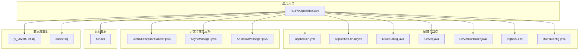
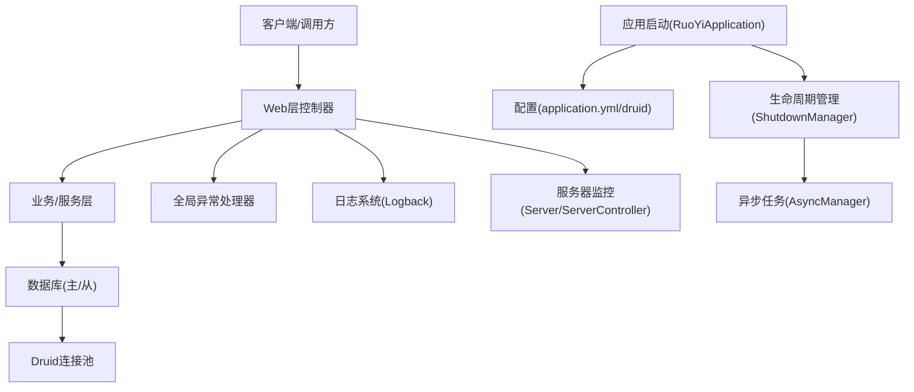
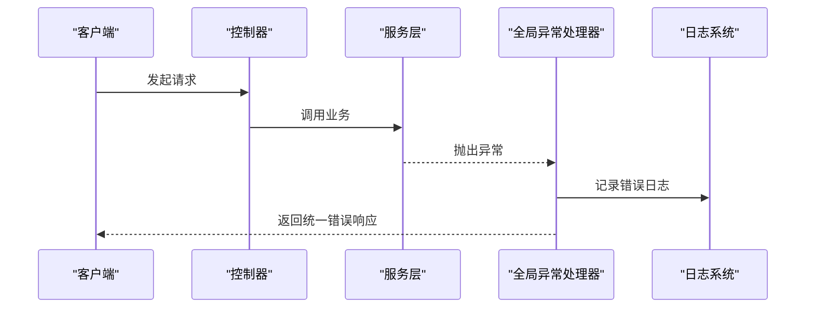
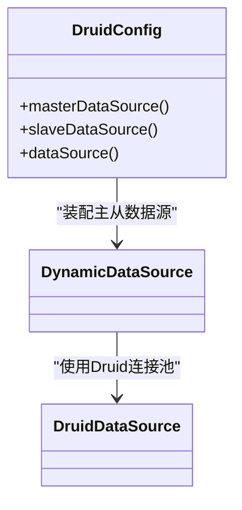
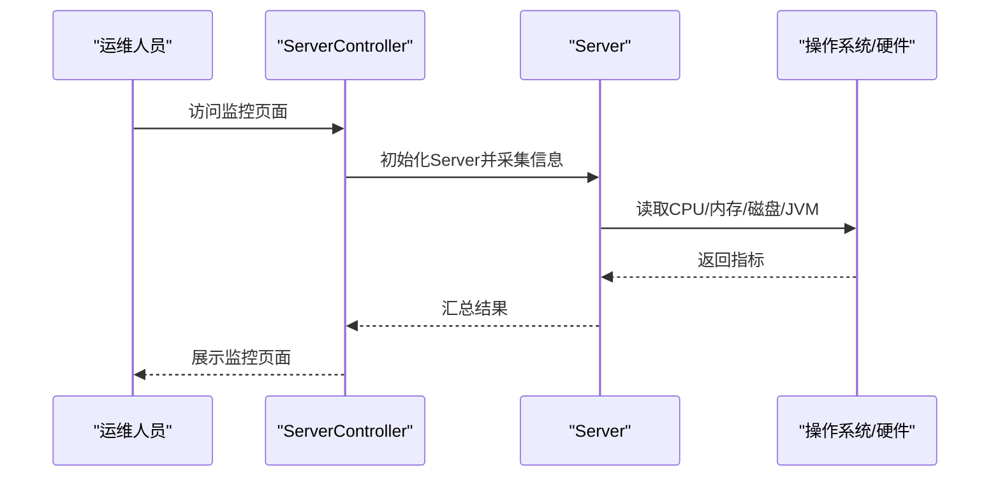
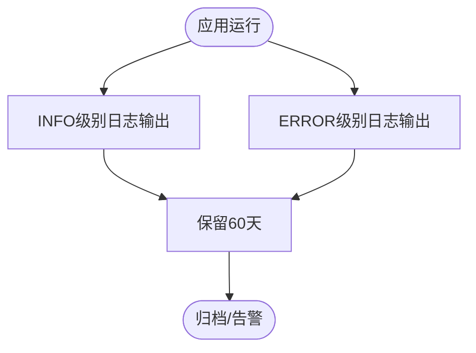
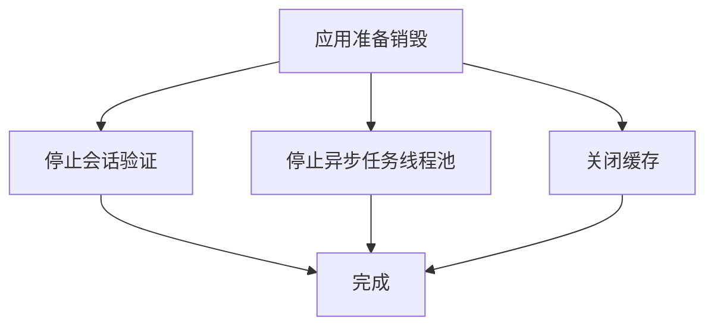
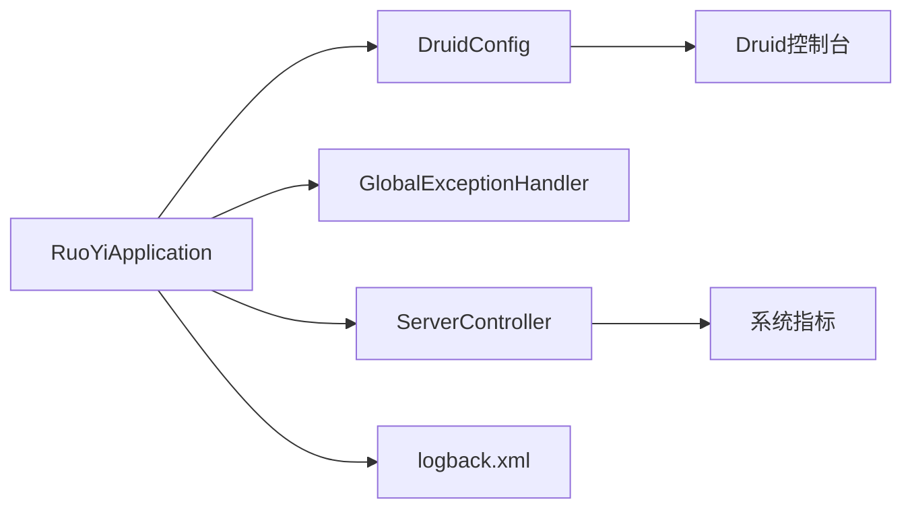

# 紧急故障处理

<cite>
**本文引用的文件**
- [RuoYiApplication.java](file://ruoyi-admin/src/main/java/com/ruoyi/RuoYiApplication.java)
- [application.yml](file://ruoyi-admin/src/main/resources/application.yml)
- [application-druid.yml](file://ruoyi-admin/src/main/resources/application-druid.yml)
- [DruidConfig.java](file://ruoyi-framework/src/main/java/com/ruoyi/framework/config/DruidConfig.java)
- [GlobalExceptionHandler.java](file://ruoyi-framework/src/main/java/com/ruoyi/framework/web/exception/GlobalExceptionHandler.java)
- [Server.java](file://ruoyi-framework/src/main/java/com/ruoyi/framework/web/domain/Server.java)
- [ServerController.java](file://ruoyi-admin/src/main/java/com/ruoyi/web/controller/monitor/ServerController.java)
- [logback.xml](file://ruoyi-admin/src/main/resources/logback.xml)
- [RuoYiConfig.java](file://ruoyi-common/src/main/java/com/ruoyi/common/config/RuoYiConfig.java)
- [AsyncManager.java](file://ruoyi-framework/src/main/java/com/ruoyi/framework/manager/AsyncManager.java)
- [ShutdownManager.java](file://ruoyi-framework/src/main/java/com/ruoyi/framework/manager/ShutdownManager.java)
- [run.bat](file://bin/run.bat)
- [ry_20260319.sql](file://sql/ry_20260319.sql)
- [quartz.sql](file://sql/quartz.sql)
</cite>

## 目录
1. [简介](#简介)
2. [项目结构](#项目结构)
3. [核心组件](#核心组件)
4. [架构总览](#架构总览)
5. [详细组件分析](#详细组件分析)
6. [依赖分析](#依赖分析)
7. [性能考虑](#性能考虑)
8. [故障排查指南](#故障排查指南)
9. [结论](#结论)
10. [附录](#附录)

## 简介
本手册面向RuoYi系统的紧急故障处理，围绕系统崩溃、数据库宕机、网络中断等典型场景，提供标准化的应急响应预案与标准操作程序（SOP）。内容涵盖故障发现与上报流程、故障隔离与恢复策略、数据备份与恢复方案、系统重启流程、服务降级策略、负载均衡切换与灾备启用建议，并明确故障分级、处理时限与责任分工，确保在紧急情况下能够快速、有序地处置。

## 项目结构
RuoYi采用多模块分层架构，核心模块包括：
- ruoyi-admin：Web应用入口与控制器层
- ruoyi-framework：框架支撑（配置、拦截、异常、监控、任务调度）
- ruoyi-common：通用工具、常量、异常基类
- ruoyi-system：业务模块（用户、菜单、字典、通知等）
- ruoyi-quartz：定时任务模块
- ruoyi-generator：代码生成模块
- sql：数据库脚本（含操作日志、定时任务表）

下图展示与故障处理密切相关的模块与文件关系：

图表来源
- [RuoYiApplication.java:1-29](file://ruoyi-admin/src/main/java/com/ruoyi/RuoYiApplication.java#L1-L29)
- [application.yml:1-154](file://ruoyi-admin/src/main/resources/application.yml#L1-L154)
- [application-druid.yml:1-61](file://ruoyi-admin/src/main/resources/application-druid.yml#L1-L61)
- [DruidConfig.java:1-129](file://ruoyi-framework/src/main/java/com/ruoyi/framework/config/DruidConfig.java#L1-L129)
- [Server.java:1-242](file://ruoyi-framework/src/main/java/com/ruoyi/framework/web/domain/Server.java#L1-L242)
- [ServerController.java:1-32](file://ruoyi-admin/src/main/java/com/ruoyi/web/controller/monitor/ServerController.java#L1-L32)
- [logback.xml:1-93](file://ruoyi-admin/src/main/resources/logback.xml#L1-L93)
- [RuoYiConfig.java:1-125](file://ruoyi-common/src/main/java/com/ruoyi/common/config/RuoYiConfig.java#L1-L125)
- [GlobalExceptionHandler.java:1-150](file://ruoyi-framework/src/main/java/com/ruoyi/framework/web/exception/GlobalExceptionHandler.java#L1-L150)
- [AsyncManager.java:1-56](file://ruoyi-framework/src/main/java/com/ruoyi/framework/manager/AsyncManager.java#L1-L56)
- [ShutdownManager.java:1-88](file://ruoyi-framework/src/main/java/com/ruoyi/framework/manager/ShutdownManager.java#L1-L88)
- [run.bat:1-14](file://bin/run.bat#L1-L14)
- [ry_20260319.sql:421-444](file://sql/ry_20260319.sql#L421-L444)
- [quartz.sql:86-128](file://sql/quartz.sql#L86-L128)

章节来源
- [RuoYiApplication.java:1-29](file://ruoyi-admin/src/main/java/com/ruoyi/RuoYiApplication.java#L1-L29)
- [application.yml:1-154](file://ruoyi-admin/src/main/resources/application.yml#L1-L154)
- [application-druid.yml:1-61](file://ruoyi-admin/src/main/resources/application-druid.yml#L1-L61)
- [DruidConfig.java:1-129](file://ruoyi-framework/src/main/java/com/ruoyi/framework/config/DruidConfig.java#L1-L129)
- [Server.java:1-242](file://ruoyi-framework/src/main/java/com/ruoyi/framework/web/domain/Server.java#L1-L242)
- [ServerController.java:1-32](file://ruoyi-admin/src/main/java/com/ruoyi/web/controller/monitor/ServerController.java#L1-L32)
- [logback.xml:1-93](file://ruoyi-admin/src/main/resources/logback.xml#L1-L93)
- [RuoYiConfig.java:1-125](file://ruoyi-common/src/main/java/com/ruoyi/common/config/RuoYiConfig.java#L1-L125)
- [GlobalExceptionHandler.java:1-150](file://ruoyi-framework/src/main/java/com/ruoyi/framework/web/exception/GlobalExceptionHandler.java#L1-L150)
- [AsyncManager.java:1-56](file://ruoyi-framework/src/main/java/com/ruoyi/framework/manager/AsyncManager.java#L1-L56)
- [ShutdownManager.java:1-88](file://ruoyi-framework/src/main/java/com/ruoyi/framework/manager/ShutdownManager.java#L1-L88)
- [run.bat:1-14](file://bin/run.bat#L1-L14)
- [ry_20260319.sql:421-444](file://sql/ry_20260319.sql#L421-L444)
- [quartz.sql:86-128](file://sql/quartz.sql#L86-L128)

## 核心组件
- 应用启动与配置
  - 启动类排除数据源自动装配，便于自定义数据源与动态路由
  - 通过application.yml与application-druid.yml集中配置服务端口、Tomcat线程池、Druid连接池、日志级别、Shiro、Swagger等
- 数据源与监控
  - DruidConfig提供主从数据源装配与动态数据源切换能力
  - Druid控制台用于慢SQL、连接池状态监控
- 异常处理
  - 全局异常处理器统一捕获授权、业务、运行时等异常，保障前后端一致的错误响应
- 服务器监控
  - Server与ServerController提供CPU、内存、JVM、磁盘等系统指标采集与页面展示
- 日志与配置
  - logback.xml按级别与时间滚动输出系统日志；RuoYiConfig提供全局配置读取
- 生命周期管理
  - AsyncManager与ShutdownManager负责异步任务与缓存、会话等资源的优雅关闭
- 运行脚本
  - run.bat提供JVM参数与打包后的jar运行方式

章节来源
- [RuoYiApplication.java:12-28](file://ruoyi-admin/src/main/java/com/ruoyi/RuoYiApplication.java#L12-L28)
- [application.yml:17-154](file://ruoyi-admin/src/main/resources/application.yml#L17-L154)
- [application-druid.yml:1-61](file://ruoyi-admin/src/main/resources/application-druid.yml#L1-L61)
- [DruidConfig.java:32-79](file://ruoyi-framework/src/main/java/com/ruoyi/framework/config/DruidConfig.java#L32-L79)
- [GlobalExceptionHandler.java:28-149](file://ruoyi-framework/src/main/java/com/ruoyi/framework/web/exception/GlobalExceptionHandler.java#L28-L149)
- [Server.java:29-123](file://ruoyi-framework/src/main/java/com/ruoyi/framework/web/domain/Server.java#L29-L123)
- [ServerController.java:16-31](file://ruoyi-admin/src/main/java/com/ruoyi/web/controller/monitor/ServerController.java#L16-L31)
- [logback.xml:1-93](file://ruoyi-admin/src/main/resources/logback.xml#L1-L93)
- [RuoYiConfig.java:11-91](file://ruoyi-common/src/main/java/com/ruoyi/common/config/RuoYiConfig.java#L11-L91)
- [AsyncManager.java:14-55](file://ruoyi-framework/src/main/java/com/ruoyi/framework/manager/AsyncManager.java#L14-L55)
- [ShutdownManager.java:18-87](file://ruoyi-framework/src/main/java/com/ruoyi/framework/manager/ShutdownManager.java#L18-L87)
- [run.bat:9-11](file://bin/run.bat#L9-L11)

## 架构总览
以下图展示故障处理相关的关键交互：异常捕获、日志输出、数据源监控、服务器指标采集与应用生命周期管理。

图表来源
- [RuoYiApplication.java:12-28](file://ruoyi-admin/src/main/java/com/ruoyi/RuoYiApplication.java#L12-L28)
- [application.yml:17-154](file://ruoyi-admin/src/main/resources/application.yml#L17-L154)
- [application-druid.yml:1-61](file://ruoyi-admin/src/main/resources/application-druid.yml#L1-L61)
- [GlobalExceptionHandler.java:28-149](file://ruoyi-framework/src/main/java/com/ruoyi/framework/web/exception/GlobalExceptionHandler.java#L28-L149)
- [logback.xml:1-93](file://ruoyi-admin/src/main/resources/logback.xml#L1-L93)
- [Server.java:29-123](file://ruoyi-framework/src/main/java/com/ruoyi/framework/web/domain/Server.java#L29-L123)
- [ServerController.java:16-31](file://ruoyi-admin/src/main/java/com/ruoyi/web/controller/monitor/ServerController.java#L16-L31)
- [AsyncManager.java:14-55](file://ruoyi-framework/src/main/java/com/ruoyi/framework/manager/AsyncManager.java#L14-L55)
- [ShutdownManager.java:18-87](file://ruoyi-framework/src/main/java/com/ruoyi/framework/manager/ShutdownManager.java#L18-L87)

## 详细组件分析

### 异常处理与故障上报
- 全局异常处理器对授权、业务、运行时、参数绑定等异常进行分类处理，统一返回JSON或跳转错误页面，便于前端与监控系统识别
- 建议在生产环境结合日志系统与告警平台，将异常信息实时上报并触发值班流程

图表来源
- [GlobalExceptionHandler.java:28-149](file://ruoyi-framework/src/main/java/com/ruoyi/framework/web/exception/GlobalExceptionHandler.java#L28-L149)
- [logback.xml:1-93](file://ruoyi-admin/src/main/resources/logback.xml#L1-L93)

章节来源
- [GlobalExceptionHandler.java:28-149](file://ruoyi-framework/src/main/java/com/ruoyi/framework/web/exception/GlobalExceptionHandler.java#L28-L149)
- [logback.xml:1-93](file://ruoyi-admin/src/main/resources/logback.xml#L1-L93)

### 数据库连接池与主从切换
- DruidConfig装配主从数据源，并通过动态数据源实现读写分离与切换
- Druid控制台可查看连接池状态、慢SQL与访问统计，辅助定位数据库瓶颈与异常

图表来源
- [DruidConfig.java:32-79](file://ruoyi-framework/src/main/java/com/ruoyi/framework/config/DruidConfig.java#L32-L79)
- [application-druid.yml:1-61](file://ruoyi-admin/src/main/resources/application-druid.yml#L1-L61)

章节来源
- [DruidConfig.java:32-79](file://ruoyi-framework/src/main/java/com/ruoyi/framework/config/DruidConfig.java#L32-L79)
- [application-druid.yml:1-61](file://ruoyi-admin/src/main/resources/application-druid.yml#L1-L61)

### 服务器监控与健康度评估
- ServerController提供服务器监控页面，Server采集CPU、内存、JVM、磁盘等指标
- 建议将监控指标接入监控平台，设置阈值告警，作为故障发现的第一道防线

图表来源
- [ServerController.java:16-31](file://ruoyi-admin/src/main/java/com/ruoyi/web/controller/monitor/ServerController.java#L16-L31)
- [Server.java:29-123](file://ruoyi-framework/src/main/java/com/ruoyi/framework/web/domain/Server.java#L29-L123)

章节来源
- [ServerController.java:16-31](file://ruoyi-admin/src/main/java/com/ruoyi/web/controller/monitor/ServerController.java#L16-L31)
- [Server.java:29-123](file://ruoyi-framework/src/main/java/com/ruoyi/framework/web/domain/Server.java#L29-L123)

### 日志与审计
- logback.xml按级别与日期滚动输出系统日志，包含INFO与ERROR两类根日志输出
- 操作日志表结构包含操作人、IP、地点、参数、结果、状态、错误信息、耗时与时间等字段，便于事后审计与复盘

图表来源
- [logback.xml:1-93](file://ruoyi-admin/src/main/resources/logback.xml#L1-L93)
- [ry_20260319.sql:421-444](file://sql/ry_20260319.sql#L421-L444)

章节来源
- [logback.xml:1-93](file://ruoyi-admin/src/main/resources/logback.xml#L1-L93)
- [ry_20260319.sql:421-444](file://sql/ry_20260319.sql#L421-L444)

### 应用生命周期与优雅停机
- ShutdownManager在应用销毁前关闭会话验证、异步任务线程池与缓存，避免资源泄漏
- AsyncManager提供异步任务调度与延迟执行，便于在停机前完成收尾工作

图表来源
- [ShutdownManager.java:18-87](file://ruoyi-framework/src/main/java/com/ruoyi/framework/manager/ShutdownManager.java#L18-L87)
- [AsyncManager.java:14-55](file://ruoyi-framework/src/main/java/com/ruoyi/framework/manager/AsyncManager.java#L14-L55)

章节来源
- [ShutdownManager.java:18-87](file://ruoyi-framework/src/main/java/com/ruoyi/framework/manager/ShutdownManager.java#L18-L87)
- [AsyncManager.java:14-55](file://ruoyi-framework/src/main/java/com/ruoyi/framework/manager/AsyncManager.java#L14-L55)

## 依赖分析
- 启动类排除数据源自动装配，由DruidConfig与动态数据源接管
- 全局异常处理器与日志系统共同承担错误上报职责
- 服务器监控与Druid控制台互补，分别从应用侧与数据库侧提供可观测性

图表来源
- [RuoYiApplication.java:12-28](file://ruoyi-admin/src/main/java/com/ruoyi/RuoYiApplication.java#L12-L28)
- [DruidConfig.java:32-79](file://ruoyi-framework/src/main/java/com/ruoyi/framework/config/DruidConfig.java#L32-L79)
- [GlobalExceptionHandler.java:28-149](file://ruoyi-framework/src/main/java/com/ruoyi/framework/web/exception/GlobalExceptionHandler.java#L28-L149)
- [ServerController.java:16-31](file://ruoyi-admin/src/main/java/com/ruoyi/web/controller/monitor/ServerController.java#L16-L31)
- [logback.xml:1-93](file://ruoyi-admin/src/main/resources/logback.xml#L1-L93)

章节来源
- [RuoYiApplication.java:12-28](file://ruoyi-admin/src/main/java/com/ruoyi/RuoYiApplication.java#L12-L28)
- [DruidConfig.java:32-79](file://ruoyi-framework/src/main/java/com/ruoyi/framework/config/DruidConfig.java#L32-L79)
- [GlobalExceptionHandler.java:28-149](file://ruoyi-framework/src/main/java/com/ruoyi/framework/web/exception/GlobalExceptionHandler.java#L28-L149)
- [ServerController.java:16-31](file://ruoyi-admin/src/main/java/com/ruoyi/web/controller/monitor/ServerController.java#L16-L31)
- [logback.xml:1-93](file://ruoyi-admin/src/main/resources/logback.xml#L1-L93)

## 性能考虑
- Tomcat线程池参数与Druid连接池参数需结合峰值QPS与数据库承载能力进行压测优化
- 启用Druid慢SQL记录与监控，定期分析慢查询与连接池占用
- 服务器监控指标应纳入容量规划，提前预警CPU、内存、磁盘IO与连接池饱和风险

## 故障排查指南

### 系统崩溃（进程不可用）
- 快速检查应用日志与错误日志，定位异常堆栈
- 查看Druid控制台连接池状态与慢SQL，判断是否由数据库或线程池耗尽导致
- 如属内存溢出或线程阻塞，结合服务器监控指标确认CPU与内存使用率
- 通过run.bat提供的JVM参数调整堆大小与元空间，必要时临时扩容

章节来源
- [logback.xml:1-93](file://ruoyi-admin/src/main/resources/logback.xml#L1-L93)
- [application-druid.yml:1-61](file://ruoyi-admin/src/main/resources/application-druid.yml#L1-L61)
- [run.bat:9-11](file://bin/run.bat#L9-L11)
- [Server.java:29-123](file://ruoyi-framework/src/main/java/com/ruoyi/framework/web/domain/Server.java#L29-L123)

### 数据库宕机/连接池异常
- 确认主库连通性与Druid控制台连接池状态
- 若启用从库，检查从库开关与可用性
- 分析慢SQL与锁等待，必要时临时降级读请求至只读库或禁用从库
- 结合操作日志定位异常时间段与高频接口，缩小影响范围

章节来源
- [application-druid.yml:1-61](file://ruoyi-admin/src/main/resources/application-druid.yml#L1-L61)
- [DruidConfig.java:32-79](file://ruoyi-framework/src/main/java/com/ruoyi/framework/config/DruidConfig.java#L32-L79)
- [ry_20260319.sql:421-444](file://sql/ry_20260319.sql#L421-L444)

### 网络中断/服务不可达
- 检查服务器防火墙与安全组策略
- 核对应用端口与上下文路径配置
- 使用服务器监控确认网络IO与连接数
- 如为Nginx/负载均衡问题，先切换至备用节点或临时直连

章节来源
- [application.yml:17-33](file://ruoyi-admin/src/main/resources/application.yml#L17-L33)
- [Server.java:29-123](file://ruoyi-framework/src/main/java/com/ruoyi/framework/web/domain/Server.java#L29-L123)

### 服务降级策略
- 对高并发读接口可降级为静态页面或缓存数据
- 关闭非关键异步任务与定时任务，释放资源
- 降低日志级别或临时关闭部分审计日志，减少IO压力

章节来源
- [AsyncManager.java:14-55](file://ruoyi-framework/src/main/java/com/ruoyi/framework/manager/AsyncManager.java#L14-L55)
- [logback.xml:1-93](file://ruoyi-admin/src/main/resources/logback.xml#L1-L93)

### 负载均衡切换与灾备启用
- 在LB/网关层面将流量切至备用节点
- 启用灾备数据库或只读副本，优先保证查询可用
- 通过监控平台设置自动切换阈值，减少人工干预

章节来源
- [application-druid.yml:1-61](file://ruoyi-admin/src/main/resources/application-druid.yml#L1-L61)
- [quartz.sql:86-128](file://sql/quartz.sql#L86-L128)

### 数据备份与恢复
- 操作日志表结构支持按时间、状态、业务类型等维度检索与审计
- 定时任务表结构支持任务状态与日志持久化，便于恢复与重放
- 建议结合数据库备份策略与归档保留周期，确保可追溯与可恢复

章节来源
- [ry_20260319.sql:421-444](file://sql/ry_20260319.sql#L421-L444)
- [quartz.sql:86-128](file://sql/quartz.sql#L86-L128)

### 系统重启流程
- 保存现场日志与监控截图
- 执行优雅停机：关闭会话验证、异步任务与缓存
- 依据run.bat参数调整JVM配置后重新启动
- 上线后持续观察监控指标与错误日志，确认恢复

章节来源
- [ShutdownManager.java:18-87](file://ruoyi-framework/src/main/java/com/ruoyi/framework/manager/ShutdownManager.java#L18-L87)
- [run.bat:9-11](file://bin/run.bat#L9-L11)
- [logback.xml:1-93](file://ruoyi-admin/src/main/resources/logback.xml#L1-L93)

## 结论
本手册基于RuoYi现有配置与组件，给出了覆盖系统崩溃、数据库宕机、网络中断等紧急场景的处置要点与SOP建议。建议在生产环境中进一步完善自动化监控、告警与演练机制，确保在真实故障中能够快速、准确地执行预案。

## 附录

### 故障分级与处理时限（建议）
- 一级故障（全站不可用/核心链路中断）
  - 发现时限：≤1分钟
  - 上报时限：≤3分钟
  - 初步处置：启动应急响应、隔离故障域、启用灾备
  - 恢复时限：≤30分钟
- 二级故障（部分功能不可用/性能严重下降）
  - 发现时限：≤3分钟
  - 上报时限：≤5分钟
  - 初步处置：降级非关键功能、切换备用节点、排查数据库
  - 恢复时限：≤60分钟
- 三级故障（局部异常/偶发抖动）
  - 发现时限：≤5分钟
  - 上报时限：≤10分钟
  - 初步处置：限流/熔断、查看慢SQL、核对配置
  - 恢复时限：≤2小时

### 责任分工（建议）
- 运维团队：负责系统重启、灾备切换、数据库与网络排查
- 开发团队：负责代码修复、配置调整、异常定位
- 测试团队：负责回归验证与演练复盘
- 产品/安全部门：负责事件升级与合规审计