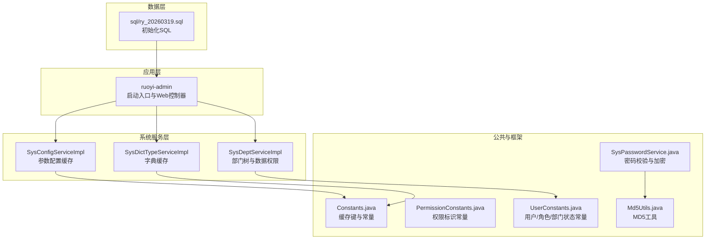
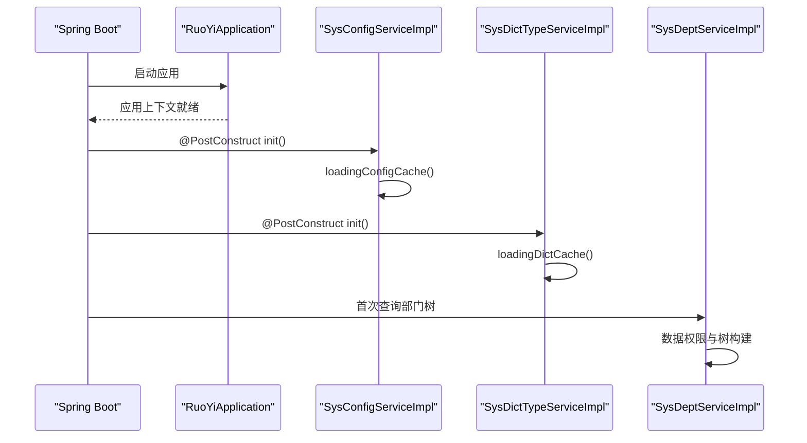
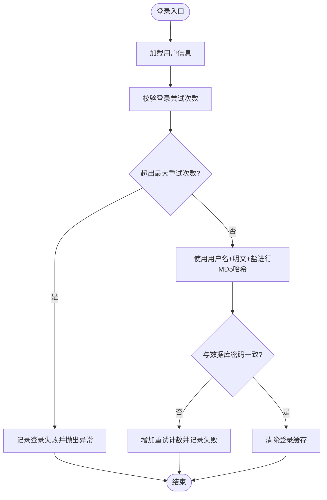
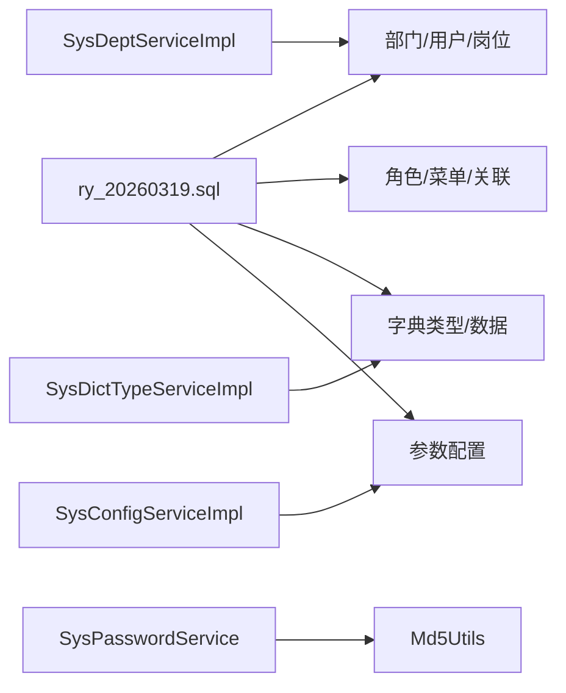

# 初始化数据设计

<cite>
**本文引用的文件**
- [ry_20260319.sql](file://sql/ry_20260319.sql)
- [application.yml](file://ruoyi-admin/src/main/resources/application.yml)
- [RuoYiApplication.java](file://ruoyi-admin/src/main/java/com/ruoyi/RuoYiApplication.java)
- [UserConstants.java](file://ruoyi-common/src/main/java/com/ruoyi/common/constant/UserConstants.java)
- [PermissionConstants.java](file://ruoyi-common/src/main/java/com/ruoyi/common/constant/PermissionConstants.java)
- [Constants.java](file://ruoyi-common/src/main/java/com/ruoyi/common/constant/Constants.java)
- [Md5Utils.java](file://ruoyi-common/src/main/java/com/ruoyi/common/utils/security/Md5Utils.java)
- [SysPasswordService.java](file://ruoyi-framework/src/main/java/com/ruoyi/framework/shiro/service/SysPasswordService.java)
- [SysConfigServiceImpl.java](file://ruoyi-system/src/main/java/com/ruoyi/system/service/impl/SysConfigServiceImpl.java)
- [SysDictTypeServiceImpl.java](file://ruoyi-system/src/main/java/com/ruoyi/system/service/impl/SysDictTypeServiceImpl.java)
- [SysDeptServiceImpl.java](file://ruoyi-system/src/main/java/com/ruoyi/system/service/impl/SysDeptServiceImpl.java)
- [SysIndexController.java](file://ruoyi-admin/src/main/java/com/ruoyi/web/controller/system/SysIndexController.java)
- [run.bat](file://bin/run.bat)
</cite>

## 目录
1. [引言](#引言)
2. [项目结构](#项目结构)
3. [核心组件](#核心组件)
4. [架构总览](#架构总览)
5. [详细组件分析](#详细组件分析)
6. [依赖分析](#依赖分析)
7. [性能考量](#性能考量)
8. [故障排查指南](#故障排查指南)
9. [结论](#结论)
10. [附录](#附录)

## 引言
本文件面向系统管理员与开发者，系统性阐述RuoYi系统在启动阶段所需的基础数据初始化方案。内容覆盖组织架构、用户账户、角色权限、菜单权限、字典与参数配置等关键数据，并给出导入流程、版本管理与迁移策略建议，以及安全与完整性保障措施。通过结合数据库脚本与系统启动流程，帮助读者正确配置与维护系统的基础数据。

## 项目结构
RuoYi采用多模块分层架构，初始化数据主要由SQL脚本提供，系统启动时加载并缓存关键配置与字典，确保首次运行具备可用的系统能力。

**图表来源**
- [RuoYiApplication.java:12-28](file://ruoyi-admin/src/main/java/com/ruoyi/RuoYiApplication.java#L12-L28)
- [SysConfigServiceImpl.java:31-35](file://ruoyi-system/src/main/java/com/ruoyi/system/service/impl/SysConfigServiceImpl.java#L31-L35)
- [SysDictTypeServiceImpl.java:41-45](file://ruoyi-system/src/main/java/com/ruoyi/system/service/impl/SysDictTypeServiceImpl.java#L41-L45)
- [SysDeptServiceImpl.java:39-44](file://ruoyi-system/src/main/java/com/ruoyi/system/service/impl/SysDeptServiceImpl.java#L39-L44)
- [Constants.java:74-90](file://ruoyi-common/src/main/java/com/ruoyi/common/constant/Constants.java#L74-L90)
- [PermissionConstants.java:10-27](file://ruoyi-common/src/main/java/com/ruoyi/common/constant/PermissionConstants.java#L10-L27)
- [UserConstants.java:15-34](file://ruoyi-common/src/main/java/com/ruoyi/common/constant/UserConstants.java#L15-L34)
- [Md5Utils.java:55-66](file://ruoyi-common/src/main/java/com/ruoyi/common/utils/security/Md5Utils.java#L55-L66)
- [SysPasswordService.java:42-74](file://ruoyi-framework/src/main/java/com/ruoyi/framework/shiro/service/SysPasswordService.java#L42-L74)
- [ry_20260319.sql:1-739](file://sql/ry_20260319.sql#L1-L739)

**章节来源**
- [RuoYiApplication.java:12-28](file://ruoyi-admin/src/main/java/com/ruoyi/RuoYiApplication.java#L12-L28)
- [application.yml:1-154](file://ruoyi-admin/src/main/resources/application.yml#L1-L154)

## 核心组件
- 组织架构与用户：部门表、用户表、岗位表、用户-岗位关联表
- 角色与权限：角色表、菜单表、角色-菜单关联表、角色-部门关联表、用户-角色关联表
- 字典与参数：字典类型表、字典数据表、参数配置表
- 启动与缓存：系统启动时加载参数与字典至缓存；密码加密与校验；部门树与数据权限

上述组件在SQL脚本中以“初始化”注释明确标识，确保系统首次运行具备完整的管理能力与界面菜单。

**章节来源**
- [ry_20260319.sql:24-391](file://sql/ry_20260319.sql#L24-L391)
- [SysConfigServiceImpl.java:31-35](file://ruoyi-system/src/main/java/com/ruoyi/system/service/impl/SysConfigServiceImpl.java#L31-L35)
- [SysDictTypeServiceImpl.java:41-45](file://ruoyi-system/src/main/java/com/ruoyi/system/service/impl/SysDictTypeServiceImpl.java#L41-L45)
- [SysPasswordService.java:42-74](file://ruoyi-framework/src/main/java/com/ruoyi/framework/shiro/service/SysPasswordService.java#L42-L74)

## 架构总览
系统启动时，应用排除默认数据源自动装配，通过配置文件加载运行参数，随后由各服务组件在构造阶段或首次访问时将初始化数据加载到缓存，保证后续业务调用高效稳定。

**图表来源**
- [RuoYiApplication.java:12-28](file://ruoyi-admin/src/main/java/com/ruoyi/RuoYiApplication.java#L12-L28)
- [SysConfigServiceImpl.java:31-35](file://ruoyi-system/src/main/java/com/ruoyi/system/service/impl/SysConfigServiceImpl.java#L31-L35)
- [SysConfigServiceImpl.java:152-160](file://ruoyi-system/src/main/java/com/ruoyi/system/service/impl/SysConfigServiceImpl.java#L152-L160)
- [SysDictTypeServiceImpl.java:41-45](file://ruoyi-system/src/main/java/com/ruoyi/system/service/impl/SysDictTypeServiceImpl.java#L41-L45)
- [SysDictTypeServiceImpl.java:142-151](file://ruoyi-system/src/main/java/com/ruoyi/system/service/impl/SysDictTypeServiceImpl.java#L142-L151)
- [SysDeptServiceImpl.java:39-44](file://ruoyi-system/src/main/java/com/ruoyi/system/service/impl/SysDeptServiceImpl.java#L39-L44)

## 详细组件分析

### 组织架构与用户数据
- 部门表：包含层级祖先链、排序、负责人与联系方式等字段，初始化提供总部与分公司的典型组织结构。
- 用户表：包含登录名、昵称、邮箱、手机号、性别、密码与盐等字段，初始化超级管理员与测试用户。
- 岗位表：提供岗位编码、名称与排序，初始化董事长、项目经理、HR与普通员工等岗位。
- 用户-岗位关联：建立用户与岗位的多对多关系，支撑角色与菜单权限的扩展场景。

业务含义与配置原则
- 超级管理员账户(admin)：具备最高权限，用于系统初始化与紧急维护。
- 默认角色(common)：普通角色授予系统全量菜单与操作权限，便于新用户快速上手。
- 部门层级：通过祖先链与父子关系维护树形结构，支持数据权限按部门/子部门控制。

**章节来源**
- [ry_20260319.sql:24-36](file://sql/ry_20260319.sql#L24-L36)
- [ry_20260319.sql:68-71](file://sql/ry_20260319.sql#L68-L71)
- [ry_20260319.sql:77-99](file://sql/ry_20260319.sql#L77-L99)
- [ry_20260319.sql:406-407](file://sql/ry_20260319.sql#L406-L407)

### 角色与菜单权限数据
- 角色表：包含角色名称、权限字符串、数据范围与状态，初始化超级管理员与普通角色。
- 菜单表：包含目录、菜单与按钮三层结构，定义URL、打开方式、图标与权限标识。
- 关联关系：用户-角色、角色-菜单、角色-部门，形成“谁对哪些菜单有权限”的精确映射。

业务含义与配置原则
- 菜单结构：一级目录（系统管理、系统监控、系统工具、官网链接），二级与三级菜单覆盖用户、角色、菜单、部门、岗位、字典、参数、通知、日志、在线用户、定时任务、数据监控、服务监控、缓存监控、表单构建、代码生成、系统接口等。
- 权限标识：遵循“业务模块:功能:动作”命名规范，便于细粒度权限控制与前端按钮级权限绑定。
- 数据范围：普通角色默认“自定数据权限”，可按部门/子部门进行数据隔离。

**章节来源**
- [ry_20260319.sql:123-127](file://sql/ry_20260319.sql#L123-L127)
- [ry_20260319.sql:156-257](file://sql/ry_20260319.sql#L156-L257)
- [ry_20260319.sql:289-374](file://sql/ry_20260319.sql#L289-L374)

### 字典与参数配置数据
- 字典类型与字典数据：提供性别、菜单状态、系统开关、任务状态/分组、通知类型/状态、操作类型、系统状态等常用枚举，统一由字典服务加载到缓存。
- 参数配置：包含皮肤样式、初始密码、侧边栏主题、注册开关、密码字符范围、初始密码修改策略、密码更新周期、菜单导航风格、页脚与页签显示、登录黑名单等系统级配置。

业务含义与配置原则
- 内置参数：带“Y”标记的参数为系统内置，不可删除，确保系统关键行为的稳定性。
- 缓存策略：启动时加载至缓存，运行时通过键名快速读取，避免频繁数据库访问。

**章节来源**
- [ry_20260319.sql:441-467](file://sql/ry_20260319.sql#L441-L467)
- [ry_20260319.sql:474-522](file://sql/ry_20260319.sql#L474-L522)
- [ry_20260319.sql:528-553](file://sql/ry_20260319.sql#L528-L553)
- [SysConfigServiceImpl.java:152-160](file://ruoyi-system/src/main/java/com/ruoyi/system/service/impl/SysConfigServiceImpl.java#L152-L160)
- [SysDictTypeServiceImpl.java:142-151](file://ruoyi-system/src/main/java/com/ruoyi/system/service/impl/SysDictTypeServiceImpl.java#L142-L151)

### 密码加密与安全校验
- 密码加密：采用“用户名+明文密码+盐”拼接后进行MD5哈希，确保不同用户相同密码的哈希值不同。
- 登录校验：基于Shiro的登录尝试次数限制，超过阈值触发失败记录与异常抛出。
- 初始密码策略：可通过参数配置初始密码与到期策略，引导用户首次登录后修改密码。

**图表来源**
- [SysPasswordService.java:42-74](file://ruoyi-framework/src/main/java/com/ruoyi/framework/shiro/service/SysPasswordService.java#L42-L74)
- [Md5Utils.java:55-66](file://ruoyi-common/src/main/java/com/ruoyi/common/utils/security/Md5Utils.java#L55-L66)

**章节来源**
- [SysPasswordService.java:33-74](file://ruoyi-framework/src/main/java/com/ruoyi/framework/shiro/service/SysPasswordService.java#L33-L74)
- [application.yml:41-46](file://ruoyi-admin/src/main/resources/application.yml#L41-L46)
- [SysIndexController.java:162-181](file://ruoyi-admin/src/main/java/com/ruoyi/web/controller/system/SysIndexController.java#L162-L181)

### 数据权限与部门树
- 数据范围：支持全部、自定义、本部门、本部门及以下、仅本人等数据范围策略。
- 部门树：根据祖先链与父子关系生成树结构，支持角色选择与数据权限勾选。
- 上级状态同步：当启用子部门时，自动同步启用其所有上级部门。

**章节来源**
- [Constants.java:125-152](file://ruoyi-common/src/main/java/com/ruoyi/common/constant/Constants.java#L125-L152)
- [SysDeptServiceImpl.java:111-145](file://ruoyi-system/src/main/java/com/ruoyi/system/service/impl/SysDeptServiceImpl.java#L111-L145)
- [SysDeptServiceImpl.java:239-244](file://ruoyi-system/src/main/java/com/ruoyi/system/service/impl/SysDeptServiceImpl.java#L239-L244)

## 依赖分析
初始化数据与系统启动的关键依赖关系如下：

**图表来源**
- [ry_20260319.sql:24-391](file://sql/ry_20260319.sql#L24-L391)
- [SysConfigServiceImpl.java:152-160](file://ruoyi-system/src/main/java/com/ruoyi/system/service/impl/SysConfigServiceImpl.java#L152-L160)
- [SysDictTypeServiceImpl.java:142-151](file://ruoyi-system/src/main/java/com/ruoyi/system/service/impl/SysDictTypeServiceImpl.java#L142-L151)
- [SysDeptServiceImpl.java:39-44](file://ruoyi-system/src/main/java/com/ruoyi/system/service/impl/SysDeptServiceImpl.java#L39-L44)
- [SysPasswordService.java:81-84](file://ruoyi-framework/src/main/java/com/ruoyi/framework/shiro/service/SysPasswordService.java#L81-L84)
- [Md5Utils.java:55-66](file://ruoyi-common/src/main/java/com/ruoyi/common/utils/security/Md5Utils.java#L55-L66)

**章节来源**
- [Constants.java:74-90](file://ruoyi-common/src/main/java/com/ruoyi/common/constant/Constants.java#L74-L90)
- [PermissionConstants.java:10-27](file://ruoyi-common/src/main/java/com/ruoyi/common/constant/PermissionConstants.java#L10-L27)
- [UserConstants.java:15-34](file://ruoyi-common/src/main/java/com/ruoyi/common/constant/UserConstants.java#L15-L34)

## 性能考量
- 启动时缓存：参数与字典在启动阶段一次性加载到缓存，减少运行时数据库访问开销。
- 部门树构建：通过祖先链与一次性查询构建树，避免递归查询带来的性能问题。
- 密码校验：登录尝试次数限制与缓存记录，防止暴力破解与数据库压力。

[本节为通用指导，无需特定文件引用]

## 故障排查指南
- 启动失败或连接异常
  - 检查应用配置文件中的数据库与端口设置，确认排除默认数据源自动装配后使用正确的数据源配置。
  - 参考启动脚本设置JVM参数，确保内存充足。
- 参数与字典未生效
  - 确认启动阶段已执行加载缓存逻辑；若手动变更参数，需清理并重载缓存。
- 密码错误过多被锁定
  - 检查登录重试上限配置；确认缓存中对应用户的登录尝试计数是否被清除。
- 部门树异常或数据权限不正确
  - 检查祖先链与父子关系字段；确认启用/停用状态与上级部门状态同步逻辑。

**章节来源**
- [application.yml:16-33](file://ruoyi-admin/src/main/resources/application.yml#L16-L33)
- [run.bat:9-11](file://bin/run.bat#L9-L11)
- [SysConfigServiceImpl.java:165-179](file://ruoyi-system/src/main/java/com/ruoyi/system/service/impl/SysConfigServiceImpl.java#L165-L179)
- [SysPasswordService.java:53-68](file://ruoyi-framework/src/main/java/com/ruoyi/framework/shiro/service/SysPasswordService.java#L53-L68)
- [SysDeptServiceImpl.java:224-231](file://ruoyi-system/src/main/java/com/ruoyi/system/service/impl/SysDeptServiceImpl.java#L224-L231)

## 结论
RuoYi的初始化数据设计以SQL脚本为核心，配合系统启动时的参数与字典缓存加载，确保应用在首次运行时具备完整的组织架构、用户账户、角色权限、菜单结构、字典与参数配置。通过明确的业务含义与配置原则、完善的安全与权限策略，以及清晰的导入与迁移路径，能够帮助系统管理员与开发者高效完成基础数据的配置与维护。

[本节为总结性内容，无需特定文件引用]

## 附录

### 初始化数据导入流程
- 准备阶段
  - 备份现有数据库，确保可回滚。
  - 确认数据库字符集与时区设置符合要求。
- 执行脚本
  - 使用数据库客户端连接目标库，执行SQL脚本，确保按顺序执行，避免外键约束导致的失败。
- 校验与验证
  - 校验关键表数据是否完整（部门、用户、角色、菜单、字典、参数）。
  - 登录系统，验证菜单与权限是否按预期加载。
- 启动应用
  - 启动应用，确认启动日志无异常；必要时查看参数与字典缓存加载情况。

**章节来源**
- [ry_20260319.sql:1-739](file://sql/ry_20260319.sql#L1-L739)
- [RuoYiApplication.java:12-28](file://ruoyi-admin/src/main/java/com/ruoyi/RuoYiApplication.java#L12-L28)

### 版本管理与数据迁移策略
- 版本标识
  - SQL脚本文件名包含日期标识，便于识别版本与演进。
- 迁移策略
  - 新增/变更：在新版本脚本中提供增量迁移语句，保留历史数据；对内置参数与字典，优先采用更新而非删除。
  - 回滚：提供逆向SQL或备份点，确保可回滚到上一版本。
  - 测试：在测试环境先行验证，再推广至生产。

**章节来源**
- [ry_20260319.sql:1-10](file://sql/ry_20260319.sql#L1-L10)

### 自动化脚本与批量工具
- 启动脚本
  - 提供批处理脚本设置JVM参数并运行打包好的应用。
- 批量导入
  - 建议使用数据库客户端的批量执行功能，或编写SQL脚本的分段执行器，确保事务一致性与错误定位。

**章节来源**
- [run.bat:9-11](file://bin/run.bat#L9-L11)