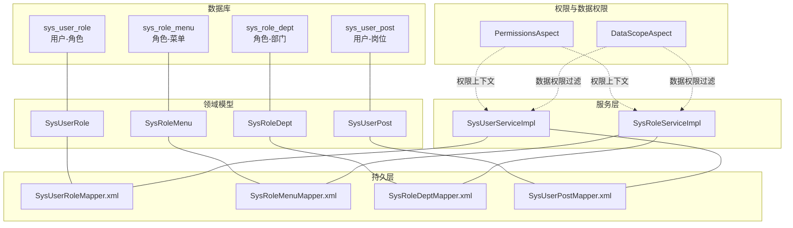
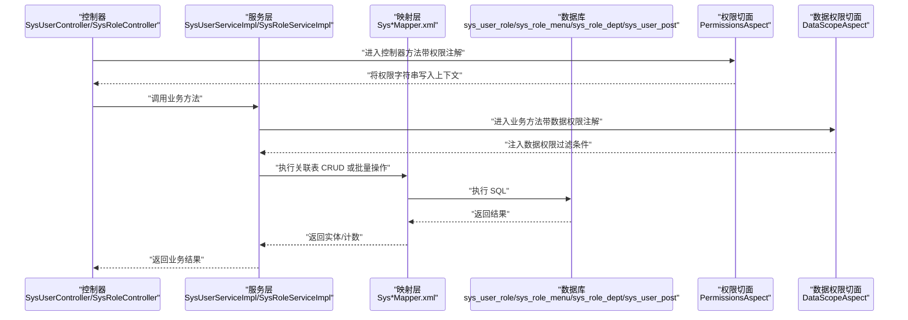
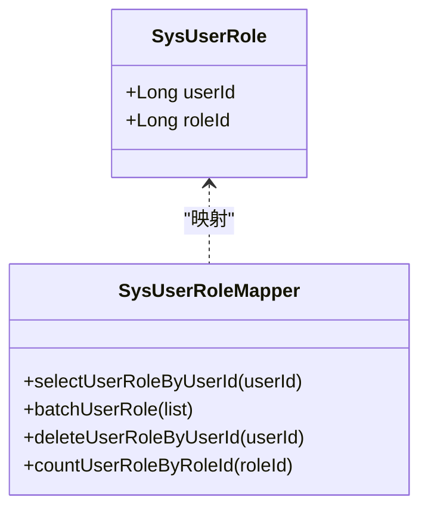
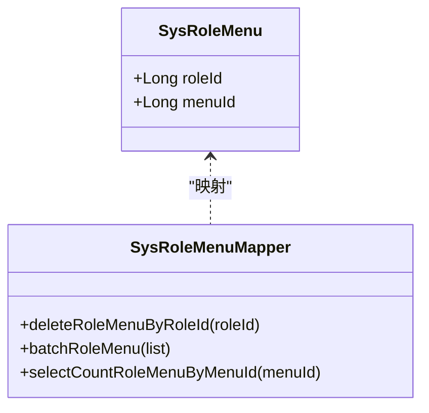
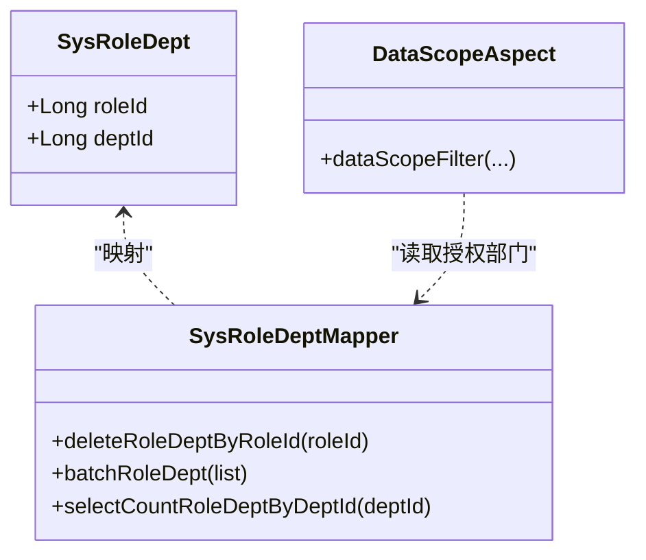
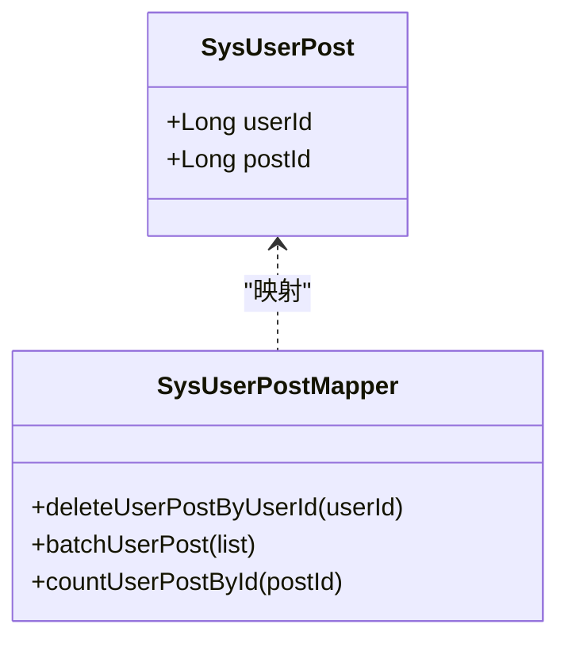
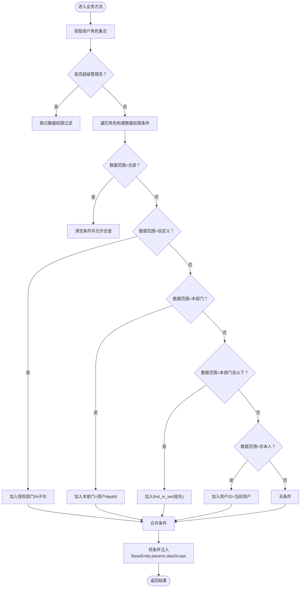
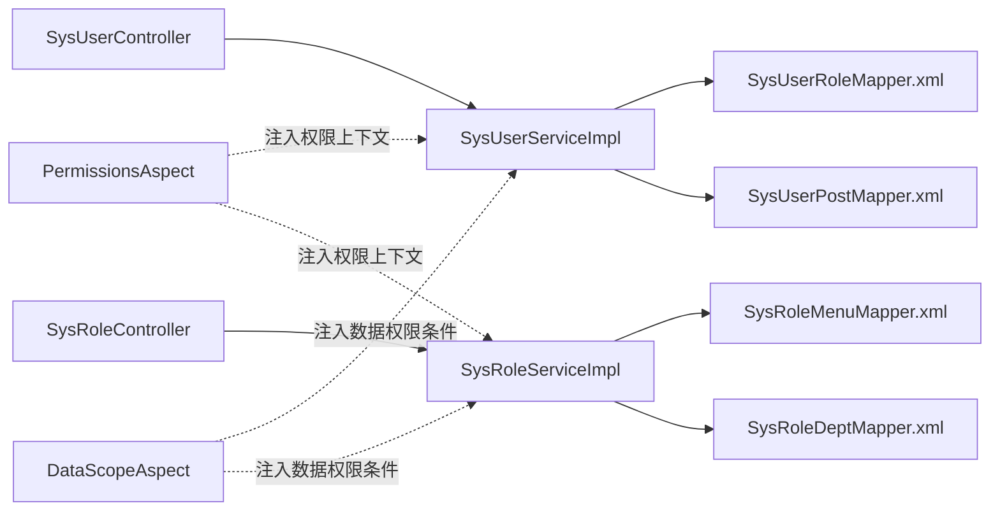

# 多对多关联关系

<cite>
**本文引用的文件**
- [ry_20260319.sql](file://sql/ry_20260319.sql)
- [SysUserRole.java](file://ruoyi-system/src/main/java/com/ruoyi/system/domain/SysUserRole.java)
- [SysRoleMenu.java](file://ruoyi-system/src/main/java/com/ruoyi/system/domain/SysRoleMenu.java)
- [SysRoleDept.java](file://ruoyi-system/src/main/java/com/ruoyi/system/domain/SysRoleDept.java)
- [SysUserPost.java](file://ruoyi-system/src/main/java/com/ruoyi/system/domain/SysUserPost.java)
- [SysUserRoleMapper.xml](file://ruoyi-system/src/main/resources/mapper/system/SysUserRoleMapper.xml)
- [SysRoleMenuMapper.xml](file://ruoyi-system/src/main/resources/mapper/system/SysRoleMenuMapper.xml)
- [SysRoleDeptMapper.xml](file://ruoyi-system/src/main/resources/mapper/system/SysRoleDeptMapper.xml)
- [SysUserPostMapper.xml](file://ruoyi-system/src/main/resources/mapper/system/SysUserPostMapper.xml)
- [SysUserServiceImpl.java](file://ruoyi-system/src/main/java/com/ruoyi/system/service/impl/SysUserServiceImpl.java)
- [SysRoleServiceImpl.java](file://ruoyi-system/src/main/java/com/ruoyi/system/service/impl/SysRoleServiceImpl.java)
- [DataScopeAspect.java](file://ruoyi-framework/src/main/java/com/ruoyi/framework/aspectj/DataScopeAspect.java)
- [PermissionsAspect.java](file://ruoyi-framework/src/main/java/com/ruoyi/framework/aspectj/PermissionsAspect.java)
- [SysUserController.java](file://ruoyi-admin/src/main/java/com/ruoyi/web/controller/system/SysUserController.java)
- [SysRoleController.java](file://ruoyi-admin/src/main/java/com/ruoyi/web/controller/system/SysRoleController.java)
- [SysUserMapper.xml](file://ruoyi-system/src/main/resources/mapper/system/SysUserMapper.xml)
- [dataScope.html](file://ruoyi-admin/src/main/resources/templates/system/role/dataScope.html)
</cite>

## 目录
1. [引言](#引言)
2. [项目结构](#项目结构)
3. [核心组件](#核心组件)
4. [架构总览](#架构总览)
5. [详细组件分析](#详细组件分析)
6. [依赖分析](#依赖分析)
7. [性能考量](#性能考量)
8. [故障排查指南](#故障排查指南)
9. [结论](#结论)
10. [附录](#附录)

## 引言
本文件围绕 RuoYi 系统中的多对多关联关系进行系统化梳理，重点覆盖以下四类关联表：用户-角色（sys_user_role）、角色-菜单（sys_role_menu）、角色-部门（sys_role_dept）、用户-岗位（sys_user_post）。文档从数据库设计、实体模型、MyBatis 映射、服务层事务与权限控制、数据权限过滤、并发与一致性保障等方面进行深入解析，并提供 SQL 查询示例与性能优化建议，帮助开发者在 RBAC 权限模型中正确理解和应用多对多关系。

## 项目结构
- 关联表定义位于数据库初始化脚本中，涵盖四类多对多表及其主键设计与初始数据。
- 实体类位于 system 模块 domain 包，映射到对应的 sys_* 表。
- MyBatis Mapper XML 文件位于 system 模块 resources/mapper/system 下，提供 CRUD 与批量操作 SQL。
- 服务层实现位于 system 模块 service/impl 包，负责业务编排与事务控制。
- 权限与数据权限过滤由 framework 模块的切面完成，贯穿查询流程。
- 控制器层位于 admin 模块 web/controller/system，提供前端交互入口。

图表来源
- [ry_20260319.sql](file://sql/ry_20260319.sql)
- [SysUserRole.java](file://ruoyi-system/src/main/java/com/ruoyi/system/domain/SysUserRole.java)
- [SysRoleMenu.java](file://ruoyi-system/src/main/java/com/ruoyi/system/domain/SysRoleMenu.java)
- [SysRoleDept.java](file://ruoyi-system/src/main/java/com/ruoyi/system/domain/SysRoleDept.java)
- [SysUserPost.java](file://ruoyi-system/src/main/java/com/ruoyi/system/domain/SysUserPost.java)
- [SysUserRoleMapper.xml](file://ruoyi-system/src/main/resources/mapper/system/SysUserRoleMapper.xml)
- [SysRoleMenuMapper.xml](file://ruoyi-system/src/main/resources/mapper/system/SysRoleMenuMapper.xml)
- [SysRoleDeptMapper.xml](file://ruoyi-system/src/main/resources/mapper/system/SysRoleDeptMapper.xml)
- [SysUserPostMapper.xml](file://ruoyi-system/src/main/resources/mapper/system/SysUserPostMapper.xml)
- [SysUserServiceImpl.java](file://ruoyi-system/src/main/java/com/ruoyi/system/service/impl/SysUserServiceImpl.java)
- [SysRoleServiceImpl.java](file://ruoyi-system/src/main/java/com/ruoyi/system/service/impl/SysRoleServiceImpl.java)
- [PermissionsAspect.java](file://ruoyi-framework/src/main/java/com/ruoyi/framework/aspectj/PermissionsAspect.java)
- [DataScopeAspect.java](file://ruoyi-framework/src/main/java/com/ruoyi/framework/aspectj/DataScopeAspect.java)

章节来源
- [ry_20260319.sql](file://sql/ry_20260319.sql)
- [SysUserRole.java](file://ruoyi-system/src/main/java/com/ruoyi/system/domain/SysUserRole.java)
- [SysRoleMenu.java](file://ruoyi-system/src/main/java/com/ruoyi/system/domain/SysRoleMenu.java)
- [SysRoleDept.java](file://ruoyi-system/src/main/java/com/ruoyi/system/domain/SysRoleDept.java)
- [SysUserPost.java](file://ruoyi-system/src/main/java/com/ruoyi/system/domain/SysUserPost.java)
- [SysUserRoleMapper.xml](file://ruoyi-system/src/main/resources/mapper/system/SysUserRoleMapper.xml)
- [SysRoleMenuMapper.xml](file://ruoyi-system/src/main/resources/mapper/system/SysRoleMenuMapper.xml)
- [SysRoleDeptMapper.xml](file://ruoyi-system/src/main/resources/mapper/system/SysRoleDeptMapper.xml)
- [SysUserPostMapper.xml](file://ruoyi-system/src/main/resources/mapper/system/SysUserPostMapper.xml)
- [SysUserServiceImpl.java](file://ruoyi-system/src/main/java/com/ruoyi/system/service/impl/SysUserServiceImpl.java)
- [SysRoleServiceImpl.java](file://ruoyi-system/src/main/java/com/ruoyi/system/service/impl/SysRoleServiceImpl.java)
- [PermissionsAspect.java](file://ruoyi-framework/src/main/java/com/ruoyi/framework/aspectj/PermissionsAspect.java)
- [DataScopeAspect.java](file://ruoyi-framework/src/main/java/com/ruoyi/framework/aspectj/DataScopeAspect.java)

## 核心组件
- 关联表与主键设计
  - sys_user_role：复合主键 (user_id, role_id)，用于用户与角色的多对多绑定。
  - sys_role_menu：复合主键 (role_id, menu_id)，用于角色与菜单的多对多绑定。
  - sys_role_dept：复合主键 (role_id, dept_id)，用于角色与部门的多对多绑定。
  - sys_user_post：复合主键 (user_id, post_id)，用于用户与岗位的多对多绑定。
- 实体类
  - SysUserRole、SysRoleMenu、SysRoleDept、SysUserPost 分别对应上述四张表，字段为关联键。
- MyBatis 映射
  - 提供按用户/角色维度的查询、批量插入、批量删除等常用操作。
- 服务层
  - SysUserServiceImpl：封装用户与角色、岗位的关联维护；删除用户时清理关联。
  - SysRoleServiceImpl：封装角色与菜单、部门的关联维护；删除角色时清理关联。
- 权限与数据权限
  - PermissionsAspect：将控制器注解的权限字符串放入上下文，便于统一校验。
  - DataScopeAspect：根据用户角色的数据权限范围动态拼接 SQL 过滤条件，支持“全部/自定义/本部门/本部门及以下/仅本人”。

章节来源
- [ry_20260319.sql](file://sql/ry_20260319.sql)
- [SysUserRole.java](file://ruoyi-system/src/main/java/com/ruoyi/system/domain/SysUserRole.java)
- [SysRoleMenu.java](file://ruoyi-system/src/main/java/com/ruoyi/system/domain/SysRoleMenu.java)
- [SysRoleDept.java](file://ruoyi-system/src/main/java/com/ruoyi/system/domain/SysRoleDept.java)
- [SysUserPost.java](file://ruoyi-system/src/main/java/com/ruoyi/system/domain/SysUserPost.java)
- [SysUserRoleMapper.xml](file://ruoyi-system/src/main/resources/mapper/system/SysUserRoleMapper.xml)
- [SysRoleMenuMapper.xml](file://ruoyi-system/src/main/resources/mapper/system/SysRoleMenuMapper.xml)
- [SysRoleDeptMapper.xml](file://ruoyi-system/src/main/resources/mapper/system/SysRoleDeptMapper.xml)
- [SysUserPostMapper.xml](file://ruoyi-system/src/main/resources/mapper/system/SysUserPostMapper.xml)
- [SysUserServiceImpl.java](file://ruoyi-system/src/main/java/com/ruoyi/system/service/impl/SysUserServiceImpl.java)
- [SysRoleServiceImpl.java](file://ruoyi-system/src/main/java/com/ruoyi/system/service/impl/SysRoleServiceImpl.java)
- [PermissionsAspect.java](file://ruoyi-framework/src/main/java/com/ruoyi/framework/aspectj/PermissionsAspect.java)
- [DataScopeAspect.java](file://ruoyi-framework/src/main/java/com/ruoyi/framework/aspectj/DataScopeAspect.java)

## 架构总览
下图展示从控制器到服务层、再到数据层的调用链路，以及权限与数据权限切面如何介入：

图表来源
- [SysUserController.java](file://ruoyi-admin/src/main/java/com/ruoyi/web/controller/system/SysUserController.java)
- [SysRoleController.java](file://ruoyi-admin/src/main/java/com/ruoyi/web/controller/system/SysRoleController.java)
- [SysUserServiceImpl.java](file://ruoyi-system/src/main/java/com/ruoyi/system/service/impl/SysUserServiceImpl.java)
- [SysRoleServiceImpl.java](file://ruoyi-system/src/main/java/com/ruoyi/system/service/impl/SysRoleServiceImpl.java)
- [SysUserRoleMapper.xml](file://ruoyi-system/src/main/resources/mapper/system/SysUserRoleMapper.xml)
- [SysRoleMenuMapper.xml](file://ruoyi-system/src/main/resources/mapper/system/SysRoleMenuMapper.xml)
- [SysRoleDeptMapper.xml](file://ruoyi-system/src/main/resources/mapper/system/SysRoleDeptMapper.xml)
- [SysUserPostMapper.xml](file://ruoyi-system/src/main/resources/mapper/system/SysUserPostMapper.xml)
- [PermissionsAspect.java](file://ruoyi-framework/src/main/java/com/ruoyi/framework/aspectj/PermissionsAspect.java)
- [DataScopeAspect.java](file://ruoyi-framework/src/main/java/com/ruoyi/framework/aspectj/DataScopeAspect.java)

## 详细组件分析

### 用户-角色（sys_user_role）
- 设计要点
  - 复合主键确保同一用户不可重复绑定同一角色。
  - 支持批量插入与按用户/角色维度删除，满足角色分配与回收场景。
- 实体与映射
  - 实体：SysUserRole（userId, roleId）
  - 映射：SysUserRoleMapper.xml 提供按用户查询、按用户删除、按角色计数、批量插入、按条件删除等。
- 服务层行为
  - 用户删除时清理用户-角色关联。
  - 角色删除时清理角色-菜单与角色-部门关联（由角色服务处理）。
- 典型 SQL 示例
  - 查询某用户的全部角色：[SysUserRoleMapper.xml](file://ruoyi-system/src/main/resources/mapper/system/SysUserRoleMapper.xml)
  - 批量为用户分配角色：[SysUserRoleMapper.xml](file://ruoyi-system/src/main/resources/mapper/system/SysUserRoleMapper.xml)
  - 统计某角色被多少用户绑定：[SysUserRoleMapper.xml](file://ruoyi-system/src/main/resources/mapper/system/SysUserRoleMapper.xml)

图表来源
- [SysUserRole.java](file://ruoyi-system/src/main/java/com/ruoyi/system/domain/SysUserRole.java)
- [SysUserRoleMapper.xml](file://ruoyi-system/src/main/resources/mapper/system/SysUserRoleMapper.xml)

章节来源
- [SysUserRole.java](file://ruoyi-system/src/main/java/com/ruoyi/system/domain/SysUserRole.java)
- [SysUserRoleMapper.xml](file://ruoyi-system/src/main/resources/mapper/system/SysUserRoleMapper.xml)
- [SysUserServiceImpl.java](file://ruoyi-system/src/main/java/com/ruoyi/system/service/impl/SysUserServiceImpl.java)
- [SysRoleServiceImpl.java](file://ruoyi-system/src/main/java/com/ruoyi/system/service/impl/SysRoleServiceImpl.java)

### 角色-菜单（sys_role_menu）
- 设计要点
  - 复合主键确保同一角色不可重复绑定同一菜单。
  - 支持批量插入与按角色维度删除，满足角色授权菜单场景。
- 实体与映射
  - 实体：SysRoleMenu（roleId, menuId）
  - 映射：SysRoleMenuMapper.xml 提供按角色删除、按菜单计数、批量插入等。
- 服务层行为
  - 角色新增/修改时维护角色-菜单授权。
  - 角色删除时清理关联（由角色服务处理）。

图表来源
- [SysRoleMenu.java](file://ruoyi-system/src/main/java/com/ruoyi/system/domain/SysRoleMenu.java)
- [SysRoleMenuMapper.xml](file://ruoyi-system/src/main/resources/mapper/system/SysRoleMenuMapper.xml)

章节来源
- [SysRoleMenu.java](file://ruoyi-system/src/main/java/com/ruoyi/system/domain/SysRoleMenu.java)
- [SysRoleMenuMapper.xml](file://ruoyi-system/src/main/resources/mapper/system/SysRoleMenuMapper.xml)
- [SysRoleServiceImpl.java](file://ruoyi-system/src/main/java/com/ruoyi/system/service/impl/SysRoleServiceImpl.java)

### 角色-部门（sys_role_dept）
- 设计要点
  - 复合主键确保同一角色不可重复绑定同一部门。
  - 支持批量插入与按角色维度删除，配合 DataScopeAspect 实现数据权限过滤。
- 实体与映射
  - 实体：SysRoleDept（roleId, deptId）
  - 映射：SysRoleDeptMapper.xml 提供按角色删除、按部门计数、批量插入等。
- 数据权限过滤
  - DataScopeAspect 依据角色的数据范围（全部/自定义/本部门/本部门及以下/仅本人）拼接 SQL 条件，结合 sys_role_dept 的授权部门集合进行过滤。

图表来源
- [SysRoleDept.java](file://ruoyi-system/src/main/java/com/ruoyi/system/domain/SysRoleDept.java)
- [SysRoleDeptMapper.xml](file://ruoyi-system/src/main/resources/mapper/system/SysRoleDeptMapper.xml)
- [DataScopeAspect.java](file://ruoyi-framework/src/main/java/com/ruoyi/framework/aspectj/DataScopeAspect.java)

章节来源
- [SysRoleDept.java](file://ruoyi-system/src/main/java/com/ruoyi/system/domain/SysRoleDept.java)
- [SysRoleDeptMapper.xml](file://ruoyi-system/src/main/resources/mapper/system/SysRoleDeptMapper.xml)
- [DataScopeAspect.java](file://ruoyi-framework/src/main/java/com/ruoyi/framework/aspectj/DataScopeAspect.java)

### 用户-岗位（sys_user_post）
- 设计要点
  - 复合主键确保同一用户不可重复绑定同一岗位。
  - 支持批量插入与按用户维度删除，满足用户多岗位场景。
- 实体与映射
  - 实体：SysUserPost（userId, postId）
  - 映射：SysUserPostMapper.xml 提供按用户删除、按岗位计数、批量插入等。
- 服务层行为
  - 用户删除时清理用户-岗位关联。

图表来源
- [SysUserPost.java](file://ruoyi-system/src/main/java/com/ruoyi/system/domain/SysUserPost.java)
- [SysUserPostMapper.xml](file://ruoyi-system/src/main/resources/mapper/system/SysUserPostMapper.xml)

章节来源
- [SysUserPost.java](file://ruoyi-system/src/main/java/com/ruoyi/system/domain/SysUserPost.java)
- [SysUserPostMapper.xml](file://ruoyi-system/src/main/resources/mapper/system/SysUserPostMapper.xml)
- [SysUserServiceImpl.java](file://ruoyi-system/src/main/java/com/ruoyi/system/service/impl/SysUserServiceImpl.java)

### 权限控制与数据权限
- 权限控制
  - PermissionsAspect 将控制器上的权限注解值写入上下文，便于统一校验。
- 数据权限
  - DataScopeAspect 依据用户角色的数据范围与权限字符，动态拼接 SQL 过滤条件，支持：
    - 全部数据权限
    - 自定义数据权限（结合 sys_role_dept 授权部门）
    - 本部门数据权限
    - 本部门及以下数据权限
    - 仅本人数据权限
  - 当角色不包含指定权限字符或无授权部门时，会限制查询结果为空，确保安全。

图表来源
- [DataScopeAspect.java](file://ruoyi-framework/src/main/java/com/ruoyi/framework/aspectj/DataScopeAspect.java)

章节来源
- [PermissionsAspect.java](file://ruoyi-framework/src/main/java/com/ruoyi/framework/aspectj/PermissionsAspect.java)
- [DataScopeAspect.java](file://ruoyi-framework/src/main/java/com/ruoyi/framework/aspectj/DataScopeAspect.java)

## 依赖分析
- 组件耦合
  - 服务层通过各自的 Mapper 访问关联表，职责清晰。
  - 权限与数据权限切面以横切关注点形式介入，不改变业务方法签名。
- 外部依赖
  - MyBatis XML 映射依赖数据库表结构与索引。
  - DataScopeAspect 依赖 sys_role_dept 授权表与 sys_dept 树结构函数。
- 潜在循环依赖
  - 无直接循环依赖，各层之间为单向依赖。

图表来源
- [SysUserController.java](file://ruoyi-admin/src/main/java/com/ruoyi/web/controller/system/SysUserController.java)
- [SysRoleController.java](file://ruoyi-admin/src/main/java/com/ruoyi/web/controller/system/SysRoleController.java)
- [SysUserServiceImpl.java](file://ruoyi-system/src/main/java/com/ruoyi/system/service/impl/SysUserServiceImpl.java)
- [SysRoleServiceImpl.java](file://ruoyi-system/src/main/java/com/ruoyi/system/service/impl/SysRoleServiceImpl.java)
- [SysUserRoleMapper.xml](file://ruoyi-system/src/main/resources/mapper/system/SysUserRoleMapper.xml)
- [SysRoleMenuMapper.xml](file://ruoyi-system/src/main/resources/mapper/system/SysRoleMenuMapper.xml)
- [SysRoleDeptMapper.xml](file://ruoyi-system/src/main/resources/mapper/system/SysRoleDeptMapper.xml)
- [SysUserPostMapper.xml](file://ruoyi-system/src/main/resources/mapper/system/SysUserPostMapper.xml)
- [PermissionsAspect.java](file://ruoyi-framework/src/main/java/com/ruoyi/framework/aspectj/PermissionsAspect.java)
- [DataScopeAspect.java](file://ruoyi-framework/src/main/java/com/ruoyi/framework/aspectj/DataScopeAspect.java)

章节来源
- [SysUserController.java](file://ruoyi-admin/src/main/java/com/ruoyi/web/controller/system/SysUserController.java)
- [SysRoleController.java](file://ruoyi-admin/src/main/java/com/ruoyi/web/controller/system/SysRoleController.java)
- [SysUserServiceImpl.java](file://ruoyi-system/src/main/java/com/ruoyi/system/service/impl/SysUserServiceImpl.java)
- [SysRoleServiceImpl.java](file://ruoyi-system/src/main/java/com/ruoyi/system/service/impl/SysRoleServiceImpl.java)
- [PermissionsAspect.java](file://ruoyi-framework/src/main/java/com/ruoyi/framework/aspectj/PermissionsAspect.java)
- [DataScopeAspect.java](file://ruoyi-framework/src/main/java/com/ruoyi/framework/aspectj/DataScopeAspect.java)

## 性能考量
- 索引与查询
  - 关联表均采用复合主键，可有效避免重复绑定与快速定位。
  - 建议在高频查询字段上建立合适索引（如按用户/角色维度的查询）。
- 批量操作
  - 使用批量插入与批量删除减少往返次数，提高吞吐。
- 数据权限过滤
  - 自定义数据权限涉及子查询与 IN 列表，建议控制授权部门数量与合理使用父子联动。
- 事务与锁
  - 关联表变更使用事务包裹，避免中间态导致权限不一致。
  - 并发场景下建议使用合适的隔离级别与锁策略，避免脏读与幻读。

## 故障排查指南
- 常见问题
  - 重复绑定：复合主键可避免重复绑定，若出现异常需检查插入参数。
  - 权限不足：确认角色权限字符与控制器注解一致，PermissionsAspect 已将注解值写入上下文。
  - 数据越权：检查角色数据范围配置与 sys_role_dept 授权部门是否正确。
- 排查步骤
  - 检查服务层事务是否生效（删除/新增关联是否提交）。
  - 核对 DataScopeAspect 注入的 dataScope 条件是否符合预期。
  - 对高频查询进行 EXPLAIN 分析，确认索引使用情况。
- 相关实现参考
  - 权限上下文注入：[PermissionsAspect.java](file://ruoyi-framework/src/main/java/com/ruoyi/framework/aspectj/PermissionsAspect.java)
  - 数据权限过滤：[DataScopeAspect.java](file://ruoyi-framework/src/main/java/com/ruoyi/framework/aspectj/DataScopeAspect.java)
  - 用户-角色关联维护：[SysUserServiceImpl.java](file://ruoyi-system/src/main/java/com/ruoyi/system/service/impl/SysUserServiceImpl.java)
  - 角色-菜单/角色-部门关联维护：[SysRoleServiceImpl.java](file://ruoyi-system/src/main/java/com/ruoyi/system/service/impl/SysRoleServiceImpl.java)

章节来源
- [PermissionsAspect.java](file://ruoyi-framework/src/main/java/com/ruoyi/framework/aspectj/PermissionsAspect.java)
- [DataScopeAspect.java](file://ruoyi-framework/src/main/java/com/ruoyi/framework/aspectj/DataScopeAspect.java)
- [SysUserServiceImpl.java](file://ruoyi-system/src/main/java/com/ruoyi/system/service/impl/SysUserServiceImpl.java)
- [SysRoleServiceImpl.java](file://ruoyi-system/src/main/java/com/ruoyi/system/service/impl/SysRoleServiceImpl.java)

## 结论
RuoYi 的多对多关联关系通过简洁的复合主键设计与完善的 MyBatis 映射，实现了用户-角色、角色-菜单、角色-部门、用户-岗位的灵活授权与高效维护。配合权限与数据权限切面，系统在 RBAC 模型下实现了细粒度的权限控制与数据范围过滤。实践中应重视事务一致性、批量操作性能与数据权限配置的准确性，以确保系统安全与稳定。

## 附录
- 数据库初始化脚本（含四类关联表定义与初始数据）
  - [ry_20260319.sql](file://sql/ry_20260319.sql)
- 角色数据权限配置页面（用于选择数据范围与授权部门树）
  - [dataScope.html](file://ruoyi-admin/src/main/resources/templates/system/role/dataScope.html)
- 用户与角色关联的 MyBatis 映射
  - [SysUserRoleMapper.xml](file://ruoyi-system/src/main/resources/mapper/system/SysUserRoleMapper.xml)
- 角色与菜单/部门关联的 MyBatis 映射
  - [SysRoleMenuMapper.xml](file://ruoyi-system/src/main/resources/mapper/system/SysRoleMenuMapper.xml)
  - [SysRoleDeptMapper.xml](file://ruoyi-system/src/main/resources/mapper/system/SysRoleDeptMapper.xml)
- 用户与岗位关联的 MyBatis 映射
  - [SysUserPostMapper.xml](file://ruoyi-system/src/main/resources/mapper/system/SysUserPostMapper.xml)
- 用户与角色实体
  - [SysUserRole.java](file://ruoyi-system/src/main/java/com/ruoyi/system/domain/SysUserRole.java)
- 角色与菜单/部门实体
  - [SysRoleMenu.java](file://ruoyi-system/src/main/java/com/ruoyi/system/domain/SysRoleMenu.java)
  - [SysRoleDept.java](file://ruoyi-system/src/main/java/com/ruoyi/system/domain/SysRoleDept.java)
- 用户与岗位实体
  - [SysUserPost.java](file://ruoyi-system/src/main/java/com/ruoyi/system/domain/SysUserPost.java)
- 用户服务实现（含关联维护）
  - [SysUserServiceImpl.java](file://ruoyi-system/src/main/java/com/ruoyi/system/service/impl/SysUserServiceImpl.java)
- 角色服务实现（含关联维护）
  - [SysRoleServiceImpl.java](file://ruoyi-system/src/main/java/com/ruoyi/system/service/impl/SysRoleServiceImpl.java)
- 权限与数据权限切面
  - [PermissionsAspect.java](file://ruoyi-framework/src/main/java/com/ruoyi/framework/aspectj/PermissionsAspect.java)
  - [DataScopeAspect.java](file://ruoyi-framework/src/main/java/com/ruoyi/framework/aspectj/DataScopeAspect.java)
- 控制器入口
  - [SysUserController.java](file://ruoyi-admin/src/main/java/com/ruoyi/web/controller/system/SysUserController.java)
  - [SysRoleController.java](file://ruoyi-admin/src/main/java/com/ruoyi/web/controller/system/SysRoleController.java)
- 用户列表查询映射（包含角色集合）
  - [SysUserMapper.xml](file://ruoyi-system/src/main/resources/mapper/system/SysUserMapper.xml)