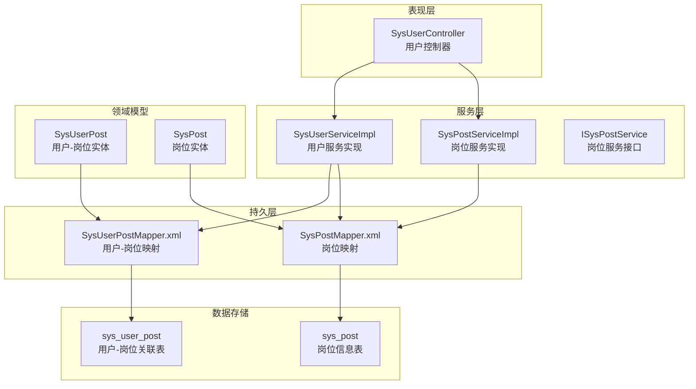
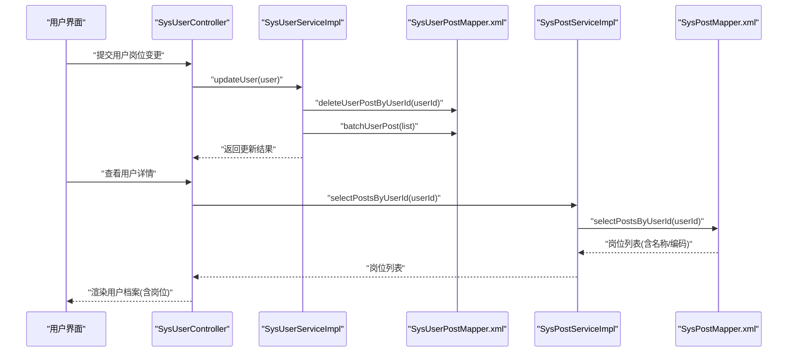
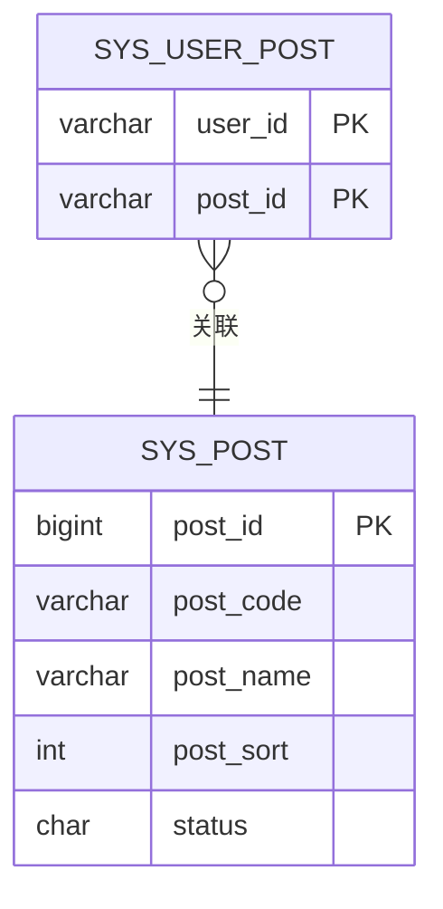
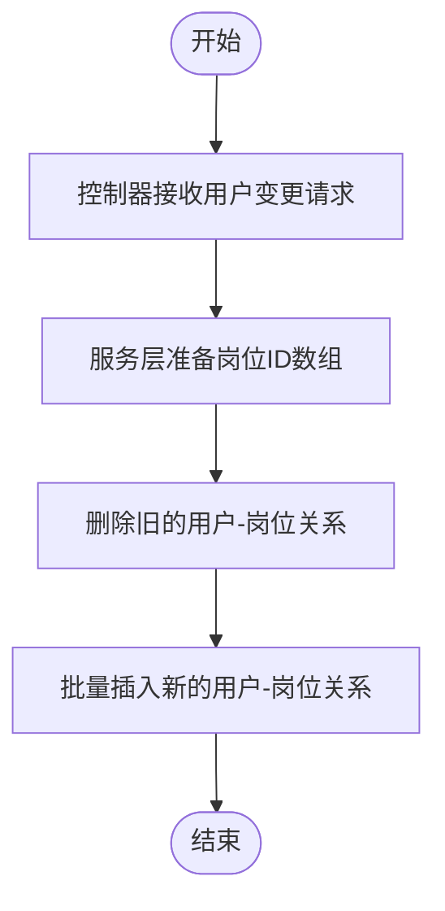
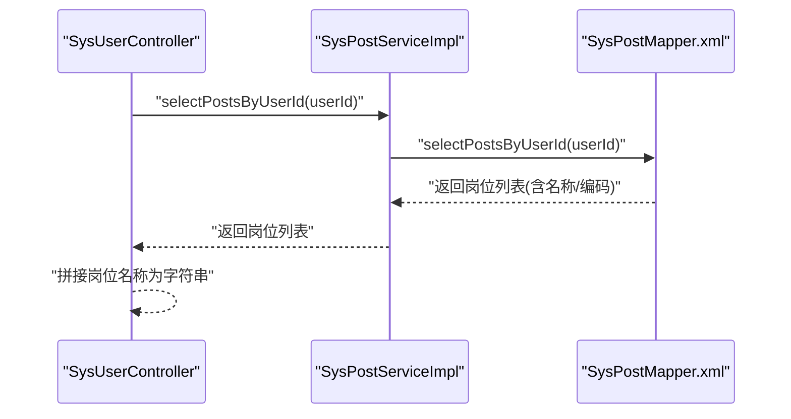
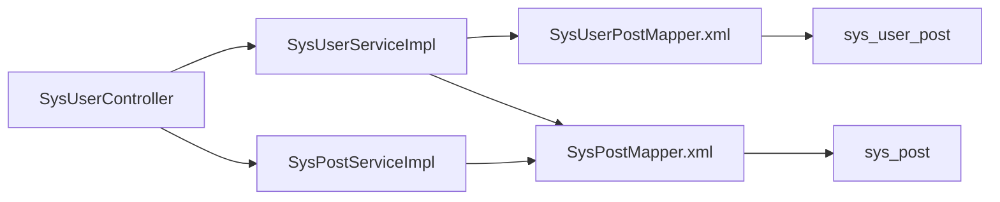

# 用户-岗位关联关系

<cite>
**本文引用的文件**
- [SysUserPost.java](file://ruoyi-system/src/main/java/com/ruoyi/system/domain/SysUserPost.java)
- [SysPost.java](file://ruoyi-system/src/main/java/com/ruoyi/system/domain/SysPost.java)
- [SysUserPostMapper.xml](file://ruoyi-system/src/main/resources/mapper/system/SysUserPostMapper.xml)
- [SysPostMapper.xml](file://ruoyi-system/src/main/resources/mapper/system/SysPostMapper.xml)
- [ISysPostService.java](file://ruoyi-system/src/main/java/com/ruoyi/system/service/ISysPostService.java)
- [SysPostServiceImpl.java](file://ruoyi-system/src/main/java/com/ruoyi/system/service/impl/SysPostServiceImpl.java)
- [SysUserServiceImpl.java](file://ruoyi-system/src/main/java/com/ruoyi/system/service/impl/SysUserServiceImpl.java)
- [SysUserController.java](file://ruoyi-admin/src/main/java/com/ruoyi/web/controller/system/SysUserController.java)
- [ry_20260319.sql](file://sql/ry_20260319.sql)
- [ruoyi.html](file://sql/ruoyi.html)
- [ruoyi.pdm](file://sql/ruoyi.pdm)
</cite>

## 目录
1. [引言](#引言)
2. [项目结构](#项目结构)
3. [核心组件](#核心组件)
4. [架构总览](#架构总览)
5. [详细组件分析](#详细组件分析)
6. [依赖分析](#依赖分析)
7. [性能考虑](#性能考虑)
8. [故障排查指南](#故障排查指南)
9. [结论](#结论)
10. [附录](#附录)

## 引言
本文件围绕“用户-岗位”关联关系展开，系统性阐述 sys_user_post 关联表的设计原理、岗位管理在组织架构中的定位与职责边界、以及在实际业务中如何进行用户岗位分配、变更与批量设置。同时，结合查询与权限控制层面，说明岗位信息在用户档案中的体现方式，并给出数据一致性保障、权限影响与组织架构变更处理建议。目标是帮助开发者快速理解并正确实现用户岗位关系在人力资源与组织架构管理中的应用。

## 项目结构
本项目采用典型的分层架构：前端控制器负责交互，后端服务层封装业务规则，持久层通过 MyBatis 映射数据库表。与“用户-岗位”相关的关键模块如下：
- 数据模型：SysUserPost（关联表）、SysPost（岗位表）
- 持久层映射：SysUserPostMapper.xml、SysPostMapper.xml
- 服务层接口与实现：ISysPostService、SysPostServiceImpl；SysUserServiceImpl 中包含用户岗位分配的核心逻辑
- 控制器：SysUserController 提供用户管理页面与交互入口

图表来源
- [SysUserController.java:1-200](file://ruoyi-admin/src/main/java/com/ruoyi/web/controller/system/SysUserController.java#L1-L200)
- [SysUserServiceImpl.java:1-200](file://ruoyi-system/src/main/java/com/ruoyi/system/service/impl/SysUserServiceImpl.java#L1-L200)
- [SysPostServiceImpl.java:1-181](file://ruoyi-system/src/main/java/com/ruoyi/system/service/impl/SysPostServiceImpl.java#L1-L181)
- [SysUserPostMapper.xml:1-34](file://ruoyi-system/src/main/resources/mapper/system/SysUserPostMapper.xml#L1-L34)
- [SysPostMapper.xml:1-110](file://ruoyi-system/src/main/resources/mapper/system/SysPostMapper.xml#L1-L110)

章节来源
- [SysUserController.java:1-200](file://ruoyi-admin/src/main/java/com/ruoyi/web/controller/system/SysUserController.java#L1-L200)
- [SysUserServiceImpl.java:1-200](file://ruoyi-system/src/main/java/com/ruoyi/system/service/impl/SysUserServiceImpl.java#L1-L200)
- [SysPostServiceImpl.java:1-181](file://ruoyi-system/src/main/java/com/ruoyi/system/service/impl/SysPostServiceImpl.java#L1-L181)
- [SysUserPostMapper.xml:1-34](file://ruoyi-system/src/main/resources/mapper/system/SysUserPostMapper.xml#L1-L34)
- [SysPostMapper.xml:1-110](file://ruoyi-system/src/main/resources/mapper/system/SysPostMapper.xml#L1-L110)

## 核心组件
- 关联实体 SysUserPost：承载用户ID与岗位ID的多对多关系，作为 sys_user_post 的映射对象。
- 岗位实体 SysPost：承载岗位编码、名称、排序、状态等字段，用于岗位维度的管理与展示。
- 关联映射 SysUserPostMapper.xml：提供按用户删除、按用户批量插入、按岗位计数等能力。
- 岗位映射 SysPostMapper.xml：提供按用户查询岗位列表、唯一性校验、更新与删除等能力。
- 服务接口与实现：ISysPostService 定义岗位服务契约；SysPostServiceImpl 实现业务逻辑；SysUserServiceImpl 实现用户岗位分配与变更。
- 控制器 SysUserController：提供用户管理页面与交互，联动岗位服务以完成用户岗位选择与提交。

章节来源
- [SysUserPost.java:1-46](file://ruoyi-system/src/main/java/com/ruoyi/system/domain/SysUserPost.java#L1-L46)
- [SysPost.java:1-123](file://ruoyi-system/src/main/java/com/ruoyi/system/domain/SysPost.java#L1-L123)
- [SysUserPostMapper.xml:1-34](file://ruoyi-system/src/main/resources/mapper/system/SysUserPostMapper.xml#L1-L34)
- [SysPostMapper.xml:1-110](file://ruoyi-system/src/main/resources/mapper/system/SysPostMapper.xml#L1-L110)
- [ISysPostService.java:1-92](file://ruoyi-system/src/main/java/com/ruoyi/system/service/ISysPostService.java#L1-L92)
- [SysPostServiceImpl.java:1-181](file://ruoyi-system/src/main/java/com/ruoyi/system/service/impl/SysPostServiceImpl.java#L1-L181)
- [SysUserServiceImpl.java:360-380](file://ruoyi-system/src/main/java/com/ruoyi/system/service/impl/SysUserServiceImpl.java#L360-L380)
- [SysUserController.java:116-182](file://ruoyi-admin/src/main/java/com/ruoyi/web/controller/system/SysUserController.java#L116-L182)

## 架构总览
用户岗位关系贯穿“控制器-服务-持久层-数据表”的完整链路。用户在页面选择岗位后，控制器将岗位ID数组传递给服务层；服务层在事务内先清理旧关系，再批量写入新关系，确保一致性；查询侧通过关联查询将岗位名称、编码等信息回显到用户档案中。

图表来源
- [SysUserController.java:158-182](file://ruoyi-admin/src/main/java/com/ruoyi/web/controller/system/SysUserController.java#L158-L182)
- [SysUserServiceImpl.java:251-265](file://ruoyi-system/src/main/java/com/ruoyi/system/service/impl/SysUserServiceImpl.java#L251-L265)
- [SysUserPostMapper.xml:12-32](file://ruoyi-system/src/main/resources/mapper/system/SysUserPostMapper.xml#L12-L32)
- [SysPostServiceImpl.java:61-75](file://ruoyi-system/src/main/java/com/ruoyi/system/service/impl/SysPostServiceImpl.java#L61-L75)
- [SysPostMapper.xml:44-50](file://ruoyi-system/src/main/resources/mapper/system/SysPostMapper.xml#L44-L50)

## 详细组件分析

### 关联表设计与数据模型
- 表 sys_user_post：主键为 (user_id, post_id)，构成用户-岗位的多对多关系。
- 实体 SysUserPost：包含 userId、postId 字段，用于 Java 层面的映射与传输。
- 岗位实体 SysPost：包含岗位编码、名称、排序、状态等，支撑岗位维度的管理与展示。

图表来源
- [ruoyi.html:2843-2861](file://sql/ruoyi.html#L2843-L2861)
- [ruoyi.pdm:3187-3210](file://sql/ruoyi.pdm#L3187-L3210)
- [SysUserPost.java:11-46](file://ruoyi-system/src/main/java/com/ruoyi/system/domain/SysUserPost.java#L11-L46)
- [SysPost.java:15-123](file://ruoyi-system/src/main/java/com/ruoyi/system/domain/SysPost.java#L15-L123)

章节来源
- [ruoyi.html:2843-2861](file://sql/ruoyi.html#L2843-L2861)
- [ruoyi.pdm:3187-3210](file://sql/ruoyi.pdm#L3187-L3210)
- [SysUserPost.java:11-46](file://ruoyi-system/src/main/java/com/ruoyi/system/domain/SysUserPost.java#L11-L46)
- [SysPost.java:15-123](file://ruoyi-system/src/main/java/com/ruoyi/system/domain/SysPost.java#L15-L123)

### 岗位管理在组织架构中的作用
- 岗位职责：通过岗位实体的名称、编码、排序与状态，明确岗位在组织中的层级与可用性。
- 薪酬等级与工作权限：项目中未直接提供薪酬等级字段；权限方面，岗位可与角色组合共同决定用户可访问的资源与操作范围（角色与菜单权限由其他表支撑）。
- 组织架构变更：当岗位被删除或禁用时，需检查是否已被用户占用，避免破坏数据完整性。

章节来源
- [SysPost.java:15-123](file://ruoyi-system/src/main/java/com/ruoyi/system/domain/SysPost.java#L15-L123)
- [SysPostServiceImpl.java:95-108](file://ruoyi-system/src/main/java/com/ruoyi/system/service/impl/SysPostServiceImpl.java#L95-L108)

### 用户岗位分配与变更流程
- 新增用户时的岗位分配：控制器将岗位ID数组传入服务层，服务层批量写入关联表。
- 修改用户时的岗位变更：服务层先删除旧关系，再写入新关系，保证与用户当前选择一致。
- 删除用户时的清理：同时清理用户与岗位的关联关系。

图表来源
- [SysUserController.java:187-200](file://ruoyi-admin/src/main/java/com/ruoyi/web/controller/system/SysUserController.java#L187-L200)
- [SysUserServiceImpl.java:251-265](file://ruoyi-system/src/main/java/com/ruoyi/system/service/impl/SysUserServiceImpl.java#L251-L265)
- [SysUserPostMapper.xml:12-32](file://ruoyi-system/src/main/resources/mapper/system/SysUserPostMapper.xml#L12-L32)

章节来源
- [SysUserController.java:116-182](file://ruoyi-admin/src/main/java/com/ruoyi/web/controller/system/SysUserController.java#L116-L182)
- [SysUserServiceImpl.java:251-265](file://ruoyi-system/src/main/java/com/ruoyi/system/service/impl/SysUserServiceImpl.java#L251-L265)
- [SysUserPostMapper.xml:12-32](file://ruoyi-system/src/main/resources/mapper/system/SysUserPostMapper.xml#L12-L32)

### 批量岗位设置
- 支持通过控制器接收多个岗位ID，服务层批量写入关联表，提升批量配置效率。
- 批量删除用户时，同样通过关联映射提供的批量删除能力清理关系。

章节来源
- [SysUserServiceImpl.java:360-380](file://ruoyi-system/src/main/java/com/ruoyi/system/service/impl/SysUserServiceImpl.java#L360-L380)
- [SysUserPostMapper.xml:20-25](file://ruoyi-system/src/main/resources/mapper/system/SysUserPostMapper.xml#L20-L25)

### 岗位信息在用户档案中的体现
- 查询用户所拥有的岗位：通过关联查询返回岗位名称、编码等关键信息，便于在用户详情页展示。
- 岗位组拼接：服务层将用户岗位名称拼接为字符串，便于前端展示。

图表来源
- [SysUserController.java:174-182](file://ruoyi-admin/src/main/java/com/ruoyi/web/controller/system/SysUserController.java#L174-L182)
- [SysPostServiceImpl.java:61-75](file://ruoyi-system/src/main/java/com/ruoyi/system/service/impl/SysPostServiceImpl.java#L61-L75)
- [SysPostMapper.xml:44-50](file://ruoyi-system/src/main/resources/mapper/system/SysPostMapper.xml#L44-L50)

章节来源
- [SysUserController.java:174-182](file://ruoyi-admin/src/main/java/com/ruoyi/web/controller/system/SysUserController.java#L174-L182)
- [SysPostServiceImpl.java:61-75](file://ruoyi-system/src/main/java/com/ruoyi/system/service/impl/SysPostServiceImpl.java#L61-L75)
- [SysPostMapper.xml:44-50](file://ruoyi-system/src/main/resources/mapper/system/SysPostMapper.xml#L44-L50)

### 数据一致性保证
- 事务控制：用户更新时，服务层在事务内先删除旧关系，再批量写入新关系，避免中间态导致的数据不一致。
- 唯一性与约束：关联表主键为 (user_id, post_id)，防止重复记录；岗位名称与编码提供唯一性校验，减少业务冲突。
- 删除保护：删除岗位前检查是否已被用户占用，避免破坏外键引用与业务完整性。

章节来源
- [SysUserServiceImpl.java:251-265](file://ruoyi-system/src/main/java/com/ruoyi/system/service/impl/SysUserServiceImpl.java#L251-L265)
- [SysPostServiceImpl.java:95-108](file://ruoyi-system/src/main/java/com/ruoyi/system/service/impl/SysPostServiceImpl.java#L95-L108)
- [SysPostMapper.xml:57-65](file://ruoyi-system/src/main/resources/mapper/system/SysPostMapper.xml#L57-L65)

### 岗位权限影响与组织架构变更处理
- 权限影响：岗位本身不直接定义权限，但可与角色组合共同决定用户可访问的菜单与操作。变更岗位不会直接影响权限，但会影响用户在组织架构中的职责边界。
- 组织架构变更：当岗位被停用或删除时，需同步调整相关用户的岗位分配；若岗位仍被占用，应阻止删除并提示用户先清理占用。

章节来源
- [SysPostServiceImpl.java:95-108](file://ruoyi-system/src/main/java/com/ruoyi/system/service/impl/SysPostServiceImpl.java#L95-L108)

## 依赖分析
- 控制器依赖服务层：SysUserController 依赖 ISysUserService 与 ISysPostService。
- 服务层依赖映射：SysUserServiceImpl 依赖 SysUserPostMapper 与 SysPostMapper；SysPostServiceImpl 依赖 SysPostMapper。
- 映射依赖表：MyBatis XML 映射文件对应 sys_user_post 与 sys_post 表。

图表来源
- [SysUserController.java:1-200](file://ruoyi-admin/src/main/java/com/ruoyi/web/controller/system/SysUserController.java#L1-L200)
- [SysUserServiceImpl.java:1-200](file://ruoyi-system/src/main/java/com/ruoyi/system/service/impl/SysUserServiceImpl.java#L1-L200)
- [SysPostServiceImpl.java:1-181](file://ruoyi-system/src/main/java/com/ruoyi/system/service/impl/SysPostServiceImpl.java#L1-L181)
- [SysUserPostMapper.xml:1-34](file://ruoyi-system/src/main/resources/mapper/system/SysUserPostMapper.xml#L1-L34)
- [SysPostMapper.xml:1-110](file://ruoyi-system/src/main/resources/mapper/system/SysPostMapper.xml#L1-L110)

章节来源
- [SysUserController.java:1-200](file://ruoyi-admin/src/main/java/com/ruoyi/web/controller/system/SysUserController.java#L1-L200)
- [SysUserServiceImpl.java:1-200](file://ruoyi-system/src/main/java/com/ruoyi/system/service/impl/SysUserServiceImpl.java#L1-L200)
- [SysPostServiceImpl.java:1-181](file://ruoyi-system/src/main/java/com/ruoyi/system/service/impl/SysPostServiceImpl.java#L1-L181)
- [SysUserPostMapper.xml:1-34](file://ruoyi-system/src/main/resources/mapper/system/SysUserPostMapper.xml#L1-L34)
- [SysPostMapper.xml:1-110](file://ruoyi-system/src/main/resources/mapper/system/SysPostMapper.xml#L1-L110)

## 性能考虑
- 批量写入：用户岗位变更采用批量插入，减少多次往返数据库的开销。
- 关联查询：用户详情页通过一次关联查询即可获取岗位名称与编码，避免 N+1 查询问题。
- 索引与主键：sys_user_post 主键覆盖 user_id 与 post_id，适合按用户或按岗位的查询场景。

## 故障排查指南
- 岗位删除报错：若提示“已分配，不能删除”，请先清理占用该岗位的用户关系后再尝试删除。
- 用户岗位变更无效：确认控制器是否正确接收岗位ID数组，服务层是否执行了“先删后插”的流程。
- 岗位唯一性冲突：岗位名称或编码重复会导致校验失败，请调整后重试。

章节来源
- [SysPostServiceImpl.java:95-108](file://ruoyi-system/src/main/java/com/ruoyi/system/service/impl/SysPostServiceImpl.java#L95-L108)
- [SysUserServiceImpl.java:251-265](file://ruoyi-system/src/main/java/com/ruoyi/system/service/impl/SysUserServiceImpl.java#L251-L265)
- [SysPostMapper.xml:57-65](file://ruoyi-system/src/main/resources/mapper/system/SysPostMapper.xml#L57-L65)

## 结论
sys_user_post 关联表通过简洁的双字段主键实现了用户与岗位的灵活多对多关系。配合服务层的事务化处理与映射层的高效查询，能够稳定支撑用户岗位分配、变更与批量设置等核心业务。在组织架构管理中，岗位主要承担职责边界与可见性的定义，而权限控制则由岗位与角色的组合共同实现。遵循本文所述流程与最佳实践，可有效保障数据一致性与业务连续性。

## 附录

### 数据库初始化脚本要点
- sys_post 初始化包含岗位编码、名称、排序与状态等字段，支撑岗位维度的基础管理。
- sys_user_post 作为关联表，承载用户与岗位的绑定关系。

章节来源
- [ry_20260319.sql:74-100](file://sql/ry_20260319.sql#L74-L100)