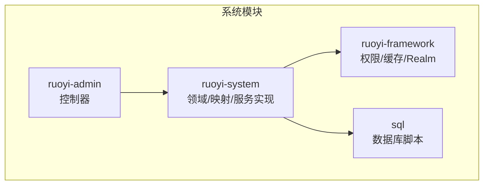
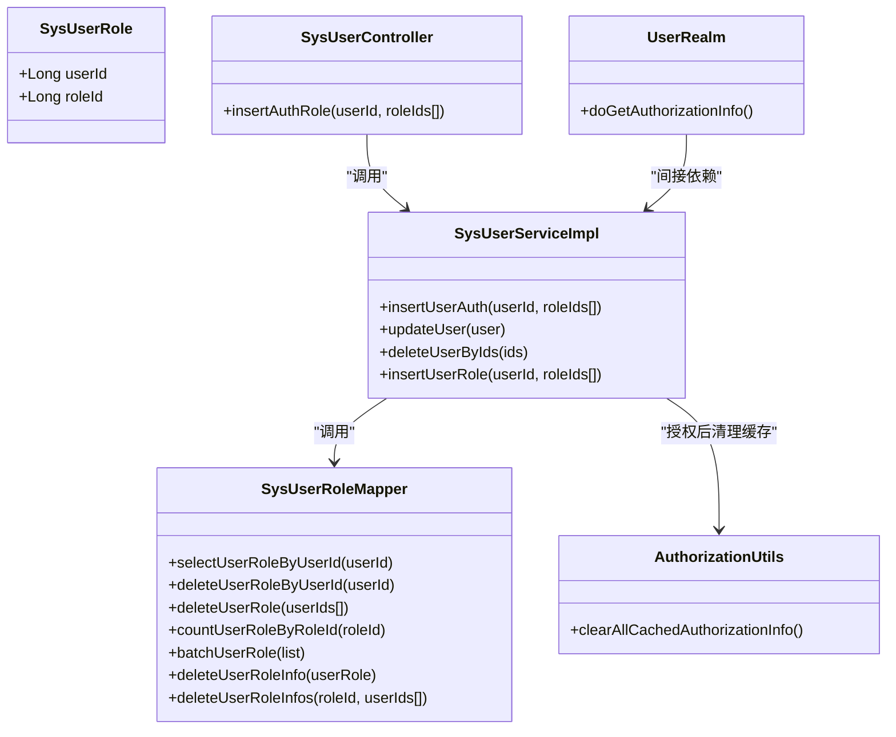
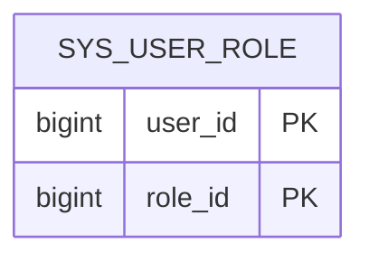
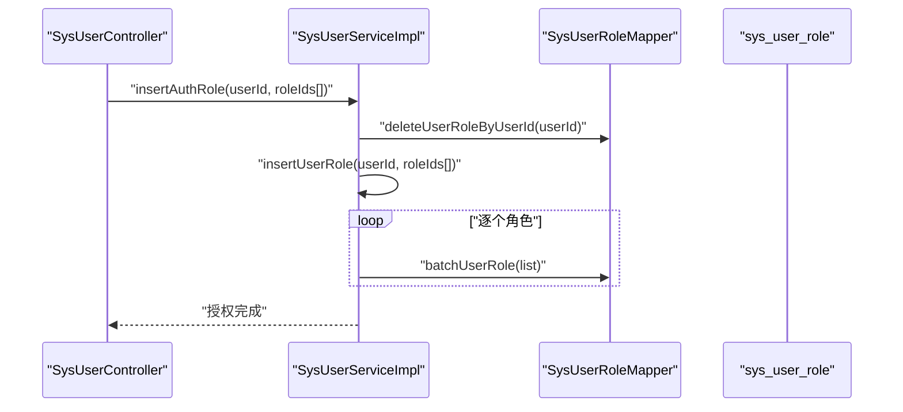
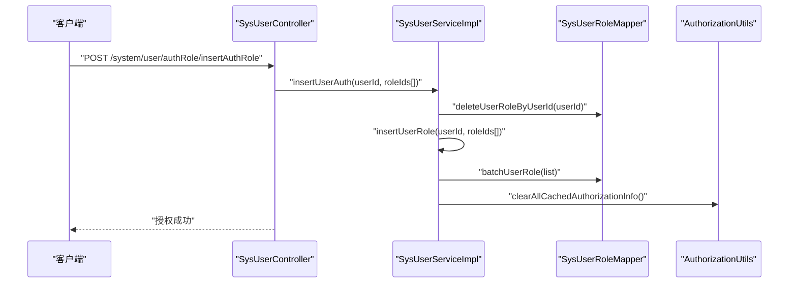
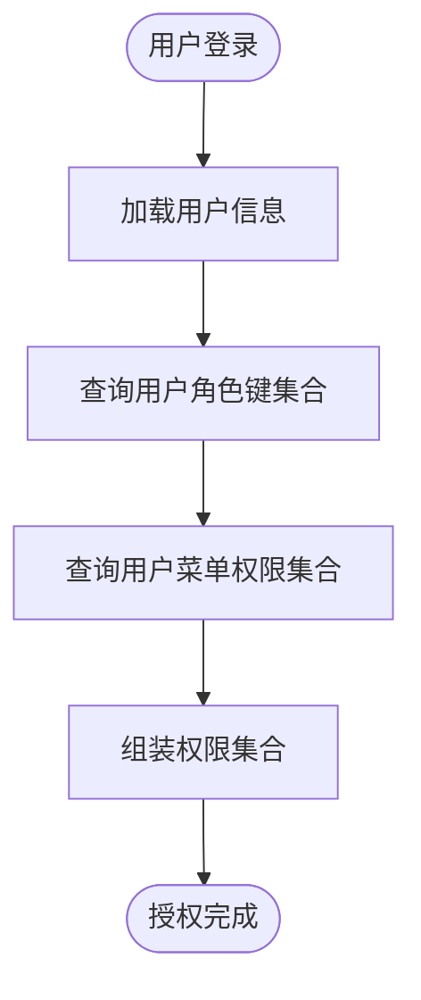
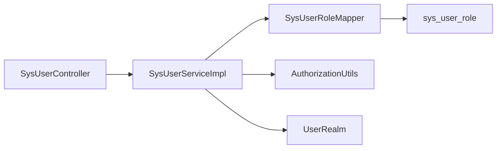

# 用户-角色关联关系

<cite>
**本文引用的文件**
- [SysUserRole.java](file://ruoyi-system/src/main/java/com/ruoyi/system/domain/SysUserRole.java)
- [SysUserRoleMapper.java](file://ruoyi-system/src/main/java/com/ruoyi/system/mapper/SysUserRoleMapper.java)
- [SysUserRoleMapper.xml](file://ruoyi-system/src/main/resources/mapper/system/SysUserRoleMapper.xml)
- [SysUserServiceImpl.java](file://ruoyi-system/src/main/java/com/ruoyi/system/service/impl/SysUserServiceImpl.java)
- [ISysUserService.java](file://ruoyi-system/src/main/java/com/ruoyi/system/service/ISysUserService.java)
- [SysUserController.java](file://ruoyi-admin/src/main/java/com/ruoyi/web/controller/system/SysUserController.java)
- [AuthorizationUtils.java](file://ruoyi-framework/src/main/java/com/ruoyi/framework/shiro/util/AuthorizationUtils.java)
- [UserRealm.java](file://ruoyi-framework/src/main/java/com/ruoyi/framework/shiro/realm/UserRealm.java)
- [PermissionService.java](file://ruoyi-framework/src/main/java/com/ruoyi/framework/web/service/PermissionService.java)
- [ry_20260319.sql](file://sql/ry_20260319.sql)
</cite>

## 目录
1. [简介](#简介)
2. [项目结构](#项目结构)
3. [核心组件](#核心组件)
4. [架构总览](#架构总览)
5. [详细组件分析](#详细组件分析)
6. [依赖关系分析](#依赖关系分析)
7. [性能考量](#性能考量)
8. [故障排查指南](#故障排查指南)
9. [结论](#结论)
10. [附录](#附录)

## 简介
本文件围绕“用户-角色关联关系”展开，系统化阐述 sys_user_role 关联表的设计原理、业务逻辑、权限继承与层级关系、API 与 SQL 操作示例、权限验证与缓存机制、数据一致性与并发控制策略，并总结 RBAC 模型中的最佳实践。目标是帮助开发者快速理解并正确使用用户-角色关联关系，确保权限体系稳定可靠。

## 项目结构
与用户-角色关联相关的核心代码分布在以下模块：
- 领域模型与映射：ruoyi-system 模块的 domain、mapper、resources/mapper
- 业务服务：ruoyi-system 的 service.impl
- 控制器：ruoyi-admin 的 controller
- 权限与缓存：ruoyi-framework 的 shiro realm、权限服务与缓存清理工具
- 数据库脚本：sql/ry_20260319.sql

**图表来源**
- [SysUserRole.java:11-46](file://ruoyi-system/src/main/java/com/ruoyi/system/domain/SysUserRole.java#L11-L46)
- [SysUserRoleMapper.java:12-70](file://ruoyi-system/src/main/java/com/ruoyi/system/mapper/SysUserRoleMapper.java#L12-L70)
- [SysUserRoleMapper.xml:5-48](file://ruoyi-system/src/main/resources/mapper/system/SysUserRoleMapper.xml#L5-L48)
- [SysUserServiceImpl.java:46-596](file://ruoyi-system/src/main/java/com/ruoyi/system/service/impl/SysUserServiceImpl.java#L46-L596)
- [SysUserController.java:43-357](file://ruoyi-admin/src/main/java/com/ruoyi/web/controller/system/SysUserController.java#L43-L357)
- [AuthorizationUtils.java:12-30](file://ruoyi-framework/src/main/java/com/ruoyi/framework/shiro/util/AuthorizationUtils.java#L12-L30)
- [UserRealm.java:40-159](file://ruoyi-framework/src/main/java/com/ruoyi/framework/shiro/realm/UserRealm.java#L40-L159)
- [PermissionService.java:18-263](file://ruoyi-framework/src/main/java/com/ruoyi/framework/web/service/PermissionService.java#L18-L263)
- [ry_20260319.sql:260-274](file://sql/ry_20260319.sql#L260-L274)

**章节来源**
- [SysUserRole.java:11-46](file://ruoyi-system/src/main/java/com/ruoyi/system/domain/SysUserRole.java#L11-L46)
- [SysUserRoleMapper.java:12-70](file://ruoyi-system/src/main/java/com/ruoyi/system/mapper/SysUserRoleMapper.java#L12-L70)
- [SysUserRoleMapper.xml:5-48](file://ruoyi-system/src/main/resources/mapper/system/SysUserRoleMapper.xml#L5-L48)
- [SysUserServiceImpl.java:46-596](file://ruoyi-system/src/main/java/com/ruoyi/system/service/impl/SysUserServiceImpl.java#L46-L596)
- [SysUserController.java:43-357](file://ruoyi-admin/src/main/java/com/ruoyi/web/controller/system/SysUserController.java#L43-L357)
- [AuthorizationUtils.java:12-30](file://ruoyi-framework/src/main/java/com/ruoyi/framework/shiro/util/AuthorizationUtils.java#L12-L30)
- [UserRealm.java:40-159](file://ruoyi-framework/src/main/java/com/ruoyi/framework/shiro/realm/UserRealm.java#L40-L159)
- [PermissionService.java:18-263](file://ruoyi-framework/src/main/java/com/ruoyi/framework/web/service/PermissionService.java#L18-L263)
- [ry_20260319.sql:260-274](file://sql/ry_20260319.sql#L260-L274)

## 核心组件
- 领域模型：SysUserRole 表示用户与角色的关联，包含 userId、roleId 两个字段。
- 映射接口：SysUserRoleMapper 提供按用户查询、按用户删除、按角色计数、批量新增、按条件删除等方法。
- 服务实现：SysUserServiceImpl 在用户授权、更新、删除等场景中调用 SysUserRoleMapper 完成用户-角色关系的维护。
- 控制器：SysUserController 提供授权角色的 API，接收 userId 和 roleIds，调用服务层完成授权。
- 权限与缓存：UserRealm 在授权阶段根据用户 ID 查询角色与权限；AuthorizationUtils 提供清理授权缓存的能力；PermissionService 提供权限校验的便捷方法。

**章节来源**
- [SysUserRole.java:11-46](file://ruoyi-system/src/main/java/com/ruoyi/system/domain/SysUserRole.java#L11-L46)
- [SysUserRoleMapper.java:12-70](file://ruoyi-system/src/main/java/com/ruoyi/system/mapper/SysUserRoleMapper.java#L12-L70)
- [SysUserServiceImpl.java:310-354](file://ruoyi-system/src/main/java/com/ruoyi/system/service/impl/SysUserServiceImpl.java#L310-L354)
- [SysUserController.java:263-274](file://ruoyi-admin/src/main/java/com/ruoyi/web/controller/system/SysUserController.java#L263-L274)
- [UserRealm.java:56-81](file://ruoyi-framework/src/main/java/com/ruoyi/framework/shiro/realm/UserRealm.java#L56-L81)
- [AuthorizationUtils.java:14-20](file://ruoyi-framework/src/main/java/com/ruoyi/framework/shiro/util/AuthorizationUtils.java#L14-L20)

## 架构总览
用户-角色关联关系在 RBAC 中处于“中间层”，连接用户与角色，支撑权限计算与缓存失效。

**图表来源**
- [SysUserRole.java:11-46](file://ruoyi-system/src/main/java/com/ruoyi/system/domain/SysUserRole.java#L11-L46)
- [SysUserRoleMapper.java:12-70](file://ruoyi-system/src/main/java/com/ruoyi/system/mapper/SysUserRoleMapper.java#L12-L70)
- [SysUserServiceImpl.java:310-354](file://ruoyi-system/src/main/java/com/ruoyi/system/service/impl/SysUserServiceImpl.java#L310-L354)
- [SysUserController.java:263-274](file://ruoyi-admin/src/main/java/com/ruoyi/web/controller/system/SysUserController.java#L263-L274)
- [UserRealm.java:56-81](file://ruoyi-framework/src/main/java/com/ruoyi/framework/shiro/realm/UserRealm.java#L56-L81)
- [AuthorizationUtils.java:14-20](file://ruoyi-framework/src/main/java/com/ruoyi/framework/shiro/util/AuthorizationUtils.java#L14-L20)

## 详细组件分析

### 关联表设计与主键
- 表名：sys_user_role
- 字段：user_id、role_id
- 主键：(user_id, role_id)，即“用户ID + 角色ID”的联合主键
- 设计意图：确保同一用户对同一角色仅能存在一条记录，避免重复授权；同时支持用户多角色、角色多用户的多对多关系。

**图表来源**
- [ry_20260319.sql:260-267](file://sql/ry_20260319.sql#L260-L267)

**章节来源**
- [ry_20260319.sql:260-267](file://sql/ry_20260319.sql#L260-L267)

### 领域模型与映射
- SysUserRole：承载用户与角色的关联实体，提供 userId、roleId 的 getter/setter。
- SysUserRoleMapper：定义了按用户查询、按用户删除、按角色计数、批量新增、按条件删除等方法签名。
- SysUserRoleMapper.xml：对应 SQL 实现，包括按用户查询、按用户删除、按角色计数、批量插入、按条件删除等。

**图表来源**
- [SysUserController.java:263-274](file://ruoyi-admin/src/main/java/com/ruoyi/web/controller/system/SysUserController.java#L263-L274)
- [SysUserServiceImpl.java:310-354](file://ruoyi-system/src/main/java/com/ruoyi/system/service/impl/SysUserServiceImpl.java#L310-L354)
- [SysUserRoleMapper.java:12-70](file://ruoyi-system/src/main/java/com/ruoyi/system/mapper/SysUserRoleMapper.java#L12-L70)
- [SysUserRoleMapper.xml:12-47](file://ruoyi-system/src/main/resources/mapper/system/SysUserRoleMapper.xml#L12-L47)

**章节来源**
- [SysUserRole.java:11-46](file://ruoyi-system/src/main/java/com/ruoyi/system/domain/SysUserRole.java#L11-L46)
- [SysUserRoleMapper.java:12-70](file://ruoyi-system/src/main/java/com/ruoyi/system/mapper/SysUserRoleMapper.java#L12-L70)
- [SysUserRoleMapper.xml:5-48](file://ruoyi-system/src/main/resources/mapper/system/SysUserRoleMapper.xml#L5-L48)

### 业务逻辑与API调用
- 用户授权角色（单用户多角色）
  - API：POST /system/user/authRole/insertAuthRole
  - 参数：userId、roleIds[]
  - 流程：控制器调用服务层 insertUserAuth，服务层先删除旧关系，再批量新增新关系；授权完成后清理授权缓存。
- 用户更新（变更角色）
  - 流程：服务层先删除旧关系，再新增新关系；授权完成后清理授权缓存。
- 用户删除（级联清理）
  - 流程：服务层删除用户与角色关联、用户与岗位关联，再删除用户。

**图表来源**
- [SysUserController.java:263-274](file://ruoyi-admin/src/main/java/com/ruoyi/web/controller/system/SysUserController.java#L263-L274)
- [SysUserServiceImpl.java:310-354](file://ruoyi-system/src/main/java/com/ruoyi/system/service/impl/SysUserServiceImpl.java#L310-L354)
- [AuthorizationUtils.java:14-20](file://ruoyi-framework/src/main/java/com/ruoyi/framework/shiro/util/AuthorizationUtils.java#L14-L20)

**章节来源**
- [SysUserController.java:247-274](file://ruoyi-admin/src/main/java/com/ruoyi/web/controller/system/SysUserController.java#L247-L274)
- [SysUserServiceImpl.java:310-354](file://ruoyi-system/src/main/java/com/ruoyi/system/service/impl/SysUserServiceImpl.java#L310-L354)

### 权限继承机制与角色层级
- 角色层级：代码中未定义“角色层级”（如父子角色）的直接实现，权限继承主要通过“角色-菜单”关联表 sys_role_menu 实现。
- 用户-角色关联表仅负责“用户拥有哪些角色”，不直接体现角色之间的层级关系。
- 权限计算：UserRealm 在授权阶段根据用户 ID 查询其角色键集合与菜单权限集合，形成最终权限集。

**图表来源**
- [UserRealm.java:56-81](file://ruoyi-framework/src/main/java/com/ruoyi/framework/shiro/realm/UserRealm.java#L56-L81)

**章节来源**
- [UserRealm.java:56-81](file://ruoyi-framework/src/main/java/com/ruoyi/framework/shiro/realm/UserRealm.java#L56-L81)

### 权限验证与缓存
- 权限校验：PermissionService 提供 hasPermi、hasAnyPermi、hasRole、hasAnyRoles 等方法，底层基于 Shiro Subject。
- 缓存清理：AuthorizationUtils 提供清理所有用户授权信息缓存的方法；SysUserController 在用户授权后主动清理缓存，确保权限即时生效。

**章节来源**
- [PermissionService.java:18-263](file://ruoyi-framework/src/main/java/com/ruoyi/framework/web/service/PermissionService.java#L18-L263)
- [AuthorizationUtils.java:14-20](file://ruoyi-framework/src/main/java/com/ruoyi/framework/shiro/util/AuthorizationUtils.java#L14-L20)
- [SysUserController.java:210-211](file://ruoyi-admin/src/main/java/com/ruoyi/web/controller/system/SysUserController.java#L210-L211)

### 数据一致性、事务与并发控制
- 事务边界：用户授权、更新、删除均使用 @Transactional，确保用户-角色关系的原子性。
- 并发控制：通过联合主键约束防止重复授权；批量新增采用 MyBatis foreach 批量插入，减少往返次数。
- 并发冲突处理：未见显式的行级锁或版本号控制，建议在高并发场景下结合业务需求评估是否需要额外的锁策略或幂等设计。

**章节来源**
- [SysUserServiceImpl.java:180-211](file://ruoyi-system/src/main/java/com/ruoyi/system/service/impl/SysUserServiceImpl.java#L180-L211)
- [SysUserServiceImpl.java:310-354](file://ruoyi-system/src/main/java/com/ruoyi/system/service/impl/SysUserServiceImpl.java#L310-L354)
- [SysUserRoleMapper.xml:31-36](file://ruoyi-system/src/main/resources/mapper/system/SysUserRoleMapper.xml#L31-L36)

## 依赖关系分析
- 控制器依赖服务层；服务层依赖映射层；映射层依赖数据库；授权阶段依赖权限服务与缓存清理工具。
- 用户-角色关联表与角色-菜单表共同构成权限模型的“关系层”。

**图表来源**
- [SysUserController.java:263-274](file://ruoyi-admin/src/main/java/com/ruoyi/web/controller/system/SysUserController.java#L263-L274)
- [SysUserServiceImpl.java:310-354](file://ruoyi-system/src/main/java/com/ruoyi/system/service/impl/SysUserServiceImpl.java#L310-L354)
- [SysUserRoleMapper.java:12-70](file://ruoyi-system/src/main/java/com/ruoyi/system/mapper/SysUserRoleMapper.java#L12-L70)
- [AuthorizationUtils.java:14-20](file://ruoyi-framework/src/main/java/com/ruoyi/framework/shiro/util/AuthorizationUtils.java#L14-L20)
- [UserRealm.java:56-81](file://ruoyi-framework/src/main/java/com/ruoyi/framework/shiro/realm/UserRealm.java#L56-L81)

**章节来源**
- [SysUserController.java:263-274](file://ruoyi-admin/src/main/java/com/ruoyi/web/controller/system/SysUserController.java#L263-L274)
- [SysUserServiceImpl.java:310-354](file://ruoyi-system/src/main/java/com/ruoyi/system/service/impl/SysUserServiceImpl.java#L310-L354)
- [SysUserRoleMapper.java:12-70](file://ruoyi-system/src/main/java/com/ruoyi/system/mapper/SysUserRoleMapper.java#L12-L70)
- [AuthorizationUtils.java:14-20](file://ruoyi-framework/src/main/java/com/ruoyi/framework/shiro/util/AuthorizationUtils.java#L14-L20)
- [UserRealm.java:56-81](file://ruoyi-framework/src/main/java/com/ruoyi/framework/shiro/realm/UserRealm.java#L56-L81)

## 性能考量
- 批量写入：批量新增用户角色关系可显著降低网络往返与事务开销。
- 缓存命中：权限缓存可减少每次鉴权的数据库查询；授权变更后及时清理缓存，避免脏读。
- 索引与主键：联合主键可有效避免重复授权；建议在高频查询场景下关注相关索引覆盖情况。

[本节为通用指导，无需特定文件引用]

## 故障排查指南
- 授权后权限未生效
  - 检查是否调用了清理授权缓存的方法；确认控制器在授权后确实触发了缓存清理。
- 重复授权导致异常
  - 联合主键约束应阻止重复授权；如出现异常，检查是否绕过了服务层或手动插入重复记录。
- 批量授权失败
  - 检查传入的 roleIds 是否为空；确认批量插入 SQL 是否正确执行。

**章节来源**
- [SysUserController.java:210-211](file://ruoyi-admin/src/main/java/com/ruoyi/web/controller/system/SysUserController.java#L210-L211)
- [SysUserServiceImpl.java:336-354](file://ruoyi-system/src/main/java/com/ruoyi/system/service/impl/SysUserServiceImpl.java#L336-L354)
- [SysUserRoleMapper.xml:31-36](file://ruoyi-system/src/main/resources/mapper/system/SysUserRoleMapper.xml#L31-L36)

## 结论
用户-角色关联关系是 RBAC 权限模型的“桥梁”。通过联合主键确保关系唯一性，配合服务层的事务与缓存策略，实现了高效、可靠的权限授权与验证。在实际应用中，建议：
- 使用服务层提供的授权方法，避免绕过事务与缓存清理；
- 在高并发场景下评估锁策略与幂等设计；
- 明确权限继承与角色层级的边界，避免混淆“用户-角色”与“角色-菜单”的职责。

[本节为总结性内容，无需特定文件引用]

## 附录

### SQL 操作示例（概念性说明）
- 添加用户角色
  - 插入一条或多条记录到 sys_user_role，字段为 user_id、role_id。
- 删除用户角色
  - 按用户删除：删除 user_id 对应的所有记录。
  - 按角色删除：删除 role_id 对应的所有记录。
  - 按条件删除：按用户与角色的组合条件删除。
- 批量分配
  - 使用批量插入语句一次性写入多条用户-角色关系。

**章节来源**
- [SysUserRoleMapper.xml:12-47](file://ruoyi-system/src/main/resources/mapper/system/SysUserRoleMapper.xml#L12-L47)
- [ry_20260319.sql:260-274](file://sql/ry_20260319.sql#L260-L274)

### API 调用方法（概念性说明）
- 用户授权角色
  - 方法：POST
  - 路径：/system/user/authRole/insertAuthRole
  - 参数：userId、roleIds[]
  - 行为：删除旧关系，批量新增新关系，清理授权缓存

**章节来源**
- [SysUserController.java:263-274](file://ruoyi-admin/src/main/java/com/ruoyi/web/controller/system/SysUserController.java#L263-L274)