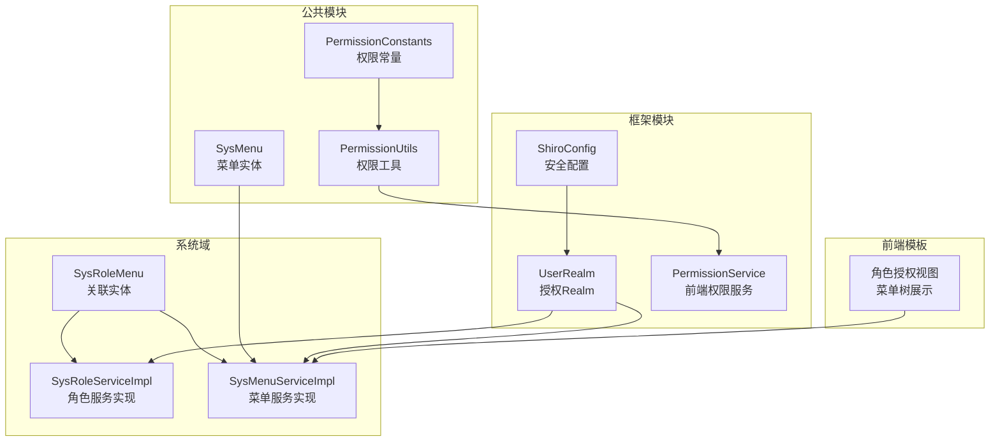
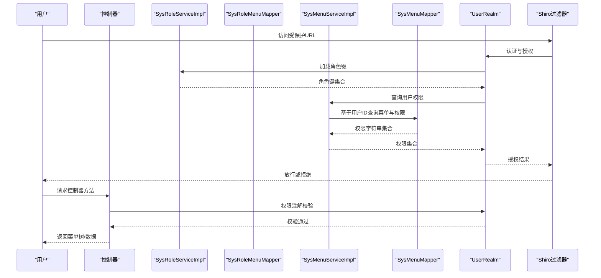
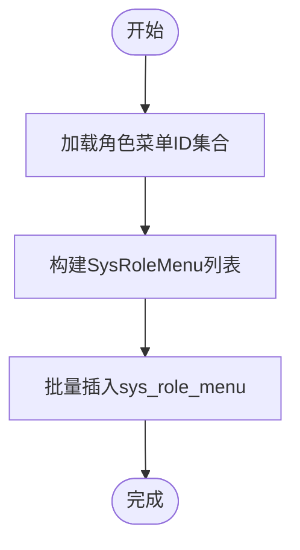
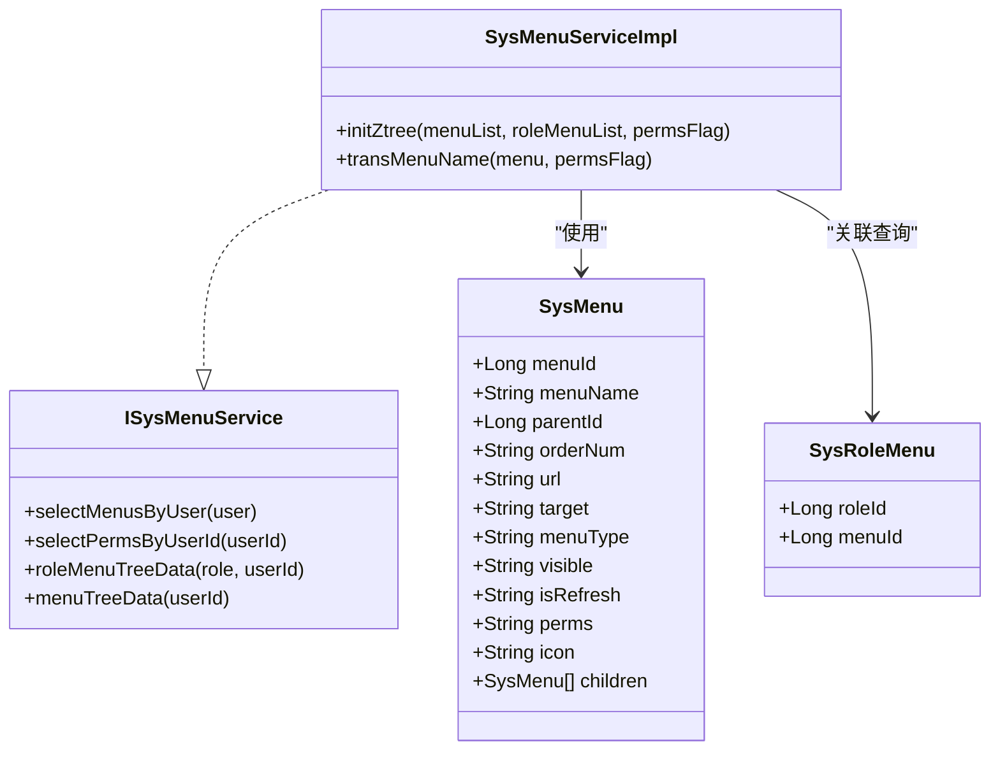
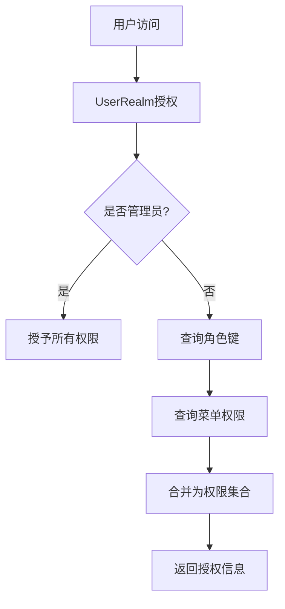
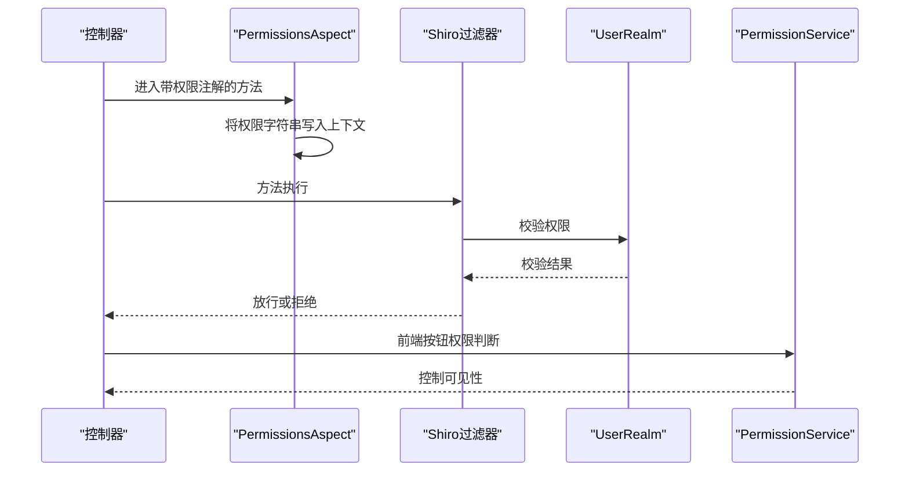
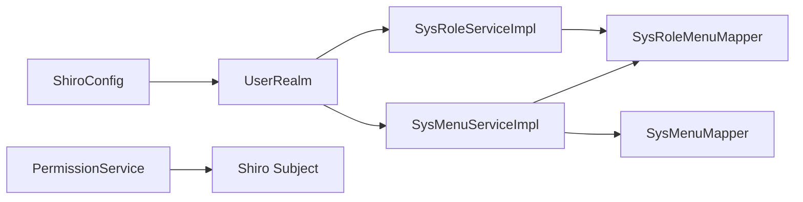

# 角色-菜单关联关系

<cite>
**本文引用的文件**
- [SysRoleMenu.java](file://ruoyi-system/src/main/java/com/ruoyi/system/domain/SysRoleMenu.java)
- [SysRoleMenuMapper.java](file://ruoyi-system/src/main/java/com/ruoyi/system/mapper/SysRoleMenuMapper.java)
- [SysRoleMenuMapper.xml](file://ruoyi-system/src/main/resources/mapper/system/SysRoleMenuMapper.xml)
- [SysRoleServiceImpl.java](file://ruoyi-system/src/main/java/com/ruoyi/system/service/impl/SysRoleServiceImpl.java)
- [ISysMenuService.java](file://ruoyi-system/src/main/java/com/ruoyi/system/service/ISysMenuService.java)
- [SysMenuServiceImpl.java](file://ruoyi-system/src/main/java/com/ruoyi/system/service/impl/SysMenuServiceImpl.java)
- [SysMenuMapper.xml](file://ruoyi-system/src/main/resources/mapper/system/SysMenuMapper.xml)
- [SysMenu.java](file://ruoyi-common/src/main/java/com/ruoyi/common/core/domain/entity/SysMenu.java)
- [PermissionConstants.java](file://ruoyi-common/src/main/java/com/ruoyi/common/constant/PermissionConstants.java)
- [PermissionUtils.java](file://ruoyi-common/src/main/java/com/ruoyi/common/utils/security/PermissionUtils.java)
- [PermissionService.java](file://ruoyi-framework/src/main/java/com/ruoyi/framework/web/service/PermissionService.java)
- [UserRealm.java](file://ruoyi-framework/src/main/java/com/ruoyi/framework/shiro/realm/UserRealm.java)
- [ShiroConfig.java](file://ruoyi-framework/src/main/java/com/ruoyi/framework/config/ShiroConfig.java)
- [CustomShiroFilterFactoryBean.java](file://ruoyi-framework/src/main/java/com/ruoyi/framework/shiro/web/CustomShiroFilterFactoryBean.java)
- [PermissionsAspect.java](file://ruoyi-framework/src/main/java/com/ruoyi/framework/aspectj/PermissionsAspect.java)
- [ry_20260319.sql](file://sql/ry_20260319.sql)
- [ruoyi.pdm](file://sql/ruoyi.pdm)
- [view.html](file://ruoyi-admin/src/main/resources/templates/system/role/view.html)
</cite>

## 目录
1. [简介](#简介)
2. [项目结构](#项目结构)
3. [核心组件](#核心组件)
4. [架构总览](#架构总览)
5. [详细组件分析](#详细组件分析)
6. [依赖分析](#依赖分析)
7. [性能考虑](#性能考虑)
8. [故障排查指南](#故障排查指南)
9. [结论](#结论)
10. [附录](#附录)

## 简介
本文件围绕“角色-菜单”关联关系展开，系统性阐述 sys_role_menu 关联表的设计与实现，涵盖角色ID与菜单ID的绑定机制、菜单树形结构与权限标识符的使用、菜单可见性控制、角色菜单授权与权限继承、菜单过滤的SQL实现、Shiro安全框架中的权限注解与URL拦截、按钮权限控制、以及性能优化与缓存策略。目标是帮助开发者全面理解菜单权限控制在系统安全中的作用与落地细节。

## 项目结构
本项目采用多模块分层架构，涉及系统域、公共工具、框架集成与前端模板等部分：
- 系统域：角色、菜单、用户、字典等业务实体与服务
- 公共模块：权限常量、工具类、实体基类
- 框架模块：Shiro配置、Realm、过滤器、权限服务
- 前端模板：角色授权界面的菜单树展示与交互

**图表来源**
- [SysRoleMenu.java:11-46](file://ruoyi-system/src/main/java/com/ruoyi/system/domain/SysRoleMenu.java#L11-L46)
- [SysRoleServiceImpl.java:230-247](file://ruoyi-system/src/main/java/com/ruoyi/system/service/impl/SysRoleServiceImpl.java#L230-L247)
- [SysMenuServiceImpl.java:34-441](file://ruoyi-system/src/main/java/com/ruoyi/system/service/impl/SysMenuServiceImpl.java#L34-L441)
- [SysMenu.java:15-215](file://ruoyi-common/src/main/java/com/ruoyi/common/core/domain/entity/SysMenu.java#L15-L215)
- [PermissionConstants.java:8-28](file://ruoyi-common/src/main/java/com/ruoyi/common/constant/PermissionConstants.java#L8-L28)
- [PermissionUtils.java:19-119](file://ruoyi-common/src/main/java/com/ruoyi/common/utils/security/PermissionUtils.java#L19-L119)
- [PermissionService.java:18-263](file://ruoyi-framework/src/main/java/com/ruoyi/framework/web/service/PermissionService.java#L18-L263)
- [UserRealm.java:40-159](file://ruoyi-framework/src/main/java/com/ruoyi/framework/shiro/realm/UserRealm.java#L40-L159)
- [ShiroConfig.java:49-311](file://ruoyi-framework/src/main/java/com/ruoyi/framework/config/ShiroConfig.java#L49-L311)
- [view.html:126-181](file://ruoyi-admin/src/main/resources/templates/system/role/view.html#L126-L181)

**章节来源**
- [SysRoleMenu.java:11-46](file://ruoyi-system/src/main/java/com/ruoyi/system/domain/SysRoleMenu.java#L11-L46)
- [SysMenu.java:15-215](file://ruoyi-common/src/main/java/com/ruoyi/common/core/domain/entity/SysMenu.java#L15-L215)
- [SysRoleServiceImpl.java:230-247](file://ruoyi-system/src/main/java/com/ruoyi/system/service/impl/SysRoleServiceImpl.java#L230-L247)
- [SysMenuServiceImpl.java:34-441](file://ruoyi-system/src/main/java/com/ruoyi/system/service/impl/SysMenuServiceImpl.java#L34-L441)
- [PermissionService.java:18-263](file://ruoyi-framework/src/main/java/com/ruoyi/framework/web/service/PermissionService.java#L18-L263)
- [UserRealm.java:40-159](file://ruoyi-framework/src/main/java/com/ruoyi/framework/shiro/realm/UserRealm.java#L40-L159)
- [ShiroConfig.java:49-311](file://ruoyi-framework/src/main/java/com/ruoyi/framework/config/ShiroConfig.java#L49-L311)
- [view.html:126-181](file://ruoyi-admin/src/main/resources/templates/system/role/view.html#L126-L181)

## 核心组件
- 关联实体与映射
  - SysRoleMenu：封装角色ID与菜单ID的关联字段
  - SysRoleMenuMapper：提供按角色删除、批量删除、计数查询、批量插入等能力
  - SysRoleMenuMapper.xml：对应SQL实现，包含删除角色关联、统计菜单使用次数、批量插入等
- 菜单实体与服务
  - SysMenu：包含菜单名称、父ID、显示顺序、URL、打开方式、类型、可见性、权限标识、图标等字段
  - ISysMenuService：定义菜单查询、权限查询、菜单树构建、权限全集等接口
  - SysMenuServiceImpl：实现菜单树构建、权限解析、菜单过滤、排序更新等
  - SysMenuMapper.xml：提供基于用户ID的菜单查询、权限查询、菜单树查询、菜单列表查询等SQL
- 角色服务
  - SysRoleServiceImpl：实现角色菜单授权（批量插入）、角色更新时的菜单重授权、角色删除时的关联清理等
- 权限常量与工具
  - PermissionConstants：统一权限后缀常量（新增、编辑、删除、导出、查看、列表）
  - PermissionUtils：权限提示消息与主体属性读取工具
  - PermissionService：前端按钮权限可见性判断（基于Shiro）
- 安全框架集成
  - UserRealm：授权阶段加载角色键与菜单权限，支持管理员全权
  - ShiroConfig：过滤器链、会话管理、缓存配置、URL拦截策略
  - CustomShiroFilterFactoryBean：自定义Shiro过滤器工厂，解决资源路径中文问题
  - PermissionsAspect：将控制器权限注解值注入上下文，便于多角色匹配

**章节来源**
- [SysRoleMenu.java:11-46](file://ruoyi-system/src/main/java/com/ruoyi/system/domain/SysRoleMenu.java#L11-L46)
- [SysRoleMenuMapper.java:11-44](file://ruoyi-system/src/main/java/com/ruoyi/system/mapper/SysRoleMenuMapper.java#L11-L44)
- [SysRoleMenuMapper.xml:12-32](file://ruoyi-system/src/main/resources/mapper/system/SysRoleMenuMapper.xml#L12-L32)
- [SysMenu.java:15-215](file://ruoyi-common/src/main/java/com/ruoyi/common/core/domain/entity/SysMenu.java#L15-L215)
- [ISysMenuService.java:16-148](file://ruoyi-system/src/main/java/com/ruoyi/system/service/ISysMenuService.java#L16-L148)
- [SysMenuServiceImpl.java:34-441](file://ruoyi-system/src/main/java/com/ruoyi/system/service/impl/SysMenuServiceImpl.java#L34-L441)
- [SysMenuMapper.xml:32-86](file://ruoyi-system/src/main/resources/mapper/system/SysMenuMapper.xml#L32-L86)
- [SysRoleServiceImpl.java:230-247](file://ruoyi-system/src/main/java/com/ruoyi/system/service/impl/SysRoleServiceImpl.java#L230-L247)
- [PermissionConstants.java:8-28](file://ruoyi-common/src/main/java/com/ruoyi/common/constant/PermissionConstants.java#L8-L28)
- [PermissionUtils.java:19-119](file://ruoyi-common/src/main/java/com/ruoyi/common/utils/security/PermissionUtils.java#L19-L119)
- [PermissionService.java:18-263](file://ruoyi-framework/src/main/java/com/ruoyi/framework/web/service/PermissionService.java#L18-L263)
- [UserRealm.java:40-159](file://ruoyi-framework/src/main/java/com/ruoyi/framework/shiro/realm/UserRealm.java#L40-L159)
- [ShiroConfig.java:49-311](file://ruoyi-framework/src/main/java/com/ruoyi/framework/config/ShiroConfig.java#L49-L311)
- [CustomShiroFilterFactoryBean.java:21-85](file://ruoyi-framework/src/main/java/com/ruoyi/framework/shiro/web/CustomShiroFilterFactoryBean.java#L21-L85)
- [PermissionsAspect.java:18-30](file://ruoyi-framework/src/main/java/com/ruoyi/framework/aspectj/PermissionsAspect.java#L18-L30)

## 架构总览
下图展示了从用户访问到权限验证与菜单渲染的关键流程，包括角色-菜单授权、权限继承、菜单过滤与Shiro拦截。

**图表来源**
- [UserRealm.java:56-81](file://ruoyi-framework/src/main/java/com/ruoyi/framework/shiro/realm/UserRealm.java#L56-L81)
- [SysRoleServiceImpl.java:230-247](file://ruoyi-system/src/main/java/com/ruoyi/system/service/impl/SysRoleServiceImpl.java#L230-L247)
- [SysMenuServiceImpl.java:113-126](file://ruoyi-system/src/main/java/com/ruoyi/system/service/impl/SysMenuServiceImpl.java#L113-L126)
- [SysMenuMapper.xml:64-71](file://ruoyi-system/src/main/resources/mapper/system/SysMenuMapper.xml#L64-L71)
- [PermissionsAspect.java:20-29](file://ruoyi-framework/src/main/java/com/ruoyi/framework/aspectj/PermissionsAspect.java#L20-L29)
- [ShiroConfig.java:296-311](file://ruoyi-framework/src/main/java/com/ruoyi/framework/config/ShiroConfig.java#L296-L311)

## 详细组件分析

### 关联表设计与授权流程
- 设计要点
  - 表名：sys_role_menu
  - 主键：(role_id, menu_id)，确保同一角色对同一菜单仅一条记录
  - 字段：role_id（角色ID），menu_id（菜单ID）
- 授权流程
  - 角色更新或新增时，将角色拥有的菜单ID集合转换为SysRoleMenu列表，批量插入sys_role_menu
  - 角色删除时，先清理该角色的菜单关联，再删除角色
  - 菜单删除时，可统计被多少角色引用，避免误删

**图表来源**
- [SysRoleServiceImpl.java:230-247](file://ruoyi-system/src/main/java/com/ruoyi/system/service/impl/SysRoleServiceImpl.java#L230-L247)
- [SysRoleMenuMapper.xml:27-32](file://ruoyi-system/src/main/resources/mapper/system/SysRoleMenuMapper.xml#L27-L32)

**章节来源**
- [SysRoleMenu.java:11-46](file://ruoyi-system/src/main/java/com/ruoyi/system/domain/SysRoleMenu.java#L11-L46)
- [SysRoleMenuMapper.java:11-44](file://ruoyi-system/src/main/java/com/ruoyi/system/mapper/SysRoleMenuMapper.java#L11-L44)
- [SysRoleMenuMapper.xml:12-32](file://ruoyi-system/src/main/resources/mapper/system/SysRoleMenuMapper.xml#L12-L32)
- [SysRoleServiceImpl.java:136-205](file://ruoyi-system/src/main/java/com/ruoyi/system/service/impl/SysRoleServiceImpl.java#L136-L205)
- [ry_20260319.sql:282-284](file://sql/ry_20260319.sql#L282-L284)
- [ruoyi.pdm:3130-3166](file://sql/ruoyi.pdm#L3130-L3166)

### 菜单权限控制与树形结构
- 菜单实体字段
  - 菜单名称、父ID、显示顺序、URL、打开方式、类型（目录/菜单/按钮）、可见性、权限标识、图标等
- 权限标识符
  - 权限字符串由菜单表的perms字段提供，支持逗号分隔的多个权限项
  - 前端通过PermissionService进行按钮级权限可见性判断
- 菜单树构建
  - SysMenuServiceImpl根据用户ID查询菜单，过滤可见且启用的角色，组装父子关系树
  - 角色授权界面使用Ztree格式，结合角色已授权菜单生成勾选项

**图表来源**
- [SysMenu.java:15-215](file://ruoyi-common/src/main/java/com/ruoyi/common/core/domain/entity/SysMenu.java#L15-L215)
- [SysRoleMenu.java:11-46](file://ruoyi-system/src/main/java/com/ruoyi/system/domain/SysRoleMenu.java#L11-L46)
- [ISysMenuService.java:16-148](file://ruoyi-system/src/main/java/com/ruoyi/system/service/ISysMenuService.java#L16-L148)
- [SysMenuServiceImpl.java:212-254](file://ruoyi-system/src/main/java/com/ruoyi/system/service/impl/SysMenuServiceImpl.java#L212-L254)

**章节来源**
- [SysMenu.java:15-215](file://ruoyi-common/src/main/java/com/ruoyi/common/core/domain/entity/SysMenu.java#L15-L215)
- [SysMenuServiceImpl.java:155-184](file://ruoyi-system/src/main/java/com/ruoyi/system/service/impl/SysMenuServiceImpl.java#L155-L184)
- [SysMenuMapper.xml:32-86](file://ruoyi-system/src/main/resources/mapper/system/SysMenuMapper.xml#L32-L86)
- [view.html:151-164](file://ruoyi-admin/src/main/resources/templates/system/role/view.html#L151-L164)

### 权限继承与菜单过滤
- 权限继承
  - 用户通过角色获得权限；管理员角色拥有全部权限
  - UserRealm在授权阶段聚合角色键与菜单权限字符串
- 菜单过滤
  - 基于用户ID的菜单查询会过滤掉不可见菜单（visible=0）与失效角色（status=0）
  - 权限查询按逗号拆分并去重，形成Set集合供前端与后端校验

**图表来源**
- [UserRealm.java:56-81](file://ruoyi-framework/src/main/java/com/ruoyi/framework/shiro/realm/UserRealm.java#L56-L81)
- [SysMenuServiceImpl.java:113-126](file://ruoyi-system/src/main/java/com/ruoyi/system/service/impl/SysMenuServiceImpl.java#L113-L126)
- [SysMenuMapper.xml:64-71](file://ruoyi-system/src/main/resources/mapper/system/SysMenuMapper.xml#L64-L71)

**章节来源**
- [UserRealm.java:56-81](file://ruoyi-framework/src/main/java/com/ruoyi/framework/shiro/realm/UserRealm.java#L56-L81)
- [SysMenuServiceImpl.java:113-126](file://ruoyi-system/src/main/java/com/ruoyi/system/service/impl/SysMenuServiceImpl.java#L113-L126)
- [SysMenuMapper.xml:32-71](file://ruoyi-system/src/main/resources/mapper/system/SysMenuMapper.xml#L32-L71)

### Shiro安全框架中的应用
- 权限注解与URL拦截
  - PermissionsAspect将控制器上的权限注解值写入上下文，便于多角色匹配
  - ShiroConfig配置过滤器链，设置登录与未授权跳转、静态资源放行、URL白名单等
  - CustomShiroFilterFactoryBean解决资源路径中文导致的400问题
- 按钮权限控制
  - PermissionService封装isPermitted/isRole等判断，前端模板通过hasPermi/hasRole指令控制按钮可见性

**图表来源**
- [PermissionsAspect.java:20-29](file://ruoyi-framework/src/main/java/com/ruoyi/framework/aspectj/PermissionsAspect.java#L20-L29)
- [ShiroConfig.java:296-311](file://ruoyi-framework/src/main/java/com/ruoyi/framework/config/ShiroConfig.java#L296-L311)
- [CustomShiroFilterFactoryBean.java:21-85](file://ruoyi-framework/src/main/java/com/ruoyi/framework/shiro/web/CustomShiroFilterFactoryBean.java#L21-L85)
- [PermissionService.java:36-94](file://ruoyi-framework/src/main/java/com/ruoyi/framework/web/service/PermissionService.java#L36-L94)

**章节来源**
- [PermissionsAspect.java:18-30](file://ruoyi-framework/src/main/java/com/ruoyi/framework/aspectj/PermissionsAspect.java#L18-L30)
- [ShiroConfig.java:296-311](file://ruoyi-framework/src/main/java/com/ruoyi/framework/config/ShiroConfig.java#L296-L311)
- [CustomShiroFilterFactoryBean.java:21-85](file://ruoyi-framework/src/main/java/com/ruoyi/framework/shiro/web/CustomShiroFilterFactoryBean.java#L21-L85)
- [PermissionService.java:18-263](file://ruoyi-framework/src/main/java/com/ruoyi/framework/web/service/PermissionService.java#L18-L263)

### SQL查询示例与业务逻辑
- 角色授权（批量插入）
  - 将角色拥有的菜单ID集合批量插入sys_role_menu
- 菜单使用计数
  - 统计某菜单被多少角色引用，用于删除前校验
- 菜单权限查询
  - 基于用户ID与角色状态过滤，查询可见菜单的权限字符串并拆分去重
- 菜单树与URL权限映射
  - 生成Ztree树结构，同时将URL与权限字符串组合用于前端校验

**章节来源**
- [SysRoleMenuMapper.xml:12-32](file://ruoyi-system/src/main/resources/mapper/system/SysRoleMenuMapper.xml#L12-L32)
- [SysMenuMapper.xml:32-86](file://ruoyi-system/src/main/resources/mapper/system/SysMenuMapper.xml#L32-L86)
- [SysMenuServiceImpl.java:191-204](file://ruoyi-system/src/main/java/com/ruoyi/system/service/impl/SysMenuServiceImpl.java#L191-L204)

## 依赖分析
- 组件耦合
  - SysRoleServiceImpl依赖SysRoleMenuMapper进行角色菜单授权与清理
  - SysMenuServiceImpl依赖SysMenuMapper与SysRoleMenuMapper进行菜单与权限查询
  - UserRealm依赖ISysRoleService与ISysMenuService加载授权信息
  - PermissionService依赖Shiro Subject进行权限判断
- 外部依赖
  - Shiro：认证、授权、会话与缓存
  - MyBatis：SQL映射与结果映射
  - Thymeleaf + Shiro方言：模板中权限指令

**图表来源**
- [SysRoleServiceImpl.java:36-46](file://ruoyi-system/src/main/java/com/ruoyi/system/service/impl/SysRoleServiceImpl.java#L36-L46)
- [SysMenuServiceImpl.java:38-42](file://ruoyi-system/src/main/java/com/ruoyi/system/service/impl/SysMenuServiceImpl.java#L38-L42)
- [UserRealm.java:44-51](file://ruoyi-framework/src/main/java/com/ruoyi/framework/shiro/realm/UserRealm.java#L44-L51)
- [PermissionService.java:101-116](file://ruoyi-framework/src/main/java/com/ruoyi/framework/web/service/PermissionService.java#L101-L116)
- [ShiroConfig.java:296-311](file://ruoyi-framework/src/main/java/com/ruoyi/framework/config/ShiroConfig.java#L296-L311)

**章节来源**
- [SysRoleServiceImpl.java:36-46](file://ruoyi-system/src/main/java/com/ruoyi/system/service/impl/SysRoleServiceImpl.java#L36-L46)
- [SysMenuServiceImpl.java:38-42](file://ruoyi-system/src/main/java/com/ruoyi/system/service/impl/SysMenuServiceImpl.java#L38-L42)
- [UserRealm.java:44-51](file://ruoyi-framework/src/main/java/com/ruoyi/framework/shiro/realm/UserRealm.java#L44-L51)
- [PermissionService.java:101-116](file://ruoyi-framework/src/main/java/com/ruoyi/framework/web/service/PermissionService.java#L101-L116)
- [ShiroConfig.java:296-311](file://ruoyi-framework/src/main/java/com/ruoyi/framework/config/ShiroConfig.java#L296-L311)

## 性能考虑
- 查询优化
  - 在sys_menu上建立索引：(parent_id, order_num)、(menu_type, visible)、(perms)
  - 在sys_role_menu上建立复合索引：(role_id, menu_id)
- 缓存策略
  - 使用EhCacheManager作为Shiro缓存，减少重复授权计算
  - 对菜单树与权限集合进行短期缓存，结合用户登录态与角色变更事件清理
- 批量操作
  - 角色授权使用批量插入，降低数据库往返
- 过滤与拆分
  - 权限字符串按逗号拆分后放入Set，避免重复匹配

[本节为通用性能建议，无需特定文件引用]

## 故障排查指南
- 权限提示消息
  - PermissionUtils根据权限后缀动态拼装提示消息，便于定位具体权限类型（新增、编辑、删除、导出、查看、列表）
- 主体属性读取
  - PermissionUtils与PermissionService均提供读取Subject属性的能力，便于调试与日志输出
- 常见问题
  - 菜单不可见：检查visible字段与角色状态status
  - 权限不生效：确认perms字符串正确、权限注解与URL拦截配置
  - 角色授权后菜单未更新：检查批量插入是否成功、缓存是否清理

**章节来源**
- [PermissionUtils.java:59-85](file://ruoyi-common/src/main/java/com/ruoyi/common/utils/security/PermissionUtils.java#L59-L85)
- [PermissionService.java:238-261](file://ruoyi-framework/src/main/java/com/ruoyi/framework/web/service/PermissionService.java#L238-L261)

## 结论
sys_role_menu作为角色与菜单的纽带，配合菜单实体的权限标识与可见性控制，构成了完整的菜单权限体系。通过MyBatis的SQL映射与服务层的业务编排，实现了角色菜单授权、权限继承、菜单过滤与前端按钮权限控制。在Shiro框架下，权限注解、URL拦截与Realm授权共同保障了系统的安全性与一致性。结合缓存与批量操作，可在保证功能正确的同时提升整体性能。

## 附录
- 角色授权界面
  - 角色授权页面提供菜单树展示与已分配菜单统计，支持展开/收起与查看已分配菜单
- 数据初始化
  - 数据库脚本初始化了角色与菜单的关联关系，便于演示与测试

**章节来源**
- [view.html:133-164](file://ruoyi-admin/src/main/resources/templates/system/role/view.html#L133-L164)
- [ry_20260319.sql:288-312](file://sql/ry_20260319.sql#L288-L312)