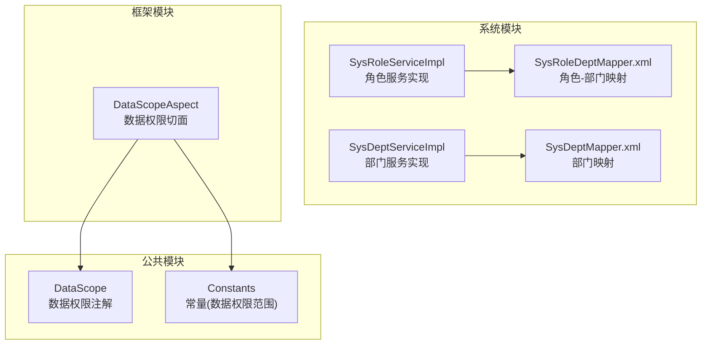
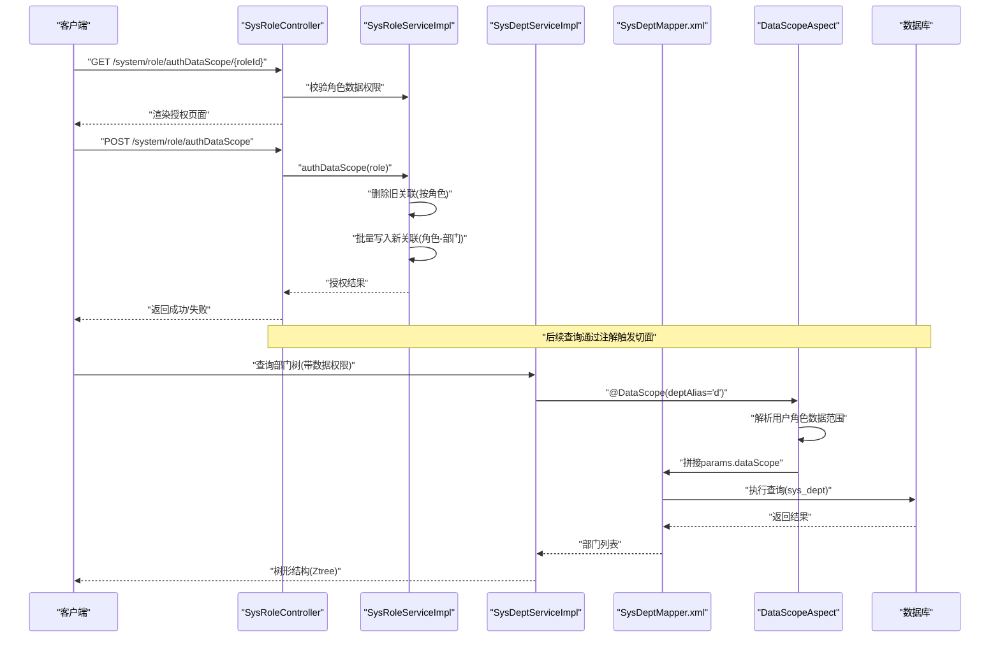
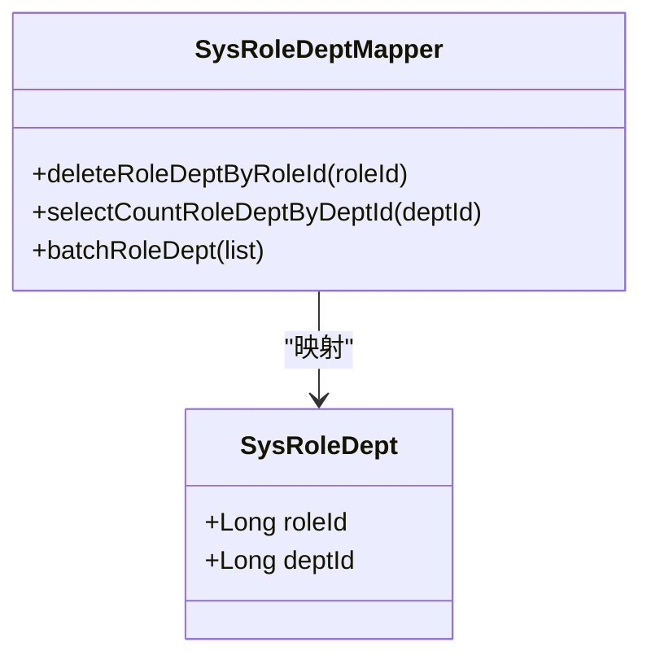
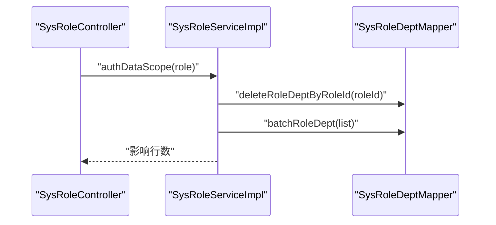
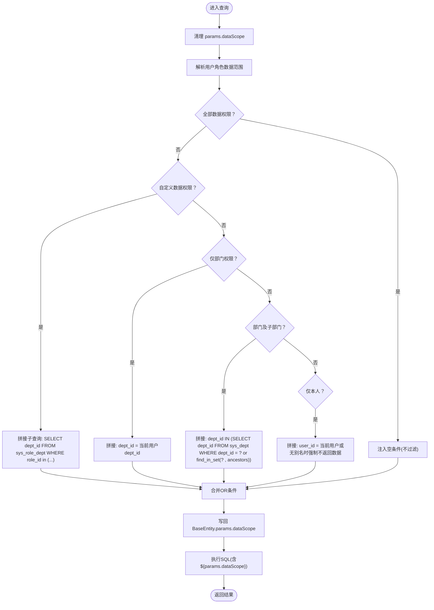
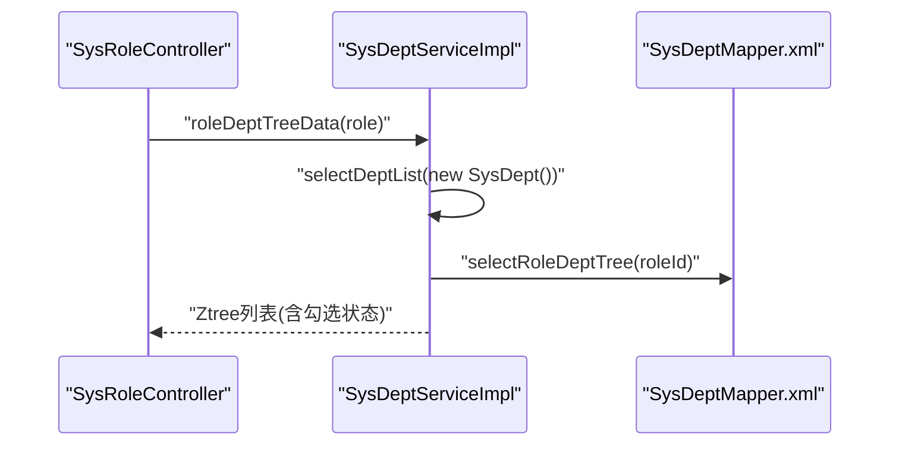
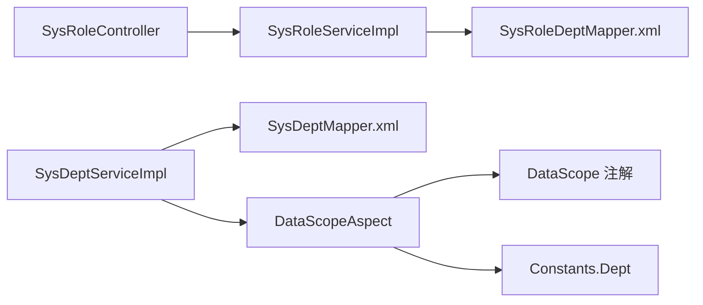

# 角色-部门关联关系

<cite>
**本文引用的文件**   
- [SysRoleDept.java](file://ruoyi-system/src/main/java/com/ruoyi/system/domain/SysRoleDept.java)
- [SysRoleDeptMapper.xml](file://ruoyi-system/src/main/resources/mapper/system/SysRoleDeptMapper.xml)
- [SysRoleServiceImpl.java](file://ruoyi-system/src/main/java/com/ruoyi/system/service/impl/SysRoleServiceImpl.java)
- [ISysRoleService.java](file://ruoyi-system/src/main/java/com/ruoyi/system/service/ISysRoleService.java)
- [DataScopeAspect.java](file://ruoyi-framework/src/main/java/com/ruoyi/framework/aspectj/DataScopeAspect.java)
- [DataScope.java](file://ruoyi-common/src/main/java/com/ruoyi/common/annotation/DataScope.java)
- [SysDeptServiceImpl.java](file://ruoyi-system/src/main/java/com/ruoyi/system/service/impl/SysDeptServiceImpl.java)
- [SysDeptMapper.xml](file://ruoyi-system/src/main/resources/mapper/system/SysDeptMapper.xml)
- [SysRoleController.java](file://ruoyi-admin/src/main/java/com/ruoyi/web/controller/system/SysRoleController.java)
- [Constants.java](file://ruoyi-common/src/main/java/com/ruoyi/common/constant/Constants.java)
- [ry_20260319.sql](file://sql/ry_20260319.sql)
- [ruoyi.pdm](file://sql/ruoyi.pdm)
</cite>

## 目录
1. [简介](#简介)
2. [项目结构](#项目结构)
3. [核心组件](#核心组件)
4. [架构总览](#架构总览)
5. [详细组件分析](#详细组件分析)
6. [依赖分析](#依赖分析)
7. [性能考虑](#性能考虑)
8. [故障排查指南](#故障排查指南)
9. [结论](#结论)
10. [附录](#附录)

## 简介
本文件围绕“角色-部门”关联关系展开，系统性阐述 sys_role_dept 关联表的设计目的、实现机制与数据权限范围控制原理。重点覆盖：
- 角色ID与部门ID的关联模型与持久化映射
- 数据权限范围控制：部门层级遍历、数据权限继承与权限边界控制
- 角色部门授权、数据权限设置、部门树形结构处理的业务流程与SQL实现
- 数据权限在数据访问层的体现：@DataScope 注解、动态SQL拼接与权限过滤条件
- 性能优化、缓存策略与权限验证机制

## 项目结构
本项目采用分层架构，涉及系统模块、框架模块与公共模块：
- 系统模块：角色、部门、用户等业务实体与服务
- 框架模块：切面、拦截器、数据源切换等横切能力
- 公共模块：注解、常量、工具类、实体基类等

**图表来源**
- [SysRoleServiceImpl.java:1-418](file://ruoyi-system/src/main/java/com/ruoyi/system/service/impl/SysRoleServiceImpl.java#L1-L418)
- [SysDeptServiceImpl.java:1-354](file://ruoyi-system/src/main/java/com/ruoyi/system/service/impl/SysDeptServiceImpl.java#L1-L354)
- [SysRoleDeptMapper.xml:1-34](file://ruoyi-system/src/main/resources/mapper/system/SysRoleDeptMapper.xml#L1-L34)
- [SysDeptMapper.xml:1-162](file://ruoyi-system/src/main/resources/mapper/system/SysDeptMapper.xml#L1-L162)
- [DataScopeAspect.java:1-159](file://ruoyi-framework/src/main/java/com/ruoyi/framework/aspectj/DataScopeAspect.java#L1-L159)
- [DataScope.java:1-44](file://ruoyi-common/src/main/java/com/ruoyi/common/annotation/DataScope.java#L1-L44)
- [Constants.java:126-152](file://ruoyi-common/src/main/java/com/ruoyi/common/constant/Constants.java#L126-L152)

**章节来源**
- [SysRoleServiceImpl.java:1-418](file://ruoyi-system/src/main/java/com/ruoyi/system/service/impl/SysRoleServiceImpl.java#L1-L418)
- [SysDeptServiceImpl.java:1-354](file://ruoyi-system/src/main/java/com/ruoyi/system/service/impl/SysDeptServiceImpl.java#L1-L354)
- [DataScopeAspect.java:1-159](file://ruoyi-framework/src/main/java/com/ruoyi/framework/aspectj/DataScopeAspect.java#L1-L159)
- [DataScope.java:1-44](file://ruoyi-common/src/main/java/com/ruoyi/common/annotation/DataScope.java#L1-L44)
- [Constants.java:126-152](file://ruoyi-common/src/main/java/com/ruoyi/common/constant/Constants.java#L126-L152)

## 核心组件
- 角色-部门关联实体：SysRoleDept，承载 roleId 与 deptId 的映射
- 角色-部门映射：SysRoleDeptMapper.xml，提供批量插入、按角色删除、按部门计数等SQL
- 角色服务：SysRoleServiceImpl，负责角色数据权限授权（authDataScope）、批量新增/删除角色-部门关联
- 数据权限切面：DataScopeAspect，基于注解解析与动态SQL拼接实现权限过滤
- 数据权限注解：DataScope，声明用户/部门别名、字段名与权限字符
- 部门服务：SysDeptServiceImpl，提供部门树构建、角色-部门树勾选展示
- 部门映射：SysDeptMapper.xml，包含部门列表查询与数据范围过滤占位符
- 控制器：SysRoleController，暴露角色数据权限授权页面与接口
- 常量：Constants.Dept，定义全部、自定义、部门、部门及子部门、仅本人五种数据权限范围

**章节来源**
- [SysRoleDept.java:11-46](file://ruoyi-system/src/main/java/com/ruoyi/system/domain/SysRoleDept.java#L11-L46)
- [SysRoleDeptMapper.xml:12-32](file://ruoyi-system/src/main/resources/mapper/system/SysRoleDeptMapper.xml#L12-L32)
- [SysRoleServiceImpl.java:214-271](file://ruoyi-system/src/main/java/com/ruoyi/system/service/impl/SysRoleServiceImpl.java#L214-L271)
- [DataScopeAspect.java:65-144](file://ruoyi-framework/src/main/java/com/ruoyi/framework/aspectj/DataScopeAspect.java#L65-L144)
- [DataScope.java:17-43](file://ruoyi-common/src/main/java/com/ruoyi/common/annotation/DataScope.java#L17-L43)
- [SysDeptServiceImpl.java:87-103](file://ruoyi-system/src/main/java/com/ruoyi/system/service/impl/SysDeptServiceImpl.java#L87-L103)
- [SysDeptMapper.xml:38-56](file://ruoyi-system/src/main/resources/mapper/system/SysDeptMapper.xml#L38-L56)
- [SysRoleController.java:154-180](file://ruoyi-admin/src/main/java/com/ruoyi/web/controller/system/SysRoleController.java#L154-L180)
- [Constants.java:126-152](file://ruoyi-common/src/main/java/com/ruoyi/common/constant/Constants.java#L126-L152)

## 架构总览
数据权限控制通过“注解 + 切面 + 动态SQL”的方式在数据访问层自动注入权限过滤条件，确保查询结果天然受控。

**图表来源**
- [SysRoleController.java:154-180](file://ruoyi-admin/src/main/java/com/ruoyi/web/controller/system/SysRoleController.java#L154-L180)
- [SysRoleServiceImpl.java:214-271](file://ruoyi-system/src/main/java/com/ruoyi/system/service/impl/SysRoleServiceImpl.java#L214-L271)
- [SysDeptServiceImpl.java:87-103](file://ruoyi-system/src/main/java/com/ruoyi/system/service/impl/SysDeptServiceImpl.java#L87-L103)
- [SysDeptMapper.xml:38-56](file://ruoyi-system/src/main/resources/mapper/system/SysDeptMapper.xml#L38-L56)
- [DataScopeAspect.java:65-144](file://ruoyi-framework/src/main/java/com/ruoyi/framework/aspectj/DataScopeAspect.java#L65-L144)

## 详细组件分析

### 组件一：角色-部门关联实体与映射
- 实体 SysRoleDept 仅包含 roleId 与 deptId 两个字段，用于建立多对多关系的桥接表
- 映射 SysRoleDeptMapper 提供：
  - 按角色删除关联
  - 按部门计数关联
  - 批量插入角色-部门关联

**图表来源**
- [SysRoleDept.java:11-46](file://ruoyi-system/src/main/java/com/ruoyi/system/domain/SysRoleDept.java#L11-L46)
- [SysRoleDeptMapper.xml:12-32](file://ruoyi-system/src/main/resources/mapper/system/SysRoleDeptMapper.xml#L12-L32)

**章节来源**
- [SysRoleDept.java:11-46](file://ruoyi-system/src/main/java/com/ruoyi/system/domain/SysRoleDept.java#L11-L46)
- [SysRoleDeptMapper.xml:12-32](file://ruoyi-system/src/main/resources/mapper/system/SysRoleDeptMapper.xml#L12-L32)

### 组件二：角色数据权限授权流程
- 控制器 SysRoleController 暴露授权页面与保存接口
- 服务 SysRoleServiceImpl 在 authDataScope 中：
  - 更新角色基础信息
  - 删除旧的角色-部门关联
  - 批量写入新的角色-部门关联

**图表来源**
- [SysRoleController.java:154-180](file://ruoyi-admin/src/main/java/com/ruoyi/web/controller/system/SysRoleController.java#L154-L180)
- [SysRoleServiceImpl.java:214-271](file://ruoyi-system/src/main/java/com/ruoyi/system/service/impl/SysRoleServiceImpl.java#L214-L271)
- [SysRoleDeptMapper.xml:12-32](file://ruoyi-system/src/main/resources/mapper/system/SysRoleDeptMapper.xml#L12-L32)

**章节来源**
- [SysRoleController.java:154-180](file://ruoyi-admin/src/main/java/com/ruoyi/web/controller/system/SysRoleController.java#L154-L180)
- [SysRoleServiceImpl.java:214-271](file://ruoyi-system/src/main/java/com/ruoyi/system/service/impl/SysRoleServiceImpl.java#L214-L271)
- [SysRoleDeptMapper.xml:12-32](file://ruoyi-system/src/main/resources/mapper/system/SysRoleDeptMapper.xml#L12-L32)

### 组件三：数据权限范围控制与动态SQL
- 注解 DataScope 声明用户/部门别名与字段名，并可指定权限字符
- 切面 DataScopeAspect 在前置通知中：
  - 清理 params.dataScope 防注入
  - 解析用户角色的数据范围
  - 生成 SQL 片段并注入到 BaseEntity.params.dataScope
- 部门映射 SysDeptMapper.xml 在查询中使用 ${params.dataScope} 占位符承接切面注入的过滤条件

**图表来源**
- [DataScopeAspect.java:34-144](file://ruoyi-framework/src/main/java/com/ruoyi/framework/aspectj/DataScopeAspect.java#L34-L144)
- [SysDeptMapper.xml:54-55](file://ruoyi-system/src/main/resources/mapper/system/SysDeptMapper.xml#L54-L55)
- [Constants.java:126-152](file://ruoyi-common/src/main/java/com/ruoyi/common/constant/Constants.java#L126-L152)

**章节来源**
- [DataScope.java:17-43](file://ruoyi-common/src/main/java/com/ruoyi/common/annotation/DataScope.java#L17-L43)
- [DataScopeAspect.java:34-144](file://ruoyi-framework/src/main/java/com/ruoyi/framework/aspectj/DataScopeAspect.java#L34-L144)
- [SysDeptMapper.xml:54-55](file://ruoyi-system/src/main/resources/mapper/system/SysDeptMapper.xml#L54-L55)
- [Constants.java:126-152](file://ruoyi-common/src/main/java/com/ruoyi/common/constant/Constants.java#L126-L152)

### 组件四：部门树形结构与角色-部门勾选
- 部门服务 SysDeptServiceImpl 提供：
  - 部门树构建（Ztree）
  - 角色-部门勾选项计算：通过查询 sys_role_dept 获取角色已授权的部门组合
- 控制器 SysRoleController 暴露接口返回角色-部门树，用于授权界面勾选

**图表来源**
- [SysRoleController.java:324-330](file://ruoyi-admin/src/main/java/com/ruoyi/web/controller/system/SysRoleController.java#L324-L330)
- [SysDeptServiceImpl.java:87-103](file://ruoyi-system/src/main/java/com/ruoyi/system/service/impl/SysDeptServiceImpl.java#L87-L103)
- [SysDeptMapper.xml:30-36](file://ruoyi-system/src/main/resources/mapper/system/SysDeptMapper.xml#L30-L36)

**章节来源**
- [SysRoleController.java:324-330](file://ruoyi-admin/src/main/java/com/ruoyi/web/controller/system/SysRoleController.java#L324-L330)
- [SysDeptServiceImpl.java:87-103](file://ruoyi-system/src/main/java/com/ruoyi/system/service/impl/SysDeptServiceImpl.java#L87-L103)
- [SysDeptMapper.xml:30-36](file://ruoyi-system/src/main/resources/mapper/system/SysDeptMapper.xml#L30-L36)

### 组件五：数据权限范围枚举与边界控制
- Constants.Dept 定义了五种数据权限范围：
  - 全部：不限制
  - 自定义：仅限 sys_role_dept 中指定的部门
  - 部门：仅限当前部门
  - 部门及子部门：当前部门及其祖先字符串匹配
  - 仅本人：当提供用户别名时返回本人，否则不返回任何数据
- 切面在解析时会根据角色状态与权限字符进行边界控制，避免越权

**章节来源**
- [Constants.java:126-152](file://ruoyi-common/src/main/java/com/ruoyi/common/constant/Constants.java#L126-L152)
- [DataScopeAspect.java:70-133](file://ruoyi-framework/src/main/java/com/ruoyi/framework/aspectj/DataScopeAspect.java#L70-L133)

## 依赖分析
- 角色服务依赖角色-部门映射以完成授权写入
- 部门服务依赖部门映射与切面注解以实现数据权限过滤
- 切面依赖注解与常量以解析与生成权限SQL
- 控制器依赖服务以暴露授权页面与接口

**图表来源**
- [SysRoleController.java:154-180](file://ruoyi-admin/src/main/java/com/ruoyi/web/controller/system/SysRoleController.java#L154-L180)
- [SysRoleServiceImpl.java:214-271](file://ruoyi-system/src/main/java/com/ruoyi/system/service/impl/SysRoleServiceImpl.java#L214-L271)
- [SysDeptServiceImpl.java:87-103](file://ruoyi-system/src/main/java/com/ruoyi/system/service/impl/SysDeptServiceImpl.java#L87-L103)
- [DataScopeAspect.java:65-144](file://ruoyi-framework/src/main/java/com/ruoyi/framework/aspectj/DataScopeAspect.java#L65-L144)
- [DataScope.java:17-43](file://ruoyi-common/src/main/java/com/ruoyi/common/annotation/DataScope.java#L17-L43)
- [Constants.java:126-152](file://ruoyi-common/src/main/java/com/ruoyi/common/constant/Constants.java#L126-L152)

**章节来源**
- [SysRoleController.java:154-180](file://ruoyi-admin/src/main/java/com/ruoyi/web/controller/system/SysRoleController.java#L154-L180)
- [SysRoleServiceImpl.java:214-271](file://ruoyi-system/src/main/java/com/ruoyi/system/service/impl/SysRoleServiceImpl.java#L214-L271)
- [SysDeptServiceImpl.java:87-103](file://ruoyi-system/src/main/java/com/ruoyi/system/service/impl/SysDeptServiceImpl.java#L87-L103)
- [DataScopeAspect.java:65-144](file://ruoyi-framework/src/main/java/com/ruoyi/framework/aspectj/DataScopeAspect.java#L65-L144)
- [DataScope.java:17-43](file://ruoyi-common/src/main/java/com/ruoyi/common/annotation/DataScope.java#L17-L43)
- [Constants.java:126-152](file://ruoyi-common/src/main/java/com/ruoyi/common/constant/Constants.java#L126-L152)

## 性能考虑
- 部门层级遍历与祖先字符串匹配
  - 使用 find_in_set 与 ancestors 字段进行层级匹配，适合中小规模组织架构；大规模场景建议评估索引与存储过程优化
- 自定义数据权限的IN子查询
  - 多角色自定义权限时合并为一个IN子句，减少拼接次数，提升SQL可读性与执行效率
- 批量写入
  - 批量插入角色-部门关联，减少事务往返与锁竞争
- 缓存策略
  - 可结合系统缓存（如Redis/EhCache）缓存用户角色与数据范围，降低重复计算与数据库压力
- 注解前置清理
  - 切面在每次调用前清理 dataScope 参数，避免历史残留导致的重复拼接与潜在风险

[本节为通用性能指导，不直接分析具体文件]

## 故障排查指南
- 授权后查询不到数据
  - 检查角色数据范围是否为“仅本人”且未提供用户别名
  - 核对 sys_role_dept 是否正确写入
- 权限越界或无权限访问
  - 确认角色状态与权限字符是否满足切面过滤条件
  - 校验部门状态与祖先字符串是否正确
- 授权页面勾选异常
  - 检查角色-部门树接口返回值与勾选逻辑

**章节来源**
- [DataScopeAspect.java:129-133](file://ruoyi-framework/src/main/java/com/ruoyi/framework/aspectj/DataScopeAspect.java#L129-L133)
- [SysRoleServiceImpl.java:214-271](file://ruoyi-system/src/main/java/com/ruoyi/system/service/impl/SysRoleServiceImpl.java#L214-L271)
- [SysDeptServiceImpl.java:87-103](file://ruoyi-system/src/main/java/com/ruoyi/system/service/impl/SysDeptServiceImpl.java#L87-L103)

## 结论
sys_role_dept 作为角色与部门之间的桥梁，配合 @DataScope 注解与 DataScopeAspect 切面，在数据访问层实现了灵活而强大的数据权限控制。通过“全部/自定义/部门/部门及子部门/仅本人”五种范围策略，既能满足精细化权限需求，又能在查询阶段即完成权限过滤，降低业务层负担。结合批量写入、IN子句合并与缓存策略，可在保证安全性的前提下兼顾性能与可维护性。

[本节为总结性内容，不直接分析具体文件]

## 附录

### A. 数据库结构要点
- sys_dept 表包含 dept_id、parent_id、ancestors 等字段，支持层级遍历
- sys_role_dept 表包含 role_id、dept_id，作为角色-部门关联表

**章节来源**
- [ry_20260319.sql:4-21](file://sql/ry_20260319.sql#L4-L21)
- [ruoyi.pdm:4453-4487](file://sql/ruoyi.pdm#L4453-L4487)

### B. SQL操作示例与业务逻辑
- 角色-部门授权写入
  - 删除旧关联：按角色ID删除 sys_role_dept 记录
  - 批量写入：将角色与多个部门ID组合批量插入
- 部门树勾选数据
  - 通过 sys_role_dept 查询角色已授权的部门组合，用于前端勾选展示
- 数据权限过滤
  - 在查询语句中注入 ${params.dataScope}，由切面根据角色数据范围生成过滤条件

**章节来源**
- [SysRoleServiceImpl.java:214-271](file://ruoyi-system/src/main/java/com/ruoyi/system/service/impl/SysRoleServiceImpl.java#L214-L271)
- [SysRoleDeptMapper.xml:12-32](file://ruoyi-system/src/main/resources/mapper/system/SysRoleDeptMapper.xml#L12-L32)
- [SysDeptMapper.xml:30-36](file://ruoyi-system/src/main/resources/mapper/system/SysDeptMapper.xml#L30-L36)
- [SysDeptMapper.xml:54-55](file://ruoyi-system/src/main/resources/mapper/system/SysDeptMapper.xml#L54-L55)
- [DataScopeAspect.java:65-144](file://ruoyi-framework/src/main/java/com/ruoyi/framework/aspectj/DataScopeAspect.java#L65-L144)