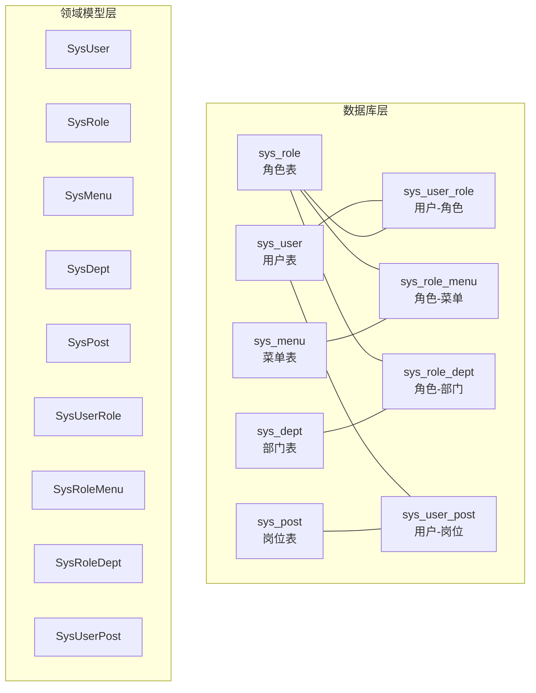
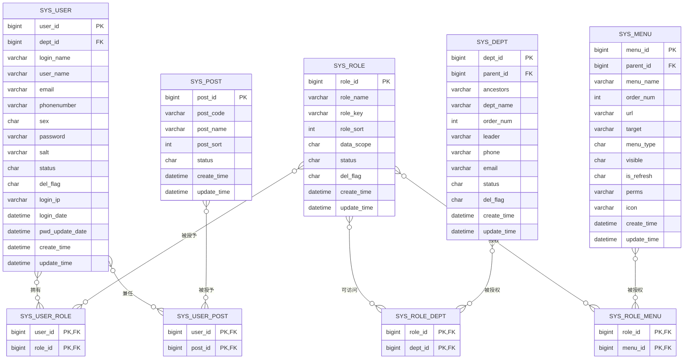
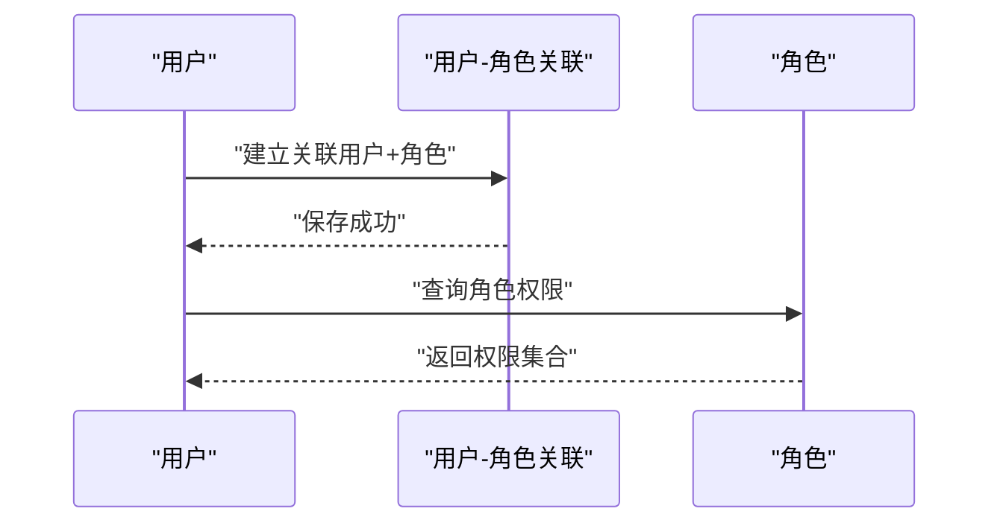
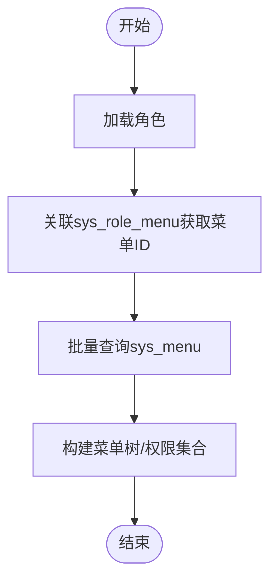
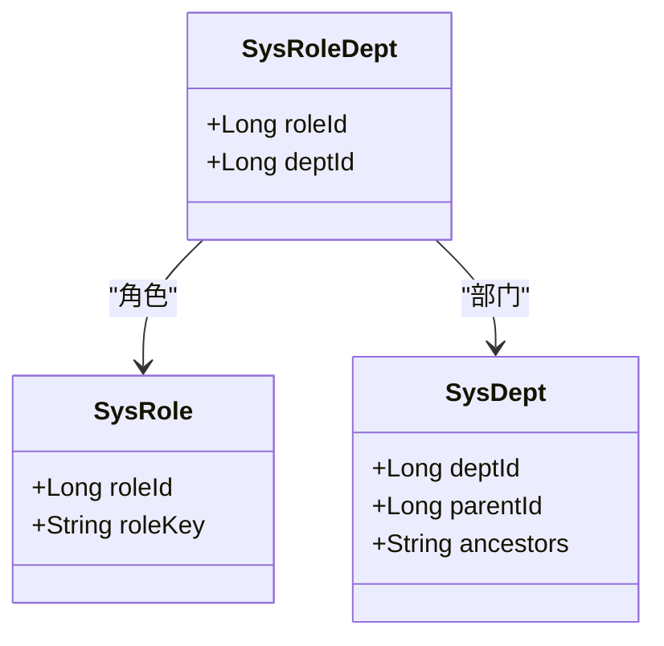
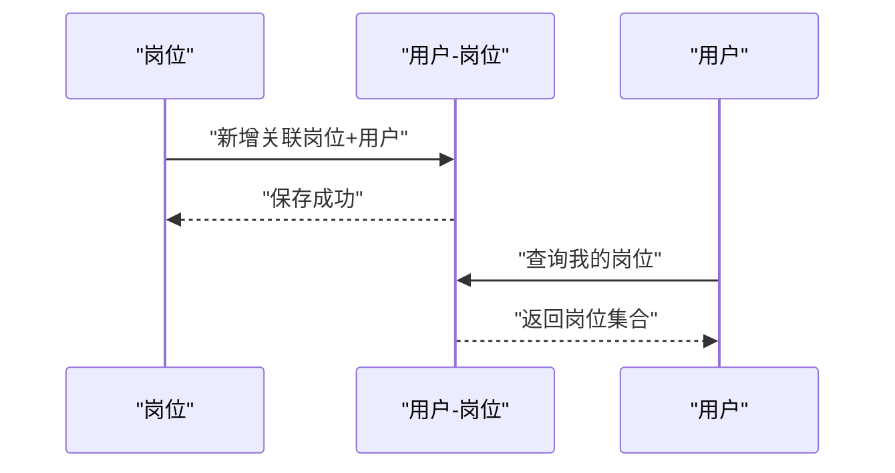
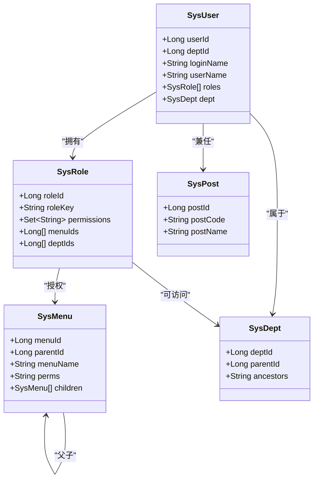
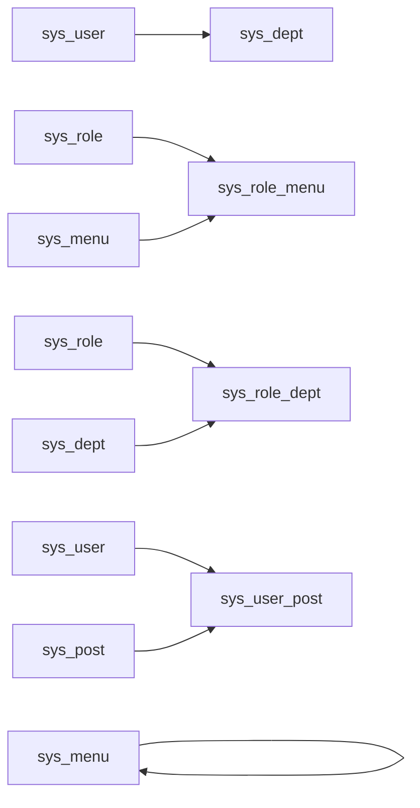

# 实体关系设计

<cite>
**本文档引用的文件**
- [ry_20260319.sql](file://sql/ry_20260319.sql)
- [SysUser.java](file://ruoyi-common/src/main/java/com/ruoyi/common/core/domain/entity/SysUser.java)
- [SysRole.java](file://ruoyi-common/src/main/java/com/ruoyi/common/core/domain/entity/SysRole.java)
- [SysDept.java](file://ruoyi-common/src/main/java/com/ruoyi/common/core/domain/entity/SysDept.java)
- [SysMenu.java](file://ruoyi-common/src/main/java/com/ruoyi/common/core/domain/entity/SysMenu.java)
- [SysPost.java](file://ruoyi-system/src/main/java/com/ruoyi/system/domain/SysPost.java)
- [SysUserRole.java](file://ruoyi-system/src/main/java/com/ruoyi/system/domain/SysUserRole.java)
- [SysRoleMenu.java](file://ruoyi-system/src/main/java/com/ruoyi/system/domain/SysRoleMenu.java)
- [SysRoleDept.java](file://ruoyi-system/src/main/java/com/ruoyi/system/domain/SysRoleDept.java)
- [SysUserPost.java](file://ruoyi-system/src/main/java/com/ruoyi/system/domain/SysUserPost.java)
</cite>

## 目录
1. [引言](#引言)
2. [项目结构](#项目结构)
3. [核心组件](#核心组件)
4. [架构总览](#架构总览)
5. [详细组件分析](#详细组件分析)
6. [依赖分析](#依赖分析)
7. [性能考量](#性能考量)
8. [故障排查指南](#故障排查指南)
9. [结论](#结论)
10. [附录](#附录)

## 引言
本文件面向RuoYi系统的实体关系设计，聚焦于核心业务实体之间的复杂关联，特别是多对多关系：用户-角色、角色-菜单、角色-部门、用户-岗位。我们将从数据库建模、Java实体映射、外键与索引、级联与约束、查询与事务等方面进行系统化梳理，并提供ER关系图与实体关系图，帮助开发者深入理解数据模型设计思想与业务实现。

## 项目结构
围绕实体关系的核心文件分布如下：
- 数据库脚本：定义了基础表与多对多关联表的结构与初始数据
- 实体类：对应基础表与关联表的Java映射，承载业务属性与关系集合
- 关联表实体：对应多对多中间表的键值封装

图表来源
- [ry_20260319.sql](file://sql/ry_20260319.sql)
- [SysUser.java](file://ruoyi-common/src/main/java/com/ruoyi/common/core/domain/entity/SysUser.java)
- [SysRole.java](file://ruoyi-common/src/main/java/com/ruoyi/common/core/domain/entity/SysRole.java)
- [SysMenu.java](file://ruoyi-common/src/main/java/com/ruoyi/common/core/domain/entity/SysMenu.java)
- [SysDept.java](file://ruoyi-common/src/main/java/com/ruoyi/common/core/domain/entity/SysDept.java)
- [SysPost.java](file://ruoyi-system/src/main/java/com/ruoyi/system/domain/SysPost.java)
- [SysUserRole.java](file://ruoyi-system/src/main/java/com/ruoyi/system/domain/SysUserRole.java)
- [SysRoleMenu.java](file://ruoyi-system/src/main/java/com/ruoyi/system/domain/SysRoleMenu.java)
- [SysRoleDept.java](file://ruoyi-system/src/main/java/com/ruoyi/system/domain/SysRoleDept.java)
- [SysUserPost.java](file://ruoyi-system/src/main/java/com/ruoyi/system/domain/SysUserPost.java)

章节来源
- [ry_20260319.sql](file://sql/ry_20260319.sql)
- [SysUser.java](file://ruoyi-common/src/main/java/com/ruoyi/common/core/domain/entity/SysUser.java)
- [SysRole.java](file://ruoyi-common/src/main/java/com/ruoyi/common/core/domain/entity/SysRole.java)
- [SysMenu.java](file://ruoyi-common/src/main/java/com/ruoyi/common/core/domain/entity/SysMenu.java)
- [SysDept.java](file://ruoyi-common/src/main/java/com/ruoyi/common/core/domain/entity/SysDept.java)
- [SysPost.java](file://ruoyi-system/src/main/java/com/ruoyi/system/domain/SysPost.java)
- [SysUserRole.java](file://ruoyi-system/src/main/java/com/ruoyi/system/domain/SysUserRole.java)
- [SysRoleMenu.java](file://ruoyi-system/src/main/java/com/ruoyi/system/domain/SysRoleMenu.java)
- [SysRoleDept.java](file://ruoyi-system/src/main/java/com/ruoyi/system/domain/SysRoleDept.java)
- [SysUserPost.java](file://ruoyi-system/src/main/java/com/ruoyi/system/domain/SysUserPost.java)

## 核心组件
本节概述各实体及其在多对多关系中的角色定位与职责边界。

- 用户表（sys_user）
  - 主键：user_id
  - 外键：dept_id → sys_dept.dept_id
  - 作用：承载用户基本信息与所属部门
- 角色表（sys_role）
  - 主键：role_id
  - 作用：角色定义与数据权限范围
- 菜单表（sys_menu）
  - 主键：menu_id
  - 外键：parent_id → sys_menu.menu_id（自关联）
  - 作用：菜单树与权限标识
- 部门表（sys_dept）
  - 主键：dept_id
  - 外键：parent_id → sys_dept.dept_id（自关联）
  - 作用：组织架构树
- 岗位表（sys_post）
  - 主键：post_id
  - 作用：岗位维度的附加身份标识
- 多对多关联表
  - sys_user_role：用户-角色
  - sys_role_menu：角色-菜单
  - sys_role_dept：角色-部门
  - sys_user_post：用户-岗位

章节来源
- [ry_20260319.sql](file://sql/ry_20260319.sql)

## 架构总览
下图展示RuoYi系统中实体与关联表之间的ER关系与数据流向。

图表来源
- [ry_20260319.sql](file://sql/ry_20260319.sql)

## 详细组件分析

### 用户-角色 多对多（sys_user_role）
- 设计要点
  - 复合主键：(user_id, role_id)，确保同一用户-角色组合唯一
  - 无额外业务字段，简化关系表达
- Java映射
  - SysUserRole：仅包含userId与roleId两个字段，便于批量操作
- 业务流程示意

图表来源
- [SysUserRole.java](file://ruoyi-system/src/main/java/com/ruoyi/system/domain/SysUserRole.java)
- [ry_20260319.sql](file://sql/ry_20260319.sql)

章节来源
- [SysUserRole.java](file://ruoyi-system/src/main/java/com/ruoyi/system/domain/SysUserRole.java)
- [ry_20260319.sql](file://sql/ry_20260319.sql)

### 角色-菜单 多对多（sys_role_menu）
- 设计要点
  - 复合主键：(role_id, menu_id)，表达“角色可访问某菜单”
  - 通过sys_menu的父子关系与perms形成权限树
- Java映射
  - SysRoleMenu：包含roleId与menuId
- 查询优化建议
  - 常见查询：按角色查菜单、按菜单查角色，建议在role_id与menu_id上保持索引（由复合主键隐含）

图表来源
- [SysRoleMenu.java](file://ruoyi-system/src/main/java/com/ruoyi/system/domain/SysRoleMenu.java)
- [ry_20260319.sql](file://sql/ry_20260319.sql)

章节来源
- [SysRoleMenu.java](file://ruoyi-system/src/main/java/com/ruoyi/system/domain/SysRoleMenu.java)
- [ry_20260319.sql](file://sql/ry_20260319.sql)

### 角色-部门 多对多（sys_role_dept）
- 设计要点
  - 复合主键：(role_id, dept_id)，表达“角色可访问某部门”
  - 结合SysDept的祖先链与层级，实现“本部门及以下”等数据权限
- Java映射
  - SysRoleDept：包含roleId与deptId
- 数据一致性
  - 角色删除或部门删除时，需同步清理关联表，避免悬挂引用

图表来源
- [SysRoleDept.java](file://ruoyi-system/src/main/java/com/ruoyi/system/domain/SysRoleDept.java)
- [ry_20260319.sql](file://sql/ry_20260319.sql)

章节来源
- [SysRoleDept.java](file://ruoyi-system/src/main/java/com/ruoyi/system/domain/SysRoleDept.java)
- [ry_20260319.sql](file://sql/ry_20260319.sql)

### 用户-岗位 多对多（sys_user_post）
- 设计要点
  - 复合主键：(user_id, post_id)，表达“用户可兼任某岗位”
  - 与SysPost配合，实现基于岗位的附加权限或统计口径
- Java映射
  - SysUserPost：包含userId与postId
- 使用场景
  - 适用于跨部门/多角色场景下的岗位授权与报表统计

图表来源
- [SysUserPost.java](file://ruoyi-system/src/main/java/com/ruoyi/system/domain/SysUserPost.java)
- [ry_20260319.sql](file://sql/ry_20260319.sql)

章节来源
- [SysUserPost.java](file://ruoyi-system/src/main/java/com/ruoyi/system/domain/SysUserPost.java)
- [ry_20260319.sql](file://sql/ry_20260319.sql)

### 基础实体类与关系映射
- 用户（SysUser）
  - 关联：dept → SysDept；roles → Set<SysRole>
  - 用途：登录、个人信息、角色集合、部门上下文
- 角色（SysRole）
  - 关联：menuIds、deptIds（用于授权配置）
  - 用途：权限标识、数据范围、状态控制
- 菜单（SysMenu）
  - 关联：children（递归子节点）、parent（父菜单）
  - 用途：菜单树、权限标识perms、类型分类
- 部门（SysDept）
  - 关联：parentId → 自身；与角色构成数据权限
  - 用途：组织树、层级计算、数据隔离
- 岗位（SysPost）
  - 关联：与用户多对多
  - 用途：附加身份、统计口径

图表来源
- [SysUser.java](file://ruoyi-common/src/main/java/com/ruoyi/common/core/domain/entity/SysUser.java)
- [SysRole.java](file://ruoyi-common/src/main/java/com/ruoyi/common/core/domain/entity/SysRole.java)
- [SysMenu.java](file://ruoyi-common/src/main/java/com/ruoyi/common/core/domain/entity/SysMenu.java)
- [SysDept.java](file://ruoyi-common/src/main/java/com/ruoyi/common/core/domain/entity/SysDept.java)
- [SysPost.java](file://ruoyi-system/src/main/java/com/ruoyi/system/domain/SysPost.java)

章节来源
- [SysUser.java](file://ruoyi-common/src/main/java/com/ruoyi/common/core/domain/entity/SysUser.java)
- [SysRole.java](file://ruoyi-common/src/main/java/com/ruoyi/common/core/domain/entity/SysRole.java)
- [SysMenu.java](file://ruoyi-common/src/main/java/com/ruoyi/common/core/domain/entity/SysMenu.java)
- [SysDept.java](file://ruoyi-common/src/main/java/com/ruoyi/common/core/domain/entity/SysDept.java)
- [SysPost.java](file://ruoyi-system/src/main/java/com/ruoyi/system/domain/SysPost.java)

## 依赖分析
- 表间依赖
  - sys_user.dept_id → sys_dept.dept_id
  - sys_menu.parent_id → sys_menu.menu_id（自关联）
  - sys_dept.parent_id → sys_dept.dept_id（自关联）
- 关联表依赖
  - sys_user_role.user_id → sys_user.user_id
  - sys_user_role.role_id → sys_role.role_id
  - sys_role_menu.role_id → sys_role.role_id
  - sys_role_menu.menu_id → sys_menu.menu_id
  - sys_role_dept.role_id → sys_role.role_id
  - sys_role_dept.dept_id → sys_dept.dept_id
  - sys_user_post.user_id → sys_user.user_id
  - sys_user_post.post_id → sys_post.post_id
- Java依赖
  - SysUser → SysDept、List<SysRole>
  - SysRole → Set<String>(permissions)、menuIds/deptIds
  - SysMenu → List<SysMenu>(children)
  - SysUserRole/SysRoleMenu/SysRoleDept/SysUserPost：仅键值载体

图表来源
- [ry_20260319.sql](file://sql/ry_20260319.sql)

章节来源
- [ry_20260319.sql](file://sql/ry_20260319.sql)

## 性能考量
- 索引与主键
  - 关联表采用复合主键，天然具备去重与高效查找能力
  - 建议在高频查询字段（如role_id、user_id、menu_id、dept_id）上保持索引（复合主键已覆盖）
- 查询优化策略
  - 批量查询：优先使用IN子句或临时表批量获取关联集合
  - 菜单树构建：先按角色取menu_id，再一次性查询sys_menu
  - 数据权限：结合dept.ancestors与角色dept授权，避免深度递归
- 事务处理
  - 关联变更（如用户角色/菜单/部门/岗位）应放在同一事务内，确保一致性
  - 删除角色/菜单/部门/用户时，先清理关联表，再删除主表记录
- 缓存与热点
  - 将常用菜单树与权限集合缓存于会话或进程内，减少数据库压力

## 故障排查指南
- 常见问题
  - “找不到权限/菜单”：检查sys_role_menu是否存在对应记录；确认角色状态与菜单可见性
  - “数据越权”：检查sys_role_dept与dept.ancestors是否正确；核对角色数据范围
  - “用户无角色/岗位”：检查sys_user_role与sys_user_post是否缺失
- 排查步骤
  - 核对主表与关联表主键/外键一致性
  - 校验删除标志（del_flag）与状态字段（status）
  - 对比初始化数据与当前数据差异
- 修复建议
  - 使用事务批量插入/删除关联表
  - 清理孤儿数据（主表不存在但关联表仍有记录）

章节来源
- [ry_20260319.sql](file://sql/ry_20260319.sql)

## 结论
RuoYi的实体关系设计以清晰的多对多关联为核心，通过sys_user_role、sys_role_menu、sys_role_dept、sys_user_post四张中间表，将用户、角色、菜单、部门、岗位解耦为独立实体，既满足灵活授权与数据权限需求，又保持良好的扩展性与可维护性。配合合理的索引、批量查询与事务处理策略，可在保证数据一致性的前提下获得良好性能表现。

## 附录
- 关键字段说明
  - del_flag：软删除标记（0存在，2删除）
  - status：启用/停用标记（0正常，1停用）
  - data_scope：角色数据范围（1全部，2自定义，3本部门，4本部门及以下，5仅本人）
- 初始化数据参考
  - 用户与角色、角色与菜单、角色与部门、用户与岗位的初始映射示例位于数据库脚本中

章节来源
- [ry_20260319.sql](file://sql/ry_20260319.sql)