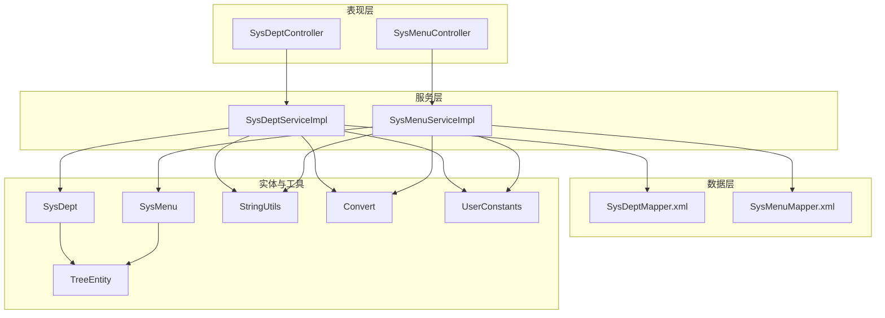
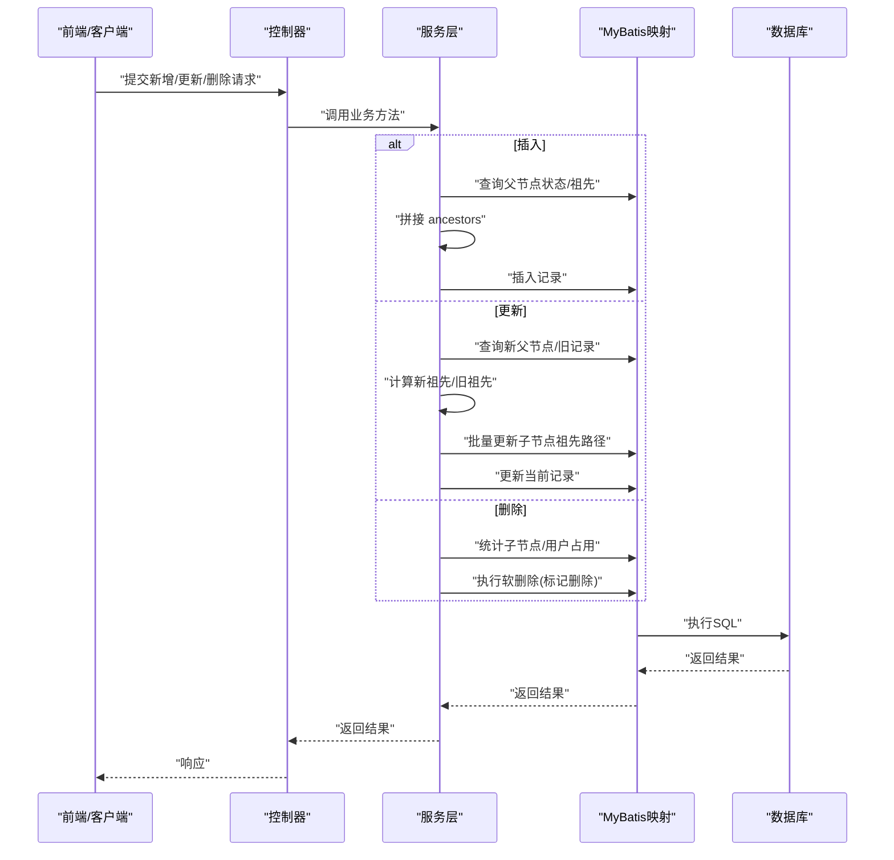
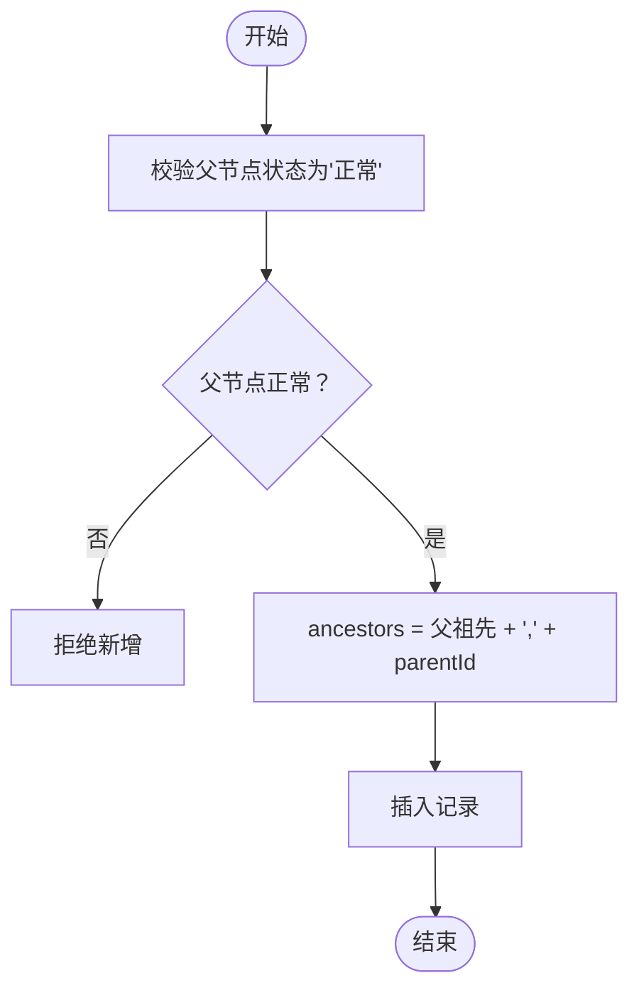
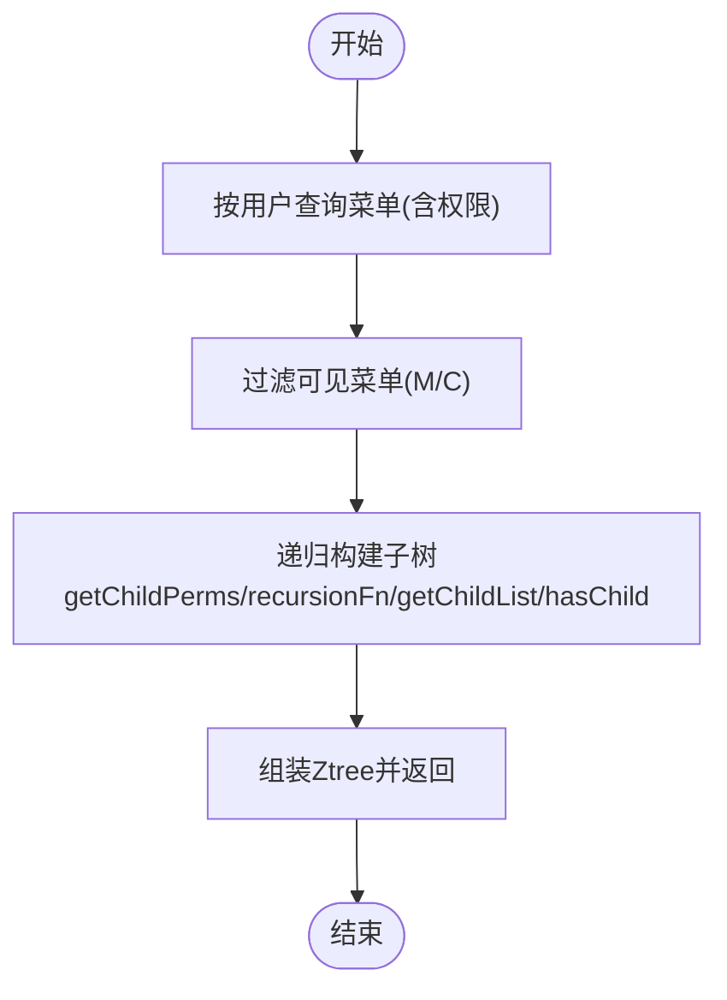
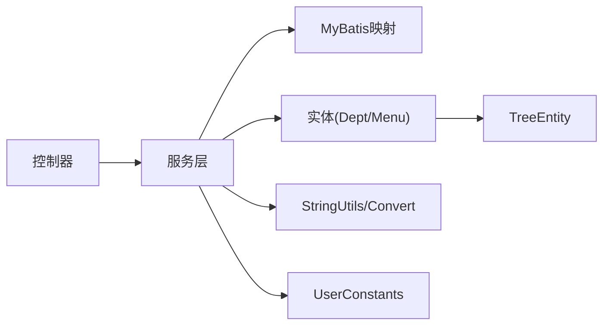

# 层级数据模型

<cite>
**本文引用的文件**
- [SysDept.java](file://ruoyi-common/src/main/java/com/ruoyi/common/core/domain/entity/SysDept.java)
- [SysMenu.java](file://ruoyi-common/src/main/java/com/ruoyi/common/core/domain/entity/SysMenu.java)
- [TreeEntity.java](file://ruoyi-common/src/main/java/com/ruoyi/common/core/domain/TreeEntity.java)
- [Ztree.java](file://ruoyi-common/src/main/java/com/ruoyi/common/core/domain/Ztree.java)
- [SysDeptServiceImpl.java](file://ruoyi-system/src/main/java/com/ruoyi/system/service/impl/SysDeptServiceImpl.java)
- [SysMenuServiceImpl.java](file://ruoyi-system/src/main/java/com/ruoyi/system/service/impl/SysMenuServiceImpl.java)
- [SysDeptController.java](file://ruoyi-admin/src/main/java/com/ruoyi/web/controller/system/SysDeptController.java)
- [SysMenuController.java](file://ruoyi-admin/src/main/java/com/ruoyi/web/controller/system/SysMenuController.java)
- [SysDeptMapper.xml](file://ruoyi-system/src/main/resources/mapper/system/SysDeptMapper.xml)
- [SysMenuMapper.xml](file://ruoyi-system/src/main/resources/mapper/system/SysMenuMapper.xml)
- [UserConstants.java](file://ruoyi-common/src/main/java/com/ruoyi/common/constant/UserConstants.java)
- [StringUtils.java](file://ruoyi-common/src/main/java/com/ruoyi/common/utils/StringUtils.java)
- [Convert.java](file://ruoyi-common/src/main/java/com/ruoyi/common/core/text/Convert.java)
- [menu.html](file://ruoyi-admin/src/main/resources/templates/system/menu/menu.html)
</cite>

## 目录
1. [简介](#简介)
2. [项目结构](#项目结构)
3. [核心组件](#核心组件)
4. [架构总览](#架构总览)
5. [详细组件分析](#详细组件分析)
6. [依赖分析](#依赖分析)
7. [性能考量](#性能考量)
8. [故障排查指南](#故障排查指南)
9. [结论](#结论)
10. [附录](#附录)

## 简介
本文件面向RuoYi系统的层级数据模型，聚焦“部门(Dept)”与“菜单(Menu)”两类父子层级实体，系统阐述其在数据库层面的外键约束与祖先路径(ancestors)设计，在应用层的插入、更新、删除操作如何维护层级结构与祖先路径，以及在查询侧如何通过祖先路径与递归算法实现深度、广度与路径查询。同时给出性能优化策略（祖先路径索引、层级缓存、批量操作）、安全性考虑（层级权限控制与数据隔离），帮助开发者全面掌握层级数据模型的设计原理与实现技巧。

## 项目结构
- 实体层：SysDept、SysMenu继承通用TreeEntity，统一承载parentId、ancestors、orderNum等层级字段。
- 服务层：SysDeptServiceImpl、SysMenuServiceImpl封装层级业务逻辑，负责插入/更新/删除时的祖先路径维护、递归查询与树形组装。
- 控制器层：SysDeptController、SysMenuController提供REST接口，接收前端请求并调用服务层。
- 映射层：MyBatis XML映射SysDeptMapper.xml、SysMenuMapper.xml，定义祖先路径查询、子节点查询、树形组装SQL。
- 工具与常量：StringUtils、Convert、UserConstants等支撑字符串处理、类型转换与状态常量。

图表来源
- [SysDeptController.java:1-204](file://ruoyi-admin/src/main/java/com/ruoyi/web/controller/system/SysDeptController.java#L1-L204)
- [SysMenuController.java:1-212](file://ruoyi-admin/src/main/java/com/ruoyi/web/controller/system/SysMenuController.java#L1-L212)
- [SysDeptServiceImpl.java:1-354](file://ruoyi-system/src/main/java/com/ruoyi/system/service/impl/SysDeptServiceImpl.java#L1-L354)
- [SysMenuServiceImpl.java:1-441](file://ruoyi-system/src/main/java/com/ruoyi/system/service/impl/SysMenuServiceImpl.java#L1-L441)
- [SysDeptMapper.xml:1-162](file://ruoyi-system/src/main/resources/mapper/system/SysDeptMapper.xml#L1-L162)
- [SysMenuMapper.xml:1-197](file://ruoyi-system/src/main/resources/mapper/system/SysMenuMapper.xml#L1-L197)
- [SysDept.java:1-204](file://ruoyi-common/src/main/java/com/ruoyi/common/core/domain/entity/SysDept.java#L1-L204)
- [SysMenu.java:1-215](file://ruoyi-common/src/main/java/com/ruoyi/common/core/domain/entity/SysMenu.java#L1-L215)
- [TreeEntity.java:1-63](file://ruoyi-common/src/main/java/com/ruoyi/common/core/domain/TreeEntity.java#L1-L63)
- [StringUtils.java:1-715](file://ruoyi-common/src/main/java/com/ruoyi/common/utils/StringUtils.java#L1-L715)
- [Convert.java:1-800](file://ruoyi-common/src/main/java/com/ruoyi/common/core/text/Convert.java#L1-L800)
- [UserConstants.java:1-74](file://ruoyi-common/src/main/java/com/ruoyi/common/constant/UserConstants.java#L1-L74)

章节来源
- [SysDeptController.java:1-204](file://ruoyi-admin/src/main/java/com/ruoyi/web/controller/system/SysDeptController.java#L1-L204)
- [SysMenuController.java:1-212](file://ruoyi-admin/src/main/java/com/ruoyi/web/controller/system/SysMenuController.java#L1-L212)
- [SysDeptServiceImpl.java:1-354](file://ruoyi-system/src/main/java/com/ruoyi/system/service/impl/SysDeptServiceImpl.java#L1-L354)
- [SysMenuServiceImpl.java:1-441](file://ruoyi-system/src/main/java/com/ruoyi/system/service/impl/SysMenuServiceImpl.java#L1-L441)
- [SysDeptMapper.xml:1-162](file://ruoyi-system/src/main/resources/mapper/system/SysDeptMapper.xml#L1-L162)
- [SysMenuMapper.xml:1-197](file://ruoyi-system/src/main/resources/mapper/system/SysMenuMapper.xml#L1-L197)

## 核心组件
- 实体模型
  - SysDept/SysMenu均继承TreeEntity，具备parentId、ancestors、orderNum等字段，用于表达父子层级与排序。
  - TreeEntity统一提供parentId、ancestors、orderNum等基础属性，便于复用。
- 服务层
  - SysDeptServiceImpl：负责部门的插入、更新（含祖先路径重写与子节点批量更新）、删除、树形组装、数据权限校验等。
  - SysMenuServiceImpl：负责菜单的插入、更新、删除、树形组装、权限集合查询、递归构建子树等。
- 映射层
  - SysDeptMapper.xml：提供祖先路径查询、子节点查询、批量更新子节点祖先路径、按祖先路径统计等功能。
  - SysMenuMapper.xml：提供按用户权限查询菜单树、按父节点统计子节点数量、树形组装SQL等。
- 工具与常量
  - StringUtils：提供字符串判空、拆分、转换等工具，支撑祖先路径解析与比较。
  - Convert：提供字符串与Long数组等转换，支撑批量更新场景。
  - UserConstants：提供状态常量（如部门正常/停用），用于业务校验。

章节来源
- [SysDept.java:1-204](file://ruoyi-common/src/main/java/com/ruoyi/common/core/domain/entity/SysDept.java#L1-L204)
- [SysMenu.java:1-215](file://ruoyi-common/src/main/java/com/ruoyi/common/core/domain/entity/SysMenu.java#L1-L215)
- [TreeEntity.java:1-63](file://ruoyi-common/src/main/java/com/ruoyi/common/core/domain/TreeEntity.java#L1-L63)
- [SysDeptServiceImpl.java:1-354](file://ruoyi-system/src/main/java/com/ruoyi/system/service/impl/SysDeptServiceImpl.java#L1-L354)
- [SysMenuServiceImpl.java:1-441](file://ruoyi-system/src/main/java/com/ruoyi/system/service/impl/SysMenuServiceImpl.java#L1-L441)
- [SysDeptMapper.xml:1-162](file://ruoyi-system/src/main/resources/mapper/system/SysDeptMapper.xml#L1-L162)
- [SysMenuMapper.xml:1-197](file://ruoyi-system/src/main/resources/mapper/system/SysMenuMapper.xml#L1-L197)
- [StringUtils.java:1-715](file://ruoyi-common/src/main/java/com/ruoyi/common/utils/StringUtils.java#L1-L715)
- [Convert.java:1-800](file://ruoyi-common/src/main/java/com/ruoyi/common/core/text/Convert.java#L1-L800)
- [UserConstants.java:1-74](file://ruoyi-common/src/main/java/com/ruoyi/common/constant/UserConstants.java#L1-L74)

## 架构总览
层级数据模型采用经典的“祖先路径法”存储层级关系，结合MyBatis映射与服务层递归/批量更新，实现高效的层级查询与维护。

图表来源
- [SysDeptServiceImpl.java:192-232](file://ruoyi-system/src/main/java/com/ruoyi/system/service/impl/SysDeptServiceImpl.java#L192-L232)
- [SysMenuServiceImpl.java:310-326](file://ruoyi-system/src/main/java/com/ruoyi/system/service/impl/SysMenuServiceImpl.java#L310-L326)
- [SysDeptMapper.xml:81-87](file://ruoyi-system/src/main/resources/mapper/system/SysDeptMapper.xml#L81-L87)
- [SysMenuMapper.xml:117-130](file://ruoyi-system/src/main/resources/mapper/system/SysMenuMapper.xml#L117-L130)

## 详细组件分析

### 部门(Dept)层级模型
- 数据库设计要点
  - parent_id外键：指向sys_dept.dept_id，形成自引用。
  - ancestors祖先路径：逗号分隔的祖先ID序列，如“0,100,101”，根节点祖先为“0”。
  - 状态字段status：0表示正常，1表示停用；停用会影响子节点启用传播与数据权限。
- 插入流程
  - 校验父节点状态必须为“正常”，否则拒绝新增。
  - ancestors = 父节点ancestors + "," + parentId。
  - 写入新记录。
- 更新流程
  - 若变更父节点：计算新祖先(newAncestors)与旧祖先(oldAncestors)，对所有子孙节点执行祖先路径替换，并批量更新。
  - 若当前部门启用且祖先非空且非“0”，则逐级启用所有祖先部门。
- 删除流程
  - 若存在下级或关联用户，禁止删除。
  - 否则执行软删除（标记删除）。
- 查询与树形组装
  - 通过ancestors LIKE 或 FIND_IN_SET 实现“所有子孙”查询。
  - 服务层将扁平列表转为Ztree结构，供前端ztree渲染。

图表来源
- [SysDeptServiceImpl.java:192-203](file://ruoyi-system/src/main/java/com/ruoyi/system/service/impl/SysDeptServiceImpl.java#L192-L203)
- [SysDeptMapper.xml:89-115](file://ruoyi-system/src/main/resources/mapper/system/SysDeptMapper.xml#L89-L115)

章节来源
- [SysDept.java:1-204](file://ruoyi-common/src/main/java/com/ruoyi/common/core/domain/entity/SysDept.java#L1-L204)
- [TreeEntity.java:1-63](file://ruoyi-common/src/main/java/com/ruoyi/common/core/domain/TreeEntity.java#L1-L63)
- [SysDeptServiceImpl.java:192-232](file://ruoyi-system/src/main/java/com/ruoyi/system/service/impl/SysDeptServiceImpl.java#L192-L232)
- [SysDeptMapper.xml:81-87](file://ruoyi-system/src/main/resources/mapper/system/SysDeptMapper.xml#L81-L87)
- [UserConstants.java:30-34](file://ruoyi-common/src/main/java/com/ruoyi/common/constant/UserConstants.java#L30-L34)

### 菜单(Menu)层级模型
- 数据库设计要点
  - parent_id外键：指向sys_menu.menu_id，形成自引用。
  - 菜单类型menu_type：M目录、C菜单、F按钮，用于区分展示与权限控制。
  - 权限字符串perms：用于细粒度权限控制。
- 插入/更新/删除
  - 插入/更新：直接写入，不涉及祖先路径。
  - 删除：支持“删除菜单及其所有子菜单”的级联删除。
- 查询与树形组装
  - 按用户查询菜单树：基于用户-角色-菜单关联，筛选可见菜单并构建树。
  - 递归算法：getChildPerms + recursionFn + getChildList + hasChild，实现深度优先构建子树。
  - 前端树形渲染：通过Ztree结构与ztree控件渲染。

图表来源
- [SysMenuServiceImpl.java:50-64](file://ruoyi-system/src/main/java/com/ruoyi/system/service/impl/SysMenuServiceImpl.java#L50-L64)
- [SysMenuServiceImpl.java:379-439](file://ruoyi-system/src/main/java/com/ruoyi/system/service/impl/SysMenuServiceImpl.java#L379-L439)
- [SysMenuMapper.xml:32-47](file://ruoyi-system/src/main/resources/mapper/system/SysMenuMapper.xml#L32-L47)

章节来源
- [SysMenu.java:1-215](file://ruoyi-common/src/main/java/com/ruoyi/common/core/domain/entity/SysMenu.java#L1-L215)
- [TreeEntity.java:1-63](file://ruoyi-common/src/main/java/com/ruoyi/common/core/domain/TreeEntity.java#L1-L63)
- [SysMenuServiceImpl.java:50-64](file://ruoyi-system/src/main/java/com/ruoyi/system/service/impl/SysMenuServiceImpl.java#L50-L64)
- [SysMenuServiceImpl.java:379-439](file://ruoyi-system/src/main/java/com/ruoyi/system/service/impl/SysMenuServiceImpl.java#L379-L439)
- [SysMenuMapper.xml:32-47](file://ruoyi-system/src/main/resources/mapper/system/SysMenuMapper.xml#L32-L47)

### 前端树形渲染与交互
- 菜单树形表格：前端通过bootstrap-tree-table加载树形数据，配置code/parentCode/uniqueId等字段映射。
- 菜单树：前端通过ztree控件渲染，支持展开/折叠、勾选、排序等操作。
- 控制器接口：提供菜单/部门树形数据接口，供前端异步加载。

章节来源
- [menu.html:60-67](file://ruoyi-admin/src/main/resources/templates/system/menu/menu.html#L60-L67)
- [SysMenuController.java:47-55](file://ruoyi-admin/src/main/java/com/ruoyi/web/controller/system/SysMenuController.java#L47-L55)
- [SysDeptController.java:46-53](file://ruoyi-admin/src/main/java/com/ruoyi/web/controller/system/SysDeptController.java#L46-L53)

## 依赖分析
- 组件耦合
  - 控制器依赖服务层；服务层依赖映射层；实体继承TreeEntity，统一层级字段。
- 外部依赖
  - MyBatis：负责SQL映射与祖先路径查询。
  - 前端ztree：负责树形展示与交互。
- 潜在风险
  - 祖先路径字符串解析依赖逗号分隔，需确保ID不包含逗号。
  - 批量更新子节点祖先路径时，需保证事务一致性。

图表来源
- [SysDeptController.java:1-204](file://ruoyi-admin/src/main/java/com/ruoyi/web/controller/system/SysDeptController.java#L1-L204)
- [SysMenuController.java:1-212](file://ruoyi-admin/src/main/java/com/ruoyi/web/controller/system/SysMenuController.java#L1-L212)
- [SysDeptServiceImpl.java:1-354](file://ruoyi-system/src/main/java/com/ruoyi/system/service/impl/SysDeptServiceImpl.java#L1-L354)
- [SysMenuServiceImpl.java:1-441](file://ruoyi-system/src/main/java/com/ruoyi/system/service/impl/SysMenuServiceImpl.java#L1-L441)
- [SysDept.java:1-204](file://ruoyi-common/src/main/java/com/ruoyi/common/core/domain/entity/SysDept.java#L1-L204)
- [SysMenu.java:1-215](file://ruoyi-common/src/main/java/com/ruoyi/common/core/domain/entity/SysMenu.java#L1-L215)
- [TreeEntity.java:1-63](file://ruoyi-common/src/main/java/com/ruoyi/common/core/domain/TreeEntity.java#L1-L63)
- [StringUtils.java:1-715](file://ruoyi-common/src/main/java/com/ruoyi/common/utils/StringUtils.java#L1-L715)
- [Convert.java:1-800](file://ruoyi-common/src/main/java/com/ruoyi/common/core/text/Convert.java#L1-L800)
- [UserConstants.java:1-74](file://ruoyi-common/src/main/java/com/ruoyi/common/constant/UserConstants.java#L1-L74)

## 性能考量
- 祖先路径索引
  - 建议在ancestors列建立合适的索引，以加速“所有子孙”查询（如使用前缀索引或函数索引策略，视数据库而定）。
- 批量更新优化
  - 子节点祖先路径批量更新采用CASE-WHEN或IN子句，减少往返次数，建议配合事务一次性提交。
- 递归查询优化
  - 对于深度较大的树，建议在查询侧限制最大深度或使用“深度优先+剪枝”策略，避免全表扫描。
- 缓存策略
  - 对热点树（如菜单树、部门树）进行缓存，结合权限维度（用户/角色）做多级缓存，降低重复查询成本。
- 分页与懒加载
  - 前端采用懒加载或分页加载，避免一次性渲染超大树。

## 故障排查指南
- 插入失败
  - 父节点状态非“正常”导致拒绝新增。检查父节点status字段。
  - 祖先路径拼接错误。确认父节点ancestors与parentId拼接逻辑。
- 更新失败
  - 父节点变更导致祖先路径替换失败。检查新旧祖先字符串替换逻辑与批量更新SQL。
  - 子节点存在停用状态但未同步启用。检查“启用所有祖先”逻辑。
- 删除失败
  - 存在下级或关联用户。检查子节点统计与用户占用检测。
- 权限问题
  - 数据权限校验失败。检查数据范围过滤与用户所在部门范围。
- 前端树形异常
  - Ztree结构缺失或字段映射错误。核对id/pId/name/title等字段与前端配置一致。

章节来源
- [SysDeptServiceImpl.java:192-232](file://ruoyi-system/src/main/java/com/ruoyi/system/service/impl/SysDeptServiceImpl.java#L192-L232)
- [SysMenuServiceImpl.java:310-326](file://ruoyi-system/src/main/java/com/ruoyi/system/service/impl/SysMenuServiceImpl.java#L310-L326)
- [SysDeptMapper.xml:134-145](file://ruoyi-system/src/main/resources/mapper/system/SysDeptMapper.xml#L134-L145)
- [SysMenuMapper.xml:117-130](file://ruoyi-system/src/main/resources/mapper/system/SysMenuMapper.xml#L117-L130)

## 结论
RuoYi系统采用“祖先路径法”实现部门与菜单的层级数据模型，结合MyBatis映射与服务层递归/批量更新，实现了高效稳定的层级维护与查询。通过合理的索引、缓存与批量操作策略，可在大数据量场景下保持良好性能。同时，严格的权限控制与数据隔离机制保障了系统的安全与稳定。

## 附录
- 关键字段说明
  - parentId：父节点ID，自引用外键。
  - ancestors：祖先ID序列，逗号分隔，根节点为“0”。
  - orderNum：排序字段，用于同级排序。
  - status：状态字段，0正常，1停用。
- 常用SQL模式
  - “所有子孙”查询：FIND_IN_SET(#{deptId}, ancestors) 或 ancestors LIKE CONCAT(parentAncestors, ',%')
  - “直接子节点”查询：parent_id = #{parentId}
  - “批量更新子节点祖先路径”：CASE-WHEN 或 IN 子句