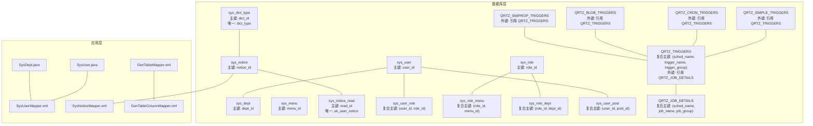
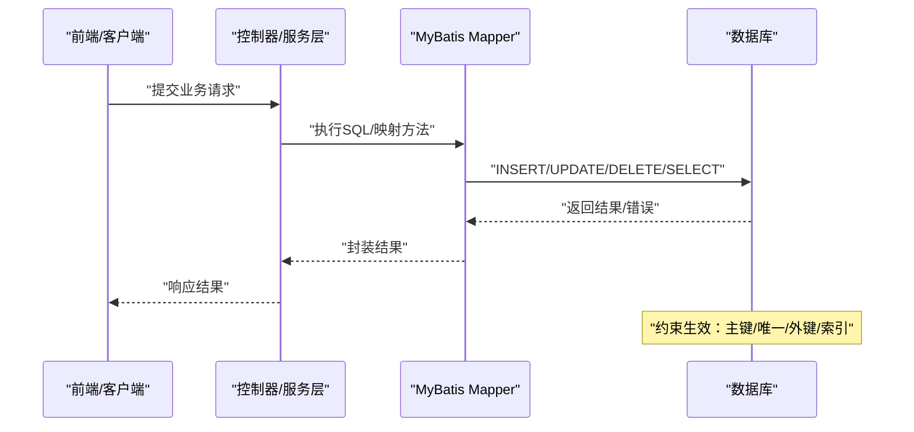
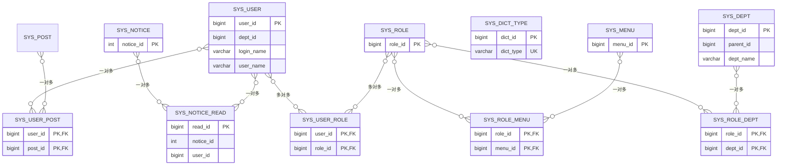
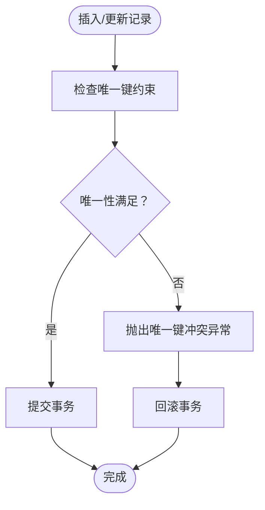
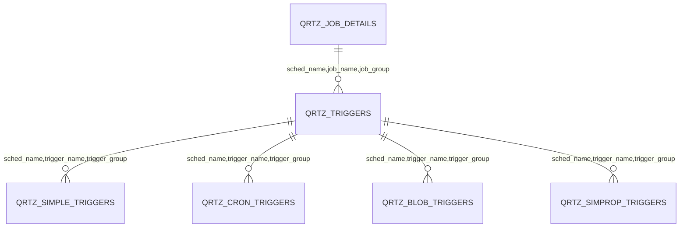
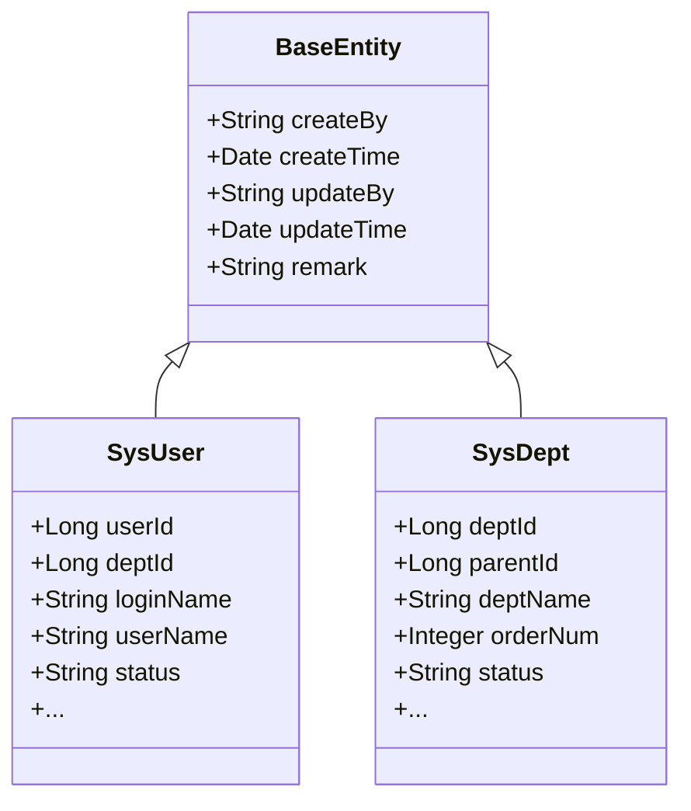
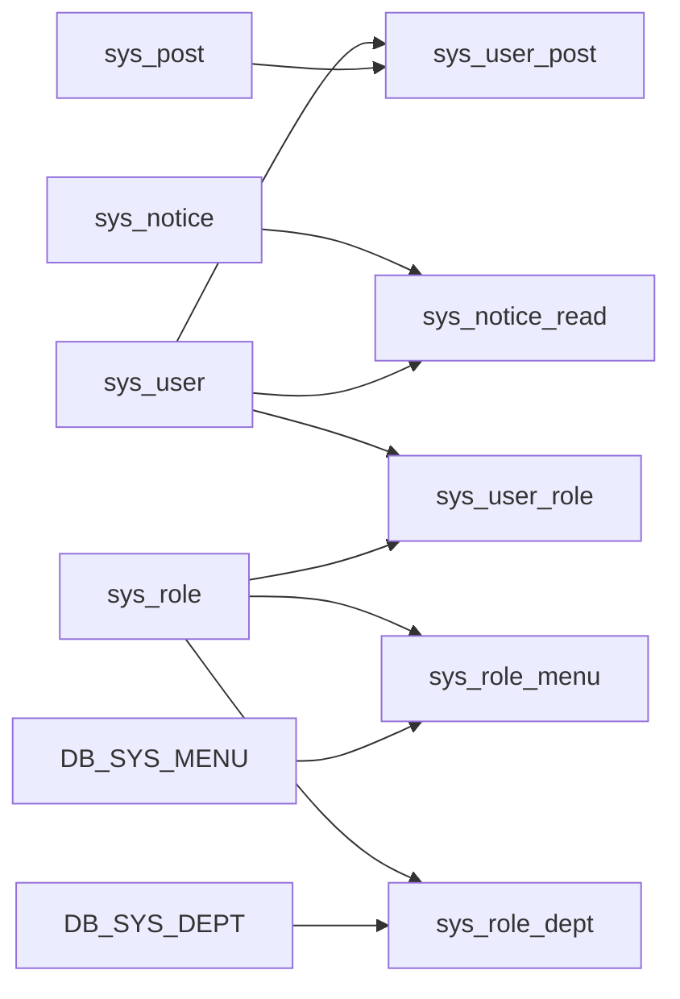
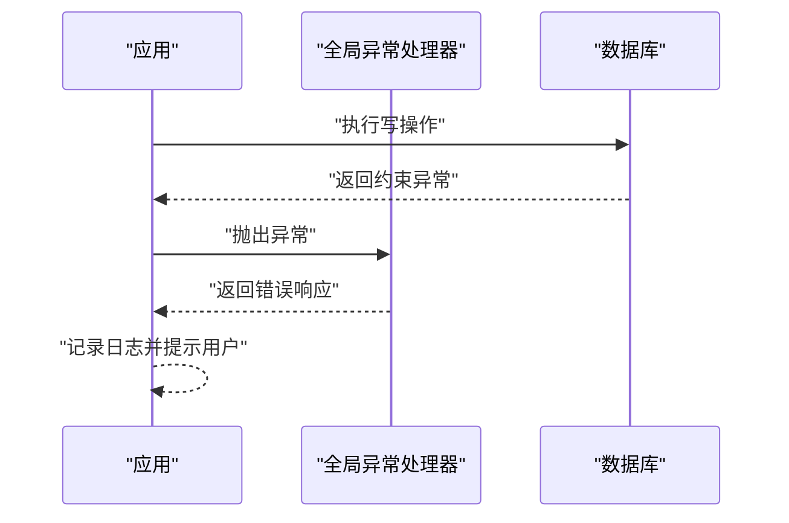

# 数据完整性约束

<cite>
**本文引用的文件**   
- [ry_20260319.sql](file://sql/ry_20260319.sql)
- [quartz.sql](file://sql/quartz.sql)
- [ruoyi.pdm](file://sql/ruoyi.pdm)
- [SysUserMapper.xml](file://ruoyi-system/src/main/resources/mapper/system/SysUserMapper.xml)
- [SysNoticeMapper.xml](file://ruoyi-system/src/main/resources/mapper/system/SysNoticeMapper.xml)
- [GenTableMapper.xml](file://ruoyi-generator/src/main/resources/mapper/generator/GenTableMapper.xml)
- [GenTableColumnMapper.xml](file://ruoyi-generator/src/main/resources/mapper/generator/GenTableColumnMapper.xml)
- [SysUser.java](file://ruoyi-common/src/main/java/com/ruoyi/common/core/domain/entity/SysUser.java)
- [SysDept.java](file://ruoyi-common/src/main/java/com/ruoyi/common/core/domain/entity/SysDept.java)
- [GlobalExceptionHandler.java](file://ruoyi-framework/src/main/java/com/ruoyi/framework/web/exception/GlobalExceptionHandler.java)
</cite>

## 目录
1. [简介](#简介)
2. [项目结构](#项目结构)
3. [核心组件](#核心组件)
4. [架构总览](#架构总览)
5. [详细组件分析](#详细组件分析)
6. [依赖分析](#依赖分析)
7. [性能考量](#性能考量)
8. [故障排查指南](#故障排查指南)
9. [结论](#结论)
10. [附录](#附录)

## 简介
本文件聚焦于 RuoYi 系统的数据完整性约束，系统性梳理数据库层面的主键、唯一键、外键、检查约束与索引设计，并结合应用层的实体与映射配置，解释约束在数据一致性保障中的作用与实现机制；同时给出约束冲突的处理策略、优化建议与迁移兼容性处理方案，帮助开发者在实际开发中遵循最佳实践。

## 项目结构
RuoYi 的数据完整性约束主要体现在 SQL 初始化脚本与 MyBatis 映射配置中，核心涉及：
- 核心业务表：用户、部门、岗位、角色、菜单、字典、公告等
- 关系表：用户-角色、角色-菜单、角色-部门、用户-岗位、公告已读
- 定时任务表：Quartz 相关表及其外键关系
- 应用层实体与映射：MyBatis Mapper XML 将数据库约束与 Java 实体绑定

图表来源
- [ry_20260319.sql:42-65](file://sql/ry_20260319.sql#L42-L65)
- [ry_20260319.sql:106-120](file://sql/ry_20260319.sql#L106-L120)
- [ry_20260319.sql:133-151](file://sql/ry_20260319.sql#L133-L151)
- [ry_20260319.sql:443-456](file://sql/ry_20260319.sql#L443-L456)
- [ry_20260319.sql:685-708](file://sql/ry_20260319.sql#L685-L708)
- [ry_20260319.sql:684-739](file://sql/ry_20260319.sql#L684-L739)
- [quartz.sql:16-28](file://sql/quartz.sql#L16-L28)
- [quartz.sql:33-52](file://sql/quartz.sql#L33-L52)
- [quartz.sql:57-66](file://sql/quartz.sql#L57-L66)
- [quartz.sql:71-79](file://sql/quartz.sql#L71-L79)
- [quartz.sql:84-91](file://sql/quartz.sql#L84-L91)
- [quartz.sql:155-172](file://sql/quartz.sql#L155-L172)
- [SysUser.java:22-382](file://ruoyi-common/src/main/java/com/ruoyi/common/core/domain/entity/SysUser.java#L22-L382)
- [SysDept.java:17-204](file://ruoyi-common/src/main/java/com/ruoyi/common/core/domain/entity/SysDept.java#L17-L204)
- [SysUserMapper.xml:7-31](file://ruoyi-system/src/main/resources/mapper/system/SysUserMapper.xml#L7-L31)
- [SysNoticeMapper.xml:7-18](file://ruoyi-system/src/main/resources/mapper/system/SysNoticeMapper.xml#L7-L18)
- [GenTableMapper.xml:7-24](file://ruoyi-generator/src/main/resources/mapper/generator/GenTableMapper.xml#L7-L24)
- [GenTableColumnMapper.xml:7-24](file://ruoyi-generator/src/main/resources/mapper/generator/GenTableColumnMapper.xml#L7-L24)

章节来源
- [ry_20260319.sql:4-739](file://sql/ry_20260319.sql#L4-L739)
- [quartz.sql:1-174](file://sql/quartz.sql#L1-L174)

## 核心组件
- 主键约束：多数业务表采用自增主键或复合主键，确保每行记录唯一标识。
- 唯一键约束：字典类型表对类型字段建立唯一约束；公告已读表对“用户+公告”组合建立唯一约束，防止重复记录。
- 外键约束：关系表（用户-角色、角色-菜单、角色-部门、用户-岗位）与 Quartz 触发器与其细节表之间建立外键，保证参照完整性。
- 检查约束：当前脚本未显式声明 CHECK 约束，但通过枚举值与状态字段的约定实现逻辑检查。
- 索引设计：常见复合键与单列键用于查询与连接性能优化。

章节来源
- [ry_20260319.sql:20-20](file://sql/ry_20260319.sql#L20-L20)
- [ry_20260319.sql:64-64](file://sql/ry_20260319.sql#L64-L64)
- [ry_20260319.sql:90-90](file://sql/ry_20260319.sql#L90-L90)
- [ry_20260319.sql:119-119](file://sql/ry_20260319.sql#L119-L119)
- [ry_20260319.sql:150-150](file://sql/ry_20260319.sql#L150-L150)
- [ry_20260319.sql:266-266](file://sql/ry_20260319.sql#L266-L266)
- [ry_20260319.sql:283-283](file://sql/ry_20260319.sql#L283-L283)
- [ry_20260319.sql:382-382](file://sql/ry_20260319.sql#L382-L382)
- [ry_20260319.sql:400-400](file://sql/ry_20260319.sql#L400-L400)
- [ry_20260319.sql:455-455](file://sql/ry_20260319.sql#L455-L455)
- [ry_20260319.sql:677-677](file://sql/ry_20260319.sql#L677-L677)
- [quartz.sql:51-51](file://sql/quartz.sql#L51-L51)
- [quartz.sql:65-65](file://sql/quartz.sql#L65-L65)
- [quartz.sql:78-78](file://sql/quartz.sql#L78-L78)
- [quartz.sql:90-90](file://sql/quartz.sql#L90-L90)
- [quartz.sql:171-171](file://sql/quartz.sql#L171-L171)

## 架构总览
从数据库到应用层的数据流如下：
- 应用通过 MyBatis Mapper 访问数据库，实体类承载业务语义与校验。
- 数据库层通过主键、唯一键、外键与索引保障一致性与性能。
- 异常处理统一捕获并反馈给前端或调用方。

图表来源
- [SysUserMapper.xml:52-89](file://ruoyi-system/src/main/resources/mapper/system/SysUserMapper.xml#L52-L89)
- [SysNoticeMapper.xml:20-28](file://ruoyi-system/src/main/resources/mapper/system/SysNoticeMapper.xml#L20-L28)
- [ry_20260319.sql:42-65](file://sql/ry_20260319.sql#L42-L65)
- [ry_20260319.sql:443-456](file://sql/ry_20260319.sql#L443-L456)

## 详细组件分析

### 主键约束分析
- 单列自增主键：用户、部门、角色、菜单、岗位、字典类型、参数配置、公告、定时任务等表均以自增列为主键，确保全局唯一且有序增长。
- 复合主键：用户-角色、角色-菜单、角色-部门、用户-岗位等关系表采用复合主键，避免重复关联。

图表来源
- [ry_20260319.sql:42-65](file://sql/ry_20260319.sql#L42-L65)
- [ry_20260319.sql:106-120](file://sql/ry_20260319.sql#L106-L120)
- [ry_20260319.sql:133-151](file://sql/ry_20260319.sql#L133-L151)
- [ry_20260319.sql:443-456](file://sql/ry_20260319.sql#L443-L456)
- [ry_20260319.sql:685-708](file://sql/ry_20260319.sql#L685-L708)
- [ry_20260319.sql:263-267](file://sql/ry_20260319.sql#L263-L267)
- [ry_20260319.sql:279-284](file://sql/ry_20260319.sql#L279-L284)
- [ry_20260319.sql:378-383](file://sql/ry_20260319.sql#L378-L383)
- [ry_20260319.sql:395-401](file://sql/ry_20260319.sql#L395-L401)
- [ry_20260319.sql:670-678](file://sql/ry_20260319.sql#L670-L678)

章节来源
- [ry_20260319.sql:4-739](file://sql/ry_20260319.sql#L4-L739)

### 唯一键约束分析
- 字典类型表：对字典类型字段建立唯一约束，保证类型标识唯一。
- 公告已读表：对“用户+公告”组合建立唯一约束，避免重复记录。

图表来源
- [ry_20260319.sql:455-455](file://sql/ry_20260319.sql#L455-L455)
- [ry_20260319.sql:677-677](file://sql/ry_20260319.sql#L677-L677)

章节来源
- [ry_20260319.sql:443-467](file://sql/ry_20260319.sql#L443-L467)
- [ry_20260319.sql:670-678](file://sql/ry_20260319.sql#L670-L678)

### 外键约束与级联行为分析
- 关系表外键：用户-角色、角色-菜单、角色-部门、用户-岗位等关系表均通过外键指向被关联表，确保关系有效性。
- Quartz 外键：触发器表与其细节表、简单触发器、Cron 触发器、Blob 触发器、SIMPROP 触发器均通过外键引用触发器表，形成清晰的层级关系。
- 级联行为：脚本未显式声明 ON DELETE/UPDATE 的级联动作，默认由数据库引擎处理；建议在需要时明确声明级联策略以避免孤儿数据。

图表来源
- [quartz.sql:51-51](file://sql/quartz.sql#L51-L51)
- [quartz.sql:65-65](file://sql/quartz.sql#L65-L65)
- [quartz.sql:78-78](file://sql/quartz.sql#L78-L78)
- [quartz.sql:90-90](file://sql/quartz.sql#L90-L90)
- [quartz.sql:171-171](file://sql/quartz.sql#L171-L171)

章节来源
- [quartz.sql:1-174](file://sql/quartz.sql#L1-L174)

### 检查约束与逻辑约束
- 当前脚本未显式声明 CHECK 约束，但通过枚举值与状态字段约定实现逻辑约束（如状态字段取值范围）。
- 建议在需要时引入 CHECK 约束或在应用层进行显式校验，以增强约束的可读性与可维护性。

章节来源
- [ry_20260319.sql:4-739](file://sql/ry_20260319.sql#L4-L739)

### 索引与查询性能
- 常见索引：操作日志、登录日志等高频表建立了业务类型、状态、时间等索引，提升查询与统计性能。
- 建议：根据查询模式为常用过滤字段建立合适索引；避免过度索引导致写入性能下降。

章节来源
- [ry_20260319.sql:433-436](file://sql/ry_20260319.sql#L433-L436)
- [ry_20260319.sql:570-572](file://sql/ry_20260319.sql#L570-L572)

### 应用层实体与映射
- 实体类：SysUser、SysDept 等继承基础实体，承载字段与校验注解，体现业务语义。
- 映射配置：SysUserMapper、SysNoticeMapper 等通过 XML 映射数据库表与实体字段，支持关联查询与条件过滤。

图表来源
- [SysUser.java:22-382](file://ruoyi-common/src/main/java/com/ruoyi/common/core/domain/entity/SysUser.java#L22-L382)
- [SysDept.java:17-204](file://ruoyi-common/src/main/java/com/ruoyi/common/core/domain/entity/SysDept.java#L17-L204)
- [BaseEntity.java:16-119](file://ruoyi-common/src/main/java/com/ruoyi/common/core/domain/BaseEntity.java#L16-L119)

章节来源
- [SysUser.java:1-382](file://ruoyi-common/src/main/java/com/ruoyi/common/core/domain/entity/SysUser.java#L1-L382)
- [SysDept.java:1-204](file://ruoyi-common/src/main/java/com/ruoyi/common/core/domain/entity/SysDept.java#L1-L204)
- [SysUserMapper.xml:1-246](file://ruoyi-system/src/main/resources/mapper/system/SysUserMapper.xml#L1-L246)
- [SysNoticeMapper.xml:1-29](file://ruoyi-system/src/main/resources/mapper/system/SysNoticeMapper.xml#L1-L29)

## 依赖分析
- 数据库层依赖：关系表与 Quartz 表之间存在严格的外键依赖链，删除或更新需遵循依赖顺序。
- 应用层依赖：实体类依赖基础实体，Mapper 依赖实体类，共同保证数据一致性与可维护性。

图表来源
- [ry_20260319.sql:263-267](file://sql/ry_20260319.sql#L263-L267)
- [ry_20260319.sql:279-284](file://sql/ry_20260319.sql#L279-L284)
- [ry_20260319.sql:378-383](file://sql/ry_20260319.sql#L378-L383)
- [ry_20260319.sql:395-401](file://sql/ry_20260319.sql#L395-L401)
- [ry_20260319.sql:670-678](file://sql/ry_20260319.sql#L670-L678)

章节来源
- [ry_20260319.sql:260-408](file://sql/ry_20260319.sql#L260-L408)

## 性能考量
- 索引策略：为高频过滤字段（如状态、时间、登录名、手机号、邮箱等）建立合适索引，减少全表扫描。
- 查询优化：利用复合主键与连接条件，避免不必要的笛卡尔积；合理使用分页与条件裁剪。
- 写入优化：批量插入与更新时注意索引维护成本，必要时临时禁用非必要索引再重建。
- 存储空间：控制冗余字段与大字段数量，对大文本采用独立表或外部存储策略。

## 故障排查指南
- 唯一键冲突：当插入重复唯一键时，数据库会抛出唯一性约束异常。应用层通过全局异常处理器捕获并返回友好提示。
- 外键约束失败：删除或更新被其他表引用的记录时，数据库会拒绝操作。应先清理或更新关联数据。
- 状态与枚举问题：状态字段取值需符合约定，避免非法值导致业务异常。

图表来源
- [GlobalExceptionHandler.java:88-100](file://ruoyi-framework/src/main/java/com/ruoyi/framework/web/exception/GlobalExceptionHandler.java#L88-L100)

章节来源
- [GlobalExceptionHandler.java:1-150](file://ruoyi-framework/src/main/java/com/ruoyi/framework/web/exception/GlobalExceptionHandler.java#L1-L150)

## 结论
RuoYi 的数据完整性约束通过主键、唯一键、外键与索引设计，有效保障了业务数据的一致性与可维护性。结合应用层实体与映射配置，能够在运行期进一步强化约束与校验。建议在后续演进中补充显式的 CHECK 约束与明确的级联策略，持续优化索引与查询性能，并完善约束冲突的处理流程与监控告警。

## 附录
- 数据库生成配置：PDM 中的“Key/Create”与“Foreign key/Create”等选项表明数据库对象生成时对约束声明的控制策略。
- 代码生成映射：GenTableMapper 与 GenTableColumnMapper 展示了代码生成对表结构与字段元数据的映射关系，有助于理解约束与实体的对应关系。

章节来源
- [ruoyi.pdm:223-247](file://sql/ruoyi.pdm#L223-L247)
- [GenTableMapper.xml:1-24](file://ruoyi-generator/src/main/resources/mapper/generator/GenTableMapper.xml#L1-L24)
- [GenTableColumnMapper.xml:1-24](file://ruoyi-generator/src/main/resources/mapper/generator/GenTableColumnMapper.xml#L1-L24)