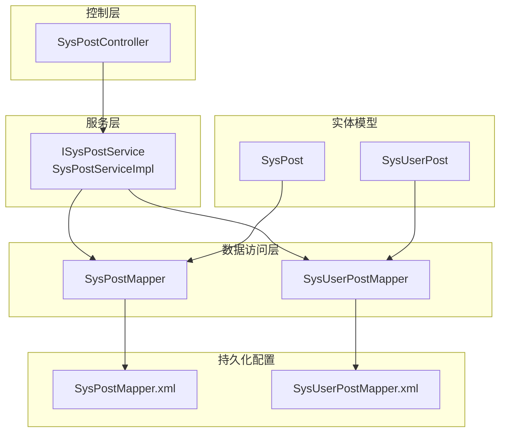
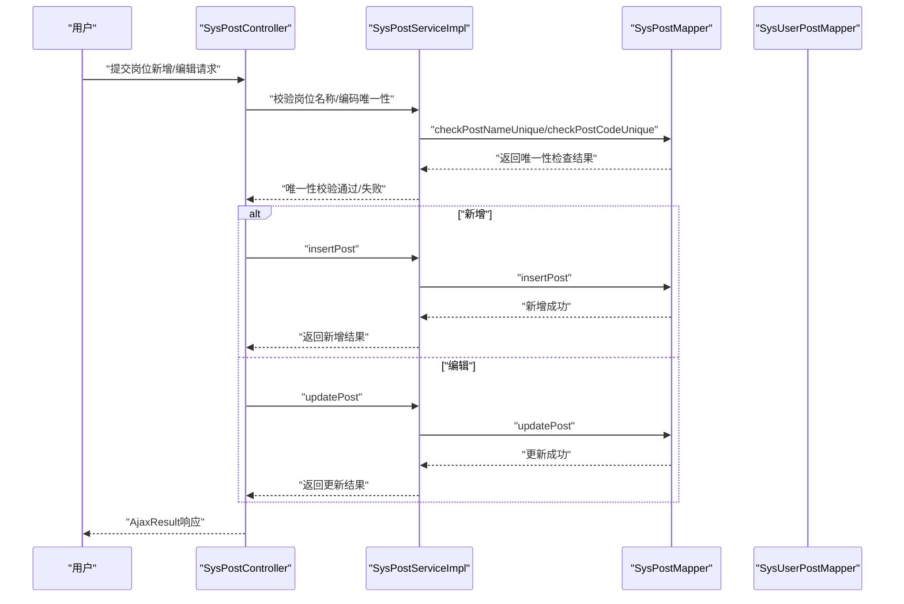
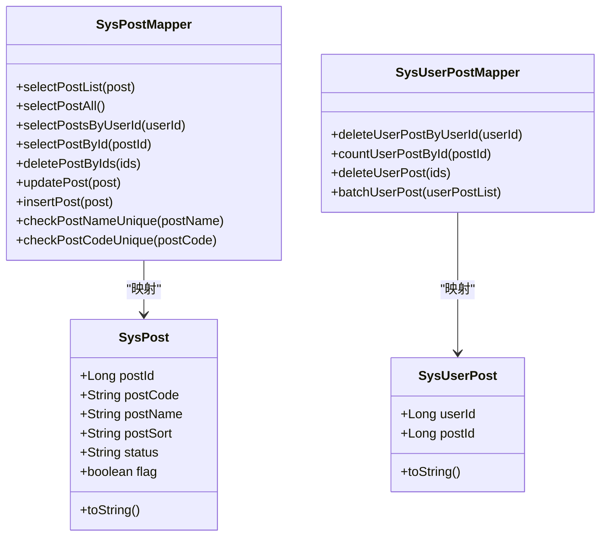
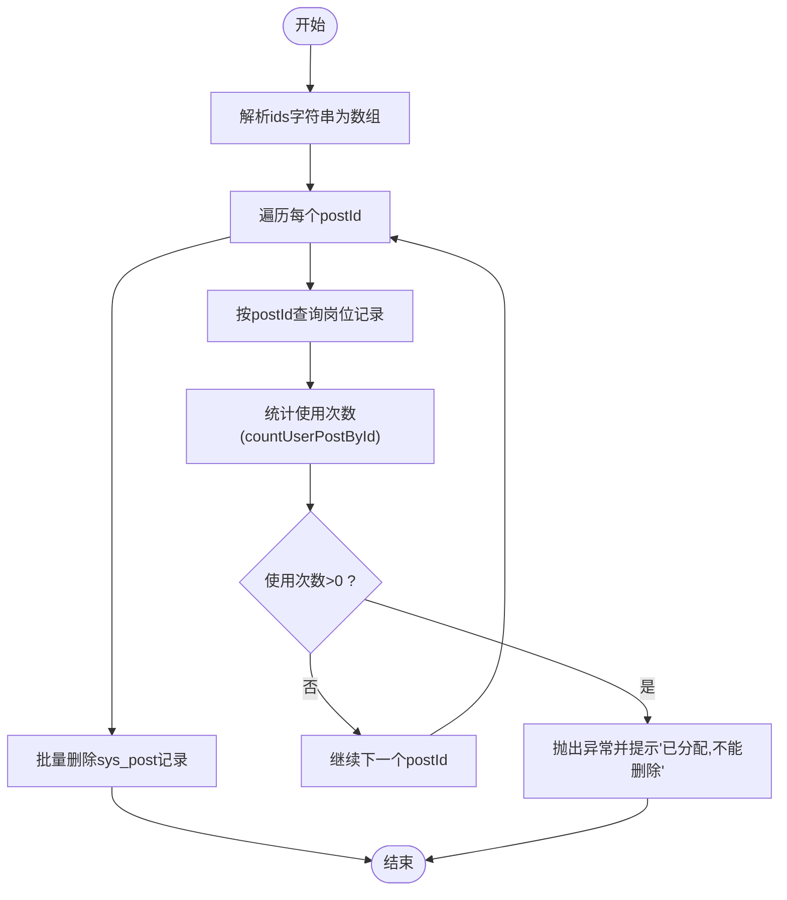
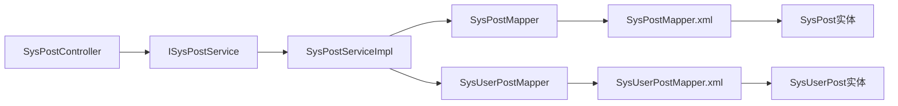

# 岗位实体

<cite>
**本文引用的文件**
- [SysPost.java](file://ruoyi-system/src/main/java/com/ruoyi/system/domain/SysPost.java)
- [SysUserPost.java](file://ruoyi-system/src/main/java/com/ruoyi/system/domain/SysUserPost.java)
- [SysPostController.java](file://ruoyi-admin/src/main/java/com/ruoyi/web/controller/system/SysPostController.java)
- [ISysPostService.java](file://ruoyi-system/src/main/java/com/ruoyi/system/service/ISysPostService.java)
- [SysPostServiceImpl.java](file://ruoyi-system/src/main/java/com/ruoyi/system/service/impl/SysPostServiceImpl.java)
- [SysPostMapper.java](file://ruoyi-system/src/main/java/com/ruoyi/system/mapper/SysPostMapper.java)
- [SysUserPostMapper.java](file://ruoyi-system/src/main/java/com/ruoyi/system/mapper/SysUserPostMapper.java)
- [SysPostMapper.xml](file://ruoyi-system/src/main/resources/mapper/system/SysPostMapper.xml)
- [SysUserPostMapper.xml](file://ruoyi-system/src/main/resources/mapper/system/SysUserPostMapper.xml)
</cite>

## 目录
1. [简介](#简介)
2. [项目结构](#项目结构)
3. [核心组件](#核心组件)
4. [架构总览](#架构总览)
5. [详细组件分析](#详细组件分析)
6. [依赖分析](#依赖分析)
7. [性能考虑](#性能考虑)
8. [故障排查指南](#故障排查指南)
9. [结论](#结论)
10. [附录](#附录)

## 简介
本文件围绕RuoYi系统中的“岗位”实体进行系统化技术文档梳理，重点覆盖以下方面：
- SysPost岗位实体的字段设计与约束
- 岗位与用户之间的多对多关联模型
- 岗位在权限体系中的作用与影响
- 岗位实体的业务规则与实现要点（如唯一性校验、状态管理、与用户的关联维护）
- 岗位管理的最佳实践与与角色权限体系的集成策略

## 项目结构
岗位相关代码采用分层架构组织，主要分布在系统模块与控制层中：
- 控制层：SysPostController 提供岗位的增删改查、导出、唯一性校验等接口
- 服务层：ISysPostService 及其实现类 SysPostServiceImpl 负责业务逻辑与校验
- 数据访问层：SysPostMapper、SysUserPostMapper 对应岗位与用户-岗位关联表的持久化
- 实体模型：SysPost、SysUserPost 映射数据库表结构
- 持久化配置：SysPostMapper.xml、SysUserPostMapper.xml 定义SQL映射

图表来源
- [SysPostController.java:1-157](file://ruoyi-admin/src/main/java/com/ruoyi/web/controller/system/SysPostController.java#L1-L157)
- [ISysPostService.java:1-92](file://ruoyi-system/src/main/java/com/ruoyi/system/service/ISysPostService.java#L1-L92)
- [SysPostServiceImpl.java:1-182](file://ruoyi-system/src/main/java/com/ruoyi/system/service/impl/SysPostServiceImpl.java#L1-L182)
- [SysPostMapper.java:1-84](file://ruoyi-system/src/main/java/com/ruoyi/system/mapper/SysPostMapper.java#L1-L84)
- [SysUserPostMapper.java:1-45](file://ruoyi-system/src/main/java/com/ruoyi/system/mapper/SysUserPostMapper.java#L1-L45)
- [SysPost.java:1-123](file://ruoyi-system/src/main/java/com/ruoyi/system/domain/SysPost.java#L1-L123)
- [SysUserPost.java:1-47](file://ruoyi-system/src/main/java/com/ruoyi/system/domain/SysUserPost.java#L1-L47)
- [SysPostMapper.xml:1-110](file://ruoyi-system/src/main/resources/mapper/system/SysPostMapper.xml#L1-L110)
- [SysUserPostMapper.xml:1-34](file://ruoyi-system/src/main/resources/mapper/system/SysUserPostMapper.xml#L1-L34)

章节来源
- [SysPostController.java:1-157](file://ruoyi-admin/src/main/java/com/ruoyi/web/controller/system/SysPostController.java#L1-L157)
- [SysPostServiceImpl.java:1-182](file://ruoyi-system/src/main/java/com/ruoyi/system/service/impl/SysPostServiceImpl.java#L1-L182)
- [SysPostMapper.xml:1-110](file://ruoyi-system/src/main/resources/mapper/system/SysPostMapper.xml#L1-L110)
- [SysUserPostMapper.xml:1-34](file://ruoyi-system/src/main/resources/mapper/system/SysUserPostMapper.xml#L1-L34)

## 核心组件
- SysPost 实体：定义岗位的核心字段与校验规则，继承基础实体以具备通用审计字段
- SysUserPost 实体：用户与岗位的关联表实体
- SysPostController 控制器：对外暴露岗位管理接口，负责参数接收、权限校验、调用服务层并返回结果
- ISysPostService 接口与 SysPostServiceImpl 实现：封装岗位查询、新增、修改、删除、唯一性校验、与用户关联的查询与维护
- SysPostMapper 与 SysUserPostMapper：定义岗位与用户-岗位关联的查询、更新、插入、批量操作
- XML 映射文件：将Java实体与数据库表字段进行映射，并提供条件查询、模糊匹配、批量删除等SQL

章节来源
- [SysPost.java:1-123](file://ruoyi-system/src/main/java/com/ruoyi/system/domain/SysPost.java#L1-L123)
- [SysUserPost.java:1-47](file://ruoyi-system/src/main/java/com/ruoyi/system/domain/SysUserPost.java#L1-L47)
- [SysPostController.java:1-157](file://ruoyi-admin/src/main/java/com/ruoyi/web/controller/system/SysPostController.java#L1-L157)
- [ISysPostService.java:1-92](file://ruoyi-system/src/main/java/com/ruoyi/system/service/ISysPostService.java#L1-L92)
- [SysPostServiceImpl.java:1-182](file://ruoyi-system/src/main/java/com/ruoyi/system/service/impl/SysPostServiceImpl.java#L1-L182)
- [SysPostMapper.java:1-84](file://ruoyi-system/src/main/java/com/ruoyi/system/mapper/SysPostMapper.java#L1-L84)
- [SysUserPostMapper.java:1-45](file://ruoyi-system/src/main/java/com/ruoyi/system/mapper/SysUserPostMapper.java#L1-L45)
- [SysPostMapper.xml:1-110](file://ruoyi-system/src/main/resources/mapper/system/SysPostMapper.xml#L1-L110)
- [SysUserPostMapper.xml:1-34](file://ruoyi-system/src/main/resources/mapper/system/SysUserPostMapper.xml#L1-L34)

## 架构总览
岗位管理遵循经典的分层架构，控制层负责请求入口与权限控制，服务层承载业务规则与校验，数据访问层负责与数据库交互。

图表来源
- [SysPostController.java:87-135](file://ruoyi-admin/src/main/java/com/ruoyi/web/controller/system/SysPostController.java#L87-L135)
- [SysPostServiceImpl.java:116-132](file://ruoyi-system/src/main/java/com/ruoyi/system/service/impl/SysPostServiceImpl.java#L116-L132)
- [SysPostMapper.xml:88-108](file://ruoyi-system/src/main/resources/mapper/system/SysPostMapper.xml#L88-L108)

## 详细组件分析

### SysPost 实体设计与字段说明
- 字段概览
  - 岗位标识字段
    - 岗位ID：主键，用于唯一标识岗位记录
    - 岗位编码：业务编码，需唯一且长度限制
  - 岗位信息字段
    - 岗位名称：必填，长度限制
    - 岗位排序：必填，用于界面展示顺序
    - 岗位状态：状态值（示例为0正常/1停用），用于启用/禁用岗位
  - 岗位描述字段
    - 备注：可选，用于补充说明
  - 共享标记
    - flag：用于前端判断当前用户是否拥有该岗位（非持久化字段）

- 校验规则
  - 岗位编码：非空、长度上限
  - 岗位名称：非空、长度上限
  - 岗位排序：非空
  - 状态：枚举式取值（0/1）

- 业务含义
  - 岗位编码唯一性：保障岗位在业务层面的唯一标识
  - 岗位状态：控制岗位是否可被分配给用户
  - 排序：用于界面展示时的稳定顺序

章节来源
- [SysPost.java:19-95](file://ruoyi-system/src/main/java/com/ruoyi/system/domain/SysPost.java#L19-L95)
- [SysPostMapper.xml:20-38](file://ruoyi-system/src/main/resources/mapper/system/SysPostMapper.xml#L20-L38)

### SysUserPost 关联模型
- 关联关系
  - 用户与岗位为多对多关系，通过中间表 sys_user_post 维护
  - 字段包含用户ID与岗位ID，共同构成联合主键

- 使用场景
  - 用户拥有多个岗位
  - 岗位可分配给多个用户
  - 用于权限计算与数据范围控制（结合用户-角色-菜单-部门等）

章节来源
- [SysUserPost.java:11-47](file://ruoyi-system/src/main/java/com/ruoyi/system/domain/SysUserPost.java#L11-L47)
- [SysUserPostMapper.xml:12-32](file://ruoyi-system/src/main/resources/mapper/system/SysUserPostMapper.xml#L12-L32)

### 控制器与权限控制
- 主要接口
  - 列表查询：支持按岗位编码、状态、岗位名称模糊查询
  - 导出：支持Excel导出
  - 删除：支持批量删除，删除前会校验是否已被分配
  - 新增/编辑：均进行名称与编码唯一性校验
  - 唯一性校验：提供独立接口供前端实时校验

- 权限点
  - system:post:view/list/export/remove/add/edit
  - 通过注解进行权限拦截

章节来源
- [SysPostController.java:37-155](file://ruoyi-admin/src/main/java/com/ruoyi/web/controller/system/SysPostController.java#L37-L155)

### 服务层业务规则与实现
- 查询与列表
  - 支持按条件查询与全量查询
  - 支持根据用户ID查询其拥有的岗位，并设置flag标记

- 新增/编辑
  - 新增/编辑前进行名称与编码唯一性校验
  - 新增时写入创建人，编辑时写入更新人

- 删除
  - 删除前统计岗位使用次数，若大于0则拒绝删除并提示“已分配，不能删除”

- 唯一性校验
  - 校验时忽略当前记录本身（避免自检失败）
  - 返回唯一性结果供控制器处理

章节来源
- [SysPostServiceImpl.java:29-180](file://ruoyi-system/src/main/java/com/ruoyi/system/service/impl/SysPostServiceImpl.java#L29-L180)
- [SysPostMapper.java:19-82](file://ruoyi-system/src/main/java/com/ruoyi/system/mapper/SysPostMapper.java#L19-L82)
- [SysUserPostMapper.java:19-43](file://ruoyi-system/src/main/java/com/ruoyi/system/mapper/SysUserPostMapper.java#L19-L43)

### 数据库映射与SQL实现
- SysPostMapper.xml
  - 字段映射：岗位ID、编码、名称、排序、状态、创建/更新字段、备注
  - 查询：支持按编码、状态、名称模糊查询
  - 更新：动态SET，仅更新非空字段
  - 插入：支持生成主键，自动填充时间字段
  - 唯一性校验：按名称或编码精确查询

- SysUserPostMapper.xml
  - 删除：按用户ID批量删除关联
  - 计数：按岗位ID统计使用次数
  - 批量插入：批量写入用户-岗位关联

章节来源
- [SysPostMapper.xml:7-108](file://ruoyi-system/src/main/resources/mapper/system/SysPostMapper.xml#L7-L108)
- [SysUserPostMapper.xml:7-32](file://ruoyi-system/src/main/resources/mapper/system/SysUserPostMapper.xml#L7-L32)

### 类图（实体与映射）

图表来源
- [SysPost.java:15-121](file://ruoyi-system/src/main/java/com/ruoyi/system/domain/SysPost.java#L15-L121)
- [SysUserPost.java:11-45](file://ruoyi-system/src/main/java/com/ruoyi/system/domain/SysUserPost.java#L11-L45)
- [SysPostMapper.java:11-83](file://ruoyi-system/src/main/java/com/ruoyi/system/mapper/SysPostMapper.java#L11-L83)
- [SysUserPostMapper.java:11-44](file://ruoyi-system/src/main/java/com/ruoyi/system/mapper/SysUserPostMapper.java#L11-L44)

### 删除流程（含业务规则）

图表来源
- [SysPostServiceImpl.java:95-108](file://ruoyi-system/src/main/java/com/ruoyi/system/service/impl/SysPostServiceImpl.java#L95-L108)
- [SysPostMapper.xml:67-72](file://ruoyi-system/src/main/resources/mapper/system/SysPostMapper.xml#L67-L72)
- [SysUserPostMapper.xml:16-18](file://ruoyi-system/src/main/resources/mapper/system/SysUserPostMapper.xml#L16-L18)

## 依赖分析
- 控制器依赖服务层接口
- 服务层依赖Mapper接口与工具类（如转换、字符串工具）
- Mapper接口对应XML映射文件，完成SQL执行
- 实体类与Mapper之间通过ResultMap建立字段映射

图表来源
- [SysPostController.java:34-35](file://ruoyi-admin/src/main/java/com/ruoyi/web/controller/system/SysPostController.java#L34-L35)
- [SysPostServiceImpl.java:23-27](file://ruoyi-system/src/main/java/com/ruoyi/system/service/impl/SysPostServiceImpl.java#L23-L27)
- [SysPostMapper.xml:5](file://ruoyi-system/src/main/resources/mapper/system/SysPostMapper.xml#L5)
- [SysUserPostMapper.xml:5](file://ruoyi-system/src/main/resources/mapper/system/SysUserPostMapper.xml#L5)

章节来源
- [SysPostController.java:34-35](file://ruoyi-admin/src/main/java/com/ruoyi/web/controller/system/SysPostController.java#L34-L35)
- [SysPostServiceImpl.java:23-27](file://ruoyi-system/src/main/java/com/ruoyi/system/service/impl/SysPostServiceImpl.java#L23-L27)
- [SysPostMapper.xml:5](file://ruoyi-system/src/main/resources/mapper/system/SysPostMapper.xml#L5)
- [SysUserPostMapper.xml:5](file://ruoyi-system/src/main/resources/mapper/system/SysUserPostMapper.xml#L5)

## 性能考虑
- 查询优化
  - 列表查询支持按编码、状态、名称模糊匹配，建议在数据库层面为常用查询字段建立索引（如post_code、status）
- 批量操作
  - 批量删除与批量插入使用MyBatis的foreach循环，注意传入参数规模，避免超大数组导致SQL过长
- 唯一性校验
  - 唯一性检查通过单条查询返回，复杂度O(1)，建议在数据库层面为post_code与post_name建立唯一索引以提升校验效率
- 关联查询
  - 根据用户ID查询岗位时，先全量查询岗位再比对用户已有岗位，复杂度O(n)，当岗位数量较大时可考虑直接使用关联查询替代内存比对

[本节为通用性能建议，不涉及具体文件分析]

## 故障排查指南
- 删除失败提示“已分配,不能删除”
  - 触发原因：待删除岗位存在用户关联
  - 排查步骤：确认岗位使用计数是否大于0；清理用户-岗位关联后再试
  - 相关实现参考：[SysPostServiceImpl.java:95-108](file://ruoyi-system/src/main/java/com/ruoyi/system/service/impl/SysPostServiceImpl.java#L95-L108)、[SysUserPostMapper.xml:16-18](file://ruoyi-system/src/main/resources/mapper/system/SysUserPostMapper.xml#L16-L18)
- 新增/编辑失败提示“岗位名称/编码已存在”
  - 触发原因：唯一性校验未通过
  - 排查步骤：检查数据库中是否存在重复的名称或编码；确认是否忽略当前记录自身
  - 相关实现参考：[SysPostServiceImpl.java:152-180](file://ruoyi-system/src/main/java/com/ruoyi/system/service/impl/SysPostServiceImpl.java#L152-L180)
- 岗位状态异常
  - 触发原因：状态值非预期（如0/1之外）
  - 排查步骤：检查前端传参与后端校验规则；确保状态值符合枚举约定
  - 相关实现参考：[SysPost.java:35-37](file://ruoyi-system/src/main/java/com/ruoyi/system/domain/SysPost.java#L35-L37)

章节来源
- [SysPostServiceImpl.java:95-108](file://ruoyi-system/src/main/java/com/ruoyi/system/service/impl/SysPostServiceImpl.java#L95-L108)
- [SysPostServiceImpl.java:152-180](file://ruoyi-system/src/main/java/com/ruoyi/system/service/impl/SysPostServiceImpl.java#L152-L180)
- [SysPost.java:35-37](file://ruoyi-system/src/main/java/com/ruoyi/system/domain/SysPost.java#L35-L37)

## 结论
- SysPost与SysUserPost构成了岗位与用户之间的多对多关系，支撑用户能力维度的权限与数据范围控制
- 岗位实体具备完善的字段约束与唯一性校验，配合服务层的删除保护机制，保证了数据一致性
- 控制器层通过权限注解与统一返回结构，提供了清晰的业务入口与用户体验
- 建议在数据库层面完善索引与唯一约束，以进一步提升查询与校验性能

[本节为总结性内容，不涉及具体文件分析]

## 附录

### 岗位实体字段说明（对照）
- 岗位ID：主键，标识唯一岗位
- 岗位编码：业务编码，唯一，长度限制
- 岗位名称：必填，长度限制
- 岗位排序：必填，用于展示顺序
- 状态：0正常/1停用
- 备注：可选
- flag：前端标记当前用户是否拥有该岗位（非持久化）

章节来源
- [SysPost.java:19-95](file://ruoyi-system/src/main/java/com/ruoyi/system/domain/SysPost.java#L19-L95)
- [SysPostMapper.xml:7-18](file://ruoyi-system/src/main/resources/mapper/system/SysPostMapper.xml#L7-L18)

### 与角色权限体系的集成策略
- 岗位作为用户能力维度的附加属性，通常与角色形成互补：角色决定菜单/按钮级权限，岗位决定数据范围与业务域
- 在数据范围控制与岗位相关的场景中，可结合用户-岗位-部门-角色的综合关系进行权限判定
- 建议在权限计算时优先评估角色权限，再叠加岗位带来的数据范围约束，确保最小权限原则与职责分离

[本节为概念性内容，不涉及具体文件分析]