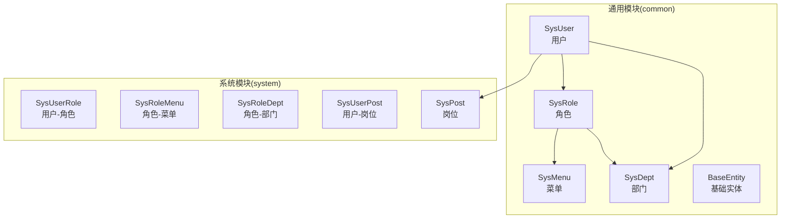
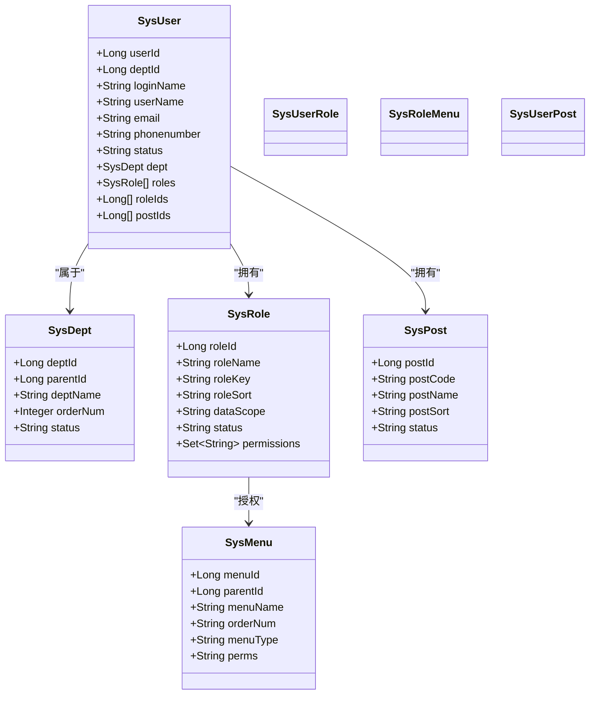
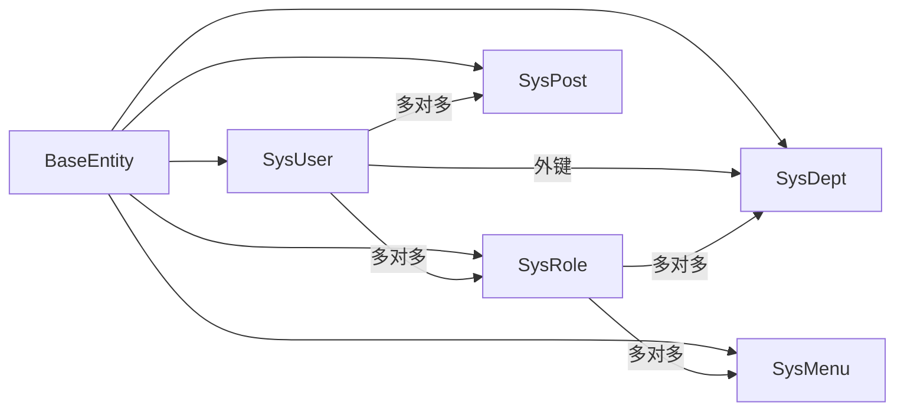

# 核心业务实体

<cite>
**本文引用的文件**   
- [SysUser.java](file://ruoyi-common/src/main/java/com/ruoyi/common/core/domain/entity/SysUser.java)
- [SysRole.java](file://ruoyi-common/src/main/java/com/ruoyi/common/core/domain/entity/SysRole.java)
- [SysMenu.java](file://ruoyi-common/src/main/java/com/ruoyi/common/core/domain/entity/SysMenu.java)
- [SysDept.java](file://ruoyi-common/src/main/java/com/ruoyi/common/core/domain/entity/SysDept.java)
- [SysPost.java](file://ruoyi-system/src/main/java/com/ruoyi/system/domain/SysPost.java)
- [SysUserRole.java](file://ruoyi-system/src/main/java/com/ruoyi/system/domain/SysUserRole.java)
- [SysRoleMenu.java](file://ruoyi-system/src/main/java/com/ruoyi/system/domain/SysRoleMenu.java)
- [SysUserPost.java](file://ruoyi-system/src/main/java/com/ruoyi/system/domain/SysUserPost.java)
- [BaseEntity.java](file://ruoyi-common/src/main/java/com/ruoyi/common/core/domain/BaseEntity.java)
- [UserConstants.java](file://ruoyi-common/src/main/java/com/ruoyi/common/constant/UserConstants.java)
- [ry_20260319.sql](file://sql/ry_20260319.sql)
</cite>

## 目录
1. [引言](#引言)
2. [项目结构](#项目结构)
3. [核心组件](#核心组件)
4. [架构总览](#架构总览)
5. [详细组件分析](#详细组件分析)
6. [依赖分析](#依赖分析)
7. [性能考虑](#性能考虑)
8. [故障排查指南](#故障排查指南)
9. [结论](#结论)
10. [附录](#附录)

## 引言
本文件聚焦于RuoYi系统的核心业务实体，围绕用户(User)、角色(Role)、菜单(Menu)、部门(Dept)、岗位(Post)及其关联表进行深入解析。内容涵盖字段定义、数据类型、约束条件、业务规则、实体间关系、生命周期管理、数据校验与权限控制，并通过ER图与类图展示核心业务模型，帮助开发者快速理解系统数据结构与业务架构。

## 项目结构
核心实体分布在通用模块与系统模块中：
- 通用实体：用户、角色、菜单、部门（位于common模块）
- 关联表：用户-角色、角色-菜单、角色-部门、用户-岗位（位于system模块）
- 基类：统一的BaseEntity提供公共审计字段
- 常量与约束：用户相关常量与长度限制



图表来源
- [SysUser.java:17-382](file://ruoyi-common/src/main/java/com/ruoyi/common/core/domain/entity/SysUser.java#L17-L382)
- [SysRole.java:11-212](file://ruoyi-common/src/main/java/com/ruoyi/common/core/domain/entity/SysRole.java#L11-L212)
- [SysMenu.java:10-215](file://ruoyi-common/src/main/java/com/ruoyi/common/core/domain/entity/SysMenu.java#L10-L215)
- [SysDept.java:12-204](file://ruoyi-common/src/main/java/com/ruoyi/common/core/domain/entity/SysDept.java#L12-L204)
- [SysPost.java:10-123](file://ruoyi-system/src/main/java/com/ruoyi/system/domain/SysPost.java#L10-L123)
- [SysUserRole.java:6-47](file://ruoyi-system/src/main/java/com/ruoyi/system/domain/SysUserRole.java#L6-L47)
- [SysRoleMenu.java:6-47](file://ruoyi-system/src/main/java/com/ruoyi/system/domain/SysRoleMenu.java#L6-L47)
- [SysUserPost.java:6-47](file://ruoyi-system/src/main/java/com/ruoyi/system/domain/SysUserPost.java#L6-L47)

章节来源
- [SysUser.java:17-382](file://ruoyi-common/src/main/java/com/ruoyi/common/core/domain/entity/SysUser.java#L17-L382)
- [SysRole.java:11-212](file://ruoyi-common/src/main/java/com/ruoyi/common/core/domain/entity/SysRole.java#L11-L212)
- [SysMenu.java:10-215](file://ruoyi-common/src/main/java/com/ruoyi/common/core/domain/entity/SysMenu.java#L10-L215)
- [SysDept.java:12-204](file://ruoyi-common/src/main/java/com/ruoyi/common/core/domain/entity/SysDept.java#L12-L204)
- [SysPost.java:10-123](file://ruoyi-system/src/main/java/com/ruoyi/system/domain/SysPost.java#L10-L123)
- [SysUserRole.java:6-47](file://ruoyi-system/src/main/java/com/ruoyi/system/domain/SysUserRole.java#L6-L47)
- [SysRoleMenu.java:6-47](file://ruoyi-system/src/main/java/com/ruoyi/system/domain/SysRoleMenu.java#L6-L47)
- [SysUserPost.java:6-47](file://ruoyi-system/src/main/java/com/ruoyi/system/domain/SysUserPost.java#L6-L47)

## 核心组件
- 用户(User)：承载登录凭证、基本信息、所属部门、角色集合、岗位集合等
- 角色(Role)：定义角色名称、权限键、数据范围、状态等，并维护菜单与部门授权
- 菜单(Menu)：描述导航结构、类型(M/C/F)、权限标识(perms)、层级父子关系
- 部门(Dept)：树形组织结构，支持祖先链、排序、负责人、联系方式与状态
- 岗位(Post)：员工职位信息，支持编码、名称、排序与状态

章节来源
- [SysUser.java:17-382](file://ruoyi-common/src/main/java/com/ruoyi/common/core/domain/entity/SysUser.java#L17-L382)
- [SysRole.java:11-212](file://ruoyi-common/src/main/java/com/ruoyi/common/core/domain/entity/SysRole.java#L11-L212)
- [SysMenu.java:10-215](file://ruoyi-common/src/main/java/com/ruoyi/common/core/domain/entity/SysMenu.java#L10-L215)
- [SysDept.java:12-204](file://ruoyi-common/src/main/java/com/ruoyi/common/core/domain/entity/SysDept.java#L12-L204)
- [SysPost.java:10-123](file://ruoyi-system/src/main/java/com/ruoyi/system/domain/SysPost.java#L10-L123)

## 架构总览
下图展示核心业务实体与关联表之间的ER关系，体现一对多、多对多的业务约束与外键关系。

```mermaid
erDiagram
SYS_DEPT {
bigint dept_id PK
bigint parent_id
varchar ancestors
varchar dept_name
int order_num
varchar leader
varchar phone
varchar email
char status
char del_flag
}
SYS_USER {
bigint user_id PK
bigint dept_id FK
varchar login_name
varchar user_name
varchar user_type
varchar email
varchar phonenumber
char sex
varchar avatar
varchar password
varchar salt
char status
char del_flag
varchar login_ip
datetime login_date
datetime pwd_update_date
}
SYS_POST {
bigint post_id PK
varchar post_code
varchar post_name
int post_sort
char status
}
SYS_ROLE {
bigint role_id PK
varchar role_name
varchar role_key
int role_sort
char data_scope
char status
char del_flag
}
SYS_MENU {
bigint menu_id PK
bigint parent_id
varchar menu_name
int order_num
varchar url
varchar target
char menu_type
char visible
char is_refresh
varchar perms
varchar icon
}
SYS_USER_ROLE {
bigint user_id PK
bigint role_id PK
}
SYS_ROLE_MENU {
bigint role_id PK
bigint menu_id PK
}
SYS_ROLE_DEPT {
bigint role_id PK
bigint dept_id PK
}
SYS_USER_POST {
bigint user_id PK
bigint post_id PK
}
SYS_USER }o|--o{ SYS_USER_ROLE : "拥有"
SYS_USER }o|--o{ SYS_USER_POST : "拥有"
SYS_USER }o|--|| SYS_DEPT : "属于"
SYS_ROLE }o|--o{ SYS_ROLE_MENU : "授权"
SYS_ROLE }o|--o{ SYS_ROLE_DEPT : "授权"
SYS_MENU ||--o{ SYS_MENU : "父子关系"
```

图表来源
- [ry_20260319.sql:4-21](file://sql/ry_20260319.sql#L4-L21)
- [ry_20260319.sql:41-65](file://sql/ry_20260319.sql#L41-L65)
- [ry_20260319.sql:77-91](file://sql/ry_20260319.sql#L77-L91)
- [ry_20260319.sql:105-120](file://sql/ry_20260319.sql#L105-L120)
- [ry_20260319.sql:133-151](file://sql/ry_20260319.sql#L133-L151)
- [ry_20260319.sql:262-267](file://sql/ry_20260319.sql#L262-L267)
- [ry_20260319.sql:279-284](file://sql/ry_20260319.sql#L279-L284)
- [ry_20260319.sql:379-383](file://sql/ry_20260319.sql#L379-L383)
- [ry_20260319.sql:395-400](file://sql/ry_20260319.sql#L395-L400)

## 详细组件分析

### 用户实体（SysUser）
- 设计理念与业务含义
  - 用户是系统身份认证与权限控制的核心主体，承载登录凭据、个人资料、所属部门、角色与岗位等上下文信息
  - 支持审计字段继承自BaseEntity，便于追踪创建与更新
- 字段与约束
  - 主键：user_id
  - 外键：dept_id -> SYS_DEPT.dept_id
  - 关键字段：login_name、user_name、email、phonenumber、password、salt、status、del_flag、login_ip、login_date、pwd_update_date
  - 关联集合：roles（多对多-角色）、posts（多对多-岗位）、dept（一对一-部门）
- 业务规则
  - 登录名非空且长度限制；邮箱格式校验；手机号长度限制；性别取值限定；状态与删除标志采用“正常/停用”“存在/删除”的枚举式存储
  - 提供isAdmin判断逻辑用于权限判定
- 生命周期管理
  - 继承BaseEntity，自动记录创建者、创建时间、更新者、更新时间、备注
- 数据验证与安全
  - 密码与盐字段标注忽略序列化，避免泄露
  - XSS注解用于输入净化

章节来源
- [SysUser.java:17-382](file://ruoyi-common/src/main/java/com/ruoyi/common/core/domain/entity/SysUser.java#L17-L382)
- [BaseEntity.java:11-119](file://ruoyi-common/src/main/java/com/ruoyi/common/core/domain/BaseEntity.java#L11-L119)
- [UserConstants.java:47-73](file://ruoyi-common/src/main/java/com/ruoyi/common/constant/UserConstants.java#L47-L73)

### 角色实体（SysRole）
- 设计理念与业务含义
  - 角色是对权限与数据范围的抽象，支撑RBAC模型中的“角色-权限-资源”映射
- 字段与约束
  - 主键：role_id
  - 关键字段：role_name、role_key（权限键）、role_sort、data_scope（数据范围）、status、del_flag
  - 关联集合：permissions（权限集合）、menuIds（菜单授权）、deptIds（部门数据范围）
- 业务规则
  - 角色名称与权限键长度限制；角色排序非空；数据范围枚举式存储；状态与删除标志
  - 提供isAdmin静态方法用于快速判断内置管理员角色
- 生命周期管理
  - 继承BaseEntity，自动记录审计信息

章节来源
- [SysRole.java:11-212](file://ruoyi-common/src/main/java/com/ruoyi/common/core/domain/entity/SysRole.java#L11-L212)
- [BaseEntity.java:11-119](file://ruoyi-common/src/main/java/com/ruoyi/common/core/domain/BaseEntity.java#L11-L119)

### 菜单实体（SysMenu）
- 设计理念与业务含义
  - 菜单是系统导航与功能入口的载体，支持目录(M)、菜单(C)、按钮(F)三类，配合权限标识实现细粒度访问控制
- 字段与约束
  - 主键：menu_id
  - 层级字段：parent_id、ancestors（树形结构）
  - 关键字段：menu_name、orderNum、url、target、menuType、visible、isRefresh、perms、icon
  - 子节点：children（递归子菜单）
- 业务规则
  - 菜单名称、显示顺序、权限标识长度限制；菜单类型非空；URL长度限制；图标与打开方式可选
- 生命周期管理
  - 继承BaseEntity，自动记录审计信息

章节来源
- [SysMenu.java:10-215](file://ruoyi-common/src/main/java/com/ruoyi/common/core/domain/entity/SysMenu.java#L10-L215)
- [BaseEntity.java:11-119](file://ruoyi-common/src/main/java/com/ruoyi/common/core/domain/BaseEntity.java#L11-L119)

### 部门实体（SysDept）
- 设计理念与业务含义
  - 部门作为组织架构的最小单元，支持树形层级、祖先链、排序与状态控制
- 字段与约束
  - 主键：dept_id
  - 层级字段：parent_id、ancestors
  - 关键字段：deptName、orderNum、leader、phone、email、status、delFlag
  - 排除编号：excludeId（用于排除自身或特定节点）
- 业务规则
  - 部门名称长度限制；显示顺序非空；邮箱格式校验；状态与删除标志
- 生命周期管理
  - 继承BaseEntity，自动记录审计信息

章节来源
- [SysDept.java:12-204](file://ruoyi-common/src/main/java/com/ruoyi/common/core/domain/entity/SysDept.java#L12-L204)
- [BaseEntity.java:11-119](file://ruoyi-common/src/main/java/com/ruoyi/common/core/domain/BaseEntity.java#L11-L119)

### 岗位实体（SysPost）
- 设计理念与业务含义
  - 岗位用于标识员工在组织内的职责定位，支持编码、名称、排序与状态
- 字段与约束
  - 主键：post_id
  - 关键字段：postCode、postName、postSort、status
  - 标识：flag（用于标记用户是否已拥有该岗位）
- 业务规则
  - 岗位编码与名称长度限制；显示顺序非空；状态枚举式存储
- 生命周期管理
  - 继承BaseEntity，自动记录审计信息

章节来源
- [SysPost.java:10-123](file://ruoyi-system/src/main/java/com/ruoyi/system/domain/SysPost.java#L10-L123)
- [BaseEntity.java:11-119](file://ruoyi-common/src/main/java/com/ruoyi/common/core/domain/BaseEntity.java#L11-L119)

### 关联表分析
- 用户-角色（SysUserRole）
  - 复合主键(user_id, role_id)，表示用户可拥有多个角色，角色可授予多个用户
- 角色-菜单（SysRoleMenu）
  - 复合主键(role_id, menu_id)，表示角色可拥有多个菜单权限，菜单可被多个角色授权
- 角色-部门（SysRoleDept）
  - 复合主键(role_id, dept_id)，用于限定角色的数据访问范围（部门维度）
- 用户-岗位（SysUserPost）
  - 复合主键(user_id, post_id)，表示用户可拥有多个岗位，岗位可分配给多个用户

章节来源
- [SysUserRole.java:6-47](file://ruoyi-system/src/main/java/com/ruoyi/system/domain/SysUserRole.java#L6-L47)
- [SysRoleMenu.java:6-47](file://ruoyi-system/src/main/java/com/ruoyi/system/domain/SysRoleMenu.java#L6-L47)
- [SysUserPost.java:6-47](file://ruoyi-system/src/main/java/com/ruoyi/system/domain/SysUserPost.java#L6-L47)
- [ry_20260319.sql:262-267](file://sql/ry_20260319.sql#L262-L267)
- [ry_20260319.sql:279-284](file://sql/ry_20260319.sql#L279-L284)
- [ry_20260319.sql:379-383](file://sql/ry_20260319.sql#L379-L383)
- [ry_20260319.sql:395-400](file://sql/ry_20260319.sql#L395-L400)

### 实体关系与依赖流程
- 用户与部门：一对多（一个部门包含多个用户），外键dept_id指向SYS_DEPT
- 用户与角色：多对多（通过SysUserRole关联）
- 用户与岗位：多对多（通过SysUserPost关联）
- 角色与菜单：多对多（通过SysRoleMenu关联）
- 角色与部门：多对多（通过SysRoleDept关联）



图表来源
- [SysUser.java:17-382](file://ruoyi-common/src/main/java/com/ruoyi/common/core/domain/entity/SysUser.java#L17-L382)
- [SysDept.java:12-204](file://ruoyi-common/src/main/java/com/ruoyi/common/core/domain/entity/SysDept.java#L12-L204)
- [SysRole.java:11-212](file://ruoyi-common/src/main/java/com/ruoyi/common/core/domain/entity/SysRole.java#L11-L212)
- [SysMenu.java:10-215](file://ruoyi-common/src/main/java/com/ruoyi/common/core/domain/entity/SysMenu.java#L10-L215)
- [SysPost.java:10-123](file://ruoyi-system/src/main/java/com/ruoyi/system/domain/SysPost.java#L10-L123)
- [SysUserRole.java:6-47](file://ruoyi-system/src/main/java/com/ruoyi/system/domain/SysUserRole.java#L6-L47)
- [SysRoleMenu.java:6-47](file://ruoyi-system/src/main/java/com/ruoyi/system/domain/SysRoleMenu.java#L6-L47)
- [SysUserPost.java:6-47](file://ruoyi-system/src/main/java/com/ruoyi/system/domain/SysUserPost.java#L6-L47)

## 依赖分析
- 组件耦合与内聚
  - 实体均继承BaseEntity，统一了审计字段，提升内聚性与复用性
  - 关联表采用复合主键，明确多对多关系，降低冗余与异常
- 外部依赖与集成点
  - 数据库层面：各实体对应物理表，遵循统一命名规范（sys_*）
  - 权限控制：角色-菜单-按钮的权限标识(perms)用于前端与后端的访问控制
- 潜在循环依赖
  - 实体间通过外键与关联表建立关系，未见直接循环依赖
- 接口契约
  - 关联表仅包含必要字段（user_id/post_id/role_id/menu_id），满足最小契约



图表来源
- [BaseEntity.java:11-119](file://ruoyi-common/src/main/java/com/ruoyi/common/core/domain/BaseEntity.java#L11-L119)
- [SysUser.java:17-382](file://ruoyi-common/src/main/java/com/ruoyi/common/core/domain/entity/SysUser.java#L17-L382)
- [SysRole.java:11-212](file://ruoyi-common/src/main/java/com/ruoyi/common/core/domain/entity/SysRole.java#L11-L212)
- [SysMenu.java:10-215](file://ruoyi-common/src/main/java/com/ruoyi/common/core/domain/entity/SysMenu.java#L10-L215)
- [SysDept.java:12-204](file://ruoyi-common/src/main/java/com/ruoyi/common/core/domain/entity/SysDept.java#L12-L204)
- [SysPost.java:10-123](file://ruoyi-system/src/main/java/com/ruoyi/system/domain/SysPost.java#L10-L123)

章节来源
- [BaseEntity.java:11-119](file://ruoyi-common/src/main/java/com/ruoyi/common/core/domain/BaseEntity.java#L11-L119)
- [SysUser.java:17-382](file://ruoyi-common/src/main/java/com/ruoyi/common/core/domain/entity/SysUser.java#L17-L382)
- [SysRole.java:11-212](file://ruoyi-common/src/main/java/com/ruoyi/common/core/domain/entity/SysRole.java#L11-L212)
- [SysMenu.java:10-215](file://ruoyi-common/src/main/java/com/ruoyi/common/core/domain/entity/SysMenu.java#L10-L215)
- [SysDept.java:12-204](file://ruoyi-common/src/main/java/com/ruoyi/common/core/domain/entity/SysDept.java#L12-L204)
- [SysPost.java:10-123](file://ruoyi-system/src/main/java/com/ruoyi/system/domain/SysPost.java#L10-L123)

## 性能考虑
- 索引与查询
  - 建议在用户表的dept_id、login_name建立索引以优化登录与部门查询
  - 角色-菜单与角色-部门的组合主键天然具备索引特性，适合频繁的授权查询
- 缓存策略
  - 将常用菜单树与角色权限集进行缓存，减少重复计算
- 分页与分治
  - 大规模用户/岗位/角色数据建议分页加载与懒加载子节点
- 序列化与传输
  - 对敏感字段（密码、盐）避免序列化输出，降低带宽与泄露风险

## 故障排查指南
- 常见问题与定位
  - 登录失败：检查用户状态(status)与删除标志(del_flag)，确认密码与盐匹配
  - 权限不足：核对角色-菜单授权与角色-部门数据范围(data_scope)
  - 部门树异常：检查dept_id与parent_id一致性及ancestors完整性
  - 岗位分配错误：确认用户-岗位关联是否正确
- 校验与约束
  - 使用注解驱动的校验（长度、格式、非空）在入参层拦截非法数据
  - 常量与模式（用户名/密码长度、邮箱/手机正则）统一由UserConstants提供

章节来源
- [UserConstants.java:47-73](file://ruoyi-common/src/main/java/com/ruoyi/common/constant/UserConstants.java#L47-L73)
- [SysUser.java:160-216](file://ruoyi-common/src/main/java/com/ruoyi/common/core/domain/entity/SysUser.java#L160-L216)
- [SysRole.java:99-132](file://ruoyi-common/src/main/java/com/ruoyi/common/core/domain/entity/SysRole.java#L99-L132)
- [SysDept.java:87-141](file://ruoyi-common/src/main/java/com/ruoyi/common/core/domain/entity/SysDept.java#L87-L141)
- [SysPost.java:52-85](file://ruoyi-system/src/main/java/com/ruoyi/system/domain/SysPost.java#L52-L85)

## 结论
RuoYi的核心业务实体以清晰的ER模型为基础，通过角色-菜单-按钮的权限体系与角色-部门的数据范围控制，实现了灵活而可控的RBAC模型。用户、角色、菜单、部门、岗位五类实体与关联表共同构成完整的组织与权限基础设施，既满足企业级应用的复杂需求，又保持了良好的扩展性与可维护性。

## 附录
- 字段与约束参考（来自数据库初始化脚本）
  - 用户表：包含用户ID、部门ID、登录名、昵称、类型、邮箱、手机、性别、头像、密码、盐、状态、删除标志、登录IP、登录时间、密码更新时间等
  - 角色表：包含角色ID、角色名称、权限键、排序、数据范围、状态、删除标志等
  - 菜单表：包含菜单ID、父菜单ID、菜单名称、排序、URL、打开方式、类型、可见性、是否刷新、权限标识、图标等
  - 部门表：包含部门ID、父部门ID、祖先链、部门名称、排序、负责人、电话、邮箱、状态、删除标志等
  - 岗位表：包含岗位ID、岗位编码、岗位名称、排序、状态等
  - 关联表：用户-角色、角色-菜单、角色-部门、用户-岗位均为复合主键的多对多关系

章节来源
- [ry_20260319.sql:4-65](file://sql/ry_20260319.sql#L4-L65)
- [ry_20260319.sql:77-120](file://sql/ry_20260319.sql#L77-L120)
- [ry_20260319.sql:133-151](file://sql/ry_20260319.sql#L133-L151)
- [ry_20260319.sql:262-400](file://sql/ry_20260319.sql#L262-L400)