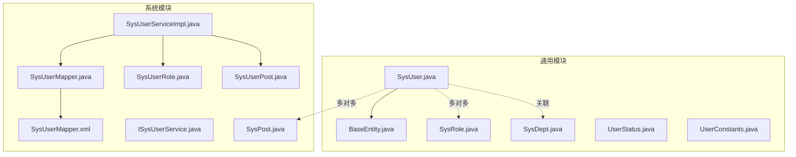
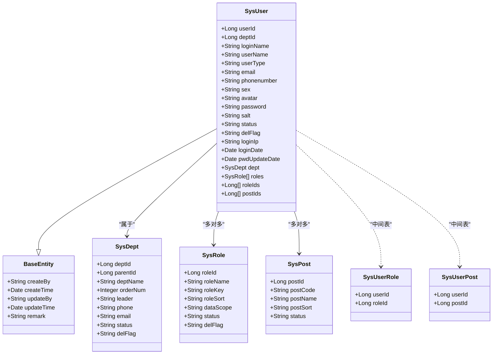
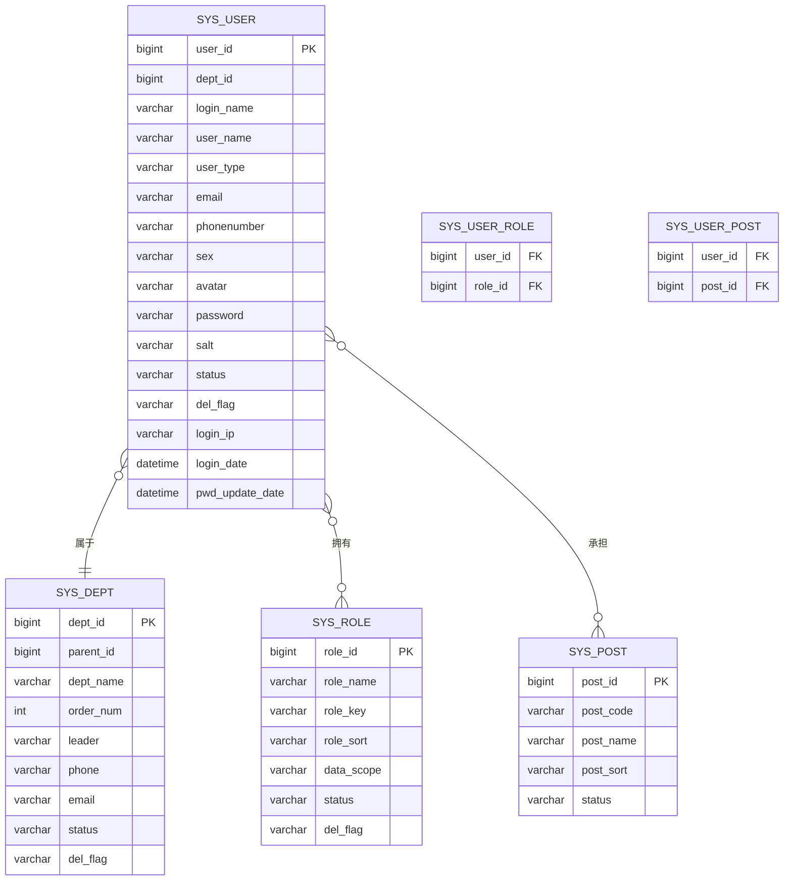
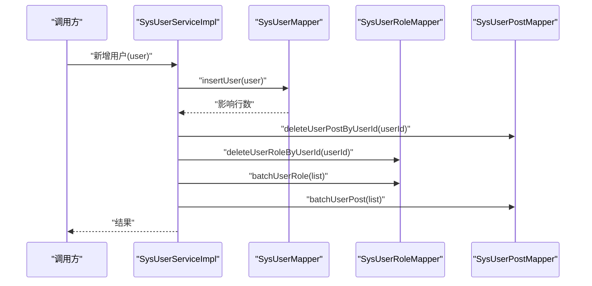
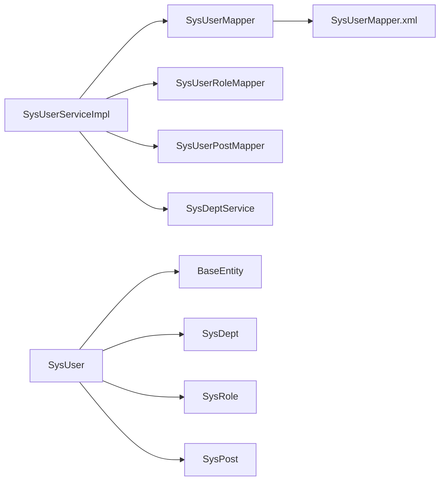

# 用户实体

<cite>
**本文引用的文件**
- [SysUser.java](file://ruoyi-common/src/main/java/com/ruoyi/common/core/domain/entity/SysUser.java)
- [BaseEntity.java](file://ruoyi-common/src/main/java/com/ruoyi/common/core/domain/BaseEntity.java)
- [SysUserMapper.java](file://ruoyi-system/src/main/java/com/ruoyi/system/mapper/SysUserMapper.java)
- [SysUserMapper.xml](file://ruoyi-system/src/main/resources/mapper/system/SysUserMapper.xml)
- [ISysUserService.java](file://ruoyi-system/src/main/java/com/ruoyi/system/service/ISysUserService.java)
- [SysUserServiceImpl.java](file://ruoyi-system/src/main/java/com/ruoyi/system/service/impl/SysUserServiceImpl.java)
- [SysRole.java](file://ruoyi-common/src/main/java/com/ruoyi/common/core/domain/entity/SysRole.java)
- [SysUserRole.java](file://ruoyi-system/src/main/java/com/ruoyi/system/domain/SysUserRole.java)
- [SysPost.java](file://ruoyi-system/src/main/java/com/ruoyi/system/domain/SysPost.java)
- [SysUserPost.java](file://ruoyi-system/src/main/java/com/ruoyi/system/domain/SysUserPost.java)
- [SysDept.java](file://ruoyi-common/src/main/java/com/ruoyi/common/core/domain/entity/SysDept.java)
- [UserStatus.java](file://ruoyi-common/src/main/java/com/ruoyi/common/enums/UserStatus.java)
- [UserConstants.java](file://ruoyi-common/src/main/java/com/ruoyi/common/constant/UserConstants.java)
</cite>

## 目录
1. [简介](#简介)
2. [项目结构](#项目结构)
3. [核心组件](#核心组件)
4. [架构总览](#架构总览)
5. [详细组件分析](#详细组件分析)
6. [依赖分析](#依赖分析)
7. [性能考量](#性能考量)
8. [故障排查指南](#故障排查指南)
9. [结论](#结论)
10. [附录](#附录)

## 简介
本文件围绕 RuoYi 系统中的用户实体 SysUser 进行系统化梳理，覆盖其字段设计、业务规则、与部门/角色/岗位的关系模型、CRUD 实现与安全策略，并提供最佳实践与排障建议。目标读者既包括开发者也包括对技术细节有一定了解的非专业用户。

## 项目结构
用户相关的核心代码分布在通用模块与系统模块中：
- 通用模块 ruoyi-common 提供基础实体与通用能力（如 BaseEntity、枚举、常量）
- 系统模块 ruoyi-system 提供用户领域服务、Mapper/XML、以及业务实现

图表来源
- [SysUser.java:1-382](file://ruoyi-common/src/main/java/com/ruoyi/common/core/domain/entity/SysUser.java#L1-L382)
- [BaseEntity.java:1-119](file://ruoyi-common/src/main/java/com/ruoyi/common/core/domain/BaseEntity.java#L1-L119)
- [SysUserMapper.java:1-165](file://ruoyi-system/src/main/java/com/ruoyi/system/mapper/SysUserMapper.java#L1-L165)
- [SysUserMapper.xml:1-246](file://ruoyi-system/src/main/resources/mapper/system/SysUserMapper.xml#L1-L246)
- [ISysUserService.java:1-235](file://ruoyi-system/src/main/java/com/ruoyi/system/service/ISysUserService.java#L1-L235)
- [SysUserServiceImpl.java:1-596](file://ruoyi-system/src/main/java/com/ruoyi/system/service/impl/SysUserServiceImpl.java#L1-L596)
- [SysRole.java:1-212](file://ruoyi-common/src/main/java/com/ruoyi/common/core/domain/entity/SysRole.java#L1-L212)
- [SysUserRole.java:1-47](file://ruoyi-system/src/main/java/com/ruoyi/system/domain/SysUserRole.java#L1-L47)
- [SysPost.java:1-123](file://ruoyi-system/src/main/java/com/ruoyi/system/domain/SysPost.java#L1-L123)
- [SysUserPost.java:1-47](file://ruoyi-system/src/main/java/com/ruoyi/system/domain/SysUserPost.java#L1-L47)
- [SysDept.java:1-204](file://ruoyi-common/src/main/java/com/ruoyi/common/core/domain/entity/SysDept.java#L1-L204)
- [UserStatus.java:1-31](file://ruoyi-common/src/main/java/com/ruoyi/common/enums/UserStatus.java#L1-L31)
- [UserConstants.java:1-74](file://ruoyi-common/src/main/java/com/ruoyi/common/constant/UserConstants.java#L1-L74)

章节来源
- [SysUser.java:1-382](file://ruoyi-common/src/main/java/com/ruoyi/common/core/domain/entity/SysUser.java#L1-L382)
- [SysUserMapper.java:1-165](file://ruoyi-system/src/main/java/com/ruoyi/system/mapper/SysUserMapper.java#L1-L165)
- [SysUserMapper.xml:1-246](file://ruoyi-system/src/main/resources/mapper/system/SysUserMapper.xml#L1-L246)
- [ISysUserService.java:1-235](file://ruoyi-system/src/main/java/com/ruoyi/system/service/ISysUserService.java#L1-L235)
- [SysUserServiceImpl.java:1-596](file://ruoyi-system/src/main/java/com/ruoyi/system/service/impl/SysUserServiceImpl.java#L1-L596)

## 核心组件
- 用户实体 SysUser：承载用户基本信息、状态、时间戳、与部门/角色/岗位的关联属性
- 基类 BaseEntity：统一的审计字段（创建/更新时间、创建者、更新者、备注）
- 用户 Mapper/Service：提供查询、新增、修改、删除、唯一性校验、导入导出等能力
- 角色/岗位实体与中间表：支撑用户与角色/岗位的多对多关系
- 枚举与常量：用户状态、业务常量（长度、类型、正则）

章节来源
- [SysUser.java:1-382](file://ruoyi-common/src/main/java/com/ruoyi/common/core/domain/entity/SysUser.java#L1-L382)
- [BaseEntity.java:1-119](file://ruoyi-common/src/main/java/com/ruoyi/common/core/domain/BaseEntity.java#L1-L119)
- [SysRole.java:1-212](file://ruoyi-common/src/main/java/com/ruoyi/common/core/domain/entity/SysRole.java#L1-L212)
- [SysPost.java:1-123](file://ruoyi-system/src/main/java/com/ruoyi/system/domain/SysPost.java#L1-L123)
- [SysUserRole.java:1-47](file://ruoyi-system/src/main/java/com/ruoyi/system/domain/SysUserRole.java#L1-L47)
- [SysUserPost.java:1-47](file://ruoyi-system/src/main/java/com/ruoyi/system/domain/SysUserPost.java#L1-L47)
- [UserStatus.java:1-31](file://ruoyi-common/src/main/java/com/ruoyi/common/enums/UserStatus.java#L1-L31)
- [UserConstants.java:1-74](file://ruoyi-common/src/main/java/com/ruoyi/common/constant/UserConstants.java#L1-L74)

## 架构总览
用户实体在系统中的职责与交互如下：

图表来源
- [SysUser.java:1-382](file://ruoyi-common/src/main/java/com/ruoyi/common/core/domain/entity/SysUser.java#L1-L382)
- [BaseEntity.java:1-119](file://ruoyi-common/src/main/java/com/ruoyi/common/core/domain/BaseEntity.java#L1-L119)
- [SysDept.java:1-204](file://ruoyi-common/src/main/java/com/ruoyi/common/core/domain/entity/SysDept.java#L1-L204)
- [SysRole.java:1-212](file://ruoyi-common/src/main/java/com/ruoyi/common/core/domain/entity/SysRole.java#L1-L212)
- [SysPost.java:1-123](file://ruoyi-system/src/main/java/com/ruoyi/system/domain/SysPost.java#L1-L123)
- [SysUserRole.java:1-47](file://ruoyi-system/src/main/java/com/ruoyi/system/domain/SysUserRole.java#L1-L47)
- [SysUserPost.java:1-47](file://ruoyi-system/src/main/java/com/ruoyi/system/domain/SysUserPost.java#L1-L47)

## 详细组件分析

### 字段与数据模型
- 基础字段
  - 用户标识：userId（主键）
  - 部门关联：deptId（外键），parentId（用于树形结构）
  - 登录与展示：loginName、userName、userType、avatar、sex
  - 联系方式：email、phonenumber
  - 安全与状态：password、salt、status（0正常/1停用/2删除）、delFlag（逻辑删除）
  - 登录审计：loginIp、loginDate、pwdUpdateDate
  - 审计字段：继承 BaseEntity 的 createBy、createTime、updateBy、updateTime、remark
- 关联字段
  - dept：SysDept 对象（MyBatis ResultMap 中通过 association 映射）
  - roles：List<SysRole>（MyBatis ResultMap 中通过 collection 映射）
  - roleIds/postIds：用于批量授权/赋岗的数组

章节来源
- [SysUser.java:26-103](file://ruoyi-common/src/main/java/com/ruoyi/common/core/domain/entity/SysUser.java#L26-L103)
- [SysUserMapper.xml:7-31](file://ruoyi-system/src/main/resources/mapper/system/SysUserMapper.xml#L7-L31)
- [BaseEntity.java:24-39](file://ruoyi-common/src/main/java/com/ruoyi/common/core/domain/BaseEntity.java#L24-L39)

### 业务规则与约束
- 字段约束
  - 登录名 loginName：非空、长度限制、XSS 过滤
  - 邮箱 email：格式校验、长度限制
  - 手机 phonenumber：长度限制
  - 性别 sex：枚举值映射（0男/1女/2未知）
  - 密码 password/salt：敏感字段序列化时忽略输出
- 状态与删除
  - status 使用 UserStatus 枚举（0正常/1停用/2删除）
  - delFlag 采用逻辑删除策略（0存在/2删除）
- 唯一性校验
  - loginName、phonenumber、email 在 Mapper 层提供唯一性检查
- 用户类型
  - userType 支持系统用户与注册用户两类

章节来源
- [SysUser.java:160-216](file://ruoyi-common/src/main/java/com/ruoyi/common/core/domain/entity/SysUser.java#L160-L216)
- [SysUser.java:238-258](file://ruoyi-common/src/main/java/com/ruoyi/common/core/domain/entity/SysUser.java#L238-L258)
- [UserStatus.java:8-30](file://ruoyi-common/src/main/java/com/ruoyi/common/enums/UserStatus.java#L8-L30)
- [SysUserMapper.java:142-163](file://ruoyi-system/src/main/java/com/ruoyi/system/mapper/SysUserMapper.java#L142-L163)

### 用户与部门的关联
- 单向关联：SysUser.deptId 指向 SysDept.deptId
- MyBatis XML 通过 left join 将部门信息映射到 deptResult，并在 SysUserResult 中以 association 聚合
- 支持按部门 ID 查询用户列表，以及数据范围过滤

章节来源
- [SysUser.java:90-95](file://ruoyi-common/src/main/java/com/ruoyi/common/core/domain/entity/SysUser.java#L90-L95)
- [SysUserMapper.xml:52-60](file://ruoyi-system/src/main/resources/mapper/system/SysUserMapper.xml#L52-L60)

### 用户与角色的多对多关系
- 中间表：sys_user_role（userId、roleId）
- 实体：SysUserRole
- 业务实现
  - 新增/修改用户时，先清理旧关联，再批量写入新角色
  - 提供按角色筛选“已分配/未分配”用户列表
  - 支持查询用户所属角色组字符串

图表来源
- [SysUserMapper.xml:52-60](file://ruoyi-system/src/main/resources/mapper/system/SysUserMapper.xml#L52-L60)
- [SysUserRole.java:11-47](file://ruoyi-system/src/main/java/com/ruoyi/system/domain/SysUserRole.java#L11-L47)
- [SysUserPost.java:11-47](file://ruoyi-system/src/main/java/com/ruoyi/system/domain/SysUserPost.java#L11-L47)

章节来源
- [SysUserServiceImpl.java:336-354](file://ruoyi-system/src/main/java/com/ruoyi/system/service/impl/SysUserServiceImpl.java#L336-L354)
- [SysUserServiceImpl.java:361-380](file://ruoyi-system/src/main/java/com/ruoyi/system/service/impl/SysUserServiceImpl.java#L361-L380)
- [ISysUserService.java:76-77](file://ruoyi-system/src/main/java/com/ruoyi/system/service/ISysUserService.java#L76-L77)

### 用户与岗位的多对多关系
- 中间表：sys_user_post（userId、postId）
- 实体：SysUserPost
- 业务实现
  - 新增/修改用户时，先清理旧岗位关联，再批量写入新岗位
  - 支持查询用户所属岗位组字符串

章节来源
- [SysUserServiceImpl.java:361-380](file://ruoyi-system/src/main/java/com/ruoyi/system/service/impl/SysUserServiceImpl.java#L361-L380)
- [ISysUserService.java:210-215](file://ruoyi-system/src/main/java/com/ruoyi/system/service/ISysUserService.java#L210-L215)

### CRUD 流程与安全要点
- 新增用户
  - Mapper 插入 sys_user 记录
  - 自动写入角色与岗位中间表
- 修改用户
  - 先清理旧角色/岗位关联，再写入新关系
  - 支持仅更新用户信息（updateUserInfo）
- 删除用户
  - 逻辑删除（更新 del_flag）
  - 同步清理角色/岗位中间表
- 登录信息更新
  - 更新 loginIp 与 loginDate
- 密码重置
  - 更新 password 与 salt，并记录 pwdUpdateDate

图表来源
- [SysUserServiceImpl.java:218-230](file://ruoyi-system/src/main/java/com/ruoyi/system/service/impl/SysUserServiceImpl.java#L218-L230)
- [SysUserMapper.java:133-139](file://ruoyi-system/src/main/java/com/ruoyi/system/mapper/SysUserMapper.java#L133-L139)

章节来源
- [SysUserServiceImpl.java:173-211](file://ruoyi-system/src/main/java/com/ruoyi/system/service/impl/SysUserServiceImpl.java#L173-L211)
- [SysUserMapper.java:158-167](file://ruoyi-system/src/main/java/com/ruoyi/system/mapper/SysUserMapper.java#L158-L167)

### 查询与分页
- 支持按 loginName、phonenumber、status、deptId、时间范围等条件分页查询
- MyBatis XML 提供 selectUserList、selectAllocatedList、selectUnallocatedList 等语句
- 数据范围过滤通过 ${params.dataScope} 注入

章节来源
- [SysUserMapper.xml:62-89](file://ruoyi-system/src/main/resources/mapper/system/SysUserMapper.xml#L62-L89)
- [SysUserMapper.xml:91-124](file://ruoyi-system/src/main/resources/mapper/system/SysUserMapper.xml#L91-L124)

### 导入与校验
- 导入流程
  - 校验是否存在同名用户
  - 不存在则校验实体并初始化密码，存在且允许更新则更新
  - 统计成功/失败数量并抛出异常或返回成功消息
- 校验规则
  - 唯一性：loginName、phonenumber、email
  - XSS 过滤与长度/格式校验
  - 数据范围与权限控制

章节来源
- [SysUserServiceImpl.java:504-582](file://ruoyi-system/src/main/java/com/ruoyi/system/service/impl/SysUserServiceImpl.java#L504-L582)
- [SysUserMapper.java:142-163](file://ruoyi-system/src/main/java/com/ruoyi/system/mapper/SysUserMapper.java#L142-L163)

## 依赖分析
- SysUser 继承 BaseEntity，复用审计字段
- Service 层依赖 Mapper、中间表 Mapper、配置与部门服务
- Mapper XML 通过 ResultMap 关联部门与角色集合
- 业务层对唯一性、数据范围、权限进行前置校验

图表来源
- [SysUser.java:1-382](file://ruoyi-common/src/main/java/com/ruoyi/common/core/domain/entity/SysUser.java#L1-L382)
- [BaseEntity.java:1-119](file://ruoyi-common/src/main/java/com/ruoyi/common/core/domain/BaseEntity.java#L1-L119)
- [SysUserServiceImpl.java:1-73](file://ruoyi-system/src/main/java/com/ruoyi/system/service/impl/SysUserServiceImpl.java#L1-L73)
- [SysUserMapper.java:1-165](file://ruoyi-system/src/main/java/com/ruoyi/system/mapper/SysUserMapper.java#L1-L165)
- [SysUserMapper.xml:1-246](file://ruoyi-system/src/main/resources/mapper/system/SysUserMapper.xml#L1-L246)

章节来源
- [SysUserServiceImpl.java:1-73](file://ruoyi-system/src/main/java/com/ruoyi/system/service/impl/SysUserServiceImpl.java#L1-L73)
- [SysUserMapper.xml:1-246](file://ruoyi-system/src/main/resources/mapper/system/SysUserMapper.xml#L1-L246)

## 性能考量
- 查询优化
  - 合理使用索引：login_name、phonenumber、email、dept_id、create_time
  - 分页查询配合条件过滤，避免全表扫描
- 关联查询
  - MyBatis ResultMap 已通过 left join 聚合部门与角色，注意避免 N+1 查询
- 写入优化
  - 批量插入角色/岗位中间表，减少事务往返
- 缓存策略
  - 可结合 Redis 对热点用户信息做缓存（需在上层业务扩展）

## 故障排查指南
- 唯一性冲突
  - 现象：新增/更新时报 loginName/phonenumber/email 已存在
  - 处理：调用唯一性校验接口，修正输入
- 超级管理员限制
  - 现象：尝试操作 admin 用户被拒绝
  - 处理：确认当前登录用户权限，避免越权
- 数据范围异常
  - 现象：跨部门修改用户报无权限
  - 处理：检查数据范围过滤参数与当前用户数据范围
- 密码重置失败
  - 现象：重置密码后仍无法登录
  - 处理：确认 password/salt 是否同时更新，pwdUpdateDate 是否同步

章节来源
- [SysUserServiceImpl.java:388-434](file://ruoyi-system/src/main/java/com/ruoyi/system/service/impl/SysUserServiceImpl.java#L388-L434)
- [SysUserServiceImpl.java:441-448](file://ruoyi-system/src/main/java/com/ruoyi/system/service/impl/SysUserServiceImpl.java#L441-L448)
- [SysUserServiceImpl.java:455-468](file://ruoyi-system/src/main/java/com/ruoyi/system/service/impl/SysUserServiceImpl.java#L455-L468)
- [SysUserMapper.xml:173-175](file://ruoyi-system/src/main/resources/mapper/system/SysUserMapper.xml#L173-L175)

## 结论
SysUser 作为用户域的核心实体，通过清晰的字段设计、严格的约束与完善的关联模型，支撑了用户管理的完整生命周期。结合 Service 层的事务一致性与 Mapper 的高效查询，可满足大多数企业级场景下的用户管理需求。建议在生产环境中进一步完善缓存、监控与审计能力，并持续关注字段扩展与权限治理。

## 附录

### 字段说明与约束清单
- 用户标识
  - userId：主键，Long
- 基本信息
  - loginName：登录名，非空，长度限制，XSS 过滤
  - userName：用户昵称，长度限制
  - userType：用户类型，系统/注册
  - email：邮箱，格式校验，长度限制
  - phonenumber：手机号，长度限制
  - sex：性别，枚举映射
  - avatar：头像地址
- 安全与状态
  - password：密码，序列化忽略
  - salt：盐，序列化忽略
  - status：状态，0正常/1停用/2删除
  - delFlag：逻辑删除，0存在/2删除
- 登录与审计
  - loginIp：最后登录IP
  - loginDate：最后登录时间
  - pwdUpdateDate：密码更新时间
  - 审计字段：createBy、createTime、updateBy、updateTime、remark（继承 BaseEntity）

章节来源
- [SysUser.java:26-103](file://ruoyi-common/src/main/java/com/ruoyi/common/core/domain/entity/SysUser.java#L26-L103)
- [BaseEntity.java:24-39](file://ruoyi-common/src/main/java/com/ruoyi/common/core/domain/BaseEntity.java#L24-L39)
- [UserStatus.java:8-30](file://ruoyi-common/src/main/java/com/ruoyi/common/enums/UserStatus.java#L8-L30)

### 最佳实践与安全建议
- 密码安全
  - 存储使用 salt 加密，禁止明文存储
  - 定期强制修改密码，记录 pwdUpdateDate
- 输入校验
  - 前端与后端双重校验，防止注入与越权
- 权限控制
  - 严格区分 admin 与普通用户，避免跨权限操作
  - 使用数据范围过滤，确保只能访问授权数据
- 日志与审计
  - 记录关键操作（新增/修改/删除/重置密码/授权）
  - 审计字段统一由 BaseEntity 提供，避免遗漏

章节来源
- [SysUserServiceImpl.java:504-582](file://ruoyi-system/src/main/java/com/ruoyi/system/service/impl/SysUserServiceImpl.java#L504-L582)
- [SysUserMapper.xml:173-175](file://ruoyi-system/src/main/resources/mapper/system/SysUserMapper.xml#L173-L175)
- [UserConstants.java:15-73](file://ruoyi-common/src/main/java/com/ruoyi/common/constant/UserConstants.java#L15-L73)