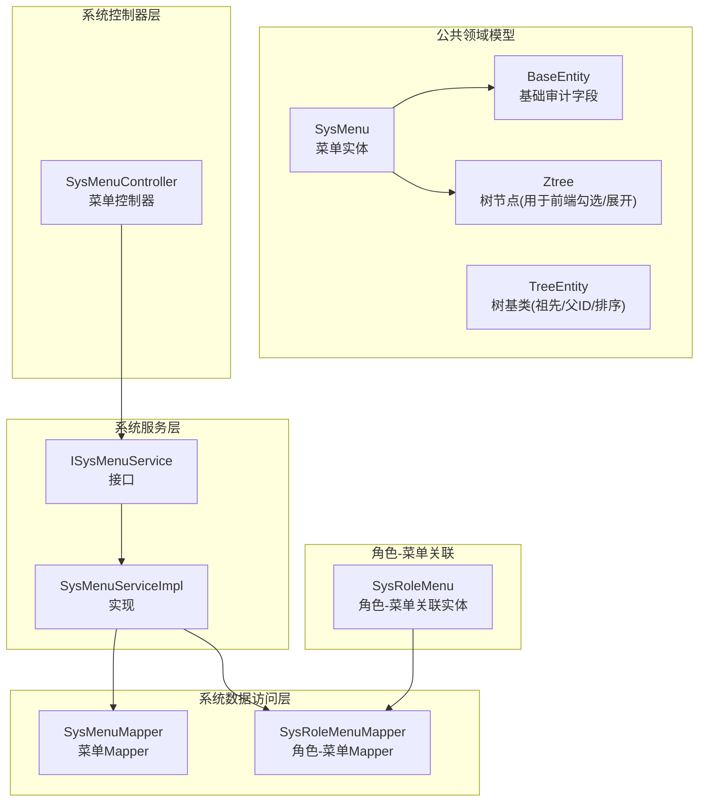
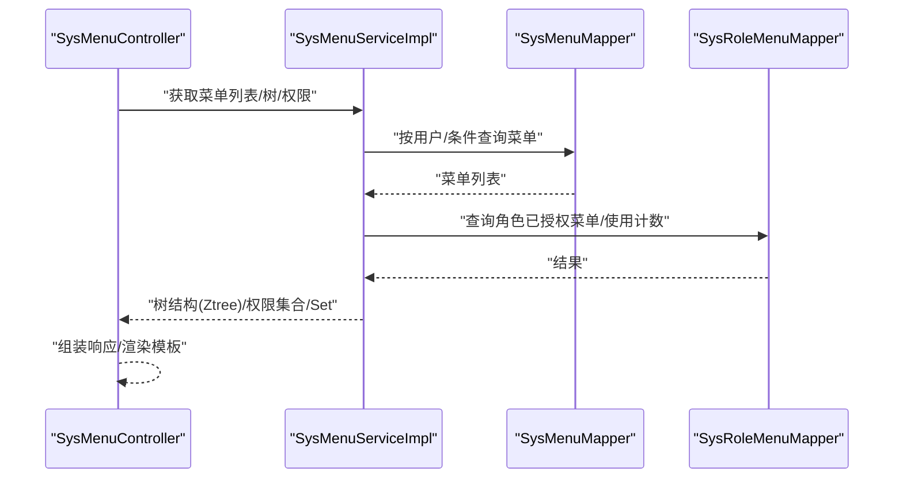
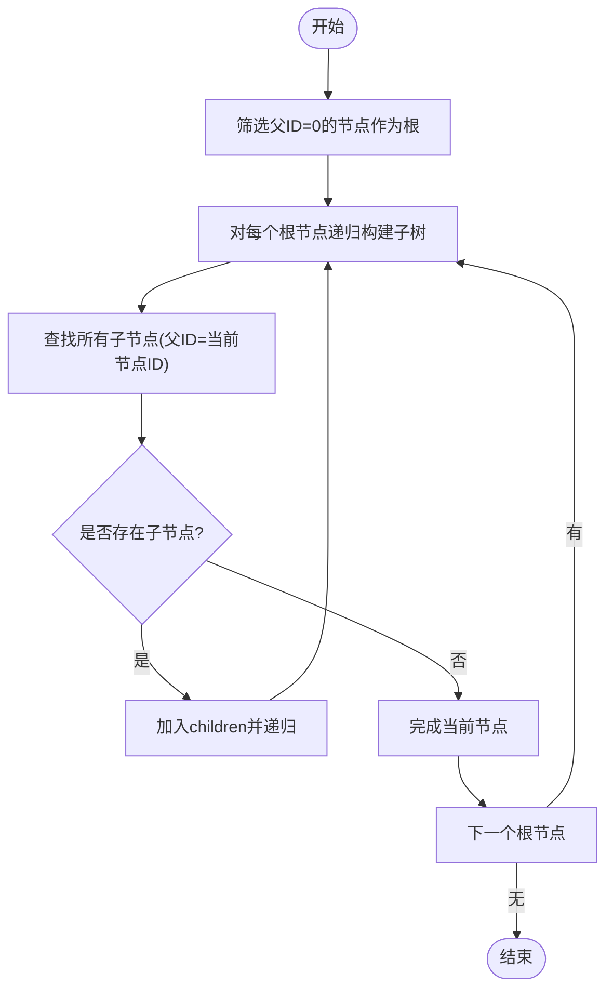
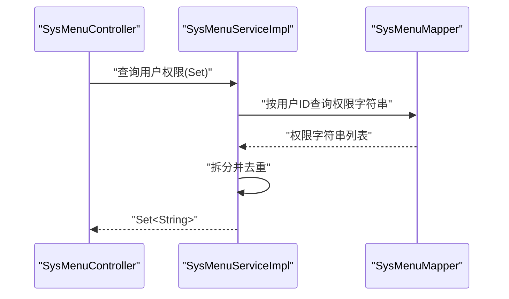
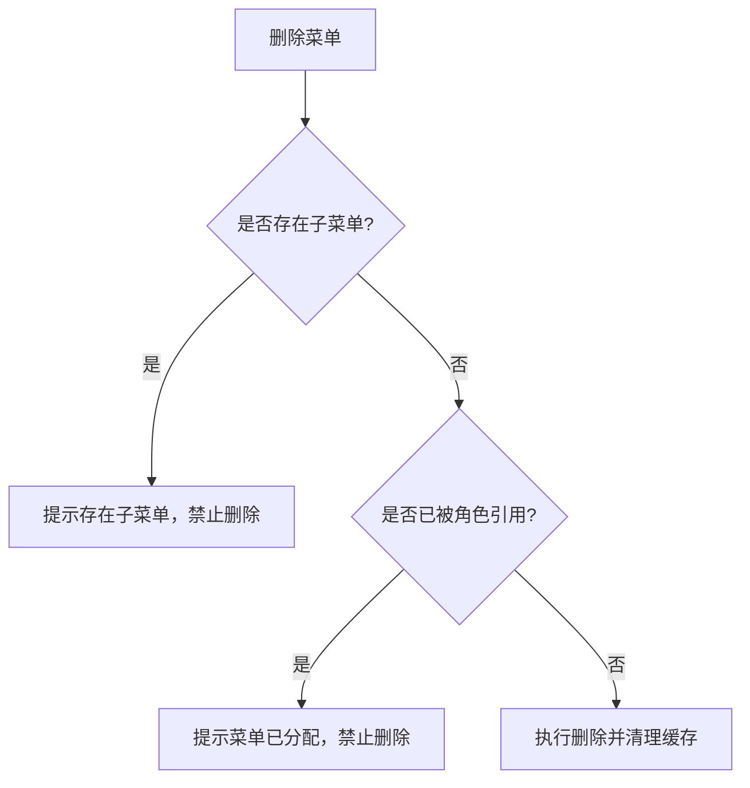
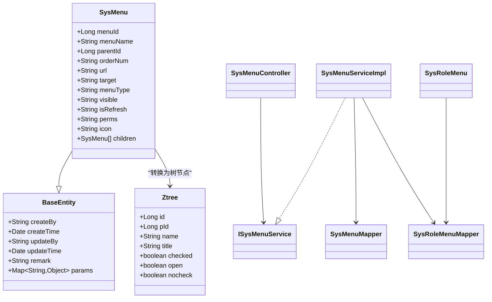

# 菜单实体

<cite>
**本文引用的文件**   
- [SysMenu.java](file://ruoyi-common/src/main/java/com/ruoyi/common/core/domain/entity/SysMenu.java)
- [BaseEntity.java](file://ruoyi-common/src/main/java/com/ruoyi/common/core/domain/BaseEntity.java)
- [TreeEntity.java](file://ruoyi-common/src/main/java/com/ruoyi/common/core/domain/TreeEntity.java)
- [Ztree.java](file://ruoyi-common/src/main/java/com/ruoyi/common/core/domain/Ztree.java)
- [SysMenuMapper.java](file://ruoyi-system/src/main/java/com/ruoyi/system/mapper/SysMenuMapper.java)
- [ISysMenuService.java](file://ruoyi-system/src/main/java/com/ruoyi/system/service/ISysMenuService.java)
- [SysMenuServiceImpl.java](file://ruoyi-system/src/main/java/com/ruoyi/system/service/impl/SysMenuServiceImpl.java)
- [SysMenuController.java](file://ruoyi-admin/src/main/java/com/ruoyi/web/controller/system/SysMenuController.java)
- [SysRoleMenu.java](file://ruoyi-system/src/main/java/com/ruoyi/system/domain/SysRoleMenu.java)
- [SysRoleMenuMapper.java](file://ruoyi-system/src/main/java/com/ruoyi/system/mapper/SysRoleMenuMapper.java)
- [UserConstants.java](file://ruoyi-common/src/main/java/com/ruoyi/common/constant/UserConstants.java)
- [menu.html](file://ruoyi-admin/src/main/resources/templates/system/menu/menu.html)
- [add.html](file://ruoyi-admin/src/main/resources/templates/system/menu/add.html)
- [edit.html](file://ruoyi-admin/src/main/resources/templates/system/menu/edit.html)
- [ruoyi.html](file://sql/ruoyi.html)
- [ruoyi.pdm](file://sql/ruoyi.pdm)
</cite>

## 目录
1. [简介](#简介)
2. [项目结构](#项目结构)
3. [核心组件](#核心组件)
4. [架构总览](#架构总览)
5. [详细组件分析](#详细组件分析)
6. [依赖分析](#依赖分析)
7. [性能考虑](#性能考虑)
8. [故障排查指南](#故障排查指南)
9. [结论](#结论)
10. [附录](#附录)

## 简介
本文件围绕 RuoYi 系统的菜单实体 SysMenu 进行深入解析，覆盖其树形结构设计、字段语义、权限控制、状态管理、业务规则与最佳实践。重点阐述菜单标识（菜单ID、父菜单ID）、菜单属性（名称、类型、路由地址、组件路径等）、权限标识（perms）、图标与排序、显示状态与菜单状态；并结合服务层与控制器层实现，给出树形构建算法、菜单层级校验、权限标识唯一性、菜单状态控制等关键流程的可视化说明。

## 项目结构
与菜单实体直接相关的代码分布在以下模块：
- 公共领域模型：SysMenu、BaseEntity、TreeEntity、Ztree
- 系统服务层：ISysMenuService、SysMenuServiceImpl
- 系统数据访问层：SysMenuMapper、SysRoleMenuMapper
- 系统控制器层：SysMenuController
- 角色-菜单关联实体：SysRoleMenu
- 常量与前端模板：UserConstants、菜单管理页面模板

图表来源
- [SysMenu.java:15-215](file://ruoyi-common/src/main/java/com/ruoyi/common/core/domain/entity/SysMenu.java#L15-L215)
- [BaseEntity.java:16-119](file://ruoyi-common/src/main/java/com/ruoyi/common/core/domain/BaseEntity.java#L16-L119)
- [TreeEntity.java:8-63](file://ruoyi-common/src/main/java/com/ruoyi/common/core/domain/TreeEntity.java#L8-L63)
- [Ztree.java:10-105](file://ruoyi-common/src/main/java/com/ruoyi/common/core/domain/Ztree.java#L10-L105)
- [ISysMenuService.java:16-148](file://ruoyi-system/src/main/java/com/ruoyi/system/service/ISysMenuService.java#L16-L148)
- [SysMenuServiceImpl.java:34-441](file://ruoyi-system/src/main/java/com/ruoyi/system/service/impl/SysMenuServiceImpl.java#L34-L441)
- [SysMenuMapper.java:12-140](file://ruoyi-system/src/main/java/com/ruoyi/system/mapper/SysMenuMapper.java#L12-L140)
- [SysRoleMenuMapper.java:11-45](file://ruoyi-system/src/main/java/com/ruoyi/system/mapper/SysRoleMenuMapper.java#L11-L45)
- [SysMenuController.java:33-212](file://ruoyi-admin/src/main/java/com/ruoyi/web/controller/system/SysMenuController.java#L33-L212)
- [SysRoleMenu.java:11-46](file://ruoyi-system/src/main/java/com/ruoyi/system/domain/SysRoleMenu.java#L11-L46)

章节来源
- [SysMenu.java:15-215](file://ruoyi-common/src/main/java/com/ruoyi/common/core/domain/entity/SysMenu.java#L15-L215)
- [SysMenuServiceImpl.java:34-441](file://ruoyi-system/src/main/java/com/ruoyi/system/service/impl/SysMenuServiceImpl.java#L34-L441)
- [SysMenuController.java:33-212](file://ruoyi-admin/src/main/java/com/ruoyi/web/controller/system/SysMenuController.java#L33-L212)

## 核心组件
- SysMenu：菜单实体，继承基础审计字段，包含菜单标识、父子关系、排序、URL、打开方式、类型、可见性、刷新策略、权限标识、图标以及子菜单集合。
- BaseEntity：统一的审计字段（创建人、创建时间、更新人、更新时间、备注、参数容器）。
- TreeEntity：树形通用字段（父ID、父名称、排序、祖先串），用于树形场景的扩展。
- Ztree：前端树节点模型（id/pId/name/title/checked/open/nocheck），用于角色授权树展示。
- ISysMenuService/SysMenuServiceImpl：菜单业务逻辑，包含树构建、权限聚合、菜单树转换、排序更新、唯一性校验等。
- SysMenuMapper/SysRoleMenuMapper：数据访问层，提供菜单查询、权限查询、菜单树、角色菜单树、删除与统计等。
- SysMenuController：菜单管理的 Web 控制器，提供列表、新增、编辑、删除、排序、图标选择、树数据加载等接口。
- SysRoleMenu：角色-菜单关联实体，支撑权限授权树与使用计数。

章节来源
- [SysMenu.java:15-215](file://ruoyi-common/src/main/java/com/ruoyi/common/core/domain/entity/SysMenu.java#L15-L215)
- [BaseEntity.java:16-119](file://ruoyi-common/src/main/java/com/ruoyi/common/core/domain/BaseEntity.java#L16-L119)
- [TreeEntity.java:8-63](file://ruoyi-common/src/main/java/com/ruoyi/common/core/domain/TreeEntity.java#L8-L63)
- [Ztree.java:10-105](file://ruoyi-common/src/main/java/com/ruoyi/common/core/domain/Ztree.java#L10-L105)
- [ISysMenuService.java:16-148](file://ruoyi-system/src/main/java/com/ruoyi/system/service/ISysMenuService.java#L16-L148)
- [SysMenuServiceImpl.java:34-441](file://ruoyi-system/src/main/java/com/ruoyi/system/service/impl/SysMenuServiceImpl.java#L34-L441)
- [SysMenuMapper.java:12-140](file://ruoyi-system/src/main/java/com/ruoyi/system/mapper/SysMenuMapper.java#L12-L140)
- [SysRoleMenuMapper.java:11-45](file://ruoyi-system/src/main/java/com/ruoyi/system/mapper/SysRoleMenuMapper.java#L11-L45)
- [SysMenuController.java:33-212](file://ruoyi-admin/src/main/java/com/ruoyi/web/controller/system/SysMenuController.java#L33-L212)
- [SysRoleMenu.java:11-46](file://ruoyi-system/src/main/java/com/ruoyi/system/domain/SysRoleMenu.java#L11-L46)

## 架构总览
菜单实体在系统中的交互路径如下：控制器接收请求，调用服务层，服务层通过 Mapper 访问数据库，返回树形结构或权限集合，最终由控制器输出给前端模板或接口响应。

图表来源
- [SysMenuController.java:33-212](file://ruoyi-admin/src/main/java/com/ruoyi/web/controller/system/SysMenuController.java#L33-L212)
- [SysMenuServiceImpl.java:34-441](file://ruoyi-system/src/main/java/com/ruoyi/system/service/impl/SysMenuServiceImpl.java#L34-L441)
- [SysMenuMapper.java:12-140](file://ruoyi-system/src/main/java/com/ruoyi/system/mapper/SysMenuMapper.java#L12-L140)
- [SysRoleMenuMapper.java:11-45](file://ruoyi-system/src/main/java/com/ruoyi/system/mapper/SysRoleMenuMapper.java#L11-L45)

## 详细组件分析

### SysMenu 实体与字段说明
- 菜单标识字段
  - 菜单ID：唯一标识
  - 父菜单ID：指向父节点，根节点通常为 0 或空
  - 父菜单名称：冗余字段，便于前端展示
- 菜单属性字段
  - 菜单名称：必填，长度约束
  - 显示顺序：排序字段，支持整数排序
  - 路由地址：请求 URL，可为空，最大长度约束
  - 打开方式：页签或新窗口
  - 菜单类型：M（目录）、C（菜单）、F（按钮）
  - 菜单状态：0 显示、1 隐藏
  - 是否刷新：0 刷新、1 不刷新
  - 权限标识：perms，用于权限控制
  - 菜单图标：图标样式类名
  - 子菜单：递归子节点集合
- 继承字段（来自 BaseEntity）
  - 审计字段：创建人、创建时间、更新人、更新时间、备注、参数容器

章节来源
- [SysMenu.java:19-56](file://ruoyi-common/src/main/java/com/ruoyi/common/core/domain/entity/SysMenu.java#L19-L56)
- [BaseEntity.java:20-117](file://ruoyi-common/src/main/java/com/ruoyi/common/core/domain/BaseEntity.java#L20-L117)
- [menu.html:96-125](file://ruoyi-admin/src/main/resources/templates/system/menu/menu.html#L96-L125)
- [add.html:33-61](file://ruoyi-admin/src/main/resources/templates/system/menu/add.html#L33-L61)
- [edit.html:121-167](file://ruoyi-admin/src/main/resources/templates/system/menu/edit.html#L121-L167)
- [ruoyi.html:770-787](file://sql/ruoyi.html#L770-L787)
- [ruoyi.pdm:2938-2976](file://sql/ruoyi.pdm#L2938-L2976)

### 树形结构设计与实现
- 树形字段
  - 父ID/父名称：建立父子关系
  - 子菜单集合：递归装载子节点
  - 显示顺序：用于同级排序
- 树构建算法
  - 服务层提供“根据父ID获取子节点”的方法，并通过递归函数填充 children
  - 递归步骤：先收集子节点列表，再对每个子节点判断是否存在子节点，若存在则继续递归
- 前端树节点转换
  - 将 SysMenu 列表转换为 Ztree 列表，用于角色授权树展示，支持勾选、展开、显示权限标识

图表来源
- [SysMenuServiceImpl.java:379-439](file://ruoyi-system/src/main/java/com/ruoyi/system/service/impl/SysMenuServiceImpl.java#L379-L439)

章节来源
- [SysMenuServiceImpl.java:379-439](file://ruoyi-system/src/main/java/com/ruoyi/system/service/impl/SysMenuServiceImpl.java#L379-L439)
- [SysMenuServiceImpl.java:212-243](file://ruoyi-system/src/main/java/com/ruoyi/system/service/impl/SysMenuServiceImpl.java#L212-L243)

### 菜单类型与状态
- 菜单类型
  - M：目录（可包含子菜单）
  - C：菜单（页面路由）
  - F：按钮（操作权限）
- 状态控制
  - 菜单状态：0 显示、1 隐藏
  - 可见性：影响前端展示
  - 刷新策略：决定页面是否刷新

章节来源
- [SysMenu.java:40-47](file://ruoyi-common/src/main/java/com/ruoyi/common/core/domain/entity/SysMenu.java#L40-L47)
- [menu.html:118-125](file://ruoyi-admin/src/main/resources/templates/system/menu/menu.html#L118-L125)

### 权限标识与权限控制
- 权限标识（perms）
  - 用于后端权限匹配与前端权限显示
  - 服务层将菜单 URL 与 perms 组合为权限表达式，供权限框架使用
- 权限聚合
  - 按用户/角色查询权限字符串，拆分后去重，形成 Set
- 授权树
  - 将菜单列表转换为 Ztree，支持角色授权勾选

图表来源
- [SysMenuServiceImpl.java:113-147](file://ruoyi-system/src/main/java/com/ruoyi/system/service/impl/SysMenuServiceImpl.java#L113-L147)
- [SysMenuMapper.java:44-58](file://ruoyi-system/src/main/java/com/ruoyi/system/mapper/SysMenuMapper.java#L44-L58)

章节来源
- [SysMenuServiceImpl.java:113-147](file://ruoyi-system/src/main/java/com/ruoyi/system/service/impl/SysMenuServiceImpl.java#L113-L147)
- [SysMenuMapper.java:44-58](file://ruoyi-system/src/main/java/com/ruoyi/system/mapper/SysMenuMapper.java#L44-L58)

### 业务规则与校验
- 菜单名称唯一性
  - 同一父节点下菜单名称唯一，跨父节点可重复
- 菜单层级校验
  - 删除前检查是否存在子菜单、是否已被角色引用
- 排序更新
  - 支持批量更新排序，事务保护
- 管理员特殊处理
  - 管理员可查看全部菜单，普通用户仅能看到授权范围内的菜单

图表来源
- [SysMenuController.java:66-76](file://ruoyi-admin/src/main/java/com/ruoyi/web/controller/system/SysMenuController.java#L66-L76)
- [SysMenuServiceImpl.java:286-302](file://ruoyi-system/src/main/java/com/ruoyi/system/service/impl/SysMenuServiceImpl.java#L286-L302)

章节来源
- [SysMenuController.java:66-76](file://ruoyi-admin/src/main/java/com/ruoyi/web/controller/system/SysMenuController.java#L66-L76)
- [SysMenuServiceImpl.java:360-370](file://ruoyi-system/src/main/java/com/ruoyi/system/service/impl/SysMenuServiceImpl.java#L360-L370)
- [UserConstants.java:42-44](file://ruoyi-common/src/main/java/com/ruoyi/common/constant/UserConstants.java#L42-L44)

### 前端路由映射与最佳实践
- 路由地址（url）与菜单类型（menuType）
  - C 类型菜单通常对应页面路由，M 类型用于目录分组，F 类型用于按钮级权限
- 权限标识（perms）与控制器注解
  - 建议 perms 与控制器中的权限注解保持一致，确保前后端权限一致
- 图标与打开方式
  - 图标采用前端图标库类名，打开方式支持页签与新窗口
- 排序与可见性
  - 使用 orderNum 控制显示顺序，visible 控制是否显示

章节来源
- [menu.html:96-125](file://ruoyi-admin/src/main/resources/templates/system/menu/menu.html#L96-L125)
- [add.html:33-61](file://ruoyi-admin/src/main/resources/templates/system/menu/add.html#L33-L61)
- [edit.html:121-167](file://ruoyi-admin/src/main/resources/templates/system/menu/edit.html#L121-L167)

## 依赖分析
- 继承关系
  - SysMenu 继承 BaseEntity，获得统一审计字段
  - TreeEntity 提供树形通用字段，SysMenu 未直接继承，但字段语义类似
- 服务层依赖
  - SysMenuServiceImpl 依赖 SysMenuMapper 与 SysRoleMenuMapper
  - 提供树构建、权限聚合、Ztree 转换、排序更新、唯一性校验
- 控制器依赖
  - SysMenuController 依赖 ISysMenuService，负责权限注解与响应封装

图表来源
- [SysMenu.java:15-215](file://ruoyi-common/src/main/java/com/ruoyi/common/core/domain/entity/SysMenu.java#L15-L215)
- [BaseEntity.java:16-119](file://ruoyi-common/src/main/java/com/ruoyi/common/core/domain/BaseEntity.java#L16-L119)
- [Ztree.java:10-105](file://ruoyi-common/src/main/java/com/ruoyi/common/core/domain/Ztree.java#L10-L105)
- [ISysMenuService.java:16-148](file://ruoyi-system/src/main/java/com/ruoyi/system/service/ISysMenuService.java#L16-L148)
- [SysMenuServiceImpl.java:34-441](file://ruoyi-system/src/main/java/com/ruoyi/system/service/impl/SysMenuServiceImpl.java#L34-L441)
- [SysMenuMapper.java:12-140](file://ruoyi-system/src/main/java/com/ruoyi/system/mapper/SysMenuMapper.java#L12-L140)
- [SysRoleMenuMapper.java:11-45](file://ruoyi-system/src/main/java/com/ruoyi/system/mapper/SysRoleMenuMapper.java#L11-L45)
- [SysMenuController.java:33-212](file://ruoyi-admin/src/main/java/com/ruoyi/web/controller/system/SysMenuController.java#L33-L212)
- [SysRoleMenu.java:11-46](file://ruoyi-system/src/main/java/com/ruoyi/system/domain/SysRoleMenu.java#L11-L46)

章节来源
- [SysMenu.java:15-215](file://ruoyi-common/src/main/java/com/ruoyi/common/core/domain/entity/SysMenu.java#L15-L215)
- [SysMenuServiceImpl.java:34-441](file://ruoyi-system/src/main/java/com/ruoyi/system/service/impl/SysMenuServiceImpl.java#L34-L441)
- [SysMenuController.java:33-212](file://ruoyi-admin/src/main/java/com/ruoyi/web/controller/system/SysMenuController.java#L33-L212)

## 性能考虑
- 树构建复杂度
  - 递归构建子树的时间复杂度近似 O(N)，其中 N 为菜单总数；空间复杂度 O(N)
- 权限聚合
  - 拆分与去重操作为 O(M)，M 为权限字符串数量
- 数据访问
  - 建议在菜单查询与权限查询上建立合适索引，避免全表扫描
- 前端渲染
  - Ztree 转换在服务端进行，减少前端计算压力

## 故障排查指南
- 菜单删除失败
  - 若提示存在子菜单或已被角色引用，需先清理子菜单或解除角色绑定
- 菜单名称重复
  - 同父节点下名称必须唯一，修改名称或调整父节点
- 权限不生效
  - 检查 perms 与控制器注解是否一致，确认用户角色已正确授权
- 排序异常
  - 确认传入的菜单ID与排序数组长度一致，检查事务是否成功提交

章节来源
- [SysMenuController.java:66-76](file://ruoyi-admin/src/main/java/com/ruoyi/web/controller/system/SysMenuController.java#L66-L76)
- [SysMenuServiceImpl.java:334-352](file://ruoyi-system/src/main/java/com/ruoyi/system/service/impl/SysMenuServiceImpl.java#L334-L352)
- [SysMenuServiceImpl.java:360-370](file://ruoyi-system/src/main/java/com/ruoyi/system/service/impl/SysMenuServiceImpl.java#L360-L370)

## 结论
SysMenu 实体通过清晰的标识字段、属性字段、权限字段与状态字段，配合服务层的树形构建与权限聚合能力，实现了菜单的层级化管理与细粒度权限控制。结合控制器层的权限注解与前端模板，形成了从前端路由到后端权限的一致闭环。遵循本文的业务规则与最佳实践，可有效保障菜单配置的正确性与系统的安全性。

## 附录
- 字段对照与含义
  - 菜单ID：唯一标识
  - 父菜单ID：父子关系
  - 菜单名称：显示名称
  - 显示顺序：排序
  - 路由地址：页面访问路径
  - 打开方式：页签/新窗口
  - 菜单类型：M/C/F
  - 菜单状态：0 显示/1 隐藏
  - 权限标识：perms
  - 菜单图标：图标类名
  - 子菜单：递归子节点

章节来源
- [SysMenu.java:19-56](file://ruoyi-common/src/main/java/com/ruoyi/common/core/domain/entity/SysMenu.java#L19-L56)
- [menu.html:96-125](file://ruoyi-admin/src/main/resources/templates/system/menu/menu.html#L96-L125)
- [add.html:33-61](file://ruoyi-admin/src/main/resources/templates/system/menu/add.html#L33-L61)
- [edit.html:121-167](file://ruoyi-admin/src/main/resources/templates/system/menu/edit.html#L121-L167)
- [ruoyi.html:770-787](file://sql/ruoyi.html#L770-L787)
- [ruoyi.pdm:2938-2976](file://sql/ruoyi.pdm#L2938-L2976)